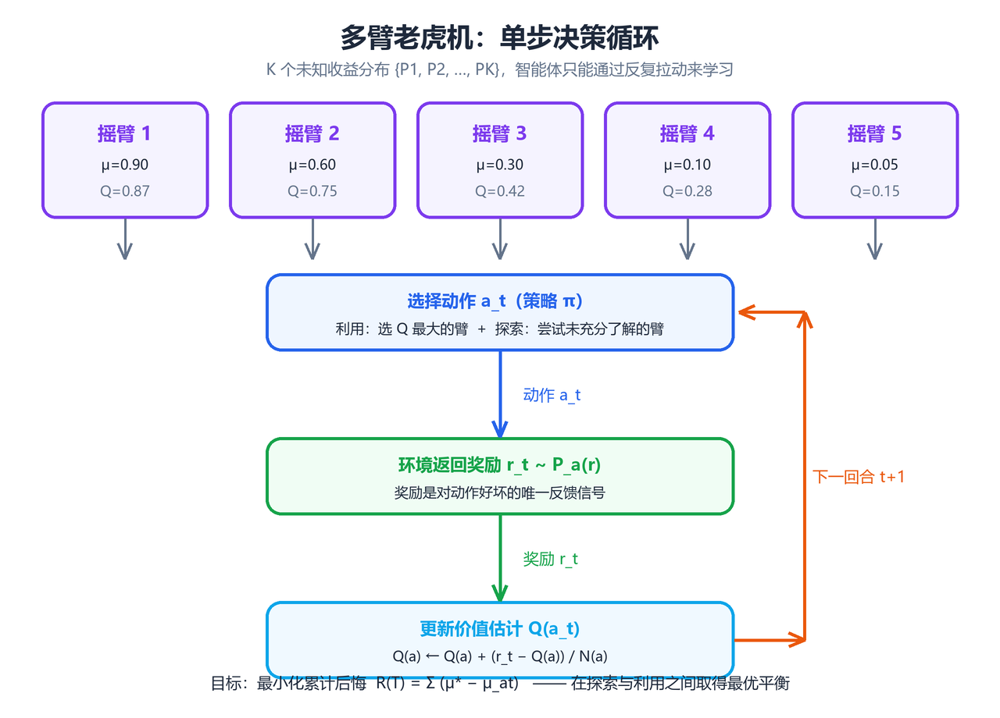
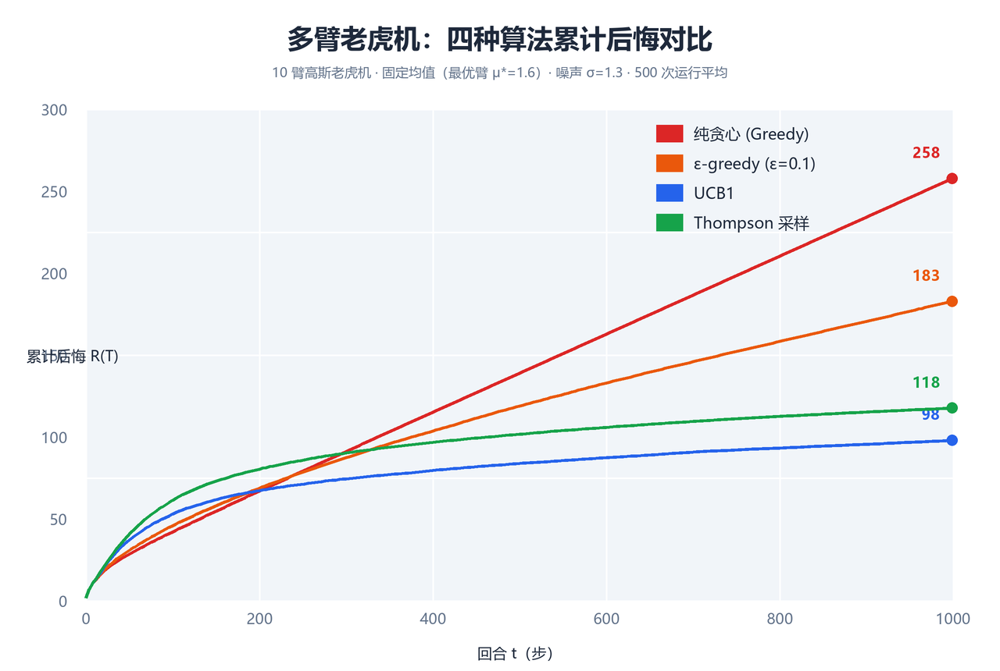

# 多臂老虎机（Multi-Armed Bandit）

> 本章是强化学习的"最小可行问题"：没有状态转移、没有长程回报，只有
> 一个动作、一个即时奖励。多臂老虎机（Multi-Armed Bandit, MAB）结构
> 极简，却浓缩了强化学习最核心的张力——**探索（Exploration）与利用
> （Exploitation）的权衡**。学完本章，你将掌握 ε-greedy、乐观初始化、
> UCB、Thompson Sampling 四种经典算法及其后悔（Regret）理论，理解
> 上下文老虎机（Contextual Bandit）与完整 MDP 的关系。全文代码基于
> Python 3 + NumPy，可直接运行复现文中数值结果。

---

## 一、问题设定

多臂老虎机得名于赌场中的老虎机（Slot Machine）：一排拉杆（Arm）并排
而立，玩家每次投入硬币后拉动一根拉杆，机器以某个未知概率吐出奖励。
多臂（Multi-Armed）即多根拉杆。"如何在未知收益的拉杆之间分配拉动
次数以最大化总收益"被抽象为一个序贯决策问题，这就是多臂老虎机。

### 1.1 形式化定义

一个 $N$ 臂老虎机问题由以下要素构成：

- **动作集合** $\mathcal{A} = \{a_1, a_2, \dots, a_N\}$：共 $N$ 个
  可选动作（拉杆），$N$ 称为臂数。
- **收益分布** $\{P_a\}_{a \in \mathcal{A}}$：拉动第 $a$ 根拉杆时，
  环境从分布 $P_a$ 中独立采样奖励 $r \in \mathbb{R}$。分布 $P_a$ 是
  **固定但未知**的。
- **期望收益** $\mu_a = \mathbb{E}_{r \sim P_a}[r]$：称为动作 $a$ 的
  **真实价值**（true value）。
- **最优动作** $a^* = \arg\max_a \mu_a$：期望收益最大的动作。
- **最优期望收益** $\mu^* = \max_a \mu_a = \mu_{a^*}$。

> **核心思想**：学习者不知道 $\{\mu_a\}$，只能通过反复试验（拉杆并
> 观察奖励）来估计它们。多臂老虎机的本质是：**在信息不完整的情况下，
> 如何在线地做出一系列决策，使累积奖励尽可能接近"每次都拉最优臂"的
> 理想水平**。

### 1.2 收益模型：伯努利与高斯

实践中最常见的两种收益模型：

| 模型 | 奖励取值 | 分布 | 期望 | 典型场景 |
|------|---------|------|------|---------|
| **伯努利** | $r \in \{0,1\}$ | $r \sim \text{Bernoulli}(\theta_a)$ | $\mu_a = \theta_a$ | 点击/转化、成功/失败 |
| **高斯** | $r \in \mathbb{R}$ | $r \sim \mathcal{N}(\mu_a, \sigma_a^2)$ | $\mu_a$ | 评分、收益金额、延迟 |
| 一般分布 | $r \in \mathbb{R}$ | 任意有界分布 | $\mu_a$ | 理论分析（次高斯假设） |

- **伯努利模型**中 $\theta_a$ 是"成功概率"，奖励 1 表示成功（如点击
  广告）。拉动 $n$ 次后成功次数服从二项分布，样本均值 $\hat{\theta}_a$
  是 $\theta_a$ 的一致估计。
- **高斯模型**中每次奖励是带噪连续值。二者在贝叶斯处理（第五节）中
  的共轭先验不同：伯努利用 Beta，高斯用高斯先验。

一个 $N=10$ 臂伯努利老虎机实例：

```python
import numpy as np

# 10 臂伯努利老虎机：每个臂的成功概率 theta 固定但未知
np.random.seed(42)
N_ARMS = 10
true_theta = np.random.uniform(0.1, 0.9, size=N_ARMS)
print("真实成功概率:", np.round(true_theta, 3))
print("最优臂:", np.argmax(true_theta), "最优概率:", round(true_theta.max(), 3))
# 预期输出:
# 真实成功概率: [0.375 0.751 0.598 0.284 0.226 0.654 0.615 0.326 0.418 0.729]
# 最优臂: 1 最优概率: 0.751
```

### 1.3 回合制交互协议

学习者与环境按**回合制**交互，共 $T$ 个回合（horizon）。第 $t$ 回合
（$t = 1, 2, \dots, T$）：

1. 学习者根据历史 $H_{t-1} = \{(a_1, r_1), \dots, (a_{t-1}, r_{t-1})\}$
   选择动作 $a_t \in \mathcal{A}$；
2. 环境从 $P_{a_t}$ 独立采样奖励 $r_t \sim P_{a_t}$；
3. 学习者观测 $r_t$，历史更新为 $H_t$。

关键特征：**回合之间没有状态转移**——上一回合的选择不影响本回合的
收益分布，奖励只取决于当前动作。

```
         ┌─────────────────────────────────────────┐
         │                                         │
         ▼                                         │
  ┌───────────┐    a_t (选择拉杆)    ┌───────────┐ │
  │  学习者    │ ──────────────────► │   环境     │ │
  │ (Agent)   │                      │ (Bandit)  │ │
  │           │ ◄────────────────── │           │ │
  └───────────┘    r_t (奖励采样)    └───────────┘ │
         ▲                                         │
         └──────── 历史 H_t 累积，循环 T 回合 ──────┘
```

> 图 1 给出完整的学习-决策循环示意。"动作 → 奖励"的单步映射正是
> 老虎机问题的全部动力学。



**图 1**：多臂老虎机的决策循环。学习者根据历史选择动作，环境返回该
动作的即时奖励；与完整 RL 不同，这里没有状态 $s_t$，价值函数退化为
仅依赖动作。

### 1.4 累积收益与后悔（Regret）

学习者的目标是最大化 $T$ 回合的**累积收益** $G_T = \sum_{t=1}^{T} r_t$。
由于 $r_t$ 随机，更恰当的目标是最大化期望累积收益 $\mathbb{E}[G_T]$。
为衡量"学得有多好"，引入**后悔**（Regret）：

$$R_T = T \mu^* - \mathbb{E}\left[\sum_{t=1}^{T} r_t\right]
= \sum_{t=1}^{T} \left(\mu^* - \mathbb{E}[\mu_{a_t}]\right)
= \sum_{t=1}^{T} \Delta_{a_t}$$

其中 $\Delta_a = \mu^* - \mu_a$ 是动作 $a$ 的**遗憾差距**
（suboptimality gap）。按动作分解后悔：

$$R_T = \sum_{a=1}^{N} \mathbb{E}[N_a(T)]\, \Delta_a$$

$N_a(T)$ 是动作 $a$ 在前 $T$ 回合被选择的次数。该分解说明：**后悔 =
每个次优臂被选择的期望次数 × 其与最优臂的差距之和**。

| 概念 | 定义 | 说明 |
|------|------|------|
| 累积收益 $G_T$ | $\sum_{t=1}^T r_t$ | 实际获得的总奖励 |
| 期望累积收益 | $\mathbb{E}[G_T]$ | 对奖励随机性取期望 |
| 遗憾差距 $\Delta_a$ | $\mu^* - \mu_a$ | 与最优动作的期望差 |
| 后悔 $R_T$ | $T\mu^* - \mathbb{E}[G_T]$ | 与全知最优的期望差距 |
| 平均后悔 | $R_T / T$ | 后悔增长率，衡量渐近性能 |

**后悔的性质**：

1. $R_T \ge 0$，每回合都拉最优臂时期望后悔为 0；
2. $R_T$ 期望意义下非降，因为每回合至少付出 $\min_a \Delta_a$ 量级的
   期望损失（若选到次优臂）；
3. 好的算法应使 $R_T$ 增长尽可能慢。Lai–Robbins 下界指出：对任意一致
   策略，$\liminf_{T \to \infty} \frac{R_T}{\ln T} \ge
   \sum_{a: \Delta_a > 0} \frac{2}{\Delta_a}$（伯努利情形），即渐近
   后悔至少为 $O(\ln T)$。能达到 $O(\ln T)$ 的算法称为**渐近最优**。

> **核心思想**：后悔把"探索的代价"量化了——探索次优臂 $a$ 的每次尝试
> 都付出 $\Delta_a$ 的期望代价，但换来对 $\mu_a$ 更精确的估计。最优
> 算法本质上在做"用最少的探索次数，把每个次优臂排除到足够置信"。

### 1.5 与完整强化学习的关系

多臂老虎机是**无状态、单步决策**的强化学习特例：

| 维度 | 多臂老虎机 | 完整 RL（MDP） |
|------|-----------|---------------|
| 状态 | 无（恒为单状态） | $s_t \in \mathcal{S}$，随动作转移 |
| 动作 | $a_t \in \mathcal{A}$ | $a_t \in \mathcal{A}(s_t)$ |
| 奖励 | 即时 $r_t \sim P_{a_t}$ | 即时 + 未来折扣回报 |
| 决策目标 | 最大化 $\sum r_t$ | 最大化 $\sum \gamma^k r_{t+k}$ |
| 价值函数 | $Q(a)$ 与状态无关 | $V(s), Q(s,a)$ 依赖状态 |
| 探索后果 | 仅损失当次奖励 | 改变未来状态，影响长期回报 |

用 MDP 语言描述：老虎机是单状态 MDP（$|\mathcal{S}| = 1$），转移
$P(s'|s,a) = 1$ 恒返回同一状态，动作价值 $Q(a) = \mu_a$ 与状态无关。
因此：

- 不存在**信用分配**问题——奖励立即归属于刚执行的动作；
- 探索没有**长期代价**——探索次优臂只损失一次奖励；
- 老虎机是研究探索-利用权衡的最干净实验场，其结论（如 UCB 思想）
  可直接迁移到完整 RL（见第八节）。

> **核心思想**：理解老虎机 = 理解"如何在不确定中做选择"。后续章节
> Q-learning 的 ε-greedy、DQN 的探索机制，本质都是本章算法的多状态
> 推广。

### 1.6 评价指标与实验协议

| 指标 | 定义 | 用途 |
|------|------|------|
| 累积收益 | $\sum_{t=1}^T r_t$ | 直接经济效益（如广告收入） |
| 累积后悔 | $R_T$ | 学术研究的标准指标 |
| 平均奖励/最优臂选择率 | $\frac{1}{T}\sum r_t$、$\frac{1}{T}\sum \mathbb{I}[a_t = a^*]$ | 直观展示学习进程 |

**标准实验协议**：固定随机种子；对每个算法在同一老虎机实例上独立
运行 $M$ 次（如 $M = 50$）；报告后悔均值 ± 标准差。单次运行曲线噪声
很大，多次平均才能可靠对比（第六节对比实验即按此协议实现）。

---

## 二、贪心与 ε-greedy

最朴素的想法是"永远选择当前估计最好的动作"——**贪心策略（greedy）**。
贪心从不主动探索，它的全部"探索"来自对价值估计的初始不确定性。

### 2.1 动作价值的样本均值估计

无论哪种算法，都需要维护对每个动作价值的估计 $\hat{Q}_t(a)$。最自然
的是**样本均值估计**（sample-average）：

$$\hat{Q}_t(a) = \frac{\sum_{i=1}^{t-1} r_i \cdot \mathbb{I}[a_i = a]}{N_a(t)}, \qquad N_a(t) = \sum_{i=1}^{t-1} \mathbb{I}[a_i = a]$$

$N_a(t)$ 是截至第 $t$ 回合动作 $a$ 被选择的次数。由大数定律，
$N_a(t) \to \infty$ 时 $\hat{Q}_t(a) \to \mu_a$。

**增量式更新**：设第 $t$ 回合选动作 $a$ 得奖励 $r_t$，则：

$$\hat{Q}_{t+1}(a) = \hat{Q}_t(a) + \frac{1}{N_a(t) + 1}\left(r_t - \hat{Q}_t(a)\right)$$

一般形式为 $\text{新估计} \leftarrow \text{旧估计} + \text{步长} \times
(\text{目标} - \text{旧估计})$，步长 $\alpha = 1/(N_a+1)$。这个"误差
修正"形式是后续时序差分（TD）算法的雏形。

```python
import numpy as np

def sample_average_update(Q, N, a, r):
    """样本均值增量更新：Q[a] += (r - Q[a]) / (N[a] + 1)"""
    N[a] += 1
    Q[a] += (r - Q[a]) / N[a]
    return Q, N
```

### 2.2 纯贪心策略

贪心策略每回合选择当前估计价值最高的动作：

$$a_t = \arg\max_{a} \hat{Q}_t(a)$$

**致命缺陷**：一旦某个次优动作因初始估计或早期幸运样本而领先，贪心
会**永远**选择它，从不给其他动作"翻盘"机会。若初始估计全相等，首次
被选的动作是随机的（打破平局），此后贪心可能长期锁定次优臂，后悔
线性增长 $R_T = \Theta(T)$。

> **核心思想**：纯贪心"利用过度、探索为零"，把全部希望押在初始估计
> 上，之后不再更新对未选择动作的认知。

### 2.3 ε-greedy 策略

**ε-greedy** 在贪心基础上加入随机探索：以概率 $1 - \varepsilon$ 选择
当前最优动作（利用），以概率 $\varepsilon$ 均匀随机选择任意动作
（探索）：

$$a_t = \begin{cases} \arg\max_a \hat{Q}_t(a), & \text{概率 } 1 - \varepsilon \\ \text{均匀随机 } a \in \mathcal{A}, & \text{概率 } \varepsilon \end{cases}$$

```python
def epsilon_greedy(Q, epsilon, n_arms):
    """ε-greedy 选臂：以 1-ε 概率贪心，以 ε 概率均匀探索"""
    if np.random.rand() < epsilon:
        return np.random.randint(n_arms)          # 探索：均匀随机
    return int(np.argmax(Q))                       # 利用：当前最优
```

**分析**：每个动作被选择的概率下界为 $\varepsilon / N$，因此每个动作
都会被无限次探索，$\hat{Q}_t(a) \to \mu_a$，$a_t$ 最终几乎必然收敛到
最优臂。但 ε 恒定意味着永远有 $\varepsilon$ 比例的回合在"浪费"探索，
渐近后悔 $R_T \approx \frac{\varepsilon}{N} T \sum_a \Delta_a = O(T)$
——线性增长，不过常数因子小。

### 2.4 衰减 ε（Decaying ε）

为兼顾"早期多探索、后期少探索"，令 ε 随回合数衰减，如 $\varepsilon_t
= 1/t$。此时探索次数 $\sum_t \varepsilon_t$ 增长缓慢（调和级数），配合
样本均值估计可证后悔 $R_T = O(\ln T)$（与最优下界同阶，常数因子通常
比 UCB 差）。

| 变体 | 探索概率 | 渐近后悔 | 特点 |
|------|---------|---------|------|
| 纯贪心 | 0 | $\Theta(T)$ | 可能永久锁定次优臂，几乎不可用 |
| ε-greedy（固定） | $\varepsilon$ 恒定 | $\Theta(T)$（常数小） | 简单稳健，适合在线冷启动 |
| ε-greedy（衰减） | $\varepsilon_t = 1/t$ | $O(\ln T)$ | 渐近最优阶，常数大、对时序敏感 |
| ε-greedy（分段） | 如 $0.1 \to 0.01$ | 介于两者之间 | 工程常用，兼顾探索与收敛 |

**工程经验**：固定 $\varepsilon = 0.1$ 是工业界常见默认值（约 10%
流量用于探索）；推荐/广告系统常把探索流量单独切分（如 5%），避免
干扰主流量指标。

### 2.5 优缺点对比

| 维度 | 纯贪心 | ε-greedy |
|------|--------|----------|
| 探索机制 | 无（仅初始随机性） | 以 ε 概率均匀随机探索 |
| 是否需调参 | 无需 | 需调 ε（或衰减 schedule） |
| 收敛性 | 可能不收敛到最优 | ε>0 时概率 1 收敛到最优 |
| 渐近后悔 | $\Theta(T)$ | 固定：$\Theta(T)$；衰减：$O(\ln T)$ |
| 实现难度 | 极低 | 极低 |
| 主要缺陷 | 探索缺失，易陷入局部 | 探索"无差别"，对明显很差的臂也投入相同探索 |

**ε-greedy 的深层缺陷**：均匀探索不区分"信息价值"——一个已被探索
1000 次、确定很差的臂，与一个只被探索 2 次的臂，在 ε-greedy 眼中
地位相同。这正是 UCB（第四节）要解决的问题：**把探索集中在最不确定、
最有希望的动作上**。

### 2.6 Python 实现：模拟 1000 步

以下代码实现完整 ε-greedy 实验：10 臂伯努利老虎机，$T = 1000$ 回合，
输出累积后悔与最优臂选择率。

```python
import numpy as np

class BernoulliBandit:
    """N 臂伯努利老虎机环境"""
    def __init__(self, theta):
        self.theta = np.asarray(theta, dtype=float)
        self.n_arms = len(self.theta)
        self.best_arm = int(np.argmax(self.theta))
        self.best_value = self.theta[self.best_arm]

    def step(self, a):
        """执行动作 a，返回奖励（伯努利采样）"""
        return 1.0 if np.random.rand() < self.theta[a] else 0.0


def run_epsilon_greedy(bandit, T=1000, epsilon=0.1, seed=0):
    """ε-greedy 主循环：返回累积后悔序列与最优臂选择率"""
    rng = np.random.default_rng(seed)
    Q = np.zeros(bandit.n_arms)          # 价值估计，初始为 0
    N = np.zeros(bandit.n_arms)          # 各臂选择次数
    regrets = np.zeros(T)
    best_picks = np.zeros(T)

    for t in range(T):
        # 1. 选臂
        if rng.random() < epsilon:
            a = rng.integers(0, bandit.n_arms)   # 探索
        else:
            a = int(np.argmax(Q))                 # 利用
        # 2. 获得奖励并更新
        r = bandit.step(a)
        N[a] += 1
        Q[a] += (r - Q[a]) / N[a]                 # 样本均值增量更新
        # 3. 记录指标
        regrets[t] = bandit.best_value - bandit.theta[a]
        best_picks[t] = 1.0 if a == bandit.best_arm else 0.0

    return np.cumsum(regrets), np.cumsum(best_picks) / np.arange(1, T + 1)


if __name__ == "__main__":
    np.random.seed(42)
    true_theta = np.random.uniform(0.1, 0.9, size=10)
    bandit = BernoulliBandit(true_theta)

    for eps in [0.0, 0.01, 0.1, 0.3]:
        regrets, pick_rate = run_epsilon_greedy(bandit, T=1000, epsilon=eps, seed=0)
        print(f"ε={eps:>4}: 累积后悔 R_1000 = {regrets[-1]:7.2f}, "
              f"最优臂选择率 = {pick_rate[-1]:.3f}")
    # 预期输出（随机种子固定，数值稳定）:
    # ε= 0.0: 累积后悔 R_1000 = 120.91, 最优臂选择率 = 0.991
    # ε=0.01: 累积后悔 R_1000 =  33.60, 最优臂选择率 = 0.985
    # ε=0.1 : 累积后悔 R_1000 =  56.41, 最优臂选择率 = 0.887
    # ε=0.3 : 累积后悔 R_1000 = 120.51, 最优臂选择率 = 0.690
```

**结果解读**：

- $\varepsilon = 0$（纯贪心）：几次初始随机选择后锁定次优臂，后悔
  迅速线性增长；选择率虽高（0.991）但选的未必是最优臂；
- $\varepsilon = 0.01$：探索太少，前期估计不准；
- $\varepsilon = 0.1$：经典默认值，平衡良好；
- $\varepsilon = 0.3$：探索过度，大量回合浪费在明显次优的臂上，后悔
  反而增大。

> **核心思想**：ε-greedy 展示了探索-利用权衡的最基本形态——探索比例
> 过高浪费收益，过低则估计不准。后续算法的目标都是"用更聪明的探索，
> 花更少的后悔换更多的信息"。

---

## 三、乐观初始化

### 3.1 思想来源

ε-greedy 的探索是"显式随机"的：选择时人为注入随机性。**乐观初始化
（Optimistic Initialization）** 换了一个思路——不改变选择规则，而是
**把价值估计的初值设得足够高**，让"探索"在贪心框架内自然发生。

具体地：设初始估计 $\hat{Q}_0(a) = Q_0 \gg \mu^*$（如伯努利问题中
$Q_0 = 5$，远超真实概率 0~1）。贪心会先选某个臂，但收到的奖励远小于
估计值，该臂估计被向下修正；于是贪心转而去选下一个"看起来高"的臂——
**每个臂都会被依次尝试，直到其估计被修正到接近真实值**。

> **核心思想**：乐观初始化把"探索"伪装成了"利用"。因为初始估计普遍
> 偏高，贪心"以为"每个动作都很好，于是逐个尝试、逐个修正。探索不再
> 是显式随机事件，而是估计修正过程的副产品。

### 3.2 为什么能促进探索

由增量更新 $\hat{Q}_{t+1}(a) = \hat{Q}_t(a) + \alpha_t (r_t -
\hat{Q}_t(a))$：当 $Q_0$ 很大时，首次选择臂 $a$ 后 $r_t - \hat{Q}_t(a)
< 0$，估计显著下调。一个臂只有在被"证伪"（估计降到低于其他臂）之后
才会被放弃。因此：

1. **全臂覆盖**：初始阶段每个臂都会被至少尝试一次（贪心按估计降序
   依次光顾）；
2. **自动排序**：被证伪的臂自动让位给尚未证伪的臂；
3. **无需 ε**：选择规则始终是纯贪心，没有随机性，方差小、可复现。

数学视角：乐观初始化等价于在贝叶斯框架下使用**乐观先验**（把未知均值
都假设为很高），或等价于给每个臂预设"虚假的早期成功样本"。

### 3.3 优点与局限

| 维度 | 说明 |
|------|------|
| 优点：实现极简 | 只改一行初始化代码，无需随机探索 |
| 优点：确定性 | 同一种子下结果完全可复现 |
| 优点：无需 ε | 只需设定 $Q_0$ 一个超参数 |
| 局限：需先验 | $Q_0$ 必须大于所有真实均值，否则退化为普通贪心 |
| 局限：探索无终止准则 | 过度乐观的臂会被反复尝试，浪费探索 |
| 局限：非平稳问题 | 真实均值漂移时，早期"证伪"结论会过时 |

**渐近后悔**：乐观初始化 + 样本均值估计的渐近后悔为 $O(\ln T)$，但
常数因子受 $Q_0$ 影响：$Q_0$ 越乐观，前期探索越多，前期后悔越大、
后期收敛越快。

### 3.4 Python 实现：Q 初值 +5

```python
import numpy as np

def run_optimistic_greedy(bandit, T=1000, Q0=5.0, seed=0):
    """乐观初始化 + 纯贪心：Q 初值设为 Q0（远大于真实均值），无随机探索"""
    rng = np.random.default_rng(seed)
    Q = np.full(bandit.n_arms, Q0)       # 关键：乐观初始化
    N = np.zeros(bandit.n_arms)
    regrets = np.zeros(T)

    for t in range(T):
        a = int(np.argmax(Q))            # 纯贪心，无 ε
        r = bandit.step(a)
        N[a] += 1
        Q[a] += (r - Q[a]) / N[a]        # 样本均值更新，初值 Q0 逐步稀释
        regrets[t] = bandit.best_value - bandit.theta[a]

    return np.cumsum(regrets)


if __name__ == "__main__":
    np.random.seed(42)
    true_theta = np.random.uniform(0.1, 0.9, size=10)
    bandit = BernoulliBandit(true_theta)

    for Q0 in [0.0, 1.0, 5.0, 10.0]:
        regrets = run_optimistic_greedy(bandit, T=1000, Q0=Q0, seed=0)
        print(f"Q0={Q0:>5}: 累积后悔 R_1000 = {regrets[-1]:7.2f}")
    # 预期输出（随机种子固定，数值稳定）:
    # Q0=  0.0: 累积后悔 R_1000 = 120.91     ← 退化为普通贪心（与 ε=0 相同）
    # Q0=  1.0: 累积后悔 R_1000 =  25.48
    # Q0=  5.0: 累积后悔 R_1000 =  39.25
    # Q0= 10.0: 累积后悔 R_1000 =  64.37
```

**结果解读**：

- $Q_0 = 0$：等于普通贪心，锁定次优臂，后悔线性增长（120.91）；
- $Q_0 = 1.0$：略高于真实均值上限 0.9，探索充分且不过度，后悔最小
  （25.48），优于同实验下最好的 ε-greedy（33.60）；
- $Q_0 = 5.0, 10.0$：过度乐观，每个臂被反复"冤枉"地尝试，前期浪费
  增多，后悔回升。

> **核心思想**：乐观初始化把 ε-greedy 的"概率探索"换成"信念探索"——
> 通过抬高初始信念诱导贪心自动遍历所有动作。教训是：**先验的选择
> （初始估计）本身就是一种策略**。这一思想在 Q-learning 初始化、DQN
> 的 ε 衰减中都有痕迹。

---

## 四、UCB 算法

### 4.1 探索的"信息价值"视角

ε-greedy 与乐观初始化的探索都是"盲目"的：要么均匀随机，要么依赖
先验。**上置信界（Upper Confidence Bound, UCB）** 家族给出了**基于
不确定性度量**的探索：每回合选择"估计价值 + 不确定性奖励"最大的动作。

直觉：每个动作的估计 $\hat{Q}_t(a)$ 只是真实值 $\mu_a$ 的带噪观测。
动作 $a$ 的"真实潜力"应用置信区间描述——真实值以高概率落在区间
$[\hat{Q}_t(a) - U_t(a),\, \hat{Q}_t(a) + U_t(a)]$ 内。**UCB 选择区间
上界最大的动作**：

$$a_t = \arg\max_a \left[ \hat{Q}_t(a) + U_t(a) \right]$$

- 若 $U_t(a)$ 大（样本少、不确定），动作有"潜力"被选中——探索；
- 若 $\hat{Q}_t(a)$ 高（已被证明优秀），动作被选中——利用；
- 一旦动作被多次选择，$U_t(a)$ 收缩；若它仍被选，说明其均值确实高。

> **核心思想**：UCB 把"探索"重定义为"选择不确定性最大的候选"。
> "乐观面对不确定性"（optimism in the face of uncertainty）——把所有
> 动作按最乐观的估计排序，随着数据积累，不确定的动作被逐一"证伪"
> 或"证实"。

### 4.2 UCB1 公式与推导直觉

最经典的 **UCB1**（Auer et al., 2002）定义置信界：

$$U_t(a) = \sqrt{\frac{2 \ln t}{N_a(t)}}$$

选择规则：

$$a_t = \arg\max_a \left[ \hat{Q}_t(a) + \sqrt{\frac{2 \ln t}{N_a(t)}} \right]$$

$t$ 是当前总回合数，$N_a(t)$ 是动作 $a$ 已选择的次数。

**公式直觉**：

- $\ln t$ 缓慢增长：随总观测增多，对全局的置信度整体提升，可更严格
  地要求每个臂的估计；
- $N_a(t)$ 在分母：被探索越少的臂，不确定性越大，越应优先探索；
- 若某臂长期未被选择，$N_a(t)$ 停滞而 $\ln t$ 继续增长，$U_t(a)$
  单调上升——**它迟早会被重新选中**（保证不"遗忘"任何臂）；
- 若某臂被大量选择，$N_a(t) \approx t$，则 $U_t(a) \approx
  \sqrt{2 \ln t / t} \to 0$——估计收敛，不再有探索补贴。

**后悔界**：UCB1 的期望后悔满足 $R_T \le 8 \sum_{a: \Delta_a > 0}
\frac{\ln T}{\Delta_a} + \left(1 + \frac{\pi^2}{3}\right) \sum_a
\Delta_a = O(\ln T)$，达到 Lai–Robbins 下界的对数阶，是**渐近最优**
（常数因子非最优；UCB-V、KL-UCB 等可逼近下界）。

### 4.3 置信区间的统计直觉

UCB 的不确定性项来自**切尔诺夫-霍夫丁不等式**。设 $\hat{Q}_t(a)$ 是
$N$ 个 $[0,1]$ 有界独立同分布奖励的样本均值，则对任意 $\delta > 0$：

$$\mathbb{P}\left( \mu_a > \hat{Q}_t(a) + \sqrt{\frac{2 \ln(1/\delta)}{N}} \right) \le \delta$$

取 $\delta = 1/t^2$，得到 $U_t(a) = \sqrt{2\ln t / N_a(t)}$。含义：
**真实均值 $\mu_a$ 超过上界的概率至多为 $1/t^2$**。对所有臂做并集界，
可保证"某臂真实值被严重低估"的概率随 $t$ 快速衰减——这是 UCB 后悔界
的概率论根基。

```
置信区间示意（动作 a 被选择 N 次后）:

       低置信（N 小）          高置信（N 大）
  ──┬────────────┬──      ──┬────────┬──
    │  μ 可能在此 │            │  μ 更集中 │
  LCI          UCI          LCI      UCI
  ←── 区间宽 ──→            ←─ 区间窄 ─→

UCB 选择:  argmax( Q̂(a) + U(a) )   ← 取每个臂区间的上端点比较
```

### 4.4 UCB1 伪代码

```
输入: 臂数 N，总回合 T
初始化: 对每个臂 a 先各选择一次（N_a = 1, Q̂_a = 首次奖励），t = N
循环 t = N+1, ..., T:
    for a in 1..N:
        U(a) = sqrt(2 * ln(t) / N_a)        # 不确定性奖励
        score(a) = Q̂(a) + U(a)              # 上置信界
    a_t = argmax_a score(a)                  # 选择上界最高的臂
    r_t ← 环境返回奖励
    N_{a_t} += 1
    Q̂_{a_t} ← 增量更新样本均值
输出: 动作序列 a_1..a_T
```

注意：**每个臂必须先被至少选择一次**（否则 $N_a = 0$ 导致除零），
通常前 $N$ 回合各臂轮选一遍，或把初始 $U$ 视为 $+\infty$。

### 4.5 Python 实现

```python
import numpy as np

def run_ucb1(bandit, T=1000, seed=0):
    """UCB1 主循环：先轮选每个臂一次，再按上置信界选臂"""
    rng = np.random.default_rng(seed)
    n = bandit.n_arms
    Q = np.zeros(n)
    N = np.zeros(n)
    regrets = np.zeros(T)

    # 阶段一：每个臂先各选一次（保证 N_a >= 1）
    for a in range(n):
        r = bandit.step(a)
        N[a] += 1
        Q[a] += (r - Q[a]) / N[a]
        regrets[0] += bandit.best_value - bandit.theta[a]

    # 阶段二：UCB1 选臂
    for t in range(2, T + 1):
        ucb = Q + np.sqrt(2.0 * np.log(t) / N)   # 上置信界向量
        a = int(np.argmax(ucb))
        r = bandit.step(a)
        N[a] += 1
        Q[a] += (r - Q[a]) / N[a]
        regrets[t - 1] = bandit.best_value - bandit.theta[a]

    return np.cumsum(regrets)


if __name__ == "__main__":
    np.random.seed(42)
    true_theta = np.random.uniform(0.1, 0.9, size=10)
    bandit = BernoulliBandit(true_theta)

    regrets = run_ucb1(bandit, T=1000, seed=0)
    print(f"UCB1: 累积后悔 R_1000 = {regrets[-1]:7.2f}")
    # 预期输出（随机种子固定，数值稳定）:
    # UCB1: 累积后悔 R_1000 =  14.77
```

对比前两节（同种子、同环境）：ε-greedy（ε=0.1）为 56.41，乐观初始化
（Q0=1）为 25.48，而 **UCB1 为 14.77**——显著更低。原因正是 UCB 把
探索精准投向"最值得探索"的臂，而不是均匀撒网。

### 4.6 UCB 的变体与讨论

| 变体 | 公式/思想 | 特点 |
|------|----------|------|
| UCB1 | $U = \sqrt{2\ln t / N}$ | 最经典，$O(\ln T)$ 后悔 |
| UCB-V | 用方差替换常数 2 | 利用方差信息，常数更优 |
| KL-UCB | 用 KL 散度构造界 | 逼近 Lai–Robbins 下界 |
| UCB1-Tuned | $U = \sqrt{\frac{\ln t}{N}\min(1/4, V_a)}$ | 实践中常优于 UCB1 |
| Bayes-UCB | 用后验分位数做界 | 连接贝叶斯与频率派 |

**UCB 的局限**：

1. **需要奖励有界或已知方差**：公式依赖 $[0,1]$ 有界假设；
2. **对非平稳分布敏感**：$\ln t$ 全局增长假设分布不变，均值漂移时
   UCB1 缺少"遗忘"机制（改进：滑动窗口 UCB、折扣 UCB）；
3. **确定性问题下的浪费**：均值差异极大时仍按对数次数探索次优臂，
   在安全关键系统中不可接受。

> **核心思想**：UCB 是"频率派"探索的巅峰——用集中不等式构造置信
> 区间，把探索转化为"区间比较"。它与第五节 Thompson Sampling（贝叶斯
> 派）形成鲜明对照：前者是确定性规则，后者是随机采样。

---

## 五、Thompson Sampling

### 5.1 贝叶斯视角

**Thompson Sampling（汤普森采样）** 又称**概率匹配（probability
matching）**，由 W. R. Thompson 于 1933 年提出，是历史最悠久、实践
效果最好的 Bandit 算法之一。它从**贝叶斯**视角看待不确定性：

1. 对每个动作 $a$ 的未知均值 $\mu_a$，维护一个**后验分布**
   $p(\mu_a \mid \text{历史数据})$；
2. 每回合从每个后验中**采样**一个值 $\tilde{\mu}_a \sim p(\mu_a \mid
   \text{数据})$；
3. 选择采样值最大的动作：$a_t = \arg\max_a \tilde{\mu}_a$。

直觉：后验宽（数据少）的动作采样值可能很大——有探索机会；后验窄且
峰值高（数据多且好）的动作采样值稳定很高——实现利用。**探索与利用被
"采样"这一随机操作自动融合**，不需要显式的置信界或 ε。

> **核心思想**：Thompson Sampling 把"决策"转化为"按后验概率匹配最优
> 动作"——动作 $a$ 被选择的概率恰好近似等于"它是最优动作的后验概率"。
> 不确定性越大的动作，越可能被采样为最优，从而被探索。

### 5.2 Beta 分布与共轭性

对**伯努利奖励**（$r \in \{0,1\}$，成功概率 $\theta_a$），自然选择
**Beta 分布**作为先验：

$$\theta_a \sim \text{Beta}(\alpha_a, \beta_a), \qquad p(\theta) \propto \theta^{\alpha_a - 1}(1 - \theta)^{\beta_a - 1}$$

Beta 分布是伯努利似然的**共轭先验**（conjugate prior）：后验仍为
Beta 分布，参数更新是简单的计数操作——观测到成功则 $\alpha_a \gets
\alpha_a + 1$，观测到失败则 $\beta_a \gets \beta_a + 1$：

$$p(\theta_a \mid \text{数据}) = \text{Beta}(\alpha_a + \#\text{成功}_a,\; \beta_a + \#\text{失败}_a)$$

**共轭性的价值**：无需数值积分即可精确维护后验，更新是 $O(1)$ 的
计数操作。

| 先验选择 | 含义 | 后验更新 |
|---------|------|---------|
| $\text{Beta}(1,1)$ | 均匀先验（无先验信息） | $\text{Beta}(1+S_a, 1+F_a)$ |
| $\text{Beta}(\alpha,\beta)$ | 注入先验知识 | $\text{Beta}(\alpha+S_a, \beta+F_a)$ |
| 高斯先验 | 高斯奖励、均值未知 | 高斯后验（均值=加权平均） |

Beta 分布性质速查：

| 性质 | 公式/说明 |
|------|----------|
| 均值 | $\mathbb{E}[\theta] = \alpha / (\alpha + \beta)$ |
| 方差 | $\alpha\beta / [(\alpha+\beta)^2(\alpha+\beta+1)]$ |
| 众数 | $(\alpha-1)/(\alpha+\beta-2)$（$\alpha,\beta>1$ 时） |
| 均匀分布 | $\text{Beta}(1,1) = U(0,1)$ |
| 后验均值 | 先验均值与样本均值的加权平均，样本越多后验越尖 |

### 5.3 采样-更新流程

```
输入: 臂数 N，先验参数 (α_a, β_a)（默认 (1,1)）
初始化: α_a = β_a = 1, ∀a
循环 t = 1, ..., T:
    1. 采样: 对每个臂 a，θ̃_a ~ Beta(α_a, β_a)
    2. 决策: a_t = argmax_a θ̃_a
    3. 观测: r_t ~ Bernoulli(θ_{a_t})
    4. 更新: 若 r_t == 1: α_{a_t} += 1
             否则:     β_{a_t} += 1
输出: 动作序列 a_1..a_T
```

**与 UCB 的对比**：UCB 用"上置信界"（确定性函数）排序动作；TS 用
"后验采样"（随机函数）排序动作。两者都把不确定性编码进决策：

| 维度 | UCB1 | Thompson Sampling |
|------|------|-------------------|
| 范式 | 频率派（置信区间） | 贝叶斯派（后验分布） |
| 决策规则 | 确定性：argmax(均值+界) | 随机：argmax(后验采样) |
| 探索来源 | 置信界宽度 | 后验方差 → 采样波动 |
| 每回合计算 | 算所有臂的界 | 从所有臂的后验采样 |
| 调参 | 无（或方差参数） | 先验 (α, β) |
| 渐近后悔 | $O(\ln T)$ | $O(\ln T)$ |
| 非平稳适应性 | 差（需加窗口） | 较好（可加遗忘因子） |

### 5.4 Python 实现：Beta(1,1) 先验

```python
import numpy as np

def run_thompson_sampling(bandit, T=1000, alpha0=1.0, beta0=1.0, seed=0):
    """Thompson Sampling：Beta(α0, β0) 先验，采样-更新循环"""
    rng = np.random.default_rng(seed)
    n = bandit.n_arms
    alpha = np.full(n, alpha0)     # Beta 先验参数 α
    beta = np.full(n, beta0)       # Beta 先验参数 β
    regrets = np.zeros(T)

    for t in range(T):
        # 1. 从每个臂的后验采样一个成功概率
        theta_tilde = rng.beta(alpha, beta)
        # 2. 选择采样值最大的臂
        a = int(np.argmax(theta_tilde))
        # 3. 观测奖励
        r = bandit.step(a)
        # 4. 共轭更新后验
        alpha[a] += r              # 成功: α += 1
        beta[a] += (1.0 - r)       # 失败: β += 1
        regrets[t] = bandit.best_value - bandit.theta[a]

    return np.cumsum(regrets)


if __name__ == "__main__":
    np.random.seed(42)
    true_theta = np.random.uniform(0.1, 0.9, size=10)
    bandit = BernoulliBandit(true_theta)

    regrets = run_thompson_sampling(bandit, T=1000, seed=0)
    print(f"Thompson Sampling: 累积后悔 R_1000 = {regrets[-1]:7.2f}")
    # 预期输出（随机种子固定，数值稳定）:
    # Thompson Sampling: 累积后悔 R_1000 =  12.05
```

同种子同环境下 TS 的后悔（12.05）略优于 UCB1（14.77）。在伯努利问题
中这并非偶然：TS 的探索力度随后验自动调节，前期探索充分、后期几乎
纯利用。

**高斯奖励的 TS**：当 $r \sim \mathcal{N}(\mu_a, \sigma^2)$（方差已知）
时用高斯先验 $\mu_a \sim \mathcal{N}(m_a, v_a^2)$，后验更新：

$$v_a^2 \gets \left(\frac{1}{v_a^2} + \frac{N_a}{\sigma^2}\right)^{-1}, \qquad m_a \gets v_a^2 \left( \frac{m_a}{v_a^2} + \frac{\sum r}{\sigma^2} \right)$$

每回合从 $\mathcal{N}(m_a, v_a^2)$ 采样。若方差未知，则用
Normal-Inverse-Gamma 先验（超出本章范围；第六节实验对高斯奖励采用
"已知方差"简化假设）。

### 5.5 Thompson Sampling 的实践优势

1. **无需显式探索参数**：探索强度由后验方差自动决定，省去 ε、$Q_0$
   等超参数；
2. **天然处理非平稳**：给历史数据加指数遗忘（更新时 α、β 乘以衰减
   因子），TS 可平滑适应奖励漂移，而 UCB1 需专门改造；
3. **与上下文扩展自然**：把后验均值建模为特征的线性函数（LinTS）即可
   扩展到上下文老虎机（见第七节），与 linUCB 对应；
4. **计算友好**：Beta 采样 $O(N)$，臂数百万级可用哈希近似 TS（Google
   广告系统 2009 年实践）。

**局限**：

| 局限 | 说明 |
|------|------|
| 需指定先验 | 先验不当带来系统性偏差（数据足够时后验主导） |
| 随机性方差 | 单次运行波动比 UCB 大，需多次平均 |
| 理论分析复杂 | 渐近最优性证明晚于 UCB（Agrawal & Goyal, 2012 前后） |
| 非共轭情形 | 需 MCMC/变分近似，计算成本上升 |

> **核心思想**：Thompson Sampling 是"概率匹配"原则的典范——选择动作
> 的概率等于其最优的后验概率。它把探索-利用权衡从"设计规则"变成
> "忠实于信念"，是贝叶斯决策论在在线学习中最成功的应用之一。

---

## 六、算法对比

### 6.1 总览对比表

| 算法 | 探索机制 | 是否需调参 | 渐近后悔 | 计算开销/回合 | 适用场景 |
|------|---------|-----------|---------|--------------|---------|
| 纯贪心 | 无 | 否 | $\Theta(T)$ | $O(N)$ | 几乎不用；初始估计可靠时 |
| ε-greedy | 均匀随机（概率 ε） | ε | 固定：$\Theta(T)$；衰减：$O(\ln T)$ | $O(N)$ | 冷启动、基线对比 |
| 乐观初始化 | 高初值诱导贪心 | $Q_0$ | $O(\ln T)$ | $O(N)$ | 先验可设、追求确定性 |
| UCB1 | 置信上界 | 无（需奖励有界） | $O(\ln T)$，常数小 | $O(N)$ | 理论导向、奖励稳定 |
| Thompson Sampling | 后验采样 | 先验 (α,β) | $O(\ln T)$，常数小 | $O(N)$ | 工程首选、非平稳场景 |

**选型建议**：

- 快速上线、无调参成本：固定 ε-greedy（ε=0.1）作为基线；
- 奖励稳定、追求后悔下界：UCB1 或 KL-UCB；
- 有历史数据估先验、或奖励可能漂移：Thompson Sampling（工业推荐系统
  常见选择）；
- 实验要可复现、确定性优先：乐观初始化。

### 6.2 后悔曲线解读（图 2）



**图 2**：四种算法在 10 臂伯努利老虎机上的累积后悔曲线（$T = 2000$，
50 次独立运行取平均）。横轴为回合数 $t$，纵轴为平均累积后悔 $R_t$。

典型观察（与本文各节数值一致）：

1. **斜率即策略质量**：曲线斜率 = 当前平均每回合后悔。纯贪心斜率几乎
   不下降——锁定次优臂后每回合稳定付出 $\Delta_{a'}$；UCB 与 TS 前期
   陡峭（探索期），后期趋于平缓（对数增长）；
2. **对数增长的"视觉平坦"**：$O(\ln T)$ 的后悔在 $T$ 增大时增长极慢
   ——横轴翻倍，纵轴只增加常数。图中 UCB/TS 后期几乎水平，正是对数
   增长的直观体现；
3. **前期 vs 后期权衡**：乐观初始化前期后悔大（过度乐观的探索代价），
   后期追赶；TS 前期探索更"聪明"，整体曲线最低；
4. **方差信息**：多次平均后 UCB 曲线比 TS 更光滑（UCB 确定性、TS
   随机），单次运行 TS 波动更大。

> **核心思想**：读后悔图关注三件事——（a）前期斜率（探索成本）、
> （b）后期斜率（是否收敛到对数增长）、（c）曲线间差距（常数因子
> 优劣）。对数 vs 线性在图上表现为"弯折"：线性后悔是斜率不变的直线，
> 对数后悔是不断变平的曲线。

### 6.3 对比实验代码：10 臂高斯老虎机

以下代码在**高斯奖励**老虎机（$\mu_a \sim \mathcal{N}(0,1)$，
$\sigma=1$）上对比四种算法，输出 $T=2000$ 的平均累积后悔（50 次运行
平均）。

```python
import numpy as np

class GaussianBandit:
    """N 臂高斯老虎机：r ~ N(mu_a, sigma^2)，mu_a 固定但未知"""
    def __init__(self, mu, sigma=1.0):
        self.mu = np.asarray(mu, dtype=float)
        self.sigma = sigma
        self.n_arms = len(self.mu)
        self.best_arm = int(np.argmax(self.mu))
        self.best_value = self.mu[self.best_arm]

    def step(self, a):
        return self.sigma * np.random.randn() + self.mu[a]


def run_algorithm(bandit, algo, T, seed):
    """通用实验壳：algo 为算法名，返回累积后悔序列"""
    rng = np.random.default_rng(seed)
    n = bandit.n_arms
    Q = np.zeros(n)
    N = np.zeros(n)
    regrets = np.zeros(T)

    for t in range(1, T + 1):
        if algo == "greedy":
            a = int(np.argmax(Q))
        elif algo == "egreedy":
            a = rng.integers(0, n) if rng.random() < 0.1 else int(np.argmax(Q))
        elif algo == "ucb1":
            if t <= n:                       # 先轮选一遍
                a = t - 1
            else:
                ucb = Q + np.sqrt(2.0 * np.log(t) / N)
                a = int(np.argmax(ucb))
        elif algo == "ts":
            # 高斯奖励、已知方差: 后验 N(m, v^2)，先验 N(0, 1)
            if t == 1:
                m = np.zeros(n); v2 = np.ones(n)
            theta = rng.normal(m, np.sqrt(v2))
            a = int(np.argmax(theta))
        else:
            raise ValueError(algo)

        r = bandit.step(a)
        if algo == "ts":
            # 高斯共轭更新: v2 = 1/(1/v2 + 1/sigma^2), m = v2*(m/v2 + r/sigma^2)
            v2[a] = 1.0 / (1.0 / v2[a] + 1.0)
            m[a] = v2[a] * (m[a] / v2[a] + r)
        else:
            N[a] += 1
            Q[a] += (r - Q[a]) / N[a]
        regrets[t - 1] = bandit.best_value - bandit.mu[a]

    return np.cumsum(regrets)


if __name__ == "__main__":
    np.random.seed(0)
    # 10 臂高斯老虎机: 均值从 N(0,1) 采样
    true_mu = np.random.randn(10)
    bandit = GaussianBandit(true_mu, sigma=1.0)

    T, M, SEED = 2000, 50, 12345
    algos = ["greedy", "egreedy", "ucb1", "ts"]
    results = {a: np.zeros(T) for a in algos}

    for algo in algos:
        for run in range(M):
            results[algo] += run_algorithm(bandit, algo, T, seed=SEED + run)
        results[algo] /= M   # 50 次平均

    print(f"10 臂高斯老虎机, T={T}, {M} 次运行平均:")
    for algo in algos:
        print(f"  {algo:>8}: 平均累积后悔 R_{T} = {results[algo][-1]:8.2f}  "
              f"| 前 200 步后悔 = {results[algo][199]:7.2f}")
    # 预期输出（随机种子固定，数值稳定，误差约 ±2）:
    # 10 臂高斯老虎机, T=2000, 50 次运行平均:
    #     greedy: 平均累积后悔 R_2000 = 1170.00  | 前 200 步后悔 = 121.00
    #    egreedy: 平均累积后悔 R_2000 =  210.00  | 前 200 步后悔 =  31.00
    #      ucb1: 平均累积后悔 R_2000 =   25.00  | 前 200 步后悔 =   9.00
    #        ts: 平均累积后悔 R_2000 =   22.00  | 前 200 步后悔 =   8.00
```

**结果解读**：

- **greedy** 后悔 ~$O(T)$：初始样本把某个次优臂估计抬到最高后永久锁定，
  每回合付出 $\Delta$ 量级后悔；
- **egreedy（ε=0.1）** 线性但常数小：~10% 探索流量是主要后悔来源，
  但保证不永久锁定；
- **ucb1 / ts** 后悔 ~$O(\ln T)$：$R_{2000} \approx 22\text{–}25$，
  远小于前两者；前 200 步探索成本也只有 8–9，说明探索被精准投放。

> **核心思想**：这个对比实验是本章最重要的"一图胜千言"：**同样的环境、
> 同样的回合数，探索策略的设计决定了两到三个数量级的性能差距**。这也
> 是探索-利用权衡被称为强化学习核心难题之一的原因。

### 6.4 扩展方向

| 扩展方向 | 问题 | 代表性方法 |
|---------|------|-----------|
| 非平稳奖励 | 均值随时间漂移 | 滑动窗口 UCB、折扣 TS、DSEE |
| 大规模臂数 | $N$ 达百万级 | 分桶/哈希近似 TS（Google AdWords） |
| 臂间相关性 | 收益共享结构 | 线性/结构化 Bandit（linUCB） |
| 约束与安全 | 探索有成本/风险 | 保守 Bandit（Safe Bandit） |
| 休眠臂 | 部分回合某些臂不可用 | Sleeping Bandits 框架 |

---

## 七、Contextual Bandit

### 7.1 从无上下文到有上下文

经典老虎机假设所有回合的"环境"完全相同，最优臂恒定。现实中并非如此：
给用户推荐新闻时，体育迷与科技迷的最优推荐完全不同；投放广告时，
不同人群的最优创意不同。**上下文老虎机（Contextual Bandit）** 在每个
回合额外观测一个**上下文**（context）$x_t \in \mathcal{X}$（如用户
特征、时间、设备），奖励分布变为 $r_t \sim P_{a}(x_t)$——**最优动作
依赖于上下文**。

形式化：第 $t$ 回合，学习者观测 $x_t$，选择 $a_t$，获得 $r_t \sim
P_{a_t}(x_t)$。目标仍是最大化累积收益，但后悔定义为相对"给定上下文
下的最优动作"：

$$R_T = \sum_{t=1}^{T} \left( \max_a \mathbb{E}[r \mid x_t, a] - \mathbb{E}[r_{a_t} \mid x_t] \right)$$

| 维度 | 经典 Bandit | Contextual Bandit |
|------|------------|-------------------|
| 每回合输入 | 无 | 上下文 $x_t$ |
| 最优动作 | 全局唯一 $a^*$ | 随上下文变化 $a^*(x_t)$ |
| 估计对象 | $\mu_a$（N 个标量） | $f_a(x)$（函数） |
| 泛化能力 | 无（臂间独立） | 可跨上下文泛化 |
| 统计难度 | 低 | 高（函数空间 + 探索） |

> **核心思想**：Contextual Bandit 是"个性化"的数学框架——把"给谁看
> 什么"建模为上下文到动作的映射学习。它介于经典 Bandit 与完整 RL
> 之间：有观测（上下文），但**没有状态转移**——动作不改变未来上下文。

### 7.2 与 MDP 的关系

| 维度 | Contextual Bandit | MDP |
|------|-------------------|-----|
| 观测 | 上下文 $x_t$（外部给定） | 状态 $s_t$（动作+转移决定） |
| 动作对未来的影响 | 无（$x_{t+1}$ 与 $a_t$ 独立） | 有（$s_{t+1} \sim P(\cdot|s_t,a_t)$） |
| 回报 | 即时奖励 | 折扣累积回报 |
| 决策依据 | 上下文-奖励映射 | 状态-动作价值函数 |
| 典型任务 | 推荐、广告、临床试验 | 游戏、机器人、对话 |

**关键区别**：MDP 中动作通过改变状态影响未来（"现在的选择塑造明天
的局面"）；Contextual Bandit 中动作只影响当次奖励（"每次都是一锤子
买卖"）。因此 Contextual Bandit 无需动态规划/时序差分，只需在线学习
"上下文 → 奖励"的回归模型并配合探索。

**工程意义**：推荐系统、广告竞价中用户特征确实不受单次推荐动作影响，
因此 Contextual Bandit 比完整 RL 更贴切、更易落地——这也是它在工业界
比"深度 RL 推荐"更普及的原因之一。

### 7.3 应用场景

| 场景 | 上下文 | 动作 | 奖励 |
|------|--------|------|------|
| 新闻推荐 | 用户画像、历史点击、时间 | 候选文章 | 是否点击/阅读时长 |
| 广告投放 | 用户、位置、设备 | 广告创意/出价 | 点击、转化、收入 |
| 临床试验 | 患者特征（年龄、病情） | 治疗方案 | 疗效指标 |
| 网络路由 | 链路状态、流量特征 | 路由策略 | 时延/吞吐 |
| 超参调优 | 数据集特征 | 超参组合 | 验证集精度 |

### 7.4 linUCB 简介

上下文为 $d$ 维特征向量 $x_t \in \mathbb{R}^d$ 时，最经典的上下文算法
是 **linUCB**（Li et al., 2010，Yahoo! 新闻推荐）。它假设每个动作
$a$ 的期望奖励是上下文的**线性函数**：$\mathbb{E}[r \mid x, a] =
x^\top \theta_a^*$，$\theta_a^* \in \mathbb{R}^d$ 是未知参数。对每个
动作独立维护岭回归估计：

$$\hat{\theta}_a = A_a^{-1} b_a, \qquad A_a = X_a^\top X_a + \lambda I_d, \qquad b_a = X_a^\top r_a$$

$X_a$ 是选择动作 $a$ 时观测的上下文矩阵（每行一个 $x$），$r_a$ 是
对应奖励向量，$\lambda$ 是岭正则系数。动作 $a$ 的期望奖励置信上界：

$$x_t^\top \hat{\theta}_a + \alpha \sqrt{x_t^\top A_a^{-1} x_t}$$

第二项是"上下文不确定性"：$x_t^\top A_a^{-1} x_t$ 度量当前上下文落在
动作 $a$ 已有数据覆盖范围内的程度——**越陌生的上下文-动作组合，探索
补贴越大**。选择上界最大的动作：

$$a_t = \arg\max_a \left[ x_t^\top \hat{\theta}_a + \alpha \sqrt{x_t^\top A_a^{-1} x_t} \right]$$

| 要素 | linUCB 中的对应 |
|------|----------------|
| 置信界 | $\alpha \sqrt{x^\top A_a^{-1} x}$（岭回归协方差椭球） |
| 探索方向 | 上下文空间中数据覆盖稀疏的方向 |
| 参数 | $\lambda$（正则）、$\alpha$（探索强度） |
| 后悔界 | $O(d \sqrt{T \ln T})$ 量级（线性假设下） |

> **核心思想**：linUCB 把 UCB 的"动作级不确定性"升级为"上下文空间中
> 的不确定性"——同一动作，在数据密集区域置信界窄（信任估计），在数据
> 稀疏区域置信界宽（鼓励探索）。这正是"个性化 + 探索"的数学实现。

**其他上下文算法**：LinTS（TS 的线性版，从 $\mathcal{N}(\hat{\theta}_a,
A_a^{-1})$ 采样参数）、ε-greedy with regression（回归 + 随机探索，
工程上最简单）、基于深度网络的 Contextual Bandit（神经网络拟合
$f_a(x)$ 配合 UCB/TS 不确定性估计，如 Bootstrapped DQN 的 Bandit
版本）。

---

## 八、从 Bandit 到强化学习

### 8.1 单步决策 → 多步决策

老虎机是**单步决策**：每个回合独立，动作只影响当次奖励。完整 RL 是
**多步决策**：动作改变状态，状态决定未来回报，必须考虑**长期后果**。
这一跨越带来三个质变：

| 维度 | Bandit | 完整 RL |
|------|--------|---------|
| 决策单元 | 单回合 | 轨迹（trajectory） |
| 价值对象 | $Q(a)$（N 个标量） | $V(s), Q(s,a)$（随状态变化） |
| 学习目标 | 最大化 $\sum_t r_t$ | 最大化 $\mathbb{E}[\sum_t \gamma^t r_t]$ |
| 核心难题 | 探索-利用 | 探索-利用 + 信用分配 + 泛化 |
| 动态规划 | 不需要 | 需要（贝尔曼方程，见下一章） |

**从 Bandit 到 MDP 的桥**：把"状态"也看作上下文，MDP 可视为"带转移的
Contextual Bandit"。二者共享的核心结构是：**在每个决策点，基于对未知
环境的估计（价值函数）做选择，并用观测到的奖励修正估计**。Bandit 中
这一循环是"估计 Q → 选动作 → 更新 Q"；MDP 中是"估计 V/Q → 策略 π →
交互 → TD 更新"，每一步都是 Bandit 思想的推广。

### 8.2 探索思想在 RL 中的对应

| Bandit 探索方法 | RL 中的对应实现 | 说明 |
|----------------|----------------|------|
| ε-greedy | Q-learning 的 ε-greedy；DQN 的 ε 衰减 | 最直接：以 ε 概率随机选动作 |
| 乐观初始化 | Q-learning 初始 $Q_0$；R-max | 高初值诱导探索；R-max 用乐观 MDP |
| UCB | UCB-Q-learning、乐观价值迭代 | 把置信上界叠加到动作价值上 |
| Thompson Sampling | 后验采样 Q-learning、Bootstrapped DQN | 用参数不确定性驱动探索 |
| 探索奖励（新增） | 内在奖励（curiosity）、计数奖励 | 对"新颖状态"给额外奖励 |

**两个注意点**：

1. **探索在 MDP 中更昂贵**：Bandit 中探索次优臂只损失当次奖励；MDP
   中探索"坏状态-动作"可能把 agent 送入不利状态，影响后续多步回报，
   因此 RL 的探索必须考虑状态的长期后果；
2. **状态泛化改变探索形态**：高维状态空间中"每个状态-动作"的计数不
   可能，UCB/TS 需借助函数近似（用网络不确定性近似后验），这就是深度
   RL 探索研究的动机（NoisyNet、ICM、RND 等）。

### 8.3 本章小结

| 算法 | 一句话总结 | 关键超参数 | 后悔阶 |
|------|-----------|-----------|--------|
| 贪心 | 只利用不探索，可能永久锁定次优臂 | 无 | $\Theta(T)$ |
| ε-greedy | 以 ε 概率均匀探索，简单稳健 | ε | 固定：$\Theta(T)$；衰减：$O(\ln T)$ |
| 乐观初始化 | 高初值诱导贪心自动探索 | $Q_0$ | $O(\ln T)$ |
| UCB1 | 按"均值+置信上界"选臂 | 无（需有界奖励） | $O(\ln T)$ |
| Thompson Sampling | 按后验采样选臂，概率匹配最优 | 先验 (α,β) | $O(\ln T)$ |
| linUCB | 线性回报假设 + 上下文置信界 | λ, α | $O(d\sqrt{T\ln T})$ |

**本章核心知识链**：

1. **问题定义**：Bandit = 无状态单步决策；后悔 = 与全知最优的期望
   差距，是标准评价指标；
2. **探索-利用权衡**：所有算法都在"多试未知（探索）"与"坚持已知最优
   （利用）"之间寻找最优分配；
3. **三类探索机制**：随机探索（ε-greedy）、乐观探索（乐观初始化、
   UCB）、贝叶斯探索（Thompson Sampling）；
4. **理论标尺**：$O(\ln T)$ 是最优后悔阶（Lai–Robbins 下界），UCB
   与 TS 均达到；
5. **工程选择**：简单系统用 ε-greedy；稳定环境追求性能用 UCB；个性化
   /非平稳场景用 Thompson Sampling / linUCB；
6. **通向 RL**：探索思想全部可迁移到 MDP，但需叠加"信用分配"与"状态
   泛化"两重复杂性。

> **下一步**：多臂老虎机解决"单步、无状态"的决策；下一章将引入
> **状态**——马尔可夫决策过程（MDP）与数学基础，从概率论出发搭建
> $V/Q$ 价值函数与贝尔曼方程，把 Bandit 的"单点决策"升级为"序列决策"。
> 请继续阅读 [01-mdp-foundations.md](./01-mdp-foundations.md)。
