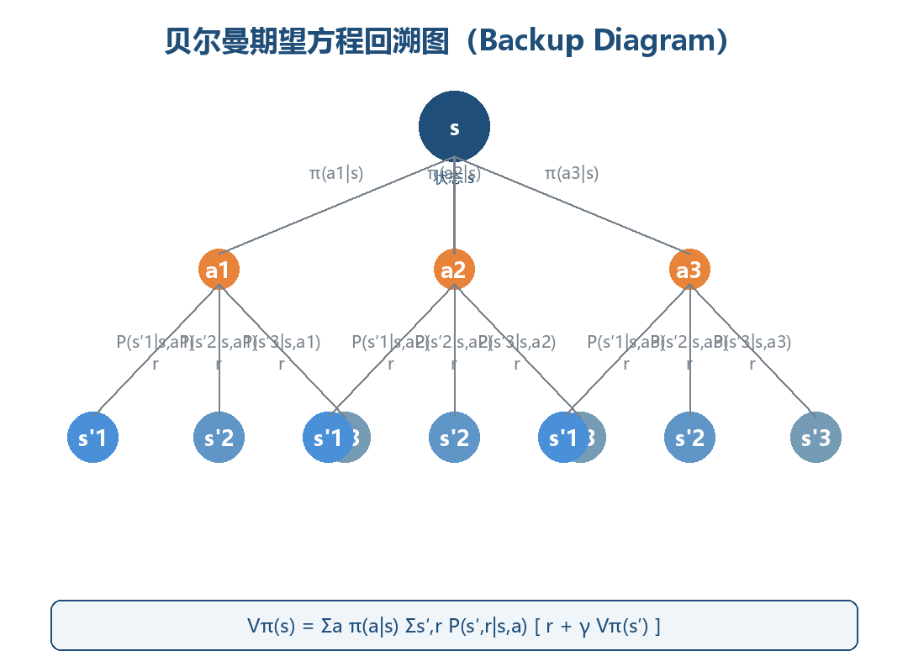
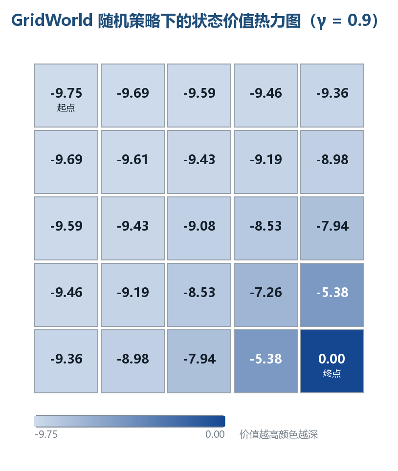

# 马尔可夫决策过程与数学基础

> 本章是强化学习的数学地基：从条件概率、全期望公式出发，搭建马尔可夫链、马尔可夫决策过程（MDP）、策略、轨迹、回报、价值函数与贝尔曼方程这一整条概念链。学完本章，你将能够用五元组描述任意 RL 问题、计算轨迹概率、写出并求解贝尔曼期望方程与贝尔曼最优方程。全文默认读者具备本科概率论与线性代数基础，所有结论均附可运行的 Python 验证代码。

---

## 一、概率与期望速查

强化学习的所有公式，本质上都是概率论与期望运算的排列组合：价值函数是条件期望，贝尔曼方程是全期望公式的展开，策略梯度是期望的梯度。本节按 **RL 的使用方式** 重新组织概率工具，而非泛泛复习。

### 1.1 随机变量与概率公理

设 $(\Omega, \mathcal{F}, \mathbb{P})$ 为概率空间：$\Omega$ 是样本空间，$\mathcal{F}$ 是事件域，$\mathbb{P}$ 是概率测度。随机变量 $X: \Omega \to \mathbb{R}$ 是样本空间到实数的映射。

> **核心思想**：RL 中的随机性只有两个源头——环境的随机转移 $s_{t+1} \sim P(\cdot|s_t, a_t)$ 与策略的随机采样 $a_t \sim \pi(\cdot|s_t)$。整个 RL 理论就是在这两个随机源上做期望运算。

概率测度满足三条公理，它们决定了 RL 中一切概率计算的合法性：

| 公理 | 表述 | RL 中的体现 |
|------|------|------------|
| **非负性** | $\mathbb{P}(A) \ge 0$ | 转移概率、策略概率均非负 |
| **规范性** | $\mathbb{P}(\Omega) = 1$ | $\sum_{s'} P(s'\|s,a)=1$，$\sum_a \pi(a\|s)=1$ |
| **可列可加性** | 互斥事件并的概率 = 概率之和 | 对互斥的下一状态求和，得到全概率 |

其中**规范性**最常用：转移矩阵每一行和为 1、策略在每个状态上的动作概率和为 1。代码中若发现行和不为 1，几乎可以断定定义有误。

### 1.2 条件概率与独立性

给定 $B$（$\mathbb{P}(B)>0$）时 $A$ 的条件概率：

$$\mathbb{P}(A \mid B) = \frac{\mathbb{P}(A \cap B)}{\mathbb{P}(B)}$$

条件概率是 RL 的"主谓宾"，下列说法数学含义完全等价：

| 自然语言 | 数学表达式 | 出现场景 |
|---------|-----------|---------|
| 在 $s$ 执行 $a$ 后到达 $s'$ 的概率 | $P(s'\|s,a)$ | 环境模型、转移矩阵 |
| 在 $s$ 下选择 $a$ 的概率 | $\pi(a\|s)$ | 策略 |
| 给定当前状态，未来与过去独立 | $P(s_{t+1}\|s_t) = P(s_{t+1}\|s_t, s_{t-1}, \dots)$ | 马尔可夫性质 |
| 已知状态 $s$ 时的期望回报 | $\mathbb{E}[G_t \mid S_t = s]$ | 状态价值函数 |

**独立性**：若 $\mathbb{P}(A\cap B) = \mathbb{P}(A)\mathbb{P}(B)$，称 $A$ 与 $B$ 独立，记 $A \perp\!\!\!\perp B$。三组易混概念：

| 概念 | 定义 | 是否蕴含对方 |
|------|------|------------|
| 互斥 | $A \cap B = \varnothing$ | 不蕴含独立（概率皆正时反而**不独立**） |
| 独立 | $\mathbb{P}(A \cap B) = \mathbb{P}(A)\mathbb{P}(B)$ | 不蕴含互斥 |
| 条件独立 | $\mathbb{P}(A \cap B \mid C) = \mathbb{P}(A \mid C)\mathbb{P}(B \mid C)$ | 独立 $\not\Rightarrow$ 条件独立，反之亦然 |

> **核心思想**：马尔可夫性质正是一种**条件独立假设**——给定当前状态 $S_t$，未来与过去条件独立。它是整个 MDP 框架成立的前提，也是"状态"概念的意义所在：状态必须"榨干"历史中与未来决策相关的全部信息。

### 1.3 全概率公式与贝叶斯公式

设 $B_1, \dots, B_n$ 是样本空间的一个**划分**（互斥且并为 $\Omega$），则对任意事件 $A$：

$$\mathbb{P}(A) = \sum_{i=1}^{n} \mathbb{P}(A \mid B_i)\,\mathbb{P}(B_i)$$

全概率公式是"按原因分情况求和"。在 RL 中有两个直接化身：

1. **状态的边际分布演化**：已知初始分布 $\mu(s_0)$ 与转移概率 $P$，
   $$\mathbb{P}(S_{t+1}=s') = \sum_s P(s' \mid s)\,\mathbb{P}(S_t=s) \quad\Longleftrightarrow\quad \mu_{t+1} = \mu_t P$$
   **马尔可夫链的分布演化就是反复应用全概率公式**。
2. **从动作价值到状态价值**（第六章）：$\{选动作 a\}_{a \in A}$ 构成一个划分，
   $$V^\pi(s) = \sum_a \pi(a \mid s)\, Q^\pi(s,a)$$

**贝叶斯公式**（全概率公式的逆向用法）：

$$\mathbb{P}(B_i \mid A) = \frac{\mathbb{P}(A \mid B_i)\,\mathbb{P}(B_i)}{\sum_j \mathbb{P}(A \mid B_j)\,\mathbb{P}(B_j)}$$

用于逆向推断场景：POMDP 的信念状态更新、贝叶斯强化学习、Thompson Sampling 均直接依赖它。

### 1.4 期望与条件期望

离散随机变量的期望 $\mathbb{E}[X] = \sum_x x\,\mathbb{P}(X=x)$ 是线性算子：$\mathbb{E}[aX+bY] = a\mathbb{E}[X]+b\mathbb{E}[Y]$。线性性是价值函数一切代数运算（矩阵形式、线性求解）的根基。

| 性质 | 公式 | RL 用途 |
|------|------|---------|
| 线性性 | $\mathbb{E}[aX+bY] = a\mathbb{E}[X]+b\mathbb{E}[Y]$ | 回报分解、误差分析 |
| 独立乘积 | $X \perp\!\!\!\perp Y \Rightarrow \mathbb{E}[XY] = \mathbb{E}[X]\mathbb{E}[Y]$ | 方差分解 |
| 常数提取 | $\mathbb{E}[c] = c$ | 折扣因子、常数奖励 |
| 期望的期望 | $\mathbb{E}[X] = \mathbb{E}[\mathbb{E}[X \mid Y]]$ | 全期望公式（下节） |

**条件期望** $\mathbb{E}[X \mid Y=y]$ 是"已知 $Y=y$ 后 $X$ 的平均值"，是 $y$ 的函数：

$$\mathbb{E}[X \mid Y = y] = \sum_{x} x\,\mathbb{P}(X = x \mid Y = y)$$

> **核心思想**：价值函数 $V^\pi(s)$ 的本质就是条件期望 $\mathbb{E}[G_t \mid S_t = s]$。理解这一点，就理解价值函数为什么是"函数"（随 $s$ 变化）而非"数"。

### 1.5 全期望公式（Law of Total Expectation）

全期望公式是 RL 中最重要的一条概率恒等式，**贝尔曼方程就是它的直接推论**：

$$\mathbb{E}[X] = \mathbb{E}\big[\mathbb{E}[X \mid Y]\big] = \sum_{y} \mathbb{E}[X \mid Y = y]\,\mathbb{P}(Y = y)$$

直观理解：算 $X$ 的总体平均，先按 $Y$ 分组求组内条件平均，再按各组占比加权求和。

**在 RL 中的完整演示**（理解贝尔曼方程的钥匙）：设 $X = G_t$、$Y = S_{t+1}$，回报满足递推 $G_t = r_{t+1} + \gamma G_{t+1}$，则：

| 全期望公式 | 贝尔曼方程 |
|-----------|-----------|
| $\mathbb{E}[X] = \sum_y \mathbb{E}[X\|Y=y] \cdot \mathbb{P}(Y=y)$ | $V^\pi(s) = \sum_{s'} \big[\,r + \gamma V^\pi(s')\big] \cdot P(s'\|s,\pi(s))$ |
| 总体平均 | 状态价值 |
| 分组内条件平均 | 即时奖励 + 折扣未来价值 |
| 分组占比 | 转移概率 |

**记忆口诀**：贝尔曼方程 = 全期望公式 + 回报递推式 $G_t = R_{t+1} + \gamma G_{t+1}$。

### 1.6 常用分布速查

策略与转移函数涉及的分布只有少数几种，全部列出：

| 分布 | 概率函数 | 参数 | RL 用途 |
|------|---------|------|---------|
| 伯努利 | $\mathbb{P}(X=1)=p$ | $p$ | 二值动作（左/右） |
| 二项 | $\mathbb{P}(X=k)=\binom{n}{k}p^k(1-p)^{n-k}$ | $n, p$ | n 次独立试验 |
| 均匀 | $f(x)=\frac{1}{b-a}$ | $a, b$ | 连续动作的初始探索 |
| 高斯 | $f(x)=\frac{1}{\sqrt{2\pi}\sigma}e^{-\frac{(x-\mu)^2}{2\sigma^2}}$ | $\mu, \sigma$ | **连续动作策略**（第 6 章） |
| 分类/多项式 | $\mathbb{P}(X=a_i)=\theta_i$ | $\theta$ | 离散动作策略（softmax） |
| 几何 | $\mathbb{P}(X=k)=(1-p)^{k-1}p$ | $p$ | 首次成功所需步数（回合长度建模） |

### 1.7 速查总表：为什么这些是 RL 的数学地基

| 工具 | 公式 | 在 RL 中的直接用途 |
|------|------|------------------|
| 条件概率 | $\mathbb{P}(A\|B)=\mathbb{P}(A\cap B)/\mathbb{P}(B)$ | 转移概率、策略、价值函数全是条件概率/条件期望 |
| 全概率公式 | $\mathbb{P}(A)=\sum_i \mathbb{P}(A\|B_i)\mathbb{P}(B_i)$ | 分布演化 $\mu_{t+1}=\mu_t P$；$V$ 与 $Q$ 互化 |
| 贝叶斯公式 | $\mathbb{P}(B_i\|A) \propto \mathbb{P}(A\|B_i)\mathbb{P}(B_i)$ | POMDP 信念、Thompson Sampling |
| 期望 | $\mathbb{E}[X]=\sum_x x\,\mathbb{P}(X=x)$ | 一切"平均回报"的定义 |
| 全期望公式 | $\mathbb{E}[X]=\mathbb{E}[\mathbb{E}[X\|Y]]$ | **贝尔曼方程的推导根基** |
| 线性方程组 | $(I-\gamma P)V = R$ | 表格型 MDP 的精确求解（第六、八节） |

**为什么是数学地基**，四点理由：

- **奖励假设的期望形式**：目标"最大化累积奖励"在数学上是最大化期望 $\mathbb{E}[G_t]$，期望运算贯穿全部算法。
- **价值函数就是条件期望**：$V^\pi(s)=\mathbb{E}[G_t \mid S_t=s]$，一切价值估计算法（DP/MC/TD/DQN）都在估计这个条件期望。
- **贝尔曼方程 = 全期望公式**：动态规划、Q-Learning、DQN 的更新规则全部源自全期望公式的展开（第六节完整推导）。
- **随机性建模**：$P(s'|s,a)$ 与 $\pi(a|s)$ 都是条件概率分布，马尔可夫性质是条件独立假设——概率语言是描述 RL 问题的唯一精确语言。

---

## 二、马尔可夫性质与马尔可夫链

### 2.1 马尔可夫性质（Markov Property）

**马尔可夫性质**：下一时刻的状态只依赖于当前状态（与当前动作），与更早的历史无关。对无动作的过程（马尔可夫链）：

$$\mathbb{P}(S_{t+1}=s' \mid S_t=s_t, S_{t-1}=s_{t-1}, \dots, S_0=s_0) = \mathbb{P}(S_{t+1}=s' \mid S_t=s_t)$$

即：给定现在，未来与过去条件独立。

> **核心思想**：马尔可夫性质不是环境的客观属性，而是**建模选择**。现实世界几乎不存在严格马尔可夫的过程——只要状态定义得足够"丰富"（包含所有影响未来的信息），就能把非马尔可夫过程改写成马尔可夫过程。**状态设计（State Design）的本质，就是构造满足马尔可夫性质的充分统计量。**

| 状态设计 | 满足马尔可夫性质？ | 原因 |
|---------|------------------|------|
| 棋盘完整局面 | ✅ 是 | 未来只由当前局面决定 |
| 最近三步落子 | ❌ 否 | 更早落子仍影响未来 |
| 单帧视频画面 | ❌ 否 | 速度、加速度信息丢失 |
| 多帧堆叠 + 光流 | ✅ 近似 | 包含运动信息的充分统计量 |

**为什么重要**：马尔可夫性质让"状态"成为历史信息的压缩表示——智能体只需记住当前状态，无需整条历史。这直接把 RL 从"历史序列上的优化"（指数级）简化为"状态上的优化"（多项式级）。一旦过程非马尔可夫，几乎所有理论保证（收敛性、最优性）都会崩塌。

### 2.2 状态转移矩阵（Transition Matrix）

**离散时间、有限状态、无动作**的马尔可夫过程称为**马尔可夫链（Markov Chain）**，由状态集合 $S=\{s_1,\dots,s_n\}$ 与转移矩阵 $P$ 完全刻画：

$$P_{ij} = \mathbb{P}(S_{t+1}=s_j \mid S_t=s_i), \qquad \sum_{j=1}^{n} P_{ij} = 1,\ \forall i$$

**行随机矩阵**：每行非负且行和为 1。$P$ 同时编码"能到哪"（非零元素位置）与"有多大概率到"（元素值）。

**示例**：三状态天气链（晴 0 / 阴 1 / 雨 2）：

$$P = \begin{bmatrix} 0.6 & 0.3 & 0.1 \\ 0.2 & 0.5 & 0.3 \\ 0.3 & 0.2 & 0.5 \end{bmatrix}$$

| 当前 \ 下一 | 晴 (0) | 阴 (1) | 雨 (2) | 行和 |
|------------|--------|--------|--------|------|
| **晴 (0)** | 0.6 | 0.3 | 0.1 | 1.0 |
| **阴 (1)** | 0.2 | 0.5 | 0.3 | 1.0 |
| **雨 (2)** | 0.3 | 0.2 | 0.5 | 1.0 |

读法：今天晴，明天 60% 晴、30% 阴、10% 雨。**注意本书约定行 = 当前状态、列 = 下一状态**（与部分教材相反），写代码时务必保持一致。

### 2.3 状态转移图（ASCII）

马尔可夫链也可用有向图表示：节点是状态，边权是转移概率：

```
                 0.3                    0.3
        ┌──────────────────┐   ┌──────────────────┐
        ▼                  │   ▼                  │
   ┌─────────┐   0.1   ┌─────────┐   0.3   ┌─────────┐
   │   晴 0   │────────►│   阴 1   │────────►│   雨 2   │
   └──┬──┬───┘         └──┬──┬───┘         └──┬──┬───┘
      │  │0.6(自环)        │  │0.5(自环)        │  │0.5(自环)
      │  └────0.3──────────┘  └────0.3──────────┘  │
      │                                            │
      └────────────────0.1─────────────────────────┘
         （雨→晴 = 0.3 的边为清晰起见未画出，以矩阵 P 为准）
```

每个节点出边概率之和为 1（含自环），与矩阵行和约束一一对应。图中从任何状态可达任何状态 → 链**不可约（irreducible）**；所有状态有自环 → **非周期（aperiodic）**。这两个性质是平稳分布存在且唯一的充分条件（2.5 节）。

### 2.4 n 步转移与 Chapman-Kolmogorov 方程

$n$ 步转移概率 $P^{(n)}_{ij} = \mathbb{P}(S_{t+n}=s_j \mid S_t=s_i)$ 由转移矩阵的 $n$ 次幂给出：

$$P^{(n)} = P^{\,n}$$

这来自 **Chapman-Kolmogorov 方程**——把 $n$ 步拆成"先走 $m$ 步到中间状态，再走 $n-m$ 步"，对中间状态求和（全概率公式）：

$$P^{(n)}_{ik} = \sum_{j} P^{(m)}_{ij}\, P^{(n-m)}_{jk}, \qquad 0 < m < n$$

初始分布 $\mu_0$（行向量）下，$t$ 时刻分布为 $\mu_t = \mu_0 P^t$。

**手工验证 $P^2$**（$n=2$，晴→雨）：$0.6\times0.1 + 0.3\times0.3 + 0.1\times0.5 = 0.20$，与下表的第 0 行第 2 列一致：

| $P^2$ | 晴 | 阴 | 雨 |
|-------|-----|-----|-----|
| **晴** | 0.45 | 0.35 | 0.20 |
| **阴** | 0.31 | 0.37 | 0.32 |
| **雨** | 0.37 | 0.29 | 0.34 |

### 2.5 平稳分布（Stationary Distribution）

若分布 $\pi$（行向量）满足 $\pi = \pi P$，即 $\pi_j = \sum_i \pi_i P_{ij}$，则称 $\pi$ 为**平稳分布**：一旦分布达到 $\pi$ 就永远保持——"流入每个状态的概率质量 = 流出量"。

| 性质 | 条件 | 结论 |
|------|------|------|
| 存在性 | 有限状态链 | 至少存在一个平稳分布 |
| 唯一性 | 不可约 + 非周期 | 平稳分布唯一，且 $\lim_{t\to\infty}\mu_t=\pi$ 与 $\mu_0$ 无关 |
| 收敛速率 | 第二特征值 $\lambda_2$ | $|\lambda_2|$ 越接近 1 收敛越慢（混合时间越长） |

> **核心思想**：$\lim_{t\to\infty} P^t$ 的每一行收敛到同一分布 $\pi$——**链会"遗忘"初始状态**。这是蒙特卡洛方法（第 3 章）的理论根基：从任意状态出发的长序列，状态频率近似平稳分布。平稳分布也是 MCMC 与 PageRank 的核心概念。

对天气链解 $\pi P = \pi$ 且 $\sum\pi_i=1$，得 $\pi = (0.38, 0.34, 0.28)$：长期来看 38% 晴、34% 阴、28% 雨，**与今天天气无关**。

### 2.6 代码演示：矩阵幂与收敛到平稳分布

```python
import numpy as np

np.set_printoptions(precision=3)   # 输出保留 3 位小数

# 三状态马尔可夫链的转移矩阵：行 = 当前状态，列 = 下一状态
P = np.array([
    [0.6, 0.3, 0.1],   # 晴 -> 晴/阴/雨
    [0.2, 0.5, 0.3],   # 阴 -> 晴/阴/雨
    [0.3, 0.2, 0.5],   # 雨 -> 晴/阴/雨
])

# 初始分布：今天 100% 是晴天
mu0 = np.array([1.0, 0.0, 0.0])

# n 步转移：mu_t = mu_0 · P^t（矩阵幂实现）
for n in [1, 2, 5, 10, 20]:
    Pn = np.linalg.matrix_power(P, n)   # n 步转移矩阵
    print(f"n={n:2d}  分布={mu0 @ Pn}")  # 初始分布左乘 P^n

# 收敛验证：P^t 每一行都趋近同一分布（= 平稳分布）
print("P^20 第 0 行:", np.linalg.matrix_power(P, 20)[0])
print("P^50 第 0 行:", np.linalg.matrix_power(P, 50)[0])

# Chapman-Kolmogorov 验证：两种方式算 P^3 应完全一致
P3a = np.linalg.matrix_power(P, 3)          # 直接三次幂
P3b = P @ np.linalg.matrix_power(P, 2)      # 拆成 1 步 + 2 步
print("P^3 两种算法一致:", np.allclose(P3a, P3b))

# 特征分解求平稳分布：π 是 P^T 特征值 1 对应的特征向量
evals, evecs = np.linalg.eig(P.T)
idx = int(np.argmin(np.abs(evals - 1.0)))   # 找特征值最接近 1 的列
pi = np.real(evecs[:, idx])
pi = pi / pi.sum()                          # 归一化为概率分布
print("平稳分布 π   :", pi)
```

```
# 预期输出:
n= 1  分布=[0.6 0.3 0.1]
n= 2  分布=[0.45 0.35 0.2 ]
n= 5  分布=[0.381 0.342 0.277]
n=10  分布=[0.38 0.34 0.28]
n=20  分布=[0.38 0.34 0.28]
P^20 第 0 行: [0.38 0.34 0.28]
P^50 第 0 行: [0.38 0.34 0.28]
P^3 两种算法一致: True
平稳分布 π   : [0.38 0.34 0.28]
```

**读结果**：① $n=1$ 时分布恰是 $P$ 的第 0 行；② 随 $n$ 增大分布向 $(0.38, 0.34, 0.28)$ 收敛；③ $n=20$ 与 $n=50$ 完全相同——链已"忘记"初始状态。矩阵幂、行收敛、特征分解三条路径殊途同归。

### 2.7 链的分类与性质

| 分类 | 定义 | 对平稳分布的影响 |
|------|------|----------------|
| 不可约（irreducible） | 任意两状态互相可达 | 平稳分布唯一性的必要条件 |
| 非周期（aperiodic） | 返回自身步数的最大公约数为 1 | 保证 $\mu_t$ 收敛（而非振荡） |
| 常返（recurrent） | 从 $s$ 出发最终必回 $s$ | 平稳分布质量集中于常返类 |
| 瞬态（transient） | 可能一去不返 | 平稳分布质量为零 |
| 吸收态（absorbing） | $P(s\|s)=1$，进入后永不离开 | 回合制任务的终止建模（3.6 节） |

**例子**：天气链不可约、非周期、全部常返 → 平稳分布唯一；若把雨设为吸收态（$P(雨|雨)=1$），则晴/阴成为瞬态，平稳分布退化为 $\pi=(0,0,1)$——一旦下雨永不晴天。

### 2.8 从马尔可夫链到马尔可夫决策过程

马尔可夫链只描述"环境自主演化"，没有智能体、动作与奖励。升级路径：

```
马尔可夫链 (MC)      + 动作 A           + 奖励 R
S, P(s'|s)     ──►   S, A, P(s'|s,a)   ──►   MDP
                   （环境响应动作）       （回报可度量、可优化）
```

| 概念 | 马尔可夫链 | MDP |
|------|-----------|-----|
| 转移 | $P(s'\|s)$ 固定 | $P(s'\|s,a)$ 依赖动作 |
| 谁在决策 | 无人，自然演化 | 智能体按策略 $\pi$ 决策 |
| 奖励 | 无 | $R(s,a,s')$ |
| 研究问题 | 分布如何演化、何时平稳 | 如何选动作最大化累积回报 |
| 求解工具 | 矩阵幂、特征分解 | 贝尔曼方程、动态规划、RL 算法 |

下一节给出 MDP 的正式定义。

---

## 三、MDP 正式定义

### 3.1 五元组定义

**马尔可夫决策过程（Markov Decision Process, MDP）** 是绝大多数 RL 问题的数学框架，由五元组刻画：

$$\text{MDP} = \langle S,\ A,\ P,\ R,\ \gamma \rangle$$

| 符号 | 名称 | 定义 | 数学形式 |
|------|------|------|---------|
| $S$ | 状态集合 | 环境所有可能状态 | $S=\{s_1,s_2,\dots\}$ |
| $A$ | 动作集合 | 智能体所有可选动作 | $A=\{a_1,a_2,\dots\}$ |
| $P$ | 状态转移函数 | 在 $s$ 执行 $a$ 后到 $s'$ 的概率 | $P(s'\|s,a)=\mathbb{P}(S_{t+1}=s' \mid S_t=s, A_t=a)$ |
| $R$ | 奖励函数 | 转移后的即时标量奖励 | $r_t = R(S_t, A_t, S_{t+1})$ |
| $\gamma$ | 折扣因子 | 未来奖励的折现率 | $\gamma \in [0,1]$ |

> **核心思想**：MDP 是一个"世界模型"——给定当前状态与动作，环境如何反应（转移到哪、给多少奖励）完全由 $P$ 与 $R$ 决定，且不依赖历史。智能体不一定知道 $P$ 与 $R$：DP 假设模型已知，RL 通过交互学习模型或直接学习策略/价值——这是两者最根本的分野。

### 3.2 五元组逐项拆解：GridWorld 与围棋双例

| 符号 | 含义 | GridWorld 例子 | 围棋例子 |
|------|------|---------------|---------|
| $S$ | 所有状态 | 25 个格子（5×5，含 1 终点） | 所有合法局面（约 $10^{170}$ 个） |
| $A$ | 所有动作 | 上/下/左/右 | 361 个交叉点落子 |
| $P(s'\|s,a)$ | 转移概率 | 向上走：无墙则 $P=1$ 移动，撞墙 $P=1$ 原地 | 规则确定：落子后局面唯一，$P=1$（确定性） |
| $R(s,a,s')$ | 即时奖励 | 进入终点 $0$，其余步 $-1$ | 提子/打劫局部奖惩，终局 $\pm1$ |
| $\gamma$ | 折扣因子 | 通常 0.9–0.99 | 常取 1（有限步游戏无需折扣） |

**奖励函数的三种写法**（文献混用，需能互译）：

| 写法 | 定义 | 特点 |
|------|------|------|
| 三参数 | $R(s,a,s')$ | 依赖转移结果，最精细 |
| 两参数 | $R(s,a)=\sum_{s'} P(s'\|s,a)\,R(s,a,s')$ | 对下一状态取期望 |
| 一参数 | $R(s)=\sum_a \pi(a\|s)\,R(s,a)$ | 依赖策略，分析时使用 |

### 3.3 有限状态 vs 无限状态

| 维度 | 有限状态 MDP | 无限状态 MDP |
|------|-------------|-------------|
| 状态个数 | $\|S\|<\infty$ | 连续状态（如 $\mathbb{R}^d$）或可数无限 |
| 表示方式 | 表格/向量精确表示 | 函数逼近（神经网络） |
| 求解方法 | 线性方程组、查表迭代 | 函数逼近 + 采样 |
| 精确解 | 存在（贝尔曼方程闭式解） | 一般不存在，只能逼近 |
| 典型例子 | GridWorld、21 点 | CartPole 连续状态、机器人控制 |
| 复杂度 | $O(\|S\|^2\|A\|)$ 量级 | 维数灾难 |

**维数灾难（Curse of Dimensionality）**：状态空间随维度指数膨胀——$d$ 维连续状态若每维离散成 10 格，共 $10^d$ 个状态。这就是表格方法止步于低维、深度 RL 必须登场的原因（第 5 章）。动作空间同理：离散动作可用 $Q$ 表或输出 logits 的网络；连续动作（力矩、舵角）需要策略梯度方法直接输出分布参数（第 6、7 章的分水岭）。

### 3.4 交互流程（Agent-Environment Loop）

MDP 定义"规则"，RL 发生在智能体与环境持续交互中：

```
        ┌───────────────────────────────────────────────┐
        │                                               │
        ▼                                               │
   ┌─────────┐    a_t      ┌──────────┐   r_{t+1}      │
   │  环境    │───────────► │  智能体   │◄───────────────┘
   │ (MDP)   │◄─────────── │ (策略 π)  │
   └─────────┘   s_{t+1}   └──────────┘
```

时序展开（每个时间步 $t=0,1,2,\dots$）：

```
时刻:   t=0        t=1        t=2        t=3
        S₀ ──a₀──► R₁, S₁ ──a₁──► R₂, S₂ ──a₂──► R₃, S₃ ──► ...
```

**约定**：动作 $A_t$ 在时刻 $t$ 依 $S_t$ 做出；奖励 $R_{t+1}$ 与下一状态 $S_{t+1}$ 是环境对 $A_t$ 的"回应"，在 $t+1$ 同时产生。这个"错位一拍"的时序约定（Sutton & Barto 记号）贯穿全书：

| 变量 | 产生时刻 | 依赖 |
|------|---------|------|
| $S_t$ | $t$ | 由 $S_{t-1}, A_{t-1}$ 经 $P$ 产生 |
| $A_t$ | $t$ | 由 $S_t$ 经 $\pi$ 产生 |
| $R_{t+1}, S_{t+1}$ | $t+1$ | 由 $S_t, A_t$ 经 $P, R$ 产生 |

### 3.5 回合制 vs 持续型任务

| 类型 | 定义 | 回报形式 | 典型例子 |
|------|------|---------|---------|
| **回合制（Episodic）** | 存在终止状态，有限步结束 | $G_t=\sum_{k=0}^{T-t-1}\gamma^k r_{t+k+1}$ | 围棋、Atari、GridWorld |
| **持续型（Continuing）** | 永不终止 | $G_t=\sum_{k=0}^{\infty}\gamma^k r_{t+k+1}$（需 $\gamma<1$） | 交易、温控、推荐 |

**统一技巧**：回合制任务可人为引入**吸收态（absorbing state）**——进入后永远停留且奖励恒 0，于是回合制被统一进持续型框架：

```
回合制:  s₀ → s₁ → ... → s_T(终止)
持续型:  s₀ → s₁ → ... → s_T → s_T → s_T → ...   （s_T 为吸收态，r ≡ 0）
```

### 3.6 MDP 的常见变体

| 变体 | 定义 | 与 MDP 的关系 |
|------|------|--------------|
| **MRP** | $\langle S, P, R, \gamma \rangle$，无动作 | MDP 固定策略后得到，价值函数定义域 |
| **POMDP** | 增加观测 $O$ 与观测函数 $O(o\|s,a)$ | 智能体看不到真状态，维护信念状态 |
| **Bandit** | 上下文老虎机，状态无转移 | MDP 特例：$P(s'\|s,a)$ 与 $s$ 无关 |
| **SMDP / 分层 MDP** | 动作持续多个时间步 | 时间抽象（temporal abstraction） |

**MRP 是本章后续的主角**：给 MDP 一个策略 $\pi$，动作被"积分掉"，退化为 MRP $\langle S, P^\pi, R^\pi, \gamma \rangle$：

$$P^\pi(s' \mid s) = \sum_a \pi(a \mid s)\,P(s' \mid s, a), \qquad R^\pi(s) = \sum_a \pi(a \mid s)\,R(s,a)$$

价值函数 $V^\pi$ 就是在这个"策略诱导 MRP"上做期望运算——这个视角让第六节的矩阵形式顺理成章。

**POMDP 的信念状态循环**（顺带一提，第 9 章展开）：

```
        ┌────────────────────────────────────────────┐
        ▼                                            │
   ┌─────────┐   o_{t+1}   ┌───────────────┐         │
   │  环境    │───────────► │  信念更新      │         │
   │ (真状态) │            │ b'(s')∝O(o|s',a)ΣP b(s) │
   └─────────┘◄─────────── │               │         │
        a_t                └───────┬───────┘         │
                                   │ 动作选择 a_t     │
                                   └─────────────────┘
```

### 3.7 奖励设计模式速查

| 模式 | 定义 | 优点 | 风险 |
|------|------|------|------|
| 稀疏奖励（Sparse） | 只在关键事件给奖励 | 无偏、简单 | 学习极慢，探索困难 |
| 密集奖励（Dense） | 每步给奖励（如 $-1$/步） | 学习快 | 可能诱导次优行为 |
| 势函数塑形（Potential-Based） | $F=\gamma\Phi(s')-\Phi(s)$ | 保持最优策略不变 | 设计 $\Phi$ 需要领域知识 |
| 奖励黑客（Reward Hacking） | 智能体钻奖励漏洞 | —— | 学到的行为不是想要的（第 10 章） |

---

## 四、策略与轨迹

### 4.1 策略的定义

**策略（Policy）** 是状态到动作的映射规则，是 RL 中唯一需要学习的对象：

$$\pi(a \mid s) = \mathbb{P}(A_t = a \mid S_t = s), \qquad \sum_a \pi(a \mid s) = 1,\ \forall s$$

| 类型 | 定义 | 数学形式 | 典型例子 |
|------|------|---------|---------|
| 确定性策略 | 每状态对应唯一动作 | $\pi(s)=a$，或 $\pi(a\|s)\in\{0,1\}$ | 贪心策略、必胜走法 |
| 随机策略 | 每状态上动作按分布 | $\pi(a\|s)\in[0,1]$ | ε-greedy、softmax、围棋概率落子 |

### 4.2 确定性策略 vs 随机策略

| 维度 | 确定性策略 | 随机策略 |
|------|-----------|---------|
| 形式 | $s \mapsto a$ 单值映射 | $s \mapsto$ 动作分布 |
| 表达力 | 随机策略的特例（概率集中单点） | 严格更一般 |
| 探索能力 | 无（除非手动加随机） | 天然具备 |
| 对抗鲁棒性 | 易被预测 | 不可预测，博弈占优 |
| 部分可观测 | 可能振荡 | 平滑混合，表现更好 |
| 连续动作 | 需特殊处理（DDPG 等） | 直接输出分布参数（高斯策略） |
| 最优性 | **表格型 MDP 中总存在确定性最优策略** | 一般场景非必需，但利于探索/博弈 |

> **核心思想**：表格型 MDP（有限状态、有限动作、折扣回报）中**一定存在确定性最优策略**（第七节）。为何还需要随机策略？① 探索需要随机性（ε-greedy）；② 自博弈中随机性防针对（AlphaGo）；③ 部分可观测环境下随机策略可严格优于确定性策略。

### 4.3 常见策略族

| 策略 | 公式 | 特点 | 用途 |
|------|------|------|------|
| 贪心（Greedy） | $\pi(s)=\arg\max_a Q(s,a)$ | 确定性、零探索 | 利用阶段 |
| ε-greedy | 以 $1-\epsilon$ 贪心，以 $\epsilon$ 均匀随机 | 简单、可调探索量 | 第 0、4 章 |
| Softmax（Boltzmann） | $\pi(a\|s)=\frac{e^{Q(s,a)/\tau}}{\sum_b e^{Q(s,b)/\tau}}$ | 按价值加权随机，温度 $\tau$ 控制集中度 | 连续/离散通用 |
| 高斯策略 | $\pi(a\|s)=\mathcal{N}(\mu_\theta(s), \sigma_\theta^2)$ | 连续动作的标准选择 | 第 6、7 章 |
| 均匀随机 | $\pi(a\|s)=1/\|A\|$ | 零知识基线 | 基线对比 |

### 4.4 轨迹（Trajectory）

**轨迹（Trajectory / Episode / Rollout）** 是交互产生的完整序列，是 RL 的"数据样本"：

$$\tau = (S_0, A_0, R_1, S_1, A_1, R_2, S_2, \dots, R_T, S_T)$$

```
轨迹可视化（时间线）:
S₀ ─a₀→  R₁,S₁ ─a₁→  R₂,S₂ ─a₂→  R₃,S₃ ─a₃→  ... ─→  R_T,S_T(终止)
│        │         │         │                    │
μ(s₀)  π(a₀|s₀)  π(a₁|s₁)  π(a₂|s₂)            P(s_T|s_{T-1},a_{T-1})
        P(s₁|s₀,a₀)  P(s₂|s₁,a₁)  P(s₃|s₂,a₂)
```

| 术语 | 含义 | 粒度 |
|------|------|------|
| 状态转移（transition） | 单步 $(s, a, r, s')$ | 一步 |
| 轨迹（trajectory） | 完整交互序列 | 一个回合 |
| 经验回放池（replay buffer） | 大量转移的集合 | 数据集（第 5 章 DQN） |

### 4.5 轨迹出现概率

轨迹概率由**初始分布 + 策略 + 转移函数**三者的乘积给出：

$$\mathbb{P}(\tau \mid \pi) = \mu(s_0) \prod_{t=0}^{T-1} \pi(a_t \mid s_t)\, P(s_{t+1} \mid s_t, a_t)$$

| 因子 | 来源 | 含义 |
|------|------|------|
| $\mu(s_0)$ | 环境 | 初始状态概率 |
| $\pi(a_t \mid s_t)$ | 智能体 | 在 $s_t$ 选 $a_t$ 的概率 |
| $P(s_{t+1} \mid s_t, a_t)$ | 环境 | 转移概率 |
| 连乘 | 马尔可夫性质 | 各步条件独立，概率相乘 |

> **核心思想**：轨迹概率是 RL 目标函数的"权重"——任何策略 $\pi$ 的期望回报可写成"按 $\pi$ 诱导的轨迹分布取期望"：$\mathbb{E}_{\tau \sim \pi}[\cdot]$。这正是第 6 章策略梯度对策略参数求导的出发点。**"$\tau \sim \pi$"表示轨迹按上述乘积分布抽样。**

**重要推论**：奖励函数 $R$ **不**出现在轨迹概率中——改变奖励不改变"哪些轨迹会出现"，只改变"哪些轨迹被看重"。这是奖励塑形（Reward Shaping）理论（第 9 章）的出发点。

### 4.6 代码：给定策略计算轨迹概率

```python
# 三状态 MDP：状态 {0, 1, 2}，动作 {L, R}
# P[s][a][s'] = 在状态 s 执行动作 a 后转移到 s' 的概率
P = {
    0: {"L": {0: 0.9, 1: 0.1}, "R": {1: 0.8, 2: 0.2}},
    1: {"L": {0: 0.5, 2: 0.5}, "R": {1: 0.6, 2: 0.4}},
    2: {"L": {0: 1.0},         "R": {1: 0.7, 2: 0.3}},
}

# 随机策略 pi[s][a] = 在状态 s 选择动作 a 的概率
pi = {
    0: {"L": 0.7, "R": 0.3},
    1: {"L": 0.4, "R": 0.6},
    2: {"L": 0.5, "R": 0.5},
}

# 给定轨迹：s0=0, a0=L, s1=1, a1=R, s2=2
trajectory = [0, "L", 1, "R", 2]

def trajectory_probability(traj, P, pi, p0):
    """轨迹概率：P(τ) = μ(s0) · Π_t π(a_t|s_t) · P(s_{t+1}|s_t,a_t)"""
    prob = p0[traj[0]]                 # 初始状态概率 μ(s0)
    t = 0
    while t + 2 < len(traj):           # 每轮消费 (s, a, s') 三元组
        s, a, s_next = traj[t], traj[t + 1], traj[t + 2]
        prob *= pi[s][a]               # 策略概率 π(a|s)
        prob *= P[s][a][s_next]        # 转移概率 P(s'|s,a)
        t += 2
    return prob

p0 = {0: 1.0, 1: 0.0, 2: 0.0}         # 初始状态确定从 0 出发
print("轨迹概率 P(τ) =", trajectory_probability(trajectory, P, pi, p0))
```

```
# 预期输出:
轨迹概率 P(τ) = 0.0168
```

**手工验算**：$0.7 \times 0.1 \times 0.6 \times 0.4 = 0.0168$，其中 $0.7=\pi(L|0)$、$0.1=P(1|0,L)$、$0.6=\pi(R|1)$、$0.4=P(2|1,R)$。初始状态概率为 1（确定从 0 出发），无额外因子。

### 4.7 轨迹与"体验"：RL 的数据形态

| 学习范式 | 数据形态 | 与轨迹的关系 |
|---------|---------|-------------|
| 监督学习 | 独立同分布样本 $(x,y)$ | 无时序结构 |
| 离线 RL | 固定轨迹数据集 $\mathcal{D}$ | 轨迹的静态集合（第 9 章） |
| 在线 RL | 实时交互产生的轨迹流 | 策略更新 → 新轨迹 → 再更新 |
| 模仿学习 | 专家轨迹 | 从轨迹提取策略（第 9 章） |

**关键认识**：轨迹数据是**策略相关**的——用 $\pi$ 采的轨迹服从 $\mathbb{P}(\cdot|\pi)$。策略一更新，旧轨迹分布就"过时"（分布偏移）。这是 RL 与监督学习最深刻的差异：**数据分布随模型变化**。第 5 章经验回放 + 目标网络、第 6 章重要性采样/裁剪，本质都是在与这个偏移搏斗。

---

## 五、回报与折扣因子

### 5.1 回报（Return）的定义

**回报（Return）** $G_t$ 是从时刻 $t$ 开始的累积折扣奖励，是 RL 优化的最终目标：

$$G_t = R_{t+1} + \gamma R_{t+2} + \gamma^2 R_{t+3} + \cdots = \sum_{k=0}^{\infty} \gamma^k R_{t+k+1}$$

注意下标：$G_t$ 从 $R_{t+1}$ 开始（$R_{t+1}$ 是 $A_t$ 的回应）。回报满足**递推式**：

$$G_t = R_{t+1} + \gamma\, G_{t+1}$$

```
递推式分解:
G_t  =  R_{t+1}      +  γ · G_{t+1}
        └─即时奖励─┘     └──折扣后的未来回报──┘
```

**回报 vs 奖励**（务必分清）：

| 概念 | 符号 | 性质 | GridWorld 例子 |
|------|------|------|---------------|
| 奖励 | $R_t$ | 即时、单步、标量 | 走一步得 $-1$ |
| 回报 | $G_t$ | 累积、多步、**随机变量** | 起点到终点的累计折扣奖励 |
| 价值 | $V(s)$ | 回报的期望、确定性函数 | 状态 $s$ 的平均回报 |

### 5.2 折扣因子的作用

$\gamma \in [0,1]$ 有三层作用：

**① 数学作用：保证收敛。** 奖励有界 $|r_t| \le R_{\max}$ 时：

$$|G_t| \le \sum_{k=0}^{\infty} \gamma^k R_{\max} = \frac{R_{\max}}{1-\gamma} < \infty \quad (\gamma < 1)$$

等比级数求和保证无限视界回报有限；$\gamma \to 1$ 时上界发散。

**② 经济直觉：未来收益打折。** 现在的 100 元比一年后的 100 元更值钱。$\gamma$ 即折现率：越小，未来奖励被压得越狠，智能体越短视。

**③ 行为学作用：控制远见程度。** 有效视界约 $\frac{1}{1-\gamma}$ 步：

| $\gamma$ | 有效视界 $\approx \frac{1}{1-\gamma}$ | 行为特征 | 适用场景 |
|----------|-------------------------------------|---------|---------|
| 0 | 1 步 | 极度短视 | 单步决策、Bandit |
| 0.5 | 2 步 | 短视 | 快速响应控制 |
| 0.9 | 10 步 | 中等远见 | 一般表格型任务 |
| 0.99 | 100 步 | 长远规划 | 深度 RL 默认值 |
| 1.0 | $\infty$ | 完全远视 | 有限步游戏（围棋） |

### 5.3 极端情形：γ = 0 与 γ → 1

| 维度 | $\gamma = 0$ | $\gamma \to 1$ |
|------|-------------|----------------|
| 回报 | $G_t = R_{t+1}$（只看一步） | $G_t = \sum_k R_{t+k+1}$（看全部未来） |
| 目标 | 最大化即时奖励 | 最大化长期累积 |
| 价值函数 | $V(s)=\mathbb{E}[R_{t+1}\|S_t=s]$ | $V(s)=\mathbb{E}[\text{总奖励}]$ |
| 优点 | 简单、方差小 | 考虑长远、支持延迟奖励 |
| 缺点 | 无视延迟奖励（看不到围棋终局） | 方差大、收敛慢、可能发散 |
| 场景 | 即时反馈推荐、Bandit | 棋类、导航、长期投资 |

**何时用 $\gamma=1$？** 回合制有限步任务可安全取 $\gamma=1$（有限和，无收敛问题）；持续型任务必须 $\gamma<1$。工程上不确定就用 $\gamma=0.99$ 起步。

### 5.4 有限视界 vs 无限视界

| 维度 | 有限视界（Finite Horizon） | 无限视界（Infinite Horizon） |
|------|--------------------------|------------------------------|
| 回报 | $G_t=\sum_{k=0}^{H-t-1}\gamma^k r_{t+k+1}$ | $G_t=\sum_{k=0}^{\infty}\gamma^k r_{t+k+1}$ |
| 步数 | 固定 $H$ 步 | 无限（或随机终止） |
| 最优策略 | 依赖剩余步数（非平稳） | 平稳（与 $t$ 无关） |
| 求解 | 时间相关的贝尔曼方程 | 时间无关的贝尔曼方程，更简单 |
| 例子 | 象棋残局限定步数 | 多数 RL 基准、机器人控制 |

> **核心思想**：无限视界 + 折扣因子是 RL 理论分析的"主场"——它保证最优策略**平稳**（不随时间变化），贝尔曼方程是**时间无关**的代数方程，从而可用不动点理论（第七节）证明存在性与唯一性。工程实现中，有限视界任务也常近似为无限视界折扣问题求解。

**平均奖励准则（Average Reward）**：$\gamma=1$ 且持续型时无限和发散，改用长期平均奖励 $\lim_{H\to\infty}\frac{1}{H}\mathbb{E}[\sum_{k=1}^{H} R_{t+k}]$。它是折扣准则的极限（$\gamma\to1$），用于排队、调度，工程上远不如折扣准则常用。

### 5.5 代码：折扣回报的计算

```python
# 一条长度为 10 的奖励序列（模拟一个回合的即时奖励流）
rewards = [1, 0, 0, 1, 0, 0, 0, 1, 0, 0]

def discounted_return(rewards, gamma, t=0):
    """从时刻 t 开始的折扣回报：G_t = Σ_k γ^k · r_{t+k+1}"""
    return sum(gamma**k * r for k, r in enumerate(rewards[t:]))

# 同一串奖励，不同折扣因子下"价值感"截然不同
for gamma in [0.0, 0.5, 0.9, 0.99]:
    G = discounted_return(rewards, gamma)
    print(f"γ={gamma:<5} G_0 = {G:.3f}")
```

```
# 预期输出:
γ=0.0   G_0 = 1.000
γ=0.5   G_0 = 1.133
γ=0.9   G_0 = 2.207
γ=0.99  G_0 = 2.902
```

**读结果**：奖励在第 1、4、8 步有 $+1$。$\gamma=0$ 只看到第一个 $+1$；$\gamma=0.5$ 只在乎近处奖励（$G=1.133$）；$\gamma=0.99$ 几乎把三次奖励全部计入（$G=2.902 \approx 3$）。**折扣因子就是"注意力窗口"的旋钮。**

### 5.6 工程要点

| 要点 | 说明 |
|------|------|
| Episode 截断 | 持续型任务采样时人为截断，末尾的 $V(s')$ 用估计值补齐（bootstrapping，第 4 章） |
| $\gamma$ 与方差 | $\gamma$ 越大方差越大（远期奖励计入越多），深度 RL 常用 0.99 平衡 |
| 回报归一化 | 训练时对回报做标准化（除以标准差）可显著稳定策略梯度（第 6 章） |
| 折扣 ≠ 时间偏好 | 有些场景 $\gamma$ 纯粹是数学工具（保证收敛），不代表"耐心" |

---

## 六、价值函数与贝尔曼期望方程

价值函数是 RL 的"估值系统"。策略、轨迹、回报在此汇聚成两个核心函数 $V^\pi$ 与 $Q^\pi$，并推导出支配一切表格型 RL 算法的**贝尔曼期望方程**。

### 6.1 状态价值函数（State-Value Function）

在策略 $\pi$ 下，状态 $s$ 的**状态价值**是从 $s$ 出发、之后一直按 $\pi$ 行动的期望折扣回报：

$$V^{\pi}(s) = \mathbb{E}_{\pi}\big[ G_t \mid S_t = s \big] = \mathbb{E}_{\pi}\left[ \sum_{k=0}^{\infty} \gamma^k R_{t+k+1} \;\middle|\; S_t = s \right]$$

| 要点 | 说明 |
|------|------|
| 下标 $\pi$ | 期望按 $\pi$ 诱导的轨迹分布计算（4.5 节） |
| 条件于 $S_t=s$ | 价值是状态的函数（条件期望） |
| 为什么取期望 | 未来有随机性（转移 + 策略），取平均消除随机性 |
| $G_t$ vs $V^\pi$ | $G_t$ 是随机变量，$V^\pi(s)$ 是它的条件期望（确定性数） |

**直觉**：$V^\pi(s)$ 衡量"按 $\pi$ 玩，从 $s$ 出发平均能拿多少"。GridWorld 中靠近终点的格子价值高（很快拿到终止奖励），角落价值低（要走很多 $-1$ 步）。

### 6.2 动作价值函数（Action-Value Function）

**动作价值**：在状态 $s$ 先执行动作 $a$，之后按 $\pi$ 行动的期望折扣回报：

$$Q^{\pi}(s, a) = \mathbb{E}_{\pi}\left[ \sum_{k=0}^{\infty} \gamma^k R_{t+k+1} \;\middle|\; S_t = s,\ A_t = a \right]$$

与 $V$ 的唯一差别在"第一步动作"：$V$ 第一步也按 $\pi$，$Q$ 第一步指定为 $a$。

| 函数 | 自变量 | 含义 | 决策用途 |
|------|--------|------|---------|
| $V^\pi(s)$ | 状态 | "这个局面值多少" | 评估状态好坏 |
| $Q^\pi(s,a)$ | 状态-动作对 | "这个局面做这个动作值多少" | 直接比较动作优劣 |

**为什么需要 $Q$？** $V$ 把动作"平均掉了"，不能直接指导选择——从 $V$ 选动作必须知道模型 $P$（算 $\mathbb{E}[r+\gamma V(s')]$）；而 $Q$ 按动作组织，**无需模型**即可比较 $Q(s,a_1)$ 与 $Q(s,a_2)$。这正是免模型 RL（Q-Learning、DQN）直接学 $Q$ 的原因。

### 6.3 V 与 Q 的关系

两个方向的互化公式：

**① 从 $Q$ 到 $V$**（按策略平均动作，全概率公式对动作求和）：

$$V^{\pi}(s) = \sum_{a} \pi(a \mid s)\, Q^{\pi}(s, a)$$

**② 从 $V$ 到 $Q$**（展开一步，按转移平均）：

$$Q^{\pi}(s, a) = \sum_{s', r} P(s', r \mid s, a)\, \big[\, r + \gamma\, V^{\pi}(s') \,\big]$$

```
        V(s) ◄─── 按 π(a|s) 加权平均 ──── Q(s,a)
         ▲                                  ▲
         └────── 按 P(s'|s,a) 展开一步 ─────┘
```

两个公式合起来就是贝尔曼期望方程。

### 6.4 贝尔曼期望方程（Bellman Expectation Equation）的推导

**目标**：把 $V^\pi(s)$ 表示成"即时奖励 + 下一步价值"，把无限期期望化为"一步期望 + 递归"。

**第 1 步**：写出定义，用回报递推式 $G_t = R_{t+1} + \gamma G_{t+1}$ 拆分：

$$V^{\pi}(s) = \mathbb{E}_{\pi}\big[ G_t \mid S_t = s \big] = \mathbb{E}_{\pi}\big[ R_{t+1} + \gamma G_{t+1} \mid S_t = s \big]$$

**第 2 步**：期望线性性拆成两项：

$$V^{\pi}(s) = \mathbb{E}_{\pi}\big[ R_{t+1} \mid S_t = s \big] + \gamma\, \mathbb{E}_{\pi}\big[ G_{t+1} \mid S_t = s \big]$$

**第 3 步**：第一项按"先选动作、再转移"展开；第二项用全期望公式把条件从 $S_t$ 转移到 $S_{t+1}$：

$$\mathbb{E}[G_{t+1} \mid S_t=s] = \sum_{s'} \mathbb{E}[G_{t+1} \mid S_{t+1}=s']\, \mathbb{P}(S_{t+1}=s' \mid S_t=s) = \sum_{s'} V^\pi(s')\, P^\pi(s' \mid s)$$

其中 $P^\pi(s'|s) = \sum_a \pi(a|s)P(s'|s,a)$ 是策略诱导转移（3.6 节）。

**第 4 步**：合并得到贝尔曼期望方程：

$$V^{\pi}(s) = \sum_{a} \pi(a \mid s) \sum_{s', r} P(s', r \mid s, a)\, \big[\, r + \gamma\, V^{\pi}(s') \,\big]$$

**方程的意义**：左边是"$s$ 的价值"，右边是"走一步后的期望（即时奖励 + 折扣未来价值）"。方程**自指**——$V^\pi$ 出现在两边，因此它不是一个"答案"而是一个"约束"：$V^\pi$ 是满足该方程的唯一函数。求解有两条路线：解析法（矩阵求逆，6.7 节）与迭代法（第 2 章 DP、第 3-4 章采样法）。

### 6.5 回溯图（Backup Diagram）

贝尔曼方程的图形语言——一个节点表示状态，向下展开动作与转移：



```
                ┌───────────┐
                │     s     │   V(s)：当前状态的价值
                └─────┬─────┘
         π(a₁|s)      │      π(a₂|s)  π(a₃|s)
        ┌─────────────┼─────────────┐
        ▼             ▼             ▼
     ┌─────┐      ┌─────┐      ┌─────┐
     │ a₁  │      │ a₂  │      │ a₃  │    动作节点（按 π 加权）
     └──┬──┘      └──┬──┘      └──┬──┘
        │            │            │
   P(s′₁|s,a₁)  P(s′₂|s,a₂)  P(s′₃|s,a₃)   转移概率
     ┌──┴──┐      ┌──┴──┐      ┌──┴──┐
     ▼     ▼      ▼     ▼      ▼     ▼
   ┌───┐ ┌───┐  ┌───┐ ┌───┐  ┌───┐ ┌───┐
   │s′₁│ │s′₂│  │s′₁│ │s′₂│  │s′₁│ │s′₂│   下一状态
   └───┘ └───┘  └───┘ └───┘  └───┘ └───┘
    r+γV(s′₁)   r+γV(s′₂)     ...           每个叶子贡献 r + γV(s′)
```

**读图规则**（Sutton & Barto 约定）：空心圆 = 状态，实心圆 = 状态-动作对。回溯图"从下往上"读：叶子 $s'$ 携带价值 $V^\pi(s')$，沿转移边乘 $P$、沿动作边乘 $\pi$，逐层加权求和得根节点 $s$ 的价值。**每一种贝尔曼方程对应一张回溯图**——第 7 章最优方程、第 4 章 TD 目标、第 5 章 Q-learning 目标各有各的图，学会读图等于读懂半个 RL 文献。

**$Q$ 版本的贝尔曼期望方程**（对称推导）：

$$Q^{\pi}(s, a) = \sum_{s', r} P(s', r \mid s, a)\, \Big[\, r + \gamma \sum_{a'} \pi(a' \mid s')\, Q^{\pi}(s', a') \,\Big]$$

### 6.6 矩阵形式：V = R + γPV

定义策略诱导的期望奖励向量 $R^\pi$ 与转移矩阵 $P^\pi$（3.6 节）：

$$R^{\pi}(s) = \sum_{a} \pi(a \mid s) \sum_{s', r} P(s', r \mid s, a)\, r, \qquad P^{\pi}(s' \mid s) = \sum_{a} \pi(a \mid s) P(s' \mid s, a)$$

则贝尔曼期望方程对所有状态同时成立：

$$V^{\pi} = R^{\pi} + \gamma\, P^{\pi}\, V^{\pi}$$

移项求逆得到**策略评估的闭式解**：

$$V^{\pi} = (I - \gamma P^{\pi})^{-1}\, R^{\pi}$$

| 要素 | 含义 | 维度 |
|------|------|------|
| $I$ | 单位矩阵 | $\|S\| \times \|S\|$ |
| $I-\gamma P^\pi$ | 系数矩阵（严格对角占优，可逆） | $\|S\| \times \|S\|$ |
| $R^\pi$ | 策略下期望即时奖励向量 | $\|S\|$ |
| $V^\pi$ | 待求状态价值向量 | $\|S\|$ |

> **核心思想**：$V^\pi = (I-\gamma P^\pi)^{-1}R^\pi$ 是**策略评估的闭式解**——模型已知时，价值函数无需迭代或采样，一次矩阵求逆即可精确得到。代价是 $O(\|S\|^3)$ 复杂度，状态一多就不可行（维数灾难），于是才有了第 2 章的迭代法（$O(\|S\|^2)$/步）与第 3-4 章的采样法（无需模型）。**"精确但昂贵"与"近似但可扩展"的取舍，是贯穿全书的主线。**

### 6.7 代码：用线性方程组求解贝尔曼期望方程

以 3.6 节的 MRP 视角实现：给定策略后 MDP 退化为 MRP，直接解线性方程：

```python
import numpy as np

# 四状态马尔可夫奖励过程（MRP，可视为"已固定策略的 MDP"）：
# 状态 0,1,2 为普通状态，状态 3 为吸收终点
P = np.array([
    [0.1, 0.4, 0.5, 0.0],   # 从状态 0 出发的转移概率
    [0.2, 0.0, 0.6, 0.2],   # 从状态 1 出发的转移概率
    [0.0, 0.3, 0.3, 0.4],   # 从状态 2 出发的转移概率
    [0.0, 0.0, 0.0, 1.0],   # 状态 3 是吸收态：永远留在 3
])
R = np.array([1.0, 2.0, 0.5, 0.0])   # 各状态的即时奖励
gamma = 0.9                           # 折扣因子

# 贝尔曼期望方程矩阵形式：V = R + γPV  ⇔  (I - γP)V = R
A = np.eye(4) - gamma * P
V = np.linalg.solve(A, R)             # 直接解线性方程组

for s, v in enumerate(V):
    print(f"V({s}) = {v:.4f}")
```

```
# 预期输出:
V(0) = 3.6220
V(1) = 3.7760
V(2) = 2.0815
V(3) = 0.0000
```

**验算（状态 3）**：吸收态 $P(3|3)=1$、$R(3)=0$，代入 $V(3)=0+0.9\times V(3)$ 得 $V(3)=0$——吸收态价值恒 0，符合"游戏结束"的直觉。

**工程注意**：① `np.linalg.solve` 比显式求逆 `np.linalg.inv(A) @ R` 更快更稳；② $\gamma$ 接近 1 时 $A$ 接近奇异，数值误差增大，改用迭代法（第 2 章）；③ 状态数超过数千时矩阵求逆不可行，必须转迭代/采样法。

### 6.8 贝尔曼方程的三种解读

| 视角 | 表述 | 启示 |
|------|------|------|
| **自指方程** | $V^\pi$ 是 $V = R^\pi + \gamma P^\pi V$ 的唯一解 | 价值函数"自我一致"：任何状态的价值必须等于走一步后的期望 |
| **不动点** | $V^\pi$ 是算子 $T^\pi(V)=R^\pi+\gamma P^\pi V$ 的不动点 | $T^\pi$ 是 $\gamma$-压缩映射，迭代 $V\leftarrow T^\pi(V)$ 必然收敛（第 2 章策略评估的保证） |
| **回溯/前瞻** | 价值 = 对"一步即时奖励 + 折扣未来价值"的期望 | 把遥远未来的期望折叠成局部期望——一切自举（bootstrapping）算法的思想源头 |

**为什么如此重要**：贝尔曼期望方程是**策略评估（Policy Evaluation）**的数学表述——"给定策略，算每个状态值多少钱"。策略评估与策略改进是 RL 的两大子问题；第 2 章 DP、第 3 章蒙特卡洛、第 4 章 TD 都是"求解贝尔曼期望方程"这条主线上的不同实现：精确求解（矩阵求逆）、迭代求解（DP）、采样近似（MC/TD）。

---

## 七、贝尔曼最优方程

### 7.1 最优价值函数（Optimal Value Functions）

所有策略中最好的价值函数：

$$V^{*}(s) = \max_{\pi}\, V^{\pi}(s), \qquad Q^{*}(s, a) = \max_{\pi}\, Q^{\pi}(s, a)$$

| 概念 | 定义 | 解读 |
|------|------|------|
| $V^*(s)$ | 所有策略中 $V^\pi(s)$ 的最大值 | "这个局面在最好打法下值多少" |
| $Q^*(s,a)$ | 所有策略中 $Q^\pi(s,a)$ 的最大值 | "这个局面做这个动作、后续最优，值多少" |
| $\pi^*$ | 达到最大值的策略 | 最优策略 |

**$Q^*$ 是决策的终极依据**：最优策略就是逐状态取 $Q^*$ 最大动作：

$$\pi^{*}(s) = \arg\max_{a}\, Q^{*}(s, a)$$

**贪心之于 $Q^*$ 是安全的**：$Q^*$ 已包含"未来所有步都用最优打法"的假设，局部贪心 = 全局最优。**复杂度全部被吸收进 $Q^*$ 的定义里**——这就是最优策略可以"很简单"的根本原因。

### 7.2 贝尔曼最优方程（Bellman Optimality Equation）

**$V^*$ 版本**（max 穿透到动作层）：

$$V^{*}(s) = \max_{a}\, \sum_{s', r} P(s', r \mid s, a)\, \big[\, r + \gamma\, V^{*}(s') \,\big]$$

**$Q^*$ 版本**（max 穿透到下一步动作层）：

$$Q^{*}(s, a) = \sum_{s', r} P(s', r \mid s, a)\, \Big[\, r + \gamma\, \max_{a'}\, Q^{*}(s', a') \,\Big]$$

**推导直觉**：最优价值 = "选最好的动作，然后进入最优的未来"。与期望方程的唯一差别：期望方程对动作**加权平均**（$\sum_a \pi(a|s)$），最优方程对动作**取最大值**（$\max_a$）——最优策略在 $s$ 处必然选期望最高的动作。回溯图上的差别：

```
期望方程回溯图:  s ──(按 π 加权平均)──► a₁, a₂, a₃ ──(按 P 加权)──► s′ → r + γV^π(s′)
最优方程回溯图:  s ──(取 max)──────────► a*  ──(按 P 加权)──► s′ → r + γV*(s′)
```

### 7.3 最优策略的存在性与唯一性

| 问题 | 答案 | 理由 |
|------|------|------|
| $V^*$ 存在吗？ | 存在且唯一 | 最优算子 $T^*(V)(s)=\max_a\sum_{s',r}P(s',r\|s,a)[r+\gamma V(s')]$ 是 $\gamma$-压缩映射，Banach 不动点定理保证唯一不动点 |
| $Q^*$ 存在吗？ | 存在且唯一 | 同理，作用于 $Q$ 空间的压缩映射 |
| 最优策略存在吗？ | 至少存在一个**确定性**最优策略 | 由 $Q^*$ 逐状态取 $\arg\max$ 构造 |
| 最优策略唯一吗？ | 不唯一 | 多个动作并列最大时，任取组合都最优（价值相同） |

> **核心思想**：贝尔曼最优方程把"在所有策略空间中搜索最优"（策略空间大小 $|A|^{|S|}$，指数级）转化为"解一个自指方程"（解唯一，可不动点迭代逼近）。这是 RL 理论中最漂亮的一次**问题降维**。

**确定性最优策略的证明思路**：对任意随机策略 $\pi$，构造确定性 $\pi'(s)=\arg\max_a Q^\pi(s,a)$，则 $V^{\pi'}(s) \ge V^\pi(s)$（贪心改进定理雏形，第 2 章详述）。反复改进收敛到不动点，即 $V^*$ 与某个确定性最优策略。

### 7.4 期望方程 vs 最优方程：对比表

| 维度 | 贝尔曼期望方程 | 贝尔曼最优方程 |
|------|--------------|--------------|
| 适用对象 | 给定策略 $\pi$ | 所有策略中的最优 |
| 动作处理 | $\sum_a \pi(a\|s)$ 加权平均 | $\max_a$ 取最大值 |
| 求解对象 | $V^\pi$、$Q^\pi$ | $V^*$、$Q^*$ |
| 方程个数 | 每个策略一个方程 | 全局唯一一个方程 |
| 解 | 唯一（对固定 $\pi$） | 唯一 |
| 含义 | "按 $\pi$ 玩值多少" | "最好地玩值多少" |
| 对应算法 | 策略评估（第 2 章）、TD 预测（第 4 章） | 价值迭代（第 2 章）、Q-Learning（第 4 章）、DQN（第 5 章） |
| 非线性 | **线性**方程 | **非线性**（含 max 算子） |
| 求解难度 | 线性方程组，可解析/迭代 | 非线性，只能迭代逼近 |

**最重要的差异**：期望方程**线性**（$V=R+\gamma PV$ 是线性方程组），最优方程因含 $\max$ **非线性**。线性 ⇒ 可矩阵求逆闭式求解；非线性 ⇒ 只能迭代（价值迭代）或采样（Q-Learning）。这条"线性 vs 非线性"分界线决定了后续每一章算法的形态。

### 7.5 手工算例：两状态两动作

状态 $A, B$，动作 $L, R$，转移全部确定性，$\gamma = 0.9$：

| 状态 | 动作 | 下一状态 | 奖励 |
|------|------|---------|------|
| $A$ | $L$ | $A$ | $+1$ |
| $A$ | $R$ | $B$ | $+2$ |
| $B$ | $L$ | $A$ | $0$ |
| $B$ | $R$ | $B$ | $+3$ |

**第 1 步**：写出贝尔曼最优方程：

$$V^*(A) = \max\{ 1 + 0.9\,V^*(A),\ 2 + 0.9\,V^*(B) \}$$
$$V^*(B) = \max\{ 0 + 0.9\,V^*(A),\ 3 + 0.9\,V^*(B) \}$$

**第 2 步**：假设 $B$ 处选 $R$ 最优，则 $V^*(B) = 3 + 0.9V^*(B) \Rightarrow V^*(B) = 30$。

**第 3 步**：代入 $A$ 的方程：选 $L$ 得 $1+0.9V^*(A)$，选 $R$ 得 $2+0.9\times30=29$。若选 $L$ 最优则 $V^*(A)=10$，但 $1+0.9\times10=10 < 29$ 矛盾；故 $V^*(A)=29$（选 $R$）。

**第 4 步**：回代验证：$V^*(B)=30$ 时选 $R$ 得 30 > 选 $L$ 得 $0.9\times29=26.1$ ✓；$V^*(A)=29$ 时选 $R$ 得 29 > 选 $L$ 得 $1+0.9\times29=27.1$ ✓。

**结论**：$V^*(A)=29$，$V^*(B)=30$，最优策略为**两个状态都选 $R$**（确定性策略）。注意 $B$ 的价值（30）高于 $A$（29）——虽然 $B$ 离"起点"远，但 $B$ 有每步 $+3$ 的自循环，长期价值反而更高，这正是"远期价值"与"即时位置"分离的直观例子。

### 7.6 从最优方程到算法：求解路线预告

贝尔曼最优方程给出"最优性条件"，但没给出"怎么算"。三大路线：

| 路线 | 核心思想 | 需要模型？ | 代表算法 | 章节 |
|------|---------|-----------|---------|------|
| 动态规划 | 迭代求解贝尔曼方程 | ✅ 需要 $P,R$ | 策略迭代、价值迭代 | 第 2 章 |
| 蒙特卡洛 | 整条轨迹回报均值估计价值 | ❌ 免模型 | MC 预测/控制 | 第 3 章 |
| 时序差分 | "即时奖励 + 下一步估计"自举更新 | ❌ 免模型 | TD(0)、SARSA、Q-Learning | 第 4 章 |
| 深度 RL | 神经网络逼近 $Q^*$ 或 $\pi^*$ | ❌ 免模型 | DQN、PPO、SAC | 第 5-7 章 |

**通用模式（GPI，广义策略迭代）**：所有方法都遵循"评估 → 改进"循环：

```
        ┌───────────────────────┐
        ▼                       │
   评估当前策略 π               │
   （求解贝尔曼期望方程）        │
        │                       │
        ▼                       │
   根据价值改进策略 π           │
   （向贝尔曼最优方程靠拢）      │
        │                       │
        └─────────── 反复 ──────┘
```

第 2 章正式登场，是全书算法的骨架。

---

## 八、GridWorld 综合示例

把全部概念串起来的经典实验场：5×5 GridWorld。本节用完整可运行的代码实现环境、定义随机策略、精确求解价值函数，并与热力图对照解读。

### 8.1 环境设定

| 设定项 | 值 | 说明 |
|--------|-----|------|
| 网格 | 5×5，共 25 个状态 | 编号 row-major：0（左上）到 24（右下） |
| 起点 | 状态 0（左上角） | 每回合从这里出发 |
| 终点 | 状态 24（右下角） | 吸收态：进入后游戏结束 |
| 动作 | 上/下/左/右 | 编号 0/1/2/3 |
| 撞墙 | 留在原地 | 向边界外移动不改变状态 |
| 奖励 | 非终点转移 $-1$；进入终点 $0$ | 越快到终点，负累积越少 |
| 折扣因子 | $\gamma = 0.9$ | 中等远见 |
| 策略 | 随机策略 $\pi(a\|s)=0.25$ | 每个动作等概率，用于策略评估演示 |

```
   列:  0     1     2     3     4
行 0: [ 0 ] [ 1 ] [ 2 ] [ 3 ] [ 4 ]    起点 s = 0
行 1: [ 5 ] [ 6 ] [ 7 ] [ 8 ] [ 9 ]
行 2: [10] [11] [12] [13] [14]
行 3: [15] [16] [17] [18] [19]
行 4: [20] [21] [22] [23] [24] ★      终点 s = 24（吸收态）
```

### 8.2 环境类实现

```python
import numpy as np

class GridWorld:
    """5x5 GridWorld 环境。
    状态编号 row-major（0..24）；动作 0=上 1=下 2=左 3=右。
    终点 (4,4)=24 为吸收态；进入终点奖励 0，其余转移奖励 -1；撞墙原地不动。
    """

    N = 5                                    # 网格边长
    TERMINAL = 24                            # 终点编号 (4,4)
    ACTIONS = [(-1, 0), (1, 0), (0, -1), (0, 1)]   # 上/下/左/右

    def __init__(self, gamma=0.9):
        self.gamma = gamma                   # 折扣因子
        self.n_states = self.N * self.N      # 状态总数 25

    def step(self, s, a):
        """单步转移：返回 (下一状态, 奖励)。"""
        if s == self.TERMINAL:               # 终点是吸收态
            return s, 0.0
        r, c = divmod(s, self.N)             # 一维编号 -> 二维坐标
        dr, dc = self.ACTIONS[a]
        nr, nc = r + dr, c + dc
        if 0 <= nr < self.N and 0 <= nc < self.N:
            s_next = nr * self.N + nc        # 合法移动
        else:
            s_next = s                       # 撞墙：留在原地
        reward = 0.0 if s_next == self.TERMINAL else -1.0
        return s_next, reward

    def random_policy_evaluation(self):
        """随机策略 π(a|s)=0.25 的策略评估：
        构造 (I - γP)V = R 并直接求解（贝尔曼期望方程闭式解）。"""
        n = self.n_states
        P = np.zeros((n, n))                 # 策略诱导转移矩阵 P^π
        R = np.zeros(n)                      # 策略诱导期望奖励 R^π
        for s in range(n):
            if s == self.TERMINAL:
                continue                     # 终点的行在循环后单独处理
            for a in range(4):               # 遍历四个动作
                s2, r = self.step(s, a)      # 环境给出转移与奖励
                P[s, s2] += 0.25             # 随机策略：每个动作概率 1/4
                R[s] += 0.25 * r             # 期望奖励 = 概率加权
        P[self.TERMINAL, self.TERMINAL] = 1.0   # 终点吸收：P(24|24)=1
        A = np.eye(n) - self.gamma * P       # 系数矩阵 (I - γP)
        V = np.linalg.solve(A, R)            # 解线性方程组
        return V.reshape(self.N, self.N)     # 还原为 5x5 网格形状


env = GridWorld(gamma=0.9)
V = env.random_policy_evaluation()
print("随机策略下的状态价值 V^π（γ = 0.9）：")
print(V)
```

```
# 预期输出:
随机策略下的状态价值 V^π（γ = 0.9）：
[[-9.7489 -9.6931 -9.5887 -9.4602 -9.3621]
 [-9.6931 -9.6053 -9.4299 -9.1901 -8.9803]
 [-9.5887 -9.4299 -9.082  -8.53   -7.9357]
 [-9.4602 -9.1901 -8.53   -7.2591 -5.3791]
 [-9.3621 -8.9803 -7.9357 -5.3791  0.    ]]
```

### 8.3 结果解读：价值热力图



从数值与热力图读出五个结论：

| 观察 | 数值证据 | 解释 |
|------|---------|------|
| **终点价值最高** | $V(24)=0$ | 吸收态，未来无奖励，全场最高 |
| **越靠近终点价值越高** | $V(23)=-5.38 > V(22)=-7.94$ | 离终点近 → 更快结束 → 负累积少 |
| **角落价值最低** | $V(0)=-9.75$，接近理论下界 $-10$ | 随机游走从角落极难到达对角终点，几乎"永困" |
| **价值下界** | $\min V = -9.75 \approx \frac{-1}{1-0.9} = -10$ | 每步 $-1$、$\gamma=0.9$，单状态最坏情形就是 $-10$ |
| **梯度方向** | 左上到右下单调上升 | 随机策略下价值场是"到终点距离"的平滑函数 |

**理论下界 $-10$ 的直觉**：若某状态价值为 $-10$，意味着"从这里出发未来每刻都拿 $-1$ 且永远走不到终点"——只有完全困住才会如此。$V(0)=-9.75$ 说明从起点出发只有极小概率逃出，几乎是最坏情形。**随机策略（无目的乱走）在 GridWorld 上表现极差**——这恰恰反衬"策略优化"（第 2 章）的必要性：换成最优策略后，起点价值将从 $-9.75$ 跃升到约 $-5.70$（最短路径 8 步 × $-1$，折扣后 $V^*(0)=-\frac{1-0.9^8}{1-0.9}\approx-5.70$）。

### 8.4 扩展实验：Q 值表与不同 γ 对比

**① 由 $V^\pi$ 反推动作价值**（利用 6.3 节公式 $Q^\pi(s,a)=r+\gamma V^\pi(s')$，确定性转移下）：

```python
def random_policy_q_values(env, V):
    """由 V^π 反推动作价值：Q^π(s,a) = r + γV^π(s')（确定性转移）"""
    n = env.n_states
    Q = np.zeros((n, 4))
    for s in range(n):
        if s == env.TERMINAL:
            continue
        for a in range(4):
            s2, r = env.step(s, a)
            Q[s, a] = r + env.gamma * V.ravel()[s2]
    return Q.reshape(env.N, env.N, 4)

Q = random_policy_q_values(env, V)
print("Q(起点, 上/下/左/右) =", [round(q, 4) for q in Q[0, 0]])
```

```
# 预期输出:
Q(起点, 上/下/左/右) = [-9.774, -9.7238, -9.774, -9.7238]
```

**解读**：起点处"下/右"（朝向终点）的动作价值高于"上/左"（撞墙）——尽管随机策略下差距微小，但方向信息已经蕴含在 $Q$ 里。这就是第 4 章 Q-Learning 能"从价值到策略"的微观机制。

**② 折扣因子对价值尺度的影响**（复用 `random_policy_evaluation`，仅改 $\gamma$）：

| $\gamma$ | $V(0,0)$ | $V(4,3)$（终点旁） | 解读 |
|----------|----------|-------------------|------|
| 0.5 | $-2.00$ | $-1.39$ | 短视：只看 2 步，负累积小 |
| 0.9 | $-9.75$ | $-5.38$ | 中视：约看 10 步 |
| 0.99 | $-54.82$ | $-25.16$ | 远视：约看 100 步，接近下界 $-100$ |

价值尺度随 $\gamma$ 急剧膨胀（$-2 \to -55$），印证 5.2 节"有效视界 $\frac{1}{1-\gamma}$"的分析——**比较不同 $\gamma$ 下的价值绝对值没有意义，必须同 $\gamma$ 比较**。

### 8.5 本章概念在示例中的落点

| 本章概念 | GridWorld 中的体现 |
|---------|-------------------|
| 马尔可夫性质（二） | 下一步只取决于当前格子与动作，与走过的路径无关 |
| MDP 五元组（三） | $S=25$ 格、$A=4$ 动作、$P$ 由撞墙规则决定、$R=\{-1,0\}$、$\gamma=0.9$ |
| 策略（四） | 随机策略四方向各 $0.25$；最优策略指向最短路径方向 |
| 回报（五） | $G_t=\sum\gamma^k r$；$V(0)=-9.75$ 即所有轨迹回报的期望 |
| 贝尔曼期望方程（六） | $V=R^\pi+\gamma P^\pi V$，8.2 节代码直接求解 |
| 贝尔曼最优方程（七） | 最优策略下 $V^*(0)\approx-5.70$，由价值迭代求得（第 2 章） |

### 8.6 本章小结

| 概念 | 一句话总结 |
|------|-----------|
| 概率工具 | 条件概率与全期望公式是价值函数的语法；贝尔曼方程 = 全期望公式 + 回报递推 |
| 马尔可夫性质 | 给定现在，未来与过去独立；状态设计的目标就是让性质成立 |
| MDP | $\langle S, A, P, R, \gamma \rangle$ 五元组，RL 问题的通用数学框架 |
| 策略 | $s \mapsto a$ 的映射；随机策略 = 探索 + 鲁棒性的来源 |
| 轨迹 | 交互序列，概率 $= \mu(s_0)\prod \pi(a_t\|s_t)P(s_{t+1}\|s_t,a_t)$ |
| 回报 | $G_t=\sum \gamma^k R_{t+k+1}$，递推 $G_t = R_{t+1}+\gamma G_{t+1}$ |
| 价值函数 | $V^\pi, Q^\pi$ 是条件期望；$V^\pi(s)=\sum_a\pi(a\|s)Q^\pi(s,a)$ |
| 贝尔曼期望方程 | $V^\pi = R^\pi + \gamma P^\pi V^\pi$，线性，可闭式求解 |
| 贝尔曼最优方程 | $V^*=\max_a \mathbb{E}[r+\gamma V^*]$，非线性，唯一不动点 |
| 核心方法论 | 评估（解期望方程）→ 改进（逼近最优方程）→ 循环（GPI） |

**阅读路线图**：本章所有公式都是"模型已知"的精确数学。第 2 章用动态规划迭代求解这些方程（无需矩阵求逆）；第 3、4 章把"期望"换成"采样平均"，让算法在模型未知时也能工作；第 5 章后用神经网络把表格换成函数逼近器，处理真实规模问题。**贝尔曼方程始终是圆心，所有算法都是围绕它的不同半径。**

---

> **下一步**：本章的价值函数都是"给定策略求价值"（策略评估）。第 2 章 [动态规划](./02-dynamic-programming.md) 将回答"如何找到最优策略"——策略迭代、价值迭代与广义策略迭代（GPI），并在同一个 5×5 GridWorld 上对比随机策略与最优策略的价值差异。
