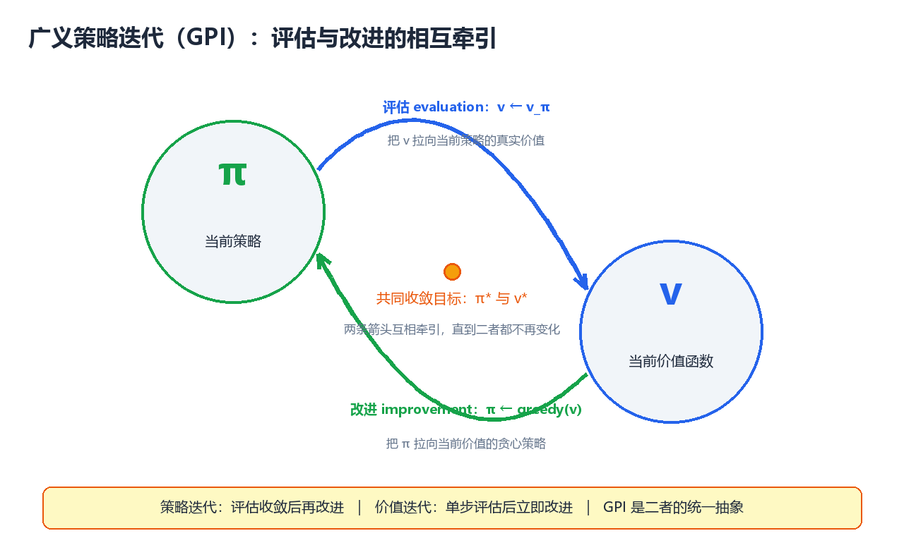
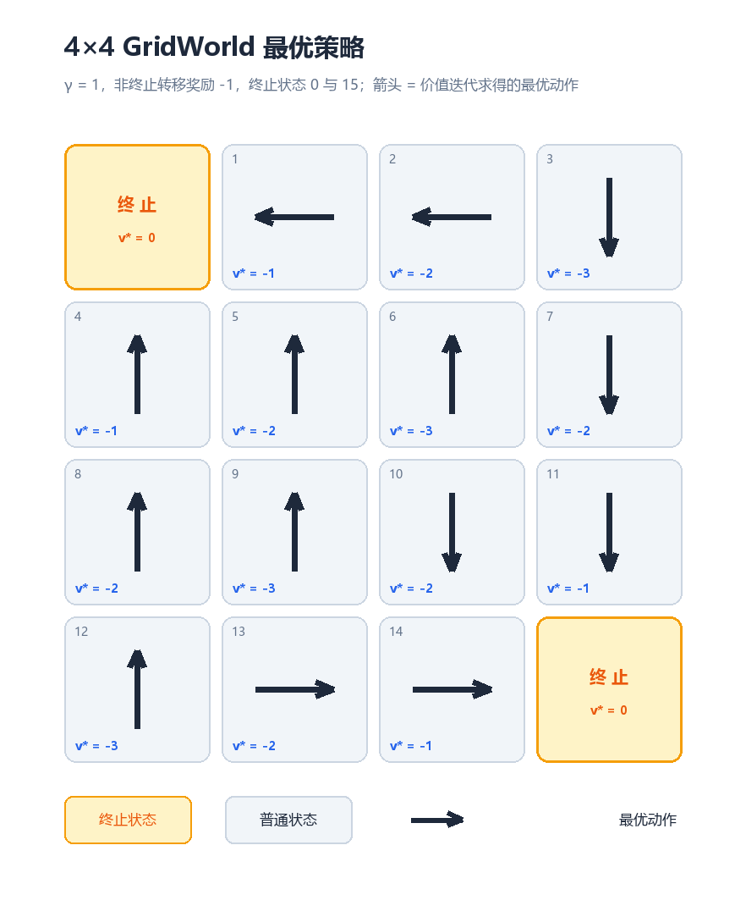

# 动态规划（Dynamic Programming）

> 动态规划（Dynamic Programming, DP）是求解马尔可夫决策过程（MDP）的
> 第一族完整算法，也是整个强化学习理论的**数学基石**。本章从"已知模型
> + 完美马尔可夫"两个前提出发，系统讲解**策略评估（Policy Evaluation）**、
> **策略改进（Policy Improvement）**、**策略迭代（Policy Iteration）**与
> **价值迭代（Value Iteration）** 四大核心算法，并以**广义策略迭代
> （Generalized Policy Iteration, GPI）** 的统一视角收束全章。全文假设读者
> 已掌握第 1 章的 MDP 五要素与贝尔曼方程；所有代码均为可运行的 Python 3
> 实现，实验环境为经典 4×4 GridWorld（Sutton & Barto 例 4.1 风格）。

---

## 一、动态规划在强化学习中的定位

### 1.1 "动态规划"这个名字从何而来

"动态规划"一词由 **Richard Bellman** 于 1950 年代提出。Bellman 选用
"dynamic"一词，一方面因为"动态"准确描述了问题**随时间分阶段决策**的结构，
另一方面是为了让这个数学方法听起来"足够有吸引力"。

在强化学习语境下，动态规划指**利用贝尔曼方程递归结构求解最优策略的
一族算法**：

```
动态规划 = 把"大问题"（整个 MDP 的最优策略）分解为
          "小问题"（每个状态的价值），
          再用小问题的解递归地组装出大问题的解
```

> **核心思想**：价值函数满足贝尔曼方程，即"当前状态的价值 = 即时奖励
> + 折扣后的未来状态价值"。这个**自指（self-referential）结构**天然适合
> 递归求解——只要把每个状态的价值算出来，最优策略就随之确定。DP 就是
> 围绕这个递归结构建立起来的完整算法族。

### 1.2 DP 的两个前提条件

DP 不是万能的，它成立需要两个**硬性前提**：

| 前提 | 含义 | 如果违反 |
|------|------|---------|
| **已知环境模型** | 转移概率 $P(s', r \mid s, a)$ 与奖励函数 $R(s, a)$ 完全已知 | 无法直接计算期望，必须与真实环境交互采样（→ 第 3、4 章免模型方法） |
| **完美马尔可夫** | 状态完全可观测，转移满足马尔可夫性质 | 贝尔曼方程失效，需要 POMDP 框架 |

这两个前提决定了 DP 的本质：**DP 是"规划"（planning），不是"学习"
（learning）**。

| 维度 | 规划（Planning） | 学习（Learning） |
|------|----------------|-----------------|
| 数据来源 | 已知模型，直接查 $P$ 与 $R$ | 与环境交互产生的经验轨迹 |
| 是否需要环境 | 不需要，纯计算 | 必须与环境交互 |
| 典型算法 | 策略迭代、价值迭代、MCTS | MC、TD、Q-Learning、PPO |
| 误差来源 | 数值近似、截断误差 | 采样噪声、函数逼近误差 |

### 1.3 DP 与 MC / TD 的定位对比

在第 3、4 章展开蒙特卡洛（Monte Carlo, MC）与时序差分（Temporal
Difference, TD）之前，先给出三者的宏观定位——这是理解后续章节的"地图"：

| 维度 | 动态规划 DP | 蒙特卡洛 MC | 时序差分 TD |
|------|------------|------------|------------|
| **是否需要环境模型** | 需要（已知 $P, R$） | 不需要 | 不需要 |
| **是否需要交互采样** | 不需要（纯计算） | 需要（完整回合） | 需要（单步即可） |
| **更新方式** | 全状态同步扫描（sweep） | 回合结束用整回合回报更新 | 每步"奖励 + 下一步估计"更新 |
| **自举（Bootstrapping）** | 是（用 $v_k(s')$ 更新 $v_{k+1}(s)$） | 否（用真实回报 $G_t$） | 是（用当前估计 $V(s')$） |
| **偏差 / 方差** | 无采样偏差（但需模型） | 无偏、高方差 | 有偏、低方差 |
| **代表算法** | 策略迭代、价值迭代 | 首次访问 / 每次访问 MC | SARSA、Q-Learning |

> **核心思想**：三者都在解同一个贝尔曼方程，区别只在"期望怎么算"——
> DP 用已知模型算精确期望，MC 用整回合采样近似期望，TD 用单步采样 +
> 自举折中。**DP 是理论基线，MC 与 TD 是它在模型未知时的"替身"**。

### 1.4 经典适用场景

DP 的经典适用场景，共同特征是**模型已知、状态空间有限（或可离散化）**：

| 场景 | 为什么适合 DP |
|------|--------------|
| **棋盘游戏求解**（国际象棋残局、黑白棋、双陆棋、井字棋） | 规则即模型，转移完全已知，状态可枚举 |
| **最短路径 / 图搜索**（Dijkstra、Floyd-Warshall 的思想源头） | 就是确定性的 MDP 求解 |
| **线性二次调节器（LQR）** 等最优控制问题 | 系统动力学已知，连续状态可用解析式 |
| **动态资产配置 / 背包问题 / 编辑距离** 等运筹问题 | 阶段决策结构天然是 MDP |
| **现代算法的内部规划器**（AlphaZero 的 MCTS 价值备份） | 在已知规则环境中"想几步" |

> **注意**：在绝大多数现代深度强化学习任务（像素输入、连续控制）中，
> 模型未知或状态空间巨大，DP 无法直接使用。但**理解 DP 是理解一切后续
> 算法的前提**——MC、TD、DQN 全部可以看作"用采样代替期望的 DP"。

### 1.5 贝尔曼方程的递归结构：DP 的引擎

第 1 章给出的两个核心方程，是本章所有算法的出发点：

**贝尔曼期望方程（Bellman Expectation Equation）**——描述"给定策略
$\pi$ 的价值"：

$$v_{\pi}(s) = \sum_{a} \pi(a \mid s) \sum_{s', r} P(s', r \mid s, a) \left[ r + \gamma v_{\pi}(s') \right]$$

**贝尔曼最优性方程（Bellman Optimality Equation）**——描述"最优价值"：

$$v_{*}(s) = \max_{a} \sum_{s', r} P(s', r \mid s, a) \left[ r + \gamma v_{*}(s') \right]$$

两者的共同结构是：**$v(s)$ 出现在等号两边**，这正是"递归"所在：

```
v(s) = r(s, a) + γ · v(s')     ← 等号右边还有 v
        ↑ 即时     ↑ 未来的价值（下一个状态的价值）
```

要解开这个自指方程，有三大类思路：

| 思路 | 方法 | 特点 |
|------|------|------|
| **直接求解** | 解线性方程组 $v = (I - \gamma P_\pi)^{-1} r_\pi$ | 精确但 $O(\lvert S \rvert^3)$，只适用于极小状态空间 |
| **迭代求解**（DP 的做法） | 从初始估计出发反复套用贝尔曼方程直到收敛 | 每次更新 $O(\lvert S \rvert^2 \lvert A \rvert)$，本章全部内容 |
| **采样求解**（MC/TD 的做法） | 用经验回报代替期望 | 模型未知时的替代方案（第 3、4 章） |

> **核心思想**：DP 选择"迭代求解"——不追求一步到位，而是让价值估计
> **一轮一轮地逼近**真实值。每一轮更新（backup）都在"消费"一次贝尔曼
> 方程，这正是"动态"二字的数学含义。

### 1.6 符号约定与本章路线图

本章沿用第 1 章符号，为方便查阅集中列出：

| 符号 | 含义 |
|------|------|
| $S, A, P, R, \gamma$ | MDP 五要素：状态集、动作集、转移概率、奖励、折扣因子 |
| $\pi(a \mid s)$ | 策略：状态到动作的（随机）映射 |
| $v_\pi(s), q_\pi(s, a)$ | 策略 $\pi$ 下的状态 / 动作价值函数 |
| $v_*(s), q_*(s, a), \pi_*$ | 最优价值函数与最优策略 |
| $v_k$ | 第 $k$ 轮迭代后的价值估计 |
| **sweep（扫描）** | 对全部状态完成一轮更新，是 DP 的基本计量单位 |

本章的算法路线：

```
              ┌─────────────────────────────────────┐
              │           已知模型 P, R              │
              └──────────────────┬──────────────────┘
                                 ▼
        ┌──────────────────────────────────────────┐
        │  策略评估（第 2 节）                        │
        │  任意 π ──► v_π（迭代贝尔曼期望方程）        │
        └──────────────────┬───────────────────────┘
                           ▼
        ┌──────────────────────────────────────────┐
        │  策略改进（第 3 节）                        │
        │  v_π ──► 贪心策略 π'（策略改进定理保证不差）  │
        └──────────────────┬───────────────────────┘
                           ▼
        ┌──────────────────────────────────────────┐
        │  策略迭代（第 4 节）：评估 ⟷ 改进，循环至收敛 │
        │  价值迭代（第 5 节）：评估与改进合并为 max 备份│
        └──────────────────────────────────────────┘
                           ▼
        ┌──────────────────────────────────────────┐
        │  广义策略迭代 GPI（第 6 节）：统一视角        │
        │  扩展与局限（第 7 节）→ 完整实验（第 8 节）    │
        └──────────────────────────────────────────┘
```

---

## 二、策略评估（Policy Evaluation）

### 2.1 问题定义

**策略评估**（又称**预测问题，prediction problem**）：给定策略 $\pi$，
计算它的状态价值函数 $v_\pi$：

$$
v_{\pi}(s) = \mathbb{E}_{\pi}\left[ G_t \,\middle|\, S_t = s \right]
= \mathbb{E}_{\pi}\left[ \sum_{k=0}^{\infty} \gamma^k R_{t+k+1} \,\middle|\, S_t = s \right]
$$

这是"评估"而非"求解最优"——我们不问"最好的策略是什么"，只问
"**这个**策略到底有多好"。

> **为什么先学评估？** 因为"改进"依赖"评估"：要判断一个策略好不好、
> 往哪个方向改进，必须先能量化它的价值。策略评估是所有后续算法
> （策略迭代、价值迭代、乃至 MC/TD 预测）的公共组件。

### 2.2 迭代策略评估：公式与推导

直接解 $v_\pi$ 需要解 $|S|$ 元线性方程组，代价 $O(|S|^3)$。DP 的替代
方案是**迭代策略评估（Iterative Policy Evaluation）**：从初始估计 $v_0$
出发，反复应用贝尔曼期望方程：

$$
\boxed{\; v_{k+1}(s) = \sum_{a} \pi(a \mid s) \sum_{s', r} P(s', r \mid s, a) \left[ r + \gamma v_k(s') \right] \;}
$$

**推导**：贝尔曼期望方程 $v_\pi = \mathcal{T}^\pi v_\pi$ 定义了算子
$\mathcal{T}^\pi$（贝尔曼期望算子）。迭代策略评估就是不动点迭代
$v_{k+1} = \mathcal{T}^\pi v_k$，而 $\mathcal{T}^\pi$ 是**压缩映射
（contraction mapping）**：对任意 $u, v$ 有

$$
\left\| \mathcal{T}^\pi u - \mathcal{T}^\pi v \right\|_\infty \le \gamma \left\| u - v \right\|_\infty, \qquad \gamma < 1
$$

> **核心思想**：贝尔曼期望算子每作用一次，价值估计与真实 $v_\pi$ 的
> 距离至少缩小 $\gamma$ 倍。因此无论 $v_0$ 取什么初值，迭代都**线性收敛**
> 到唯一不动点 $v_\pi$。当 $\gamma = 1$ 时，只要策略保证最终到达吸收终止
> 状态（如本章 GridWorld），同样收敛。

**算法伪代码**（Sutton & Barto 算法 4.1 风格）：

```
输入：策略 π，阈值 θ > 0
初始化：V(s) = 0（非终止状态），V(终止) = 0
重复：
    Δ ← 0
    对每个状态 s ∈ S：
        v ← V(s)
        V(s) ← Σ_a π(a|s) Σ_{s',r} P(s',r|s,a) [r + γV(s')]
        Δ ← max(Δ, |v − V(s)|)
直到 Δ < θ
输出：V ≈ v_π
```

**一次更新（backup）的图示**——价值从"后继状态"流向"当前状态"：

```
              动作 a₁ ──► s'₁ ── r₁
             ╱
    s ──●─── 动作 a₂ ──► s'₂ ── r₂   ← 叶子 v_k(s') 汇聚到根 v_{k+1}(s)
             ╲
              动作 a₃ ──► s'₃ ── r₃
```

### 2.3 收敛性：不动点视角

为什么"反复套公式"就能收敛？把真实值 $v_\pi$ 想成一根弹簧的固定端，
当前估计 $v_k$ 是自由端——每次更新都把估计**往真实值方向拉一把**，
拉力恰好是 $\gamma$ 倍的距离：

| 迭代轮数 | 误差上界（相对初值误差） |
|---------|------------------------|
| $k$ | $\gamma^k \cdot \lVert v_0 - v_\pi \rVert_\infty$ |
| $\gamma = 0.9$，$k = 10$ | $0.9^{10} \approx 0.35$（误差降到 1/3） |
| $\gamma = 0.9$，$k = 50$ | $0.9^{50} \approx 0.005$（误差降到 0.5%） |
| $\gamma = 0.5$，$k = 10$ | $0.5^{10} \approx 0.001$（几乎收敛） |

> **核心思想**：$\gamma$ 越小收敛越快（但"看得越近"）；$\gamma$ 越大收敛
> 越慢（但价值越"有远见"）。**收敛速度与折扣因子直接挂钩**，这是 DP 所有
> 迭代算法的共同规律。

### 2.4 一个小例子：三状态链的逐轮迭代

用一个最小的三状态 MDP 观察迭代过程。状态 $A, B, C$ 构成循环，策略固定
为"总是走向下一个状态"，每步奖励 $+1$，$\gamma = 0.9$：

```
A ──► B ──► C ──► A ──► ...   （循环，无终止状态）
π：A→B，B→C，C→A；奖励恒为 +1
```

由对称性 $v(A) = v(B) = v(C) = v$，贝尔曼方程给出 $v = 1 + 0.9v$，
解析解 $v = 10$。从 $v_0 = 0$ 出发迭代（真实运行结果）：

| 轮数 $k$ | $v_k(A) = v_k(B) = v_k(C)$ | 与极限 10 的误差 |
|---------|---------------------------|----------------|
| 0 | 0.0000 | 10.0000 |
| 1 | 1.0000 | 9.0000 |
| 2 | 1.9000 | 8.1000 |
| 3 | 2.7100 | 7.2900 |
| 4 | 3.4390 | 6.5610 |
| 5 | 4.0951 | 5.9049 |
| 6 | 4.6856 | 5.3144 |
| 7 | 5.2170 | 4.7830 |
| 8 | 5.6953 | 4.3047 |
| 9 | 6.1258 | 3.8742 |
| 10 | 6.5132 | 3.4868 |
| $\infty$ | 10.0000 | 0.0000 |

**观察**：每轮误差恰好乘以 $\gamma = 0.9$（$9.0 \to 8.1 \to 7.29 \to \dots$），
这正是压缩映射理论的**数值验证**——误差呈几何级数衰减，衰减率就是 $\gamma$。

对应代码：

```python
import numpy as np

# 三状态链：A=0, B=1, C=2；策略固定为"走向下一个状态"；奖励恒为 +1
gamma = 0.9
V = np.zeros(3)
for k in range(1, 11):
    V_new = np.zeros(3)
    for s in range(3):
        ns = (s + 1) % 3          # 策略：A→B, B→C, C→A
        V_new[s] = 1.0 + gamma * V[ns]
    V = V_new
    print(f"k={k:2d}: V(A)={V[0]:8.4f}  V(B)={V[1]:8.4f}  V(C)={V[2]:8.4f}")

# 预期输出:
# k= 1: V(A)=  1.0000  V(B)=  1.0000  V(C)=  1.0000
# k= 2: V(A)=  1.9000  V(B)=  1.9000  V(C)=  1.9000
# k= 3: V(A)=  2.7100  V(B)=  2.7100  V(C)=  2.7100
# k= 4: V(A)=  3.4390  V(B)=  3.4390  V(C)=  3.4390
# k= 5: V(A)=  4.0951  V(B)=  4.0951  V(C)=  4.0951
# k= 6: V(A)=  4.6856  V(B)=  4.6856  V(C)=  4.6856
# k= 7: V(A)=  5.2170  V(B)=  5.2170  V(C)=  5.2170
# k= 8: V(A)=  5.6953  V(B)=  5.6953  V(C)=  5.6953
# k= 9: V(A)=  6.1258  V(B)=  6.1258  V(C)=  6.1258
# k=10: V(A)=  6.5132  V(B)=  6.5132  V(C)=  6.5132
# （极限值 = 1 / (1 - 0.9) = 10.0）
```

### 2.5 实验环境：4×4 GridWorld

本章正式实验环境沿用 Sutton & Barto 例 4.1 的 **GridWorld**：

| 规则项 | 定义 |
|--------|------|
| **状态空间** | $4 \times 4$ 网格，编号 0–15 |
| **终止状态** | 左上角 0 与右下角 15（奖励 0，永久停留） |
| **动作空间** | 上、下、左、右（确定性转移） |
| **奖励** | 每次非终止转移奖励 $-1$；**撞墙（越界）原地不动，仍奖励 $-1$** |
| **折扣因子** | $\gamma = 1$（任务必然终止，无需折扣） |
| **目标** | 从任意格子出发，以最少步数到达任一终止状态 |

网格布局（`T` 为终止状态）：

```
       列 0    列 1    列 2    列 3
行 0  ┌─────┬─────┬─────┬─────┐
      │  0  │  1  │  2  │  3  │
      │  T  │     │     │     │
行 1  ├─────┼─────┼─────┼─────┤
      │  4  │  5  │  6  │  7  │
行 2  ├─────┼─────┼─────┼─────┤
      │  8  │  9  │ 10  │ 11  │
行 3  ├─────┼─────┼─────┼─────┤
      │ 12  │ 13  │ 14  │ 15  │
      │     │     │     │  T  │
      └─────┴─────┴─────┴─────┘
```

环境代码（后续所有实验共用）：

```python
import numpy as np

SIZE = 4
N = SIZE * SIZE                 # 16 个状态
TERMINAL = {0, 15}              # 终止状态集合
ORDER = ['↑', '↓', '←', '→']   # 动作遍历顺序（决定平局时的取舍）
ACT_DELTA = {'↑': -SIZE, '↓': +SIZE, '←': -1, '→': +1}

def step(s, a):
    """执行动作 a，返回 (s', r)。
    越界（撞墙）则原地停留；非终止转移奖励 -1；终止状态奖励 0 并停留。"""
    if s in TERMINAL:
        return s, 0.0
    ns = s + ACT_DELTA[a]
    # 撞墙检测：上下越界 / 左右越界
    if ns < 0 or ns >= N:
        ns = s
    if (s % SIZE == 0 and a == '←') or (s % SIZE == SIZE - 1 and a == '→'):
        ns = s
    return ns, -1.0

def show(V, dec=2):
    """把价值向量打印为 4x4 表格"""
    print(np.array2string(V.reshape(SIZE, SIZE), precision=dec,
                          suppress_small=True, floatmode='fixed'))

def show_policy(policy):
    """把策略打印为箭头网格（T 表示终止状态）"""
    for r in range(SIZE):
        print('  '.join('T' if (r * SIZE + c) in TERMINAL
                        else policy[r * SIZE + c] for c in range(SIZE)))
```

### 2.6 Python 实现：随机策略的迭代评估

对 GridWorld 应用**均匀随机策略**（四动作各 $0.25$ 概率），用迭代策略
评估计算 $v_\pi$：

```python
# 均匀随机策略的迭代策略评估
gamma = 1.0
V = np.zeros(N)

for k in range(1, 5):
    V_new = np.zeros(N)
    for s in range(N):
        if s in TERMINAL:
            continue                    # 终止状态价值恒为 0
        total = 0.0
        for a in ORDER:                 # 4 个动作，各 0.25 概率
            ns, r = step(s, a)
            total += 0.25 * (r + gamma * V[ns])
        V_new[s] = total
    V = V_new
    print(f"--- k={k} ---")
    show(V)

# 预期输出:
# --- k=1 ---
# [[ 0.00 -1.00 -1.00 -1.00]
#  [-1.00 -1.00 -1.00 -1.00]
#  [-1.00 -1.00 -1.00 -1.00]
#  [-1.00 -1.00 -1.00  0.00]]
# --- k=2 ---
# [[ 0.00 -1.75 -2.00 -2.00]
#  [-1.75 -2.00 -2.00 -2.00]
#  [-2.00 -2.00 -2.00 -1.75]
#  [-2.00 -2.00 -1.75  0.00]]
# --- k=3 ---
# [[ 0.00 -2.44 -2.94 -3.00]
#  [-2.44 -2.88 -3.00 -2.94]
#  [-2.94 -3.00 -2.88 -2.44]
#  [-3.00 -2.94 -2.44  0.00]]
# --- k=4 ---
# [[ 0.00 -3.06 -3.84 -3.97]
#  [-3.06 -3.72 -3.91 -3.84]
#  [-3.84 -3.91 -3.72 -3.06]
#  [-3.97 -3.84 -3.06  0.00]]
```

继续迭代直到收敛（$\Delta < 10^{-4}$），需要 **173 次扫描**，得到 $v_\pi$
（与 Sutton 教材图 4.1 完全一致）：

```python
# 收敛版本：加收敛判据，打印最终结果
theta = 1e-4
V = np.zeros(N)
for it in range(1, 10000):
    V_new = np.zeros(N)
    for s in range(N):
        if s in TERMINAL:
            continue
        total = 0.0
        for a in ORDER:
            ns, r = step(s, a)
            total += 0.25 * (r + gamma * V[ns])
        V_new[s] = total
    delta = np.max(np.abs(V_new - V))
    V = V_new
    if delta < theta:
        break
print(f"随机策略评估收敛于第 {it} 轮（delta={delta:.2e}）")
show(V)

# 预期输出:
# 随机策略评估收敛于第 173 轮（delta=9.89e-05）
# [[  0.00 -14.00 -20.00 -22.00]
#  [-14.00 -18.00 -20.00 -20.00]
#  [-20.00 -20.00 -18.00 -14.00]
#  [-22.00 -20.00 -14.00   0.00]]
```

### 2.7 输出解读

| 现象 | 解释 |
|------|------|
| 所有值都为负 | 随机策略每步期望收益为负，到达终止前的步数越多越负 |
| 角落附近（状态 1、4）值最大（$-14$） | 靠近终止状态，随机游走很快能撞进去 |
| 中心区域（状态 2、3、7）值最负（$-20 \sim -22$） | 离两个终止状态都远，随机游走耗时最长 |
| 完全对称 | 网格关于对角线（0–15 连线）对称，价值也对称 |

> **核心思想**：价值函数把"策略的远期后果"压缩成一个数——它反映的是
> **在策略 $\pi$ 下，从这个状态出发平均还要吃多少苦（负奖励）**。有了
> 这个数，就能判断"往哪个方向走更好"——这正是下一节策略改进的输入。

### 2.8 工程细节：收敛判据与实现选择

| 实现问题 | 标准做法 | 说明 |
|---------|---------|------|
| **何时停止** | $\max_s \lvert V_{new}(s) - V(s) \rvert < \theta$（如 $10^{-4}$） | 相邻两轮最大变化量（delta）作收敛度量 |
| **终止状态** | 价值恒为 0，不参与更新 | 由环境定义保证，是边界条件 |
| **双数组 vs 就地** | 双数组与理论公式一一对应；就地更新收敛更快 | 就地更新见 7.1 节 |
| **$\gamma = 1$ 是否安全** | 策略保证最终到达终止状态即安全 | 否则价值发散（负奖励无限累积） |
| **复杂度** | 每轮 $O(\lvert S \rvert^2 \lvert A \rvert)$ | 每个状态要遍历所有后继求期望 |

---

## 三、策略改进（Policy Improvement）

### 3.1 从评估到改进：贪心的一步

有了 $v_\pi$，如何得到**更好的**策略？最自然的想法是**贪心（greedy）**：
在每个状态，选择使"即时奖励 + 后续价值"最大的动作：

$$
\pi'(s) = \arg\max_{a} \sum_{s', r} P(s', r \mid s, a) \left[ r + \gamma v_{\pi}(s') \right]
$$

> **核心思想**：策略改进就是"**站在当前价值函数上做一步贪心**"。它不改
> 变价值函数，只根据 $v_\pi$ 重新选择动作——把策略从"按 $\pi$ 行动"改成
> "每步都选当前看起来最好的动作"。

### 3.2 策略改进定理（Policy Improvement Theorem）

贪心改进真的能让策略变得**不差**吗？这是本节的**核心定理**：

> **策略改进定理**：设 $\pi$ 与 $\pi'$ 是任意两个确定性策略，若对任意
> 状态 $s$ 有
>
> $$q_{\pi}\big(s, \pi'(s)\big) \ge v_{\pi}(s)$$
>
> 则 $\pi'$ 至少与 $\pi$ 一样好：
>
> $$v_{\pi'}(s) \ge v_{\pi}(s), \qquad \forall s \in S$$

**直觉论证**：条件说的是"**在状态 $s$ 用 $\pi'$ 的动作、其余状态仍用
$\pi$**，不比全程用 $\pi$ 差"。把 $\pi'$ 的"背叛"逐步扩散到所有状态：

```
第 1 步：只在 s 用 π' 的动作    → 不差于全程 π        （由条件）
第 2 步：在 s 与 s' 用 π' 的动作 → 不差于第 1 步       （对 s' 再套条件）
第 3 步：在 s、s'、s'' 用 π'    → 不差于第 2 步        （依此类推）
  ⋮
全程用 π'                     → 不差于全程用 π      （有限状态，有限步扩散完）
```

**形式化证明（telescoping）**：设 $\pi'$ 满足条件，反复展开：

$$
\begin{aligned}
v_{\pi}(s) &\le q_{\pi}(s, \pi'(s)) \\
&= \mathbb{E}\left[ R_{t+1} + \gamma v_{\pi}(S_{t+1}) \,\middle|\, S_t = s, A_t = \pi'(s) \right] \\
&\le \mathbb{E}_{\pi'}\left[ R_{t+1} + \gamma q_{\pi}(S_{t+1}, \pi'(S_{t+1})) \,\middle|\, S_t = s \right] \\
&= \mathbb{E}_{\pi'}\left[ R_{t+1} + \gamma R_{t+2} + \gamma^2 v_{\pi}(S_{t+2}) \,\middle|\, S_t = s \right] \\
&\le \cdots \le \mathbb{E}_{\pi'}\left[ \sum_{k=0}^{\infty} \gamma^k R_{t+k+1} \,\middle|\, S_t = s \right] = v_{\pi'}(s)
\end{aligned}
$$

每一步都在"把下一个状态也换成按 $\pi'$ 行动"，反复套用条件后得到
$v_\pi(s) \le v_{\pi'}(s)$。$\blacksquare$

> **注意**：贪心改进 $\pi'(s) = \arg\max_a q_\pi(s, a)$ 显然满足定理条件
> （取最大值当然不小于 $v_\pi(s)$），所以**贪心改进后的策略一定不差于原
> 策略**。这就是策略迭代能"越改越好"的理论基石。

### 3.3 为什么"贪心"不会变差：一个直观类比

把价值函数想成一张"地形图"，$v_\pi(s)$ 是每个位置的海拔（越高越好）。
贪心改进相当于：**在每个位置，朝海拔上升最快的方向迈一步**。因为海拔
（价值）已经编码了"未来的所有后果"，所以朝最陡方向走，即使暂时绕路，
长期也不会吃亏。

```
地形图视角：
                v 值等高线（越高越好）
                 ▲
                 │  ← 贪心：总是选择"r + γ·v(s')"最大的方向
                 │     相当于沿最陡上升方向走
                 ▼
    只要 v 是"诚实的"（= v_π），贪心就不会走到更差的地方
```

### 3.4 等号情形：最优策略的判定条件

如果改进之后**每个状态都选不出更好的动作**——即 $\pi'$ 与 $\pi$ 完全
相同——说明什么？对每个状态 $s$：

$$
v_{\pi}(s) = \max_{a} \sum_{s', r} P(s', r \mid s, a) \left[ r + \gamma v_{\pi}(s') \right]
$$

这正是**贝尔曼最优性方程**！因此：

> **核心思想**：$\pi' = \pi$（改进不动）当且仅当 $v_\pi = v_*$，此时 $\pi$
> 就是最优策略 $\pi_*$。**"改进不动"就是最优的判据**——策略迭代正是利用
> 这个判据停机的。

### 3.5 示例：对随机策略价值做一次贪心改进

用 2.6 节收敛的 $v_\pi$（随机策略）做一次贪心改进。对每个状态计算
$\pi'(s) = \arg\max_a \left[ -1 + v_\pi(s') \right]$。以状态 1 为例：

| 动作 | 下一状态 $s'$ | $q(s, a) = -1 + v_\pi(s')$ |
|------|--------------|---------------------------|
| ↑（撞墙） | 1 | $-1 + (-14) = -15$ |
| ↓ | 5 | $-1 + (-18) = -19$ |
| ← | 0（终止） | $-1 + 0 = -1$ |
| → | 2 | $-1 + (-20) = -21$ |

显然 $\pi'(1) = \leftarrow$——直接走向终止状态。对全部 16 个状态做同样
计算，得到改进后的策略：

```
T  ←  ←  ↓
↑  ↑  ←  ↓
↑  ↑  ↓  ↓
↑  ↓  →  T
```

**重要观察**：这个策略**还不是**最优的（状态 13 选 ↓ 会撞墙原地打转，
正确动作是 →）。原因：$v_\pi$ 是随机策略的价值，用它做贪心，在价值相等
处（状态 13 的 ↓ 与 → 都给出 $-15$）可能选错。**一次改进往往不够**——
这正是下一节"评估 → 改进 → 再评估 → 再改进"循环的动机。

---

## 四、策略迭代（Policy Iteration）

### 4.1 完整流程

**策略迭代（Policy Iteration, PI）** 把前两节的组件串成循环：评估当前
策略 → 贪心改进 → 再评估 → 再改进……直到策略不再变化。

```
                    ┌──────────────────────────────────────────┐
                    │                                          │
                    ▼                                          │
        ┌─────────────────────┐                                │
        │  ① 策略评估          │                                │
        │  用迭代策略评估       │                                │
        │  求 v_π（直到收敛）   │                                │
        └──────────┬──────────┘                                │
                   │  v_π                                      │
                   ▼                                           │
        ┌─────────────────────┐                                │
        │  ② 策略改进          │                                │
        │  π' = greedy(v_π)   │                                │
        └──────────┬──────────┘                                │
                   │                                           │
                   ├── π' = π ？──── 是 ────► 输出 π* = π, v* = v_π
                   │
                   └── 否：π ← π'，回到 ①（循环）
```

**伪代码**（Sutton & Barto 算法 4.3 风格）：

```
1. 初始化：任选策略 π（如随机策略）
2. 策略评估：迭代计算 v_π（见第 2 节），直到收敛
3. 策略改进：π'(s) = argmax_a Σ P(s',r|s,a)[r + γv_π(s')]
4. 若 π' ≠ π：π ← π'，回到 2；否则输出 π* = π' 与 v* = v_π
```

### 4.2 收敛性与复杂度

| 性质 | 结论 | 理由 |
|------|------|------|
| **单调性** | 每轮改进后策略不差于上一轮 | 策略改进定理（3.2 节） |
| **有限终止** | 有限 MDP 中在**有限步**内收敛到 $\pi_*$ | 确定性策略总数有限（$\lvert A \rvert^{\lvert S \rvert}$），序列严格单调 |
| **改进轮数** | 实践中通常很少（往往 3–10 轮） | 每轮是全局贪心，一步能修正大量状态 |
| **单轮代价** | 评估 $O(k \lvert S \rvert^2 \lvert A \rvert)$，改进 $O(\lvert S \rvert \lvert A \rvert)$ | $k$ 为评估扫描次数 |

> **核心思想**：策略迭代每一步都让策略**严格变好**（除非已最优），而策略
> 空间有限，所以必然在有限步内停在最优策略上。这与价值迭代"价值单调逼近、
> 策略可能来回跳"形成鲜明对比。

### 4.3 Python 实现：GridWorld 策略迭代

初始策略 $\pi_0$ 取"**每个状态优先向右，最右一列向下**"（合法但明显
低效，方便观察改进过程）：

```python
# ---------- 策略迭代：完整实现 ----------
gamma = 1.0
theta = 1e-4

def evaluate(policy, gamma=gamma, theta=theta, max_sweeps=10000):
    """确定性策略评估：反复扫描直至收敛，返回 (V, 扫描次数)"""
    V = np.zeros(N)
    for sweep in range(1, max_sweeps + 1):
        V_new = V.copy()
        delta = 0.0
        for s in range(N):
            if s in TERMINAL:
                continue
            ns, r = step(s, policy[s])
            V_new[s] = r + gamma * V[ns]
            delta = max(delta, abs(V_new[s] - V[s]))
        V = V_new
        if delta < theta:
            return V, sweep
    return V, max_sweeps

def improve(policy, V, gamma=gamma):
    """贪心改进：返回 (新策略, 是否稳定)。平局取动作序中第一个。"""
    stable = True
    new_policy = policy.copy()
    for s in range(N):
        if s in TERMINAL:
            continue
        best_a, best_q = None, -np.inf
        for a in ORDER:                     # 严格大于：平局取第一个
            ns, r = step(s, a)
            q = r + gamma * V[ns]
            if q > best_q:
                best_q, best_a = q, a
        new_policy[s] = best_a
        if best_a != policy[s]:
            stable = False
    return new_policy, stable

# 初始策略：向右走，最右一列向下
policy = ['→'] * N
for r in range(SIZE):
    policy[r * SIZE + 3] = '↓'

V = np.zeros(N)
total_sweeps = 0
for pi_round in range(1, 10):
    V, sweeps = evaluate(policy)           # ① 策略评估
    total_sweeps += sweeps
    new_policy, stable = improve(policy, V)  # ② 策略改进
    print(f"第 {pi_round} 轮：评估 {sweeps} 次扫描；策略{'已稳定' if stable else '已更新'}")
    print("V 表:"); show(V)
    print("策略:"); show_policy(new_policy)
    policy = new_policy
    if stable:
        break
print(f"评估阶段总扫描次数: {total_sweeps}")

# 预期输出:
# 第 1 轮：评估 6 次扫描；策略已更新
# V 表:
# [[ 0.00 -5.00 -4.00 -3.00]
#  [-5.00 -4.00 -3.00 -2.00]
#  [-4.00 -3.00 -2.00 -1.00]
#  [-3.00 -2.00 -1.00  0.00]]
# 策略:
# T  ←  ↓  ↓
# ↑  ↓  ↓  ↓
# ↓  ↓  ↓  ↓
# →  →  →  T
# 第 2 轮：评估 2 次扫描；策略已更新
# V 表:
# [[ 0.00 -1.00 -4.00 -3.00]
#  [-1.00 -4.00 -3.00 -2.00]
#  [-4.00 -3.00 -2.00 -1.00]
#  [-3.00 -2.00 -1.00  0.00]]
# 策略:
# T  ←  ←  ↓
# ↑  ↑  ↓  ↓
# ↑  ↓  ↓  ↓
# →  →  →  T
# 第 3 轮：评估 2 次扫描；策略已更新
# V 表:
# [[ 0.00 -1.00 -2.00 -3.00]
#  [-1.00 -2.00 -3.00 -2.00]
#  [-2.00 -3.00 -2.00 -1.00]
#  [-3.00 -2.00 -1.00  0.00]]
# 策略:
# T  ←  ←  ↓
# ↑  ↑  ↑  ↓
# ↑  ↑  ↓  ↓
# ↑  →  →  T
# 第 4 轮：评估 1 次扫描；策略已稳定
# V 表:
# [[ 0.00 -1.00 -2.00 -3.00]
#  [-1.00 -2.00 -3.00 -2.00]
#  [-2.00 -3.00 -2.00 -1.00]
#  [-3.00 -2.00 -1.00  0.00]]
# 策略:
# T  ←  ←  ↓
# ↑  ↑  ↑  ↓
# ↑  ↑  ↓  ↓
# ↑  →  →  T
# 评估阶段总扫描次数: 11
```

### 4.4 输出解读

| 观察点 | 内容 |
|--------|------|
| **收敛轮数** | 仅 4 轮（3 次改进 + 1 次确认），评估总扫描仅 11 次 |
| **第 1 轮** | 评估 $\pi_0$ 用 6 次扫描；改进后策略大改（大量状态转向最近终止状态） |
| **第 2–3 轮** | 评估只需 2 次扫描；改进逐步修正残余错误 |
| **第 4 轮** | 评估 1 次扫描即收敛，改进后策略不变 → 停机 |
| **最优价值** | $v_*(s) = -\text{（到最近终止状态的最短步数）}$，如 $v_*(1) = -1$、$v_*(3) = -3$ |
| **扫描次数递减** | $6 \to 2 \to 2 \to 1$：策略越好，评估收敛越快 |

> **核心思想**：策略迭代的"快"来自**改进的高杠杆**——每次贪心改进都是
> 全局性的，一步就能让几乎所有状态的动作同时变对；随后只需少量评估扫描
> 确认。**评估次数递减**（$6 \to 2 \to 2 \to 1$）是最直观的效率信号。

### 4.5 一个工程优化：截断策略评估

策略评估真的需要收敛到 $v_\pi$ 吗？**不需要**。策略改进定理只要求"改进
不差于原策略"，只要评估足够接近，贪心改进通常仍然有效。于是有**截断策略
评估（truncated policy evaluation）**：

| 变体 | 评估方式 | 效果 |
|------|---------|------|
| 标准策略迭代 | 评估到 $\Delta < \theta$（完全收敛） | 理论最干净 |
| **截断评估**（如固定 1 次扫描） | 每轮只做 1 次价值更新就改进 | 这就是**价值迭代**（第 5 节），收敛更快 |
| 中间方案 | 每轮做 $k$ 次扫描（$k$ 较小） | 在两者之间权衡 |

> **核心思想**：策略迭代与价值迭代不是两个割裂的算法，而是**"评估做到
> 多彻底"的同一个连续谱的两端**。这个认识是第 6 节 GPI 统一视角的伏笔。

---

## 五、价值迭代（Value Iteration）

### 5.1 合并评估与改进：一步到位

策略迭代每轮都要把评估做到收敛，很"奢侈"。**价值迭代（Value Iteration,
VI）** 把"一次评估更新"与"一次贪心改进"合并成**一个备份**：更新价值时
直接取 $\max$，而不是按策略求期望：

$$
\boxed{\; v_{k+1}(s) = \max_{a} \sum_{s', r} P(s', r \mid s, a) \left[ r + \gamma v_k(s') \right] \;}
$$

**推导视角**：把贝尔曼最优性方程 $v_* = \mathcal{T}^* v_*$ 视为不动点方程，
最优贝尔曼算子 $\mathcal{T}^*$ 定义为

$$
(\mathcal{T}^* v)(s) = \max_{a} \sum_{s', r} P(s', r \mid s, a) \left[ r + \gamma v(s') \right]
$$

价值迭代就是对 $\mathcal{T}^*$ 做不动点迭代 $v_{k+1} = \mathcal{T}^* v_k$。
由于 $\mathcal{T}^*$ 同样是 $\gamma$-压缩映射，迭代必收敛到 $v_*$。

**与策略迭代的关系**：价值迭代 = **每轮只做一次评估扫描 + 立即改进**
的策略迭代（截断评估的极端情形）。

### 5.2 两种理解方式

| 理解方式 | 内容 |
|---------|------|
| **截断策略迭代** | 每轮评估只做 1 次扫描就改进 → 改进与评估合并为 max 备份 |
| **反向动态规划** | 从终止状态出发"倒着"传播价值：先知道离终止 1 步的状态值，再 2 步…… |

第二种理解对 GridWorld 尤其直观：$\gamma = 1$ 且每步 $-1$ 时，第 $k$ 轮
价值恰好是"**距离终止状态 $k$ 步以内**的最优剩余步数（取负）"：

```
k=1：价值 -1 的区域 = 一步能到终止的状态（状态 1、4、11、14）
k=2：价值 -2 的区域 = 两步能到终止的状态
k=3：价值 -3 的区域 = 三步能到终止的状态（状态 3、6、9、12）
```

价值像**水波一样从两个终止状态向外扩散**，每轮扩散一圈。

### 5.3 与策略迭代的对比

这是本章最重要的对比表，请重点理解：

| 维度 | 策略迭代（PI） | 价值迭代（VI） |
|------|--------------|--------------|
| **每轮做什么** | 完整评估 $v_\pi$（多轮扫描）→ 再改进 | 单轮 max 备份（评估 + 改进合并） |
| **单轮计算代价** | 高（评估需多次扫描） | 低（每轮只扫一遍） |
| **收敛速度（轮数）** | 轮数少（通常 3–10 轮），但每轮重 | 轮数多（约最短路径长度量级），但每轮轻 |
| **中间结果的意义** | 每轮结束对应一个**完整策略**及其价值 | 中间 $v_k$ 不对应任何完整策略，只是价值估计 |
| **停机判据** | 策略不再变化（精确） | 价值变化小于阈值（近似，$\theta$ 控制精度） |
| **是否显式维护策略** | 是（每轮改进一次） | 否（只在最后从 $v_*$ 提取一次贪心策略） |
| **典型应用** | 需要"每步都有可用策略"的场景 | 最短路径类问题、大规模离散 MDP 的默认选择 |
| **GridWorld 实测** | 4 轮、11 次扫描 | 3 轮价值即精确、第 4 轮 delta = 0 |

> **核心思想**：PI 是"**少而重**"（轮数少、每轮贵），VI 是"**多而轻**"
> （轮数多、每轮便宜）。状态空间很大时，VI 每轮代价与 PI 单轮评估的一次
> 扫描相同，而 VI 总扫描数 ≈ 最长最短路径长度，通常远小于 PI 的评估总
> 扫描数——**工程上 VI 往往更快**，也是默认选择。

### 5.4 Python 实现：GridWorld 价值迭代

```python
# ---------- 价值迭代：完整实现 ----------
gamma = 1.0
theta = 1e-4

V = np.zeros(N)
for k in range(1, 10000):
    V_new = np.zeros(N)
    for s in range(N):
        if s in TERMINAL:
            continue
        best = -np.inf
        for a in ORDER:                     # max 备份：评估与改进合并
            ns, r = step(s, a)
            best = max(best, r + gamma * V[ns])
        V_new[s] = best
    delta = np.max(np.abs(V_new - V))
    V = V_new
    print(f"k={k}: max|ΔV| = {delta:.4f}")
    if k <= 4:
        show(V)
    if delta < theta:
        break
print(f"价值迭代收敛于第 {k} 轮")

# 由 V* 提取最优策略（只在最后做一次贪心）
policy = [' '] * N
for s in range(N):
    if s in TERMINAL:
        continue
    best_a, best_q = None, -np.inf
    for a in ORDER:
        ns, r = step(s, a)
        q = r + gamma * V[ns]
        if q > best_q:
            best_q, best_a = q, a
    policy[s] = best_a
print("最优策略:"); show_policy(policy)

# 预期输出:
# k=1: max|ΔV| = 1.0000
# [[ 0.00 -1.00 -1.00 -1.00]
#  [-1.00 -1.00 -1.00 -1.00]
#  [-1.00 -1.00 -1.00 -1.00]
#  [-1.00 -1.00 -1.00  0.00]]
# k=2: max|ΔV| = 1.0000
# [[ 0.00 -1.00 -2.00 -2.00]
#  [-1.00 -2.00 -2.00 -2.00]
#  [-2.00 -2.00 -2.00 -1.00]
#  [-2.00 -2.00 -1.00  0.00]]
# k=3: max|ΔV| = 1.0000
# [[ 0.00 -1.00 -2.00 -3.00]
#  [-1.00 -2.00 -3.00 -2.00]
#  [-2.00 -3.00 -2.00 -1.00]
#  [-3.00 -2.00 -1.00  0.00]]
# k=4: max|ΔV| = 0.0000
# [[ 0.00 -1.00 -2.00 -3.00]
#  [-1.00 -2.00 -3.00 -2.00]
#  [-2.00 -3.00 -2.00 -1.00]
#  [-3.00 -2.00 -1.00  0.00]]
# 价值迭代收敛于第 4 轮
# 最优策略:
# T  ←  ←  ↓
# ↑  ↑  ↑  ↓
# ↑  ↑  ↓  ↓
# ↑  →  →  T
```

### 5.5 输出解读

| 观察点 | 内容 |
|--------|------|
| **扩散过程** | $k=1$ 时只有离终止 1 步的状态有价值 $-1$；$k=2$ 扩散到 2 步；$k=3$ 全图价值精确等于 $v_*$ |
| **delta 序列** | $1.0 \to 1.0 \to 1.0 \to 0.0$：前 3 轮每轮扩散一圈，第 4 轮无变化 |
| **收敛轮数** | 第 4 轮满足 $\Delta < 10^{-4}$；实际 $v_*$ 第 3 轮就已精确（网格半径 3 步） |
| **与 PI 的对比** | PI 用 11 次扫描、VI 用 4 次扫描（价值层面）；VI 每轮都是全量 max 计算 |
| **最优策略一致** | VI 与 PI 得到完全相同的 $\pi_*$ |

> **核心思想**：价值迭代在 GridWorld 上的行为就是"**价值波前从终止状态
> 向外扩散**"——每轮扩散一层，扩散完整个网格所需轮数 ≈ 网格的"半径"。
> 这也是"VI 轮数 ≈ 最长最短路径长度"的直观来源。

---

## 六、广义策略迭代（GPI）

### 6.1 统一视角：评估与改进的交替

观察前几节的算法，会发现一个惊人的共性：

| 算法 | 评估部分 | 改进部分 |
|------|---------|---------|
| 策略迭代 | 完整评估 $v_\pi$ | 完整贪心改进 |
| 价值迭代 | 单步评估（max 备份中的期望部分） | 单步改进（max 备份中的 max 部分） |
| 截断策略迭代 | $k$ 步评估 | 完整贪心改进 |
| （预告）MC / TD 控制 | 采样式评估 | 贪心 / ε-贪心改进 |

**所有**强化学习方法——无论是否已知模型、是否采样——都可以看作
**"策略评估"与"策略改进"两个过程交替进行**。这就是**广义策略迭代
（Generalized Policy Iteration, GPI）**：

> **核心思想**：GPI 指"让策略评估与策略改进相互作用、相互促进"的通用
> 思想。评估把价值函数拉向当前策略的真实价值 $v_\pi$，改进把策略拉向
> 当前价值函数的贪心策略 $\mathrm{greedy}(v)$。两个过程各自朝自己的目标
> 牵引，最终共同收敛到最优策略 $\pi_*$ 与最优价值函数 $v_*$。

### 6.2 经典图示：两条互相牵引的箭头

Sutton & Barto 用一张著名的图描述 GPI：策略 $\pi$ 与价值函数 $v$ 像两个
被绳子牵住的点，**评估**箭头把 $v$ 拉向 $v_\pi$，**改进**箭头把 $\pi$
拉向 $\mathrm{greedy}(v)$——两个目标互相牵引、螺旋逼近交点 $(\pi_*, v_*)$：



| 图元素 | 含义 |
|--------|------|
| 左圆 **π** | 当前策略（行为准则） |
| 右圆 **v** | 当前价值函数（状态评估） |
| 蓝色箭头（评估） | $v \leftarrow v_\pi$：把价值拉向"当前策略的真实价值" |
| 绿色箭头（改进） | $\pi \leftarrow \mathrm{greedy}(v)$：把策略拉向"当前价值的贪心策略" |
| 金色交点 | 收敛目标 $(\pi_*, v_*)$：两条箭头都拉不动时即为最优 |

用 ASCII 表达同样的循环：

```
     评估：v ← v_π（把 v 拉向 π 的真实价值）
     ┌──────────────────────────────┐
     │                              ▼
   π ● ──────────────────────────► ● v
     ▲                              │
     │                              │
     └──────────────────────────────┘
     改进：π ← greedy(v)（把 π 拉向 v 的贪心策略）
```

### 6.3 为什么这个视角重要

**第一，它统一了整个 RL 算法谱系。** 从表格型 DP 到深度强化学习，所有
方法都是 GPI 的实例，区别只在"评估用什么方式（精确 / 采样 / 函数逼近）"
与"改进做到多彻底（完整贪心 / ε-贪心 / 策略梯度）"：

| 算法 | 评估（把 v 拉向 v_π） | 改进（把 π 拉向 greedy(v)） | 模型 |
|------|---------------------|---------------------------|------|
| 策略迭代 | 完整迭代评估 | 完整贪心 | 需要 |
| 价值迭代 | 单步 max 备份 | 单步（合并） | 需要 |
| MC 控制（第 3 章） | 回合回报平均 | 贪心 / ε-贪心 | 免模型 |
| SARSA（第 4 章） | 单步 TD 更新 | ε-贪心 | 免模型 |
| Q-Learning（第 4 章） | 单步 TD + max | 隐式（max 即改进） | 免模型 |
| Actor-Critic（第 6 章） | 评论家更新价值 | 演员沿策略梯度更新 | 免模型 |

**第二，它解释了"不完美"也能收敛。** GPI 并不要求评估收敛、也不要求
改进一步到位——两个过程**只要各自朝正确方向挪动**，最终仍会收敛到交点。
价值迭代就是"评估几乎不做就改进"的极端例子，它照样收敛。这个"宽容性"
是后面所有实用算法的理论底气：没有人能在真实任务中把评估做到收敛，但
我们照样训练出了 AlphaGo。

**第三，它为算法设计提供了模板。** 设计任何新 RL 算法，本质上是回答
两个问题：*怎么评估？*（用什么替代 $v_\pi$ 的期望）*怎么改进？*（如何把
策略推向贪心且不破坏探索）。GPI 框架保证：只要这两个答案"方向正确"，
算法就能工作。

> **核心思想**：GPI 是本章最重要的概念——它把"策略迭代"与"价值迭代"
> 从两个具体算法提升为**整个强化学习的通用原理**。第 3 章以后的每一章，
> 都可以用"这是 GPI 的哪个实例"来定位。

### 6.4 GPI 视角下的常见误解澄清

| 误解 | 澄清 |
|------|------|
| "价值迭代不需要策略" | 价值迭代隐式维护贪心策略（max 就是贪心），只是不显式存储 |
| "策略迭代一定比价值迭代好" | 不一定，VI 往往更快；各有适用场景（见 5.3） |
| "评估必须收敛才能改进" | 不需要，GPI 容忍不完整评估（VI 就是证明） |
| "改进必须一步到位" | 不需要，ε-贪心、策略梯度都是"部分改进"，照样收敛 |

---

## 七、DP 的扩展与局限

### 7.1 就地更新（In-place Updates）

标准迭代策略评估用**双数组**：先完整计算 $V_{new}$ 再整体替换 $V$。
**就地更新（in-place）** 直接原地修改 $V(s)$，后续状态更新立刻用到新值：

| 维度 | 双数组（同步） | 就地（in-place） |
|------|--------------|----------------|
| 更新公式 | $V_{new}(s) = \sum_a \pi(a\|s) \sum [r + \gamma V_{old}(s')]$ | $V(s) = \sum_a \pi(a\|s) \sum [r + \gamma V(s')]$ |
| 信息利用 | 只用上一轮的值 | 立即使用本轮已更新的值（Gauss-Seidel 风格） |
| 收敛速度 | 基准 | **通常快一倍左右**（信息传播更快） |
| 内存 | 两个数组 | 一个数组 |

```python
# 就地更新的价值迭代（去掉 V_new，直接写 V）
V = np.zeros(N)
for k in range(1, 10000):
    delta = 0.0
    for s in range(N):
        if s in TERMINAL:
            continue
        v_old = V[s]
        best = -np.inf
        for a in ORDER:
            ns, r = step(s, a)
            best = max(best, r + gamma * V[ns])   # 注意：V 已被部分更新
        V[s] = best
        delta = max(delta, abs(v_old - V[s]))
    if delta < theta:
        break
# 就地更新通常比双数组少用约一半的扫描次数
```

> **核心思想**：就地更新牺牲一点"理论整洁性"，换来更快的收敛与更少内存。
> 工程实现几乎都用就地更新；本章前文用双数组只是为了与理论公式对应。

### 7.2 异步动态规划（Asynchronous DP）

同步 DP 每轮必须**按固定顺序扫描全部状态**。**异步 DP（asynchronous DP）**
放宽要求：可以**任意顺序、任意频率**地更新状态，只要每个状态被更新无穷
多次，就保证收敛：

| 维度 | 同步 DP | 异步 DP |
|------|--------|---------|
| 更新顺序 | 每轮全量、固定顺序 | 任意顺序（随机 / 优先级 / 仅相关状态） |
| 每轮成本 | 必须扫完 $\lvert S \rvert$ 个状态 | 可只更新一部分状态 |
| 收敛保证 | 理论直接 | 每个状态被无限次更新即可收敛 |
| 应用价值 | 教学、小规模 | 大规模问题：聚焦"重要"状态 |

异步 DP 的典型用途：**实时规划**——智能体在某个状态附近活动时，优先
更新**当前相关区域**的价值，而不是把整个状态空间扫一遍。

### 7.3 优先扫除（Prioritized Sweeping）

**优先扫除（Prioritized Sweeping）** 是异步 DP 最著名的变体，思想朴素：
**价值变化大的状态，值得优先更新**。

```
┌─────────────────────────────────────────────┐
│ 优先扫除流程                                  │
│ 1. 维护优先队列，键 = 该状态最近的 |ΔV|        │
│ 2. 弹出 |ΔV| 最大的状态 s，更新 V(s)           │
│ 3. 若 V(s) 变化显著：                          │
│    把 s 的所有"前驱状态"（能一步到 s 的状态）     │
│    按新估计的 |ΔV| 插入优先队列                 │
│ 4. 重复直到队列为空                            │
└─────────────────────────────────────────────┘
```

**为什么有效**：价值信息是**沿转移图反向传播**的。终止状态附近的更新会
引发"涟漪"，优先扫除让涟漪**按强度排序传播**——变化大的先传播，避免把
计算浪费在几乎不变的状态上。在稀疏奖励的大规模 MDP 上，优先扫除通常比
全量扫描快**几个数量级**。

### 7.4 维度灾难（Curse of Dimensionality）

DP 的最大敌人是**维度灾难（curse of dimensionality）**：状态空间随维度
**指数增长**。

| 状态维度 | 每维 10 个离散值 | 每维 100 个离散值 |
|---------|----------------|------------------|
| 1 维 | $10^1 = 10$ | $10^2 = 100$ |
| 2 维 | $10^2 = 100$ | $10^4 = 10^4$ |
| 4 维 | $10^4 = 10^4$ | $10^8 = 10^8$ |
| 10 维 | $10^{10}$ | $10^{20}$ |
| 20 维 | $10^{20}$ | $10^{40}$ |

**对 DP 的具体影响**：存储爆炸（每个状态存一个 $V(s)$）、计算爆炸
（每轮扫描 $O(\lvert S \rvert^2 \lvert A \rvert)$）、表格型方法的终结
（表格只适用于有限小状态空间，本章 16 个状态毫无压力）。

**出路**（第 5 章详述）：用**函数逼近**（神经网络等）代替表格——用参数
$\theta$ 表示 $V_\theta(s) \approx v_\pi(s)$，把"存储每个状态的值"变成
"学习一个从状态到值的映射"。这是从"表格型 RL"迈向"深度 RL"的分水岭。

### 7.5 最大局限：需要完整模型

DP 的一切都建立在"已知 $P(s', r \mid s, a)$"之上。但**真实世界的大多数
问题模型未知**：

| 场景 | 模型可知吗？ |
|------|------------|
| 下棋（规则明确） | 完全可知（DP 适用） |
| 机器人行走 | 动力学复杂、含噪声，难以精确建模 |
| 自动驾驶 | 其他交通参与者的行为不可建模 |
| 对话 / 推荐 | 人类偏好本质上不可建模 |

模型未知时，只能**从与环境的交互经验中学习**——这正是**免模型
（model-free）方法**的用武之地：

| 方法族 | 章节 | 用经验替代了什么 |
|--------|------|----------------|
| 蒙特卡洛（MC） | 第 3 章 | 用整回合真实回报替代期望 |
| 时序差分（TD） | 第 4 章 | 用单步奖励 + 自举替代期望 |
| 深度 Q 网络（DQN） | 第 5 章 | TD + 神经网络函数逼近 |

> **核心思想**：DP 告诉我们"**如果模型已知，最优策略怎么算**"；MC/TD
> 回答"**模型未知时，如何用数据逼近同样的答案**"。先理解 DP 的"完美解法"，
> 才能理解免模型方法的"近似代价"（偏差、方差、探索需求）。

### 7.6 现代意义：AlphaZero 与 DP 的血缘

DP 并没有过时——现代最强大的棋类 AI **AlphaZero** 内部就流淌着 DP 的
思想：

| AlphaZero 组件 | 对应的 DP 思想 |
|---------------|--------------|
| **MCTS（蒙特卡洛树搜索）** | 每步在已知规则（模型）下"想几步"：模拟 → 价值备份 → 更新节点统计量，本质是**异步、局部化的价值迭代** |
| **价值网络 $v_\theta(s)$** | 用神经网络逼近 $v_*(s)$，充当价值表的"函数逼近版" |
| **策略网络 $\pi_\theta(a \mid s)$** | 用神经网络逼近 $\pi_*(a \mid s)$，充当 MCTS 的先验与改进方向 |
| **自我对弈数据** | 免模型式的经验来源（模型用于模拟，数据用于训练网络） |

关键洞察：AlphaZero 的 MCTS 搜索过程，就是在**已知规则（模型）下做带
函数逼近的异步价值迭代**——每访问一个节点，就用子节点的价值估计更新父
节点（正是 DP 的 backup）。DP 的"评估-改进"循环在 AlphaZero 中体现为
"**搜索改进策略 → 自我对弈产生数据 → 训练网络 → 更强的先验 → 更好的
搜索**"的螺旋上升。

> **核心思想**：DP 的价值远不止"能解小 GridWorld"。它提供了**"在已知模型
> 中规划"的通用计算范式**，这一范式经由 MCTS 与函数逼近的改造，至今仍是
> 顶级 AI 系统的核心引擎。

---

## 八、完整实验：经典 4×4 GridWorld

### 8.1 实验目标

把本章所有组件组装成一个完整实验（Sutton 例 4.1 风格）：

1. 用**策略迭代**与**价值迭代**分别求解 4×4 GridWorld 的最优策略；
2. 输出收敛后的最优价值表 $v_*$ 与最优策略 $\pi_*$；
3. 对比两种算法的**迭代轮数**与**扫描次数**；
4. 用图形化方式展示最优策略（见 8.4 节配图）。

### 8.2 完整代码

以下代码自包含（重复定义了环境，方便直接复制运行）：

```python
import numpy as np

# ========== 环境：4x4 GridWorld（Sutton 例 4.1） ==========
SIZE = 4
N = SIZE * SIZE
TERMINAL = {0, 15}
ORDER = ['↑', '↓', '←', '→']
ACT_DELTA = {'↑': -SIZE, '↓': +SIZE, '←': -1, '→': +1}

def step(s, a):
    """越界原地停留；非终止转移奖励 -1；终止状态奖励 0 并停留"""
    if s in TERMINAL:
        return s, 0.0
    ns = s + ACT_DELTA[a]
    if ns < 0 or ns >= N:
        ns = s
    if (s % SIZE == 0 and a == '←') or (s % SIZE == SIZE - 1 and a == '→'):
        ns = s
    return ns, -1.0

def show(V, dec=2):
    print(np.array2string(V.reshape(SIZE, SIZE), precision=dec,
                          suppress_small=True, floatmode='fixed'))

def show_policy(policy):
    for r in range(SIZE):
        print('  '.join('T' if (r * SIZE + c) in TERMINAL
                        else policy[r * SIZE + c] for c in range(SIZE)))

# ========== 策略迭代 ==========
def policy_iteration(gamma=1.0, theta=1e-4):
    policy = ['→'] * N
    for r in range(SIZE):
        policy[r * SIZE + 3] = '↓'
    V = np.zeros(N)
    total_sweeps = 0
    rounds = 0
    while True:
        rounds += 1
        # 策略评估
        sweep = 0
        while True:
            sweep += 1
            V_new = V.copy()
            delta = 0.0
            for s in range(N):
                if s in TERMINAL:
                    continue
                ns, r = step(s, policy[s])
                V_new[s] = r + gamma * V[ns]
                delta = max(delta, abs(V_new[s] - V[s]))
            V = V_new
            if delta < theta:
                break
        total_sweeps += sweep
        # 策略改进
        stable = True
        new_policy = policy.copy()
        for s in range(N):
            if s in TERMINAL:
                continue
            best_a, best_q = None, -np.inf
            for a in ORDER:
                ns, r = step(s, a)
                q = r + gamma * V[ns]
                if q > best_q:
                    best_q, best_a = q, a
            new_policy[s] = best_a
            if best_a != policy[s]:
                stable = False
        policy = new_policy
        if stable:
            break
    return V, policy, rounds, total_sweeps

# ========== 价值迭代 ==========
def value_iteration(gamma=1.0, theta=1e-4):
    V = np.zeros(N)
    k = 0
    while True:
        k += 1
        V_new = np.zeros(N)
        for s in range(N):
            if s in TERMINAL:
                continue
            best = -np.inf
            for a in ORDER:
                ns, r = step(s, a)
                best = max(best, r + gamma * V[ns])
            V_new[s] = best
        delta = np.max(np.abs(V_new - V))
        V = V_new
        if delta < theta:
            break
    # 提取最优策略
    policy = [' '] * N
    for s in range(N):
        if s in TERMINAL:
            continue
        best_a, best_q = None, -np.inf
        for a in ORDER:
            ns, r = step(s, a)
            q = r + gamma * V[ns]
            if q > best_q:
                best_q, best_a = q, a
        policy[s] = best_a
    return V, policy, k

# ========== 主程序 ==========
if __name__ == '__main__':
    V_pi, pi_pi, rounds, sweeps = policy_iteration()
    V_vi, pi_vi, iters = value_iteration()

    print("策略迭代结果：")
    print(f"  迭代轮数（改进次数）: {rounds}，评估总扫描次数: {sweeps}")
    print("  最优价值表 v*:"); show(V_pi)
    print("  最优策略 π*:"); show_policy(pi_pi)

    print("\n价值迭代结果：")
    print(f"  迭代轮数: {iters}")
    print("  最优价值表 v*:"); show(V_vi)
    print("  最优策略 π*:"); show_policy(pi_vi)

    print("\n两种算法得到的最优策略一致:", pi_pi == pi_vi)

# 预期输出:
# 策略迭代结果：
#   迭代轮数（改进次数）: 4，评估总扫描次数: 11
#   最优价值表 v*:
# [[ 0.00 -1.00 -2.00 -3.00]
#  [-1.00 -2.00 -3.00 -2.00]
#  [-2.00 -3.00 -2.00 -1.00]
#  [-3.00 -2.00 -1.00  0.00]]
#   最优策略 π*:
# T  ←  ←  ↓
# ↑  ↑  ↑  ↓
# ↑  ↑  ↓  ↓
# ↑  →  →  T
#
# 价值迭代结果：
#   迭代轮数: 4
#   最优价值表 v*:
# [[ 0.00 -1.00 -2.00 -3.00]
#  [-1.00 -2.00 -3.00 -2.00]
#  [-2.00 -3.00 -2.00 -1.00]
#  [-3.00 -2.00 -1.00  0.00]]
#   最优策略 π*:
# T  ←  ←  ↓
# ↑  ↑  ↑  ↓
# ↑  ↑  ↓  ↓
# ↑  →  →  T
#
# 两种算法得到的最优策略一致: True
```

### 8.3 结果对比

| 指标 | 策略迭代 | 价值迭代 |
|------|---------|---------|
| 迭代轮数 | 4（其中 3 轮产生新策略） | 4（第 3 轮价值已精确） |
| 价值更新总扫描次数 | 11（6 + 2 + 2 + 1） | 4 |
| 每轮工作量 | 重（评估要扫到收敛） | 轻（每轮一次全量 max） |
| 最优价值表 | 完全一致 | 完全一致 |
| 最优策略 | 完全一致 | 完全一致 |

**结论**：在本实验（$\gamma = 1$、确定性、终止状态明确）中，两种算法
殊途同归；价值迭代以更少的扫描次数胜出。**注意这个结论不能外推**——在
$\gamma$ 较小、转移随机、状态空间更大时，两者相对优劣会改变（策略迭代
的轮数通常远小于价值迭代所需的"扩散轮数"）。

### 8.4 最优策略的可视化

把 8.2 节得到的最优策略画成网格图——每个格子中的箭头表示该状态的最优
动作，终止状态用橙色标注：



| 图元素 | 含义 |
|--------|------|
| 橙色格子（状态 0、15） | 终止状态，$v_* = 0$ |
| 灰色格子 | 普通状态，右下角标注 $v_*$（= 最短步数的相反数） |
| 箭头 | 该状态的最优动作（$\gamma = 1$ 下的贪心最优策略） |
| 左上角数字 | 状态编号 |

**验证**：从任意格子出发，沿箭头走，步数恰好等于该格 $\lvert v_* \rvert$。
例如状态 3（$v_* = -3$）：↓ → ↓ → ↓，三步到达终止状态 15。状态 13
（$v_* = -2$）：→ →，两步到达 15。

### 8.5 动手练习

1. **修改奖励**：把每步奖励从 $-1$ 改为 $-0.1$ 重新运行。价值表如何变化？
   最优策略变了吗？（提示：奖励尺度缩放不改变 $\arg\max$，策略不变。）
2. **修改折扣**：令 $\gamma = 0.5$ 重新运行价值迭代。最优策略是否改变？
   （提示：折扣越小越"短视"，绕远路去近的终止状态可能更优。）
3. **修改终止状态**：只保留状态 0 为终止，状态 15 变为普通状态。重新求解
   并画图，观察价值分布如何"以 0 为中心"重新扩散。
4. **实现优先扫除**：在价值迭代基础上实现 7.3 节的优先扫除，比较两者更新
   次数（优先扫除应显著减少更新量）。
5. **对比截断评估**：把策略迭代的评估阈值 $\theta$ 从 $10^{-4}$ 改为
   $10^{-1}$（截断评估），观察轮数与总扫描次数的变化。

---

## 附：本章速查表

| 概念 | 一句话定义 | 关键公式 |
|------|-----------|---------|
| 策略评估 | 给定 $\pi$ 求 $v_\pi$ | $v_{k+1}(s) = \sum_a \pi(a\|s) \sum_{s',r} P(s',r\|s,a)[r + \gamma v_k(s')]$ |
| 策略改进 | 按价值做贪心 | $\pi'(s) = \arg\max_a \sum_{s',r} P(s',r\|s,a)[r + \gamma v_\pi(s')]$ |
| 策略迭代 | 评估⟷改进循环 | 评估收敛 → 改进 → 策略不变即最优 |
| 价值迭代 | 合并的单步 max 备份 | $v_{k+1}(s) = \max_a \sum_{s',r} P(s',r\|s,a)[r + \gamma v_k(s')]$ |
| GPI | 评估与改进相互牵引 | 一切 RL 方法的统一抽象 |
| DP 前提 | 已知模型 + 完美马尔可夫 | 模型未知 → 用 MC/TD（第 3、4 章） |

---

> **下一步**：动态规划假设环境模型完全已知，而现实往往并非如此。下一章
> 进入**免模型**的第一族方法——[蒙特卡洛方法](./03-monte-carlo-methods.md)：
> 不依赖任何模型，仅凭完整的交互回合经验，就能完成策略评估与控制。你将
> 看到，MC 方法如何用"采样"替代 DP 中的"期望"，以及它付出的代价（方差）
> 与获得的自由（无需模型）。
