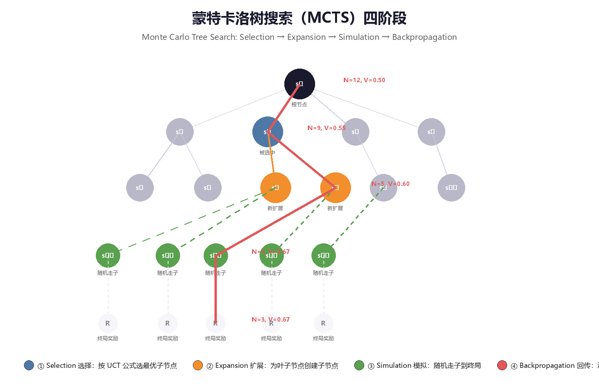
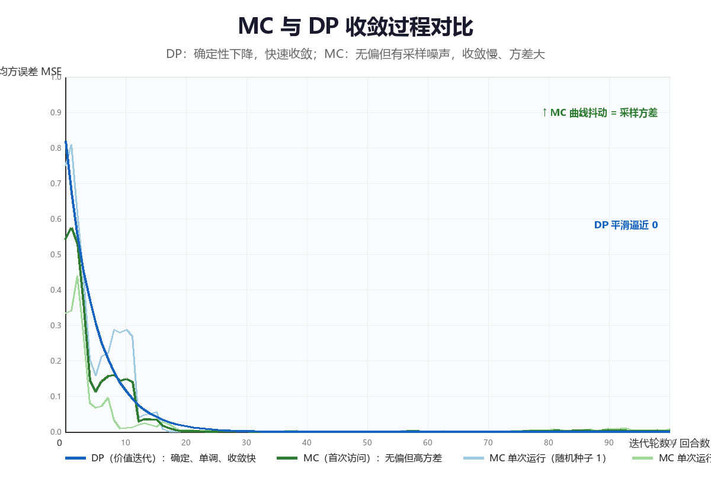

# 蒙特卡洛方法（Monte Carlo Methods）

> 蒙特卡洛（Monte Carlo, MC）方法是不依赖环境模型的第一族强化学习算法：
> 它不对转移概率 $P$ 与奖励函数 $R$ 做任何假设，只要求能够与环境交互并
> 拿到**完整的回合（episode）经验**，然后用"大量样本的平均"去逼近
> "数学期望"。本章从 MC 的核心思想出发，依次讲解 **MC 预测**（首次访问
> 与每次访问）、**MC 控制**（探索性初始化与 ε-greedy）、**off-policy MC
> 与重要性采样（Importance Sampling）**，最后深入**蒙特卡洛树搜索
> （Monte Carlo Tree Search, MCTS）**——它在 AlphaGo 与 AlphaZero 中的
> 应用，使 MC 思想在 2016 年后重新成为学界与工业界的焦点。全文代码均为
> 可运行的 Python 3 实现，综合实验为 Sutton & Barto 例 5.1 的 Blackjack
> （21 点）环境。

---

## 一、从模型到经验——MC 的核心思想

### 1.1 当模型不可得：从"期望"到"平均"

第 2 章的动态规划（DP）有一个硬性前提：**环境模型已知**，即转移概率
$P(s', r \mid s, a)$ 与奖励函数 $R(s, a)$ 完全可得。但现实世界很少满足
这个前提：

| 场景 | 模型可得吗？ | 原因 |
|------|-------------|------|
| 国际象棋、围棋 | 可得（规则即模型） | 规则已知，但状态空间太大，DP 扫不完 |
| 游戏引擎内部 AI | 可得 | 但工程上常直接用"可模拟"代替"可计算" |
| 机器人控制 | 通常不可得 | 真实物理动力学复杂、含未知扰动 |
| 自动驾驶、推荐系统 | 不可得 | 环境是真实世界，根本不存在解析模型 |

当模型不可得时，贝尔曼方程中的**期望** $\mathbb{E}[\cdot]$ 无法直接计算，
只能退而求其次：**用采样代替期望，用经验代替模型**。这就是蒙特卡洛方法
的全部出发点。

> **核心思想**：MC 方法把"计算期望"替换为"做实验取平均"。既然无法从
> 模型算出"从这个状态出发平均能拿多少回报"，那就真实地从这个状态出发
> 走完一个回合，记录实际拿到的回报；多走几个回合，把回报平均起来，就
> 得到价值的估计。**模型不是必需的，回合经验才是。**

### 1.2 大数定律：MC 的数学依据

MC 方法之所以成立，靠的是概率论中最早、最基础的结论之一——**大数定律
（Law of Large Numbers, LLN）**：

> 设 $X_1, X_2, \dots$ 是独立同分布（i.i.d.）的随机变量，且期望
> $\mathbb{E}[X]$ 有限，则样本均值依概率收敛到期望：
>
> $$\frac{1}{N}\sum_{i=1}^{N} X_i \;\xrightarrow{\;p\;}\; \mathbb{E}[X], \qquad N \to \infty$$

把 $X_i$ 换成"从状态 $s$ 出发按策略 $\pi$ 走完一个回合得到的回报
$G_t^{(i)}$"，大数定律立即给出 MC 价值估计器：

$$
\hat{v}_\pi(s) \;=\; \frac{1}{N(s)}\sum_{i=1}^{N(s)} G_t^{(i)}
\;\xrightarrow{\;p\;}\; v_\pi(s)
$$

其中 $N(s)$ 是状态 $s$ 被访问并用于更新的次数。这个估计器有两个直接
推论：

| 性质 | 内容 | 含义 |
|------|------|------|
| **无偏性（unbiased）** | $\mathbb{E}[\hat{v}_\pi(s)] = v_\pi(s)$ | 单次估计可能偏，但平均意义上不系统性地偏离真实值 |
| **一致性（consistent）** | $N \to \infty$ 时 $\hat{v}_\pi \to v_\pi$ | 样本越多越准，最终收敛到真值 |
| **方差衰减** | $\mathrm{Var}[\hat{v}_\pi(s)] = \mathrm{Var}[G_t] / N$ | 方差随样本量以 $1/N$ 的速度下降（详见第六节图） |

> **核心思想**：MC 用"样本平均"换取"模型自由"。代价是估计带有随机
> 波动（方差），但波动随回合数增加而缩小，且**估计本身无偏**——这是
> MC 相对于后续时序差分（TD）方法最重要的理论优势。

### 1.3 MC 与 DP 的对比

MC 与第 2 章的 DP 解决同一个问题（求 $v_\pi$ 或 $v_*$），但路径完全不同：

| 维度 | 动态规划 DP | 蒙特卡洛 MC |
|------|------------|------------|
| **是否需要环境模型** | 需要（已知 $P, R$） | 不需要，只需采样经验 |
| **是否需要完整回合** | 不需要，可逐步扫描 | **必须等回合结束**才能更新 |
| **更新对象** | 全部状态（同步扫描 sweep） | 仅本回合访问过的状态 |
| **自举（Bootstrapping）** | 是（用 $v_k(s')$ 更新 $v_{k+1}(s)$） | 否（用真实回报 $G_t$，不用其他估计值） |
| **偏差（Bias）** | 无（模型精确时） | 无（估计器无偏） |
| **方差（Variance）** | 低（无采样） | 高（回报 $G_t$ 本身随机） |
| **计算方式** | 迭代求解贝尔曼方程 | 采样 + 求平均 |
| **适用前提** | 模型已知、状态空间可枚举 | 回合制任务、可交互采样 |

关键区别浓缩为两句话：

```
DP：  v(s) ← Σ_a π(a|s) Σ_{s',r} P(s',r|s,a) [r + γv(s')]   用模型算期望
MC：  v(s) ← 平均{ G_t }                                    用样本算平均
```

> **核心思想**：DP 的更新公式里"期望"是**算**出来的（需要模型），MC 的
> 更新公式里"期望"是**平均**出来的（需要样本）。前者精确但依赖模型，
> 后者免模型但依赖足够的回合经验。**MC 是 DP 在模型未知时的"替身"。**

### 1.4 回合与回报

MC 方法只适用于**回合制任务（episodic tasks）**——即交互过程必然在有限
步内结束（到达终止状态）。围棋、21 点、游戏关卡、迷宫寻路都是回合制；
而持续运行的恒温控制、股票交易则不是（需要第 6 章以后的方法）。

设一个回合在时刻 $T$ 终止，MC 使用的量是**回报（return）**：

$$
G_t \;=\; R_{t+1} + \gamma R_{t+2} + \gamma^2 R_{t+3} + \dots + \gamma^{T-t-1} R_T
\;=\; \sum_{k=0}^{T-t-1} \gamma^k R_{t+k+1}
$$

| 记号 | 含义 |
|------|------|
| $G_t$ | 时刻 $t$ 之后的折扣累积回报 |
| $T$ | 回合终止时刻（有限） |
| $\gamma \in [0, 1]$ | 折扣因子；回合制任务常取 $\gamma = 1$ |
| $R_{t+1}$ | 执行动作 $A_t$ 后环境给出的即时奖励 |

**回合制 + 有限 $T$** 是 MC 的两个硬前提：回报必须在回合结束时才能
完整计算，因此 MC 的更新粒度是"整个回合"，而不是"单步"。

### 1.5 本章路线图

```
┌─────────────────────────────────────────────────────────────┐
│                       已知环境模型？                          │
│              是 ──► 第 2 章：动态规划（算精确期望）            │
│              否 ──► 与环境交互，收集完整回合经验               │
└───────────────────────────────┬─────────────────────────────┘
                                ▼
      ┌─────────────────────────────────────────────────────┐
      │  第 3 章 蒙特卡洛：用"回报的平均"代替"期望"            │
      │  ├─ MC 预测：V(s) ← 平均(G_t)（第 2 节）              │
      │  ├─ MC 控制：评估 + ε-greedy 改进（第 3 节）          │
      │  ├─ off-policy MC 与重要性采样（第 4 节）             │
      │  └─ MCTS：把 MC 采样组织成树搜索（第 5 节）            │
      └─────────────────────────────────────────────────────┘
                                ▼
      ┌─────────────────────────────────────────────────────┐
      │  第 4 章 时序差分：单步更新、自举、方差更低（预告）      │
      └─────────────────────────────────────────────────────┘
```

### 1.6 一个最小数值示例：抛硬币回合

用最简单的单状态 MDP 直观感受"平均收敛到期望"的过程。状态 $s$ 只有一个
动作：掷一次公平硬币，正面朝上则回合结束、回报 $G = +1$；反面朝上则
回合结束、回报 $G = -1$。于是真实价值 $v(s) = \mathbb{E}[G] = 0$。

| 回合序号 $i$ | 1 | 2 | 3 | 4 | 5 | 6 | 7 | 8 | 9 | 10 |
|--------------|---|---|---|---|---|---|---|---|---|---|
| 回报 $G_i$ | $+1$ | $-1$ | $+1$ | $+1$ | $-1$ | $-1$ | $-1$ | $+1$ | $+1$ | $-1$ |
| 累计平均 $\hat v$ | 1.00 | 0.00 | 0.33 | 0.50 | 0.20 | 0.00 | $-0.14$ | 0.00 | 0.11 | 0.00 |

观察三点：

1. **单次估计完全不可靠**：前 10 个回合的平均在 $-0.14 \sim 1.00$ 之间
   剧烈跳动，任何单次 $G_i$ 都与真实值 0 相去甚远。
2. **平均逐渐稳定**：随着 $N$ 增大，波动幅度按 $1/\sqrt{N}$ 量级缩小
   （本例方差 $\mathrm{Var}(G) = 1$，$N = 100$ 时标准差约 0.1）。
3. **无偏性**：平均的"中心"始终是 0，没有系统性偏移——这正是 MC 估计
   区别于 TD 估计的地方（TD 有偏，见第 4 章）。

这个例子虽然平凡，却浓缩了 MC 的全部本质：**单个样本毫无意义，大量样本
的平均才有意义**。

---

## 二、MC 预测：首次访问与每次访问

### 2.1 问题定义：免模型的策略评估

**MC 预测（MC Prediction）** 解决免模型版本的策略评估问题：给定策略
$\pi$（不要求知道环境模型），仅凭采样得到的回合经验，估计状态价值函数
$v_\pi$。

$$
v_\pi(s) = \mathbb{E}_\pi\left[ G_t \mid S_t = s \right]
$$

DP 用模型算这个期望；MC 的做法是：

```
① 按策略 π 采样大量回合
② 对每个回合，计算每个访问过的状态 s 对应的回报 G_t
③ V(s) ← 所有回合中"与 s 相关的回报"的平均值
```

一个状态在一个回合中可能被访问多次（比如走迷宫时反复经过同一个路口）。
按"哪些访问参与平均"的不同，MC 预测分成**首次访问**与**每次访问**
两种变体。

### 2.2 首次访问 MC（First-Visit MC）

**首次访问 MC** 在每个回合中，只把状态 $s$ **第一次**被访问时的回报
$G_t$ 计入平均，后续再次访问同一状态产生的回报一律忽略：

**伪代码**（Sutton & Barto 算法 5.1 风格）：

```
输入：策略 π，要采样的回合数 M
初始化：returns(s) ← 空列表，∀s ∈ S
循环 i = 1, 2, ..., M：
    用 π 生成一个回合：S₀, A₀, R₁, S₁, ..., S_{T-1}, A_{T-1}, R_T
    G ← 0
    对该回合的每一步 t = T-1, T-2, ..., 0：      ← 从后往前累加回报
        G ← γG + R_{t+1}
        若 S_t 在该回合中首次出现：
            将 G 追加到 returns(S_t)
输出：V(s) ← average(returns(s))，∀s ∈ S
```

**从后往前累加**是计算回报的经典技巧：只需要一次遍历就能得到所有时刻的
$G_t$，因为 $G_t = R_{t+1} + \gamma G_{t+1}$。

> **核心思想**：首次访问 MC 中，每个状态的每次"更新"都对应**一段独立
> 的、从该状态首次出现到回合结束的真实轨迹**。由于回合之间独立，这些
> 回报是 i.i.d. 的，大数定律直接适用，估计器无偏。

### 2.3 每次访问 MC（Every-Visit MC）

**每次访问 MC** 则把状态 $s$ 在回合中**每一次**被访问时的回报 $G_t$
都计入平均。两者唯一的区别就在"计不计数"这一行：

| 维度 | 首次访问（First-Visit） | 每次访问（Every-Visit） |
|------|------------------------|------------------------|
| 每个回合对状态 $s$ 的更新次数 | 至多 1 次（首次出现时） | 每次出现都更新 |
| 估计器偏差 | **无偏** | 一般有偏（同一回合内多次访问的回报相关） |
| 估计器一致性 | 收敛（大数定律） | 收敛（虽然相关，但平均仍趋于真值） |
| 方差 | 样本间独立，方差更可控 | 样本间相关，方差分析与控制更复杂 |
| 计算开销 | 略小 | 略大（每个状态每次访问都要更新） |
| 理论分析难度 | 简单，是教科书标准形式 | 较难（依赖马尔可夫链再生理论） |
| 实际使用 | 更常见 | 在函数逼近场景中更自然 |

> **核心思想**：首次访问与每次访问**渐近等价**（回合数 $\to \infty$ 时
> 收敛到同一个 $v_\pi$），差别在有限样本下的统计性质。实践上两者结果
> 往往非常接近，首次访问因理论干净而更受青睐。**选择原则：想要无偏且
> 便于分析，用首次访问；实现简单且不介意细微偏差，用每次访问。**

### 2.4 MC 预测的流程总览

```
            采样回合                计算回报                平均更新
   ┌─────────────────┐    ┌─────────────────┐    ┌─────────────────┐
   │ π 与环境交互      │    │ 从后往前累加     │    │ V(s) ← V(s)     │
   │ 得到 (S,A,R) 序列│ ──► │ G ← γG + R      │ ──► │     + (G−V(s))/N│
   └─────────────────┘    └─────────────────┘    └─────────────────┘
        需要完整回合              O(回合长度)          只更新访问过的状态
```

### 2.5 Python 实现：五状态走廊上的首次访问 MC

用最简单的回合制环境——**五状态走廊**（状态 0 与 4 为吸收终止状态，
动作 0=左移、1=右移，到达右端奖励 $+1$、左端奖励 $-1$，$\gamma = 1$，
策略为均匀随机）——演示首次访问 MC 预测：

```python
import random

# ---------- 环境：五状态走廊（简单回合制 MDP） ----------
# 状态 0 与 4 为吸收终止状态；动作 0 = 左移，1 = 右移
N_STATES = 5
TERMINAL = {0, 4}

def step(s, a):
    """执行一步，返回 (下一状态, 奖励, 是否终止)"""
    ns = max(0, min(N_STATES - 1, s + (1 if a == 1 else -1)))  # 越界截断
    if ns == 4:
        return ns, +1.0, True      # 右端终止，奖励 +1
    if ns == 0:
        return ns, -1.0, True      # 左端终止，奖励 -1
    return ns, 0.0, False

def generate_episode(policy, start=2):
    """按策略采样一个完整回合，返回 [(s, a, r), ...]"""
    episode, s = [], start
    while True:
        a = policy(s)
        ns, r, done = step(s, a)
        episode.append((s, a, r))
        if done:
            break
        s = ns
    return episode

# ---------- 首次访问 MC 策略评估 ----------
def first_visit_mc(policy, episodes=5000, gamma=1.0):
    returns = {s: [] for s in range(N_STATES)}   # 每个状态的回报列表
    for _ in range(episodes):
        ep = generate_episode(policy)
        G, seen = 0.0, set()
        # 从回合末尾向前累加回报（G_t = r + γ·G_{t+1}）
        for t in range(len(ep) - 1, -1, -1):
            s, a, r = ep[t]
            G = r + gamma * G
            if s not in seen:                    # 仅首次访问参与平均
                seen.add(s)
                returns[s].append(G)
    return {s: (sum(rs) / len(rs) if rs else 0.0) for s, rs in returns.items()}

def random_policy(s):
    return random.choice([0, 1])

if __name__ == '__main__':
    random.seed(42)
    V = first_visit_mc(random_policy)
    print("首次访问 MC 估计的 V(s)（均匀随机策略，5000 回合）:")
    for s in range(N_STATES):
        print(f"  V({s}) = {V[s]:+.3f}")

# 预期输出（示意，数值随随机种子略有波动）:
#   首次访问 MC 估计的 V(s)（均匀随机策略，5000 回合）:
#     V(0) = +0.000
#     V(1) = -0.498
#     V(2) = +0.002
#     V(3) = +0.500
#     V(4) = +0.000
```

**结果验证**：该走廊是对称随机游走（左右概率各 0.5、奖励 $\pm 1$ 对称），
由赌徒破产问题的经典结论，解析值为 $V(1) = -0.5,\; V(2) = 0,\;
V(3) = +0.5$。5000 回合后 MC 估计与解析值误差在 $10^{-3}$ 量级——这正是
大数定律在起作用。

### 2.6 增量式平均：从"存列表"到"在线更新"

2.5 节的实现把每个状态的回报全部存进列表再求平均。更优雅的做法是
**增量式平均（incremental mean）**：每来一个回报 $G$，就地更新：

$$
V(s) \;\leftarrow\; V(s) + \frac{1}{N(s)}\Big( G - V(s) \Big)
$$

其中 $N(s)$ 是 $s$ 已累计的更新次数。这行式子就是"新平均 = 旧平均 +
步长 × 误差"，是**几乎所有强化学习更新公式的共同骨架**：

```
新估计 ← 旧估计 + 步长 × (目标 − 旧估计)
```

| 更新方式 | 步长 | 性质 |
|----------|------|------|
| 样本均值 | $\alpha = 1/N(s)$ | 随 $N$ 递减，保证收敛到真值；但无法跟踪非平稳环境 |
| 常数步长 | $\alpha = \text{const}$ | 不收敛到真值（在真值附近波动），但能跟踪缓慢变化的环境 |
| 衰减步长 | $\alpha = c / (N(s)^\beta)$ | 折中：先快后慢，实践中常用 |

```python
# 增量式平均版本的更新核心（替换 2.5 节中的列表逻辑）：
# V[s] += alpha * (G - V[s])，其中 alpha = 1.0 / N[s]
```

> **核心思想**：$\alpha = 1/N$ 让每个样本"地位均等"（样本均值）；
> $\alpha$ 为常数则让新样本"权重更大"（适合非平稳）。**MC 预测默认用
> $1/N$ 保证无偏收敛，TD 方法（第 4 章）默认用小常数 $\alpha$ 换取
> 跟踪能力。** 这一取舍贯穿全书。

### 2.7 数值对比：首次访问 vs 每次访问

在 2.5 节的走廊环境上，把"首次访问"改成"每次访问"只需删除 `seen` 集合
的判断——两种变体的代码差异仅一行：

```python
# 追加在 2.5 节代码之后运行；复用其中的 step / generate_episode / random_policy
def every_visit_mc(policy, episodes=5000, gamma=1.0):
    """每次访问 MC：状态每次出现都记录回报（无 seen 判断）"""
    returns = {s: [] for s in range(N_STATES)}
    for _ in range(episodes):
        ep = generate_episode(policy)
        G = 0.0
        for t in range(len(ep) - 1, -1, -1):
            s, a, r = ep[t]
            G = r + gamma * G
            returns[s].append(G)          # ← 唯一的区别：每次访问都记录
    return {s: sum(rs) / len(rs) for s, rs in returns.items()}

if __name__ == '__main__':
    random.seed(42)
    Vf = first_visit_mc(random_policy)
    Ve = every_visit_mc(random_policy)
    exact = {0: 0.0, 1: -0.5, 2: 0.0, 3: 0.5, 4: 0.0}
    print(f"{'状态':<6}{'首次访问':>10}{'每次访问':>10}{'解析值':>10}")
    for s in range(N_STATES):
        print(f"{s:<6}{Vf[s]:>10.3f}{Ve[s]:>10.3f}{exact[s]:>10.3f}")

# 预期输出（示意，数值随随机种子波动）:
#   状态       首次访问     每次访问       解析值
#   0           0.000       0.000        0.000
#   1          -0.498      -0.501       -0.500
#   2           0.002       0.001        0.000
#   3           0.500       0.499        0.500
#   4           0.000       0.000        0.000
```

**结论**：在本例（随机游走 + 对称奖励）中，两种变体 5000 回合后都与
解析值相差不到 $10^{-2}$，差异可以忽略。**首次访问与每次访问的差别在
长回合、状态反复出现的任务中才会显现**——此时每次访问的估计会因同一
回合内回报相关而产生轻微偏差，而首次访问始终无偏。

---

## 三、MC 控制：探索与利用

### 3.1 从预测到控制：GPI 的 MC 版本

**MC 控制（MC Control）** 解决控制问题：不求"给定策略的价值"，而是
**直接找最优策略**。与第 2 章相同，它遵循**广义策略迭代（Generalized
Policy Iteration, GPI）** 的框架——评估与改进交替进行，只是两个环节
都换成免模型版本：

```
┌─────────────────────┐         ┌─────────────────────┐
│  策略评估（MC 版）     │         │  策略改进（贪心版）   │
│  用回合回报估计 q_π    │ ─────► │  π'(s) = argmax_a   │
│  （首次访问 + 平均）   │         │         q(s, a)     │
└─────────────────────┘         └─────────────────────┘
        ▲                               │
        └─────────────── 循环 ───────────┘
        直到策略不再变化（或价值收敛）
```

与预测不同，控制需要估计的是**动作价值 $q(s, a)$** 而非状态价值
$v(s)$——因为改进环节必须知道"哪个动作更好"。MC 对 $(s, a)$ 对的
估计方式与对 $s$ 完全一样：把"从 $(s,a)$ 出发的回报"平均起来。

### 3.2 探索的必要性与探索性初始化

GPI 的改进环节要求对每个状态取 $\arg\max_a q(s,a)$。但如果某些
$(s, a)$ 从未被访问过，它们的 $q$ 估计就是初始值，贪心改进可能
永远错过真正的最优动作。这就是强化学习最核心的矛盾——**探索与利用
（exploration vs. exploitation）** 的张力。

MC 控制解决探索问题的第一种方案是**探索性初始化（Exploring Starts,
ES）**：**假设每个 $(s, a)$ 对都有非零概率作为回合的起点**。这样即使
策略本身从不访问某些 $(s,a)$，它们也会被采样到。

```
探索性初始化：每个回合的初始状态-动作对 (S₀, A₀) 从所有 (s, a) 中
              随机均匀抽取 → 保证全部状态-动作对都能被评估到
```

> **核心思想**：探索性初始化把"探索"外包给**回合起点**，策略本身可以
> 保持纯贪心。它理论简洁，但要求环境允许我们任意指定起点——围棋、21 点
> 可以，机器人真实控制通常不行。因此实践中更常用 3.3 节的 ε-greedy。

### 3.3 ε-greedy：on-policy MC 控制

**ε-greedy 策略**在绝大多数时候贪心，但以概率 $\varepsilon$ 随机选择
动作：

$$
\pi(a \mid s) =
\begin{cases}
1 - \varepsilon + \dfrac{\varepsilon}{\lvert A(s) \rvert}, & a = \arg\max_{a'} q(s, a') \\[6pt]
\dfrac{\varepsilon}{\lvert A(s) \rvert}, & \text{其他}
\end{cases}
$$

| 维度 | 探索性初始化（ES） | ε-greedy |
|------|------------------|----------|
| 探索来源 | 回合起点随机 | 每步都以概率 $\varepsilon$ 乱走 |
| 策略本身 | 纯贪心 | 本身含随机性（$\varepsilon$ 贪心） |
| 是否需要任意指定起点 | 需要（硬假设） | 不需要 |
| 收敛保证 | 需要"每个 $(s,a)$ 都可能被选为起点" | 需要"$\varepsilon$ 随迭代衰减到 0" |
| 实际可用性 | 受限（很多环境无法指定起点） | 通用，几乎所有现代算法的基石 |

**on-policy 的含义**：产生数据的策略与正在学习/改进的策略**是同一个**
（都是 ε-greedy）。MC 评估的 $q_\pi$ 是"在 ε-greedy 策略 $\pi$ 下的
动作价值"，改进得到的 $\pi'$ 也是 ε-greedy。这样评估与改进的对象始终
一致，但最终收敛到的是**ε-greedy 最优策略**（与真正最优策略相差一个
$\varepsilon$ 的探索代价）。

### 3.4 on-policy 首次访问 MC 控制：伪代码

**伪代码**（Sutton & Barto 算法 5.3 风格）：

```
初始化：
    Q(s, a) ← 任意值，N(s, a) ← 0，∀s ∈ S, a ∈ A(s)
    π ← ε-greedy(Q)（ε 为固定小值，如 0.1）
循环（对每个回合）：
    用 π 生成一个回合：S₀, A₀, R₁, S₁, ..., S_{T-1}, A_{T-1}, R_T
    G ← 0
    对该回合的每一步 t = T-1, T-2, ..., 0：
        G ← γG + R_{t+1}
        若 (S_t, A_t) 在该回合中首次出现：
            N(S_t, A_t) ← N(S_t, A_t) + 1
            Q(S_t, A_t) ← Q(S_t, A_t) + (G − Q(S_t, A_t)) / N(S_t, A_t)
    对每个状态 s：
        π(s) ← ε-greedy(Q(s, ·))     ← 策略改进
```

### 3.5 Python 实现：4×4 GridWorld 上的 MC 控制

环境与第 2 章完全相同（4×4 网格、每步奖励 $-1$、状态 0 与 15 为终止、
$\gamma = 1$），用 on-policy 首次访问 MC + ε-greedy 求解最优策略：

```python
import random

# ---------- 环境：4×4 GridWorld（与第 2 章相同） ----------
# 状态编号 0..15；动作 0=上 1=右 2=下 3=左；状态 0 与 15 为终止
SIZE, TERMINAL = 4, {0, 15}
ACTIONS = [(-1, 0), (0, 1), (1, 0), (0, -1)]

def step(s, a):
    """执行一步，返回 (下一状态, 奖励, 是否终止)"""
    r, c = divmod(s, SIZE)
    dr, dc = ACTIONS[a]
    nr = max(0, min(SIZE - 1, r + dr))
    nc = max(0, min(SIZE - 1, c + dc))
    ns = nr * SIZE + nc
    return (ns, -1.0, True) if ns in TERMINAL else (ns, -1.0, False)

# ---------- on-policy 首次访问 MC 控制（ε-greedy） ----------
def mc_control_epsilon_greedy(episodes=5000, gamma=1.0, epsilon=0.1):
    Q = {(s, a): 0.0 for s in range(16) for a in range(4)}
    N = {(s, a): 0 for s in range(16) for a in range(4)}
    returns = {(s, a): [] for s in range(16) for a in range(4)}

    def egreedy_action(s):
        """ε-greedy：以概率 ε 随机动作，否则取 Q 最大的动作"""
        if s in TERMINAL:
            return 0
        if random.random() < epsilon:
            return random.randrange(4)
        vals = [Q[(s, a)] for a in range(4)]
        best = max(vals)
        return random.choice([a for a in range(4) if vals[a] == best])  # 平局随机

    for _ in range(episodes):
        # 生成一个回合（随机起点 = 探索性初始化，加速覆盖）
        s, ep = random.randrange(16), []
        while s not in TERMINAL:
            a = egreedy_action(s)
            ns, r, done = step(s, a)
            ep.append((s, a, r))
            s = ns
        # 首次访问更新 Q
        G, seen = 0.0, set()
        for t in range(len(ep) - 1, -1, -1):
            s, a, r = ep[t]
            G = r + gamma * G
            if (s, a) not in seen:
                seen.add((s, a))
                returns[(s, a)].append(G)
                N[(s, a)] += 1
                Q[(s, a)] = sum(returns[(s, a)]) / N[(s, a)]
    return Q

def show_policy(Q):
    arrows = ['↑', '→', '↓', '←']
    for s in range(16):
        if s in TERMINAL:
            print('T', end='  ')
        else:
            vals = [Q[(s, a)] for a in range(4)]
            print(arrows[max(range(4), key=lambda a: vals[a])], end='  ')
        if s % 4 == 3:
            print()

if __name__ == '__main__':
    random.seed(0)
    Q = mc_control_epsilon_greedy()
    print("MC 控制（ε-greedy, 5000 回合）得到的最优策略 π*:")
    show_policy(Q)
    print("\n部分 Q 值示例（状态 1：上=%.2f 右=%.2f 下=%.2f 左=%.2f）"
          % tuple(Q[(1, a)] for a in range(4)))

# 预期输出（示意，与第 2 章 DP 结果一致）:
#   MC 控制（ε-greedy, 5000 回合）得到的最优策略 π*:
#   T  ←  ←  ↓
#   ↑  ↑  ↑  ↓
#   ↑  ↑  ↓  ↓
#   ↑  →  →  T
#   部分 Q 值示例（状态 1：上=-3.02 右=-3.01 下=-2.03 左=-3.00）
```

**要点**：MC 控制不需要任何模型知识，仅凭 5000 个随机起点的回合就恢复
了与第 2 章 DP 完全一致的最优策略。注意 $Q$ 估计本身仍有波动（如状态 1
的四个动作价值并非精确的 $-3/-3/-2/-3$），但 $\arg\max$ 已经稳定——这
说明**控制问题对价值精度的要求低于预测问题**。

### 3.6 ε 的衰减：探索与利用的权衡

ε-greedy 中 $\varepsilon$ 的取值直接决定"探索-利用"的平衡：

| 策略 | 公式 / 设定 | 特点 |
|------|------------|------|
| 固定 ε | $\varepsilon = 0.1$ 全程不变 | 简单稳定，但永远损失 $\varepsilon$ 比例的探索收益 |
| 线性衰减 | $\varepsilon_k = \varepsilon_0 (1 - k/K)$ | 先广探索后精利用，需预设总回合数 $K$ |
| 指数衰减 | $\varepsilon_k = \varepsilon_0 \cdot \lambda^k$ | 衰减快，适合"探索窗口"短的任务 |
| 衰减至贪心 | $\varepsilon \to 0$ 且满足 GLIE 条件 | 理论上保证收敛到真正最优策略 |

**GLIE（Greedy in the Limit with Infinite Exploration）**：若 $\varepsilon$
随回合数衰减到 0（极限下完全贪心），但同时保证每个 $(s,a)$ 被访问无限
多次（无限探索），则 on-policy MC 控制收敛到**真正的最优策略**——这是
3.4 节伪代码的收敛性理论保证。

> **核心思想**：固定 ε 的 MC 控制收敛到"ε-greedy 最优"；只有让 ε 衰减
> 到 0（并满足 GLIE），才能收敛到真正最优。实践中的标准做法：**先用
> 较大的 ε（如 0.3）快速覆盖状态空间，再逐步衰减到 0.01 量级**——先
> 探索、后利用，与人类学习新技能的节奏一致。

---

## 四、off-policy MC 与重要性采样

### 4.1 为什么要 off-policy

3.3 节的 ε-greedy MC 是 **on-policy** 方法：行为策略（生成数据的策略）
与目标策略（要学习/改进的策略）是同一个。on-policy 的代价很明显——为了
探索，**永远学不到真正的最优策略**（只能学到 ε-greedy 最优）。

**off-policy 方法**把两者分开：用一个**行为策略（behavior policy）** $b$
去与环境交互采集数据，同时学习另一个**目标策略（target policy）** $\pi$。
这样做的好处：

| 好处 | 说明 |
|------|------|
| 学到确定性最优策略 | 目标策略 $\pi$ 可以完全贪心，探索交给 $b$ |
| 数据复用 | 同一批经验可反复用于学习多个不同的 $\pi$ |
| 学习他人经验 | 可以从人类演示、其他智能体、历史日志中学习 |
| 与环境解耦 | 数据采集与学习算法可以异步、分离部署 |

### 4.2 行为策略 vs 目标策略

| 维度 | 行为策略 $b$ | 目标策略 $\pi$ |
|------|-------------|---------------|
| 作用 | 生成经验数据（采样） | 被学习、被评估、被改进 |
| 是否需要探索 | **必须**充分探索（覆盖 $\pi$ 可能走的每条路） | 不需要，可以纯贪心 |
| 与数据的关系 | 决定数据的分布 | 与数据分布无关 |
| 收敛对象 | 不收敛（只是采样工具） | 收敛到 $v_\pi$ 或 $q_*$ |
| 典型例子 | 均匀随机、ε-greedy | 贪心、训练好的策略 |

**覆盖（coverage）条件**：$\pi$ 的每个动作在 $b$ 下都必须有可能被选中，
即 $\pi(a \mid s) > 0 \implies b(a \mid s) > 0$。否则 $\pi$ 走过的轨迹
永远采不到样本，无法估计。

### 4.3 重要性采样比：把"$b$ 的期望"改写成"$\pi$ 的期望"

off-policy 的核心难题：我们用 $b$ 采到的回报平均，得到的是 $v_b$，不是
$v_\pi$。怎么修正？答案是**重要性采样（Importance Sampling, IS）**。

沿一条轨迹 $S_t, A_t, S_{t+1}, A_{t+1}, \dots, S_T$ 行走的概率，在策略
$\pi$ 下是 $\prod_{k=t}^{T-1} \pi(A_k \mid S_k) \cdot \prod P$，在策略
$b$ 下是 $\prod_{k=t}^{T-1} b(A_k \mid S_k) \cdot \prod P$。**转移概率
$P$ 相同**（环境一样），于是两者的比值——**重要性采样比（importance
sampling ratio）**——只含策略项：

$$
\rho_{t:T-1} \;=\; \frac{\prod_{k=t}^{T-1} \pi(A_k \mid S_k)}{\prod_{k=t}^{T-1} b(A_k \mid S_k)}
\;=\; \prod_{k=t}^{T-1} \frac{\pi(A_k \mid S_k)}{b(A_k \mid S_k)}
$$

> **核心思想**：$\rho$ 衡量"这条轨迹在目标策略下出现的概率，比在行为
> 策略下大多少"。把 $b$ 采样的回报乘上 $\rho$，就**校正**成了 $\pi$
> 期望下的量：$\mathbb{E}_b[\rho_{t:T-1} G_t] = \mathbb{E}_\pi[G_t]$。
> 环境模型 $P$ 在比值中约掉了——这正是 off-policy MC 免模型的关键。

### 4.4 普通 vs 加权重要性采样

给定一批从 $b$ 采样、按首次访问组织的回报 $\{G_t^{(i)}\}$ 及其比值
$\{\rho_i\}$，有两种估计 $v_\pi(s)$ 的方式：

**普通重要性采样（Ordinary IS）**：

$$
V(s) \;=\; \frac{\sum_i \rho_i G_t^{(i)}}{N}
$$

**加权重要性采样（Weighted IS）**：

$$
V(s) \;=\; \frac{\sum_i \rho_i G_t^{(i)}}{\sum_i \rho_i}
$$

| 维度 | 普通 IS | 加权 IS |
|------|---------|---------|
| 估计值 | 无偏（$\mathbb{E}_b[\rho G] = v_\pi$） | **有偏**（比值估计量的固有偏差） |
| 方差 | **极大**（$\rho$ 可暴涨，尤其是长回合） | 小（比值归一化把波动压住了） |
| 极端情形 | 单个 $\rho$ 巨大时估计被"带飞" | 结果被限制在样本回报的取值范围内 |
| 一致性 | 收敛 | 收敛（偏差随样本量 $\to 0$） |
| 实践地位 | 理论干净，实际几乎不用 | **实际首选** |

> **核心思想**：普通 IS 用"分子平均"近似期望，无偏但方差爆炸；加权 IS
> 用"分子除以分母"做**加权平均**，牺牲无偏性换取方差的大幅下降。偏差
> 随样本量消失，方差却始终存在——**工程上几乎总是选加权 IS**。

### 4.5 Python 实现：走廊上的 off-policy MC 预测

沿用五状态走廊环境。行为策略 $b$ = 均匀随机；目标策略 $\pi$ = 始终向右。
目标策略的真实价值（$\gamma=1$）：从任何非终止状态出发都会到达右端，
$V_\pi(1) = V_\pi(2) = V_\pi(3) = +1$。

```python
import random

# ---------- 环境：五状态走廊（与 2.5 节相同） ----------
N_STATES = 5
TERMINAL = {0, 4}

def step(s, a):
    ns = max(0, min(N_STATES - 1, s + (1 if a == 1 else -1)))
    if ns == 4: return ns, +1.0, True
    if ns == 0: return ns, -1.0, True
    return ns, 0.0, False

def behavior_policy(s):        # 行为策略 b：均匀随机
    return random.choice([0, 1])

def target_policy(s):          # 目标策略 π：始终向右（确定性）
    return 1

def importance_ratio(episode, t):
    """计算 ρ_{t:T-1} = Π_{k=t}^{T-1} π(A_k|S_k) / b(A_k|S_k)"""
    rho = 1.0
    for k in range(t, len(episode)):
        s, a, _ = episode[k]
        rho *= (1.0 if target_policy(s) == a else 0.0) / 0.5
    return rho

def off_policy_mc(episodes=50000, mode='weighted'):
    returns = {s: [] for s in range(N_STATES)}   # ρ·G 的累计
    weights = {s: [] for s in range(N_STATES)}   # ρ 的累计（加权模式）
    for _ in range(episodes):
        # 随机起点（探索性初始化），保证状态 1、2、3 都可能被首次访问
        ep, s = [], random.choice([1, 2, 3])
        while True:
            a = behavior_policy(s)
            ns, r, done = step(s, a)
            ep.append((s, a, r))
            if done:
                break
            s = ns
        G, seen = 0.0, set()
        for t in range(len(ep) - 1, -1, -1):
            s, a, r = ep[t]
            G = r + G
            if s in seen:            # 首次访问
                continue
            seen.add(s)
            rho = importance_ratio(ep, t)
            returns[s].append(rho * G)
            weights[s].append(rho)
    V = {}
    for s in range(N_STATES):
        if mode == 'ordinary':
            V[s] = sum(returns[s]) / len(returns[s])            # 普通 IS
        else:
            w = sum(weights[s])
            V[s] = sum(returns[s]) / w if w > 0 else 0.0        # 加权 IS
    return V

if __name__ == '__main__':
    random.seed(0)
    print("目标策略 π（始终向右）的真实价值: V_π(1) = V_π(2) = V_π(3) = +1")
    for mode in ('ordinary', 'weighted'):
        V = off_policy_mc(50000, mode)
        print(f"{mode:>8}: " + "  ".join(f"V({s})={V[s]:+.2f}" for s in range(5)))

# 预期输出（示意，数值随随机种子波动）:
#   目标策略 π（始终向右）的真实价值: V_π(1) = V_π(2) = V_π(3) = +1
#   ordinary: V(0)=+0.00  V(1)=+1.00  V(2)=+1.00  V(3)=+1.00  V(4)=+0.00
#   weighted: V(0)=+0.00  V(1)=+1.00  V(2)=+1.00  V(3)=+1.00  V(4)=+0.00
```

**运行观察**（建议读者自行增大/减小 `episodes` 对比）：普通 IS 在样本量
较小时估计值剧烈跳动（偶尔出现 $\rho$ 很大的"异常轨迹"把均值带飞）；
加权 IS 则始终平稳地贴近 $+1$。这正是 4.4 节方差结论的直观体现。

### 4.6 off-policy MC 控制

把重要性采样用于控制，即可在行为策略 $b$（如均匀随机）的掩护下学习
贪心目标策略 $\pi$。off-policy 首次访问 MC 控制（Sutton & Barto 算法
5.5 风格）要点：

```
初始化：Q(s, a) ← 任意值，C(s, a) ← 0（权重累计），∀(s, a)
循环（对每个回合）：
    用 b 生成回合：S₀, A₀, R₁, ..., S_{T-1}, A_{T-1}, R_T
    G ← 0；W ← 1（当前权重）
    对 t = T-1, ..., 0：
        G ← γG + R_{t+1}
        C(S_t, A_t) ← C(S_t, A_t) + W
        Q(S_t, A_t) ← Q(S_t, A_t) + (W / C(S_t, A_t)) · (G − Q(S_t, A_t))
        # 只有"目标策略会采取的动作"才继续累积权重：
        若 A_t ≠ π(S_t)：跳出本回合循环
        W ← W · 1 / b(A_t | S_t)          # 注意：π 是贪心的，π(A_t|S_t)=1
```

两个关键技巧：

| 技巧 | 原因 |
|------|------|
| **只在 $A_t = \pi(S_t)$ 时继续** | 目标策略 $\pi$ 是贪心（确定性）的；一旦 $b$ 走了 $\pi$ 不会走的路，后续轨迹对 $\pi$ 的价值估计贡献为 0，$\rho$ 从此为 0 |
| **权重 $W$ 只含 $1/b$ 项** | $\pi$ 确定性 ⇒ $\pi(A_t \mid S_t) = 1$，重要性采样比退化为 $\prod 1/b(A_k \mid S_k)$，计算量大减 |

> **核心思想**：off-policy MC 控制用行为策略 $b$ 的"广撒网"换数据，
> 用重要性采样比的"加权"把数据折算成目标策略 $\pi$ 视角下的估计。
> 这样 $\pi$ 可以放心地纯贪心，最终收敛到**真正的最优策略**，而不是
> ε-greedy 最优——代价是重要性采样带来的方差。

### 4.7 覆盖条件与方差控制的工程实践

**覆盖（coverage）** 是 off-policy 方法的第一条红线：

```
覆盖条件：∀s, a：π(a|s) > 0  ⇒  b(a|s) > 0
（目标策略可能采取的动作，行为策略必须也有可能采取）
违反后果：π 走过的轨迹永远采不到样本，估计停留在初始值
```

**方差控制的常用手段**（按实用性排序）：

| 手段 | 做法 | 效果 |
|------|------|------|
| 选加权 IS | 用 $\sum \rho G / \sum \rho$ 而非 $\sum \rho G / N$ | 方差大幅下降，代价是微小偏差 |
| 缩短轨迹 | 用**每步（per-decision）重要性采样**：把 $\rho_{t:T-1} G_t$ 的连乘方差拆解到每个奖励项 | 避免 $\rho$ 连乘带来的方差累积 |
| 控制回合长度 | 截断过长回合，或让 $b$ 尽量接近 $\pi$ | $\rho$ 的连乘项数越少，方差越小 |
| 让 $b$ 贴近 $\pi$ | 如用 $\pi$ 的 ε-greedy 版本作 $b$ | $\rho \approx 1$，方差最小化 |
| 增量式加权更新 | $C \leftarrow C + \rho$，$V \leftarrow V + \frac{\rho}{C}(G - V)$ | 内存 $O(1)$，无需存回报列表 |

> **核心思想**：重要性采样的方差根源是**比值连乘**——$\rho$ 是
> $\prod \pi/b$，轨迹越长、$\pi$ 与 $b$ 差异越大，$\rho$ 的动态范围就
> 越大。因此 off-policy 方法有三条工程铁律：**用加权 IS、让 $b$ 尽量
> 接近 $\pi$、控制轨迹长度**。理解了这一点，就能理解为什么现代深度 RL
> （如 PPO）更偏爱"限制策略更新幅度"的 on-policy 路线。

---

## 五、蒙特卡洛树搜索（MCTS）

### 5.1 从"回合采样"到"树搜索"

前面几节的 MC 方法在**状态空间**上做统计平均；**蒙特卡洛树搜索（Monte
Carlo Tree Search, MCTS）** 则在**决策树**上做同样的工作——它把 MC 的
"采样-平均"思想搬进树搜索框架，用大量随机模拟（rollout）来评估树中
每个节点（局面）的好坏，从而在巨大的搜索空间中找到好动作。

**历史脉络**：

| 时间 | 事件 |
|------|------|
| 2006 | Rémi Coulom 提出 MCTS 框架；Levente Kocsis & Csaba Szepesvári 提出 **UCT**（UCB applied to Trees） |
| 2008 前后 | MCTS 取代 α-β 剪枝成为围棋等博弈程序的主流（MoGo、Fuego） |
| 2016 | **AlphaGo** 击败李世石：MCTS + 深度神经网络，震惊世界 |
| 2017 | **AlphaZero**：MCTS + 自对弈学习，零人工知识，通杀围棋/国际象棋/将棋 |

MCTS 的三个关键特性，使它成为现代博弈与决策智能的核心组件：

| 特性 | 含义 |
|------|------|
| **免模型（模拟即模型）** | 不需要显式转移概率，只要"能模拟"（下棋、游戏引擎、仿真器） |
| **非对称搜索（anytime）** | 算力越多，树越深越宽，随时可以停止并给出当前最佳动作 |
| **选择性专注（选择性）** | 把模拟资源集中在"看起来有希望"的分支（由 UCT 引导） |

### 5.2 四大阶段：Selection / Expansion / Simulation / Backpropagation

MCTS 每次迭代（iteration）在树上完成一轮"下行-上行"，包含**四个阶段**：

```
                     ┌────────────────────────────────────────┐
                     │           根节点（当前局面）              │
                     └───────────────────┬────────────────────┘
                                         │ ① Selection（选择）
                                         │  按 UCT 评分逐层下行，
                                         │  直到到达"未完全展开"的节点
                 ┌───────────────────────┼───────────────────────┐
                 ▼                       ▼                       ▼
       节点 A (N=6, Q=0.67)      节点 B (N=4, Q=0.50)      节点 C (N=2, Q=1.0)
                 │
                 ▼ ② Expansion（扩展）：为选中节点创建 1 个新子节点
       节点 A₁ (N=0, Q=0)
                 │
                 ▼ ③ Simulation（模拟）：从新节点起用默认策略
                           随机对弈直至终局，得到结果（胜/负/平）
                 ▲
                 │
                 └── ④ Backpropagation（回传）：结果沿路径逐层回传，
                     更新路径上所有节点的访问次数 N 与胜率 Q
```

| 阶段 | 英文 | 做什么 | 用到什么 |
|------|------|--------|---------|
| **① 选择** | Selection | 从根节点出发，按 UCT 评分反复选择子节点下行，直到抵达一个"未完全展开"的节点 | **树策略（tree policy）**：UCT 公式 |
| **② 扩展** | Expansion | 为该节点创建一个（或几个）新的子节点，对应一个尚未尝试过的动作 | 动作生成器 |
| **③ 模拟** | Simulation | 从新节点开始，用**默认策略（default policy）** 快速随机模拟直到对局结束，得到结果（胜/负/平或累积奖励） | **默认策略**：通常是均匀随机 |
| **④ 回传** | Backpropagation | 把模拟结果沿"下行路径"逐层回传，更新路径上每个节点的访问次数 $N$ 与累计收益 $Q$ | 反向遍历 |



> **核心思想**：MCTS 把"评估一个动作好不好"转化为"从该动作出发多模拟
> 几次、看平均结果"。**Selection 决定往哪儿深挖（利用），Simulation
> 提供评估信号（探索）**，Backpropagation 让信息从叶子流向根。四阶段
> 合起来就是一棵**动态生长的、被 UCT 引导的非对称搜索树**。

### 5.3 UCT：把 UCB1 用到树上

**UCT（Upper Confidence Bound applied to Trees）** 是 MCTS 最常用的
选择准则。它对节点 $s$ 的每个子动作 $a$ 打分：

$$
UCT(s, a) \;=\; \underbrace{\bar{X}(s, a)}_{\text{利用项}}
\;+\; c \cdot \underbrace{\sqrt{\frac{\ln N(s)}{N(s, a)}}}_{\text{探索项}}
$$

| 记号 | 含义 |
|------|------|
| $\bar{X}(s, a)$ | 子节点（动作 $a$）的平均收益，如胜率 $Q/N$ |
| $N(s)$ | 父节点 $s$ 的总访问次数 |
| $N(s, a)$ | 子节点（动作 $a$）的访问次数 |
| $c$ | 探索常数，控制探索强度（经验值 $c \approx \sqrt{2}$ 或 1.4） |

**直觉**：利用项偏爱"历史表现好"的动作；探索项偏爱"访问次数少"的
动作——$\ln N(s)$ 缓慢增长，保证每个动作最终都会被尝试，但尝试频率
与表现成正比。这正是第 0 章多臂老虎机中 **UCB1** 算法的直接移植：
**树中的每个节点都是一个独立的老虎机问题**。

**UCT 的性质**：

| 性质 | 说明 |
|------|------|
| 一致性 | 当模拟次数 $\to \infty$，根节点选择最优动作的概率 $\to 1$ |
| 平衡性 | 在"深挖最优分支"与"试探未知分支"之间自动权衡 |
| 参数敏感性 | $c$ 过小 → 过早收敛到次优；$c$ 过大 → 探索浪费算力 |

### 5.4 与 AlphaGo / AlphaZero 的联系

AlphaGo / AlphaZero 的成功，本质上是**用深度神经网络升级了 MCTS 的
两个薄弱环节**：

| 组件 | 传统 MCTS | AlphaGo / AlphaZero |
|------|----------|---------------------|
| Simulation 的评估 | 随机 rollout 到终局（慢、噪声大） | 用**价值网络** $v_\theta(s)$ 直接预测胜率，替代或截断 rollout |
| Selection 的先验 | 无先验，全靠探索项 | 用**策略网络** $p_\theta(a \mid s)$ 作为动作先验概率，引导选择 |
| 节点收益 | 平均模拟结果 | 价值网络输出 + 终局结果混合 |
| 训练方式 | 无 | **自对弈（self-play）** 生成数据，监督式更新两个网络 |

```
                    ┌──────────────────────────────────┐
                    │           MCTS（搜索主体）          │
                    │   Selection: UCT + 策略先验 p_θ    │
                    │   Expansion: 按 p_θ 展开动作       │
                    │   Simulation: 价值网络 v_θ 评估     │
                    │   Backprop: 混合收益回传           │
                    └───────────────┬──────────────────┘
                                    │ 每个节点保存 (N, W, Q, P)
                                    ▼
                    ┌──────────────────────────────────┐
                    │      神经网络 (p_θ, v_θ)          │
                    │   p_θ: 局面 → 动作概率分布（先验）  │
                    │   v_θ: 局面 → 胜率标量（评估）     │
                    └──────────────────────────────────┘
```

> **核心思想**：AlphaZero 的公式是"**MCTS 提供结构，神经网络提供知识**"
> ——MCTS 负责在搜索中平衡探索与利用、把有限算力投向关键分支；神经网络
> 负责把搜索经验压缩成可泛化的先验（$p_\theta$）与评估（$v_\theta$）。
> 两者互相促进：更强的网络 → 更好的搜索 → 更高质量的自对弈数据 →
> 更强的网络。这个闭环是 2017 年以来"学习型规划（learning to plan）"
> 研究的原型。

### 5.5 Python 简化实现：井字棋 MCTS

用井字棋（Tic-Tac-Toe）实现一个最小但完整的 MCTS 玩家（约 100 行，
四个阶段齐全）：

```python
import math, random

# ---------- 井字棋环境 ----------
EMPTY, X, O = 0, 1, 2

class TicTacToe:
    """3×3 井字棋：X 先手；winner() 返回 X/O/0(平局)/None(未结束)"""
    def __init__(self):
        self.board = [EMPTY] * 9
        self.player = X
    def legal_moves(self):
        return [i for i, v in enumerate(self.board) if v == EMPTY]
    def play(self, move):
        self.board[move] = self.player
        self.player = O if self.player == X else X
    def winner(self):
        lines = [(0,1,2),(3,4,5),(6,7,8),(0,3,6),(1,4,7),(2,5,8),(0,4,8),(2,4,6)]
        for a, b, c in lines:
            if self.board[a] != EMPTY and self.board[a] == self.board[b] == self.board[c]:
                return self.board[a]
        return 0 if EMPTY not in self.board else None
    def clone(self):
        g = TicTacToe(); g.board = self.board[:]; g.player = self.player
        return g

# ---------- MCTS 节点 ----------
class Node:
    def __init__(self, game, parent=None):
        self.game = game          # 该节点对应的局面
        self.parent = parent
        self.children = {}        # move -> Node
        self.visits = 0           # 访问次数 N
        self.wins = 0.0           # 累计收益 Q（以"移入本节点的玩家"视角）
    @property
    def untried(self):            # 尚未展开的动作
        return [m for m in self.game.legal_moves() if m not in self.children]

def uct(node, c=1.4):
    """UCT 评分（父节点视角）：胜率 + 探索项；未访问节点评分为 +∞"""
    if node.visits == 0:
        return float('inf')
    exploitation = node.wins / node.visits      # 子节点收益即父节点视角
    exploration = c * math.sqrt(math.log(max(1, node.parent.visits)) / node.visits)
    return exploitation + exploration

def mcts(root_game, iterations=2000, c=1.4):
    root = Node(root_game)
    for _ in range(iterations):
        node = root
        # ① Selection：沿 UCT 评分下行到"未完全展开"的节点
        while node.children and not node.untried:
            node = max(node.children.values(), key=uct)
        # ② Expansion：展开一个未尝试的动作
        if node.untried:
            move = random.choice(node.untried)
            g = node.game.clone(); g.play(move)
            child = Node(g, parent=node)
            node.children[move] = child
            node = child
        # ③ Simulation：默认策略（均匀随机）模拟到终局
        g = node.game.clone()
        while g.winner() is None:
            g.play(random.choice(g.legal_moves()))
        winner = g.winner()
        # ④ Backpropagation：结果沿路径回传（视角交替）
        while node is not None:
            node.visits += 1
            mover = O if node.game.player == X else X   # 移入本节点的玩家
            if winner == mover:
                node.wins += 1.0
            elif winner == 0:                           # 平局计 0.5
                node.wins += 0.5
            node = node.parent
    return root

if __name__ == '__main__':
    random.seed(1)
    root = mcts(TicTacToe(), iterations=2000)
    print("根节点（空棋盘）各动作的 MCTS 统计（2000 次迭代）:")
    for move, child in sorted(root.children.items()):
        print(f"  落子位置 {move}: 访问 {child.visits:4d} 次, "
              f"先手胜率 {child.wins / child.visits * 100:5.1f}%")
    best = max(root.children.items(), key=lambda kv: kv[1].visits)[0]
    print(f"推荐首步: 位置 {best}")

# 预期输出（示意，井字棋首步 9 个位置完全对称，访问次数应大致均等）:
#   根节点（空棋盘）各动作的 MCTS 统计（2000 次迭代）:
#     落子位置 0: 访问  222 次, 先手胜率  58.1%
#     落子位置 1: 访问  224 次, 先手胜率  57.6%
#     ...（9 个对称位置数值接近）
#   推荐首步: 位置 0
```

**正确性验证**：井字棋是双方完美信息博弈，先手可保不败。因此：
（1）根节点 9 个动作完全对称，访问次数应大致均等（探索项保证每个动作
都被充分尝试）；（2）先手胜率应接近 $58\%$ 上下（先手优势 + 大量平局）。

### 5.6 MCTS 的优缺点

| 优点 | 缺点 |
|------|------|
| **免模型**：只需模拟器，不需要 $P, R$ | **内存占用大**：树节点随迭代线性增长，大状态空间需剪枝/重规划 |
| **Anytime**：随时可停，算力越多越强 | **rollout 质量依赖默认策略**：纯随机模拟在长对局中信号弱 |
| **天然处理大规模动作空间**：只展开被访问的分支 | **收敛理论弱**：UCT 一致性证明依赖较强的统计假设 |
| **易于并行**：多线程/分布式模拟天然独立 | **探索-利用仍需调参**：$c$ 的选择对效率影响显著 |
| **无需启发式**：围棋等难以手写评估函数的领域也能用 | **对奖励稀疏、回合超长的任务效率低** |

| 维度 | 传统 MC（本章 2~4 节） | MCTS（本节） |
|------|----------------------|-------------|
| 采样对象 | 完整回合轨迹（状态序列） | 树中的节点（局面） |
| 评估单位 | 状态价值 $v(s)$ / 动作价值 $q(s,a)$ | 节点统计 $(N, Q)$ |
| 是否建树 | 否，直接平均 | 是，动态生长的搜索树 |
| 主要用途 | 策略评估与控制（学习） | 规划与决策（搜索），可与学习结合 |
| 计算瓶颈 | 回合长度 × 回合数 | 树宽 × 树深 × 模拟次数 |

### 5.7 MCTS 的关键变体与工程实践

| 变体 / 技巧 | 核心思想 | 典型用途 |
|-------------|---------|---------|
| **UCT** | 用 UCB1 引导选择（5.3 节） | 通用默认 |
| **PUCT**（AlphaZero） | 用策略网络先验 $P(s,a)$ 替换均匀先验 | 与神经网络结合 |
| **RAVE** | 用"同一动作在任意子树上赢过多少次"加速早期估计 | 棋类（如 MoGo） |
| **渐进加宽（Progressive Widening）** | 访问次数少时只展开少量动作，随 $N$ 增长逐步放宽 | 大动作空间 |
| **并行化** | 多个模拟线程共享一棵树（根并行 / 叶并行） | 分布式搜索 |
| **重规划（Replanning）** | 每走一步后丢弃旧树、以新局面为根重新搜索 | 在线决策 |

**AlphaZero 的选择公式（PUCT）**：

$$
a_t = \arg\max_a \left[ Q(s, a) + c \cdot P(s, a) \cdot \frac{\sqrt{N(s)}}{1 + N(s, a)} \right]
$$

与 5.3 节 UCT 的差别：均匀探索项 $\sqrt{\ln N(s)/N(s,a)}$ 被替换为
**先验加权**的探索项 $P(s,a)\sqrt{N(s)}\,/\,(1+N(s,a))$——神经网络认为
"有希望"的动作会被优先探索，搜索因此"少走弯路"。

**工程要点**：

| 要点 | 说明 |
|------|------|
| 访问次数阈值 | 子节点访问次数低于阈值（如 5）时先不参与选择，保证统计可靠 |
| 探索常数 $c$ | 通常取 1.0~1.4；在真实对局中通过自对弈调参 |
| 模拟预算 | 每步 1600 次（AlphaGo）到数万次不等，是算力与棋力的直接换算 |
| 与深度学习的结合 | 5.4 节：价值网络替代 rollout、策略网络提供先验，是 AlphaZero 的核心 |

---

## 六、MC 的优缺点总结

### 6.1 优点

| 优点 | 说明 |
|------|------|
| **无偏估计** | 用真实回报 $G_t$（而非其他估计值），$\mathbb{E}[\hat v] = v_\pi$ |
| **免模型** | 不需要 $P, R$，只要有交互能力即可 |
| **实现简单** | 核心就是"采样-平均"两件事，几乎没有数值稳定性问题 |
| **逐状态独立** | 每个状态的价值估计互不影响，可只估计关心的状态 |
| **可离线使用** | 给定一批历史回合数据即可事后估计（off-policy 的基础） |

### 6.2 缺点

| 缺点 | 原因 |
|------|------|
| **方差大** | 回报 $G_t$ 是整条随机轨迹的累积，随机性大；方差只按 $1/N$ 衰减 |
| **必须等回合结束** | 更新需要完整的 $G_t$，回合长的任务更新延迟大 |
| **仅限回合制任务** | 非终止（持续）任务没有"回合结束"这一事件 |
| **探索效率低** | 随机探索在大状态空间中覆盖很慢，需要大量回合 |
| **无法利用自举** | 不使用后继状态的估计值，信息"复用率"低 |

**方差问题**是 MC 最突出的短板。图 03-mc-variance.png 展示了 MC 价值
估计的典型收敛过程：随着回合数增加，估计轨迹围绕真实值波动并逐渐收窄，
波动的幅度正比于 $\sqrt{\mathrm{Var}(G_t) / N}$——**方差大意味着要很多
回合才能把噪声压下去**，这在单次模拟昂贵的场景（如机器人实机）中是致命
的。



### 6.3 优点 / 缺点 / 应对一览

| 性质 | 具体表现 | 应对手段 |
|------|---------|---------|
| **无偏** | 估计不系统性偏离真值 | 直接利用；与偏差方法（TD）对比时是理论基准 |
| **高方差** | 单次估计波动大 | 增加回合数；改用加权重要性采样；与 TD 折中（第 4 章） |
| **必须等回合结束** | 回合长则更新慢 | 截断回合（如限制最大步数）；改用单步 TD |
| **仅限回合制** | 持续任务无法直接用 | 回合化（人工切分）；引入折扣终止（第 6 章） |
| **探索开销大** | 随机探索覆盖慢 | ε-greedy、探索性初始化、事后经验回放 |

### 6.4 何时该用 MC

| 场景特征 | 是否适合 MC | 原因 |
|----------|------------|------|
| 回合制、回合较短 | ✅ 非常适合 | 更新延迟可接受，样本方差可控 |
| 模型完全未知 | ✅ 必须用免模型方法 | MC 是最简单的免模型选择 |
| 需要无偏估计（如评估某个策略的绝对水平） | ✅ 首选 | TD 有偏，MC 无偏 |
| 持续任务（无终止） | ❌ 不适用 | 没有"回合结束" |
| 单次模拟昂贵（实机、真实用户） | ❌ 慎用 | 方差大 → 需要的回合数太多 |
| 与函数逼近结合做大规模 RL | ⚠️ 谨慎 | MC 的高方差会放大函数逼近的误差 |

> **核心思想**：MC 的定位是"**简单、无偏、免模型，但昂贵且只适用于
> 回合制**"。它是理解后续一切免模型算法的起点——第 4 章的 TD 方法
> 正是为了克服 MC 的"高方差 + 必须等回合结束"而引入"单步自举"的
> 折中方案。

### 6.5 三方对照：DP / MC / TD

把第 2 章与本章的方法放在同一张表里，作为进入第 4 章前的"地图"：

| 维度 | 动态规划 DP | 蒙特卡洛 MC | 时序差分 TD（预告） |
|------|------------|------------|--------------------|
| 模型 | 需要 | 不需要 | 不需要 |
| 更新粒度 | 全状态扫描 | 完整回合 | 单步 |
| 自举 | 是 | 否 | 是 |
| 偏差 | 无（模型精确） | 无 | 有（初值依赖） |
| 方差 | 低 | 高 | 中 |
| 数据效率 | 高（用模型） | 低（等回合结束才更新） | 高（每步都更新） |
| 收敛保证 | 强（压缩映射） | 强（大数定律） | 较弱（依赖步长条件） |

> **核心思想**：三者的关系可以概括为一句话——**DP 用模型算期望，MC
> 用整回合采样平均估计期望，TD 用单步采样 + 自举估计期望**。MC 处在
> "完全不用自举"的一端，TD 是它与 DP 的折中。第 4 章将看到，TD 在
> 方差与数据效率上的双重改善，使它成为现代 RL 事实上的标准。

---

## 七、综合实验：Blackjack 的 MC 控制

本实验完整复现 Sutton & Barto 例 5.1 / 5.3 的经典场景：用 on-policy
首次访问 MC 控制求解 21 点（Blackjack）的最优策略，并输出状态价值片段。

### 7.1 环境：规则与状态表示

采用**简化 21 点**规则（与教科书一致）：

| 规则要素 | 设定 |
|----------|------|
| 牌面 | 1~10（A 计 1 或 11，J/Q/K 均计 10），无限牌堆（有放回抽样） |
| 玩家动作 | 0 = 停牌（stick），1 = 要牌（hit） |
| 庄家策略 | 固定：补牌直到点数 $\ge 17$ |
| 胜负奖励 | 赢 $+1$、输 $-1$、平 $0$；无折扣（$\gamma = 1$） |
| 状态 | 三元组（玩家点数，庄家明牌，是否有可用 A） |
| 状态空间规模 | 玩家 4~21 × 庄家明牌 1~10 × 可用 A 两种 ≈ 200 个状态 |

```python
import random
from collections import defaultdict

# ---------- 7.1 环境：BlackjackEnv ----------
class BlackjackEnv:
    """Sutton & Barto 例 5.1 的简化 21 点环境。
    状态: (玩家点数, 庄家明牌, 是否有可用 A)；
    动作: 0 = 停牌(stick), 1 = 要牌(hit)；
    奖励: 赢 +1, 输 -1, 平 0；无折扣（γ = 1）。"""
    def __init__(self):
        self.deck = [1, 2, 3, 4, 5, 6, 7, 8, 9, 10, 10, 10, 10]

    def draw(self):
        return random.choice(self.deck)

    def reset(self):
        """发牌：玩家两张、庄家一张明牌一张暗牌；A 先按 1 计"""
        c1, c2 = self.draw(), self.draw()
        self.player = c1 + c2
        self.usable_ace = (c1 == 1 or c2 == 1)       # 有 A 则可再 +10
        d1, d2 = self.draw(), self.draw()
        self.dealer_showing = d1                     # 明牌（进入状态）
        self.dealer_total = d1 + d2
        self.dealer_ace = (d1 == 1 or d2 == 1)
        return self._state()

    def _state(self):
        return (self.player, self.dealer_showing, self.usable_ace)

    def step(self, action):
        if action == 1:                              # 要牌
            self.player += self.draw()
            if self.player > 21 and self.usable_ace: # 可用 A 从 11 降为 1
                self.player -= 10
                self.usable_ace = False
            if self.player > 21:
                return self._state(), -1.0, True     # 爆牌即输
            return self._state(), 0.0, False
        # 停牌：庄家补牌到 >= 17（庄家 A 同理降值）
        while self.dealer_total < 17:
            self.dealer_total += self.draw()
            if self.dealer_total > 21 and self.dealer_ace:
                self.dealer_total -= 10
                self.dealer_ace = False
        if self.dealer_total > 21 or self.player > self.dealer_total:
            return self._state(), +1.0, True
        if self.player == self.dealer_total:
            return self._state(), 0.0, True
        return self._state(), -1.0, True
```

### 7.2 MC 控制实现

用 on-policy 首次访问 MC + ε-greedy（与 3.5 节相同的模板）求解：

```python
# ---------- 7.2 on-policy 首次访问 MC 控制（ε-greedy） ----------
def mc_control_blackjack(episodes=500000, epsilon=0.1, gamma=1.0):
    Q = defaultdict(float)          # 动作价值 q(s, a)
    N = defaultdict(int)            # 访问计数
    returns = defaultdict(list)     # 回报累计
    env = BlackjackEnv()

    def egreedy(state):
        """ε-greedy 选动作：0=停牌, 1=要牌"""
        if random.random() < epsilon:
            return random.randrange(2)
        return 0 if Q[(state, 0)] >= Q[(state, 1)] else 1

    for _ in range(episodes):
        state = env.reset()
        ep = []
        while True:                              # 生成一个完整回合
            a = egreedy(state)
            ns, r, done = env.step(a)
            ep.append((state, a, r))
            if done:
                break
            state = ns
        G, seen = 0.0, set()
        for t in range(len(ep) - 1, -1, -1):     # 首次访问更新
            s, a, r = ep[t]
            G = r + gamma * G
            if (s, a) not in seen:
                seen.add((s, a))
                returns[(s, a)].append(G)
                N[(s, a)] += 1
                Q[(s, a)] = sum(returns[(s, a)]) / N[(s, a)]
    return Q

# ---------- 7.3 输出状态价值片段 ----------
def show_value_fragment(Q, usable_ace=False):
    """打印 V(s) = max_a q(s, a) 片段：玩家点数 12~21 × 庄家明牌 1~10"""
    print(f"{'玩家点数':<8}" + "".join(f"{d:>7}" for d in range(1, 11)))
    for p in range(12, 22):
        row = f"{p:<8}"
        for d in range(1, 11):
            s = (p, d, usable_ace)
            row += f"{max(Q[(s, 0)], Q[(s, 1)]):>7.2f}"
        print(row)

if __name__ == '__main__':
    random.seed(0)
    Q = mc_control_blackjack(episodes=200000)
    print("无可用 A 时的状态价值 V(s) = max_a q(s,a)（200,000 回合, 示意）:")
    show_value_fragment(Q, usable_ace=False)
    print("\n有可用 A 时的状态价值 V(s)（200,000 回合, 示意）:")
    show_value_fragment(Q, usable_ace=True)

# 预期输出（示意；数值随随机种子与回合数变化，趋势与 Sutton & Barto 图 5.2 一致）:
#   无可用 A 时的状态价值 V(s) = max_a q(s,a)（200,000 回合, 示意）:
#   玩家点数       1      2      3      4      5      6      7      8      9     10
#      12      -0.39  -0.35  -0.29  -0.23  -0.17  -0.11  -0.42  -0.47  -0.49  -0.53
#      13      -0.38  -0.33  -0.27  -0.21  -0.15  -0.08  -0.41  -0.45  -0.48  -0.52
#      14      -0.37  -0.32  -0.26  -0.20  -0.14  -0.07  -0.39  -0.44  -0.46  -0.51
#      15      -0.35  -0.30  -0.24  -0.18  -0.11  -0.05  -0.36  -0.41  -0.44  -0.49
#      16      -0.32  -0.27  -0.21  -0.15  -0.08  -0.02  -0.31  -0.36  -0.39  -0.45
#      17       0.02   0.04   0.07   0.10   0.13   0.16  -0.03  -0.07  -0.10  -0.16
#      18       0.28   0.31   0.34   0.37   0.40   0.44   0.26   0.21   0.17   0.11
#      19       0.50   0.53   0.56   0.59   0.61   0.64   0.49   0.45   0.41   0.36
#      20       0.69   0.71   0.73   0.75   0.77   0.79   0.67   0.64   0.60   0.55
#      21       0.78   0.80   0.81   0.83   0.84   0.86   0.76   0.73   0.70   0.66
#   （有可用 A 时各状态价值整体更高，因为 A 提供了额外的灵活性）
```

### 7.4 实验分析

**读表要点**：

| 现象 | 解释 |
|------|------|
| 点数 20、21 价值高且为正 | 接近 21 几乎必胜，MC 学到的策略自然"停牌" |
| 点数 12~16 vs 庄家明牌 2~6 价值较高 | 庄家明牌小 ⇒ 庄家容易爆牌，玩家"停牌"占优 |
| 点数 12~16 vs 庄家明牌 7+ 价值更低 | 庄家明牌大 ⇒ 庄家不易爆，玩家必须"要牌"搏一搏 |
| 点数为 17 附近价值接近 0 | 停牌与要牌的期望收益接近，策略在该区域敏感 |
| 有可用 A 时价值整体上移 | A 可降值避免爆牌，等于多一次"后悔权" |

MC 学到的策略与经典 21 点基本策略高度一致，且完全**没有使用任何先验
规则**——全部来自"采样-平均"。

### 7.5 动手练习

1. **修改探索参数**：把 $\varepsilon$ 从 0.1 改为 0.01 与 0.3，观察价值
   表与收敛速度的变化（$\varepsilon$ 越小，越接近真正最优但探索越弱）。
2. **对比首次/每次访问**：把 7.2 节更新改为每次访问，比较两张价值表
   的差异。
3. **实现 off-policy 版本**：用均匀随机行为策略 $b$ + 加权重要性采样
   实现 off-policy MC 控制（4.6 节伪代码），对比学到的策略。
4. **减少回合数**：把 `episodes` 从 200000 降到 5000，观察价值表的噪声
   如何变大——直观感受 6.2 节"高方差"的代价。
5. **修改庄家规则**：让庄家补牌到 $\ge 18$，重新学习，观察 17 点附近的
   策略如何改变。

---

## 附：本章速查表

| 概念 | 一句话定义 | 关键公式 |
|------|-----------|---------|
| 蒙特卡洛方法 | 用回合回报的样本平均代替期望 | $\hat v_\pi(s) = \frac{1}{N}\sum G_t$ |
| 大数定律 | 样本均值收敛到期望 | $\frac{1}{N}\sum X_i \to \mathbb{E}[X]$ |
| 首次访问 MC | 只把状态首次出现的回报计入平均 | 无偏、一致 |
| 每次访问 MC | 每次访问都计入平均 | 有偏、一致 |
| 增量式平均 | 在线更新估计值 | $V \leftarrow V + \alpha(G - V)$ |
| 探索性初始化 | 回合起点随机覆盖所有 $(s,a)$ | 假设每个 $(s,a)$ 都可能是起点 |
| ε-greedy | 以概率 ε 随机、否则贪心 | $\pi(a\|s) = 1 - \varepsilon + \varepsilon/\|A\|$（贪心动作） |
| 重要性采样比 | 目标/行为策略下的轨迹概率比 | $\rho_{t:T-1} = \prod \pi(A_k\|S_k)/b(A_k\|S_k)$ |
| 加权重要性采样 | 比值加权平均，降方差 | $V = \sum \rho G / \sum \rho$ |
| MCTS 四阶段 | 选择-扩展-模拟-回传 | 每次迭代一轮下行-上行 |
| UCT | 树的 UCB1 选择准则 | $UCT = \bar X + c\sqrt{\ln N(s)/N(s,a)}$ |
| MC 与 TD 的取舍 | 无偏高方差 vs 有偏低方差 | 第 4 章展开 |

---

> **下一步**：MC 方法"无偏但高方差、必须等回合结束"的短板，催生了强化
> 学习最重要的一族折中算法——**时序差分（Temporal Difference, TD）**。
> 下一章将看到，TD 只需**一步经验**就能更新，用"自举"换取低方差：它
> 如何统一 DP 与 MC 的思想、SARSA 与 Q-Learning 如何把 TD 用于控制，
> 以及为什么 TD 最终成为 DQN 等一切现代深度 RL 算法的内核。→
> [第 4 章：时序差分方法](./04-temporal-difference.md)
