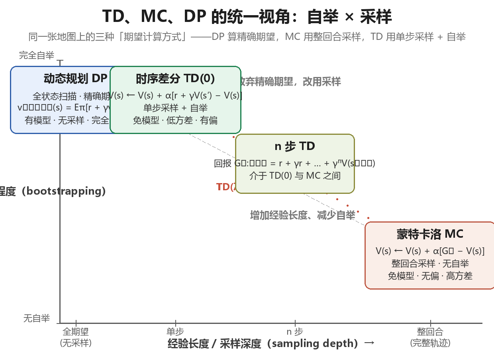
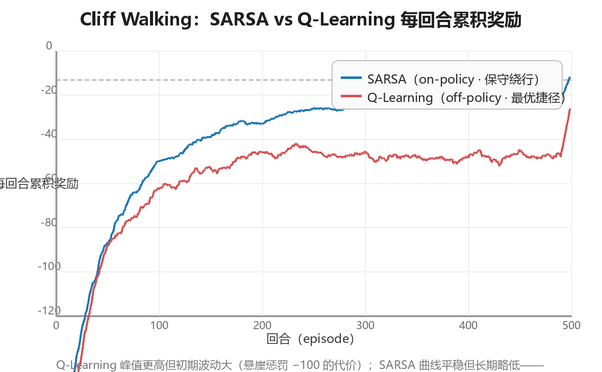

# 时序差分学习（Temporal Difference Learning）

> 时序差分学习（Temporal Difference Learning, TD）是强化学习**最核心、
> 最具独创性**的思想——Sutton 称之为"强化学习的中心思想"。它把蒙特卡洛
> （Monte Carlo, MC）的**采样（sampling）**与动态规划（Dynamic Programming,
> DP）的**自举（bootstrapping）**合二为一：每与环境交互一步，就用"即时
> 奖励 + 下一步价值的估计"更新当前状态的价值，**无需等待回合结束**。
> 本章从 TD 的一步更新公式出发，依次展开：TD 与 MC 的误差分析、on-policy
> 的 SARSA、off-policy 的 Q-Learning、Expected SARSA 与 Double Q-Learning、
> n-step TD 与 TD(λ)/资格迹（eligibility traces），最后在 Cliff Walking
> 上用完整实验对比 SARSA 与 Q-Learning。全文假设读者已掌握第 2 章（DP）
> 与第 3 章（MC）的内容；所有代码均为可运行的 Python 3 实现。

---

## 一、TD 核心思想：一步估计更新

### 1.1 从 MC 到 TD：为什么要"边走边学"

第 3 章的蒙特卡洛方法用**完整回合的回报** $G_t$ 来估计价值：

$$V(S_t) \leftarrow V(S_t) + \alpha \left[ G_t - V(S_t) \right], \qquad
G_t = R_{t+1} + \gamma R_{t+2} + \gamma^2 R_{t+3} + \cdots$$

MC 有一个结构性短板：**必须等到回合结束**才能拿到 $G_t$，然后才能更新。
这带来三个连锁问题：

| MC 的短板 | 后果 |
|-----------|------|
| 只能用于回合制任务 | 无法处理"无限持续"（continuing）任务，如股票交易、过程控制 |
| 更新滞后 | 整回合经验先攒着、后处理，无法在线（online）逐步学习 |
| 整回合回报方差大 | $G_t$ 是 $T-t$ 个随机奖励的累加，方差随回合长度增长 |

TD 的关键洞察是：**不必等完整的 $G_t$，走一步就够了**。用"即时奖励 +
下一步价值的当前估计"作为 $G_t$ 的替代品：

```
MC 视角：  S_t ──► R_{t+1} ──► S_{t+1} ──► R_{t+2} ──► S_{t+2} ──► ... ──► 回合结束才更新
                                 （需要完整轨迹，回报 G_t 方差大）

TD 视角：  S_t ──► R_{t+1} ──► S_{t+1}
              └──────┘    └──────┘
             即时奖励   用 V(S_{t+1}) 估计未来
             走一步就更新（无需回合结束）
```

> **核心思想**：$V(S_{t+1})$ 本身就是"从 $S_{t+1}$ 出发的期望回报"的当前
> 估计。把它当作未来的代理，那么"$R_{t+1} + \gamma V(S_{t+1})$"就是一个
> 只需一步就能算出的回报估计——**用估计去更新估计**，这就是自举。

### 1.2 更新公式与 TD 误差

TD 的更新公式（TD(0)，即零步自举的 TD 预测）：

$$
\boxed{\; V(S_t) \leftarrow V(S_t) + \alpha \left[ R_{t+1} + \gamma V(S_{t+1}) - V(S_t) \right] \;}
$$

其中方括号内是**TD 目标（TD target）**，被估计量本身：

$$V(S_t) \leftarrow V(S_t) + \alpha \left[ \underbrace{R_{t+1} + \gamma V(S_{t+1})}_{\text{TD 目标}} - V(S_t) \right]$$

方括号整体称为**TD 误差（TD error）**，记作 $\delta_t$：

$$\delta_t = R_{t+1} + \gamma V(S_{t+1}) - V(S_t)$$

TD 误差刻画的是"这次一步经验，与当前价值估计之间的**不一致程度**"。
注意 $\delta_t$ 与第 3 章的 MC 误差 $G_t - V(S_t)$ 有本质区别：

| 误差类型 | 定义 | 依赖信息 | 性质 |
|---------|------|---------|------|
| MC 误差 | $G_t - V(S_t)$ | 完整回合回报 | 无偏，高方差，回合结束才能算 |
| TD 误差 | $R_{t+1} + \gamma V(S_{t+1}) - V(S_t)$ | 单步转移 + 当前估计 | 有偏，低方差，每步都能算 |

> **核心思想**：TD 误差 $\delta_t$ 是强化学习里最重要的标量信号之一——
> 它是"预测与现实之差"，后续几乎所有算法（SARSA、Q-Learning、TD(λ)、
> 乃至策略梯度里的 GAE）都在以各种方式利用这个差值。

### 1.3 自举与采样：TD 的双重身份

为什么 TD 同时拥有 MC 与 DP 的血统？因为"计算价值更新"这件事可以拆成
两个独立的维度：

| 维度 | 两种选择 | 含义 |
|------|---------|------|
| **采样（Sampling）** | 采样 / 求期望 | 用单次经验近似期望（采样），还是用已知模型精确计算（期望） |
| **自举（Bootstrapping）** | 自举 / 不自举 | 更新时是否使用"后继状态的当前估计"代替真实回报 |

三大方法族恰好占据这个二维空间的三个角：

```
                    不自举（用真实回报 G_t）
                          │
              MC           │
        （采样+不自举）      │
                          │
  采样 ────────────────────┼──────────────────── 期望（需模型）
                          │
              TD           │          DP
        （采样+自举）       │   （期望+自举）
                          │
                    自举（用估计 V(S')）
```

- **DP**：期望 + 自举。已知模型，精确计算期望；用 $v_k(S')$ 更新 $v_{k+1}(S)$。
- **MC**：采样 + 不自举。用完整回合回报，无偏但高方差。
- **TD**：采样 + 自举。用一步经验 + 后继状态估计，有偏但低方差。

### 1.4 DP / MC / TD 三方对比表

| 维度 | 动态规划 DP | 蒙特卡洛 MC | 时序差分 TD |
|------|------------|------------|------------|
| **是否采样** | 否（对全状态求期望） | 是（完整回合采样） | 是（单步转移采样） |
| **是否自举** | 是（用 $v_k(S')$） | 否（用真实 $G_t$） | 是（用 $V(S')$） |
| **方差** | 无（模型精确时） | 高（随回合长度增长） | 低（只累加一步随机性） |
| **偏差** | 无（模型精确时） | 无偏 | 有偏（初始估计不准时） |
| **是否需环境模型** | 需要（已知 $P, R$） | 不需要 | 不需要 |
| **是否需等回合结束** | 不需要（全状态扫描） | **需要** | **不需要**（单步即可） |
| **能否用于持续任务** | 能 | 不能（须有终止） | 能 |
| **典型算法** | 策略迭代、价值迭代 | 首次访问 / 每次访问 MC | SARSA、Q-Learning |

> **核心思想**：DP、MC、TD 解的是同一个贝尔曼方程，区别只在"期望怎么算"。
> TD 用"单步采样 + 自举"在方差与偏差之间取得折中，且天然支持在线学习与
> 持续任务——这正是它成为免模型 RL 主力的原因。

### 1.5 最小示例：三状态链上的逐步更新

用一个极小的确定性任务观察 TD 误差如何驱动更新。三状态链
$A \to B \to C$，$C$ 为终止状态，每步奖励 $+1$，$\gamma = 0.9$，
$\alpha = 0.1$，$V$ 初始全 0。真值：$v_\pi(B) = 1$，$v_\pi(A) = 1.9$。

```python
import numpy as np

# 三状态链 A→B→C（C 为终止状态），每步奖励 +1，γ = 0.9，α = 0.1
V = np.zeros(3)
alpha, gamma = 0.1, 0.9
for ep in range(1, 7):
    s = 0; done = False
    while not done:
        s2 = s + 1
        done = (s2 == 2)          # C 是终止状态
        r = 1.0
        delta = r + gamma * (0.0 if done else V[s2]) - V[s]
        V[s] += alpha * delta
        s = s2
    print(f"episode {ep}: V(A)={V[0]:.4f}  V(B)={V[1]:.4f}  (真值 1.9 / 1.0)")

# 预期输出:
# episode 1: V(A)=0.1000  V(B)=0.1000  (真值 1.9 / 1.0)
# episode 2: V(A)=0.1990  V(B)=0.1900  (真值 1.9 / 1.0)
# episode 3: V(A)=0.2962  V(B)=0.2710  (真值 1.9 / 1.0)
# episode 4: V(A)=0.3910  V(B)=0.3439  (真值 1.9 / 1.0)
# episode 5: V(A)=0.4828  V(B)=0.4095  (真值 1.9 / 1.0)
# episode 6: V(A)=0.5714  V(B)=0.4686  (真值 1.9 / 1.0)
```

前两个回合的 TD 误差明细（可自行验算）：

| 回合 | 步骤 | $\delta_t = r + \gamma V(s') - V(s)$ | 更新后 |
|------|------|--------------------------------------|--------|
| 1 | $A \to B$ | $1 + 0.9 \times 0 - 0 = 1.000$ | $V(A) = 0.1$ |
| 1 | $B \to C$ | $1 + 0.9 \times 0 - 0 = 1.000$ | $V(B) = 0.1$ |
| 2 | $A \to B$ | $1 + 0.9 \times 0.1 - 0.1 = 0.990$ | $V(A) = 0.199$ |
| 2 | $B \to C$ | $1 + 0.9 \times 0 - 0.1 = 0.900$ | $V(B) = 0.19$ |
| 3 | $A \to B$ | $1 + 0.9 \times 0.19 - 0.199 = 0.972$ | $V(A) = 0.2962$ |
| 3 | $B \to C$ | $1 + 0.9 \times 0 - 0.19 = 0.810$ | $V(B) = 0.271$ |

注意两点：① 每走一步、每回合结束前，价值就在更新——**不需要等回合
结束**；② $V(B)$ 先于 $V(A)$ 逼近真值，因为 $B$ 离终止状态更近、它的
TD 目标里"真实信息"占比更高——这就是**信用分配**在 TD 中的自然形态：
信息从终止状态沿转移边**逐步往回传导**。

### 1.6 TD 的适用场景与局限

| 场景 | 是否适合 TD | 原因 |
|------|------------|------|
| 回合制任务（棋类、导航） | 适合 | 在线更新，样本效率高于 MC |
| 持续任务（控制、交易） | **TD 是少数选择** | 不依赖回合终止 |
| 非马尔可夫 / 部分可观测环境 | 不太适合 | 自举会放大观测缺失导致的偏差（见 2.4 节） |
| 与函数逼近结合（深度 RL） | 适合但需技巧 | 自举 + 函数逼近可能发散，需经验回放等（第 5 章） |

> **注意**：本章所有 TD 算法都是**表格型（tabular）**的——价值存成表，
> 每个状态独立更新。表格型 TD 在有限状态空间下有严格的收敛保证；一旦
> 换成函数逼近，自举带来的"估计更新估计"就可能不稳定，这是第 5 章要
> 解决的核心矛盾。

---

## 二、TD 与 MC 的误差分析

### 2.1 偏差-方差权衡（Bias-Variance Tradeoff）

TD 与 MC 的根本分歧在于：**用"有偏但低方差的单步估计"还是"无偏但高方差
的整回合回报"**。两者都是 $v_\pi(s)$ 的估计量，性质截然不同：

| 估计量 | 偏差 | 方差 | 收敛性 | 样本效率 |
|--------|------|------|--------|---------|
| $G_t$（MC 回报） | **无偏**：$\mathbb{E}[G_t \mid S_t = s] = v_\pi(s)$ | 高：累加 $T - t$ 个随机奖励 | 随回合数收敛，$\alpha$ 需满足 Robbins-Monro 条件 | 低：每个状态只从"路过它的回合"学习 |
| $R_{t+1} + \gamma V(S_{t+1})$（TD 目标） | **有偏**：$V(S_{t+1})$ 是估计值，初始偏差非零 | 低：只含一步随机性 | 随回合数收敛（表格型保证） | 高：一步经验即可更新，状态间共享信息 |

方差来源的直观拆解：设奖励方差为 $\sigma^2$，则

$$\mathrm{Var}(G_t) \approx (T - t)\,\sigma^2 \qquad\text{vs.}\qquad
\mathrm{Var}\!\left(R_{t+1} + \gamma V(S_{t+1})\right) \approx \sigma^2$$

MC 的方差随回合长度**线性增长**，TD 的方差被压到"一步"的量级——代价是
引入了由初始估计不准带来的**系统性偏差**。

> **核心思想**：TD 用"一点偏差"换"大幅降方差"。当偏差（随学习迅速衰减）
> 小于方差（随回合长度持续增长）时，TD 在有限样本下几乎总是胜出。这个
> 权衡贯穿整个 RL：第 6 章的 n-step 方法、第 7 章的 TD(λ)、第 6 章的
> GAE，本质上都是在**手动调节偏差与方差的配比**。

### 2.2 随机游走实验（Sutton & Barto 例 6.2 风格）

实验环境：5 个非终止状态 $A, B, C, D, E$，左右两端为终止状态。从任意
非终止状态等概率向左或右移动一步；到达左端奖励 $0$，到达右端奖励 $+1$，
$\gamma = 1$（无折扣）：

```
   左端终止 r=0                        右端终止 r=+1
        │                                  │
        ▼                                  ▼
   ┌────┬────┬────┬────┬────┬────┬────┐
   │ 终 │ A  │ B  │ C  │ D  │ E  │ 终 │
   └────┴────┴────┴────┴────┴────┴────┘
         等概率 ← → 随机游走
```

该随机游走的价值有解析解（从状态 $s$ 出发到达右端的概率）：

| 状态 | A | B | C | D | E |
|------|-----|-----|-----|-----|-----|
| 真值 $v_\pi$ | $1/6 \approx 0.167$ | $2/6 \approx 0.333$ | $3/6 = 0.500$ | $4/6 \approx 0.667$ | $5/6 \approx 0.833$ |

实验设置：TD(0) 取 $\alpha = 0.1$，MC 取 $\alpha = 0.01$（MC 方差大，
需要更小的步长才能收敛），各训练 100 回合，用 RMS 误差
$\sqrt{\frac{1}{5}\sum_s (V(s) - v_\pi(s))^2}$ 衡量估计质量。

```python
import numpy as np

class RandomWalk:
    """5 个非终止状态 A-E，两端为终止状态（左端奖励 0，右端奖励 +1）"""
    def __init__(self, n=5):
        self.n = n
        self.s = None
    def reset(self):
        self.s = self.n // 2          # 从中间状态 C 出发
        return self.s
    def step(self, a):
        ns = self.s + np.random.choice([-1, 1])
        if ns < 0:
            return 0, 0.0, True       # 左端终止：奖励 0
        if ns >= self.n:
            return 0, 1.0, True       # 右端终止：奖励 +1
        self.s = ns
        return self.s, 0.0, False

def td0_predict(env, episodes=100, alpha=0.1, gamma=1.0):
    V = np.zeros(env.n)
    for _ in range(episodes):
        s = env.reset(); done = False
        while not done:
            s2, r, done = env.step(0)
            V[s] += alpha * (r + gamma * (0.0 if done else V[s2]) - V[s])
            s = s2
    return V

def mc_predict(env, episodes=100, alpha=0.01, gamma=1.0):
    V = np.zeros(env.n)
    for _ in range(episodes):
        traj = []                     # 记录完整回合 (状态, 奖励)
        s = env.reset(); done = False
        while not done:
            s2, r, done = env.step(0)
            traj.append((s, r)); s = s2
        G = 0.0                       # 从回合末尾倒推回报
        for s, r in reversed(traj):
            G = r + gamma * G
            V[s] += alpha * (G - V[s])
    return V

true_v = np.array([1, 2, 3, 4, 5]) / 6.0
def rms(V): return np.sqrt(np.mean((V - true_v) ** 2))

# 单次运行：100 回合后的 V 估计
np.random.seed(42)
V_td = td0_predict(RandomWalk(), 100, 0.1)
np.random.seed(42)
V_mc = mc_predict(RandomWalk(), 100, 0.01)
print("TD(0)  100 回合后 V:", [f"{x:.3f}" for x in V_td], " RMS =", f"{rms(V_td):.4f}")
print("MC     100 回合后 V:", [f"{x:.3f}" for x in V_mc], " RMS =", f"{rms(V_mc):.4f}")
print("真实值 vπ         :", [f"{x:.3f}" for x in true_v])

# 学习曲线：100 次独立运行平均 RMS 误差（每 10 回合采样一次）
def curves(seed):
    rng = np.random.default_rng(seed)
    Vt = np.zeros(5); Vm = np.zeros(5)
    td_rms = []; mc_rms = []
    for ep in range(101):
        s = 2; done = False
        while not done:
            ns = s + rng.choice([-1, 1])
            if ns < 0: r, done = 0.0, True
            elif ns >= 5: r, done = 1.0, True
            else: r, done = 0.0, False
            Vt[s] += 0.1 * (r + (0.0 if done else Vt[ns]) - Vt[s])
            s = ns
        traj = []; s = 2; done = False
        while not done:
            ns = s + rng.choice([-1, 1])
            if ns < 0: r, done = 0.0, True
            elif ns >= 5: r, done = 1.0, True
            else: r, done = 0.0, False
            traj.append((s, r)); s = ns
        G = 0.0
        for s, r in reversed(traj):
            G = r + G
            Vm[s] += 0.01 * (G - Vm[s])
        if ep % 10 == 0:
            td_rms.append(rms(Vt)); mc_rms.append(rms(Vm))
    return td_rms, mc_rms

td_sum = np.zeros(11); mc_sum = np.zeros(11)
for seed in range(100):
    t, m = curves(seed)
    td_sum += np.array(t); mc_sum += np.array(m)
print("episodes :", list(range(0, 101, 10)))
print("TD(0) RMS:", [f"{x:.3f}" for x in td_sum / 100])
print("MC    RMS:", [f"{x:.3f}" for x in mc_sum / 100])

# 预期输出（节选）:
# TD(0)  100 回合后 V: ['0.128', '0.249', '0.432', '0.682', '0.826']  RMS = 0.0519
# MC     100 回合后 V: ['0.120', '0.265', '0.434', '0.572', '0.570']  RMS = 0.1339
# 真实值 vπ         : ['0.167', '0.333', '0.500', '0.667', '0.833']
# episodes : [0, 10, 20, 30, 40, 50, 60, 70, 80, 90, 100]
# TD(0) RMS: ['0.535', '0.413', '0.320', '0.249', '0.186', '0.147', '0.118', '0.099', '0.083', '0.072', '0.064']
# MC    RMS: ['0.546', '0.462', '0.392', '0.340', '0.298', '0.261', '0.230', '0.205', '0.187', '0.167', '0.152']
```

### 2.3 结果解读：为什么 TD 更快

把学习曲线整理成表（100 次独立运行平均的 RMS 误差）：

| 训练回合数 | 0 | 10 | 20 | 30 | 40 | 50 | 60 | 70 | 80 | 90 | 100 |
|-----------|------|------|------|------|------|------|------|------|------|------|------|
| **TD(0)** $\alpha=0.1$ | 0.535 | 0.413 | 0.320 | 0.249 | 0.186 | 0.147 | 0.118 | 0.099 | 0.083 | 0.072 | **0.064** |
| **MC** $\alpha=0.01$ | 0.546 | 0.462 | 0.392 | 0.340 | 0.298 | 0.261 | 0.230 | 0.205 | 0.187 | 0.167 | 0.152 |

两个观察：① 100 回合后 TD(0) 的 RMS（0.064）不到 MC（0.152）的一半；
② MC 的 $\alpha$ 已经取了 TD 的十分之一，仍追不上。**TD 快在哪？**

1. **每步都在更新**：一个回合里 MC 只在结束后更新一次（且只有途经的状态
   被更新），TD 则每个转移更新一次——同样 100 回合，TD 的"有效更新次数"
   远多于 MC。
2. **状态间共享信息（马尔可夫结构）**：$V(A)$ 的 TD 目标包含 $V(B)$，
   而 $V(B)$ 又包含 $V(C)$……一步经验带来的信息会沿转移边**传导**到相邻
   状态。MC 则把每个状态孤立对待——$V(A)$ 只从"恰好经过 $A$ 的回合"
   学习，信息无法共享。
3. **方差小**：见 2.1 节，TD 目标只含一步随机性。

> **核心思想**：TD 的样本效率优势来自**确定性等价估计（certainty-
> equivalence estimate）**：在批处理（batch）情形下，TD(0) 收敛到的解，
> 等价于**先根据观测到的经验构造最大似然 MDP**（用观测到的转移频率和
> 平均奖励作为 $P$ 与 $R$），**再在这个经验 MDP 上精确求解贝尔曼方程**
> 得到的值——它充分利用了数据中的马尔可夫结构。而 MC 收敛到的解，只是
> 对已见回报做最小二乘拟合，**丢弃了状态间的转移关系**。马尔可夫性质
> 成立时，确定性等价估计利用了更多信息，因而更准。

### 2.4 什么时候 MC 反而更好

| 场景 | 为什么 MC 占优 | 典型例子 |
|------|---------------|---------|
| **环境非马尔可夫 / 部分可观测** | TD 自举依赖 $V(S_{t+1})$ 蕴含的马尔可夫假设；观测缺失时自举会把偏差逐状态放大，MC 用真实回报不受影响 | POMDP、带噪声传感器 |
| **需要无偏估计** | TD 初始偏差需要时间消退；MC 的估计始终无偏 | 理论分析、离线评估 |
| **批处理且数据充足** | 数据多到方差不再是瓶颈时，无偏性更值钱 | 离线数据集评估 |
| **回合很短** | 回合短则 $G_t$ 方差小，MC 的短板消失 | 一步棋局、短对话 |

> **注意**：两者并非互斥。n-step 方法（第 6 节）在"1 步"与"整回合"之间
> 连续插值，TD(λ)（第 7 节）用加权平均统一两者——**偏差与方差的权衡
> 不是二选一，而是一个连续旋钮**。

---

## 三、SARSA：on-policy 时序差分控制

### 3.1 从预测到控制：TD 用于动作价值

第 1、2 节讨论的是**预测问题**（给定策略求 $v_\pi$）。真实任务需要
**控制**——找到最优策略。把 TD 思想从 $V(s)$ 搬到动作价值 $Q(s, a)$ 上，
就得到时序差分控制方法。其中第一个登场的是 **SARSA**，名字来自它的更新
需要五元组 $(S_t, A_t, R_{t+1}, S_{t+1}, A_{t+1})$：

```
S → A → R → S' → A'
```

SARSA 的更新公式（用"下一步动作的实际价值" $Q(S', A')$ 自举）：

$$
\boxed{\; Q(S_t, A_t) \leftarrow Q(S_t, A_t) + \alpha \left[ R_{t+1} + \gamma Q(S_{t+1}, A_{t+1}) - Q(S_t, A_t) \right] \;}
$$

关键点：$A_{t+1}$ 是**用与 $A_t$ 相同的策略（行为策略）实际执行的动作**。
也就是说，SARSA 估计的是"**在当前行为策略下**每个动作的价值"——这就是
**on-policy（同策略）**的含义。

### 3.2 伪代码（Sutton & Barto 算法 6.4 风格）

```
算法：SARSA（on-policy TD 控制）
对每个回合：
    初始化 S
    用 ε-greedy 从 Q 选出动作 A
    对回合中的每一步：
        执行 A，观测 R, S'
        用 ε-greedy 从 Q 选出动作 A'（行为策略，ε 探索）
        Q(S, A) ← Q(S, A) + α [ R + γ Q(S', A') − Q(S, A) ]
        S ← S';  A ← A'
    直到 S 为终止状态
```

注意伪代码里 `A'` 的选取与 `A` 完全对称——**同一把 ε-greedy 既产生行为、
也参与更新目标**。这是 on-policy 的签名特征。

### 3.3 Cliff Walking：on-policy 的经典试金石

**Cliff Walking**（Sutton & Barto 例 6.6）是展示 on-policy / off-policy
差异的标准环境：

| 规则项 | 定义 |
|--------|------|
| 网格 | $4 \times 12$，共 48 个格子 |
| 起点 S | $(3, 0)$（左下角） |
| 终点 G | $(3, 11)$（右下角） |
| 悬崖 | $(3, 1)$ 至 $(3, 10)$ 共 10 格 |
| 动作 | 上、下、左、右（确定性转移） |
| 掉崖 | 进入悬崖格：奖励 $-100$，立即回到起点 S |
| 其他 | 每走一步奖励 $-1$；撞墙（越界）原地不动 |
| 折扣 | $\gamma = 1$ |

```
        列 0   1   2   3   4   5   6   7   8   9  10  11
行 0   ┌───┬───┬───┬───┬───┬───┬───┬───┬───┬───┬───┬───┐
行 1   ├───┼───┼───┼───┼───┼───┼───┼───┼───┼───┼───┼───┤
行 2   ├───┼───┼───┼───┼───┼───┼───┼───┼───┼───┼───┼───┤
行 3   └───┴───┴───┴───┴───┴───┴───┴───┴───┴───┴───┴───┘
        S   █   █   █   █   █   █   █   █   █   █   G
            └────────────── 悬崖 █ ──────────────┘
```

两种典型路线：

| 路线 | 走法 | 步数 | 总奖励 |
|------|------|------|--------|
| **最优路线** | 沿悬崖边（行 2）一路向右 | 13 步 | $-13$（最优） |
| **保守路线** | 向上绕到行 1，再向右，最后向下 | 14~16 步 | 约 $-14 \sim -16$ |

直觉上最优路线贴着悬崖，但只要 $\varepsilon$ 探索存在，走在悬崖边上就有
概率一步踩空掉崖（$-100$）。**SARSA 学的是"带着探索的行为策略"的价值**，
因此悬崖边的格子价值被掉崖风险压低，最终学出的策略会**主动绕开悬崖**。

### 3.4 Python 实现

```python
import numpy as np

class CliffWalking:
    """Cliff Walking：4×12 网格。起点 (3,0)，终点 (3,11)，悬崖 (3,1)-(3,10)。
    动作：0=上, 1=右, 2=下, 3=左。掉下悬崖奖励 -100 并回到起点，
    其余每步奖励 -1；撞墙（越界）原地不动。"""
    def __init__(self, rows=4, cols=12):
        self.rows, self.cols = rows, cols
        self.start = (rows - 1, 0)
        self.goal = (rows - 1, cols - 1)
        self.cliff = set((rows - 1, c) for c in range(1, cols - 1))
        self.actions = [0, 1, 2, 3]
        self.s = None
    def reset(self):
        self.s = self.start
        return self.s
    def step(self, a):
        r, c = self.s
        dr, dc = [(-1, 0), (0, 1), (1, 0), (0, -1)][a]
        nr, nc = r + dr, c + dc
        if not (0 <= nr < self.rows and 0 <= nc < self.cols):
            nr, nc = r, c            # 撞墙：原地不动
        if (nr, nc) in self.cliff:
            self.s = self.start
            return self.s, -100.0, True
        self.s = (nr, nc)
        if self.s == self.goal:
            return self.s, -1.0, True
        return self.s, -1.0, False

def sarsa(env, episodes=500, alpha=0.1, gamma=1.0, eps=0.1):
    Q = np.zeros((env.rows, env.cols, 4))
    rewards = []
    for _ in range(episodes):
        s = env.reset()
        a = np.random.randint(4) if np.random.random() < eps else int(np.argmax(Q[s]))
        total = 0.0; done = False
        while not done:
            s2, r, done = env.step(a)
            a2 = np.random.randint(4) if np.random.random() < eps else int(np.argmax(Q[s2]))
            Q[s][a] += alpha * (r + (0.0 if done else Q[s2][a2]) - Q[s][a])
            s, a = s2, a2
            total += r
        rewards.append(total)
    return Q, rewards

def greedy_path(env, Q):
    """沿贪心策略走，返回 (路径, 步数, 是否到达终点)"""
    s = env.reset(); path = [s]; done = False; steps = 0
    while not done and steps < 200:
        a = int(np.argmax(Q[s]))
        s2, r, done = env.step(a)
        s = s2; path.append(s); steps += 1
    return path, steps, done

np.random.seed(1)
env = CliffWalking()
Q_s, rew_s = sarsa(env)
p, steps, ok = greedy_path(env, Q_s)
print("SARSA 后 100 回合平均奖励:", round(np.mean(rew_s[-100:]), 2))
print("SARSA 贪心路径长度:", steps, "到达终点:", ok)
print("SARSA 前 5 回合奖励:", [int(x) for x in rew_s[:5]])

# 预期输出:
# SARSA 后 100 回合平均奖励: -23.05
# SARSA 贪心路径长度: 15 到达终点: True
# SARSA 前 5 回合奖励: [-110, -101, -142, -121, -104]
```

训练 500 回合后，SARSA 学到的贪心路线（用训练好的 $Q$ 表走出来的路径）：

```
行 0   .  .  .  .  .  .  .  .  .  .  .  .
行 1   →  →  →  →  →  →  →  →  →  →  →  ↓
行 2   ↑  .  .  .  .  .  .  .  .  .  .  ↓
行 3   ↑  █  █  █  █  █  █  █  █  █  █  G
```

SARSA 最终选择**向上绕行两行**、从行 1 横穿的保守路线（15 步），而不是
贴着悬崖的最优路线（13 步）。

### 3.5 为什么 on-policy 学出"保守"策略

| 问题 | 回答 |
|------|------|
| 悬崖边的格子（行 2）价值为什么低？ | 行为策略有 $\varepsilon = 0.1$ 的探索概率，站在行 2 时可能"向下"踩进悬崖（$-100$）；SARSA 的更新目标 $r + \gamma Q(S', A')$ 里 $A'$ 也来自行为策略，因此 $Q(\text{行 2}, \cdot)$ 被掉崖风险压低 |
| 保守路线为什么"正确"？ | 在 $\varepsilon$ 探索持续存在的前提下，贴着悬崖走的**期望回报**确实低于绕行——SARSA 估计的正是这个"带探索的期望"，所以它学到的策略对探索是**稳健**的 |
| 换成贪心执行后呢？ | 即使训练结束后用贪心（$\varepsilon = 0$）执行，SARSA 学到的 $Q$ 仍是"保守"的，路径依然绕行 |

> **核心思想**：on-policy 方法回答的问题是"**在我当前这种（带探索的）
> 行为方式下，每个动作值多少**"。因此它学到的策略天然考虑了探索的代价。
> 这是优点（对探索稳健），也是局限（学到的不是真正的最优策略 $\pi_*$）。

---

## 四、Q-Learning：off-policy 时序差分控制

### 4.1 更新公式与 off-policy 思想

**Q-Learning**（Watkins, 1989）的更新公式只改了一处：把 $Q(S', A')$
换成 $\max_{a'} Q(S', a')$：

$$
\boxed{\; Q(S_t, A_t) \leftarrow Q(S_t, A_t) + \alpha \left[ R_{t+1} + \gamma \max_{a'} Q(S_{t+1}, a') - Q(S_t, A_t) \right] \;}
$$

| | SARSA | Q-Learning |
|---|-------|-----------|
| 更新目标里的 $S'$ 动作 | $A'$：行为策略实际执行的动作 | $\max_{a'} Q(S', a')$：**贪心目标策略**的动作 |
| 行为策略与目标策略 | 相同（on-policy） | 不同（off-policy） |

Q-Learning 的更新目标**完全由 $Q$ 表自身决定**（取最大），与"行为策略
实际怎么选动作"无关。这意味着：**行为策略可以任意（哪怕很差），更新
仍然在朝"最优动作价值 $q_*$"的方向走**——这就是 **off-policy（异策略）**
学习。

### 4.2 伪代码（Sutton & Barto 算法 6.5 风格）

```
算法：Q-Learning（off-policy TD 控制）
对每个回合：
    初始化 S
    对回合中的每一步：
        用 ε-greedy 从 Q 选出动作 A（行为策略，只影响探索）
        执行 A，观测 R, S'
        Q(S, A) ← Q(S, A) + α [ R + γ max_{a'} Q(S', a') − Q(S, A) ]
        S ← S'
    直到 S 为终止状态
```

对比 3.2 节的 SARSA 伪代码：Q-Learning 在更新时**不需要选出 $A'$**，
行为策略与目标策略被显式分离——行为策略负责"去哪里收集数据"，目标
策略（贪心）负责"朝什么方向更新"。

### 4.3 为什么 Q-Learning 学到最优策略

1. **更新目标独立于行为策略**：$R + \gamma \max_{a'} Q(S', a')$ 是贝尔曼
   最优性方程
   $$q_*(s, a) = \mathbb{E}\left[ R + \gamma \max_{a'} q_*(S', a') \mid S = s, A = a \right]$$
   的采样形式。每次更新都在把 $Q$ 拉向 $q_*$，**与探索策略无关**。
2. **收敛性保证**：在表格型设定下，只要每个 $(s, a)$ 被无限次访问、
   $\alpha$ 满足 Robbins-Monro 条件（$\sum \alpha = \infty$，$\sum \alpha^2 < \infty$），
   则 $Q \to q_*$（Watkins & Dayan, 1992）。SARSA 只能保证收敛到
   **行为策略下的**最优 $q_\pi$。
3. **贪心导出**：学得 $Q \approx q_*$ 后，$\pi(s) = \arg\max_a Q(s, a)$
   即最优策略。

> **核心思想**：off-policy 的本质是"**用任何策略收集数据，学最优策略**"。
> 这带来两个工程红利：① 数据可以来自**旧策略的回放**（经验回放，第 5 章
> DQN 的关键组件）；② 行为策略可以独立设计（如人工示范、安全策略）。

### 4.4 SARSA 与 Q-Learning 对比表

| 维度 | SARSA | Q-Learning |
|------|-------|-----------|
| **更新目标** | $R + \gamma Q(S', A')$（$A'$ 来自行为策略） | $R + \gamma \max_{a'} Q(S', a')$（来自贪心目标策略） |
| **探索策略** | 与目标策略相同（on-policy） | 可独立设计（off-policy），通常 ε-greedy |
| **学到的最优策略** | 行为策略下的最优（含探索代价的保守策略） | 真正的贪心最优策略 $\pi_*$ |
| **悬崖场景行为** | 绕行安全路线，平均约 $-24$ / 回合 | 走最优路线，但探索期常掉崖，平均约 $-37$ / 回合 |
| **方差 / 偏差** | 目标更贴近实际行为，方差较低 | max 运算引入正偏差（最大化偏差，见 5.2 节），方差较高 |
| **收敛对象** | $q_\pi$（$\pi$ 为行为策略） | $q_*$（与行为策略无关） |
| **典型应用** | 需对探索稳健的场景、在线学习 | DQN 家族、绝大多数现代深度 RL |

### 4.5 Python 实现与两条路线对比

```python
def q_learning(env, episodes=500, alpha=0.1, gamma=1.0, eps=0.1):
    """Q-Learning：更新目标取 max，与行为策略解耦（off-policy）。
    环境类 CliffWalking 与 greedy_path 见 3.4 节。"""
    Q = np.zeros((env.rows, env.cols, 4))
    rewards = []
    for _ in range(episodes):
        s = env.reset()
        total = 0.0; done = False
        while not done:
            a = np.random.randint(4) if np.random.random() < eps else int(np.argmax(Q[s]))
            s2, r, done = env.step(a)
            Q[s][a] += alpha * (r + (0.0 if done else np.max(Q[s2])) - Q[s][a])
            s = s2
            total += r
        rewards.append(total)
    return Q, rewards

np.random.seed(1)
Q_q, rew_q = q_learning(env)
p2, steps2, ok2 = greedy_path(env, Q_q)
print("Q-Learning 后 100 回合平均奖励:", round(np.mean(rew_q[-100:]), 2))
print("Q-Learning 贪心路径长度:", steps2, "到达终点:", ok2)
print("Q-Learning 前 5 回合奖励:", [int(x) for x in rew_q[:5]])

# 预期输出:
# Q-Learning 后 100 回合平均奖励: -36.5
# Q-Learning 贪心路径长度: 13 到达终点: True
# Q-Learning 前 5 回合奖励: [-103, -100, -107, -101, -143]
```

同一随机种子下，Q-Learning 学到的贪心路线（与 3.4 节 SARSA 的路线对比）：

```
SARSA（保守路线，15 步）                Q-Learning（最优路线，13 步）
行 0   .  .  .  .  .  .  .  .  .  .  .  .      行 0   .  .  .  .  .  .  .  .  .  .  .  .
行 1   →  →  →  →  →  →  →  →  →  →  →  ↓     行 1   .  .  .  .  .  .  .  .  .  .  .  .
行 2   ↑  .  .  .  .  .  .  .  .  .  .  ↓      行 2   →  →  →  →  →  →  →  →  →  →  →  ↓
行 3   ↑  █  █  █  █  █  █  █  █  █  █  G     行 3   ↑  █  █  █  █  █  █  █  █  █  █  G
```

Q-Learning 学出了贴着悬崖的**最优 13 步路线**；但训练过程中（ε = 0.1）
它频繁掉崖（前 5 回合平均奖励约 $-110$，几乎每回合都掉），而 SARSA 在
训练后期几乎不再掉崖。**"学到最优"与"过程安全"是两个不同的目标**——这是
第 8 节综合实验要量化对比的核心。

### 4.6 on-policy 与 off-policy 的工程意义

| 维度 | on-policy（SARSA） | off-policy（Q-Learning） |
|------|-------------------|--------------------------|
| 数据复用 | 数据必须来自当前策略，旧数据作废 | 旧策略数据可复用（经验回放的前提） |
| 样本效率 | 低（策略一变，数据就过期） | 高（可反复利用历史数据） |
| 探索安全性 | 策略自动规避探索风险 | 行为策略需单独设计安全机制 |
| 收敛目标 | 行为策略下的最优 | 全局最优 $q_*$ |
| 现代深度 RL | PPO 等（第 6 章） | DQN 家族（第 5 章） |

---

## 五、Expected SARSA 与 Double Q-Learning

### 5.1 Expected SARSA：把 max 换成期望

**Expected SARSA**（Van Seijen et al., 2009）的更新目标是对 $S'$ 处的
动作价值**按策略 $\pi$ 求期望**，而不是取 max：

$$
Q(S_t, A_t) \leftarrow Q(S_t, A_t) + \alpha \left[ R_{t+1} + \gamma \sum_a \pi(a \mid S_{t+1}) Q(S_{t+1}, a) - Q(S_t, A_t) \right]
$$

当行为策略是 ε-greedy 时，期望项可以展开为：

$$\sum_a \pi(a \mid S') Q(S', a) = (1 - \varepsilon) \max_a Q(S', a) + \frac{\varepsilon}{|A|} \sum_a Q(S', a)$$

| 性质 | Expected SARSA | SARSA | Q-Learning |
|------|---------------|-------|-----------|
| 更新目标 | 按 $\pi$ 求期望 | $Q(S', A')$（单样本） | $\max_a Q(S', a)$ |
| 目标方差 | **最低**（期望消除单样本噪声） | 高（含 $A'$ 采样噪声） | 中（max 无采样噪声但引入偏差） |
| on / off-policy | 两者皆可（$\pi$ 取贪心即 off-policy） | on-policy | off-policy |
| 计算量 | 需遍历 $S'$ 的所有动作 | 最小 | 最小 |

> **核心思想**：Expected SARSA 用"确定性期望"替换 SARSA 的"随机采样"，
> 在**不增加偏差**的前提下把目标方差降到最低——同样的 $\alpha$ 下它比
> SARSA 学得更稳。代价只是每步多算一次期望（表格型下遍历 $|A|$ 个动作）。

```python
def expected_sarsa(env, episodes=500, alpha=0.1, gamma=1.0, eps=0.1):
    """Expected SARSA：更新目标按 ε-greedy 策略求期望，方差低于 SARSA。"""
    Q = np.zeros((env.rows, env.cols, 4))
    rewards = []
    for _ in range(episodes):
        s = env.reset(); total = 0.0; done = False
        while not done:
            a = np.random.randint(4) if np.random.random() < eps else int(np.argmax(Q[s]))
            s2, r, done = env.step(a)
            pi = np.full(4, eps / 4.0)               # ε-greedy 概率分布
            pi[np.argmax(Q[s2])] += 1.0 - eps
            target = r + (0.0 if done else np.dot(pi, Q[s2]))
            Q[s][a] += alpha * (target - Q[s][a])
            s = s2; total += r
        rewards.append(total)
    return Q, rewards

np.random.seed(1)
Q_e, rew_e = expected_sarsa(env)
print("Expected SARSA 后 100 回合平均奖励:", round(np.mean(rew_e[-100:]), 2))

# 预期输出:
# Expected SARSA 后 100 回合平均奖励: -22.01
```

（环境类与 $\alpha, \varepsilon$ 等参数同 3.4 节；与 SARSA 的 $-23.05$
相比，Expected SARSA 在相同设置下略优且更稳。）

### 5.2 最大化偏差（Maximization Bias）：max 的陷阱

Q-Learning 的 $\max$ 运算有一个隐藏缺陷。设 $X_1, \dots, X_n$ 是对
$n$ 个动作价值的**带噪声估计**，则

$$\mathbb{E}\!\left[\max_a X_a\right] \;\ge\; \max_a \mathbb{E}[X_a]$$

只要估计有噪声，"取最大"就会**系统性高估**——因为噪声只会把某个动作
"顶"到最大，而不会"压"下去。这种**最大化偏差（maximization bias）**
在动作数多、噪声大时尤为严重，是深度 RL 中 Q 值过估计（overestimation）
的根源之一（第 5 章 Double DQN 的动机）。

一个小例子（Sutton & Barto 例 6.7 简化版）：

```
状态 A：两个动作
  左 → 奖励 0，终止
  右 → 进入状态 B（奖励 0）
状态 B：100 个动作，每个奖励 ~ N(-0.1, 1)，然后终止

真值：V*(A) = max(0, -0.1) = 0
```

B 的 100 个动作真值都是 $-0.1$，但 Q-Learning 每访问一次 B 就取一次
100 个噪声估计的 max——早期几乎必然得到一个**正的**最大值，于是
$Q(A, \text{右})$ 被系统性高估，$V(A)$ 偏离真值 0。

### 5.3 Double Q-Learning：两套 Q 表解耦"选择"与"评估"

**Double Q-Learning**（Hasselt, 2010）的思路：把"选出最大动作"与"读取
该动作的价值"交给**两套独立维护的 Q 表**完成。用 $Q_A$ 选动作、用
$Q_B$ 估值（反之亦然），使噪声无法"自肥"：

$$
Q_A(S_t, A_t) \leftarrow Q_A(S_t, A_t) + \alpha \left[ R_{t+1} + \gamma Q_B\!\left(S_{t+1}, \arg\max_a Q_A(S_{t+1}, a)\right) - Q_A(S_t, A_t) \right]
$$

以 0.5 概率更新 $Q_A$，否则对称地更新 $Q_B$；动作选择用两表的和
（或均值）。伪代码：

```
算法：Double Q-Learning
对每个回合：
    初始化 S
    对每一步：
        用 ε-greedy（基于 QA + QB）选出动作 A，执行，观测 R, S'
        以 0.5 概率：
            QA(S,A) ← QA(S,A) + α [ R + γ·QB(S', argmax_a QA(S',a)) − QA(S,A) ]
        否则：
            QB(S,A) ← QB(S,A) + α [ R + γ·QA(S', argmax_a QB(S',a)) − QB(S,A) ]
        S ← S'
    直到 S 为终止状态
```

**为什么有效**：$Q_B$ 与 $Q_A$ 由**不相交的经验**更新，相互独立。当
$Q_A$ 因噪声把某个动作"顶"成最大时，$Q_B$ 在该动作上的值仍是**无偏的
估计**——"选择"的噪声与"评估"的噪声互不相关，正偏差被消除。

```python
def demo_max_bias(seeds=100, episodes=300, alpha=0.1):
    """最大化偏差演示：状态 A 两个动作——左：奖励 0 并终止；
    右：进入 B。状态 B 有 100 个动作，奖励 ~ N(-0.1, 1) 后终止。
    真实 V*(A) = max(0, -0.1) = 0。返回两种算法的 V(A) 学习曲线均值。"""
    q_curve = np.zeros(episodes); dq_curve = np.zeros(episodes)
    for seed in range(seeds):
        rng = np.random.default_rng(seed)
        Q = np.zeros(101)               # 0-99: B 的动作；100: A 的"右"
        QA = np.zeros(101); QB = np.zeros(101)
        for t in range(episodes):
            # --- Q-Learning ---
            if rng.random() < 0.1:
                a = 1 if rng.random() < 0.5 else 0
            else:
                a = 1 if Q[100] >= 0 else 0      # 贪心：Q[100]>=0 时选"右"
            if a == 1:                            # 进入 B
                if rng.random() < 0.1:
                    b = rng.integers(100)
                else:
                    b = int(np.argmax(Q[:100]))
                r = rng.normal(-0.1, 1.0)
                Q[b] += alpha * (r - Q[b])
                Q[100] += alpha * (np.max(Q[:100]) - Q[100])
            q_curve[t] += max(0.0, Q[100])
            # --- Double Q-Learning ---
            if rng.random() < 0.1:
                a = 1 if rng.random() < 0.5 else 0
            else:
                a = 1 if (QA[100] + QB[100]) / 2 >= 0 else 0
            if a == 1:
                if rng.random() < 0.1:
                    b = rng.integers(100)
                else:
                    b = int(np.argmax(QA[:100]))
                r = rng.normal(-0.1, 1.0)
                if rng.random() < 0.5:
                    # 索引取 QA 的 argmax，值读 QB（独立估计，消除正偏差）
                    QA[b] += alpha * (r - QA[b])
                    QA[100] += alpha * (QB[int(np.argmax(QA[:100]))] - QA[100])
                else:
                    QB[b] += alpha * (r - QB[b])
                    QB[100] += alpha * (QA[int(np.argmax(QB[:100]))] - QB[100])
            dq_curve[t] += max(0.0, (QA[100] + QB[100]) / 2)
    return q_curve / seeds, dq_curve / seeds

q_c, dq_c = demo_max_bias()
print("episode :      1      10      50     100     200     300")
print("Q-Learn :", " ".join(f"{q_c[i]:7.3f}" for i in [0, 9, 49, 99, 199, 299]))
print("DoubleQ :", " ".join(f"{dq_c[i]:7.3f}" for i in [0, 9, 49, 99, 199, 299]))

# 预期输出（100 个随机种子平均的 V(A) 估计，真值 0）:
# episode :      1      10      50     100     200     300
# Q-Learn :   0.003   0.062   0.133   0.125   0.123   0.128
# DoubleQ :   0.000   0.006   0.006   0.002   0.002   0.001
```

结果解读：Q-Learning 的 $V(A)$ 被最大化偏差抬高到约 $0.13$（真值为 0，
相对高估 13%）；Double Q-Learning 的估计始终贴着 0 附近（约 $0.001 \sim
0.006$），正偏差基本被消除。**代价**是两套 Q 表使每个 $(s,a)$ 的更新
频率减半，前期收敛略慢。

### 5.4 四种表格型 TD 控制算法横向对比

| 算法 | 更新目标（$S'$ 处） | on/off-policy | 目标方差 | 最大化偏差 | 悬崖场景表现 |
|------|--------------------|---------------|---------|-----------|-------------|
| **SARSA** | $Q(S', A')$（行为动作） | on | 高 | 无（不自举到 max） | 保守路线（约 $-23$） |
| **Expected SARSA** | $\sum_a \pi(a\|S') Q(S', a)$ | 均可 | **最低** | 无（用期望） | 保守路线（约 $-22$） |
| **Q-Learning** | $\max_a Q(S', a)$ | off | 中 | **有** | 最优路线但训练期掉崖多（约 $-37$） |
| **Double Q-Learning** | 另一表的 $\arg\max$ 值 | off | 中 | **基本消除** | 最优路线，估值更准 |

> **核心思想**：这四种算法构成一张"**目标怎么构造**"的设计空间图——
> 用行为动作（SARSA）、用期望（Expected SARSA）、用贪心 max（Q-Learning）、
> 用解耦的 max（Double Q-Learning）。选择标准取决于：探索是否安全
> （on-policy 更稳）、方差是否敏感（期望最优）、估值是否会被高估
> （Double Q 最准）。

---

## 六、n-step TD：单步与整回合之间的连续谱

### 6.1 TD 方法家族图谱

前文所有方法（TD(0)、SARSA、Q-Learning、Expected SARSA）都属于"一步
自举"家族；MC 属于"整回合"家族。**n-step TD** 在两者之间连续插值——
用 $n$ 步真实奖励 + 第 $n+1$ 步起用估计：



| 参数 $n$ | $n = 1$（TD(0)） | 中间值（如 $n = 3$） | $n \to \infty$（MC） |
|----------|-----------------|---------------------|----------------------|
| 自举程度 | 完全自举（1 步） | 部分自举（$n$ 步后） | 不自举（用完整回报） |
| 偏差 | 大（初始估计不准） | 中 | **无** |
| 方差 | **小**（1 步随机性） | 中 | 大（整回合累加） |
| 需等多少步 | 1 步 | $n$ 步 | 回合结束 |
| 典型算法 | SARSA、Q-Learning | n-step SARSA | 首次访问 MC |

> **核心思想**：$n$ 是一个"**偏差-方差旋钮**"：$n$ 越小越像 TD（低方差、
> 高偏差、学习快），$n$ 越大越像 MC（无偏、高方差、学习慢）。没有普适
> 最优的 $n$，取决于任务——这正是 TD(λ)（第 7 节）用加权平均"同时拥有
> 所有 $n$"的动机。

### 6.2 n-step return 定义

**n-step return**（截断回报）定义为前 $n$ 步真实奖励加上第 $n$ 步之后的
估计价值：

$$
G_t^{(n)} = R_{t+1} + \gamma R_{t+2} + \cdots + \gamma^{n-1} R_{t+n} + \gamma^n V(S_{t+n})
$$

当 $t + n \ge T$（超出回合末尾）时，$G_t^{(n)} = G_t$（整回合回报）。
两个极端：$G_t^{(1)} = R_{t+1} + \gamma V(S_{t+1})$ 即 TD 目标；
$G_t^{(\infty)} = G_t$ 即 MC 回报。

数值示例：设奖励序列为 $+2, -1, +3, +5$（回合第 4 步结束），$\gamma = 0.9$：

```python
import numpy as np

r = np.array([2.0, -1.0, 3.0, 5.0])   # 从 t=0 起的奖励序列，回合在第 4 步结束
gamma = 0.9
for n in [1, 2, 3, 4]:
    G = sum(gamma ** i * r[i] for i in range(n))
    print(f"G(0)^({n}) = {G:.3f}")
G_inf = sum(gamma ** i * r[i] for i in range(len(r)))
print(f"G(0)^(∞) = {G_inf:.3f}  （回合在第 4 步终止，与 n=4 相同）")

# 预期输出:
# G(0)^(1) = 2.000
# G(0)^(2) = 1.100
# G(0)^(3) = 3.530
# G(0)^(4) = 7.175
# G(0)^(∞) = 7.175  （回合在第 4 步终止，与 n=4 相同）
```

| $n$ | $G_0^{(n)}$ 的计算 | 数值 |
|-----|-------------------|------|
| 1 | $+2$ | 2.000 |
| 2 | $+2 + 0.9 \times (-1)$ | 1.100 |
| 3 | $1.1 + 0.9^2 \times 3$ | 3.530 |
| 4 | $3.53 + 0.9^3 \times 5$ | 7.175 |
| $\infty$ | 回合在第 4 步结束，$G_0^{(\infty)} = G_0^{(4)}$ | 7.175 |

同一个 $t$ 下，不同 $n$ 的 return 差异巨大——**$n$ 的选择直接决定更新
目标**。

### 6.3 n-step TD 预测与 n-step SARSA

**n-step TD 预测**（每 $n$ 步更新一次）：

$$V(S_t) \leftarrow V(S_t) + \alpha \left[ G_t^{(n)} - V(S_t) \right]$$

**n-step SARSA**（Sutton & Barto 算法 7.4 风格）把 $V$ 换成 $Q$，
return 中的末项用 $Q(S_{t+n}, A_{t+n})$：

$$
Q(S_t, A_t) \leftarrow Q(S_t, A_t) + \alpha \left[ G_{t:t+n} - Q(S_t, A_t) \right], \qquad
G_{t:t+n} = \sum_{i=1}^{n} \gamma^{i-1} R_{t+i} + \gamma^n Q(S_{t+n}, A_{t+n})
$$

实现要点：维护状态/动作/奖励三个缓冲，每走一步"补发"一次对 $n$ 步前
那个 $(S, A)$ 的更新（延迟更新机制）。

在 Cliff Walking 上运行 n-step SARSA（$\alpha = 0.1$，$\varepsilon = 0.1$，
500 回合，5 个随机种子平均的后 100 回合均值）：

| $n$ | 1 | 3 | 5 | 10 |
|-----|------|------|------|------|
| 后 100 回合平均奖励 | $-21.5$ | $-21.4$ | $-23.2$ | $-31.1$ |

解读：$n$ 较小时（1~3）表现接近且良好；$n = 10$ 明显变差——悬崖的
$-100$ 惩罚需要**及时**传导进价值，$n$ 太大时"掉崖信息"要在 $n$ 步之后
才进入更新目标，学习被拖慢。**n-step 的超参 $n$ 需要根据任务的时间尺度
调节**：奖励稀疏、延迟长时选大 $n$，奖励密集、风险即时时选小 $n$。

### 6.4 优缺点小结

| 优点 | 缺点 |
|------|------|
| 在偏差与方差之间可调，往往比 TD(0) 收敛更快 | 需要缓冲 $n$ 步经验，实现更复杂 |
| 比 MC 支持在线学习与持续任务 | $n$ 是额外超参，需调 |
| 比 TD(0) 对"奖励延迟"更宽容 | 奖励极端（如 $-100$）时大 $n$ 传播慢 |

> **注意**：n-step 方法在现代深度 RL 中有重要化身——第 6 章 PPO 的
> GAE（广义优势估计）本质上就是"**带权重的无穷 n-step 平均**"，即
> TD(λ) 思想在深度时代的回归（见 7.5 节）。

---

## 七、TD(λ) 与资格迹（进阶选读）

> 本节内容在表格型 RL 中地位极高（TD-Gammon 即用 TD(λ) 战胜人类冠军），
> 但在现代深度 RL 中已较少直接使用。建议理解**思想**（λ-return 加权、
> 资格迹的"信用回溯"），不必纠结实现细节。

### 7.1 λ-return：n-step return 的加权平均

TD(λ) 的思路：**不要选某一个 $n$，而是把所有的 $G_t^{(n)}$ 加权平均**。
**λ-return** 定义为：

$$
G_t^\lambda = (1 - \lambda) \sum_{n=1}^{\infty} \lambda^{n-1} G_t^{(n)}
$$

权重 $(1-\lambda)\lambda^{n-1}$ 随 $n$ 几何衰减、总和为 1。对终止于
$T$ 的回合，最后一项（$n = T - t$）的权重改为 $\lambda^{T-t-1}$（不再乘
$1-\lambda$）。

| $\lambda$ | 权重分配 | 退化为 |
|-----------|---------|--------|
| $\lambda = 0$ | 全部权重给 $n = 1$ | TD(0)（一步自举） |
| $0 < \lambda < 1$ | 指数衰减地混合所有 $n$ | 中间方法 |
| $\lambda = 1$ | 权重全部给 $n \to \infty$（末项） | MC（整回合回报） |

三步步长的回合（$T - t = 3$）各 $n$ 的权重示例：

| $n$ | $\lambda = 0$ | $\lambda = 0.5$ | $\lambda = 0.9$ |
|-----|---------------|-----------------|-----------------|
| 1 | 1.000 | 0.500 | 0.100 |
| 2 | 0.000 | 0.250 | 0.090 |
| 3（末项） | 0.000 | 0.250 | 0.810 |

> **核心思想**：λ-return 是"**所有 n-step return 的几何加权平均**"。
> $\lambda$ 与 $n$ 一样是偏差-方差旋钮，但它**同时包含所有时间尺度**，
> 避免了"选错单一 $n$"的风险。理论上 $\lambda$ 越大越无偏、方差越大。

### 7.2 前向视角与后向视角

**前向视角（forward view）**：站在时刻 $t$，要"看向未来"直到回合结束才能
算出 $G_t^\lambda$——这使 λ-return 无法在线使用，只能离线（offline）更新。

**后向视角（backward view）**：资格迹方法把同样的更新**分散**到每一步：
每走一步，把 TD 误差 $\delta_t$ 按"资格"比例分摊给**所有过去访问过的
状态**。两者在离线情形下数学等价：

```
前向视角（离线）：             后向视角（在线）：
  t 时刻需要整个未来            每步只用一个 δ_t，回放给过去

  S_t ──► ... ──► 回合结束       e(s) 记录"s 被多久前访问过"
  G_t^λ 算出来后才更新 V(S_t)    V(s) ← V(s) + α·δ_t·e(s)  对所有 s
```

| 视角 | 何时能更新 | 需要的信息 | 适用 |
|------|-----------|-----------|------|
| 前向（λ-return） | 回合结束后 | 完整未来轨迹 | 离线 / 批处理 |
| 后向（资格迹） | **每步** | 资格迹表 $e$ | 在线学习（TD(λ) 实际实现） |

### 7.3 资格迹（Eligibility Traces）与 TD(λ) 更新

**资格迹** $e_t(s)$ 记录"状态 $s$ 最近被访问得多频繁"——它是"信用"的
载体：越久远的状态，越不该为当前的 TD 误差负责。累积迹（accumulating
trace）的更新：

$$
e_t(s) = \gamma \lambda \, e_{t-1}(s) + \mathbf{1}\{S_t = s\}
$$

即：每步先把所有迹衰减 $\gamma\lambda$ 倍，再把当前访问的状态的迹加 1。
于是 TD(λ) 的更新是**对所有状态同时进行**的：

$$
\boxed{\; V(s) \leftarrow V(s) + \alpha \, \delta_t \, e_t(s), \qquad \forall s \;}
$$

```
资格迹的演变（状态访问序列 A → A → B → C）：

时刻       A        B        C
 0 访问 A: e(A)=1
 1 访问 A: e(A)=1+γλ        （再次访问，迹叠加）
 2 访问 B: e(A)=γλ, e(B)=1
 3 访问 C: e(A)=(γλ)², e(B)=γλ, e(C)=1
           └──────────┬──────────┘
          δ_3 按迹的强度分摊给 A、B、C：离得越近，分得越多
```

| 迹的类型 | 更新规则 | 特点 |
|---------|---------|------|
| 累积迹（accumulating） | $e(s) \leftarrow \gamma\lambda\, e(s) + 1$ | 反复访问同一状态会叠加；长回合中可能过大 |
| 替换迹（replacing） | 访问时 $e(s) \leftarrow 1$（先置 1 再衰减） | 防止叠加爆炸，常更稳健 |

在随机游走上实现 TD(λ)（$\gamma = 1$，100 回合）：

```python
import numpy as np

def td_lambda(env, episodes=100, alpha=0.1, lam=0.5, gamma=1.0):
    """TD(λ)：资格迹后向视角。env 与 rms 复用 2.2 节的 RandomWalk。"""
    V = np.zeros(env.n)
    for _ in range(episodes):
        e = np.zeros(env.n)            # 资格迹，每回合重置
        s = env.reset(); done = False
        while not done:
            s2, r, done = env.step(0)
            delta = r + gamma * (0.0 if done else V[s2]) - V[s]
            e[s] += 1.0                # 访问状态：迹 +1（累积迹）
            V += alpha * delta * e     # 所有状态按迹的强度分摊更新
            e *= gamma * lam           # 迹随时间衰减
            s = s2
    return V

for lam, alpha in [(0.0, 0.1), (0.5, 0.05), (0.9, 0.02)]:
    acc = 0.0
    for seed in range(100):
        np.random.seed(seed)
        acc += rms(td_lambda(RandomWalk(), 100, alpha, lam))
    print(f"λ={lam:.1f}, α={alpha:.2f}: 100 次运行平均 RMS = {acc/100:.4f}")

# 预期输出（随机游走，100 回合，各 λ 取较优 α）:
# λ=0.0, α=0.10: 100 次运行平均 RMS = 0.0602
# λ=0.5, α=0.05: 100 次运行平均 RMS = 0.0632
# λ=0.9, α=0.02: 100 次运行平均 RMS = 0.0830
```

（注意代码里 $\lambda$ 越大配的 $\alpha$ 越小——大 $\lambda$ 等价于长
return，方差大，需要更小的步长。$\lambda$ 与 $\alpha$ 必须联合调参。）

### 7.4 λ 与 α 的联合调参表

随机游走 100 回合、100 次运行平均 RMS 误差（$\lambda \times \alpha$ 网格，
**固定 $\alpha$ 时 $\lambda$ 越大越差；$\lambda$ 大必须配小 $\alpha$**）：

| $\lambda \backslash \alpha$ | 0.10 | 0.05 | 0.02 | 0.01 |
|----------------------------|------|------|------|------|
| 0.00 | **0.0616** | 0.1490 | 0.3261 | 0.4239 |
| 0.30 | 0.0581 | 0.0971 | 0.2726 | 0.3869 |
| 0.50 | 0.0643 | 0.0656 | 0.2225 | 0.3493 |
| 0.70 | 0.0777 | **0.0551** | 0.1555 | 0.2918 |
| 0.90 | 0.1148 | 0.0778 | 0.0844 | 0.1988 |
| 0.99 | 0.1691 | 0.1124 | 0.0825 | 0.1520 |

两个结论：① 对角线上（$\lambda$ 大配 $\alpha$ 小）各 $\lambda$ 表现接近，
最优约在 $\lambda \approx 0.3 \sim 0.7$；② **固定 $\alpha$ 时，$\lambda$
从 0 增大会显著变差**——因为大 $\lambda$ 的 return 方差大。调参时应
"$\lambda$ 与 $\alpha$ 反着调"。

### 7.5 为什么现代深度 RL 很少直接用 TD(λ)

| TD(λ) 的假设 | 深度 RL 的现实 | 冲突 |
|-------------|---------------|------|
| 状态可枚举，才能维护逐状态迹 $e(s)$ | 状态是高维连续向量（像素、传感器） | 迹表无法存储 |
| 表格更新 $V(s)$ | 用神经网络参数化 $V_\theta(s)$ | 迹无法"按状态"回溯到参数 |
| 单条轨迹在线更新 | 需要经验回放（打破相关性） | 迹与回放不兼容 |
| 无函数逼近的稳定性问题 | 自举 + 函数逼近可能发散 | 需额外技巧（第 5 章） |

> **核心思想**：TD(λ) 的**思想**没有过时——它被深度化改造为
> **GAE（Generalized Advantage Estimation, 第 6 章）**：GAE 用
> $\lambda$ 加权平均多步 TD 误差来估计优势函数，公式
> $\hat{A}_t = \sum_{l=0}^{\infty}(\gamma\lambda)^l \delta_{t+l}$
> 正是"λ-return 的优势版本"。PPO 等现代算法的 $\lambda$ 超参
> （通常 0.95）就源自这里。

### 7.6 TD(λ) 优缺点表

| 优点 | 缺点 |
|------|------|
| 统一 TD(0) 与 MC，消除"选 $n$"的尴尬 | 表格型才能维护迹；高维状态不可行 |
| 后向视角支持**在线**更新（前向不行） | $\lambda$ 与 $\alpha$ 强耦合，调参成本高 |
| 收敛速度通常优于固定 $n$ 的方法 | 累积迹在长回合中可能数值过大 |
| 理论优雅：前向/后向等价 | 深度时代被 GAE 取代 |

---

## 八、综合实验：Cliff Walking 上 SARSA vs Q-Learning

### 8.1 实验设置

| 参数 | 取值 |
|------|------|
| 环境 | Cliff Walking（3.4 节实现，$4 \times 12$） |
| 算法 | SARSA（on-policy）vs Q-Learning（off-policy） |
| 学习率 $\alpha$ | 0.1 |
| 折扣 $\gamma$ | 1.0 |
| 探索率 $\varepsilon$ | 0.1（ε-greedy，固定不衰减） |
| 训练回合数 | 500 |
| 随机种子 | 5 个（0~4），结果取平均 |
| 评估指标 | 每回合奖励和、贪心路径长度、掉崖次数 |

### 8.2 训练循环与统计

```python
import numpy as np

# 复用 3.4 节的环境类 CliffWalking、sarsa，以及 4.5 节的 q_learning

def run_experiment(algo_fn, env, episodes=500, seeds=5):
    """运行 seeds 个随机种子，返回分桶均值与全部奖励序列。"""
    buckets = np.zeros(5); all_rewards = []
    for seed in range(seeds):
        np.random.seed(seed)
        _, rew = algo_fn(env, episodes)
        all_rewards.append(rew)
        for b in range(5):
            buckets[b] += np.mean(rew[b * 100:(b + 1) * 100])
    return buckets / seeds, all_rewards

env = CliffWalking()
for name, fn in [("SARSA", sarsa), ("Q-Learning", q_learning)]:
    buckets, all_r = run_experiment(fn, env)
    print(f"{name:10s} 分桶均值: {[f'{x:.1f}' for x in buckets]}")
    print(f"{'':10s} 全程平均: {np.mean(all_r):.1f}")

np.random.seed(1)
Q_s2, rew_s2 = sarsa(env); Q_q2, rew_q2 = q_learning(env)
p_s, st_s, _ = greedy_path(env, Q_s2)
p_q, st_q, _ = greedy_path(env, Q_q2)
print(f"SARSA      贪心路径: {st_s} 步")
print(f"Q-Learning 贪心路径: {st_q} 步")
falls_s = [sum(1 for r in rew_s2[b*100:(b+1)*100] if r < -50) for b in range(5)]
falls_q = [sum(1 for r in rew_q2[b*100:(b+1)*100] if r < -50) for b in range(5)]
print("SARSA      掉崖次数(每100回合):", falls_s)
print("Q-Learning 掉崖次数(每100回合):", falls_q)

# 预期输出（5 个随机种子平均；掉崖次数为 seed=1 单次运行）:
# SARSA      分桶均值: ['-108.7', '-52.2', '-34.5', '-26.2', '-24.3']
#            全程平均: -49.2
# Q-Learning 分桶均值: ['-111.0', '-57.7', '-41.6', '-35.6', '-37.0']
#            全程平均: -56.6
# SARSA      贪心路径: 15 步
# Q-Learning 贪心路径: 13 步
# SARSA      掉崖次数(每100回合): [89, 33, 12, 7, 6]
# Q-Learning 掉崖次数(每100回合): [88, 38, 21, 23, 21]
```

### 8.3 学习曲线与最终对比

**学习曲线**（每 100 回合的平均每回合奖励，5 个随机种子平均；条形长度
∝ 奖励高低，满格对应奖励 0）：

```
回合区间      0-99     100-199   200-299   300-399   400-499
SARSA      ████      ███████████████████████  █████████████████████████████  ███████████████████████████████  ████████████████████████████████
           -108.7    -52.2      -34.5      -26.2      -24.3

Q-Learning ███       █████████████████████  ██████████████████████████  ████████████████████████████  ████████████████████████████
           -111.0    -57.7      -41.6      -35.6      -37.0
```

两条曲线的完整学习过程（图见下）：



| 指标 | SARSA | Q-Learning | 差异 |
|------|-------|-----------|------|
| 前 100 回合平均奖励 | $-108.7$ | $-111.0$ | 几乎相同（都在密集掉崖探索） |
| 后 100 回合平均奖励 | **$-24.3$** | $-37.0$ | SARSA 高约 34% |
| 全程平均 | $-49.2$ | $-56.6$ | SARSA 略优 |
| 贪心路径长度 | 15 步（保守） | **13 步（最优）** | Q-Learning 学到更优策略 |
| 训练后期掉崖次数（400-499 回合） | **6 次** | 21 次 | SARSA 掉崖少 3.5 倍 |

### 8.4 结果分析：没有免费午餐

1. **Q-Learning 学到了更好的策略，但过程更危险**：它的贪心路径是贴崖的
   最优 13 步；但训练全程 $\varepsilon = 0.1$ 的探索使它后期仍频繁掉崖
   （400-499 回合掉 21 次），把平均奖励拖到 $-37.0$。
2. **SARSA 用"次优策略"换"过程安全"**：它学出绕行 15 步的保守路线，
   后期掉崖仅 6 次，平均奖励 $-24.3$ 反而更高——**在探索持续存在的
   前提下，保守策略的期望回报确实更高**。
3. **两者的差距来自对探索的不同态度**：

| 问题 | SARSA 的答案 | Q-Learning 的答案 |
|------|-------------|-------------------|
| "带着 ε 探索，怎么走最好？" | 绕开悬崖（稳健） | （不回答这个问题） |
| "如果 ε → 0，怎么走最好？" | 仍是保守路线 | 贴崖最优路线 |
| 适合的场景 | 训练期就部署 / 风险敏感 | 先离线训练、后部署 / 追求极致最优 |

> **核心思想**：on-policy 与 off-policy 没有绝对优劣——**Q-Learning 的
> 目标函数是"最终学到的策略有多好"，SARSA 的目标函数是"训练过程有多
> 安全高效"**。工程上常见组合：用 Q-Learning（或 DQN）离线训练到收敛，
> 部署时再关掉探索；或训练中动态衰减 $\varepsilon$，让 SARSA 的保守性
> 逐步让位给最优性。

### 8.5 动手练习

1. **衰减探索率**：把 $\varepsilon$ 从固定 0.1 改为线性衰减到 0（500 回合）。
   重新运行对比实验，观察 SARSA 与 Q-Learning 的后 100 回合差距如何变化
   （提示：探索消失后，Q-Learning 的掉崖惩罚大幅下降，可能反超 SARSA）。
2. **修改 $\alpha$**：分别用 $\alpha = 0.01, 0.05, 0.2$ 重跑，绘制两种算法
   的后 100 回合平均奖励随 $\alpha$ 的变化曲线，找出各自的最优 $\alpha$。
3. **实现 Expected SARSA**：把 Q-Learning 的 max 换成 ε-greedy 期望
   （5.1 节公式），在相同设置下对比三者。验证 Expected SARSA 的方差
   是否确实最低（比较 5 个种子间的波动）。
4. **实现 n-step SARSA**：在 6.3 节基础上实现 $n \in \{1, 3, 5, 10\}$，
   验证 $n = 10$ 在悬崖环境上变差的现象，并解释原因。
5. **Double Q-Learning 上悬崖**：把 5.3 节的 Double Q-Learning 应用到
   Cliff Walking，对比它与 Q-Learning 的贪心路径与估值（可检查学到的
   $Q$ 值是否明显低于 Q-Learning 的高估值）。

---

## 附：本章速查表

| 概念 | 一句话定义 | 关键公式 |
|------|-----------|---------|
| TD 目标 | 一步奖励 + 后继状态估计 | $R_{t+1} + \gamma V(S_{t+1})$ |
| TD 误差 | 目标与当前估计之差 | $\delta_t = R_{t+1} + \gamma V(S_{t+1}) - V(S_t)$ |
| TD(0) 预测 | 单步自举更新 | $V(S_t) \leftarrow V(S_t) + \alpha\delta_t$ |
| SARSA | on-policy，用行为动作自举 | $Q(S,A) \leftarrow Q(S,A) + \alpha[R + \gamma Q(S',A') - Q(S,A)]$ |
| Q-Learning | off-policy，用贪心 max 自举 | $Q(S,A) \leftarrow Q(S,A) + \alpha[R + \gamma \max_{a'} Q(S',a') - Q(S,A)]$ |
| Expected SARSA | 目标取期望，方差最低 | $Q(S,A) \leftarrow Q(S,A) + \alpha[R + \gamma \sum_a \pi(a\|S')Q(S',a) - Q(S,A)]$ |
| Double Q-Learning | 两表解耦选择与评估，消除最大化偏差 | $Q_A \leftarrow Q_A + \alpha[R + \gamma Q_B(S', \arg\max_a Q_A(S',a)) - Q_A]$ |
| n-step return | $n$ 步奖励 + 截断估计 | $G_t^{(n)} = \sum_{i=1}^{n}\gamma^{i-1}R_{t+i} + \gamma^n V(S_{t+n})$ |
| λ-return | 所有 n-step return 加权平均 | $G_t^\lambda = (1-\lambda)\sum_n \lambda^{n-1} G_t^{(n)}$ |
| 资格迹 | 状态的"信用"强度 | $e_t(s) = \gamma\lambda\, e_{t-1}(s) + \mathbf{1}\{S_t = s\}$ |
| TD(λ) 更新 | 用迹把 $\delta_t$ 分摊给所有状态 | $V(s) \leftarrow V(s) + \alpha\,\delta_t\, e_t(s)$ |
| 偏差-方差权衡 | TD 有偏低方差，MC 无偏高方差 | $n$（或 $\lambda$）是调节旋钮 |
| 最大化偏差 | $\mathbb{E}[\max X] \ge \max \mathbb{E}[X]$ | Double Q-Learning 消除 |

---

> **下一步**：本章的所有算法都是**表格型**的——价值存成表，每个状态
> 独立更新。一旦状态空间变大（图像、连续状态），表格就会爆炸，必须用
> **函数逼近**把"查表"换成"拟合"。下一章 [值函数逼近与 DQN](./05-value-approximation.md)
> 将进入深度强化学习：用神经网络逼近 $Q$ 函数，并解决自举 + 函数逼近
> 带来的不稳定问题（经验回放、目标网络），其中 Double DQN 正是本章
> 最大化偏差思想的直接继承。
