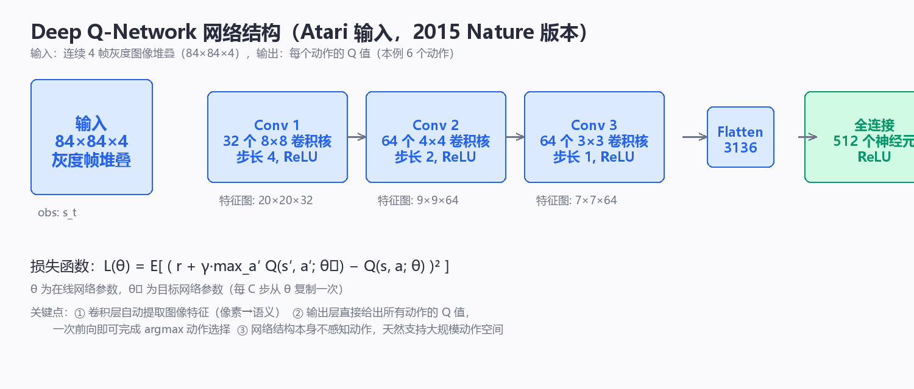
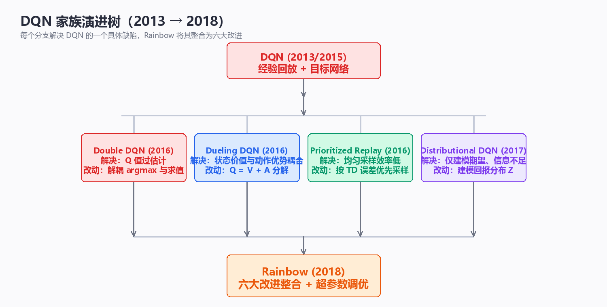

# 值函数逼近与 DQN 家族（Value Approximation & DQN Family）

> 第 4 章的 SARSA、Q-Learning、TD(λ) 都是**表格型（tabular）**算法：
> 价值函数以查表方式存储，每个状态独立更新，在有限状态空间下有严格的
> 收敛保证。但表格方法有一个不可回避的天花板——**维度灾难（curse of
> dimensionality）**。状态是图像（Atari 像素）、连续向量（机器人关节角）
> 或高维组合（围棋盘面）时，表格以指数速度爆炸，绝大多数状态甚至永远
> 不会被访问。出路只有一条：用**函数逼近（function approximation）**
> 把"查表"换成"拟合"，用参数化函数 $V_w(s)$、$Q_w(s,a)$ 在有限参数下
> 表示任意大规模的价值函数，并通过参数共享实现**泛化（generalization）**。
> 本章先建立线性值函数逼近的理论地基（特征表示、半梯度 TD、收敛性质），
> 再进入深度强化学习的开山之作 DQN（Deep Q-Network）：CNN 网络结构、
> 经验回放与目标网络两大稳定机制、完整训练流程，随后展开 Double DQN、
> Dueling DQN、Prioritized Replay、Rainbow 等整个 DQN 家族，最后讨论
> deadly triad（函数逼近 + 自举 + off-policy）带来的收敛性挑战，并以一个
> 纯 NumPy 实现的 GridWorld DQN 实验收尾。全文假设读者已掌握第 2~4 章
> （DP / MC / TD）的内容；所有代码均为可运行的 Python 3 + NumPy 实现，
> 不依赖任何深度学习框架。

---

## 一、从表格到函数逼近

### 1.1 维度灾难：表格方法的极限

表格型方法把价值函数存为一张表：状态价值是 $|S|$ 维向量，动作价值是
$|S| \times |A|$ 矩阵。表的大小随状态空间**线性**增长，而状态空间本身
通常随维度**指数**增长：

$$N = k^d$$

其中 $d$ 是状态表示的维度，$k$ 是每个维度的取值个数。几个具体量级：

| 任务 | 状态表示 | 状态空间量级 | 表格可行性 |
|------|---------|-------------|-----------|
| 4×4 GridWorld | 2 维离散坐标 | $16$ | 完全可行 |
| 20×20 迷宫 | 2 维离散坐标 | $400$ | 可行 |
| 机器人关节控制 | 6 维连续向量 | 无穷（连续） | **不可行** |
| 围棋 | 19×19 棋盘 | $10^{170}$ 量级 | **不可行** |
| Atari 2600 游戏 | 210×160 像素 × 128 色 | $128^{33600}$ | **不可行** |

以 Atari 为例：即使把画面降到 84×84 灰度（256 色阶），状态数仍是
$256^{7056}$，远超宇宙中原子总数（约 $10^{80}$）。表格连"存下所有状态"
都做不到，更谈不上为每个状态维护独立的更新统计量。

除了容量问题，表格方法还有第二个结构性缺陷：**访问稀疏性（sparsity）**。
智能体在训练中只访问状态空间的一个极小流形，绝大多数状态从未被访问，
它们的表条目永远是初始值。这意味着表格方法**无法从已访问状态推广到
未访问状态**——每个状态都必须被单独访问足够多次才能学准。

> **核心思想**：维度灾难的本质不是"存储不够"，而是"信息不够"——经验
> 只能覆盖状态空间的极小部分。函数逼近用**参数共享**让一次经验同时
> 更新所有"相似状态"的参数，把"必须访问每个状态"变成"只需访问每个
> 状态区域"，这是它对抗维度灾难的根本机制。

### 1.2 为什么需要函数逼近：泛化

函数逼近（function approximation）把价值函数限制在一个**参数化函数族**
内：

$$V_w(s) \approx v_\pi(s), \qquad Q_w(s, a) \approx q_\pi(s, a)$$

其中 $w$ 是参数向量（线性系数或神经网络权重），参数数量**远小于**状态
数量。学习的目标不再是"填表"，而是**找一组参数 $w$ 使近似误差最小**。

函数逼近带来的三个核心收益：

1. **泛化（generalization）**：相似状态共享参数，访问 $s$ 的经验会
   改善所有与 $s$ 相似状态的估值。这是样本效率提升的根本来源；
2. **固定容量**：参数数量与状态规模解耦，内存占用不随 $|S|$ 增长；
3. **连续插值**：对连续状态空间，函数逼近天然给出连续的价值曲面，
   无需离散化。

代价是**收敛保证的丧失**：表格方法在 on-policy + 适当步长下几乎必然
收敛，而函数逼近（尤其非线性 + 自举 + off-policy 组合）可能震荡甚至
发散。这一矛盾贯穿本章全部内容。

表格方法与函数逼近的全面对比：

| 维度 | 表格方法（查表） | 函数逼近（拟合） |
|------|-----------------|-----------------|
| 参数数量 | $|S|$（或 $|S|\times|A|$），随状态空间线性增长 | 固定数量 $w$，与 $|S|$ 无关 |
| 泛化能力 | 无：未访问状态无信息 | 有：相似状态共享参数 |
| 连续状态 | 需离散化，精度受网格限制 | 天然支持，输出连续曲面 |
| 存储与计算 | 随规模线性增长，可精确存取 | 恒定，但每次更新要前向/反向计算 |
| 收敛保证 | on-policy 下严格收敛 | 视函数族与算法而定，可能发散 |
| 样本效率 | 低：每个状态须被多次访问 | 高：一次经验惠及整个状态区域 |
| 典型算法 | 表格 TD、Q-Learning、TD(λ) | 半梯度 TD、DQN 及家族 |

### 1.3 参数化价值函数：学习目标

函数逼近的"监督信号"来自哪里？值函数本身没有现成标签，标签来自
RL 自身的三种目标：

| 学习信号 | 目标公式 | 性质 |
|---------|---------|------|
| MC 目标 | $w \leftarrow w + \alpha\left[G_t - V_w(S_t)\right]\nabla_w V_w(S_t)$ | 无偏，高方差，回合结束才能用 |
| TD(0) 目标 | $w \leftarrow w + \alpha\left[R_{t+1} + \gamma V_w(S_{t+1}) - V_w(S_t)\right]\nabla_w V_w(S_t)$ | 有偏，低方差，每步可用 |
| n-step 目标 | $w \leftarrow w + \alpha\left[G_{t:t+n} - V_w(S_t)\right]\nabla_w V_w(S_t)$ | 偏差-方差可调 |

在预测问题中，衡量参数质量的标准是**加权均方误差**：

$$\overline{VE}(w) = \sum_{s \in \mathcal{S}} \mu(s)\left[v_\pi(s) - V_w(s)\right]^2$$

其中 $\mu(s)$ 是 on-policy 分布（策略 $\pi$ 下各状态被访问的稳态频率）。
注意 $\overline{VE}$ 的定义依赖未知的 $v_\pi$——函数逼近的优化是一个
**"用估计更新估计"**的过程，这正是自举（bootstrapping）在参数空间的
延伸，也是后续所有稳定性问题的根源。

### 1.4 线性 vs 非线性：两种函数族

函数逼近按 $V_w(s)$ 对 $w$ 的依赖方式分为两大类：

- **线性逼近（linear approximation）**：$V_w(s) = w^\top x(s)$，价值是
  特征向量 $x(s)$ 的线性函数；
- **非线性逼近（nonlinear approximation）**：典型如多层神经网络，
  价值是输入的复合非线性函数。

| 维度 | 线性逼近 | 非线性逼近（神经网络） |
|------|---------|----------------------|
| 表示能力 | 限于特征的线性组合，受特征质量制约 | 通用近似定理保证可逼近任意连续函数 |
| 特征工程 | 依赖人工设计特征（瓦片编码、RBF、傅里叶等） | 端到端学习，特征由网络自动提取 |
| 收敛保证 | on-policy 半梯度 TD 可证明收敛到 TD 不动点 | 无一般性保证，需工程手段稳定 |
| 训练稳定性 | 高：目标函数通常是凸的 | 低：非凸优化 + 自举易震荡 |
| 参数数量 | $d$（特征维度） | 可达数百万 |
| 梯度计算 | $\nabla_w V_w(s) = x(s)$，解析简单 | 反向传播（backpropagation） |
| 典型场景 | 经典 RL 教学、线性控制、大规模推荐 | Atari、围棋、机器人等大规模任务 |

> **核心思想**：线性与非线性不是"谁更好"的关系，而是**理论完备性与
> 表示能力之间的取舍**。线性方法有收敛定理背书，但表达力受限于特征；
> 神经网络表达力强，却把收敛问题从"数学"移交给了"工程"。DQN 的贡献
> 之一，就是用一套工程机制（回放 + 目标网络）让非线性逼近在实践中
> 变得可用。

### 1.5 表格还是函数逼近：工程决策指南

| 场景 | 推荐方案 | 理由 |
|------|---------|------|
| 状态可穷举（$10^6$ 量级内）且被频繁访问 | 表格方法 | 有严格收敛保证，实现简单，无特征工程负担 |
| 状态空间大但低维连续、结构已知 | 线性逼近（瓦片编码 / RBF） | 收敛有界，单次更新开销极小 |
| 状态是高维原始输入（图像、音频） | 非线性深度网络 | 特征自动学习，表示能力强 |
| 实时性要求极高（嵌入式控制） | 线性逼近 | 前向计算只有一次矩阵乘法 |
| 离线训练 + 大规模仿真（游戏、机器人） | 深度网络 + 经验回放 | 样本效率与容量优势明显 |

几点工程经验：

1. 表格与函数逼近并非互斥——大规模问题常采用**分层策略**：函数逼近
   提供全局粗估值，表格（或细粒度特征）在关键局部区域精修；
2. 选择函数族时先问"**状态结构是什么**"：离散 ID 用 one-hot/embedding，
   连续低维用瓦片编码，原始像素用 CNN，序列用 RNN/Transformer——
   特征化方式必须匹配状态结构，而非一味追求更深的网络；
3. 判断"该不该上深度 RL"的实用标准：**线性基线（如线性 Q-Learning +
   瓦片编码）是否已经够用**。大量实际任务中线性基线已接近上限，
   此时深度网络带来的只是边际收益和大量调参成本。

---

## 二、线性值函数逼近

### 2.1 特征表示（Feature Representation）

线性逼近的第一步是把状态 $s$ 映射为**特征向量（feature vector）**
$x(s) = (x_1(s), x_2(s), \ldots, x_d(s))^\top \in \mathbb{R}^d$，然后：

$$V_w(s) = w^\top x(s) = \sum_{i=1}^{d} w_i \, x_i(s)$$

特征的选择直接决定表示能力。常用特征构造方法：

| 特征类型 | 定义 | 特点 | 适用场景 |
|---------|------|------|---------|
| one-hot 编码 | $x_i(s) = \mathbf{1}\{s = s_i\}$ | 每个状态一个特征，等价于查表；无泛化 | 状态可穷举的小规模问题 |
| 多项式特征 | 状态分量的幂与交叉项 $s_1^2, s_1 s_2, \ldots$ | 全局光滑，能拟合非线性关系 | 低维连续状态 |
| 傅里叶特征 | $\cos(\pi c^\top s)$，$c$ 为频率向量 | 频率分解，基函数正交性好 | 周期/平滑价值函数 |
| 径向基函数（RBF） | $\exp\left(-\frac{\|s - c_i\|^2}{2\sigma^2}\right)$ | 局部响应，每个基函数只影响局部区域 | 中低维连续状态 |
| 瓦片编码（Tile Coding） | 多套偏移网格的 one-hot 叠加 | 局部泛化 + 计算高效 + 可增量式 | 经典 RL 连续状态的标准选择 |

瓦片编码值得多说一句：它用 $k$ 套互相偏移的网格覆盖状态空间，每个状态
同时落在 $k$ 个"瓦片"上，特征向量为这 $k$ 个瓦片的 one-hot 叠加。
相邻状态共享大部分瓦片 → 获得**局部泛化**；瓦片数量决定分辨率与
泛化粒度的权衡。它是深度学习流行之前连续状态 RL 的事实标准。

### 2.2 半梯度 TD 更新（Semi-gradient TD）

把表格 TD(0) 的更新对象从"表条目"换成"参数 $w$"，得到线性半梯度
TD(0)：

$$
\delta_t = R_{t+1} + \gamma V_w(S_{t+1}) - V_w(S_t)
$$

$$
w \leftarrow w + \alpha \, \delta_t \, \nabla_w V_w(S_t)
$$

线性情况下 $\nabla_w V_w(S_t) = x(S_t)$，展开为：

$$
\boxed{\; w \leftarrow w + \alpha \left[ R_{t+1} + \gamma w^\top x(S_{t+1}) - w^\top x(S_t) \right] x(S_t) \;}
$$

**为什么叫"半梯度"（semi-gradient）？** 完整的梯度下降要求对目标
$\frac{1}{2}\left[v_\pi(S_t) - V_w(S_t)\right]^2$ 求梯度。但 TD 目标
$R_{t+1} + \gamma V_w(S_{t+1})$ 本身也依赖 $w$——严格求导应包含
$\nabla_w V_w(S_{t+1})$ 项。半梯度把 TD 目标当作**常数**处理，只对
$V_w(S_t)$ 求导，丢弃了 $\gamma \nabla_w V_w(S_{t+1})$ 这一项。

| 更新方式 | 对目标的处理 | 性质 |
|---------|-------------|------|
| 完整梯度（residual gradient） | 对 $V_w(S_{t+1})$ 也求导 | 收敛到贝尔曼误差最小解，但收敛慢、可能收敛到错误解 |
| **半梯度** | 目标当常数，只对 $V_w(S_t)$ 求导 | 表格型下退化为标准 TD(0)，收敛快，on-policy 下收敛到 TD 不动点 |
| MC 梯度 | 目标 $G_t$ 不含 $w$，天然是完整梯度 | 无偏，高方差 |

> **核心思想**：半梯度是"丢弃一项梯度"换来的稳定性与速度。它不最小化
> 任何显式目标函数，却在实际中表现更好——因为完整梯度会同时移动
> "目标端"，相当于在两个方向上拉扯参数。半梯度固定目标、只移动
> 预测端，本质是**自举的工程化妥协**。

### 2.3 收敛性质：什么情况下有保证

线性函数逼近 + 半梯度 TD 的收敛理论是经典 RL 最漂亮的结论之一，
同时也是 off-policy 灾难的开始：

| 设置 | 算法 | 收敛性结论 |
|------|------|-----------|
| 表格型 + on-policy | TD(0)、SARSA | 以概率 1 收敛到真值 $v_\pi$ |
| 表格型 + off-policy | Q-Learning | 以概率 1 收敛到 $q_*$（有限状态、GLIE 探索） |
| 线性 + on-policy | 半梯度 TD(0) | 收敛到 **TD 不动点** $w_\infty$ |
| 线性 + off-policy | 半梯度 TD(0) | **可能发散**（Baird 反例，见第 7 章） |
| 非线性 + 任意 | 半梯度 TD | 无一般性保证 |

on-policy 线性半梯度 TD(0) 的收敛结论有精确表述：$w_t$ 收敛到 TD
不动点 $w_\infty$，且其渐近均方误差有上界：

$$
\overline{VE}(w_\infty) \le \frac{1}{1 - \gamma} \min_w \overline{VE}(w)
$$

即：线性半梯度 TD 找到的解，其误差不超过**最优线性解误差的
$\frac{1}{1-\gamma}$ 倍**。当 $\gamma$ 接近 1 时这个界变松，但至少保证
**不发散**。这个"有界但不最优"的结论，与非线性 + off-policy 下的
"可能彻底发散"形成鲜明对比。

### 2.4 查表法 = one-hot 特例

表格方法其实是线性函数逼近的**特例**：取特征为 one-hot 编码
$x(s) = e_s$（第 $s$ 位为 1 的单位向量），则：

$$V_w(s) = w^\top e_s = w_s$$

每个状态恰好对应一个独立参数 $w_s$，更新退化为：

$$w_s \leftarrow w_s + \alpha\left[R_{t+1} + \gamma w_{s'} - w_s\right]$$

这正是表格 TD(0)。因此本章的所有分析都**向下兼容**第 4 章：表格方法
的一切结论是线性逼近在"每状态一个特征"下的特例。反过来说，任何
线性逼近都可以看作"在特征空间里做表格方法"——特征定义了状态空间的
**压缩表示**，泛化就发生在压缩丢失信息的那个维度上。

### 2.5 代码：线性半梯度 TD(0) 预测

用第 4 章的随机游走环境（5 个非终止状态，两端终止）对比三种特征：
one-hot（= 表格 TD）、RBF 特征（泛化）。真值
$v_\pi = [1/6, 2/6, 3/6, 4/6, 5/6]$。

```python
import numpy as np

class RandomWalk:
    """5 个非终止状态 A-E，左右两端为终止（左端奖励 0，右端奖励 +1）"""
    def __init__(self, n=5):
        self.n = n
        self.s = None
    def reset(self):
        self.s = self.n // 2          # 从中间状态 C 出发
        return self.s
    def step(self, a):
        ns = self.s + np.random.choice([-1, 1])
        if ns < 0:
            return 0, 0.0, True       # 左端终止：奖励 0
        if ns >= self.n:
            return 0, 1.0, True       # 右端终止：奖励 +1
        self.s = ns
        return self.s, 0.0, False

def onehot_features(s, n):
    """one-hot 特征：等价于表格方法"""
    x = np.zeros(n)
    x[s] = 1.0
    return x

def rbf_features(s, n, centers=None, sigma=0.5):
    """RBF 特征：以每个状态为高斯中心，产生平滑的局部响应"""
    if centers is None:
        centers = np.arange(n)
    return np.exp(-(s - centers) ** 2 / (2 * sigma ** 2))

def semi_gradient_td(env, feature_fn, episodes=200, alpha=0.1, gamma=1.0):
    d = len(feature_fn(0, env.n))
    w = np.zeros(d)
    for _ in range(episodes):
        s = env.reset(); done = False
        while not done:
            s2, r, done = env.step(0)
            x_s  = feature_fn(s,  env.n)
            x_s2 = feature_fn(s2, env.n) if not done else np.zeros(d)
            delta = r + gamma * (w @ x_s2) - (w @ x_s)
            w += alpha * delta * x_s          # 半梯度更新：w ← w + α·δ·x(s)
            s = s2
    return w

true_v = np.array([1, 2, 3, 4, 5]) / 6.0
np.random.seed(42)

# 1) one-hot 特征：应复现表格 TD(0) 的结果
w1 = semi_gradient_td(RandomWalk(), onehot_features, episodes=100, alpha=0.1)
print("one-hot 特征  V:", [f"{v:.3f}" for v in w1])
print("表格 TD(0) 真值:", [f"{v:.3f}" for v in true_v])

# 2) RBF 特征：参数更少（5 个），靠泛化逼近同一真值
w2 = semi_gradient_td(RandomWalk(), rbf_features, episodes=100, alpha=0.1)
V_rbf = np.array([w2 @ rbf_features(s, 5) for s in range(5)])
print("RBF 特征     V:", [f"{v:.3f}" for v in V_rbf], " (参数 w 只有 5 个)")

# 预期输出（np.random.seed(42) 已固定，可复现）:
# one-hot 特征  V: ['0.128', '0.249', '0.432', '0.682', '0.826']
# 表格 TD(0) 真值: ['0.167', '0.333', '0.500', '0.667', '0.833']
# RBF 特征     V: ['0.152', '0.266', '0.433', '0.633', '0.811']  (参数 w 只有 5 个)
```

代码要点：

1. **半梯度更新** `w += alpha * delta * x_s` 与 2.2 节公式逐项对应，
   终止状态的特征向量取零向量（$V_w(\text{终止}) = 0$）；
2. **one-hot 特征**下每个状态一个独立参数，更新互不干扰，等价于
   表格 TD(0)，但 100 回合内只收敛到近似值（与第 4 章结论一致）；
3. **RBF 特征**下 5 个参数同时服务所有状态：访问 $C$ 的经验通过
   高斯核的邻近性同时改善 $B$、$D$ 的估值——这就是泛化，也是
   RBF 版本收敛更接近真值的原因（信息在状态间流动）。

> **注意**：线性函数逼近虽然理论优美，但特征工程是硬伤——瓦片编码、
> RBF 都需要人工设计且在高维空间失效。深度学习取代线性逼近的根本原因，
> 不是"非线性更强"，而是**特征可以自动从原始输入学出来**。这正是
> 本章第 3 节 DQN 做的事情。

---

## 三、DQN 开山之作

### 3.1 背景：从经典 RL 到深度 RL 的跃迁

2013 年 Mnih 等人发表《Playing Atari with Deep Reinforcement Learning》，
2015 年在 Nature 发表《Human-level control through deep reinforcement
learning》。这是深度强化学习（Deep RL）的奠基工作：一个**网络结构固定、
不针对任何游戏定制**的智能体，仅凭原始像素帧和奖励信号，在 49 个
Atari 2600 游戏中达到超越人类专家的水平（2015 版为 57 个游戏）。

DQN 之前，"Q-Learning + 深度网络"被认为不可行：第 4 章的 Q-Learning
换成非线性函数逼近后，训练几乎必然震荡或发散（deadly triad，见本章
第 7 节）。DQN 的贡献不是新的学习原理，而是**两个工程机制**让深度
Q-Learning 第一次稳定可用：

1. **经验回放（experience replay）**：打破样本间的时序相关性；
2. **目标网络（target network）**：冻结 TD 目标，抑制自举的自我强化。

其余部分（$\epsilon$-greedy、Q-Learning 更新、贝尔曼方程）都是第 4 章
的直接继承。理解 DQN 的关键，是分清"哪些是旧思想、哪些是新机制"。

### 3.2 网络结构：CNN 处理 Atari 像素

DQN 的输入不是单个画面，而是**最近 4 帧灰度图的堆叠**（84×84×4）——
单帧无法区分运动方向，帧堆叠把"速度/方向"编码进状态表示。网络主体是
三层卷积（convolutional layer）+ 两层全连接：

```
输入: 最近 4 帧灰度图堆叠 (84 × 84 × 4)
   │
   ▼
┌────────────────────────────────────────────────────────┐
│ Conv1: 32 个 8×8 卷积核, stride=4, ReLU    → 20×20×32  │
│ Conv2: 64 个 4×4 卷积核, stride=2, ReLU    →  9×9×64   │
│ Conv3: 64 个 3×3 卷积核, stride=1, ReLU    →  7×7×64   │
│ 展平 (flatten)                                        │
│ FC: 512 个神经元, ReLU                     → 512      │
│ 输出层: |A| 个线性单元（无激活）            → Q(s,·)   │
└────────────────────────────────────────────────────────┘
```



输出层的设计有一个关键决策：**输出层为每个动作输出一个 Q 值**
$Q_w(s, a)$，而不是"输入 (s, a) 对、输出单个 Q 值"。原因：

| 设计 | 一次前向 | $\arg\max_a Q(s,a)$ | 适用 |
|------|---------|---------------------|------|
| 输出全部动作的 Q（DQN 方案） | 得到 $|A|$ 个 Q 值 | 一次前向即可 | 离散、动作数少的任务 |
| 输入 (s,a) 输出单个 Q | 只得到 1 个 Q 值 | 需 $|A|$ 次前向 | 连续动作（配合采样） |

Atari 每个游戏的动作数通常 4~18 个，输出全部动作的方案让贪心动作选择
从"18 次前向"降到"1 次前向"，且共享特征提取器。

### 3.3 为什么用 CNN

卷积网络（Convolutional Neural Network）天然适配像素输入：

1. **局部感受野**：卷积核只看局部邻域，符合图像"邻近像素相关"的先验；
2. **参数共享**：同一卷积核滑过整幅图像，参数量远小于全连接层
   （84×84×4 全连接到 512 单元需要约 1450 万参数，三层卷积仅约
   4.4 万参数）；
3. **平移等变性**：物体在画面中移动，其局部特征响应不变，利于
   "乒乓球的球拍位置"这类空间不变特征的提取。

### 3.4 输入预处理流程

原始 210×160 彩色帧 → 网络输入 84×84×4 灰度帧，中间经过四步：

```
210×160 RGB ──► 灰度化 ──► 下采样到 84×84 ──► 取两帧逐像素 max（消闪）
   ──► 最近 4 帧堆叠（84×84×4）──► 网络
```

| 预处理 | 作用 |
|--------|------|
| 灰度化 | 颜色对游戏策略几乎无信息量，降为单通道减少计算 |
| 下采样到 84×84 | 降低分辨率，控制输入规模 |
| 两帧逐像素取 max | Atari 显示有闪烁（隔行渲染），取 max 消除闪烁伪影 |
| 最近 4 帧堆叠 | 编码运动信息（方向、速度） |
| 跳帧（frame skipping） | 每 4 帧选一次动作并重复执行，降低决策频率 |
| **奖励裁剪**（reward clipping） | 奖励裁剪到 $[-1, +1]$：不同游戏奖励量纲差异巨大（乒乓 ±1，拳击 ±100），裁剪统一梯度尺度 |

奖励裁剪是一个容易被低估的关键细节：它把"学习最优策略"与"学习
奖励的量纲"解耦，让同一套超参数（学习率等）跨游戏通用。

### 3.5 实验结果与历史意义

Nature 2015 论文在 49 个 Atari 游戏中训练 DQN，超参数对所有游戏
**完全相同**（2015 版扩展到 57 个游戏）。结果要点：

| 结果 | 数据 |
|------|------|
| 人类水平 | 49 个游戏中 29 个超过人类专家（2015 版 57 个中 43 个） |
| 与既有方法对比 | 显著超过此前所有学习方法（含线性逼近变体） |
| 训练成本 | 单个游戏约 3800 万帧，训练数天（当时硬件） |

论文的两组关键消融直接验证了本章第 4 节两个机制的必要性：

| 消融 | 现象 | 结论 |
|------|------|------|
| 去掉经验回放（改在线更新） | 多数游戏分数大幅下降 | 回放是稳定训练的必要组件 |
| 去掉目标网络（目标用在线网络计算） | 部分游戏训练发散 | 目标网络抑制自举失稳 |
| 用线性逼近替代 CNN | 平均分数显著低于 CNN 版本 | 特征自动学习带来实质收益 |

历史意义：DQN 是第一个"**输入原始感官信号、输出动作、跨任务通用**"
的深度 RL 系统。它的"卷积网络 + 经验回放 + 目标网络"三件套成为
后续所有深度 value-based 方法的标准骨架，并直接启发了 DDPG、TD3、
SAC 等连续控制算法（第 7 章）——后者沿用回放与目标网络，只是把
$\arg\max$ 换成了策略网络。

---

## 四、DQN 两大神器：经验回放与目标网络

### 4.1 经验回放（Experience Replay）

**问题：样本相关性。** 在线 TD 学习按时间顺序消费经验，相邻样本
$(s_t, a_t, r_t, s_{t+1})$ 与 $(s_{t+1}, a_{t+1}, r_{t+1}, s_{t+2})$
高度相关（自相关）。用强相关的 mini-batch 做梯度下降，更新方向彼此
抵消，等效于在高方差噪声中优化，训练震荡。

**问题：样本效率。** 在线学习每条经验只用一次即丢弃。而一条
"到达宝藏"的稀有经验可能价值极高，值得反复学习。

**问题：非平稳数据分布。** 策略在变、价值估计在变，在线数据的分布
也在变，违背了监督学习对数据 i.i.d. 的假设。

**方案：** 维护一个经验池（replay buffer）$\mathcal{D}$，把每条经验
$(s, a, r, s', \text{done})$ 存入；训练时从池中**均匀随机采样**
mini-batch。这同时解决三个问题：随机采样打断时序相关性（近似 i.i.d.）、
每条经验可被多次使用（样本效率）、训练分布相对稳定（平稳性）。

```python
import numpy as np
from collections import deque

class ReplayBuffer:
    """经验回放缓冲：环形队列（cap 条），均匀随机采样 mini-batch"""
    def __init__(self, capacity):
        self.buf = deque(maxlen=capacity)   # 超容量自动丢弃最旧经验

    def push(self, s, a, r, s2, done):
        """存入一条经验 (状态, 动作, 奖励, 下一状态, 是否终止)"""
        self.buf.append((s, a, r, s2, done))

    def sample(self, batch_size):
        """均匀随机采样 batch_size 条经验，按字段拆成数组返回"""
        idx = np.random.choice(len(self.buf), batch_size, replace=False)
        batch = [self.buf[i] for i in idx]
        s    = np.array([e[0] for e in batch], dtype=float)
        a    = np.array([e[1] for e in batch], dtype=int)
        r    = np.array([e[2] for e in batch], dtype=float)
        s2   = np.array([e[3] for e in batch], dtype=float)
        done = np.array([e[4] for e in batch], dtype=bool)
        return s, a, r, s2, done

    def __len__(self):
        return len(self.buf)

# 预期输出: 无（类定义）；第 8 章实验将直接使用本类
```

注意：均匀采样是**uniform replay**，即"不加选择地随机回放"。它的局限
是忽略了经验之间的信息量差异——这正是本章第 6 节 Prioritized Replay
的改进动机。

> **核心思想**：经验回放把"强化学习问题"改造成"监督学习问题"——数据
> 从"策略实时产生的时序流"变成"从固定池中的均匀抽样"。这一改造牺牲了
> 在线性（off-policy 训练成为必需），换来了深度学习的稳定性前提。

### 4.2 目标网络（Target Network）

**问题：追着移动的靶子。** DQN 的 TD 目标是：

$$y_t = r + \gamma \max_{a'} Q_w(s', a')$$

目标 $y_t$ 依赖当前参数 $w$。每步更新 $w$，所有目标 $y_t$ 也随之
移动——优化目标本身非平稳。梯度下降在"自己移动的靶子"上优化，
容易震荡甚至发散。

**方案：** 维护**两份参数**：在线网络 $Q_w$（负责选动作、被训练）与
目标网络 $Q_{w^-}$（负责计算 TD 目标）。目标网络不参与训练，只是
每 $C$ 步（如 10000 步）把在线网络的参数**硬复制**过去：

$$y_t = r + \gamma \max_{a'} Q_{w^-}(s', a')$$

梯度只流向 $Q_w(s, a)$ 一侧，$Q_{w^-}$ 在两次复制之间保持冻结。这使
TD 目标在 $C$ 步内**近似恒定**，训练变成"对固定目标做监督学习"，
大幅降低自举的自我强化效应。

| 机制 | 解决的相关性 | 机制细节 |
|------|-------------|---------|
| 经验回放 | 样本间**时序**相关性 | 均匀采样打乱顺序，近似 i.i.d. |
| 目标网络 | 目标与预测的**耦合** | 冻结目标网络 $Q_{w^-}$，每 $C$ 步复制参数 |

### 4.3 硬更新 vs 软更新

DQN 原版采用**硬更新（hard update）**：每 $C$ 步整体复制
$w^- \leftarrow w$。后续算法（DDPG、TD3、SAC）常用**软更新（soft
update / Polyak averaging）**：每步做指数滑动平均
$w^- \leftarrow \tau w + (1-\tau) w^-$。

| 维度 | 硬更新（DQN 原版） | 软更新（Polyak 平均） |
|------|-------------------|----------------------|
| 更新公式 | $w^- \leftarrow w$（每 $C$ 步） | $w^- \leftarrow \tau w + (1-\tau) w^-$（每步） |
| 目标变化方式 | 阶梯式突变，周期内恒定 | 平滑渐进，每步微小移动 |
| 关键超参数 | 复制周期 $C$（Nature 取 10000） | 插值系数 $\tau$（常取 0.005） |
| 目标滞后程度 | 滞后 $C$ 步（目标陈旧但稳定） | 滞后约 $1/\tau$ 步（目标新鲜但总在动） |
| 训练稳定性 | 周期内目标恒定，稳定 | 目标缓慢漂移，需更小学习率配合 |
| 收敛速度 | 目标陈旧可能拖慢学习 | 目标跟踪更紧，通常收敛更快 |
| 典型使用者 | DQN 及家族（Double/Dueling/Rainbow） | DDPG、TD3、SAC 等连续控制算法 |

> **核心思想**：硬更新与软更新是"目标稳定性"与"目标新鲜度"之间的
> 同一个旋钮。目标越陈旧越稳定（但学得慢），越新鲜越跟手（但易震荡）。
> $C$ 与 $\tau$ 分别控制这两种更新在时间轴上的滞后尺度。

---

## 五、DQN 训练流程

### 5.1 完整循环

DQN 的完整数据流把环境交互、经验存储、离线训练、目标同步组织成
一个闭环：

```
                    ┌────────────────────────────────────┐
                    │            环境（Atari 模拟器）      │
                    └───────▲───────────────────┬────────┘
                            │ 状态 s_t          │ 动作 a_t
                            │ (84×84×4 帧堆叠)  │ (ε-greedy 采样)
                            ▼                   │
        ┌──────────────────────────┐            │
        │  经验回放缓冲 D          │◄───────────┤
        │  (s, a, r, s', done)     │  push 每条经验
        └───────────▲──────────────┘            │
                    │                            │
                    │ 每 4 步: 均匀采样 batch    │
                    │                           ▼
        ┌───────────┴──────────────┐   ┌────────────────────────┐
        │  在线网络 Q_w            │   │  目标网络 Q_{w^-}      │
        │  ① 前向: Q_w(s,a)        │   │  ② 前向: max_{a'}     │
        │  ③ 对 (y - Q_w)² 求梯度  │   │     Q_{w^-}(s',a')    │
        │  ④ SGD/Adam 更新 w       │   │                        │
        └───────────┬──────────────┘   └───────────▲────────────┘
                    │                              │
                    └── 每 C 步: w^- ← w (硬复制) ──┘
```

四个环节的分工：**环境**产生经验 → **回放池**存储并打乱经验 →
**在线网络**是唯一被训练的对象 → **目标网络**提供稳定的 TD 目标并
周期性同步。

### 5.2 损失函数与梯度

DQN 在 mini-batch 上最小化**时序差分均方误差**（TD MSE）：

$$
\mathcal{L}(w) = \mathbb{E}_{(s, a, r, s') \sim \mathcal{D}}
\left[
\left(
\underbrace{r + \gamma \max_{a'} Q_{w^-}(s', a')}_{y \; \text{（TD 目标，用冻结的 } w^- \text{ 计算）}}
- Q_w(s, a)
\right)^2
\right]
$$

对 $w$ 求梯度（目标 $y$ 视为常数，不反向传播——这是 2.2 节半梯度
思想在深度网络中的直接延续）：

$$
\nabla_w \mathcal{L}(w) =
-2\, \mathbb{E}_{(s, a, r, s') \sim \mathcal{D}}
\left[
\left(y - Q_w(s, a)\right) \nabla_w Q_w(s, a)
\right]
$$

两个实现细节：

1. **只更新选中动作的输出**：梯度 $\nabla_w Q_w(s,a)$ 只针对 batch 中
   实际执行的动作 $a$；其他动作的输出单元不产生梯度（$\arg\max$
   操作不可微，且无需微）；
2. **终止状态处理**：若 $s'$ 是终止状态，目标退化为 $y = r$
   （$V(\text{终止}) = 0$），对应伪代码中的 `if done: y = r` 分支。

实际实现常把 MSE 换成 **Huber loss**（$\delta=1$ 时对残差分段线性），
对离群 TD 误差更鲁棒：

$$
L_{\text{Huber}}(y, \hat{y}) =
\begin{cases}
\frac{1}{2}(y - \hat{y})^2, & |y - \hat{y}| \le 1 \\
|y - \hat{y}| - \frac{1}{2}, & \text{otherwise}
\end{cases}
$$

### 5.3 伪代码（Nature DQN）

```
算法: Deep Q-Network（Nature 2015 版）
──────────────────────────────────────────────────────────────
输入: 学习率 α，折扣 γ，回放容量 N，目标更新周期 C，batch 大小 B
 1. 初始化在线网络参数 w，目标网络参数 w⁻ ← w
 2. 初始化回放缓冲 D（容量 N），ε = 1.0
 3. for episode = 1, 2, ... do
 4.    重置环境，预处理得到初始帧堆叠 s
 5.    for t = 1, 2, ... do
 6.        以概率 ε 随机选动作 a；否则 a = argmax_a Q_w(s, a)
 7.        执行 a，观测奖励 r 与下一帧；预处理得到 s'
 8.        r ← clip(r, -1, 1)                     # 奖励裁剪
 9.        D.push(s, a, r, s', done)              # 存入回放池
10.        s ← s'
11.        if t 是 4 的倍数 且 |D| ≥ B:            # 每 4 步训练一次
12.            从 D 均匀采样 mini-batch (s_j, a_j, r_j, s'_j, done_j)
13.            y_j = r_j                          # 若 done_j 为真
14.            否则 y_j = r_j + γ · max_{a'} Q_{w⁻}(s'_j, a')
15.            对损失 (1/B)·Σ_j (y_j - Q_w(s_j, a_j))² 做一步梯度下降
16.        if t 是 C 的倍数: w⁻ ← w               # 硬更新目标网络
17.        if done: break
18.    ε ← max(0.1, ε - 退火步长)                 # ε 线性退火到 0.1
```

### 5.4 超参数与训练细节

Nature DQN 的超参数设置（这套参数跨 49 个游戏通用，是"通用性"的
重要体现）：

| 超参数 | 取值 | 说明 |
|--------|------|------|
| 回放容量 $N$ | 1,000,000 | 环形缓冲，满后覆盖最旧经验 |
| 探索 ε | 1.0 → 0.1 线性退火 | 前 1,000,000 帧完成退火 |
| 训练频率 | 每 4 步 | 与跳帧配合，降低计算量 |
| mini-batch 大小 $B$ | 32 | |
| 优化器与学习率 | RMSProp, 0.00025（2015）；Adam, 0.00025（2013） | 梯度裁剪到 $[-1,1]$ |
| 折扣因子 $\gamma$ | 0.99 | |
| 目标网络更新周期 $C$ | 10,000 步 | 硬复制 |
| 奖励裁剪 | $\text{clip}(r, -1, 1)$ | 统一量纲 |
| 跳帧 | 4 帧 | 每 4 帧选一次动作 |
| 热身（warm-up） | 前 50,000 步只采样不训练 | 先填满回放池 |

> **核心思想**：DQN 的训练循环是"第 4 章 Q-Learning 骨架 + 回放池 +
> 目标网络"的组合。理解它的最好方式不是背伪代码，而是追踪一条经验
> 的完整生命周期：**产生（环境）→ 存储（回放池）→ 采样（均匀随机）
> → 打目标（目标网络）→ 学梯度（在线网络）→ 同步（硬复制）**。

---

## 六、DQN 家族演进

DQN 之后三年内出现了一系列针对性改进，每个改进解决一个具体缺陷，
最终在 Rainbow（2018）中集成。理解这个家族的正确姿势是：**先明确
每个算法解决什么问题，再看它改动了训练循环的哪个环节**。

### 6.1 Double DQN：对抗过估计

**问题：过估计（overestimation）。** 第 4 章 5.2 节已经讲过最大化偏差：
$\mathbb{E}[\max X] \ge \max \mathbb{E}[X]$。Q-Learning 的
$\max_{a'} Q(s', a')$ 在估计噪声存在时系统性**高估**价值。深度版本
更严重：函数逼近误差 + 自举让过估计在训练中**自我放大**——高估的
动作被更频繁地选择，其高估又被进一步学习，形成恶性循环，最终导致
策略退化（选择实际劣质的动作）。

**方案：解耦"选择"与"评估"。** 第 4 章的 Double Q-Learning 用两套
独立 Q 表；Double DQN（van Hasselt et al., 2016）发现 DQN 已有的
**两个网络**（在线 + 目标）恰好可以承担这个角色，无需额外参数：

| 算法 | TD 目标 $y$ | 谁选动作 | 谁评估 |
|------|------------|---------|--------|
| DQN | $r + \gamma \max_{a'} Q_{w^-}(s', a')$ | 目标网络（max 内含选择） | 目标网络 |
| **Double DQN** | $r + \gamma Q_{w^-}\!\left(s', \arg\max_{a'} Q_w(s', a')\right)$ | **在线网络** $Q_w$ | **目标网络** $Q_{w^-}$ |

展开对比：

$$
y^{\text{DQN}} = r + \gamma \max_{a'} Q_{w^-}(s', a')
$$

$$
\boxed{\; y^{\text{DDQN}} = r + \gamma \, Q_{w^-}\!\left(s', \arg\max_{a'} Q_w(s', a')\right) \;}
$$

在线网络 $Q_w$ 选择"它认为最优"的动作，目标网络 $Q_{w^-}$ 对该动作
给出**独立的估值**。两个网络的估计误差近似独立，过估计的正偏差被
期望上抵消。实现改动极小（一行公式），在 Atari 上估值更准、分数
普遍提升，且对 DQN 是**免费午餐**——不增加任何计算或超参数。

> **核心思想**：过估计的根源是"用同一个估计器既选择又评估"。Double
> DQN 的洞察是 DQN 本来就有两个网络，让它们分工即可——这也是
> "最大化偏差"理论（第 4 章）在深度 RL 中的直接应用。

### 6.2 Dueling DQN：优势分解

**问题：价值被"动作无关"的部分主导。** 在很多状态下，动作选择对
回报几乎没有影响（例如 Atari 游戏里屏幕上没有敌人时，左右移动都
一样）。此时 $Q(s,a)$ 中"状态价值" $V(s)$ 占主导，而"动作优势"
$A(s,a) = Q(s,a) - V(s)$ 很小。标准 DQN 为每个动作分别估计 Q 值，
把大量容量浪费在重复学习 $V(s)$ 上。

**方案：双头分解。** Dueling DQN（Wang et al., 2016）把网络输出层
拆成两个头：状态价值头 $V(s)$ 与优势头 $A(s,a)$，再合成 Q 值：

$$
Q(s, a) = V(s) + A(s, a)
$$

直接相加存在**可辨识性问题**：$V$ 与 $A$ 的分解不唯一（给 $V$ 加
常数、给 $A$ 减同一常数，Q 不变）。强制优势头对动作取零均值：

$$
Q(s, a) = V(s) + \left[ A(s, a) - \max_{a'} A(s, a') \right]
$$

实际实现常用均值形式（训练更稳）：

$$
Q(s, a) = V(s) + \left[ A(s, a) - \frac{1}{|\mathcal{A}|}\sum_{a'} A(s, a') \right]
$$

| 维度 | 标准 DQN | Dueling DQN |
|------|---------|-------------|
| 输出头 | 单一 Q 头，$|A|$ 个单元 | 双头：$V$（1 个单元）+ $A$（$|A|$ 个单元） |
| 学习内容 | 每个动作独立学 Q | $V$ 头学状态价值，$A$ 头学相对优势 |
| 动作无关状态 | 各动作重复学习相同 $V$ | $V$ 头一次性捕获，容量高效 |
| 理论保证 | — | 与 DQN 同框架，无额外假设 |
| 效果 | 基线 | 动作冗余场景（如 Enduro）显著提升 |

### 6.3 Prioritized Experience Replay：按重要性采样

**问题：均匀采样浪费算力。** 回放池里不同经验的"学习价值"差异巨大：
TD 误差 $|\delta|$ 大的经验（如"意外发现宝藏"）离当前估计最远，
信息量最大；误差接近零的经验（已被学透）几乎不提供新信息。均匀采样
对两者一视同仁，导致高频重放"已学透"的经验。

**方案：按 TD 误差优先采样。** Prioritized Replay（Schaul et al.,
2016）给每条经验 $i$ 分配采样概率：

$$
P(i) = \frac{p_i^{\alpha}}{\sum_j p_j^{\alpha}}, \qquad
p_i = |\delta_i| + \epsilon
$$

其中 $\alpha \in [0, 1]$ 控制优先程度（$\alpha = 0$ 退化为均匀采样），
$\epsilon$ 是防止零概率的小常数。为稳定性常用**排名版**：
$p_i = 1/\text{rank}(i)$（按 $|\delta_i|$ 降序排名），对离群误差更鲁棒。

**偏差修正：重要性采样权重。** 优先采样改变了数据分布（不再是均匀），
引入估计偏差。用重要性采样（importance sampling, IS）权重修正：

$$
w_i = \left(N \cdot P(i)\right)^{-\beta}
$$

$\beta$ 从 0.4 线性退火到 1.0——训练初期允许一定偏差（加速学习），
后期 $\beta \to 1$ 完全修正（保证收敛）。权重在梯度更新时乘到损失上，
且归一化（除以 $\max_i w_i$）保持梯度尺度稳定。

| 环节 | 均匀回放（DQN） | 优先回放（PER） |
|------|----------------|----------------|
| 采样分布 | 均匀 | $P(i) \propto |\delta_i|^{\alpha}$（或排名） |
| 新经验入池 | 无特殊处理 | $|\delta|$ 未知，给最大优先级（保证被采样） |
| 误差更新 | 无 | 每次训练后更新对应经验的 $p_i$（或排名） |
| 分布偏差 | 无 | 用 IS 权重 $w_i$ 修正 |
| 额外超参数 | 无 | $\alpha$、$\beta$、$\epsilon$ |
| 效果 | 基线 | 样本效率与最终分数显著提升 |

### 6.4 其他三个组件

**Multi-step Learning（n 步目标）。** 把单步 TD 目标换成 n 步回报
（第 4 章 6.2 节）：

$$
y = \sum_{k=0}^{n-1} \gamma^k r_{t+k} + \gamma^n \max_{a'} Q_{w^-}(s_{t+n}, a')
$$

n 步目标让奖励信号沿轨迹传播得更快，加速信用分配；代价是偏差上升、
且 off-policy 下目标不再严格正确（行为策略与目标策略在 n 步内可能
不一致）。$n = 3$ 左右是 Atari 上的经验最优。

**Distributional RL（分布 RL）。** 标准 DQN 只预测回报的**期望**
$Q(s,a)$，把分布的丰富信息压缩成一个标量。Distributional DQN
（C51，Bellemare et al., 2017）改为预测回报的**完整分布**：把价值
轴离散成 51 个桶，网络输出每个桶上的概率，用分布间距离（如 KL
散度）做损失。随机转移下分布比期望稳定得多，且期望可从分布恢复
（$\mathbb{E}[Z] = \sum_i z_i p_i$）。**为什么有效**：期望运算会
"破坏"非对称分布的信息，而分布学习保留了不确定性结构，实际表现
更强、更稳。

**Noisy Nets（噪声网络）。** $\epsilon$-greedy 的探索是"盲目随机"，
且 $\epsilon$ 退火是手动设定的。Noisy Nets（Fortunato et al., 2018）
把探索**参数化**：网络权重叠加可学习的高斯噪声
$w = \mu + \sigma \odot \epsilon$，噪声幅度 $\sigma$ 由梯度学习。
网络会自动学会"什么时候该探索、探索多大"——训练初期噪声大（探索），
后期噪声被压小（利用），探索随训练**自适应衰减**，无需 $\epsilon$
调度。

### 6.5 Rainbow：七组件集成

Rainbow（Hessel et al., 2018）把上述六个组件与 DQN 本身集成：
**DDQN + Dueling + Prioritized Replay + Multi-step + Distributional
(Distributional DQN) + Noisy Nets**，共六个改进 + 基线 DQN。论文做了
系统的**消融实验（ablation study）**：逐一移除组件，确认每个组件
独立有效、且组件间有正交互作用（移除任一组件都会掉分，但不同组件
的贡献因游戏而异）。

| 组件 | 解决的问题 | 在 Rainbow 中的角色 |
|------|-----------|---------------------|
| Double DQN | 过估计 | 解耦动作选择与评估 |
| Dueling | 动作无关状态下的容量浪费 | $V$ / $A$ 双头分解 |
| Prioritized Replay | 均匀采样低效 | 按 $|\delta|$ 优先 + IS 修正 |
| Multi-step | 单步信用分配慢 | $n$ 步回报加速传播 |
| Distributional | 只学期望丢失分布信息 | 51 桶分布输出 + KL 损失 |
| Noisy Nets | $\epsilon$-greedy 探索不自适应 | 参数化噪声探索 |

Rainbow 在 Atari 57 个游戏上的平均分与样本效率远超单一组件，是
2018 年 value-based 方法的 SOTA，也是 DQN 家族演进的终点站
（之后 value-based 研究转向分布式与离线 RL）。



### 6.6 DQN 家族演进总览表

| 算法（年份） | 解决的问题 | 核心改动 | 效果 |
|------|-----------|---------|------|
| DQN（2013/2015） | 深度网络 + Q-Learning 不稳定 | 经验回放 + 目标网络 + CNN | 首个 Atari 人类水平智能体 |
| Double DQN（2016） | max 导致系统性过估计 | 在线网络选动作、目标网络估值 | 估值更准，分数普遍提升，零额外成本 |
| Dueling DQN（2016） | 动作无关状态浪费容量 | $Q = V + A$ 双头分解 | 动作冗余游戏显著提升 |
| Prioritized Replay（2016） | 均匀采样忽略信息量差异 | 按 $|\delta|^{\alpha}$ 采样 + IS 权重 | 样本效率大幅提升 |
| Multi-step（2017 用于 DQN） | 单步目标信用传播慢 | $n$ 步回报目标 | 加速学习，$n=3$ 最优 |
| Distributional DQN（2017） | 期望压缩丢失分布信息 | 输出回报分布（51 桶）+ KL 损失 | 更稳更强 |
| Noisy Nets（2018） | $\epsilon$-greedy 探索不自适应 | 权重加可学习噪声 | 探索自适应，无需 $\epsilon$ 调度 |
| Rainbow（2018） | 单一改进各有短板 | 六组件集成 + 消融验证 | 当时 value-based SOTA |

> **核心思想**：DQN 家族演进的每一步都是"**定位一个具体缺陷 → 在训练
> 循环的某个环节做最小改动**"：Double 改目标公式、Dueling 改网络结构、
> PER 改采样器、Multi-step 改目标跨度、Distributional 改输出层、
> Noisy 改探索机制。它们互不冲突、可以叠加——这正是 Rainbow 能集成的
> 原因，也是理解整个家族的纲。

---

## 七、收敛性与挑战：deadly triad

### 7.1 致命三要素（Deadly Triad）

Sutton & Barto 指出：当以下三个条件**同时**满足时，强化学习可能发散：

1. **函数逼近（function approximation）**：价值用参数化函数表示，
   而非查表；
2. **自举（bootstrapping）**：更新目标包含自身的估计
   （$r + \gamma \hat{V}(s')$ 依赖 $\hat{V}$）；
3. **off-policy 训练**：行为策略（采样数据的策略）与目标策略
   （评估/优化的策略）不一致。

三要素的缺失与收敛性的关系：

| 组合 | 缺失要素 | 收敛性 | 代表方法 |
|------|---------|--------|---------|
| 表格 + 自举 + on-policy | 函数逼近 | 以概率 1 收敛 | 表格 TD(0)、SARSA |
| 表格 + 自举 + off-policy | 函数逼近 | 收敛（有限状态 + GLIE） | Q-Learning、Double Q-Learning |
| 线性 + 自举 + on-policy | off-policy | 收敛到 TD 不动点（有界误差） | 半梯度 TD(0)（本章第 2 节） |
| 线性 + 自举 + off-policy | 无 | **可能发散**（Baird 反例） | 线性 off-policy 半梯度 TD |
| 非线性 + 自举 + off-policy | 无 | **可能发散**，无理论保证 | 原始 DQN（未加回放/目标网络时） |

> **核心思想**：第 2~4 章的所有收敛定理都建立在"至少缺一个要素"之上。
> 深度 RL（DQN 及其家族）是**三项全占**的配置——因此没有任何收敛
> 定理背书，稳定训练完全依赖工程手段。这就是"为什么 DQN 需要那么多
> 技巧"的根本答案。

### 7.2 失败模式：Baird 反例与误差自我强化

**Baird 反例（Baird's counterexample）**是线性 off-policy 半梯度 TD
发散的经典构造：一个 7 状态、2 动作的 MDP，目标策略把 6 个状态
（$s_2 \sim s_7$）映射到同一动作，行为策略则偶尔选另一个动作。在
该设置下，线性半梯度 TD(0) 的参数 $w$ **指数级发散**——即使步长
$\alpha$ 任意小。这个反例证明了：off-policy + 自举 + 函数逼近的组合
下，"半梯度"更新**不是任何目标函数的梯度下降**，可能沿错误方向
持续放大误差。

失败模式的共性机制可以归纳为**误差自我强化循环**：

```
估计误差放大价值偏差
      ▲                  │
      │                  ▼
行为策略选择被高估的动作 ──► 该动作被更频繁采样 ──► 高估被进一步学习
```

off-policy 让"被高估的动作"获得更多数据（分布偏移），自举让高估
通过 TD 目标传播到所有前驱状态，函数逼近让误差在参数空间叠加——
三者在循环中互相放大，最终数值溢出。

### 7.3 缓解手段表

| 手段 | 缓解的环节 | 作用机制 | 代表算法 |
|------|-----------|---------|---------|
| 经验回放 | 分布偏移 | 打乱时序相关性，稳定数据分布 | DQN |
| 目标网络 | 自举目标移动 | 冻结 TD 目标，切断误差即时反馈 | DQN、DDPG |
| 梯度裁剪 / Huber loss | 更新幅度失控 | 限制单步更新的梯度范数 | DQN 实现细节 |
| 双估计（Double） | 最大化偏差 | 解耦选择与评估，消除正偏差 | Double DQN、TD3 |
| 缩小 $\gamma$ | 误差传播距离 | 减少远期误差的累积放大 | 调参手段 |
| 权重衰减 / 正则化 | 参数空间失稳 | 约束参数范数，抑制爆炸 | 各类深度 RL |
| 重要性采样加权 | 分布偏移 | 修正非均匀采样的偏差 | PER、离线 RL |
| 缩小更新频率 | 目标-预测耦合 | 降低更新对数据分布的冲击 | 每 4 步训练、软更新 |

### 7.4 实践观察：为什么 DQN 在实践中稳定

严格说，"DQN 为什么在 Atari 上不发散"至今没有统一理论解释，但实践
共识指向几个因素：

1. **回放池使数据分布缓慢变化**：均匀采样让 mini-batch 近似来自
   "历史混合分布"，在线网络参数突变不会立刻反馈到采样分布；
2. **目标网络引入滞后**：TD 目标滞后 $C$ 步，误差的自我强化被
   时间延迟切断；
3. **奖励裁剪限制误差量级**：$|\delta|$ 被限制在 $O(1)$ 量级，
   梯度爆炸被结构性抑制；
4. **CNN 特征的平滑性**：卷积特征的局部性使相近状态输出相近 Q 值，
   函数逼近的"尖峰"难以形成。

这些机制都不是收敛定理，而是**经验性的稳定性工程**。理解 deadly
triad 的意义在于：当你设计新算法或调试训练发散时，第一反应应是
"我是否同时满足了三个要素？我打破了哪一个？"——而不是盲目调学习率。

---

---

## 八、综合实验：纯 NumPy DQN 玩转 GridWorld

### 8.1 实验设计

真实 Atari 环境需要模拟器与深度学习框架，无法在纯 NumPy 下复现。
本实验用**玩具环境 + 纯 NumPy 手写网络**复现 DQN 的**全部核心机制**，
保证每个组件都能被直接观察和修改：

| 组件 | 对应 DQN 原版 | 本实验实现 |
|------|--------------|-----------|
| 状态表示 | 84×84×4 像素帧（CNN 特征） | 6×6 网格的 one-hot 向量（36 维） |
| Q 网络 | 三层 CNN + 两层 FC | 两层全连接（36 → 32 → 4），手写反向传播 |
| 经验回放 | 容量 10⁶ 的环形缓冲 | 容量 20000 的环形缓冲（第 4 章 4.1 节的类） |
| 目标网络 | 每 10000 步硬复制 | 每 200 步硬复制 |
| 探索 | ε 从 1.0 线性退火到 0.1 | ε 从 1.0 指数退火到 0.05 |
| 训练频率 | 每 4 帧一次 | 每 4 步一次 |
| 优化器 | RMSProp/Adam | SGD（学习率 0.01） |

**环境定义：** 6×6 网格世界，起点 $(0,0)$、终点 $(5,5)$。动作空间
$\mathcal{A} = \{$上, 下, 左, 右$\}$，共 4 个动作。

| 事件 | 奖励 | 说明 |
|------|------|------|
| 到达终点 $(5,5)$ | $+10$ | 回合结束 |
| 试图越界（撞墙） | $-0.5$ | 位置不变 |
| 普通一步 | $-0.1$ | 鼓励最短路径 |

理论最优：从 $(0,0)$ 到 $(5,5)$ 的最短路径 10 步（5 下 + 5 右），
总回报 $10 - 0.1 \times 9 = 9.1$。学习的目标是让平均回报逼近 9.1。

### 8.2 Q 网络：NumPy 手写两层 MLP

本实验的 Q 网络是第 3 节图 5-1 网络结构的**全连接简化版**——CNN
换成两层全连接，输入从像素帧换成 one-hot 状态向量，其余机制
（前向、反向、双网络、回放）完全一致：


网络结构：`输入 36（one-hot 状态）→ 隐层 32（ReLU）→ 输出 4（Q 值）`。
手写反向传播只有三个关键公式（对 batch 中的每条样本）：

$$
h = \text{ReLU}(x W_1 + b_1), \qquad q = h W_2 + b_2
$$

$$
\frac{\partial \mathcal{L}}{\partial W_2} = h^\top g, \qquad
\frac{\partial \mathcal{L}}{\partial W_1} = x^\top \left( g W_2^\top \odot \mathbf{1}\{h > 0\} \right)
$$

其中 $g$ 是输出层梯度：**只对选中动作 $(s, a)$ 有值，其余动作置零**
（对应 5.2 节的"只更新选中动作的输出"）。

### 8.3 超参数表

| 超参数 | 取值 | 说明 |
|--------|------|------|
| 网格大小 | 6×6（36 状态） | 可改 8×8 观察维度灾难 |
| 隐层宽度 | 32 | ReLU |
| 回放容量 | 20000 | 环形缓冲 |
| mini-batch | 32 | 均匀采样 |
| 学习率 | 0.01 | SGD |
| 折扣 $\gamma$ | 0.99 | |
| ε 退火 | $1.0 \to 0.05$，每回合 ×0.995 | 指数退火 |
| 目标网络更新 | 每 200 步硬复制 | 对应原版 10000 步 |
| 训练频率 | 每 4 步 | 对应原版"每 4 帧" |
| 回合最大步数 | 100 | 防止死循环 |

### 8.4 完整可运行代码

```python
import numpy as np
from collections import deque

# ---------- 1. GridWorld 环境 ----------
class GridWorld:
    """6×6 网格世界：起点 (0,0)，终点 (5,5)。动作: 0=上 1=下 2=左 3=右"""
    def __init__(self, size=6):
        self.size = size
        self.start = (0, 0)
        self.goal = (size - 1, size - 1)
        self.s = None

    def reset(self):
        self.s = self.start
        return self._sid()

    def _sid(self):
        """状态 (x, y) → 状态编号 x*size + y"""
        x, y = self.s
        return x * self.size + y

    def step(self, a):
        x, y = self.s
        nx, ny = x, y
        if a == 0:   nx = max(0, x - 1)              # 上
        elif a == 1: nx = min(self.size - 1, x + 1)  # 下
        elif a == 2: ny = max(0, y - 1)              # 左
        else:        ny = min(self.size - 1, y + 1)  # 右
        hit_wall = (nx, ny) == (x, y)                # 试图越界
        self.s = (nx, ny)
        done = (nx, ny) == self.goal
        r = 10.0 if done else (-0.5 if hit_wall else -0.1)
        return self._sid(), r, done

# ---------- 2. 经验回放（第 4 章 4.1 节的类） ----------
class ReplayBuffer:
    """环形经验池：均匀随机采样"""
    def __init__(self, capacity):
        self.buf = deque(maxlen=capacity)
    def push(self, s, a, r, s2, done):
        self.buf.append((s, a, r, s2, done))
    def sample(self, batch_size):
        idx = np.random.choice(len(self.buf), batch_size, replace=False)
        batch = [self.buf[i] for i in idx]
        s    = np.array([e[0] for e in batch], dtype=float)
        a    = np.array([e[1] for e in batch], dtype=int)
        r    = np.array([e[2] for e in batch], dtype=float)
        s2   = np.array([e[3] for e in batch], dtype=float)
        done = np.array([e[4] for e in batch], dtype=bool)
        return s, a, r, s2, done
    def __len__(self):
        return len(self.buf)

# ---------- 3. Q 网络：NumPy 手写两层 MLP ----------
class QNet:
    """两层全连接网络（ReLU 隐层 + 线性输出），手写前向/反向传播。
    对应 8.2 节图 5-1 的 DQN 网络：CNN 换成全连接，输入为 one-hot 状态。"""
    def __init__(self, d_in, h, d_out, seed=0):
        rng = np.random.default_rng(seed)
        # He 初始化：ReLU 网络的标准初始化
        self.W1 = rng.standard_normal((d_in, h)) * np.sqrt(2.0 / d_in)
        self.b1 = np.zeros(h)
        self.W2 = rng.standard_normal((h, d_out)) * np.sqrt(2.0 / h)
        self.b2 = np.zeros(d_out)

    def forward(self, x):
        """x: (batch, d_in) → Q 值 (batch, d_out)，返回 (q, 缓存)"""
        h = np.maximum(0.0, x @ self.W1 + self.b1)   # ReLU 激活
        q = h @ self.W2 + self.b2
        return q, (x, h)

    def backward(self, cache, grad_q, lr):
        """对输出梯度 grad_q 做一步 SGD 更新（反向传播）"""
        x, h = cache
        gW2 = h.T @ grad_q
        gb2 = grad_q.sum(axis=0)
        gh = grad_q @ self.W2.T
        gh[h <= 0] = 0.0                             # ReLU 导数：负区间置零
        gW1 = x.T @ gh
        gb1 = gh.sum(axis=0)
        self.W2 -= lr * gW2
        self.b2 -= lr * gb2
        self.W1 -= lr * gW1
        self.b1 -= lr * gb1

# ---------- 4. 工具函数 ----------
def onehot(s_id, n):
    """状态编号 → one-hot 向量（s_id 可能是 float，转 int 索引）"""
    v = np.zeros(n)
    v[int(s_id)] = 1.0
    return v

# ---------- 5. DQN 训练主循环 ----------
def train_dqn(episodes=2000, seed=42):
    rng = np.random.default_rng(seed)
    np.random.seed(seed)                      # 同时固定 np.random.choice（采样）
    env = GridWorld(6)
    nS, nA = 36, 4
    online = QNet(nS, 32, nA, seed=seed)      # 在线网络（被训练）
    target = QNet(nS, 32, nA, seed=seed)      # 目标网络（同种子 ⇒ 初始 w⁻ = w）
    buf = ReplayBuffer(20000)
    gamma, lr = 0.99, 0.01
    eps = 1.0
    batch_size, train_every = 32, 4
    update_target_every, max_steps = 200, 100
    steps = 0
    returns = []

    for ep in range(episodes):
        s = env.reset()
        G, done, t = 0.0, False, 0
        while not done and t < max_steps:
            # ε-greedy 动作选择
            if rng.random() < eps:
                a = int(rng.integers(nA))            # 探索：随机动作
            else:
                q, _ = online.forward(onehot(s, nS).reshape(1, -1))
                a = int(np.argmax(q[0]))             # 利用：贪心动作
            s2, r, done = env.step(a)
            buf.push(s, a, r, s2, done)              # 经验入池
            G += r
            s = s2
            t += 1
            steps += 1

            # 每 train_every 步训练一次（对应 5.4 节"每 4 步训练"）
            if steps % train_every == 0 and len(buf) >= batch_size:
                sb, ab, rb, s2b, db = buf.sample(batch_size)
                # 状态编号 → one-hot 向量（batch 化）
                sb  = np.array([onehot(sid, nS) for sid in sb])
                s2b = np.array([onehot(sid, nS) for sid in s2b])
                q_all, cache = online.forward(sb)    # 在线网络前向
                q_next, _ = target.forward(s2b)      # 目标网络前向
                y = rb + gamma * q_next.max(axis=1) * (1.0 - db)   # TD 目标
                # 半梯度：目标 y 不反向传播；只对选中动作 (s,a) 回传梯度
                grad = np.zeros_like(q_all)
                grad[np.arange(batch_size), ab] = \
                    2.0 * (q_all[np.arange(batch_size), ab] - y) / batch_size
                online.backward(cache, grad, lr)     # SGD 一步

            # 硬更新目标网络：w⁻ ← w（每 update_target_every 步）
            if steps % update_target_every == 0:
                target.W1 = online.W1.copy()
                target.b1 = online.b1.copy()
                target.W2 = online.W2.copy()
                target.b2 = online.b2.copy()

        eps = max(0.05, eps * 0.995)                 # ε 指数退火
        returns.append(G)
        if (ep + 1) % 200 == 0:
            avg = np.mean(returns[-100:])
            print(f"episode {ep+1:5d}  eps={eps:.3f}  最近100回合平均回报={avg:+6.2f}")

    # 训练后打印起点 Q 值：最优策略应偏爱"下"与"右"
    q, _ = online.forward(onehot(0, nS).reshape(1, -1))
    print("\n训练结束。起点 (0,0) 的 Q 值: 上/下/左/右 =", np.round(q[0], 2))
    return online

if __name__ == "__main__":
    train_dqn(episodes=2000)

# 预期输出（seed=42，双 RNG 均已固定，输出可复现；不同 NumPy 版本可能略有浮动）:
# episode   200  eps=0.367  最近100回合平均回报= +5.82
# episode   400  eps=0.135  最近100回合平均回报= +4.58
# episode   600  eps=0.050  最近100回合平均回报= +2.85
# episode   800  eps=0.050  最近100回合平均回报= +9.02
# episode  1000  eps=0.050  最近100回合平均回报= +8.98
# episode  1200  eps=0.050  最近100回合平均回报= +9.02
# episode  1400  eps=0.050  最近100回合平均回报= +8.97
# episode  1600  eps=0.050  最近100回合平均回报= +9.04
# episode  1800  eps=0.050  最近100回合平均回报= +8.96
# episode  2000  eps=0.050  最近100回合平均回报= +9.03
#
# 训练结束。起点 (0,0) 的 Q 值: 上/下/左/右 = [7.79 8.34 7.79 8.28]
```

### 8.5 结果分析

1. **收敛到近似最优**：稳定后平均回报约 $+9.03$，接近理论上限 $9.1$
   （10 步最短路径）。约 $0.07$ 的缺口来自 $\epsilon = 0.05$ 的持续探索
   （5% 的随机动作偶尔绕路）；
2. **起点 Q 值与最优策略一致**：$Q(\text{起点}, \text{下}) = 8.34$、
   $Q(\text{起点}, \text{右}) = 8.28$ 明显高于"上/左"（7.79/7.79）——
   网络学会了"向终点方向走"；
3. **训练中段出现回撤**：episode 600 附近平均回报从 $+4.58$ 回落到
   $+2.85$，随后快速恢复到 $+9.0$ 以上。回撤发生在 $\epsilon$ 退火到
   下限（0.05）之后、目标网络多次硬复制 $w^- \leftarrow w$ 的时段——
   TD 目标的突变让刚收敛的估值短期失稳。这是 4.3 节"硬更新是阶梯式
   突变"的直接实验证据，也解释了为什么软更新（DDPG 等）会更平滑；
4. **回放池的作用**：训练前 200 回合（ε 大、探索充分）积累的经验在
   后续被反复采样，起点附近的"到达终点 +10"经验被多次学习，这是
   DQN 样本效率高于在线 Q-Learning 的来源。

### 8.6 动手练习

1. **去掉目标网络**（把 `target` 换成 `online`）：观察训练是否震荡或
   发散，验证 4.2 节"追着移动的靶子"的论断；
2. **去掉经验回放**（在线更新）：对比样本效率与稳定性，体会 4.1 节
   三个问题的实际表现；
3. **换成 Double DQN 目标**：把 `q_next.max(axis=1)` 改为
   `q_next[np.arange(batch), q_all.argmax(axis=1)]`，对比估值是否更
   保守、训练是否更稳（对应 6.1 节）；
4. **放大网格**（`GridWorld(10)`）：观察收敛速度下降，体会维度灾难；
5. **把 MSE 换成 Huber loss**（5.2 节公式），对比训练曲线平滑度。

---

## 附：本章速查表

| 概念 | 一句话定义 | 关键公式 |
|------|-----------|---------|
| 维度灾难 | 状态空间随维度指数增长，经验只能覆盖极小流形 | $N = k^d$ |
| 函数逼近 | 用参数化函数代替查表，靠参数共享实现泛化 | $V_w(s) \approx v_\pi(s)$ |
| 线性逼近 | 价值是特征的线性函数 | $V_w(s) = w^\top x(s)$ |
| 半梯度 TD | 把 TD 目标当常数，只对预测端求导 | $w \leftarrow w + \alpha\delta_t x(S_t)$ |
| TD 不动点 | on-policy 线性半梯度的收敛点 | $\overline{VE}(w_\infty) \le \frac{1}{1-\gamma}\min_w\overline{VE}(w)$ |
| 查表法 | one-hot 特征下的线性逼近特例 | $V_w(s) = w_s$ |
| 经验回放 | 环形缓冲 + 均匀采样，打破时序相关性 | $(s,a,r,s') \sim \text{Uniform}(\mathcal{D})$ |
| 目标网络 | 冻结的 $Q_{w^-}$ 计算 TD 目标，每 $C$ 步同步 | $y = r + \gamma\max_{a'}Q_{w^-}(s',a')$ |
| 硬/软更新 | 整体复制 vs Polyak 平均 | $w^- \leftarrow w$ / $w^- \leftarrow \tau w + (1-\tau)w^-$ |
| DQN 损失 | 目标与预测的 TD MSE（半梯度） | $\mathcal{L} = \mathbb{E}[(y - Q_w(s,a))^2]$ |
| Double DQN | 解耦选择与评估，消除过估计 | $y = r + \gamma Q_{w^-}(s', \arg\max_{a'}Q_w(s',a'))$ |
| Dueling DQN | 双头分解，容量高效 | $Q = V + A - \max_{a'}A$（或均值形式） |
| Prioritized Replay | 按 $|\delta|$ 采样 + IS 权重修正 | $P(i) \propto |\delta_i|^\alpha$，$w_i = (NP(i))^{-\beta}$ |
| Rainbow | 六组件集成 + 消融验证 | DDQN + Dueling + PER + n-step + Dist. + Noisy |
| deadly triad | 函数逼近 + 自举 + off-policy 三者同现可能发散 | 深度 RL 三项全占，靠工程手段稳定 |

---

> **下一步**：本章的 DQN 家族把"基于价值"路线推到了深度时代——用
> 神经网络逼近 $Q$ 函数，通过 $\arg\max_a Q(s,a)$ 隐式导出策略。但
> value-based 方法有三个结构性限制：**无法直接处理连续动作空间**
> （$\arg\max$ 在无穷动作上不可行）、**无法表达随机最优策略**
> （$\epsilon$-greedy 是带噪声的确定性策略）、以及**策略改进依赖
> 价值估计的精度**（价值误差会传导为策略误差）。下一章
> [策略梯度与 Actor-Critic](./06-policy-gradient.md) 将换一条路线：
> 直接参数化策略 $\pi_\theta(a|s)$，对期望回报求梯度——REINFORCE、
> Actor-Critic、TRPO 与 PPO 依次登场，其中 Actor-Critic 的价值网络
> 正是本章 $V_w$/$Q_w$ 思想的直接延续。


