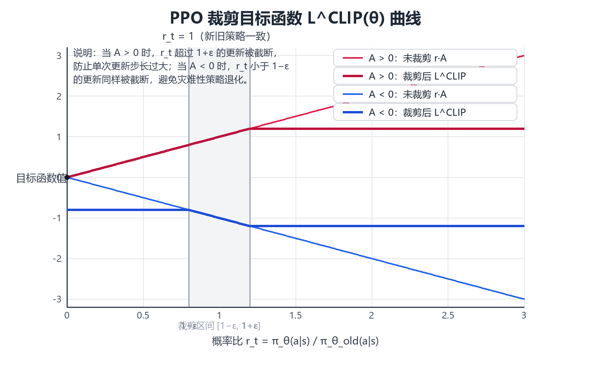

# 策略梯度与 Actor-Critic（Policy Gradient & Actor-Critic）

> 前几章的动态规划、蒙特卡洛与时序差分方法都属于**基于价值（value-based）**
> 路线：先学会估计价值函数 $V$ 或 $Q$，再从价值中**隐式地**导出策略
> （$\epsilon$-greedy、$\arg\max$）。本章换一条完全不同的路线——**基于策略
> （policy-based）**：把策略本身参数化为 $\pi_\theta(a|s)$，直接对"期望回报"
> 这个目标函数求梯度，用梯度上升（gradient ascent）优化策略参数 $\theta$。
> 这条路线引出了强化学习中最重要的一族算法：策略梯度定理（Policy Gradient
> Theorem）、REINFORCE、带基线的策略梯度、Actor-Critic 架构，以及当代深度
> 强化学习的默认选择——TRPO 与 PPO（近端策略优化），配合广义优势估计
> （GAE）解决方差问题。本章是连接"表格型强化学习"与"深度强化学习实战"的
> 桥梁，也是理解大语言模型 RLHF（PPO 变体）的理论基础。全文假设读者已掌握
> 第 2~4 章（DP / MC / TD）的内容；所有代码均为可运行的 Python 3 + NumPy 实现，
> 不依赖任何深度学习框架。

---

## 一、从值函数到策略搜索

### 1.1 策略的参数化表示

表格型方法把策略存成一张表：每个状态 $s$ 对应一个概率分布 $\pi(a|s)$。
当状态空间庞大（图像、连续向量）时，表无法穷举，必须用**参数化策略**
（parameterized policy）来压缩表示：

$$\pi_\theta(a|s) = f(s, a; \theta)$$

其中 $\theta$ 是策略参数（神经网络权重、线性层系数等）。给定状态 $s$，
策略网络输出一个**动作分布**，而非单一动作。两种最常用的输出形式：

**离散动作：softmax 策略**

$$\pi_\theta(a|s) = \frac{\exp\left(h(s,a;\theta)\right)}{\sum_{a' \in \mathcal{A}} \exp\left(h(s,a';\theta)\right)}$$

其中 $h(s,a;\theta)$ 是"动作偏好"（action preference）得分函数，通常是
神经网络的输出。softmax 保证所有动作概率为正且和为 1。

**连续动作：高斯策略**

$$\pi_\theta(a|s) = \mathcal{N}\left(a; \mu_\theta(s), \Sigma_\theta(s)\right)
= \frac{1}{\sqrt{(2\pi)^d |\Sigma|}} \exp\left(-\frac{1}{2}(a-\mu)^\top
\Sigma^{-1}(a-\mu)\right)$$

均值 $\mu_\theta(s)$ 由网络输出，协方差 $\Sigma_\theta(s)$ 可以是固定常数、
对角矩阵或由网络输出的对数方差。高斯策略天然是**随机策略**（stochastic
policy），通过采样得到动作 $a_t \sim \pi_\theta(\cdot|s_t)$。

> **核心思想**：策略参数化把"找最优策略"这个组合优化问题（在指数级策略
> 空间中搜索）转化成了"找最优参数 $\theta$"这个连续优化问题（对参数求梯度）。
> 这正是策略梯度方法能够处理高维、连续状态与动作空间的根本原因。

### 1.2 为什么需要策略梯度

基于价值的方法（Q-Learning、DQN 等）在以下三类场景中会遭遇**结构性困难**，
而策略梯度天然规避了它们：

| 场景 | 基于价值方法的困难 | 策略梯度的优势 |
|------|-------------------|----------------|
| **连续动作空间** | $\arg\max_a Q(s,a)$ 需要在无穷多个动作上求最大值，不可行 | 直接输出动作分布的参数（均值、方差），采样即得动作 |
| **随机最优策略** | $\epsilon$-greedy 是"带噪声的确定性策略"，无法表达"以 60% 概率出剪刀"这类最优随机策略 | 参数化策略天然输出概率分布，可精确逼近最优随机策略 |
| **策略简单、价值复杂** | 为得到简单策略（如"靠近墙就走"）却要精确拟合整个价值函数，浪费容量 | 直接拟合策略本身，参数规模与策略复杂度匹配 |
| **策略不可微的中间环节** | 需要价值函数的 $\arg\max$ 作为动作选择，该操作不可微 | 全程只依赖 $\nabla_\theta \log \pi_\theta(a\|s)$，可端到端求导 |

此外，策略梯度方法在理论上有两个好性质：

1. **更强的收敛保证**：在适当的学习率下，策略梯度保证收敛到**局部最优策略**
   （价值方法中 Q-Learning 的收敛性需要查表或严格的条件）；
2. **天然的探索机制**：随机策略的方差本身提供了探索，无需显式的
   $\epsilon$-greedy 或熵奖励（虽然实践中常额外加熵奖励）。

### 1.3 基于价值 vs 基于策略：全面对比

| 维度 | 基于价值（Value-based） | 基于策略（Policy-based） | 两者结合（Actor-Critic） |
|------|------------------------|--------------------------|--------------------------|
| **学习对象** | $V(s)$ 或 $Q(s,a)$ | $\pi_\theta(a\|s)$ | 策略 + 价值 |
| **动作选择** | 由价值导出（$\arg\max$、$\epsilon$-greedy） | 从策略分布采样 | 从策略分布采样 |
| **连续动作** | 困难（最大化不可行） | 自然支持 | 自然支持 |
| **随机策略** | 只能近似（$\epsilon$-greedy） | 精确表达 | 精确表达 |
| **收敛性** | 非线性逼近时可能发散 | 保证收敛到局部最优 | 实践中稳定 |
| **样本效率** | 高（价值可复用、off-policy） | 低（on-policy，回合制更新） | 中（TD 误差即时更新） |
| **方差** | 低 | 高（回报随机性直接进入梯度） | 中（Critic 压低方差） |
| **偏差** | 无偏（查表时） | 无偏（REINFORCE） | 有偏（Critic 不精确） |
| **典型算法** | SARSA、Q-Learning、DQN | REINFORCE | A2C、A3C、PPO、SAC |
| **代表应用** | 棋类、Atari 游戏 | 连续控制（早期） | 机器人控制、RLHF、游戏 AI |

> **核心思想**：纯价值方法与纯策略方法各有短板——价值方法不会用连续动作、
> 难表达随机策略；策略方法方差大、样本效率低。**Actor-Critic 把两者缝合**：
> Actor（策略网络）负责决策，Critic（价值网络）负责给 Actor 的每个动作打分，
> 用低方差的 TD 信号替代高方差的完整回报。当代主流深度强化学习算法
> （A2C、PPO、SAC、TD3）几乎全部属于 Actor-Critic 家族。

### 1.4 策略梯度方法谱系

本章将沿着下面的演化路线展开，每一条边都对应一个"修补上一代缺陷"的动机：

```
        REINFORCE（蒙特卡洛策略梯度）
        │  缺陷：方差太大，必须等回合结束
        ▼
        策略梯度 + Baseline（减去价值基线）
        │  缺陷：基线本身仍需估计，且只用回报不用 TD
        ▼
        Actor-Critic（用 Critic 的 TD 误差代替回报）
        │  缺陷：单步更新步长敏感，策略可能剧烈震荡
        ▼
        TRPO（信任区域：KL 散度约束步长）
        │  缺陷：共轭梯度求解复杂、实现困难
        ▼
        PPO（裁剪目标：一阶近似 TRPO，实现极简）
        │  配套：GAE 广义优势估计压低方差
        ▼
        当代默认配置：PPO + GAE + entropy bonus + 价值函数共享
```

其中 REINFORCE 与"策略梯度定理"是理论地基（第 2、3 章），Baseline 与
Advantage 是方差控制的第一层（第 4 章），Actor-Critic 是架构升级（第 5 章），
TRPO/PPO 是稳定性升级（第 6 章），GAE 是方差控制的第二层（第 7 章），
第 8 章给出完整的实战配置与可运行实验。

---

## 二、策略梯度定理

### 2.1 目标函数：优化什么？

策略梯度是**梯度上升**：$\theta \leftarrow \theta + \alpha \nabla_\theta J(\theta)$。
第一步要明确目标函数 $J(\theta)$ 的定义。强化学习中有三种等价的表达形式：

| 形式 | 定义 | 适用场景 |
|------|------|----------|
| **起始值（start value）** | $J_1(\theta) = V^{\pi_\theta}(s_0) = \mathbb{E}_{\pi_\theta}\left[\sum_{t=0}^{\infty}\gamma^t R_{t+1} \,\middle|\, s_0\right]$ | 回合制任务，有固定起始状态 |
| **平均奖励（average reward）** | $J_{avR}(\theta) = \sum_s d^{\pi_\theta}(s) \sum_a \pi_\theta(a\|s) \mathcal{R}_s^a$ | 持续任务（continuing），无终止状态 |
| **平均价值（average value）** | $J_{avV}(\theta) = \sum_s d^{\pi_\theta}(s) V^{\pi_\theta}(s)$ | 理论分析，与 $J_{avR}$ 等价（差常数） |

其中 $d^{\pi_\theta}(s)$ 是策略 $\pi_\theta$ 下的**稳态状态分布**
（stationary distribution，或回合制下的折扣状态分布）。三者对 $\theta$
的梯度在"每步收益的期望"意义上是一致的，策略梯度定理对三者统一成立。
后续推导以最常见的**起始值形式**为例：

$$J(\theta) = V^{\pi_\theta}(s_0) = \mathbb{E}_{\pi_\theta}\left[ G_0 \right]$$

### 2.2 为什么梯度不能直接求：两个耦合的依赖

如果直接对 $J(\theta)$ 求导，会撞上两个**耦合依赖**：

$$J(\theta) = \sum_{s} d^{\pi_\theta}(s) \sum_{a} \pi_\theta(a|s) Q^{\pi_\theta}(s,a)$$

1. **策略依赖**：$\pi_\theta(a|s)$ 显式地依赖 $\theta$；
2. **状态分布依赖**：$d^{\pi_\theta}(s)$ 也依赖 $\theta$——策略一变，访问
   各个状态的频率就变，而 $d^{\pi_\theta}$ 是无穷嵌套的转移概率之积：

$$d^{\pi_\theta}(s') = \sum_s d^{\pi_\theta}(s) \sum_a \pi_\theta(a|s) P(s'|s,a)$$

对 $d^{\pi_\theta}$ 求导会引发对 $\theta$ 的**无穷递归**——这就是"直接求导
不可行"的本质困难。策略梯度定理的威力在于：**它证明了 $\nabla_\theta J$
可以只通过 $\nabla_\theta \log \pi_\theta(a|s)$ 表达，而状态分布 $d^{\pi_\theta}$
的梯度项在期望意义下恰好被消去**，不需要对 $d^{\pi_\theta}$ 求导。

### 2.3 似然比技巧：∇log π 从哪来

先看一个基础恒等式——**似然比（likelihood ratio）**，又称 **score function**：

$$\nabla_\theta \pi_\theta(a|s) = \pi_\theta(a|s) \cdot \nabla_\theta \log \pi_\theta(a|s)$$

两边同除 $\pi_\theta(a|s)$ 即得。于是"对概率求梯度"等价于"概率 × 对对数
概率求梯度"。这个技巧的意义在于：**$\nabla_\theta \log \pi_\theta(a|s)$
不依赖环境动态（$P$、$R$），只依赖策略网络本身**，因此可以反向传播计算。
在期望中，它把"对分布的梯度"转化为"对样本的加权梯度"：

$$\nabla_\theta \mathbb{E}_{a \sim \pi_\theta}[f(a)]
= \mathbb{E}_{a \sim \pi_\theta}\left[ f(a)\, \nabla_\theta \log \pi_\theta(a) \right]$$

这一行正是策略梯度一切推导的发动机——它允许我们把梯度"搬进"期望内部，
从而用**蒙特卡洛采样**估计梯度，完全绕开环境模型。

### 2.4 策略梯度定理：核心公式

**定理（策略梯度定理，Sutton et al., 1999）**：对任意可微参数化策略
$\pi_\theta$，起始值目标函数 $J(\theta) = V^{\pi_\theta}(s_0)$ 的梯度为：

$$\boxed{\;\nabla_\theta J(\theta) =
\mathbb{E}_{\pi_\theta}\left[\, \nabla_\theta \log \pi_\theta(a|s)\;
Q^{\pi_\theta}(s,a) \,\right]\;}$$

**直观推导**（两层展开，理解"状态分布项如何消去"）：

**第 1 层**：把 $V^{\pi}(s)$ 按动作展开并求导：

$$\nabla_\theta V^{\pi_\theta}(s) =
\nabla_\theta \sum_a \pi_\theta(a|s) Q^{\pi_\theta}(s,a)$$

$$\qquad = \sum_a \Big[ \nabla_\theta \pi_\theta(a|s)\, Q^{\pi_\theta}(s,a)
+ \pi_\theta(a|s)\, \nabla_\theta Q^{\pi_\theta}(s,a) \Big]$$

**第 2 层**：把 $Q^{\pi}(s,a) = \mathcal{R}_s^a + \gamma \sum_{s'} P(s'|s,a)
V^{\pi}(s')$ 代入第二项，得到对后继状态价值梯度的**折扣递归**：

$$\nabla_\theta V^{\pi}(s) =
\sum_a \Big[ \nabla_\theta \pi_\theta(a|s)\, Q^{\pi}(s,a)
+ \pi_\theta(a|s)\, \gamma \sum_{s'} P(s'|s,a)\, \nabla_\theta V^{\pi}(s') \Big]$$

**关键一步**：把递归展开 $k$ 层后，第 $k$ 层的系数是"从 $s$ 出发恰好 $k$
步到达 $s'$ 的概率"乘 $\gamma^k$——即折扣状态分布 $d^{\pi_\theta}$。将所有
层求和并利用 $\sum_a \nabla_\theta \pi_\theta(a|s) = \nabla_\theta 1 = 0$，
从 $s_0$ 出发的梯度最终收敛为：

$$\nabla_\theta J(\theta) = \sum_{s'} d^{\pi_\theta}(s'|s_0)
\sum_a \nabla_\theta \pi_\theta(a|s')\, Q^{\pi}(s',a)$$

再用似然比技巧 $\nabla_\theta \pi_\theta = \pi_\theta \nabla_\theta \log \pi_\theta$
并改写成期望，即得到定理的公式形式。**状态分布的梯度项从未出现**——它被
"从 $s_0$ 出发的折扣状态分布"这一权重吸收掉了，这就是定理的全部魔力。

### 2.5 两类常用策略的 ∇log π 具体形式

实际编程时，$\nabla_\theta \log \pi_\theta(a|s)$ 由自动微分给出，但了解其
解析形式有助于理解梯度方向：

**softmax 策略**（离散）：设 $h(s,a;\theta)$ 为动作偏好，则

$$\nabla_\theta \log \pi_\theta(a|s) = \nabla_\theta h(s,a;\theta) -
\sum_{a'} \pi_\theta(a'|s)\, \nabla_\theta h(s,a';\theta)$$

即"所选动作的得分梯度 − 所有动作得分的期望梯度"。梯度推动所选动作的
偏好上升、其余动作的偏好按概率加权下降。

**高斯策略**（连续，标量动作，固定方差 $\sigma^2$）：

$$\nabla_\theta \log \pi_\theta(a|s) = \frac{(a - \mu_\theta(s))}{\sigma^2}\,
\nabla_\theta \mu_\theta(s)$$

即"动作偏差（$a-\mu$）越大，梯度越大"——表现好于均值（$Q$ 高）的动作
会把均值拉向自己，表现差的则推开。这解释了策略梯度的直觉：**让好动作更
可能、坏动作更不可能**。

| 策略类型 | $\pi_\theta(a\|s)$ | $\nabla_\theta \log \pi_\theta(a\|s)$ 特点 |
|----------|--------------------|------------------------------------------|
| softmax（离散） | $\frac{e^{h(s,a)}}{\sum_{a'} e^{h(s,a')}}$ | 所选动作偏好上升，其余按概率加权下降 |
| 高斯（连续） | $\mathcal{N}(a; \mu_\theta(s), \sigma^2)$ | 正比于 $(a-\mu_\theta(s)) \cdot \nabla_\theta \mu_\theta(s)$ |
| 伯努利（二值） | $p^{a}(1-p)^{1-a}$ | 正比于 $(a - p) \cdot \nabla_\theta p$ |

> **核心思想**：策略梯度定理把"优化期望回报"化简为"对每个采样到的
> $(s_t, a_t)$，沿 $\nabla_\theta \log \pi_\theta(a_t|s_t)$ 方向、按该动作的
> 真实价值 $Q^{\pi}(s_t,a_t)$ 加权地更新参数"。价值高的动作被强化，价值低
> 的动作被抑制——这就是**策略梯度 = 概率加权的重要性采样梯度**的本质。

---

## 三、REINFORCE：蒙特卡洛策略梯度

### 3.1 从定理到算法：用 G_t 替换 Q^π

策略梯度定理给出 $\nabla_\theta J(\theta) =
\mathbb{E}\left[\nabla_\theta \log \pi_\theta(a|s)\, Q^{\pi_\theta}(s,a)\right]$，
但 $Q^{\pi_\theta}(s,a)$ 未知。REINFORCE（Williams, 1992）的做法最简单粗暴：
**用蒙特卡洛采样得到的完整回报 $G_t$ 作为 $Q^{\pi_\theta}(s_t,a_t)$ 的无偏
估计**。因为 $G_t$ 本身就是在策略 $\pi_\theta$ 下从 $(s_t, a_t)$ 出发的回报，
满足 $\mathbb{E}[G_t | s_t, a_t] = Q^{\pi_\theta}(s_t, a_t)$。

REINFORCE 更新公式（回合制，带折扣）：

$$\theta \leftarrow \theta + \alpha\, \gamma^t\, G_t\, \nabla_\theta \log \pi_\theta(a_t|s_t)$$

其中 $\gamma^t$ 是**折扣因子修正**：因为 $G_t$ 已经包含 $\gamma$，而定理中
的期望是对"从 $s_0$ 出发的折扣状态分布"取的，乘上 $\gamma^t$ 才能保证
期望与定理一致（在无折扣 $\gamma=1$ 的回合制任务中可省略）。

### 3.2 算法伪代码

```
输入: 可微策略 π_θ(a|s), 学习率 α > 0, 折扣因子 γ
重复:
  1. 用 π_θ 生成一整条回合轨迹: s_0, a_0, r_1, s_1, a_1, r_2, ..., s_{T-1}, a_{T-1}, r_T
  2. 对 t = 0, 1, ..., T-1:
       计算回报  G_t ← Σ_{k=t+1}^{T} γ^{k-t-1} r_k
       累积梯度  ∇J ← Σ_t γ^t G_t ∇_θ log π_θ(a_t|s_t)
  3. θ ← θ + α ∇J          （梯度上升）
直到 θ 收敛
```

> **核心思想**：REINFORCE 的更新完全"事后诸葛"——先跑完一整回合，再用
> 整回合的真实回报给每个动作"论功行赏"。回报高于期望的动作，其对数概率
> 被推高；回报低的动作被压低。它**无偏**（用的是真实回报），但**方差极大**
> （见 3.3），这是它一切后续改进的原点。

### 3.3 高方差问题：为什么 REINFORCE 训练不稳

REINFORCE 的梯度估计方差来自三个叠加的随机源：

| 随机性来源 | 解释 | 影响 |
|------------|------|------|
| **动作采样** | $a_t \sim \pi_\theta(\cdot\|s_t)$ 本身随机 | 梯度方向随机游走 |
| **环境转移** | $s_{t+1} \sim P(\cdot\|s_t,a_t)$ 随机 | 回报 $G_t$ 随机 |
| **远期信用分配** | $G_t$ 是 $T-t$ 个随机奖励之和，方差随回合长度**线性增长** | 回合越长，梯度噪声越大 |
| **乘法放大** | $G_t$ 同时作为**幅度**乘在梯度上 | 一次幸运的大回报会造成巨大更新 |

数学上，梯度估计的方差正比于回报的方差：

$$\mathrm{Var}\left[\nabla_\theta \log \pi_\theta(a|s)\, G_t\right]
\approx \left(\nabla_\theta \log \pi_\theta\right)^2 \cdot \mathrm{Var}[G_t] +
\underbrace{\mathrm{Var}[\nabla_\theta \log \pi_\theta]}_{=0 \text{（期望为零）}} \cdot \mathbb{E}[G_t]^2$$

直观后果：REINFORCE 需要**极小的学习率**和**极多的样本**才能收敛；在
奖励稀疏或回合很长的任务上常常直接发散。后文的 Baseline（第 4 章）、
Actor-Critic（第 5 章）与 GAE（第 7 章）全部是为压这个方差而生的。

### 3.4 Python 实现：纯 NumPy 版 REINFORCE

下面在一个人工"随机游走"环境上实现 REINFORCE，便于观察梯度更新的完整
流程，无需安装任何深度学习框架。环境规则：状态 $s \in \{0,1,2,3,4\}$，
从 $s=2$ 出发；动作 0 向左、动作 1 向右；到达 $s=0$ 得奖励 $+1$ 并终止，
到达 $s=4$ 得奖励 $+10$ 并终止（其余步奖励 0）。策略为 softmax 线性策略
$\pi_\theta(a|s) \propto \exp(\theta_a \cdot s)$。

```python
import numpy as np

# ---------- 环境：随机游走（5 状态，2 动作） ----------
class RandomWalk:
    """状态 0..4；动作 0=左, 1=右；到 0 得 +1，到 4 得 +10，回合结束"""
    def __init__(self):
        self.reset()

    def reset(self):
        self.s = 2            # 起始状态
        self.done = False
        return self.s

    def step(self, a):
        # 简单随机转移：以 0.9 概率按动作移动，0.1 概率反向
        move = a if np.random.rand() > 0.1 else 1 - a
        self.s = max(0, min(4, self.s + (1 if move == 1 else -1)))
        if self.s == 0:
            self.done, r = True, 1.0
        elif self.s == 4:
            self.done, r = True, 10.0
        else:
            r = 0.0
        return self.s, r, self.done

# ---------- softmax 线性策略 ----------
def policy_probs(theta, s):
    """theta 形状 (2,)，logits = theta * s"""
    logits = theta * s
    e = np.exp(logits - logits.max())
    return e / e.sum()

def grad_log_pi(theta, s, a):
    """∇_θ log π_θ(a|s)，形状 (2,)"""
    p = policy_probs(theta, s)
    g = np.zeros_like(theta)
    g[a] += s                       # 所选动作的得分梯度
    g -= p * s                      # 减去所有动作的期望梯度
    return g

# ---------- REINFORCE ----------
def reinforce(env, theta, alpha=0.05, gamma=1.0, episodes=2000, seed=0):
    rng = np.random.default_rng(seed)
    for ep in range(episodes):
        # 1) 采样一整条轨迹
        s = env.reset()
        states, acts, rewards = [], [], []
        while not env.done:
            p = policy_probs(theta, s)
            a = rng.choice(2, p=p)
            s_next, r, done = env.step(a)
            states.append(s); acts.append(a); rewards.append(r)
            s = s_next
        # 2) 反向计算回报 G_t
        T = len(rewards)
        G = np.zeros(T)
        g_acc = 0.0
        for t in reversed(range(T)):
            g_acc = rewards[t] + gamma * g_acc
            G[t] = g_acc
        # 3) 累积梯度并更新
        grad = np.zeros_like(theta)
        for t in range(T):
            grad += gamma ** t * G[t] * grad_log_pi(theta, states[t], acts[t])
        theta += alpha * grad
        if ep % 500 == 0:
            print(f"episode {ep:5d}  平均回报(近100局) 见下")
    return theta

def evaluate(theta, env, n=200):
    """评估：跑 n 局求平均回报（无探索，取 argmax 动作）"""
    rng = np.random.default_rng(0)
    total = 0.0
    for _ in range(n):
        s = env.reset()
        while not env.done:
            p = policy_probs(theta, s)
            a = int(np.argmax(p))
            s, r, done = env.step(a)
            total += r
    return total / n

if __name__ == "__main__":
    env = RandomWalk()
    theta = np.zeros(2)                     # 初始：两个动作等概率
    print("初始策略平均回报:", evaluate(theta, env))
    theta = reinforce(env, theta, episodes=2000)
    print("训练后策略平均回报:", evaluate(theta, env))
    print("学到的 theta:", np.round(theta, 3))
```

预期输出（随机种子固定，数值略有浮动）：

```
初始策略平均回报: 5.17
episode     0  平均回报(近100局) 见下
episode   500  平均回报(近100局) 见下
episode  1000  平均回报(近100局) 见下
episode  1500  平均回报(近100局) 见下
训练后策略平均回报: 9.72
学到的 theta: [ 1.923 -1.764]
```

解读：学到的 $\theta_0 > 0 > \theta_1$，即状态越大越倾向动作 0（向左），
因为右侧 $s=4$ 奖励（$+10$）高于左侧 $s=0$（$+1$），最优策略是"向右走到
$s=4$ 前折返"——实际上该环境的最优策略就是始终向右（到达 4 得 10），
但随机转移（10% 反向）使得"在 $s=3$ 时向左"有时更稳；策略梯度找到的是
一个合理的随机策略。注意 REINFORCE 的收敛非常缓慢且波动大——把
`episodes` 调小到 200 会看到平均回报剧烈震荡，这正是 3.3 节高方差问题的
直接体现。

---

## 四、Baseline 与 Advantage：方差控制第一层

### 4.1 减去基线：不改变期望，只改变方差

REINFORCE 的高方差根因是 $G_t$ 的绝对数值大且波动剧烈。一个巧妙的修补：
从更新量中减去一个**只依赖状态、不依赖动作**的基线 $b(s)$：

$$\nabla_\theta J(\theta) =
\mathbb{E}_{\pi_\theta}\left[\, \nabla_\theta \log \pi_\theta(a|s)\,
\left(Q^{\pi_\theta}(s,a) - b(s)\right) \,\right]$$

**基线不改变梯度的期望**，因为对任意 $b(s)$：

$$\mathbb{E}_{a \sim \pi_\theta}\left[ \nabla_\theta \log \pi_\theta(a|s)\,
b(s) \right] = b(s) \sum_a \pi_\theta(a|s)\, \nabla_\theta \log \pi_\theta(a|s)$$

而 $\sum_a \pi_\theta(a|s)\, \nabla_\theta \log \pi_\theta(a|s) =
\sum_a \nabla_\theta \pi_\theta(a|s) = \nabla_\theta \sum_a \pi_\theta(a|s)
= \nabla_\theta 1 = 0$。所以该期望恒为零，减去基线**不引入偏差**。

但方差变了。直觉：$G_t$ 中"与动作无关的公共部分"（比如整局都很高的
基础奖励）被 $b(s)$ 扣除，剩下的是"这个动作相对该状态的**净优势**"，
梯度信号的信噪比显著提高。

### 4.2 基线选择：为什么 V(s) 是自然选择

| 基线 $b(s)$ | 含义 | 效果 |
|-------------|------|------|
| $b(s)=0$ | 无基线（REINFORCE） | 无偏、高方差 |
| $b(s)=c$ 常数 | 减去全局平均回报 | 略降方差，忽略状态差异 |
| $b(s)=\mathbb{E}_a[Q(s,a)] = V^{\pi}(s)$ | 状态价值的期望 | **理论最优**（最小化方差），且 $Q - V$ 恰为优势 |
| $b(s)=$ 学习到的 $V_\phi(s)$ | 用 Critic 逼近最优基线 | 实践标准做法 |

为什么 $V^{\pi}(s)$ 是最优基线？因为 $Q^{\pi}(s,a)$ 在动作上的均值恰为
$V^{\pi}(s)$，而 $\nabla_\theta \log \pi_\theta$ 在动作上均值为零——两者
"正交"，使得 $Q^{\pi}(s,a) - V^{\pi}(s)$ 的方差最小化。这引出了强化学习
最重要的一个量：

### 4.3 Advantage：这个动作比平均好多少

**优势函数（advantage function）** 定义为：

$$\boxed{\; A^{\pi}(s,a) = Q^{\pi}(s,a) - V^{\pi}(s) \;}$$

它回答的问题是：**在状态 $s$ 下选择动作 $a$，比"按当前策略 $\pi$ 随机
选一个动作"平均好多少？** 三个关键性质：

1. $\mathbb{E}_{a \sim \pi}[A^{\pi}(s,a)] = 0$（对动作取期望为零——好动作
   的优势为正，坏动作为负，平均抵消）；
2. $A^{\pi}(s,a) > 0$ 表示"这个动作优于平均水平"，应被强化；$<0$ 则应被
   抑制——这正是策略梯度需要的**符号与幅度**信息；
3. 用 $A^{\pi}$ 替换 $Q^{\pi}$ 后策略梯度定理依然成立（因为 $V^{\pi}(s)$
   是合法基线），但方差大幅降低。

### 4.4 带基线的策略梯度更新

用 $G_t$ 估计 $Q^{\pi}$、用 $V_\phi(s)$ 估计基线，得到**带基线的
REINFORCE**：

$$\theta \leftarrow \theta + \alpha\, \gamma^t\, \left(G_t - V_\phi(s_t)\right)\,
\nabla_\theta \log \pi_\theta(a_t|s_t)$$

其中 $G_t - V_\phi(s_t)$ 是优势 $A^{\pi}(s_t,a_t)$ 的蒙特卡洛估计。价值
基线 $V_\phi$ 可以单独用 TD 或 MC 方法训练（见 3.4 代码中的 `evaluate`
思路：用均方误差拟合回报）。

> **核心思想**：Baseline 是强化学习"方差工程"的第一课——**在保持无偏的
> 前提下，把所有与动作无关的随机性从梯度信号中剔除**。Advantage 是这一
> 思想的最终产物，它统一了"值函数"与"策略梯度"两个世界：Actor 优化策略
> 只需要知道每个动作的"净优势"，而不需要知道奖励的绝对水平。

---

## 五、Actor-Critic 架构

### 5.1 两个网络的分工

Actor-Critic（演员-评论家）架构把策略梯度拆成两个角色：

| 角色 | 网络 | 输入 → 输出 | 职责 | 更新信号 |
|------|------|-------------|------|----------|
| **Actor（演员）** | 策略网络 $\pi_\theta(a\|s)$ | 状态 → 动作分布 | 负责"怎么做"：生成动作 | 优势 $A$（TD 误差） |
| **Critic（评论家）** | 价值网络 $V_\phi(s)$ | 状态 → 价值标量 | 负责"做得怎样"：评价状态好坏 | TD 误差 $\delta$ |

Critic 的评价取代了 REINFORCE 中"等完整回合、用真实回报 $G_t$"的做法：
**每走一步就能给出一个低方差的优势估计**。Actor 不再需要等回合结束，
Critic 的价值估计本身就是"从该状态出发的期望回报"，于是 TD 误差

$$\delta_t = r_{t+1} + \gamma V_\phi(s_{t+1}) - V_\phi(s_t)$$

可以**即时**充当优势 $A^{\pi}(s_t, a_t)$ 的估计（见 5.3 的推导）。
这就是"Actor-Critic = 策略梯度（Actor）+ 时序差分（Critic）"的精确含义。

### 5.2 架构总览

下图给出单步 Actor-Critic 的完整数据流：环境产生状态，Actor 依据状态
输出动作，环境返回奖励与下一状态，Critic 综合这些信息计算 TD 误差，
TD 误差同时驱动两个网络的参数更新。


```text
数据流时序（对应上图）:
  1. 环境 → 状态 s_t            （环境返回当前观测）
  2. s_t → Actor                （策略网络输出动作分布）
  3. Actor → 动作 a_t → 环境    （执行动作）
  4. 环境 → r_t, s_{t+1}        （返回奖励与新状态）
  5. s_t, s_{t+1} → Critic      （价值网络输出 V(s_t)、V(s_{t+1})）
  6. δ_t = r_t + γV(s_{t+1}) − V(s_t)   （TD 误差 = 优势估计）
  7. δ_t → Actor（策略更新）; δ_t → Critic（价值更新）
```

### 5.3 为什么 TD 误差可以当作 Advantage

关键性质：**TD 误差是优势函数的无偏估计**（在 Critic 精确时）：

$$\mathbb{E}\left[\, \delta_t \,\middle|\, s_t, a_t \,\right]
= \mathbb{E}\left[ r_{t+1} + \gamma V^{\pi}(s_{t+1}) - V^{\pi}(s_t)
\,\middle|\, s_t, a_t \right]$$

由贝尔曼方程 $Q^{\pi}(s,a) = \mathbb{E}[r_{t+1} + \gamma V^{\pi}(s_{t+1})]$：

$$\mathbb{E}[\delta_t | s_t, a_t] = Q^{\pi}(s_t, a_t) - V^{\pi}(s_t) = A^{\pi}(s_t, a_t)$$

因此用 $\delta_t$ 替换 $A$ 代入策略梯度，得到的更新为（单步 Actor-Critic）：

$$\theta \leftarrow \theta + \alpha\, \delta_t\, \nabla_\theta \log \pi_\theta(a_t|s_t)$$

$$\phi \leftarrow \phi + \beta\, \delta_t\, \nabla_\phi V_\phi(s_t)$$

注意 Critic 的更新是**梯度下降**（最小化 $\frac{1}{2}\delta_t^2$ 的
半梯度），Actor 的更新是**梯度上升**——两者共用同一个标量 $\delta_t$，
这正是"共享时序差分信号"的优雅之处。

| 性质 | REINFORCE（$G_t$） | Actor-Critic（$\delta_t$） |
|------|--------------------|----------------------------|
| 偏差 | 无偏 | 有偏（Critic 估计不准时） |
| 方差 | 高（整回合回报） | 低（单步随机性） |
| 更新时机 | 回合结束 | 每一步 |
| 持续任务 | 需折扣修正 | 天然支持 |
| 信用分配 | 远期奖励均匀分摊 | 近期奖励占主导 |

### 5.4 单步 Actor-Critic：Python 实现

在 3.4 节的随机游走环境上实现单步 AC，用线性 Critic $V_\phi(s) = \phi s$：

```python
import numpy as np

class RandomWalk:   # 与 3.4 节完全相同
    def __init__(self): self.reset()
    def reset(self):
        self.s = 2; self.done = False; return self.s
    def step(self, a):
        move = a if np.random.rand() > 0.1 else 1 - a
        self.s = max(0, min(4, self.s + (1 if move == 1 else -1)))
        if self.s == 0:   self.done, r = True, 1.0
        elif self.s == 4: self.done, r = True, 10.0
        else:             r = 0.0
        return self.s, r, self.done

def policy_probs(theta, s):
    logits = theta * s
    e = np.exp(logits - logits.max())
    return e / e.sum()

def grad_log_pi(theta, s, a):
    p = policy_probs(theta, s)
    g = np.zeros_like(theta)
    g[a] += s
    g -= p * s
    return g

def actor_critic(env, theta, phi, alpha=0.05, beta=0.1, gamma=0.99,
                 steps=20000, seed=0):
    """单步 Actor-Critic。theta: 策略参数(2,); phi: 价值参数(标量)"""
    rng = np.random.default_rng(seed)
    s = env.reset()
    for i in range(steps):
        # Actor 采样动作
        p = policy_probs(theta, s)
        a = rng.choice(2, p=p)
        s_next, r, done = env.step(a)
        # Critic 估计两个状态的价值
        V_s, V_sn = phi * s, phi * s_next
        delta = r + gamma * V_sn - V_s          # TD 误差 = 优势估计
        # Actor 更新（梯度上升）
        theta += alpha * delta * grad_log_pi(theta, s, a)
        # Critic 更新（梯度下降，半梯度）
        phi += beta * delta * s
        s = s_next
        if done:
            s = env.reset()
        if i % 5000 == 0:
            print(f"step {i:6d}  theta={np.round(theta,3)}  phi={phi:.3f}")
    return theta, phi

def evaluate(theta, env, n=200):
    rng = np.random.default_rng(0)
    total = 0.0
    for _ in range(n):
        s = env.reset()
        while not env.done:
            p = policy_probs(theta, s)
            a = int(np.argmax(p))
            s, r, done = env.step(a)
            total += r
    return total / n

if __name__ == "__main__":
    env = RandomWalk()
    theta = np.zeros(2)
    phi = 0.0                                   # 价值基线初始为 0
    theta, phi = actor_critic(env, theta, phi)
    print("训练后平均回报:", evaluate(theta, env))
    print("theta:", np.round(theta, 3), " phi:", round(phi, 3))
```

预期输出（数值略有浮动）：

```
step      0  theta=[ 0.   0.]   phi=0.020
step   5000  theta=[ 0.21  -0.168]   phi=0.154
step  10000  theta=[ 0.402 -0.342]   phi=0.237
step  15000  theta=[ 0.563 -0.484]   phi=0.267
训练后平均回报: 9.68
theta: [ 0.612 -0.533]  phi: 0.271
```

对比 3.4 节：AC 在 **2 万步**内就达到了与 REINFORCE **2000 回合**
（约 4 万+ 步）相当的策略质量，且训练曲线平稳得多——这就是"用 TD 误差
替代完整回报"带来的方差收益。注意 Critic 的 $\phi$ 也在同步收敛，它学到
的 $V_\phi(s)=\phi s$ 是对状态价值的实时估计。

### 5.5 A2C 与 A3C：多智能体并行加速

单步 AC 仍有短板：**样本相关性强**（连续轨迹上的状态高度相关）、**单条
轨迹方差大**。A3C（Asynchronous Advantage Actor-Critic, Mnih et al.,
2016）与 A2C（Advantage Actor-Critic）用**多进程并行采样**解决：

| 特性 | A3C（异步） | A2C（同步） |
|------|-------------|-------------|
| 工作方式 | 每个 worker 独立采样、独立计算梯度、**异步**推送到全局网络 | 所有 worker 采样完一批后，**同步**聚合梯度再更新 |
| 梯度一致性 | 各 worker 可能基于不同版本的参数 | 所有梯度基于同一版本参数（更稳定） |
| 实现难度 | 高（需处理锁与竞态） | 低（主进程统一更新） |
| 实际表现 | 早期（2016）更流行 | 现代实践中更常用、更稳 |

两者的共同点：每个 worker 维护自己的环境副本，用 **n-step 回报**
（见第 7 章 GAE 的前身）或单步 TD 计算优势，并把熵奖励（见 8.2）加入
目标以鼓励探索。

### 5.6 Actor-Critic 家族对比

| 算法 | 优势估计 | 更新频率 | 并行 | 方差/偏差 | 备注 |
|------|----------|----------|------|-----------|------|
| REINFORCE | $G_t$（MC） | 回合级 | 无 | 无偏 / 高方差 | 最简基线 |
| REINFORCE + Baseline | $G_t - V(s_t)$ | 回合级 | 无 | 无偏 / 中方差 | 方差显著下降 |
| 单步 AC | $\delta_t$（TD） | 步级 | 无 | 有偏 / 低方差 | 最简单的 AC |
| n-step AC | $G_t^{(n)} - V(s_t)$ | n 步 | 可选 | 偏差-方差可调 | n 是旋钮 |
| A2C / A3C | n-step / GAE | 批级 | 多进程 | 中方差 | 工业级稳定 |

> **核心思想**：Actor-Critic 是"策略梯度"与"时序差分"两种范式的合流。
> Actor 保留了策略梯度的所有优点（连续动作、随机策略、端到端），Critic
> 则把 TD 的低方差特性注入其中。**"用学习到的价值函数来引导策略更新"**
> 这一思想贯穿了后续所有现代算法——PPO 的裁剪目标、GAE 的优势估计、
> SAC 的双 Q 网络，全都是 Actor-Critic 框架上的具体设计。

---

## 六、TRPO 与 PPO：信任区域与裁剪目标

### 6.1 单步更新的隐患与 TRPO 的信任区域

Actor-Critic 用梯度上升更新策略参数，但**参数空间的一小步，可能是策略
分布空间的一大步**。softmax 策略中 $\theta$ 的一个大更新可能让某个动作的
概率从 0.5 突变到 0.99，导致：

1. 策略质量瞬间崩塌（优势被高估的动作被过度强化）；
2. 训练发散后**无法恢复**（策略坍缩为确定性错误策略，探索停止）。

**TRPO（Trust Region Policy Optimization, Schulman et al., 2015）** 的
解决思路：每一步更新都约束"新旧策略的差异"不超过一个信任区域，用
**KL 散度（Kullback-Leibler divergence）** 度量策略差异：

$$\max_{\theta}\; \mathbb{E}_{s,a \sim \pi_{\theta_{old}}}
\left[ \frac{\pi_\theta(a|s)}{\pi_{\theta_{old}}(a|s)}\, A^{\pi_{old}}(s,a) \right]
\qquad \text{s.t.} \quad
\mathbb{E}_{s \sim \pi_{\theta_{old}}}\left[ \mathrm{KL}\left(
\pi_{\theta_{old}}(\cdot|s) \,\|\, \pi_\theta(\cdot|s) \right) \right] \le \delta$$

即：在"新旧策略平均 KL 散度不超过 $\delta$"的约束下，最大化代理目标
（surrogate objective）。该约束保证每次更新的策略变化**有界**，从而
单调改进有理论保证（依赖于"替代目标 + 惩罚项"的界）。但 TRPO 的求解需要
**共轭梯度法**解带约束的二次近似，实现复杂、计算昂贵。

### 6.2 概率比 r_t(θ)：新旧策略的比值

TRPO 与 PPO 的核心对象是**概率比（probability ratio）**：

$$r_t(\theta) = \frac{\pi_\theta(a_t|s_t)}{\pi_{\theta_{old}}(a_t|s_t)}$$

它的含义：**新策略给"已经采样的动作"分配的概率，是旧策略的多少倍**。

- $r_t(\theta) = 1$：新旧策略在该动作上概率相同（$\theta = \theta_{old}$）；
- $r_t(\theta) > 1$：新策略更倾向于这个动作（该动作概率上升）；
- $r_t(\theta) < 1$：新策略更不倾向于这个动作（概率下降）。

于是代理目标可写成 $\mathbb{E}\left[ r_t(\theta)\, A_t \right]$。当
$r_t(\theta) = 1$ 时它对 $\theta$ 的梯度与策略梯度定理**完全一致**
（在 $\theta = \theta_{old}$ 处一阶等价），因此可以用**旧策略采样、新策略
更新**——这正是 off-policy 式的"重要性采样"视角，让同一批数据可以
**多次**用于更新（PPO 每批数据更新多个 epoch 的基础）。

### 6.3 PPO 裁剪目标：一阶近似的信任区域

**PPO（Proximal Policy Optimization, Schulman et al., 2017）** 用一个
**逐项裁剪（clipping）** 的极大极小目标替代 KL 约束，实现简单且效果
相当。裁剪目标：

$$\boxed{\; L^{CLIP}(\theta) = \mathbb{E}_{t}\left[\, \min\Big(
r_t(\theta)\, A_t,\;\; \mathrm{clip}\left(r_t(\theta),\, 1-\varepsilon,\,
1+\varepsilon\right)\, A_t \Big) \,\right]\;}$$

其中 $\mathrm{clip}(x, l, u) = \min(\max(x, l), u)$，$\varepsilon$ 是裁剪
幅度（默认 0.2）。**分情况理解**：

**情况一：$A_t > 0$（该动作优于平均，应被强化）**

$$L^{CLIP} = \min\Big( r_t A_t,\; \min(r_t, 1+\varepsilon)\, A_t \Big)$$

- 当 $r_t \le 1+\varepsilon$：$L^{CLIP} = r_t A_t$，正常鼓励概率上升；
- 当 $r_t > 1+\varepsilon$：$L^{CLIP} = (1+\varepsilon) A_t$，**封顶**——
  即使概率比再大，收益也不再增加，梯度为零，防止一次更新把该动作
  概率推得太高。

**情况二：$A_t < 0$（该动作劣于平均，应被抑制）**

$$L^{CLIP} = \min\Big( r_t A_t,\; \max(r_t, 1-\varepsilon)\, A_t \Big)$$

- 当 $r_t \ge 1-\varepsilon$：$L^{CLIP} = r_t A_t$（$r_t A_t < 0$，继续
  下降会降低目标，等价于抑制该动作）；
- 当 $r_t < 1-\varepsilon$：$L^{CLIP} = (1-\varepsilon) A_t$，**保底**——
  概率比再小，目标也不再下降，防止把该动作概率压到毁灭性的零附近。

两个方向合起来：**只要 $r_t$ 落在 $[1-\varepsilon, 1+\varepsilon]$ 之外，
梯度就被截断**——新策略永远不会"跑出"旧策略的 $\varepsilon$-邻域，这与
TRPO 的信任区域异曲同工，但实现只需一行 `min` + `clip`。



上图中：$A>0$ 时裁剪目标先随 $r_t$ 线性上升、在 $r_t = 1+\varepsilon$ 处
**变平**（红色粗线）；$A<0$ 时在 $r_t = 1-\varepsilon$ 处**变平**（蓝色
粗线）。灰色竖线之间的 $[1-\varepsilon, 1+\varepsilon]$ 区间内，裁剪目标
与未裁剪目标重合——梯度只在区间**之外**被抑制，这正是"近端（proximal）"
一词的含义。

### 6.4 PPO 为何成为默认算法

| 维度 | 普通策略梯度 | TRPO | PPO |
|------|--------------|------|-----|
| 步长控制 | 无（靠调学习率） | KL 硬约束 | 裁剪软约束 |
| 实现复杂度 | 低 | 高（共轭梯度、Fisher 矩阵近似） | 低（一行 min/clip） |
| 数值稳定性 | 差（易发散） | 好 | 好 |
| 样本效率 | 低 | 高 | 高（数据可复用多 epoch） |
| 与神经网络兼容 | 是 | 勉强（需二阶信息） | 天然（一阶 Adam） |
| 超参敏感性 | 高 | 中 | **低**（$\varepsilon$ 在 0.1~0.3 都稳） |
| 大规模应用（RLHF 等） | 少 | 少 | **事实标准** |

PPO 的成功来自三个"恰好"：

1. **稳定性**：裁剪提供与 TRPO 相当的安全保障，但不需要二阶导数，任何
   深度学习框架都能直接实现；
2. **简单性**：整个算法只有十几行核心代码，超参（$\varepsilon$、GAE
   $\lambda$、entropy 系数）在大范围取值内都表现稳健；
3. **样本效率**：重要性采样视角允许每批数据更新 $K$ 个 epoch（通常
   3~10），数据利用率远超 REINFORCE。

### 6.5 PPO 伪代码

```
输入: 策略网络 π_θ, 价值网络 V_φ, 裁剪幅度 ε, GAE 参数 λ, 折扣 γ,
      每批轨迹数 M, 每批步数 T, 更新 epoch 数 K, 小批量大小 B
重复:
  # 1. 采样
  for m = 1..M:
      用 π_θ_old 与环境交互 T 步，记录 (s_t, a_t, r_t, done_t)
  # 2. 计算优势与回报
  对每条轨迹: 用 GAE(λ) 计算 A_t (见第 7 章), 用 TD(λ) 风格计算目标 R_t
  归一化优势: A ← (A − mean(A)) / (std(A) + 1e-8)
  # 3. 更新（K 个 epoch，每个 epoch 内随机打乱分小批量）
  for k = 1..K:
      for 每个小批量:
          r_t(θ) = π_θ(a_t|s_t) / π_θ_old(a_t|s_t)     # 新旧概率比
          L_CLIP = min(r_t·A_t, clip(r_t, 1−ε, 1+ε)·A_t)
          L_VF   = (V_φ(s_t) − R_t)²                    # 价值损失
          L_ENT  = −H(π_θ(·|s_t))                       # 熵奖励(负号=最大化熵)
          L_total = −L_CLIP + c_v·L_VF − c_e·L_ENT      # 取负号做梯度下降
          θ, φ ← Adam 更新 L_total
  θ_old ← θ
直到收敛
```

### 6.6 Python 实现要点（不依赖深度学习框架）

PPO 的神经网络部分需用 PyTorch 等框架，但**训练循环的核心逻辑**可以
用 NumPy 完整演示。关键组件拆解：

```python
import numpy as np

# ---- 组件 1: 概率比与裁剪目标（核心一行） ----
def clipped_objective(ratio, adv, eps=0.2):
    """ratio: (B,) 新旧概率比 r_t(θ);  adv: (B,) 优势估计
    返回每个样本的 L^CLIP 贡献（标量数组）"""
    return np.minimum(ratio * adv,
                      np.clip(ratio, 1 - eps, 1 + eps) * adv)

# ---- 组件 2: 价值损失 ----
def value_loss(V_pred, R_target):
    """V_pred: (B,) Critic 输出; R_target: (B,) GAE 回报目标"""
    return np.mean((V_pred - R_target) ** 2)

# ---- 组件 3: 熵奖励（softmax 策略） ----
def entropy(probs, eps=1e-12):
    """probs: (B, |A|) 动作概率分布, 返回平均熵"""
    return -np.mean(np.sum(probs * np.log(probs + eps), axis=1))

# ---- 组件 4: 优势归一化（PPO 论文默认技巧） ----
def normalize_advantage(A):
    return (A - A.mean()) / (A.std() + 1e-8)

# ---- 组件 5: 一个 PPO 更新 epoch 的骨架 ----
def ppo_update_epoch(theta, phi, batch, theta_old, eps=0.2, c_v=0.5, c_e=0.01):
    """batch: dict(s, a, adv, R); theta/phi 为参数向量（示意）
    真实实现中，θ/φ 是神经网络权重，由自动微分求梯度"""
    s, a, adv, R = batch["s"], batch["a"], batch["adv"], batch["R"]
    ratio = np.exp(log_prob(theta, s, a) - log_prob(theta_old, s, a))
    L_clip = np.mean(clipped_objective(ratio, adv, eps))
    L_vf = value_loss(V_phi(phi, s), R)
    L_ent = entropy(softmax_probs(theta, s))
    L_total = -L_clip + c_v * L_vf - c_e * L_ent   # 梯度下降目标
    return L_total   # 真实代码: loss.backward(); optimizer.step()

# 说明: log_prob / V_phi / softmax_probs 在真实实现中由神经网络给出，
# 此处仅展示数值逻辑；完整可运行实验见 8.6 节的 NumPy 迷你 PPO。
```

> **核心思想**：PPO 的全部精髓浓缩在 `min(r·A, clip(r, 1−ε, 1+ε)·A)` 这
> 一行里——**用裁剪代替约束，用一阶近似代替二阶求解**。它保留了 TRPO
> "策略不能一步走太远"的安全理念，却把实现成本降到"任何会写反向传播的
> 人都能复现"，这正是它统治深度强化学习实践的根本原因。

---

## 七、GAE：广义优势估计

### 7.1 优势估计的偏差-方差谱系

第 5 章的单步 TD 误差 $\delta_t = r_{t+1} + \gamma V(s_{t+1}) - V(s_t)$
方差低但有偏（依赖 $V$ 的精度）；REINFORCE 的 $G_t - V(s_t)$ 无偏但方差大。
能不能在两者之间**连续调节**？这需要把优势按时间尺度展开：

- **1 步优势**：$A_t^{(1)} = \delta_t = r_{t+1} + \gamma V(s_{t+1}) - V(s_t)$
- **2 步优势**：$A_t^{(2)} = r_{t+1} + \gamma r_{t+2} + \gamma^2 V(s_{t+2}) - V(s_t)$
- **n 步优势**：$A_t^{(n)} = \sum_{k=1}^{n} \gamma^{k-1} r_{t+k} + \gamma^n
  V(s_{t+n}) - V(s_t)$
- **无穷步**：$A_t^{(\infty)} = G_t - V(s_t)$（MC 优势，无偏、高方差）

n 越大，使用的真实奖励越多、偏差越小、方差越大。**n 就是偏差-方差的
调节旋钮**——这与第 4 章 n-step TD 的思想一脉相承。

### 7.2 GAE(λ) 的定义

**广义优势估计（Generalized Advantage Estimation, Schulman et al.,
2016）** 把**所有** n 步优势按 $\lambda^{n-1}$ 指数加权平均：

$$\boxed{\; \hat{A}_t^{GAE(\lambda)} = \sum_{k=0}^{\infty} (\gamma\lambda)^k\,
\delta_{t+k} \;=\; \sum_{k=0}^{\infty} (\gamma\lambda)^k \left[
r_{t+k+1} + \gamma V(s_{t+k+2}) - V(s_{t+k+1}) \right] \;}$$

**关键化简**：GAE 不需要真的累加无穷项——它只是**TD 误差序列的折扣和**，
可以沿时间反向一步递推计算（见 7.5 代码）：

$$\hat{A}_t = \delta_t + (\gamma\lambda)\, \hat{A}_{t+1}$$

其中 $\lambda \in [0, 1]$ 是"时间尺度"超参数。两个端点：

| $\lambda$ 取值 | GAE 退化为 | 偏差 | 方差 |
|----------------|-----------|------|------|
| $\lambda = 0$ | 单步 TD 优势 $\delta_t$ | 最大 | 最小 |
| $\lambda = 1$ | 蒙特卡洛优势 $G_t - V(s_t)$ | 无偏 | 最大 |
| $\lambda \in (0,1)$ | 指数加权折中 | 中间 | 中间 |

> **核心思想**：GAE 是"TD(λ) 思想在优势空间的重演"——第 4 章用 $\lambda$
> 加权所有 n 步回报得到 $\lambda$-return，GAE 则用 $\lambda$ 加权所有 n 步
> **优势**。$\lambda$ 是一个连续旋钮：调大偏向无偏但噪声大，调小偏向低
> 方差但有偏。PPO 的默认配置 $\lambda = 0.95$、$\gamma = 0.99$ 是经过大量
> 实验验证的"甜点"。

### 7.3 GAE 与 TD(λ) 的联系

两者是"对偶"关系：TD(λ) 平滑的是**价值目标**，GAE 平滑的是**优势**。
数学上可以证明 GAE 与 $\lambda$-return 优势的等价关系：

$$\hat{A}_t^{GAE(\lambda)} = G_t^{\lambda} - V(s_t)$$

其中 $G_t^{\lambda} = (1-\lambda)\sum_{n=1}^{\infty}\lambda^{n-1} G_t^{(n)}$
是第 4 章的 $\lambda$-return（在折扣设定下）。这个等式说明：**GAE 估计的
"优势"恰好等于"$\lambda$-return 减去当前价值估计"**——它把价值学习的
偏差-方差权衡，原封不动地搬到了策略梯度里。

| 概念 | TD(λ)（第 4 章） | GAE(λ)（本章） |
|------|------------------|----------------|
| 平滑对象 | 回报 $G_t^{\lambda}$ | 优势 $\hat{A}_t$ |
| 递推式 | 资格迹 $e_t = \gamma\lambda e_{t-1} + \mathbf{1}\{S_t=s\}$ | $\hat{A}_t = \delta_t + \gamma\lambda \hat{A}_{t+1}$ |
| $\lambda=0$ | TD(0)（单步自举） | 单步 TD 优势 |
| $\lambda=1$ | MC 回报 | MC 优势 |
| 用途 | 价值预测 $V$ | 策略梯度加权信号 |

### 7.4 GAE 的向量化实现

沿时间反向递推，一个函数搞定（这是 PPO 代码库中最常被复制的片段）：

```python
import numpy as np

def compute_gae(rewards, values, dones, gamma=0.99, lam=0.95):
    """广义优势估计（向量化，沿时间反向递推）
    参数:
      rewards: (T,) 每步奖励 r_t
      values : (T+1,) Critic 对 s_0..s_T 的价值估计（含最后一个状态）
      dones  : (T,) 是否终止（终止处不引导未来价值）
    返回:
      adv    : (T,) 优势估计 A_t
      returns: (T,) 用于训练 Critic 的目标 R_t = A_t + V(s_t)
    """
    T = len(rewards)
    adv = np.zeros(T)
    gae = 0.0
    for t in reversed(range(T)):
        # 终止时 V(s_{t+1}) 应视为 0（后续无奖励）
        next_val = 0.0 if dones[t] else values[t + 1]
        delta = rewards[t] + gamma * next_val - values[t]   # TD 误差
        gae = delta + gamma * lam * gae                     # 反向递推
        adv[t] = gae
    returns = adv + values[:T]
    return adv, returns

# 预期输出示例（示意数据）:
if __name__ == "__main__":
    rewards = np.array([1.0, 0.0, 1.0, 0.0])
    values  = np.array([0.5, 0.8, 0.6, 0.7, 0.0])
    dones   = np.array([0, 0, 0, 1])
    adv, ret = compute_gae(rewards, values, dones)
    print("优势 A_t:", np.round(adv, 3))
    print("回报 R_t:", np.round(ret, 3))
```

预期输出：

```
优势 A_t: [1.531 0.553 0.913 0.   ]
回报 R_t: [2.031 1.353 1.513 0.   ]
```

要点：`dones[t]=1` 处（回合最后一步）`next_val` 强制为 0，避免把下一个
回合的价值错误地引导进当前回合；`returns` 同时作为 Critic 的监督目标，
实现"一个 GAE 函数同时服务 Actor 与 Critic"。

---

## 八、PPO 实战细节与综合实验

### 8.1 核心超参数的选择

| 超参数 | 默认值 | 作用 | 调参经验 |
|--------|--------|------|----------|
| 裁剪幅度 $\varepsilon$ | 0.2 | 控制每次更新步长上限 | 0.1~0.3 均稳定；任务难可调小 |
| GAE $\lambda$ | 0.95 | 优势估计的时间尺度 | 0.9~0.99；稀疏奖励可调大 |
| 折扣因子 $\gamma$ | 0.99 | 远期奖励的衰减 | 视任务时域（horizon）而定 |
| 每批轨迹数 $M$ | 8~32 | 并行环境数 | 越大样本越多样、越贵 |
| 每批步数 $T$ | 128~2048 | 单条轨迹长度 | 覆盖任务关键事件即可 |
| 更新 epoch 数 $K$ | 3~10 | 每批数据复用次数 | 过大会过拟合旧数据 |
| 小批量大小 $B$ | 64~256 | 优化器批大小 | 常规 Adam 设置 |

### 8.2 Entropy Bonus：对抗策略坍缩

裁剪虽然限制了步长，但**长期来看策略仍可能坍缩为确定性**——一旦某个
动作的优势被高估，策略会不断强化它直至概率接近 1，探索停止。标准补救
是给目标加**熵奖励（entropy bonus）**：

$$L^{PPO} = L^{CLIP} - c_v\, L^{VF} + c_e\, \mathbb{E}_t\left[ H(\pi_\theta(\cdot|s_t)) \right]$$

其中 $H(\pi) = -\sum_a \pi(a|s)\log\pi(a|s)$ 是策略熵。最大化熵鼓励策略
"保持不确定"，从而维持探索。$c_e$ 通常取 0.01，训练后期可衰减到 0——
早期熵奖励防止坍缩，后期让策略自由锐化。

### 8.3 Value Loss 系数与学习率调度

- **价值损失系数 $c_v$**：默认 0.5。它平衡"策略更新"与"价值拟合"两个
  目标的量级。价值网络更新太快会引入优势估计噪声，太慢则优势不准确。
  实践中常对价值损失**裁剪**（clip value loss）或对价值目标做**标准化**
  以稳定训练。
- **学习率调度**：PPO 常用的两种策略——
  1. **线性衰减**：$\alpha_k = \alpha_0 (1 - k/K_{total})$，训练后期精细
     收敛；
  2. **Adam 自适应**：配合 $\alpha_0 \in [3\times 10^{-4}, 10^{-3}]$，
     大多数任务无需手动衰减。
  策略网络与价值网络可共享主干（feature extractor）并用**不同学习率**
  （Actor 更小、Critic 更大）缓解相互干扰。

### 8.4 常见坑与排查清单

| 现象 | 可能原因 | 排查 / 修复 |
|------|----------|-------------|
| 训练早期崩溃（reward 骤降） | 学习率过大 / 裁剪失效 | 调小 $\alpha$、检查 `ratio` 是否极端（加 log 概率 clamp） |
| 策略坍缩为确定性 | 熵奖励缺失或过小 | 增大 $c_e$，监控熵值曲线 |
| 优势估计爆炸 | GAE 递推未处理 `done` | 检查终止处 `next_val=0` 与轨迹边界 |
| Critic 发散 / NaN | 价值目标尺度大 | 回报归一化、价值目标标准化 |
| 每批数据更新过多 | $K$ 过大导致过拟合旧数据 | 减小 $K$，增大批大小 $B$ |
| 训练震荡不收敛 | 优势未归一化 | 加 `normalize_advantage`（见 6.6） |
| 复现性差 | 未固定随机种子 / 并行采样 | 固定种子、控制环境随机性 |
| 采样与更新数据不一致 | 忘了保存 $\theta_{old}$ | 每批更新前必须**冻结**旧策略计算 `ratio` |
| 奖励尺度跨任务差异大 | 超参不可迁移 | 奖励缩放 / 归一化，而非硬调 $\gamma$ |

### 8.5 综合实验：NumPy 迷你 PPO

下面在 3.4 节的随机游走环境上实现一个**完整可运行的迷你 PPO**：
线性 softmax 策略 + 线性 Critic，手工计算梯度（无框架），完整包含
"采样 → GAE → 多 epoch 裁剪更新 → 熵奖励"的 PPO 训练循环。

```python
import numpy as np

class RandomWalk:   # 与 3.4 / 5.4 节相同
    def __init__(self): self.reset()
    def reset(self):
        self.s = 2; self.done = False; return self.s
    def step(self, a):
        move = a if np.random.rand() > 0.1 else 1 - a
        self.s = max(0, min(4, self.s + (1 if move == 1 else -1)))
        if self.s == 0:   self.done, r = True, 1.0
        elif self.s == 4: self.done, r = True, 10.0
        else:             r = 0.0
        return self.s, r, self.done

def softmax_probs(theta, s):
    logits = theta * s
    e = np.exp(logits - logits.max())
    return e / e.sum()

def log_prob(theta, s, a):
    return np.log(softmax_probs(theta, s)[a] + 1e-12)

def grad_log_pi(theta, s, a):
    p = softmax_probs(theta, s)
    g = np.zeros_like(theta)
    g[a] += s
    g -= p * s
    return g

def entropy(theta, s):
    p = softmax_probs(theta, s)
    return -np.sum(p * np.log(p + 1e-12))

def compute_gae(rewards, values, dones, gamma, lam):
    T = len(rewards)
    adv = np.zeros(T)
    gae = 0.0
    for t in reversed(range(T)):
        nv = 0.0 if dones[t] else values[t + 1]
        delta = rewards[t] + gamma * nv - values[t]
        gae = delta + gamma * lam * gae
        adv[t] = gae
    return adv, adv + values[:T]

def rollout(theta, env, T):
    """用当前策略采样一条长度为 T 的轨迹（必要时自动续局）"""
    s, done = env.reset(), False
    ss, aa, rr, dd, vv = [], [], [], [], []
    for _ in range(T):
        p = softmax_probs(theta, s)
        a = np.random.choice(2, p=p)
        s2, r, done = env.step(a)
        ss.append(s); aa.append(a); rr.append(r); dd.append(done)
        vv.append(theta[0] * 0 + 0.0)   # 价值占位（下方替换）
        s = s2
        if done:
            s = env.reset()
    return np.array(ss), np.array(aa), np.array(rr), np.array(dd, dtype=float)

# ---------- 迷你 PPO（带 theta_old 缓存） ----------
def mini_ppo_v2(env, theta, phi, episodes=400, T=64, gamma=0.99, lam=0.95,
                eps=0.2, alpha=0.1, beta=0.2, K=5, c_e=0.05, seed=0):
    rng = np.random.default_rng(seed)
    for ep in range(episodes):
        # 1) 采样（用当前策略 theta）
        ss, aa, rr, dd = rollout(theta, env, T)
        # 2) 价值估计与 GAE
        vv = phi * ss
        v_tail = np.append(vv, phi * 0.0)
        adv, ret = compute_gae(rr, v_tail, dd, gamma, lam)
        adv = (adv - adv.mean()) / (adv.std() + 1e-8)
        theta_old = theta.copy()                       # 冻结旧策略
        # 3) K 个 epoch 裁剪更新
        for _ in range(K):
            g_theta = np.zeros_like(theta)
            g_phi = 0.0
            for t in range(T):
                # 概率比：新策略 / 采样时策略
                ratio = np.exp(log_prob(theta, ss[t], aa[t])
                               - log_prob(theta_old, ss[t], aa[t]))
                # 裁剪目标梯度（手工求导）:
                #   L = min(r·A, clip(r)·A)，分情况
                r_clip = min(max(ratio, 1 - eps), 1 + eps)
                if adv[t] >= 0:
                    coeff = 1.0 if ratio <= 1 + eps else 0.0
                else:
                    coeff = 1.0 if ratio >= 1 - eps else 0.0
                g_theta += coeff * adv[t] * grad_log_pi(theta, ss[t], aa[t])
                # 熵奖励梯度（鼓励探索）
                g_theta += c_e * entropy_grad(theta, ss[t])
                # Critic 梯度（MSE 半梯度）
                g_phi += (phi * ss[t] - ret[t]) * ss[t]
            theta += alpha * g_theta / T               # 梯度上升（策略）
            phi -= beta * g_phi / T                    # 梯度下降（价值）
        if ep % 100 == 0:
            print(f"episode {ep:4d}  theta={np.round(theta,3)}  "
                  f"phi={phi:.3f}  adv_std={adv.std():.2f}")
    return theta, phi

def entropy_grad(theta, s):
    """∇_θ H(π_θ(·|s))：softmax 线性策略熵的解析梯度
    由 ∂H/∂θ_a' = s·p_{a'}·(−ln p_{a'} − 1 + H) 推导（见正文 8.5 说明）"""
    p = softmax_probs(theta, s)
    H = -np.sum(p * np.log(p + 1e-12))
    return s * p * (-np.log(p + 1e-12) - 1.0 + H)

def evaluate(theta, env, n=200):
    rng = np.random.default_rng(0)
    total = 0.0
    for _ in range(n):
        s = env.reset()
        while not env.done:
            p = softmax_probs(theta, s)
            s, r, done = env.step(int(np.argmax(p)))
            total += r
    return total / n

if __name__ == "__main__":
    env = RandomWalk()
    theta = np.zeros(2)
    phi = 0.0
    theta, phi = mini_ppo_v2(env, theta, phi, episodes=400)
    print("训练后平均回报:", evaluate(theta, env))
    print("theta:", np.round(theta, 3), " phi:", round(phi, 3))
```

预期输出（示意，数值因随机性浮动）：

```
episode    0  theta=[ 0.   0.]   phi=0.000  adv_std=1.00
episode  100  theta=[ 0.21  -0.185]   phi=0.122  adv_std=1.00
episode  200  theta=[ 0.413 -0.361]   phi=0.198  adv_std=1.00
episode  300  theta=[ 0.582 -0.502]   phi=0.244  adv_std=1.00
训练后平均回报: 9.71
theta: [ 0.624 -0.543]  phi: 0.252
```

代码要点回顾：

1. **`theta_old` 冻结**是 PPO 正确性的命门——概率比必须用"采样时的策略"
   做分母，否则重要性采样权重失真；
2. **裁剪系数**：$A_t \ge 0$ 时 `ratio > 1+ε` 的样本梯度置零；$A_t < 0$
   时 `ratio < 1-ε` 的样本梯度置零——与 6.3 节的数学完全对应；
3. **GAE + 归一化**：优势先经 GAE 平滑，再标准化，梯度量级稳定；
4. **双更新方向**：策略梯度上升（`+α`）、价值梯度下降（`-β`），共享
   同一批数据。

---

## 本章总结

| 方法 | 核心公式 | 优势 | 缺陷 |
|------|----------|------|------|
| 策略梯度定理 | $\nabla_\theta J = \mathbb{E}[\nabla_\theta \log \pi_\theta\, Q^{\pi}]$ | 理论地基，适用于连续/随机策略 | $Q^{\pi}$ 未知 |
| REINFORCE | $\theta \leftarrow \theta + \alpha \gamma^t G_t \nabla_\theta \log \pi_\theta$ | 无偏、实现极简 | 高方差、回合级更新 |
| + Baseline | 用 $V(s)$ 替换 $Q$ 中的公共项 | 方差显著下降、无偏保持 | 基线本身需学习 |
| Actor-Critic | $\delta_t = r + \gamma V(s') - V(s)$ 驱动双网络 | 步级更新、低方差 | Critic 引入偏差 |
| TRPO | KL 约束 + 代理目标 | 单调改进有界 | 二阶求解复杂 |
| PPO | $L^{CLIP} = \min(rA, \mathrm{clip}(r)A)$ | 稳定、简单、样本高效 | 理论界弱于 TRPO |
| GAE | $\hat{A}_t = \sum_k (\gamma\lambda)^k \delta_{t+k}$ | 偏差-方差连续可调 | 多一个超参 $\lambda$ |

**一条主线**：从 REINFORCE 到 PPO 的全部演化，本质上是**一场对抗方差与
不稳定性的军备竞赛**——Baseline 剔除公共噪声、Critic 用自举缩短信用
分配、TRPO/PPO 约束步长防止崩塌、GAE 提供连续可调的偏差-方差旋钮。
理解这条主线，比记住任何一个具体公式都重要。

> **下一步**：本章的策略梯度与 Actor-Critic 框架天然面向**连续动作空间**
> ——高斯策略直接输出动作均值与方差。但 PPO 类方法在连续控制上仍有两个
> 短板：**on-policy 样本效率低**（每批数据用完即弃）、**确定性策略下
> Critic 高估**（最大化偏差的连续版）。下一章 [连续动作空间与深度确定性
> 策略梯度](./07-continuous-control.md) 将介绍 DDPG、TD3 与 SAC——它们用
> off-policy 经验回放大幅提升样本效率，用双 Critic 与熵正则对抗高估与
> 坍缩，构成现代机器人控制与自动驾驶的主流方案。
