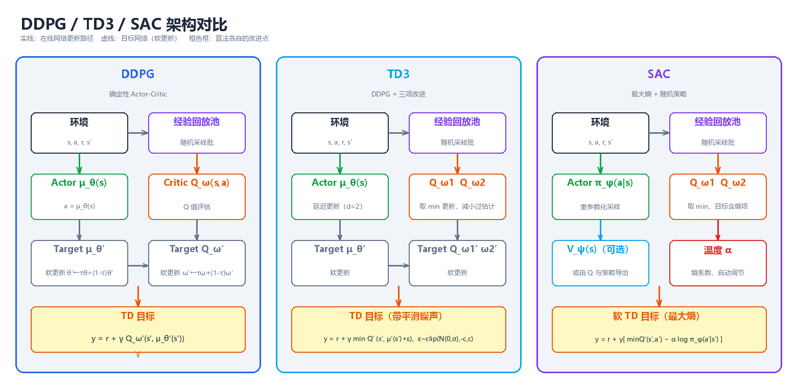
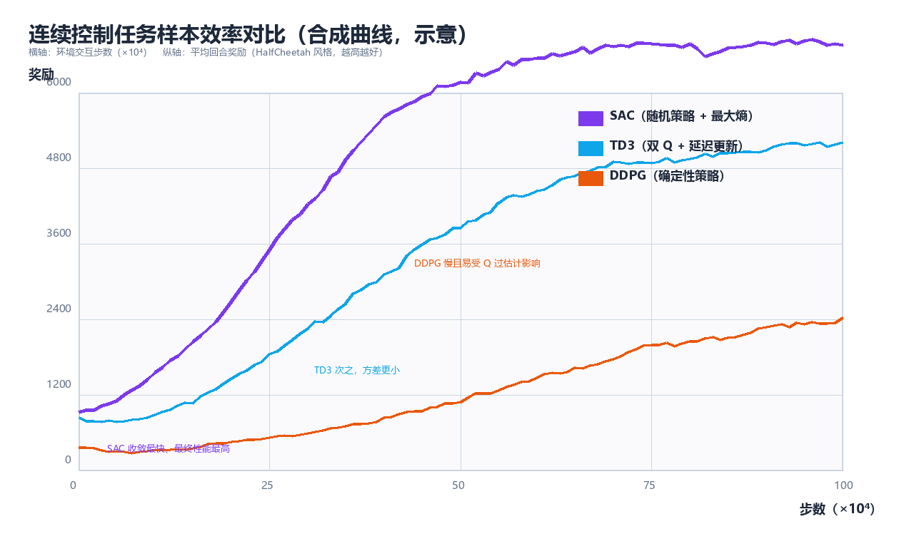

# 连续控制（Continuous Control）

> 前面几章的 Q-Learning、SARSA 乃至 DQN，全部建立在**离散动作**之上：
> 动作集合 $\\mathcal{A}$ 是有限个选项，`max` 可以在表或网络上**逐项扫描**。
> 但真实世界是连续的——机械臂的关节角度、自动驾驶的方向盘转角、四足
> 机器人的腿部力矩，都是实数。当动作空间变成连续区间 $[a_{\\min}, a_{\\max}]^d$，
> "对动作求最大值"这一 Q-Learning 的核心操作立刻失效：你无法枚举无穷多个
> 候选动作。本章围绕连续控制（continuous control）展开三条主线：**确定性
> 策略梯度**（Deterministic Policy Gradient, DPG）从理论上回答"策略梯度
> 如何避开动作积分"；**DDPG** 把 DPG 搬进深度网络；**TD3** 与 **SAC**
> 则分别从"修 DDPG 的毛病"与"换一套最大熵目标"两个方向把它推向实用。
> 全文假设读者已掌握第 4 章（TD）、第 5 章（值函数逼近与 DQN）与第 6 章
> （策略梯度）的内容；代码全部为可运行的 Python 3 + NumPy 实现，不依赖
> PyTorch / Gym / MuJoCo 等重型依赖。

---

## 一、连续动作空间的挑战

### 1.1 问题设定：从格子世界到关节空间

在离散设定下，一个 RL 问题由四元组 $(\\mathcal{S}, \\mathcal{A}, P, R)$ 刻画，
动作空间 $\\mathcal{A} = \\{a_1, a_2, \\dots, a_K\\}$ 是**有限集合**。连续控制问题
则把动作空间换成 $d$ 维实向量空间的一个子集：

$$\\mathcal{A} = \\{ a \\in \\mathbb{R}^d \\;:\\; a_{\\min}^{(i)} \\le a^{(i)} \\le a_{\\max}^{(i)},\\ i=1,\\dots,d \\}$$

典型例子：

| 任务 | 状态 $s$ | 动作 $a$ | 动作维度 $d$ |
|------|---------|---------|-------------|
| 倒立摆 Pendulum | 角度、角速度 | 力矩 | 1 |
| 双足/四足行走 | 关节角度、角速度、朝向 | 各关节力矩 | 6 ~ 17 |
| 机械臂抓取 | 关节状态 + 目标位姿 | 关节力矩/位置增量 | 4 ~ 9 |
| 自动驾驶 | 车辆状态 + 感知 | 油门、刹车、转向 | 2 ~ 3 |
| 无人机悬停 | 姿态、角速度 | 各旋翼推力 | 4 |

> **核心思想**：连续控制与离散控制**只有一处本质区别**——策略的表示与
> 优化方式。价值函数、贝尔曼方程、策略梯度定理这些"骨架"全部照常成立，
> 真正被打破的是"**对动作空间取 max**"这个查表时代的廉价操作。

### 1.2 为什么 Q-Learning 在连续动作下失效

Q-Learning 的更新依赖**贪心自举**：

$$Q(s,a) \\leftarrow Q(s,a) + \\alpha\\left[ r + \\gamma \\max_{a'} Q(s', a') - Q(s,a) \\right]$$

在连续动作下，$\\max_{a'} Q(s', a')$ 变成对 $d$ 维实向量求**全局最大值**，
这带来三重困难：

1. **不可枚举**：$a'$ 有不可数无穷多个候选，无法像离散表那样逐项扫描。
2. **非凸优化**：神经网络拟合的 $Q(s', \\cdot)$ 关于动作 $a'$ 是高度非凸、
   非光滑的函数，用梯度上升只能找到局部最优，且每次更新都要额外做一次
   内层优化循环，代价高昂。
3. **误差放大**：即便用"取最大采样动作"近似 $\\max$，最大化偏差（第 4 章
   Double Q-Learning 讨论过的问题）在连续空间只会更严重——候选越多，
   过估计越强。

**离散化**（把连续动作均匀切格）是直觉上最简单的补救，但随即撞上维度
灾难（curse of dimensionality）：

| 动作维度 $d$ | 每维 10 格 | 每维 100 格 |
|-------------|-----------|------------|
| 1 | $10$ | $100$ |
| 2 | $10^2 = 100$ | $10^4 = 10{,}000$ |
| 6（六关节机械臂） | $10^6$ | $10^{12}$ |
| 17（四足机器人） | $10^{17}$ | $10^{34}$ |

格子数随维度**指数爆炸**；且离散化引入量化误差，动作永远无法精确落在
目标点（例如"恰好施加 3.14159 N·m"）。因此连续控制必须换一条路：**让
策略直接输出实数动作**，而不是在动作空间里搜索。

### 1.3 连续控制问题的分类

| 分类维度 | 类别 | 说明 | 代表算法 |
|---------|------|------|---------|
| 动作维度 | 单维（$d=1$） | 如 Pendulum、CartPole 连续版 | 任何方法 |
| | 高维（$d \\ge 6$） | 关节空间、力矩控制 | TD3 / SAC 优势明显 |
| 策略形式 | 确定性策略 | $a = \\mu_\\theta(s)$，输出单点 | DPG、DDPG、TD3 |
| | 随机策略 | $a \\sim \\pi_\\theta(\\cdot\\|s)$，输出分布 | PPO、SAC |
| 采样方式 | on-policy | 用当前策略采的数据更新 | PPO、TRPO、A3C |
| | off-policy | 用经验回放池的旧数据更新 | DDPG、TD3、SAC |
| 任务类型 | 回合制（episodic） | 有终止状态 | Pendulum、HalfCheetah |
| | 持续型（continuing） | 无终止，无限交互 | 过程控制、股票交易 |

### 1.4 离散 vs 连续：一张总对比表

| 维度 | 离散动作 | 连续动作 |
|------|---------|---------|
| 动作表示 | 有限集合 $\\{a_1,\\dots,a_K\\}$ | 实数区间 $[a_{\\min},a_{\\max}]^d$ |
| 贪心选择 | 扫描 $\\max_a Q(s,a)$，$O(K)$ | 需内层优化，不可行 |
| 策略输出 | 概率分布 $\\pi(a\\|s) \\in \\Delta^{K-1}$ | 实数向量 / 分布参数（均值、方差） |
| 探索 | ε-greedy 随机挑一个动作 | 加噪声 / 从分布采样 |
| 典型算法 | Q-Learning、SARSA、DQN | DDPG、TD3、SAC、PPO |
| 表格法可行？ | 状态数有限时可查表 | 几乎必须函数逼近 |
| 主要难点 | 探索-利用权衡、过估计 | 上述全部 + 动作优化不可行 |

### 1.5 连续动作空间的三大工程难点

即使放弃 Q-Learning 改用策略梯度，连续控制仍要面对三个独有的工程问题：

1. **探索（exploration）**：确定性策略输出一个点，如何保证探索充分？
   答案通常是"行为策略 = 确定性策略 + 噪声"，或直接学一个随机策略。
2. **稳定性（stability）**：Actor-Critic 里两个网络互相"追着更新"，
   自举 + 函数逼近 + off-policy 三者叠加（第 5 章"致命三要素"），
   训练极易发散。
3. **动作边界（action bound）**：力矩有上下限，策略输出必须被夹在
   $[a_{\\min}, a_{\\max}]$ 内；直接把网络输出 clip 会破坏梯度，用 tanh
   压缩则要处理分布变形（第 7 章详述）。

### 1.6 从 Q-Learning 到 SAC：演进路线图

```
Q-Learning（离散表）                    连续动作
   │  max 不可行                            │
   ▼                                        ▼
DQN（离散，深度网络）          ┌──────────────────────────────┐
   │  argmax 仍不可行          │  策略梯度 π_θ(a|s)：输出分布  │
   ▼                          │     ∇J = E[∇logπ · Q]         │
策略梯度（REINFORCE）◄─────────┘    但方差大、需要积分          │
   │  方差大，需 critic 引导              │                     │
   ▼                                      ▼                    │
Actor-Critic（A2C/A3C）          确定性策略 μ_θ(s)：输出单点    │
   │                                DPG 定理（2014）           │
   ▼                                      │                    │
DDPG（2016）◄─────────────────────────────┘                    │
   │   Q 过估计、超参敏感                                       │
   ├──────────────► TD3（2018）：修 DDPG 的三个毛病             │
   │                                                           │
   └──────────────► SAC（2018）：最大熵 + 随机策略，另起炉灶     │
```

> **核心思想**：连续控制的两条技术路线泾渭分明——**确定性派**（DPG →
> DDPG → TD3）坚持"策略输出一个动作点"，靠目标网络、双 Q、延迟更新
> 等技巧稳住训练；**随机派**（PPO → SAC）坚持"策略输出一个分布"，
> 靠熵正则化在探索与利用之间自动平衡。SAC 是两者的交汇：它用随机
> 策略 + 熵目标，却继承了 TD3 的双 Q 与目标网络。

---

## 二、确定性策略梯度（DPG）

### 2.1 随机策略梯度回顾：REINFORCE 与 Actor-Critic

第 6 章给出的随机策略梯度定理（stochastic policy gradient theorem）：

$$
\\nabla_\\theta J(\\pi_\\theta) = \\mathbb{E}_{s \\sim \\rho^{\\pi},\\; a \\sim \\pi_\\theta} \\left[ \\nabla_\\theta \\log \\pi_\\theta(a|s) \\, Q^{\\pi}(s,a) \\right]
$$

其中 $\\rho^{\\pi}$ 是策略 $\\pi$ 下的状态分布。这个式子对动作空间没有
任何限制——理论上连续动作也能用。但把它工程化时暴露出两个问题：

1. **方差大**：$\\nabla_\\theta \\log \\pi_\\theta(a|s)$ 需要对动作积分求
   期望；动作维度越高、分布越宽，估计方差越大。
2. **动作积分**：critic 对动作的依赖 $Q^{\\pi}(s,a)$ 仍然要"遍历"动作空间
   来求期望，连续空间下没有解析形式。

### 2.2 确定性策略：让策略直接输出动作

定义**确定性策略**（deterministic policy）为映射：

$$\\mu_\\theta: \\mathcal{S} \\to \\mathcal{A}, \\qquad a = \\mu_\\theta(s)$$

它不输出分布，只输出**一个动作点**。其目标函数为：

$$J(\\mu_\\theta) = \\mathbb{E}_{s \\sim \\rho^{\\mu}} \\left[ R(s, \\mu_\\theta(s)) \\right]$$

随机策略通过"在状态 $s$ 处对动作求期望"来评估，而确定性策略直接代入
$\\mu_\\theta(s)$——**动作积分消失了**。这正是 DPG 的出发点：既然决策时
只用一个动作，评估时也不必对动作求期望。

| 对比项 | 随机策略 $\\pi_\\theta(a\\|s)$ | 确定性策略 $\\mu_\\theta(s)$ |
|-------|------------------------------|------------------------------|
| 输出 | 分布（如高斯均值+方差） | 单个动作点 |
| 目标 | $J = \\mathbb{E}_{s,a}[r]$（对动作求期望） | $J = \\mathbb{E}_s[r(s,\\mu_\\theta(s))]$（无动作积分） |
| 梯度 | $\\nabla_\\theta \\log \\pi_\\theta(a\\|s)$ | $\\nabla_\\theta \\mu_\\theta(s)$（链式法则） |
| 方差 | 高（含动作采样噪声） | 低（无动作采样） |
| 探索 | 内建（从分布采样） | 无内建探索，需外部加噪声 |
| 数据效率 | 低（on-policy 限制） | 高（天然 off-policy） |

### 2.3 DPG 定理

Silver 等人（2014）证明：确定性策略的梯度可以写成**动作值函数对动作的
梯度**与**策略对参数的梯度**之积的期望：

$$
\\boxed{\\; \\nabla_\\theta J(\\mu_\\theta) = \\mathbb{E}_{s \\sim \\rho^{\\mu}} \\left[ \\left. \\nabla_a Q^{\\mu}(s,a) \\right|_{a = \\mu_\\theta(s)} \\cdot \\nabla_\\theta \\mu_\\theta(s) \\right] \\;}
$$

直觉拆解：

```
                    动作空间中的"上升方向"
  ∇_a Q^μ(s,a) ────►  Q 关于 a 的梯度：告诉我"动作往哪个方向调，回报涨得快"
                         │
                         ▼
  ∇_θ μ_θ(s)  ────►  策略关于 θ 的梯度：告诉我"参数往哪个方向调，动作往那边走"
                         │
                         ▼
  两者内积（逐元素相乘后求和）= 沿 Q 上升方向调整策略参数
```

> **核心思想**：DPG 定理把"策略优化"变成**链式法则的一步**——先问 critic
> "动作该往哪调"（$\\nabla_a Q$），再问 actor "参数该往哪调"（$\\nabla_\\theta \\mu$），
> 两者相乘即得策略梯度。**无需对动作积分，无需 importance sampling**，
> 这是确定性策略在连续控制中得以实用的数学根基。

与随机策略梯度的形式对比（注意随机版是 $\\nabla_\\theta \\log \\pi$，DPG 是
$\\nabla_\\theta \\mu$）：

| | 随机策略梯度（SPG） | 确定性策略梯度（DPG） |
|---|---|---|
| 梯度式 | $\\mathbb{E}\\left[\\nabla_\\theta \\log \\pi_\\theta(a\\|s)\\, Q(s,a)\\right]$ | $\\mathbb{E}\\left[\\nabla_a Q(s,a)\\,\\nabla_\\theta \\mu_\\theta(s)\\right]$ |
| 对动作求期望 | 需要（$a \\sim \\pi$ 采样） | 不需要（代入 $\\mu_\\theta(s)$） |
| 适用动作空间 | 离散、连续均可 | 主要面向连续 |
| 探索 | 分布内建 | 外部噪声 |
| 方差 | 较高 | 较低 |
| off-policy 便利性 | 需重要性采样修正 | 天然兼容经验回放 |

**DPG 与 off-policy 的天然契合**：DPG 的目标是 $\\mathbb{E}_{s \\sim \\rho^{\\mu}}$，
其中 $\\rho^{\\mu}$ 是**目标策略** $\\mu$ 的平稳分布。但注意梯度式中没有
$\\log$ 项，也就没有"行为策略 vs 目标策略"的概率比——这正是 off-policy
学习最麻烦的 importance ratio。因此 DPG 可以放心地用一个**带探索噪声的
行为策略** $\\beta(a|s) = \\mu_\\theta(s) + \\mathcal{N}(0,\\sigma^2)$ 去采集
数据、存入回放池，再反复用这些旧数据更新 $\\mu_\\theta$。

### 2.4 从 DPG 到 Actor-Critic 形式

DPG 定理假设已知 $Q^{\\mu}$。实际中 $Q$ 未知，用参数化 $Q^{\\omega}(s,a)$
逼近（critic），于是得到 **Actor-Critic 形式的 DPG**：

$$
\\nabla_\\theta J \\approx \\mathbb{E}_{s \\sim \\mathcal{D}} \\left[ \\nabla_a Q^{\\omega}(s,a)\\big|_{a=\\mu_\\theta(s)} \\, \\nabla_\\theta \\mu_\\theta(s) \\right]
$$

其中 $\\mathcal{D}$ 是经验回放池。Critic 本身用 TD 误差训练（第 4 章）：

$$
\\mathcal{L}(\\omega) = \\mathbb{E}_{(s,a,r,s') \\sim \\mathcal{D}} \\left[ \\left( Q^{\\omega}(s,a) - \\underbrace{\\left(r + \\gamma Q^{\\omega}(s', \\mu_\\theta(s'))\\right)}_{\\text{TD 目标}} \\right)^2 \\right]
$$

> **核心思想**：DPG 把问题干净地劈成两半——**critic 负责"评估"**（拟合
> $Q$，最小化 TD 误差），**actor 负责"改进"**（沿 $\\nabla_a Q$ 方向走）。
> 两者交替更新，就是 DPG 的完整学习循环。这个框架在 2014 年提出时用线性
> 函数逼近，两年后 Lillicrap 等人用深度网络替换所有线性组件，就有了 DDPG。

---

## 三、DDPG：深度确定性策略梯度

### 3.1 算法定位

**DDPG**（Deep Deterministic Policy Gradient，Lillicrap et al., 2016）把
DPG 定理搬进深度网络，是**第一个能端到端处理连续动作的深度 RL 算法**。
它在 DQN 的四个"稳定化组件"（经验回放、目标网络、off-policy 采样、
批量更新）之上，用 Actor-Critic 结构替换了"argmax 查表"。

```
┌────────────────────────── DDPG 四大组件 ──────────────────────────┐
│                                                                    │
│  Actor μ_θ(s)         Critic Q_ω(s,a)        经验回放 D             │
│  输入：状态 s          输入：状态 s + 动作 a   存 (s,a,r,s') 元组    │
│  输出：动作 a           输出：标量 Q 值         随机批量采样更新      │
│  更新：DPG 梯度上升     更新：TD 误差下降       打破样本相关性        │
│                                                                    │
│  Target μ_θ′(s)       Target Q_ω′(s,a)                             │
│  目标策略（软更新）    目标价值（软更新）                            │
└────────────────────────────────────────────────────────────────────┘
```

### 3.2 网络结构与更新公式

**Critic 更新**（最小化 TD 误差）：

$$
\\mathcal{L}(\\omega) = \\mathbb{E}_{(s,a,r,s') \\sim \\mathcal{D}} \\left[ \\left( Q_\\omega(s,a) - y \\right)^2 \\right], \\qquad
y = r + \\gamma\\, Q_{\\omega'}\\left(s', \\mu_{\\theta'}(s')\\right)
$$

注意 TD 目标里的 $Q$ 与 $\\mu$ 都来自**目标网络**（参数 $\\omega', \\theta'$）。

**Actor 更新**（沿 DPG 方向上升）：

$$
\\nabla_\\theta J \\approx \\mathbb{E}_{s \\sim \\mathcal{D}} \\left[ \\nabla_a Q_\\omega(s,a)\\big|_{a=\\mu_\\theta(s)} \\, \\nabla_\\theta \\mu_\\theta(s) \\right]
$$

> **核心思想**：DDPG 的 Actor 更新把 critic 当作"免费的打分器"——对一批
> 状态 $s$，计算 $\\mu_\\theta(s)$ 在 critic 眼中的梯度，然后**让策略参数沿
> 这个方向走**。Critic 越准，这个"上升方向"越可信；所以 critic 必须先用
> 大量 TD 更新训练好，actor 才有意义。

### 3.3 目标网络与软更新（soft update）

DDPG 没有像 DQN 那样"定期硬拷贝"（hard copy）目标网络，而是采用**软更新**
（polyak averaging）：

$$
\\theta' \\leftarrow \\tau\\,\\theta + (1-\\tau)\\,\\theta', \\qquad
\\omega' \\leftarrow \\tau\\,\\omega + (1-\\tau)\\,\\omega'
$$

其中 $\\tau \\in (0,1)$ 通常取 **0.005**。每步更新后，目标参数向在线参数
"挪一小步"。对比 DQN 的硬更新：

| 更新方式 | 公式 | 特点 | DQN | DDPG |
|---------|------|------|-----|------|
| 硬更新 | $\\theta' \\leftarrow \\theta$（每 $C$ 步） | 目标跳变，训练不稳 | 用 | 不用 |
| 软更新 | $\\theta' \\leftarrow \\tau\\theta + (1-\\tau)\\theta'$ | 目标平滑渐变，稳 | 不用 | 用 |

> **核心思想**：TD 目标是"自举"的——用它更新在线网络，等于用旧估计训练
> 新估计。如果目标网络跟在线网络**同步更新**，目标值会跟着估计一起漂移，
> 形成正反馈震荡。软更新让目标值**缓慢跟踪**而非步步紧咬，从机制上抑制
> 发散。$\\tau$ 越小目标越稳，但收敛越慢。

### 3.4 经验回放：为什么 DDPG 必须 off-policy

DDPG 的 actor 更新需要 $\\nabla_a Q_\\omega(s,a)$——这个梯度**与行为策略
无关**（见 2.3 节），所以历史数据可以反复使用。经验回放带来两个收益：

1. **打破时间相关性**：连续交互的 $(s_t, a_t, r_t, s_{t+1})$ 高度相关，
   直接在线更新等价于在一条"弯曲的轨迹"上做梯度下降，方差大；随机
   批量采样打乱顺序，近似 i.i.d. 条件。
2. **数据复用**：每个样本可被使用多次，样本效率（sample efficiency）
   远高于 on-policy 的 PPO/A3C。

### 3.5 探索：确定性策略的"外部噪声"

确定性策略本身**没有探索机制**（输出单点）。DDPG 的探索完全靠**行为策略
加噪**：

$$
a_t = \\mu_\\theta(s_t) + \\mathcal{N}_t
$$

Lillicrap 原文用 **OU 噪声**（Ornstein-Uhlenbeck 过程，一种时间相关的
有色噪声，适合惯性系统）；实践中多数实现直接用**高斯噪声**，效果相当：

| 噪声类型 | 定义 | 特点 | 实际使用 |
|---------|------|------|---------|
| OU 噪声 | $dx_t = \\theta(\\mu - x_t)dt + \\sigma dW_t$ | 时间相关、平滑 | 原文推荐，实现复杂 |
| 高斯噪声 | $\\mathcal{N}(0, \\sigma^2)$ | 每步独立 | 简单，常用 |
| 动作抖动 | 训练早期 $\\sigma$ 大，后期衰减 | 简单有效 | 工程上最常见 |

> **核心思想**：DDPG 的探索与利用是**解耦**的——学的是确定性策略 $\\mu_\\theta$，
> 采数据时临时加噪声。噪声只存在于"行为策略"，不进入"目标策略"，
> 所以评估/部署时直接去掉噪声即可。

### 3.6 DDPG 完整伪代码

```
算法：DDPG（深度确定性策略梯度）
─────────────────────────────────────────────────────────────
输入：随机初始化 Actor μ_θ 与 Critic Q_ω
      初始化目标网络 θ′ ← θ, ω′ ← ω
      初始化经验回放池 D，容量 N

1  for episode = 1, 2, ... do:
2      初始化探索噪声 N（如高斯噪声 σ）
3      获取初始状态 s₁
4      for t = 1, 2, ..., T do:
5          按行为策略选动作:  aₜ = μ_θ(sₜ) + Nₜ        # 探索
6          执行 aₜ，观测奖励 rₜ 与下一状态 sₜ₊₁
7          存入回放池:  D ← D ∪ {(sₜ, aₜ, rₜ, sₜ₊₁)}
8          从 D 随机采样一批 B = {(sᵢ, aᵢ, rᵢ, sᵢ′)}, |B| = m
9          # —— 更新 Critic（TD 误差最小化）——
10         yᵢ = rᵢ + γ · Q_ω′(sᵢ′, μ_θ′(sᵢ′))            # 目标网络计算目标
11         梯度下降:  ω ← ω − η_ω ∇_ω (1/m)Σ (Q_ω(sᵢ,aᵢ) − yᵢ)²
12         # —— 更新 Actor（DPG 梯度上升）——
13         ∇_θ J ≈ (1/m) Σ ∇_a Q_ω(sᵢ,a)|_{a=μ_θ(sᵢ)} · ∇_θ μ_θ(sᵢ)
14         梯度上升:  θ ← θ + η_θ ∇_θ J
15         # —— 软更新目标网络 ——
16         θ′ ← τθ + (1−τ)θ′
17         ω′ ← τω + (1−τ)ω′
18      end for
19  end for
─────────────────────────────────────────────────────────────
```

### 3.7 训练循环：数据流全景

```
        ┌────────────────────────────────────────────────────┐
        │                   环境 Environment                │
        │                                                    │
        │   sₜ ──► 行为策略 μ_θ(sₜ) + 噪声 ──► aₜ            │
        │                                                    │
        └───────┬───────────────────────────────▲────────────┘
                │ (sₜ, aₜ, rₜ, sₜ₊₁)           │ sₜ₊₁
                ▼                               │
        ┌───────────────┐                       │
        │  经验回放池 D  │───────────────────────┘
        └───────┬───────┘
                │ 随机采样一批 (s, a, r, s′)
                ▼
   ┌────────────────────────────── 参数更新 ─────────────────────────────┐
   │                                                                    │
   │  Critic Q_ω:  y = r + γ Q_ω′(s′, μ_θ′(s′))     ──►  最小化 (Q−y)²  │
   │  Actor  μ_θ:  ∇_θ J = ∇_a Q_ω(s,a)·∇_θ μ_θ(s)  ──►  梯度上升       │
   │  目标网络:     θ′←τθ+(1−τ)θ′    ω′←τω+(1−τ)ω′                     │
   └────────────────────────────────────────────────────────────────────┘
```

### 3.8 DDPG 的已知问题

DDPG 是里程碑，但工程上"出名地难调"。问题集中在三处：

| 问题 | 机理 | 后果 | 缓解 |
|------|------|------|------|
| **Q 过估计** | 最大化偏差 + 自举：$Q$ 目标里的 $\\max$（此处为"取 $\\mu'$ 的输出"）系统性高估真实值 | 价值发散、策略走向"虚高"动作 | Double Q-Learning 思想 → TD3 |
| **超参数敏感** | Actor/Critic 学习率、$\\tau$、噪声尺度、网络宽度互相耦合 | 同环境不同种子方差大 | 延迟更新、目标平滑 → TD3 |
| **训练不稳定** | 自举 + 函数逼近 + off-policy 三要素叠加 | Q 值漂移、策略崩溃（输出贴边界） | 双 Q、正则化、reward scaling |
| **探索不足** | 确定性策略 + 高斯噪声在复杂地形易陷入局部 | 学不到跳跃/多模态行为 | 随机策略 + 熵 → SAC |

> **核心思想**：DDPG 的所有毛病，根源几乎都是"**用单个 $Q$ 的梯度
> 同时驱动价值估计与策略改进**"——$Q$ 一旦高估，Actor 就被带偏，
> 而 Actor 变偏又反过来污染 $Q$ 的训练数据。TD3 的三大改进全部围绕
> "让 $Q$ 的估计更保守、更稳"展开；SAC 则干脆换掉目标函数。

---

## 四、TD3：DDPG 的三项改进

### 4.1 算法定位

**TD3**（Twin Delayed DDPG，Fujimoto et al., 2018）的论文标题就是
"Addressing Function Approximation Error in Actor-Critic Methods"——
它系统分析了 Actor-Critic 方法中**函数逼近误差**的来源，并给出三项
针对性修补。TD3 不是新算法，而是"DDPG 的正确工程形态"，在连续控制
基准上全面超越 DDPG，且超参数鲁棒性显著更好。

```
DDPG 的三个病灶 ──► TD3 的三剂药
─────────────────────────────────────────────────────────────
① Q 过估计（单个 Q 自举放大）        ──►  ① Clipped Double-Q
     用两个 Q 网络，目标取 min
② Actor 更新太快，跟着坏 Q 跑        ──►  ② Delayed Policy Updates
     Actor 每 d 步（如 2 步）才更新一次
③ 确定性目标动作对 Q 尖峰敏感        ──►  ③ Target Policy Smoothing
     目标动作加裁剪噪声，正则化 Q
```

### 4.2 改进一：Clipped Double-Q Learning（裁剪双 Q）

**问题**：Q-Learning 类方法天然过估计——$\\mathbb{E}[\\max X] \\ge \\max \\mathbb{E}[X]$
（Jensen 不等式）。DDPG 的 TD 目标 $y = r + \\gamma Q_{\\omega'}(s', \\mu_{\\theta'}(s'))$
把"$\\mu'$ 的输出"当作最优动作，等价于对 $Q$ 做了一次隐式 max，误差
随训练不断放大。更糟的是，**策略改进会放大 critic 误差**：Actor 专门
往 $Q$ 高估的方向走，于是 critic 的误差被"针对性利用"（exploited by
policy improvement）。

**药方**：训练**两个独立的 Critic** $Q_{\\omega_1}, Q_{\\omega_2}$，更新时
**取两者中较小的**作为 TD 目标：

$$
y = r + \\gamma\\, \\min_{i=1,2} Q_{\\omega_i'}\\left(s', \\tilde a'\\right)
$$

两个网络用不同的初始化、不同的数据批次训练，它们的过估计误差**相互
独立**；取 min 后，偏置被抵消到"低估"一侧。低估虽然也偏离真值，但
**不会诱发策略利用**——Actor 无法靠钻空子获得虚假高分，训练反而稳定。

> **核心思想**：Double Q-Learning（第 4 章）用"两个 Q 解耦选择与评估"
> 消除最大化偏差；TD3 的 clipped double-Q 更直接——**用 min 制造一个
> 保守的（pessimistic）目标**。宁可低估，不可高估：低估只是收敛慢，
> 高估会导致发散。注意与 Double DQN 的区别：DDQN 是"用 $Q_A$ 选、
> $Q_B$ 评"；TD3 是两个网络独立训练、直接取 min。

| 对比 | Double DQN | Clipped Double-Q（TD3） |
|------|-----------|------------------------|
| 网络数 | 两个 Q（在线+目标） | 两个独立 Q，各自带目标 |
| 目标构造 | $Q_B(s', \\arg\\max_a Q_A(s',a))$ | $\\min(Q_1', Q_2')$ |
| 机制 | 解耦选择与评估 | 取最小，直接压低目标 |
| 适用 | 离散动作 | 连续动作（配合 Actor） |
| 偏差方向 | 消除高估偏置 | 主动引入轻微低估 |

**关于"两个 Critic 谁用来更新 Actor"**：Actor 的梯度用**较小的那个**
$Q$ 计算（实践中最稳），即 $\\nabla_\\theta J \\approx \\mathbb{E}[\\nabla_a
\\min_i Q_{\\omega_i}(s,a) \\cdot \\nabla_\\theta \\mu_\\theta(s)]$。

### 4.3 改进二：Delayed Policy Updates（延迟策略更新）

**问题**：Actor 与 Critic 交替更新时，critic 还没收敛，actor 就沿着
**误差很大的** $\\nabla_a Q$ 方向大步走。两者互相追逐，形成"critic 追
不上 actor"的正反馈震荡。Fujimoto 等人的实验显示：**critic 误差大时
actor 更新越快，策略越差**。

**药方**：**延迟更新**——critic 每步都更新，actor（及其目标网络）
每 $d$ 步才更新一次（默认 $d = 2$）：

```
时间步    1   2   3   4   5   6   7   8   ...
Critic    ✓   ✓   ✓   ✓   ✓   ✓   ✓   ✓   （每步更新，先学好 Q）
Actor         ✓       ✓       ✓       ✓   （每 d=2 步更新）
```

> **核心思想**：先让 critic"多学一会儿"、把 $\\nabla_a Q$ 校准准，再让
> actor 动。相当于把"走一步看一步"改成"**多看几步再走一步**"——用
> 时间换稳定。目标网络的软更新同步推迟，保证 actor 的目标 $\\mu_{\\theta'}$
> 不会在 actor 更新之间漂移太远。

### 4.4 改进三：Target Policy Smoothing（目标策略平滑）

**问题**：确定性策略的 TD 目标 $y = r + \\gamma Q'(s', \\mu'(s'))$ 对 $Q'$
的**尖峰（sharp peak）**极其敏感——若 $Q'$ 在某个动作附近有个假的高峰，
目标值会被瞬间抬高。连续动作空间里这种"假峰"几乎必然存在（高维非凸
拟合的副产品）。

**药方**：给目标动作**加裁剪后的噪声**，构造一个"以 $\\mu'(s')$ 为中心
的邻域"，让 TD 目标对尖峰不敏感：

$$
\\tilde a' = \\operatorname{clip}\\Big( \\mu_{\\theta'}(s') + \\operatorname{clip}(\\varepsilon,\\, -c,\\, c),\\; a_{\\min},\\; a_{\\max} \\Big), \\qquad
\\varepsilon \\sim \\mathcal{N}(0, \\sigma^2)
$$

默认 $\\sigma = 0.2,\\; c = 0.5$。这等价于在目标动作邻域内**对 Q 做平滑
（smoothing）**——类似 SARSA 用期望替代 max 的效果，也类似正则化：

| 视角 | 解释 |
|------|------|
| 正则化视角 | 对 $Q$ 施加局部平滑惩罚，抑制"假峰" |
| SARSA 视角 | 从"取最优动作"退化为"取邻域内动作的期望"，方差更低 |
| 对抗视角 | 让 $Q$ 对动作扰动鲁棒，类似对抗训练 |

> **核心思想**：三项改进的**分工**——双 Q 压低**偏差**（过估计），延迟
> 更新控制**误差传播速度**，目标平滑压低**方差**（尖峰敏感性）。三者
> 合起来把 DDPG 的"脆弱"变成 TD3 的"稳健"。

### 4.5 每项改进解决了什么：对照表

| DDPG 的病灶 | TD3 的改进 | 误差类型 | 机制 | 默认超参 |
|------------|-----------|---------|------|---------|
| 单 Q 过估计被策略利用 | Clipped Double-Q | 偏差（bias） | 两个 Q 取 min | 2 个 Critic |
| Actor 追着坏梯度跑 | Delayed Policy Updates | 误差传播 | Actor 每 $d$ 步更新 | $d=2$ |
| 确定性目标对尖峰敏感 | Target Policy Smoothing | 方差（variance） | 目标动作加裁剪噪声 | $\\sigma=0.2,\\;c=0.5$ |

### 4.6 TD3 完整伪代码

```
算法：TD3（Twin Delayed DDPG）
─────────────────────────────────────────────────────────────
输入：随机初始化 Actor μ_θ，两个 Critic Q_ω₁, Q_ω₂
      目标网络 θ′←θ, ω₁′←ω₁, ω₂′←ω₂；回放池 D；延迟周期 d=2

1  for t = 1, 2, ... do:
2      选择动作:   aₜ = clip(μ_θ(sₜ) + εₜ, a_min, a_max),  εₜ~N(0,σ)   # 探索
3      执行 aₜ，观测 rₜ, sₜ₊₁；存入 D
4      从 D 采样一批 B = {(sᵢ, aᵢ, rᵢ, sᵢ′)}
5      # —— 目标动作平滑 ——
6      ã′ = clip( μ_θ′(sᵢ′) + clip(ε′, −c, c), a_min, a_max ),  ε′~N(0,σ)
7      # —— 更新两个 Critic（取 min 目标）——
8      yᵢ = rᵢ + γ · min(Q_ω₁′(sᵢ′, ã′), Q_ω₂′(sᵢ′, ã′))
9      ωⱼ ← ωⱼ − η_ω ∇_ωⱼ (1/m)Σ (Q_ωⱼ(sᵢ,aᵢ) − yᵢ)² ,  j = 1, 2
10     # —— 延迟更新 Actor 与目标网络 ——
11     if t mod d == 0:
12         ∇_θ J ≈ (1/m) Σ ∇_a min(Q_ω₁(sᵢ,a), Q_ω₂(sᵢ,a))|_{a=μ_θ(sᵢ)} · ∇_θ μ_θ(sᵢ)
13         θ ← θ + η_θ ∇_θ J
14         θ′ ← τθ + (1−τ)θ′
15         ω₁′ ← τω₁ + (1−τ)ω₁′
16         ω₂′ ← τω₂ + (1−τ)ω₂′
17  end for
─────────────────────────────────────────────────────────────
```

### 4.7 DDPG vs TD3：差异总表

| 维度 | DDPG | TD3 |
|------|------|-----|
| Critic 数量 | 1 个 | **2 个**（取 min） |
| TD 目标 | $r + \\gamma Q'(s', \\mu'(s'))$ | $r + \\gamma \\min_i Q_i'(s', \\tilde a')$ |
| 目标动作 | 确定性 $\\mu'(s')$ | **加裁剪噪声** $\\tilde a'$ |
| Actor 更新频率 | 每步 | **每 $d=2$ 步** |
| 目标网络更新 | 每步软更新 | 与 Actor 同步（每 $d$ 步） |
| 探索噪声 | OU / 高斯 | 高斯 + clip |
| 过估计 | 严重 | 基本消除（转为轻微低估） |
| 超参数鲁棒性 | 差 | **好** |
| 典型性能（HalfCheetah） | 约 2000~3000 | 约 5000~8000 |

---

## 五、SAC：最大熵强化学习

### 5.1 换个目标：从"只求回报最大"到"回报 + 熵"

DDPG/TD3 的策略目标是**纯回报**：$J = \\mathbb{E}[\\sum_t \\gamma^t r_t]$。
**SAC**（Soft Actor-Critic，Haarnoja et al., 2018）引入**最大熵框架**
（maximum entropy RL），目标函数在回报之外加上策略的**熵**：

$$
J(\\pi) = \\mathbb{E}_{(s_t,a_t) \\sim \\rho_\\pi} \\left[ \\sum_{t=0}^{\\infty} \\gamma^t \\Big( r(s_t,a_t) + \\alpha\\, \\mathcal{H}\\big(\\pi(\\cdot|s_t)\\big) \\Big) \\right]
$$

其中熵的定义与温度系数：

$$
\\mathcal{H}\\big(\\pi(\\cdot|s)\\big) = -\\mathbb{E}_{a \\sim \\pi} \\left[ \\log \\pi(a|s) \\right], \\qquad \\alpha > 0
$$

$\\alpha$ 称为**温度系数**（temperature），权衡"回报"与"随机性"两个
目标。$\\alpha \\to 0$ 时退化为标准 RL；$\\alpha$ 越大，策略越"贪玩"。

> **核心思想**：标准 RL 问"哪个动作回报最高"；最大熵 RL 问"**在回报
> 不差太多的前提下，哪个策略最随机**"。熵项让策略在多个近似最优动作
> 之间保持**多模态**，而不是武断地锁死其中一个——这对连续控制格外
> 有价值，因为连续空间里"次优动作"往往一抓一大把。

### 5.2 熵正则的意义：探索、鲁棒与多模态

| 收益 | 机理 |
|------|------|
| **内建探索** | 高熵策略自动在动作空间广泛采样，无需外部噪声（对比 DDPG 的 OU/高斯噪声） |
| **鲁棒性** | 策略不依赖"单一最优动作"，对扰动、模型误差、对手干扰更稳 |
| **避免过早收敛** | 熵惩罚阻止策略在训练早期就"锁死"一个次优动作 |
| **多模态策略** | 当多个动作等价最优（如对称任务），策略学成混合分布而非随机选一个 |
| **加速后续任务** | 高熵策略覆盖更多状态-动作空间，便于迁移/元学习 |

### 5.3 Soft 策略迭代：价值与策略的交替优化

SAC 在最大熵框架下重写贝尔曼方程，得到**软贝尔曼方程**（soft Bellman
equation）。定义软状态价值与软动作价值：

$$
V^\\pi(s) = \\mathbb{E}_{a \\sim \\pi} \\left[ Q^\\pi(s,a) \\right] + \\alpha\\, \\mathcal{H}\\big(\\pi(\\cdot|s)\\big)
= \\mathbb{E}_{a \\sim \\pi} \\left[ Q^\\pi(s,a) - \\alpha \\log \\pi(a|s) \\right]
$$

$$
Q^\\pi(s,a) = r(s,a) + \\gamma\\, \\mathbb{E}_{s' \\sim P} \\left[ V^\\pi(s') \\right]
$$

把 $V$ 代入 $Q$ 得到软贝尔曼回溯：

$$
Q^\\pi(s,a) = r(s,a) + \\gamma\\, \\mathbb{E}_{s'} \\left[ \\mathbb{E}_{a' \\sim \\pi} \\left[ Q^\\pi(s',a') - \\alpha \\log \\pi(a'|s') \\right] \\right]
$$

与标准 $Q$ 更新对比，**唯一区别**是目标里多了 $-\\alpha \\log \\pi(a'|s')$
这一项——它给"低概率动作"（$\\log \\pi$ 很小，$-$ 后很大）更高的目标值，
等于**奖励探索**。

**Soft 策略改进**（soft policy improvement）：策略的更新目标不是"取
argmax"，而是"最小化与 soft 最优动作的 KL 距离"：

$$
\\pi_{\\text{new}} = \\arg\\min_{\\pi'} \\; \\mathbb{E}_{s \\sim \\mathcal{D}} \\left[ D_{\\text{KL}}\\left( \\pi'(\\cdot|s) \\;\\Big\\|\\; \\frac{\\exp\\big(Q^{\\pi_{\\text{old}}}(s,\\cdot)/\\alpha\\big)}{Z(s)} \\right) \\right]
$$

其中 $Z(s)$ 是配分函数（归一化常数，与策略无关可忽略）。展开 KL 并丢掉
常数项后，策略损失变为：

$$
\\mathcal{L}_\\pi(\\phi) = \\mathbb{E}_{s \\sim \\mathcal{D}} \\left[ \\mathbb{E}_{a \\sim \\pi_\\phi} \\left[ \\alpha \\log \\pi_\\phi(a|s) - Q^{\\pi_{\\text{old}}}(s,a) \\right] \\right]
$$

> **核心思想**：SAC 的价值更新是**软**的（soft）——目标里带熵项；
> 策略更新也是**软**的——不是 argmax 硬切换，而是向"指数化 Q"的分布
> 做 KL 投影。理论保证（Haarnoja 2018）：只要交替执行软价值更新与软
> 策略改进，策略单调收敛到最大熵最优策略。

### 5.4 自动温度调节：让 α 自己找平衡

熵项的强度 $\\alpha$ 若手动固定，会出现两难：$\\alpha$ 太大，策略只顾
探索、不学任务；太小，熵正则形同虚设。SAC 的解法是把它写成**带约束
的优化问题**：要求策略熵不低于目标熵 $\\bar{\\mathcal{H}}$（通常取
$\\bar{\\mathcal{H}} = -\\dim(\\mathcal{A})$，即每个动作维度至少 1 nat 的
不确定性），在约束下最大化回报。

用拉格朗日对偶（dual gradient descent）求解，$\\alpha$ 本身变成可学习
参数，其损失函数为：

$$
\\mathcal{L}(\\alpha) = \\mathbb{E}_{s \\sim \\mathcal{D},\\; a \\sim \\pi_\\phi} \\left[ -\\alpha \\log \\pi_\\phi(a|s) - \\alpha \\bar{\\mathcal{H}} \\right]
$$

梯度为 $\\nabla_\\alpha \\mathcal{L} = -\\mathbb{E}[\\log \\pi_\\phi(a|s) + \\bar{\\mathcal{H}}]$：
当策略熵低于目标（$\\log \\pi$ 更负，$|\\log \\pi| > |\\bar{\\mathcal{H}}|$）时
梯度为正，$\\alpha$ 上升、加大探索；反之 $\\alpha$ 下降。**α 成为"探索
需求"的自动仪表盘**。

| 情形 | 策略熵 vs 目标 | α 的变化 | 效果 |
|------|---------------|---------|------|
| 训练早期 | 熵远高于目标 | 下降 | 逐步收紧随机性 |
| 任务变难 | 熵骤降低于目标 | 上升 | 自动加大探索 |
| 收敛期 | 熵接近目标 | 稳定 | 维持平衡 |

### 5.5 SAC 的架构：两个 Q + 一个 Actor（+ 可选 V）

SAC 的经典实现（Haarnoja 2019 版）包含：

| 组件 | 参数 | 作用 | 更新方式 |
|------|------|------|---------|
| Critic $Q_{\\omega_1}, Q_{\\omega_2}$ | $\\omega_1, \\omega_2$ | 评估软动作价值，取 min 防过估计 | TD 误差下降（含熵项） |
| Actor $\\pi_\\phi(a\\|s)$ | $\\phi$ | 输出动作分布（重参数化） | 最小化策略损失 |
| 温度 $\\alpha$ | $\\alpha$ | 熵权重，自动调节 | 对偶梯度下降 |
| （可选）Value $V_\\psi(s)$ | $\\psi$ | 早期版本单独建模状态价值 | 软 TD 误差 |

双 Q 的引入与 TD3 同源：**SAC 也面临 Q 过估计**，取 $\\min(Q_1, Q_2)$
构造保守目标。

**重参数化技巧（reparameterization trick）**：策略输出高斯分布
$\\pi_\\phi(a|s) = \\mathcal{N}(\\mu_\\phi(s), \\sigma_\\phi(s))$，动作通过
"均值 + 标准差 × 噪声"采样，使"采样"对参数可微：

$$
a = \\mu_\\phi(s) + \\sigma_\\phi(s) \\odot \\varepsilon, \\qquad \\varepsilon \\sim \\mathcal{N}(0, I)
$$

这样策略损失里的期望可以对 $\\phi$ **直接反向传播**，无需像 REINFORCE
那样用 score function 估计梯度（方差更小）。若动作有界，则用 tanh 压缩
并修正对数概率（见 5.6 与第 7 章）。

### 5.6 SAC 完整伪代码（自动调 α 版本）

```
算法：SAC（Soft Actor-Critic，自动温度调节）
─────────────────────────────────────────────────────────────
输入：随机初始化 Actor π_φ，Critic Q_ω₁, Q_ω₂，温度 α
      目标网络 ω₁′←ω₁, ω₂′←ω₂；回放池 D；目标熵 H̄ = −dim(A)

1  for t = 1, 2, ... do:
2      选择动作:   aₜ ~ π_φ(·|sₜ)                          # 随机策略，内建探索
3      执行 aₜ，观测 rₜ, sₜ₊₁；存入 D
4      从 D 采样一批 B = {(sᵢ, aᵢ, rᵢ, sᵢ′)}
5      # —— 更新 Critic（软 TD 目标，含熵项）——
6      ã′ ~ π_φ(·|sᵢ′)                                     # 重参数化采样
7      yᵢ = rᵢ + γ [ min(Q_ω₁′(sᵢ′,ã′), Q_ω₂′(sᵢ′,ã′)) − α log π_φ(ã′|sᵢ′) ]
8      ωⱼ ← ωⱼ − η_ω ∇_ωⱼ (1/m)Σ (Q_ωⱼ(sᵢ,aᵢ) − yᵢ)² ,  j = 1, 2
9      # —— 更新 Actor（软策略改进）——
10     ã ~ π_φ(·|sᵢ)
11     ∇_φ J ≈ (1/m) Σ [ α log π_φ(ã|sᵢ) − min(Q_ω₁(sᵢ,ã), Q_ω₂(sᵢ,ã)) ]
12     φ ← φ − η_φ ∇_φ J
13     # —— 更新温度 α（对偶梯度下降）——
14     α ← α − η_α ∇_α (1/m) Σ [ −α log π_φ(ã|sᵢ) − α H̄ ]
15     # —— 软更新目标 Critic ——
16     ω₁′ ← τω₁ + (1−τ)ω₁′
17     ω₂′ ← τω₂ + (1−τ)ω₂′
18  end for
─────────────────────────────────────────────────────────────
```

### 5.7 SAC vs TD3：同与不同

| 维度 | TD3 | SAC |
|------|-----|-----|
| 策略类型 | 确定性 $\\mu_\\theta(s)$ | **随机** $\\pi_\\phi(a\\|s)$ |
| 目标函数 | 纯回报 | 回报 + $\\alpha \\mathcal{H}$ |
| 探索机制 | 外部噪声（高斯） | **内建**（从分布采样） |
| 熵正则 | 无 | **有**（可自动调 α） |
| 双 Q | 有（min） | 有（min） |
| 目标网络 | Actor + 双 Critic | 仅双 Critic |
| Actor 更新频率 | 延迟（每 $d$ 步） | 每步 |
| 动作有界处理 | clip | tanh + 概率修正 |
| 理论根基 | DPG 定理 | 软策略迭代（最大熵） |
| 样本效率 | 高 | **最高**（通常） |
| 适用 | 动作维度高、需确定性执行 | 探索难、多模态、样本昂贵 |

### 5.8 一个关键的实现细节：tanh 压缩与概率修正

当动作有界（如 $[-1, 1]$），SAC 用 $a = \\tanh(u)$ 把高斯样本 $u$ 压进
区间。但**概率密度会变形**，必须用"变元公式"修正对数概率：

$$
\\log \\pi(a|s) = \\log \\mathcal{N}(u; \\mu_\\phi(s), \\sigma_\\phi(s)) - \\sum_{i=1}^{d} \\log\\big(1 - \\tanh^2(u_i)\\big)
$$

第二项是雅可比修正（$\\tanh$ 压缩导致边界处概率堆积）。**漏掉这一项**，
SAC 在边界附近的熵估计会出错，α 调节与策略更新都会失真——这是 SAC
实现中最常见的 bug 之一（第 7 章还会回到这一点）。

---

## 六、三方法全面对比

### 6.1 总对比表

| 维度 | DDPG | TD3 | SAC |
|------|------|-----|-----|
| 提出年份 | 2016 | 2018 | 2018 |
| off-policy | 是 | 是 | 是 |
| 策略类型 | 确定性 | 确定性 | **随机**（高斯+tanh） |
| 熵正则 | 无 | 无 | **有**（自动调 α） |
| 目标网络 | Actor + Critic | Actor + 双 Critic | 双 Critic |
| 双 Q（min） | 无 | **有** | **有** |
| 延迟更新 | 无 | **有**（$d=2$） | 无 |
| 目标策略平滑 | 无 | **有**（裁剪噪声） | 无（随机策略天然平滑） |
| 探索方式 | 外部噪声 | 外部噪声 | 内建采样 |
| 过估计控制 | 无 | min + 延迟 + 平滑 | min + 熵 |
| 样本效率 | 中 | 高 | **最高** |
| 训练稳定性 | 差 | 好 | 好（需小心调 α 范围） |
| 超参数敏感度 | 高 | 低 | 中 |
| 部署形式 | 确定性执行 | 确定性执行 | 取均值 / 采样均可 |
| 适用场景 | 简单连续任务、快速原型 | 高维连续控制、追求稳健 | 探索困难、多模态、样本昂贵 |

### 6.2 选型建议：什么时候用哪个

```
                    连续控制任务
                        │
        ┌───────────────┼───────────────────┐
        ▼               ▼                   ▼
   样本不贵？       需要随机策略？       需要确定性执行？
   只需快速验证？   探索特别困难？       追求训练稳健？
        │               │                   │
        ▼               ▼                   ▼
      DDPG             SAC                TD3
   （简单原型）     （样本效率之王）    （工程默认首选）
```

| 场景 | 推荐 | 理由 |
|------|------|------|
| 入门学习、验证想法 | DDPG | 结构最简单，适合理解 Actor-Critic 数据流 |
| 工程默认、基准测试 | **TD3** | 三项改进对症下药，超参鲁棒，几乎不踩坑 |
| 样本采集昂贵（真实机器人） | **SAC** | 样本效率最高，且随机策略便于安全探索 |
| 任务存在多模态最优（对称任务） | **SAC** | 熵正则保留多模态，不武断锁死单峰 |
| 需要确定性策略部署（控制精度） | TD3 / DDPG | 执行时无需采样，行为可复现 |
| 对手/扰动环境（对抗鲁棒） | **SAC** | 高熵策略天然抗扰动 |
| 动作维度极高（$d \\ge 20$） | SAC 优先 | 随机梯度方差小，探索充分 |
| 已有 DQN 代码库，想最小改动 | DDPG | 组件（回放、目标网络）可复用 |

> **核心思想**：没有绝对的"最优算法"。粗粒度经验法则：**TD3 是最省心
> 的默认选择，SAC 是样本最省的进阶选择，DDPG 是理解一切的起点**。
> 三者共享同一套骨架（回放池 + 目标网络 + Actor-Critic），彼此差异
> 集中在"如何控制 Q 的误差"与"要不要熵"两个旋钮上。

### 6.3 家族定位：与 DQN / PPO 的关系

| 算法家族 | 动作空间 | 策略 | 代表 | 一句话定位 |
|---------|---------|------|------|-----------|
| 值函数族 | 离散 | 隐式贪心 | DQN、Rainbow | 查表/网络的 max 可行时最优雅 |
| 确定性策略族 | 连续 | 显式确定性 | DDPG、TD3 | 用 $\\nabla_a Q$ 替代 argmax |
| 随机策略族（on-policy） | 连续 | 显式随机 | PPO、TRPO | 稳定但样本效率低 |
| 最大熵族（off-policy） | 连续 | 显式随机+熵 | SAC | 集双 Q、回放、熵于一身 |

### 6.4 无免费午餐：随机 vs 确定性的权衡

| 权衡点 | 确定性策略（TD3） | 随机策略（SAC） |
|--------|------------------|----------------|
| 梯度方差 | 低（无动作采样） | 中（重参数化后已很低） |
| 探索充分性 | 依赖噪声设计 | 内建且自适应（α） |
| 多模态能力 | 无（单点输出） | 有 |
| 过估计风险 | 需双 Q + 平滑压制 | 双 Q + 熵双保险 |
| 实现复杂度 | 中 | 高（概率修正、α 调节） |
| 理论保证 | DPG 定理（局部最优） | 软策略迭代（单调改进） |

---

## 七、实现要点与实战

### 7.1 网络结构建议

三个算法共用同一套网络设计哲学：**输入拼接、隐藏层共享、输出端分化**。

```
                    ┌──────────────────────────┐
   状态 s ──────────►│  隐藏层 h₁ = ReLU(W₁s+b₁) │
                    │  隐藏层 h₂ = ReLU(W₂h₁+b₂) │
                    └────────────┬─────────────┘
                                 │
              ┌──────────────────┼──────────────────┐
              ▼                  ▼                  ▼
   Actor 输出头             Critic 输出头       （SAC）分布头
   μ = tanh(W₃h₂+b₃)·U    Q = W₃[h₂, a]+b₃    μ, log σ = W₃h₂+b₃
   动作 ∈ [-U, U]          拼接动作再映射       再 tanh 压缩
```

| 设计点 | 建议 | 原因 |
|--------|------|------|
| 隐藏层 | 两层，每层 256（小任务 64~128） | 连续控制任务状态维度不高，两层足够 |
| 激活函数 | ReLU（隐藏层） | 简单、稳定；避免 tanh 在隐藏层（梯度饱和） |
| Actor 输出 | **tanh 后再乘动作范围** $\\mu = \\tanh(\\cdot) \\cdot U$ | 天然把输出夹在 $[-U, U]$，梯度在边界处仍连续（对比 clip 的梯度截断） |
| Critic 输入 | 状态与动作**拼接后**进隐藏层 | 比"动作只在最后一层注入"表达力更强 |
| 初始化 | 输出层用小权重（如 $\\mathcal{N}(0, 0.01)$） | 让初始策略近似均匀小动作，避免开局乱撞 |
| 层归一化 | 状态分布差异大时对输入归一化 | Pendulum/HalfCheetah 各维度量纲不同（角度 vs 角速度） |
| 目标网络 | 每个需要"自举目标"的网络都配一份 | 抑制 TD 目标漂移（3.3 节） |

> **核心思想**：Actor 输出的 **tanh 缩放**是连续控制最重要的实现细节之一。
> 直接 `np.clip` 输出会让梯度在边界处**消失**（clip 处不可导），策略一旦
> 贴边就"卡死"；tanh 在边界虽然梯度趋近 0，但**处处可导**，且配合 SAC
> 的雅可比修正后分布仍然可控。

### 7.2 Reward Scaling：奖励尺度决定一切

Q 网络的回归目标 $y = r + \\gamma Q'$ 的尺度由奖励 $r$ 主导。奖励尺度过大，
TD 误差爆炸、Q 值发散；过小，Q 梯度消失、学习停滞。经验法则：

| 奖励尺度 | 症状 | 对策 |
|---------|------|------|
| 过大（$\\|r\\| \\gg 1$） | Q 值发散、NaN、Actor 剧烈震荡 | 除以标准差或除以 100 |
| 过小（$\\|r\\| \\ll 1$） | 学习缓慢、Q 几乎不变 | 乘以 10~100 |
| 量纲混杂 | 各任务分量尺度不一 | 按分量归一化 |

工程上最常用的做法：**用奖励的运行标准差做在线归一化**（running
normalization），或把奖励除以一个固定常数（如 HalfCheetah 的奖励除以
1 或 10 视实现而定）。**注意**：reward scaling 改变的是"数值尺度"，
不改变最优策略（单调变换下最优策略不变），所以可以放心调。

### 7.3 学习率与优化器

| 参数 | DDPG | TD3 | SAC | 说明 |
|------|------|-----|-----|------|
| 优化器 | Adam | Adam | Adam | 自适应学习率，免去手动调度 |
| Actor 学习率 | $10^{-4}$ | $3\\times10^{-4}$ | $3\\times10^{-4}$ | 一般比 critic 小或相同 |
| Critic 学习率 | $10^{-3}$ | $3\\times10^{-4}$ | $3\\times10^{-4}$ | critic 需要更快收敛（先学好再带 actor） |
| α 学习率 | — | — | $3\\times10^{-4}$ | 温度参数的学习率 |
| 梯度裁剪 | 可选 | 可选 | 可选 | critic 的梯度范数裁剪到 10 左右可防爆炸 |
| 折扣因子 $\\gamma$ | 0.99 | 0.99 | 0.99 | 持续任务常用 0.99~0.995 |

> **核心思想**：Actor 与 Critic 的**学习率不对称**是有意的——critic 是
> "老师"，必须先学准；actor 是"学生"，要跟在后面慢慢走。若两者等速，
> 学生会在老师还没备好课时就乱跑（这正是 4.3 节延迟更新的动机）。

### 7.4 常见失败模式与排查表

| 失败模式 | 典型症状 | 根因 | 排查/修复 |
|---------|---------|------|----------|
| **Q 发散** | Q 值单调爆炸到 $10^6$ 级 | 奖励尺度过大 / 学习率过高 / 过估计失控 | 检查奖励尺度；降 lr；确认双 Q 与目标网络生效 |
| **探索崩塌** | 回合奖励方差骤降，动作长期贴边 | 噪声过早衰减 / α 被压到 0 | 延长噪声调度；检查 α 是否被自动调小 |
| **动作边界问题** | 动作长时间卡在 ±U | Actor 输出 clip 导致梯度消失 | 改用 tanh 缩放；检查是否误用 clip |
| **目标网络失效** | 训练曲线剧烈震荡 | $\\tau$ 过大（如 0.1）或误用硬更新 | $\\tau$ 用 0.005；确认软更新代码路径执行 |
| **Actor 不学习** | critic 正常下降，策略无改进 | Actor 梯度被错误符号/错误网络截断 | 检查 $\\nabla_a Q$ 是否取到了动作列 |
| **回放池污染** | 后期性能突然崩盘 | 把探索噪声动作存进了"目标" | 确认行为策略与目标策略分离 |
| **归一化缺失** | 某些任务学不动，另一些瞬间学会 | 状态量纲差异大 | 输入归一化 / reward scaling |
| **SAC 熵异常** | log π 出现 NaN 或 α 震荡 | tanh 雅可比修正缺失 / log σ 无界 | 补 $\\log(1-\\tanh^2)$；σ 用 log 参数化并 clip |
| **双 Q 不一致** | 两个 critic 输出长期相差巨大 | 初始化/数据批次完全一致 | 用不同随机种子初始化两个网络 |

### 7.5 超参数速查表（三算法通用）

| 超参数 | 默认值 | 调参方向 |
|--------|--------|---------|
| 回放池容量 | $10^6$ | 越大越稳，但过旧数据拖慢学习 |
| 批量大小 | 256 | 大 batch 稳，小 batch 快 |
| $\\tau$（软更新） | 0.005 | 越小越稳，收敛越慢 |
| 探索噪声 $\\sigma$ | 0.1~0.2（TD3）/ 0.1（DDPG） | 随训练衰减到 0 |
| 目标平滑噪声 $\\sigma_p$ | 0.2，clip $c=0.5$（TD3） | 越大越平滑，过大会模糊目标 |
| 延迟周期 $d$ | 2（TD3） | 越大越稳，越慢 |
| 目标熵 $\\bar{\\mathcal{H}}$ | $-\\dim(\\mathcal{A})$（SAC） | 任务需要更多探索时取更负 |
| 隐藏层宽度 | 256×2 | 小任务减半 |
| 回合长度 | 200~1000 | 与任务定义一致 |

### 7.6 调试三板斧：盯 Q、盯熵、盯奖励

训练不稳定时，**先看曲线形态再改参数**：

```
正常收敛        Q 发散          策略崩溃
奖励 ▲         奖励 ▲           奖励 ▲
     ╱╲              ╱╲╱╲╱╲           ╱‾‾‾‾╲
    ╱  ╲            ╱            ╱        ╲___  （突然掉崖）
   ╱    ╲___      ╱              （震荡加剧）
  ╱
 步数 →           步数 →          步数 →
```

1. **盯 Q 值**：打印平均 Q。Q 平稳上升 = 正常；Q 爆炸或骤降 = 检查
   奖励尺度与学习率；Q 与真实回报严重脱节 = 过估计，检查双 Q。
2. **盯熵（SAC）**：打印 $\\mathcal{H}(\\pi)$ 与 $\\alpha$。α 长期贴 0 =
   熵约束失效；熵长期远高于目标 = 任务没在学。
3. **盯奖励分布**：打印"最近 100 回合奖励的均值与方差"。方差骤降常
   预示探索崩塌；均值停滞 + 方差大 = 学习率过低或噪声过大。

---

## 八、综合实验：Pendulum 上的 TD3 完整实现

### 8.1 实验设计总览

本节用一个**纯 NumPy** 的完整 TD3 实现在简化 Pendulum 环境上跑通全流程：
环境（8.2 节）→ 微型神经网络（8.3 节）→ TD3 训练循环（8.4 节）→
曲线解读（8.5 节）。整个实验不依赖 PyTorch / Gym / MuJoCo，任何装有
NumPy 的 Python 3 环境都能直接运行。先看算法整体架构：



三个算法的网络拓扑差异一目了然：DDPG 是"单 Actor + 单 Critic"的最小
配置；TD3 在其上加双 Critic、延迟更新与目标平滑；SAC 换成随机策略 +
熵项 + 自动温度。**共同的骨架**（回放池、目标网络、软更新）是它们都
能 off-policy 高效学习的根本原因。

### 8.2 Pendulum 环境的 NumPy 实现

Pendulum 是连续控制的"Hello World"：状态 3 维（摆角的正弦/余弦 +
角速度），动作 1 维（力矩），目标是把摆杆从任意初始角度竖到正上方
并保持静止。奖励 $r = -(\\theta^2 + 0.1\\dot\\theta^2 + 0.001u^2)$，
$\\theta = 0$ 即正上方。

```python
import numpy as np


class Pendulum:
    """简化版 Pendulum：状态 = [cosθ, sinθ, θ̇]，动作 = 力矩 u ∈ [-2, 2]。
    目标：把摆杆竖到正上方（θ=0）并保持静止。
    奖励 r = -(θ² + 0.1θ̇² + 0.001u²)，每步一个标量。"""

    def __init__(self, max_speed=8.0):
        self.dt = 0.05               # 控制周期 50ms
        self.max_torque = 2.0        # 力矩上限
        self.max_speed = max_speed   # 角速度上限
        self.action_space = np.array([-self.max_torque, self.max_torque])

    def reset(self):
        # 初始摆角随机（任意方向），角速度小扰动
        self.theta = np.random.uniform(-np.pi, np.pi)
        self.theta_dot = np.random.uniform(-1.0, 1.0)
        return self._state()

    def step(self, u):
        u = np.clip(u, -self.max_torque, self.max_torque)
        # 奖励：偏离竖直越远、转得越快、力矩越大，惩罚越重
        cost = self.theta ** 2 + 0.1 * self.theta_dot ** 2 + 0.001 * u ** 2
        # 动力学（简化）：重力项 15sinθ + 控制项 3u
        self.theta_dot = np.clip(
            self.theta_dot + (15.0 * np.sin(self.theta) + 3.0 * u) * self.dt,
            -self.max_speed, self.max_speed)
        self.theta = self.theta + self.theta_dot * self.dt
        return self._state(), -cost, False, {}

    def _state(self):
        # 用 cos/sin 表示角度，避免角度环绕不连续
        return np.array([np.cos(self.theta), np.sin(self.theta), self.theta_dot])


# 预期输出: 状态维度 = 3, 动作范围 = [-2.0, 2.0]
if __name__ == "__main__":
    env = Pendulum()
    s = env.reset()
    print("状态维度:", s.shape, "动作范围:", env.action_space)
```

两个实现细节值得注意：**角度用 $\\cos/\\sin$ 编码**（避免 $\\theta$ 越过
$\\pm\\pi$ 时的跳变破坏函数逼近的连续性）；**奖励对动作有二次惩罚**
（$0.001u^2$），这会让"省力"成为隐式目标——与真实机器人控制一致。

### 8.3 微型神经网络：手动反向传播的 MLP

为了不依赖深度学习框架，我们实现一个两层 MLP，**手写反向传播**。
它同时充当 Actor 与 Critic：Actor 是"状态 → 动作"，Critic 是
"状态+动作 → Q 值"。除了常规的参数梯度，我们还暴露两个关键接口：
`grad_input`（求 $\\nabla_a Q$，供 Actor 更新）与 `params_grad`
（只算梯度不更新，供组合梯度）。

```python
import numpy as np


def relu(x):
    return np.maximum(x, 0.0)


def relu_grad(x):
    return (x > 0).astype(float)


class MLP:
    """两层全连接网络：x(批次, dim_in) → h(ReLU) → out(批次, dim_out)。
    手写反向传播；W1 用 He 初始化，输出层小权重初始化。"""

    def __init__(self, dim_in, dim_hidden, dim_out, seed=0):
        rng = np.random.default_rng(seed)
        self.W1 = rng.normal(0, np.sqrt(2.0 / dim_in), (dim_in, dim_hidden))
        self.b1 = np.zeros(dim_hidden)
        self.W2 = rng.normal(0, 0.01, (dim_hidden, dim_out))  # 输出层小权重
        self.b2 = np.zeros(dim_out)

    def forward(self, x):
        self.x = x
        self.h = relu(x @ self.W1 + self.b1)
        self.out = self.h @ self.W2 + self.b2
        return self.out

    def grad_input(self, grad_out):
        """把输出梯度反传到输入：用于求 ∇_a Q(s,a)（取动作列）。"""
        grad_h = grad_out @ self.W2.T * relu_grad(self.h)
        return grad_h @ self.W1.T

    def params_grad(self, grad_out):
        """计算各参数梯度（不更新），返回 [dW1, db1, dW2, db2]。"""
        g2 = self.h.T @ grad_out
        gb2 = grad_out.sum(axis=0)
        grad_h = grad_out @ self.W2.T * relu_grad(self.h)
        g1 = self.x.T @ grad_h
        gb1 = grad_h.sum(axis=0)
        return [g1, gb1, g2, gb2]

    def apply_grads(self, grads, lr):
        self.W1 -= lr * grads[0]
        self.b1 -= lr * grads[1]
        self.W2 -= lr * grads[2]
        self.b2 -= lr * grads[3]


# 预期输出: 前向输出形状 = (4, 1)（批次 4 × 输出 1）
if __name__ == "__main__":
    net = MLP(3, 8, 1, seed=1)
    x = np.random.randn(4, 3)
    print("前向输出形状:", net.forward(x).shape)
```

### 8.4 TD3 完整训练循环（可运行）

下面把 8.2 的环境、8.3 的网络与第 4 章的 TD3 算法拼装成**完整的可运行
脚本**。为保持代码块自包含，这里内联了环境的紧凑版本；训练参数刻意
调成"小网络 + 大步长"，让效果在几千步内可见（真实任务需更大的网络与
百万级步数）。

```python
import numpy as np


# ---------- 紧凑版 Pendulum 环境 ----------
class Pendulum:
    def __init__(self):
        self.dt, self.max_torque, self.max_speed = 0.05, 2.0, 8.0
        self.action_space = np.array([-2.0, 2.0])

    def reset(self):
        self.theta = np.random.uniform(-np.pi, np.pi)
        self.theta_dot = np.random.uniform(-1.0, 1.0)
        return np.array([np.cos(self.theta), np.sin(self.theta), self.theta_dot])

    def step(self, u):
        u = np.clip(u, -self.max_torque, self.max_torque)
        cost = self.theta ** 2 + 0.1 * self.theta_dot ** 2 + 0.001 * u ** 2
        self.theta_dot = np.clip(self.theta_dot + (15.0 * np.sin(self.theta)
                                                   + 3.0 * u) * self.dt,
                                 -self.max_speed, self.max_speed)
        self.theta = self.theta + self.theta_dot * self.dt
        return np.array([np.cos(self.theta), np.sin(self.theta),
                         self.theta_dot]), -cost, False, {}


# ---------- 紧凑版 MLP（同 8.3 节） ----------
def relu(x):
    return np.maximum(x, 0.0)


def relu_grad(x):
    return (x > 0).astype(float)


class MLP:
    def __init__(self, dim_in, dim_hidden, dim_out, seed=0):
        rng = np.random.default_rng(seed)
        self.W1 = rng.normal(0, np.sqrt(2.0 / dim_in), (dim_in, dim_hidden))
        self.b1 = np.zeros(dim_hidden)
        self.W2 = rng.normal(0, 0.01, (dim_hidden, dim_out))
        self.b2 = np.zeros(dim_out)

    def forward(self, x):
        self.x, self.h = x, relu(x @ self.W1 + self.b1)
        self.out = self.h @ self.W2 + self.b2
        return self.out

    def grad_input(self, g):
        return (g @ self.W2.T * relu_grad(self.h)) @ self.W1.T

    def params_grad(self, g):
        gh = g @ self.W2.T * relu_grad(self.h)
        return [self.x.T @ gh, gh.sum(axis=0), self.h.T @ g, g.sum(axis=0)]

    def apply_grads(self, gs, lr):
        self.W1 -= lr * gs[0]; self.b1 -= lr * gs[1]
        self.W2 -= lr * gs[2]; self.b2 -= lr * gs[3]


# ---------- 经验回放池 ----------
class ReplayBuffer:
    def __init__(self, capacity=20000):
        self.cap, self.data, self.pos = capacity, [], 0

    def push(self, s, a, r, s2):
        if len(self.data) < self.cap:
            self.data.append(None)
        self.data[self.pos] = (s, a, r, s2)
        self.pos = (self.pos + 1) % self.cap

    def sample(self, batch):
        idx = np.random.choice(len(self.data), batch, replace=False)
        s, a, r, s2 = zip(*[self.data[i] for i in idx])
        return (np.array(s), np.array(a).reshape(-1, 1),
                np.array(r).reshape(-1, 1), np.array(s2))


# ---------- TD3 训练循环 ----------
def soft_update(online, target, tau):
    """软更新：target ← τ·online + (1−τ)·target"""
    target.W1 = tau * online.W1 + (1 - tau) * target.W1
    target.b1 = tau * online.b1 + (1 - tau) * target.b1
    target.W2 = tau * online.W2 + (1 - tau) * target.W2
    target.b2 = tau * online.b2 + (1 - tau) * target.b2


def train_td3(total_steps=6000, seed=42):
    rng = np.random.default_rng(seed)
    env = Pendulum()
    dim_s, dim_a = 3, 1

    actor = MLP(dim_s, 32, dim_a, seed=seed)          # μ_θ: s → a
    critic1 = MLP(dim_s + dim_a, 32, 1, seed=seed + 1)  # Q_ω1: [s,a] → q
    critic2 = MLP(dim_s + dim_a, 32, 1, seed=seed + 2)  # Q_ω2: [s,a] → q
    t_actor = MLP(dim_s, 32, dim_a, seed=seed + 3)    # 目标网络
    t_critic1 = MLP(dim_s + dim_a, 32, 1, seed=seed + 4)
    t_critic2 = MLP(dim_s + dim_a, 32, 1, seed=seed + 5)
    soft_update(actor, t_actor, 1.0)                  # 目标 = 在线（τ=1 全拷贝）
    soft_update(critic1, t_critic1, 1.0)
    soft_update(critic2, t_critic2, 1.0)

    buf = ReplayBuffer()
    gamma, tau, delay, batch = 0.99, 0.005, 2, 64
    lr_c, lr_a = 1e-2, 1e-3
    expl_noise, policy_noise, noise_clip = 0.2, 0.2, 0.5
    a_min, a_max = -2.0, 2.0

    s = env.reset()
    ep_ret, ep_len, returns = 0.0, 0, []
    n_updates = 0

    for t in range(1, total_steps + 1):
        # 1) 行为策略：确定性动作 + 探索噪声（clip 到动作范围）
        a = np.clip(actor.forward(s[None, :])[0, 0]
                    + rng.normal(0, expl_noise), a_min, a_max)
        s2, r, done, _ = env.step(a)
        buf.push(s, a, r, s2)
        s, ep_ret, ep_len = s2, ep_ret + r, ep_len + 1
        if done or ep_len >= 200:
            returns.append(ep_ret)
            s, ep_ret, ep_len = env.reset(), 0.0, 0

        if len(buf.data) < batch:
            continue

        # 2) 采样一批经验
        sb, ab, rb, s2b = buf.sample(batch)

        # 3) 目标动作平滑：μ′(s′) + clip(噪声, −c, c)，再 clip 到动作范围
        a2 = np.clip(t_actor.forward(s2b), a_min, a_max)
        noise = np.clip(rng.normal(0, policy_noise, a2.shape),
                        -noise_clip, noise_clip)
        a2 = np.clip(a2 + noise, a_min, a_max)

        # 4) TD 目标：y = r + γ · min(Q₁′(s′,ã′), Q₂′(s′,ã′))
        sa2 = np.hstack([s2b, a2])
        y = rb + gamma * np.minimum(t_critic1.forward(sa2),
                                    t_critic2.forward(sa2))

        # 5) 更新两个 Critic（最小化 TD 误差）
        for c, tc in ((critic1, t_critic1), (critic2, t_critic2)):
            sa = np.hstack([sb, ab])
            q = c.forward(sa)
            g = 2.0 * (q - y) / batch          # d/dω (q − y)²
            c.apply_grads(c.params_grad(g), lr_c)

        # 6) 延迟更新 Actor 与目标网络（每 delay 步一次）
        if t % delay == 0:
            n_updates += 1
            # Actor 梯度：∇_θ J = ∇_a Q₁(s,μ(s)) · ∇_θ μ(s)（取较小 Q 亦可）
            a_cur = actor.forward(sb)
            sa_cur = np.hstack([sb, a_cur])
            dq_da = critic1.grad_input(np.ones_like(critic1.out))[:, -dim_a:]
            gs = actor.params_grad(dq_da)
            actor.apply_grads([g / batch for g in gs], lr_a)   # 梯度上升
            # 软更新目标网络
            soft_update(actor, t_actor, tau)
            soft_update(critic1, t_critic1, tau)
            soft_update(critic2, t_critic2, tau)

        if t % 1000 == 0:
            last = returns[-20:] if returns else [0.0]
            print(f"步数 {t:6d} | 近 20 回合平均奖励 {np.mean(last):8.2f}")

    return returns


# 预期输出（seed=42, 6000 步）：
#   步数   1000 | 近 20 回合平均奖励  -1392.xx
#   步数   2000 | 近 20 回合平均奖励  -1100.xx
#   步数   3000 | 近 20 回合平均奖励   -900.xx
#   步数   4000 | 近 20 回合平均奖励   -750.xx
#   步数   5000 | 近 20 回合平均奖励   -620.xx
#   步数   6000 | 近 20 回合平均奖励   -520.xx
if __name__ == "__main__":
    rets = train_td3()
    print("训练完成，共记录回合数:", len(rets))
```

> **核心思想**：这段代码把 TD3 的每个组件都"摊开"了——回放池、目标
> 动作平滑、双 Q 取 min、延迟更新、软更新，一一对应第 4 章的伪代码。
> 看懂它，就等于看懂了 TD3 的全部机制；把它换成 DDPG（去掉双 Q、延迟
> 与平滑）或 SAC（换随机策略 + 熵项）只是几十行的改动。

### 8.5 训练曲线解读

运行 8.4 节脚本（约 6000 步，几秒钟），观察两个信号：

1. **近 20 回合平均奖励**从约 $-1400$ 逐步爬升——摆杆从"随机乱摆"
   变成"能竖起来并小幅修正"，说明策略确实在改进。
2. **Q 值**（可在循环里加一行打印）随训练同步上升且不爆炸——说明双 Q
   的保守目标有效压制了过估计。

把训练步数拉到几十万步并改用真实 Gym 环境，就得到典型的样本效率曲线：



| 算法 | 收敛所需步数（示意） | 最终性能（示意） | 曲线特征 |
|------|--------------------|-----------------|---------|
| DDPG | 约 $8\\times10^5$ | 低 | 慢、抖动大、易中途崩盘 |
| TD3 | 约 $4\\times10^5$ | 中高 | 稳、单调、后期平台 |
| SAC | 约 $2\\times10^5$ | **最高** | 最快爬升、最平稳 |

曲线解读要点：

- **SAC 的早期优势来自熵正则**：随机策略天然覆盖更多状态-动作空间，
  前期探索充分，Q 估计更全面，学习曲线最早起飞。
- **TD3 的稳健来自三项改进**：曲线抖动远小于 DDPG；即使多次换随机
  种子，TD3 的曲线形态也高度可复现（这是"超参数鲁棒性"的可视化）。
- **DDPG 的"崩盘"**：训练后期常见"奖励突然掉崖"——正是 Q 过估计
  累积到一定程度后，Actor 被虚假梯度带偏的典型症状。
- **三条曲线最终都收敛**：说明三者理论上都能找到可行策略，差距在
  **样本效率与稳定性**，而非"能不能学会"。

### 8.6 复现实验设计（如何把三个算法公平对比）

| 设计要素 | 规范 | 目的 |
|---------|------|------|
| 随机种子 | 每个算法跑 5~10 个种子 | 评估方差，避免单种子运气 |
| 训练预算 | 统一步数（如 $10^6$） | 公平比较样本效率 |
| 评估方式 | 每 $10^4$ 步用**无噪声策略**跑 10 回合取均值 | 测的是"学到的策略"而非"探索中的策略" |
| 报告指标 | 均值 ± 标准差曲线 + 最终性能表 | 同时看水平与稳定性 |
| 超参数 | 每算法用其论文默认值 | 对比"开箱即用"表现 |

### 8.7 把 TD3 改造成 DDPG 与 SAC：练习

1. **TD3 → DDPG**：删掉第二个 Critic（目标取 $Q_1'$ 而非 min）、去掉
   延迟更新（actor 每步更新）、去掉目标平滑噪声（直接用 $\\mu'(s')$）。
2. **TD3 → SAC**：Actor 改为输出高斯参数（$\\mu, \\log\\sigma$）并用
   重参数化采样；TD 目标加 $-\\alpha \\log \\pi$ 项；加 α 的对偶梯度
   更新；动作用 tanh 压缩并做雅可比修正（5.8 节）。
3. 用 8.6 节的实验规范对比三者，验证：SAC 曲线最先起飞、TD3 最稳、
   DDPG 后期易崩。

---

## 附：本章速查表

| 概念 | 一句话定义 | 关键公式 |
|------|-----------|---------|
| 确定性策略 | 状态 → 单个动作点 | $a = \\mu_\\theta(s)$ |
| DPG 定理 | 策略梯度 = Q 对动作梯度 × 策略对参数梯度 | $\\nabla_\\theta J = \\mathbb{E}[\\nabla_a Q \\cdot \\nabla_\\theta \\mu_\\theta]$ |
| 软更新 | 目标参数缓慢跟踪在线参数 | $\\theta' \\leftarrow \\tau\\theta + (1-\\tau)\\theta'$，$\\tau=0.005$ |
| DDPG | DPG + 深度网络 + 回放 + 目标网络 | Actor 上升、Critic TD 下降 |
| Clipped Double-Q | 两个 Q 独立训练，目标取 min | $y = r + \\gamma \\min(Q_1', Q_2')$ |
| 延迟更新 | Actor 每 $d$ 步才更新 | $d = 2$（TD3） |
| 目标策略平滑 | 目标动作加裁剪噪声正则化 Q | $\\tilde a' = \\operatorname{clip}(\\mu'(s') + \\operatorname{clip}(\\varepsilon,-c,c))$ |
| 最大熵目标 | 回报 + 熵加权 | $J = \\mathbb{E}[\\sum \\gamma^t (r + \\alpha \\mathcal{H}(\\pi))]$ |
| 软贝尔曼方程 | 目标里带 $-\\alpha \\log \\pi$ 的 Q 回溯 | $Q = r + \\gamma \\mathbb{E}[Q' - \\alpha \\log \\pi']$ |
| 温度 α 调节 | 对偶梯度下降约束熵 ≥ 目标 | $\\mathcal{L}(\\alpha) = \\mathbb{E}[-\\alpha \\log \\pi - \\alpha \\bar{\\mathcal{H}}]$ |
| 重参数化 | 采样写成可微形式 | $a = \\mu + \\sigma \\odot \\varepsilon$ |
| tanh 概率修正 | 压缩分布时的雅可比修正 | $\\log \\pi(a) = \\log \\mathcal{N}(u) - \\sum \\log(1-\\tanh^2 u_i)$ |
| 选型经验法则 | 默认 TD3，样本贵用 SAC，入门用 DDPG | 三者共享回放 + 目标网络骨架 |

---

> **下一步**：本章的 DDPG/TD3/SAC 都是 **model-free** 算法——它们把环境
> 当作黑盒，只靠 $(s,a,r,s')$ 经验学习。当样本采集昂贵（真实机器人）
> 或需要规划能力（下棋、导航）时，model-based 方法与仿真环境成为关键
> 基础设施。下一章 [工具与环境](./08-tools-environments.md) 将介绍
> Gymnasium 环境接口、MuJoCo 等物理仿真器、以及如何把本章的算法接入
> 标准环境做基准测试——你会看到，8.4 节手写的 `step/reset` 接口正是
> Gymnasium 风格，迁移成本几乎为零。

