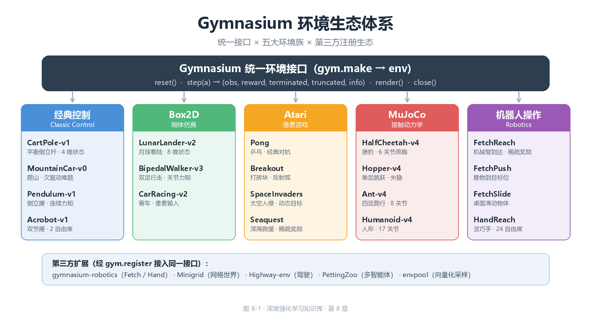
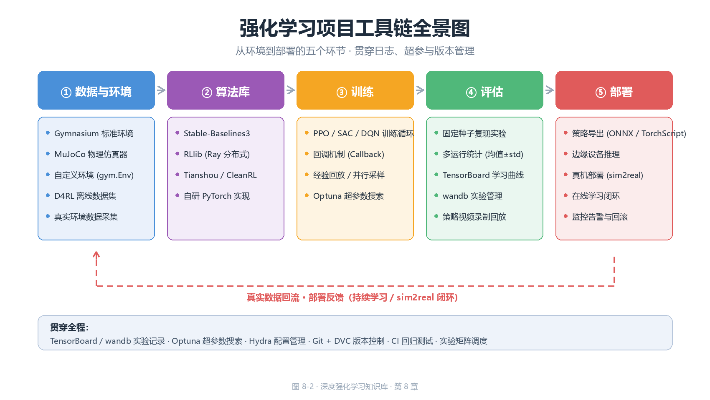

# 环境与工具链（Environments & Toolchains）

> 前八章的理论与算法——从 Q-Learning、DQN 到 PPO、SAC——全部围绕一个抽象
> 对象展开：环境（environment）。环境定义状态空间 $\mathcal{S}$、动作空间
> $\mathcal{A}$、转移函数 $P$ 与奖励 $R$，也是算法性能的裁判。理论章节
> 可以手写转移矩阵，但进入深度 RL 实战后，环境必须**标准化**：否则每个
> 研究者各写一套 `step/reset`，算法无法跨实验复用，结果无法互相比较。
> 本章回答四个工程问题：① 环境接口如何用（Gymnasium 生态）；② 有哪些
> 基准环境、难度与用途（经典环境图谱）；③ 物理仿真（MuJoCo）与算法库
> （Stable-Baselines3、RLlib）如何使用；④ 如何自定义环境、规范评估记录、
> 以及整条工具链的选型。本章是连接"算法原理"与"实验工程"的桥梁。全文
> 代码遵循本书惯例：标注"若已安装"的示例依赖第三方库（未安装也可阅读）；
> 其余代码均为纯 Python 3 + NumPy 实现，可直接运行。

---

## 一、Gymnasium 生态：环境接口的工业标准

### 1.1 从 OpenAI Gym 到 Gymnasium

Gym 于 2016 年由 OpenAI 发布，是最早将"环境即接口"理念产品化的库。
2021 年 OpenAI 停止维护，项目移交社区组织 Farama Foundation 并更名为
**Gymnasium**；2022 年 10 月发布的 Gymnasium 0.26 引入了自 0.21 以来
最大的一次 API 破坏性变更。理解这段历史有助于读懂网上大量旧代码：

| 版本 | 时间 | `step` 返回 | `reset` 返回 | 主要变化 |
|------|------|------------|-------------|---------|
| Gym 0.21 | 2021 | `obs, reward, done, info` | `obs` | 经典四元组，`done` 混合语义 |
| Gymnasium 0.26 | 2022.10 | `obs, reward, terminated, truncated, info` | `obs, info` | 拆分终止/截断；`reset` 增加 `seed` 参数 |
| Gymnasium 0.29 | 2023 | 同上 | `obs, info` | `render_mode` 移入构造参数，`env.render()` 不再传参 |
| Gymnasium 1.0 | 2024 | 同上 | `obs, info` | 稳定版；移除大量 deprecated 接口 |

**为什么要把 `done` 拆成 `terminated` 与 `truncated`？** 这是 Gymnasium 最
重要的设计决策。旧版 `done=True` 混淆了两种语义完全不同的终止：

1. **终止（terminated）**：回合因环境本身结束（杆倒、出界、通关）。
   此时 MDP 真的走到终点，TD 目标中**不应**出现 $V(s')$ 项（没有未来）。
2. **截断（truncated）**：回合因外部限制结束——步数超过
   `max_episode_steps`（CartPole 默认 500 步）、人为中断。此时 $s'$ 仍是
   合法中间状态，TD 目标中**应当**保留自举项 $\gamma V(s')$。

把两者混在 `done` 里会导致系统性偏差：若把 500 步截断当作终止，价值函数
会把"能活到 500 步"误判为"游戏结束"，$V(s)$ 被低估、策略满足于维持
500 步而非学到真正的最优平衡。
> **核心思想**：`terminated` 是环境的语义属性（MDP 终点），`truncated`
> 是实验的工程属性（预算耗尽）。二者必须分开传递，算法才能正确地决定
> 何时自举（bootstrap）、何时清零。所有现代算法（PPO、SAC、DQN 的
> Gymnasium 版）都在 TD 目标里按 `terminated` 而非 `done` 决定是否清零。

### 1.2 Env 核心 API：reset / step / render / close

Gymnasium 的环境约定本质上只有五个方法。一个对象只要实现了这五个方法
（或其中子集），就可以被任何 Gymnasium 兼容的算法直接驱动：

| 方法 | 签名 | 返回 | 语义 |
|------|------|------|------|
| `reset` | `reset(seed=None, options=None)` | `(obs, info)` | 重置环境到初始状态；`seed` 控制随机源，`options` 可传初始条件 |
| `step` | `step(action)` | `(obs, reward, terminated, truncated, info)` | 执行一个动作，推进一个时间步 |
| `render` | `render()` | `np.ndarray` 或 None | 返回 RGB 像素数组（`render_mode="rgb_array"` 时） |
| `close` | `close()` | None | 释放渲染窗口等资源 |
| `action_space` | 属性 | `Space` 子类 | 动作空间定义 |
| `observation_space` | 属性 | `Space` 子类 | 观测空间定义 |

标准交互循环如下（这是全书所有算法"挂到环境上"的统一入口）：

```
┌────────────────────────────────────────────────────────────┐
│                    Gymnasium 标准交互循环                     │
│                                                            │
│  obs, info = env.reset(seed=0)                             │
│  terminated = truncated = False                            │
│  total_reward = 0.0                                        │
│  while not (terminated or truncated):                      │
│      action = policy(obs)          # 算法给出动作            │
│      obs, reward, terminated,      # 环境推进一个时间步       │
│           truncated, info = env.step(action)               │
│      total_reward += reward                                │
│  env.close()                                               │
└────────────────────────────────────────────────────────────┘
```

`info` 是字典，可携带任意调试信息（Atari 的 `lives`、LunarLander 的
`distance`、机器人的 `is_success` 等）；**协议约定**：`info` 不得携带
影响学习的数据，算法默认忽略它。

`reset` 的 `options` 参数允许"可控初始化"（让 Pendulum 从指定角度开始、
让 HalfCheetah 以指定速度起跑），对课程学习与评估协议（见 7.3 节）至关
重要。`seed` 则保证随机源可复现：同一实例多次 `reset(seed=s)` 得到相同
的初始状态序列。

### 1.3 observation_space 与 action_space：空间的类型系统

空间（Space）是 Gymnasium 对"状态/动作取值范围"的形式化描述。算法侧
依赖空间做三件事：① 构造网络输入/输出层（状态维度、动作个数、动作上下界）；
② 随机采样探索动作（`space.sample()`）；③ 校验动作合法性
（`space.contains(a)`）。常用的空间类型：

| Space 类 | 构造参数 | 语义 | 采样示例 | 典型环境 |
|----------|---------|------|---------|---------|
| `Box` | `low, high, shape, dtype` | $n$ 维连续有界区间 $[low, high]^n$ | 均匀随机向量 | CartPole 状态、Pendulum 力矩 |
| `Discrete` | `n` | 整数集合 $\{0, 1, \dots, n-1\}$ | 均匀随机整数 | CartPole 动作（左/右） |
| `MultiDiscrete` | `nvec` | 多个独立离散维度的笛卡尔积 | 每维独立采样 | 多关节分段控制 |
| `MultiBinary` | `n` | $n$ 维 0/1 向量 | 伯努利采样 | 开关组合、消息传递 |
| `Dict` | `spaces: dict` | 异构命名子空间的组合 | 各子空间独立采样 | 机器人（视觉+关节状态） |
| `Tuple` | `spaces: tuple` | 异构子空间的序列组合 | 各子空间独立采样 | 多智能体联合观测 |
| `Graph` | 节点/边空间 | 图结构观测 | — | 分子、组合优化 |
| `Text` | `max_length` | 定长字符序列 | 随机字符 | 语言交互环境 |

两个最常见的空间——`Box` 与 `Discrete`——有若干容易踩坑的细节：

- `Box` 默认 `dtype=np.float32`。神经网络的权重通常也是 float32，但若你的
  状态是 float64（如 MuJoCo 原始输出），需要显式转换，否则类型不匹配会
  静默出错或报警告。
- `Discrete(n)` 的范围是 $[0, n)$，**不包含 $n$**。动作 $n$ 本身是非法
  动作，`env.step(n)` 会抛异常。
- `Box` 的 `low`/`high` 可以是标量（广播到所有维度）或与 `shape` 同形的
  数组（每维上下界不同）。当上下界相等（`low == high`）时，该维度是
  **常量**——MuJoCo 中许多"锁定关节"就是靠这个技巧实现的。

以下纯 NumPy 代码演示了空间语义（不依赖 gymnasium，可直接运行）：

```python
# 演示 Gymnasium 空间的数学语义（纯 NumPy 实现，可运行）
import numpy as np

class BoxSpace:
    """连续有界空间 [low, high]^n，逐元素成立"""
    def __init__(self, low, high, shape=None, dtype=np.float32):
        self.low = np.broadcast_to(np.asarray(low, dtype=dtype), shape or np.shape(low))
        self.high = np.broadcast_to(np.asarray(high, dtype=dtype), shape or np.shape(high))
        self.shape = self.low.shape
        self.dtype = dtype

    def sample(self, rng=None):
        rng = rng or np.random.default_rng()
        u = rng.random(self.shape)      # u ~ U[0,1) 再映射到 [low, high]
        return (self.low + u * (self.high - self.low)).astype(self.dtype)

    def contains(self, x):
        x = np.asarray(x)
        return x.shape == self.shape and np.all(x >= self.low) and np.all(x <= self.high)

class DiscreteSpace:
    """离散空间 {0, 1, ..., n-1}"""
    def __init__(self, n):
        self.n = n
        self.shape = ()

    def sample(self, rng=None):
        rng = rng or np.random.default_rng()
        return int(rng.integers(0, self.n))

    def contains(self, x):
        return isinstance(x, (int, np.integer)) and 0 <= x < self.n

# CartPole：状态 4 维连续有界区间，动作离散 2 个（左/右）
obs_space = BoxSpace(low=np.array([-4.8, -3.4, -0.42, -3.4]),
                     high=np.array([4.8, 3.4, 0.42, 3.4]))
act_space = DiscreteSpace(2)
rng = np.random.default_rng(0)
print("采样状态:", obs_space.sample(rng))          # 预期输出: 采样状态: [ 2.8397458  -1.189032    0.31652465 -0.48738542]
print("动作 1 合法:", act_space.contains(1))        # 预期输出: 动作 1 合法: True
print("动作 2 合法:", act_space.contains(2))        # 预期输出: 动作 2 合法: False
```

> **核心思想**：空间的本质是**协议的类型声明**。算法只依赖
> `sample()`（探索）与 `contains()`（校验）两个操作，就能做到"不关心
> 环境内部实现"；这正是策略网络输入维度、输出层大小能从环境自动推导的
> 前提（SB3 的 `MlpPolicy` 就是读取 `observation_space` / `action_space`
> 自动建网的）。

### 1.4 gym.make 与注册表

`gym.make(id)` 是获取环境实例的统一入口，`id` 形如 `"CartPole-v1"`。
Gymnasium 内置约 1000 个环境（含 Atari 的全部变体），全部通过**注册表**
（registry）管理：每个条目包含 `id`、`entry_point`（工厂函数）、
`max_episode_steps`（时间限制）、`reward_threshold`（解算标准）等元数据。

```python
# 若已安装 gymnasium（pip install gymnasium），以下代码可直接运行
import gymnasium as gym

# 创建环境：render_mode 在构造时指定（'human' 弹窗 / 'rgb_array' 返回像素）
env = gym.make("CartPole-v1", render_mode="rgb_array")

# 查看空间元信息 —— 算法据此自动构建网络
print("观测空间:", env.observation_space)   # 预期输出: Box([-4.8 ...], [4.8 ...], (4,), float32)
print("动作空间:", env.action_space)        # 预期输出: Discrete(2)
print("时间限制:", env.spec.max_episode_steps)  # 预期输出: 500

# 标准交互
obs, info = env.reset(seed=42)             # seed 固定随机源，保证可复现
total = 0.0
for _ in range(200):
    action = env.action_space.sample()     # 随机策略（探索基线）
    obs, reward, terminated, truncated, info = env.step(action)
    total += reward
    if terminated or truncated:
        break
print("随机策略一回合回报:", total)          # 预期输出: 随机策略一回合回报: 20.0（数值有随机性）
env.close()
```

**版本后缀的语义**：`CartPole-v1` 的 `-v1` 表示该环境的第 2 个版本
（从 0 起编号）。版本升级通常意味着奖励函数、状态定义或动力学修正——
同一算法在不同版本上的绝对分数**不可直接比较**。论文复现时务必核对
环境 id 与版本号（这是 7.4 节可复现性 checklist 的第一项）。

`id` 命名遵循"名称-版本"约定，但少数环境带后缀修饰符：Atari 的
`PongNoFrameskip-v4` 中的 `NoFrameskip` 表示不做帧跳过（见 2.4 节），
`-v4` 是 ALE 的评估版本号。

### 1.5 Wrapper：装饰器模式与向量环境

Wrapper（包装器）是 Gymnasium 的扩展机制：它**代理**一个底层环境，在
`reset`/`step` 前后插入预处理逻辑。因为 API 不变，Wrapper 可以无限嵌套，
且对算法完全透明。

| Wrapper 类型 | 拦截点 | 典型用途 |
|-------------|--------|---------|
| `ObservationWrapper` | `observation(obs)` | 归一化、灰度化、裁剪、拼接帧 |
| `ActionWrapper` | `action(a)` | 动作缩放、离散化、夹取边界 |
| `RewardWrapper` | `reward(r)` | 奖励缩放、裁剪、塑形 |
| `TimeLimit` | `step` | 步数截断（返回 `truncated=True`） |
| `RecordVideo` | `step` | 周期录制策略视频 |
| `FrameStack` | `reset/step` | 堆叠最近 $k$ 帧作为观测（Atari 标配） |

```python
# 若已安装 gymnasium，展示 wrapper 组合
import gymnasium as gym
from gymnasium.wrappers import TimeLimit, RecordVideo

env = gym.make("CartPole-v1")
env = TimeLimit(env, max_episode_steps=200)   # 把 500 步限制改为 200 步
env = RecordVideo(env, video_folder="./videos", episode_trigger=lambda i: i % 10 == 0)
obs, info = env.reset()
```

**向量环境（Vector Env）**：`gymnasium.vector` 提供 `SyncVectorEnv` /
`AsyncVectorEnv`，把 $N$ 个环境实例打包成批量接口——一次 `step` 接受
$N$ 个动作、返回 $N$ 组结果。这是 PPO 等 on-policy 算法并行采样的标准
做法（见 5.5 节），也是 SB3 中 `make_vec_env` 的底层机制。

| 特性 | 单环境 | 向量环境 |
|------|-------|---------|
| `step` 输入 | 1 个动作 | 长度为 $N$ 的动作数组 |
| `reset` 返回 | `(obs, info)` | `(batch_obs, batch_info)` |
| 单步吞吐 | 1 条转移 | $N$ 条转移 |
| 典型用途 | 交互式调试 | 并行采样、批量训练 |

---

## 二、经典环境图谱：基准测试的坐标系

### 2.1 环境总表

深度强化学习的基准环境按复杂度大致分为四档：**经典控制**（低维连续状态）、
**Box2D**（刚体物理）、**Atari**（像素输入）、**MuJoCo**（多关节连续控制）。
下表给出本章涉及的核心环境一览（难度为经验性分级，★ 越多越难）：

| 环境 | 状态维度 | 状态类型 | 动作类型 | 难度 | 典型用途 |
|------|---------|---------|---------|------|---------|
| CartPole-v1 | 4 | 连续 | 离散(2) | ★ | 入门教学、算法调试 |
| MountainCar-v0 | 2 | 连续 | 离散(3) | ★★ | 稀疏奖励、欠驱动研究 |
| Pendulum-v1 | 3 | 连续 | 连续(1) | ★★ | 连续控制最小算例 |
| Acrobot-v1 | 6 | 连续 | 离散(3) | ★★ | 欠驱动多体系统 |
| LunarLander-v2 | 8 | 连续 | 离散(4) | ★★★ | 离散动作+稀疏奖励 |
| BipedalWalker-v3 | 24 | 连续 | 连续(4) | ★★★★ | 连续动作鲁棒性 |
| CarRacing-v2 | 96×96×3 | 像素 | 连续(3) | ★★★★★ | 视觉+连续控制 |
| Pong（Atari） | 210×160×3 | 像素 | 离散(6) | ★★★ | DQN 历史基准 |
| Breakout（Atari） | 同左 | 像素 | 离散(4) | ★★★ | 稀疏奖励、延迟奖励 |
| HalfCheetah-v4 | 17 | 连续 | 连续(6) | ★★★ | MuJoCo 默认基准 |
| Hopper-v4 | 11 | 连续 | 连续(3) | ★★★★ | 单腿平衡与跳跃 |
| Ant-v4 | 27 | 连续 | 连续(8) | ★★★★ | 四足运动 |
| Humanoid-v4 | 376 | 连续 | 连续(17) | ★★★★★ | 高维欠驱动控制 |

### 2.2 经典控制族：算法开发的标准试验台

经典控制族来自早期控制理论的经典问题，状态维度低（2~6 维）、单步仿真
快（微秒级）、奖励设计各异，是**验证算法正确性**的首选——任何新算法
都应先在 CartPole 上跑通再上复杂环境。

- **CartPole-v1（倒立摆）**：小车沿轨道移动，杆顶端铰接；动作只有
  "左推/右推"；状态 $(x, \dot{x}, \theta, \dot{\theta})$；每步 +1，倾角
  超 15° 或出界即 `terminated`。**定位**：RL 的 "Hello World"，任何
  算法的冒烟测试。
- **MountainCar-v0（爬山车）**：小车在谷底，推力不足以直接爬坡，必须
  **来回荡**积累动能；状态仅位置与速度 2 维；经典奖励**稀疏**（到顶
  +1，其余 0）。**定位**：稀疏奖励 + 欠驱动的最小模型，常用于演示
  奖励塑形与课程学习。
- **Pendulum-v1（倒立摆连续版）**：单摆从任意角度摆起并保持竖直，
  动作是连续力矩。**定位**：连续控制最小算例，DDPG/TD3/SAC 论文的
  标准演示环境，一回合上限 200 步。
- **Acrobot-v1（双节摆）**：两节铰接摆，仅中间关节可施力，目标是把
  末端甩过指定高度。**定位**：欠驱动多体系统的经典例子，考验长期规划。

| 环境 | 状态 | 动作 | 奖励结构 | 关键难点 |
|------|------|------|---------|---------|
| CartPole | 4 维连续 | 离散 2 | 每步 +1 | 几乎无难点（入门） |
| MountainCar | 2 维连续 | 离散 3 | 稀疏 +1 | 稀疏奖励、欠驱动 |
| Pendulum | 3 维连续 | 连续 1 | $-(\theta^2 + 0.1\dot\theta^2 + 0.001a^2)$ | 连续动作 |
| Acrobot | 6 维连续 | 离散 3 | 到达 +1（稀疏） | 欠驱动、长时程 |

### 2.3 Box2D 族：刚体物理的入门仿真

Box2D 族用 Box2D 物理引擎模拟刚体世界，状态包含关节角、速度、接触等
信息，比经典控制更接近真实机器人，但比 MuJoCo 简单。

- **LunarLander-v2（月球着陆器）**：控制主引擎与两个侧向推进器，把
  着陆器软着陆在两根旗杆之间。8 维连续状态 + 4 个离散动作。奖励含
  距离项、速度惩罚与着陆成功/坠毁的 ±100。**定位**：离散动作 + 混合
  奖励结构 + 稀疏成败判定的标准组合，是 DQN 变体对比的常用场地。
- **BipedalWalker-v3（双足行走）**：24 维状态（关节角、角速度、接触
  传感器、地形扫描），4 维连续力矩动作，稀疏的 +300 终点奖励。**定位**：
  连续控制的"中等难度"关卡，考验算法的稳定性与样本效率。
- **CarRacing-v2（赛车）**：96×96 像素输入，3 维连续动作（转向/油门/
  刹车），奖励基于赛道进度。**定位**：像素观测 + 连续动作的交叉场景，
  同时考验视觉表征与连续控制，通常需要 CNN 策略。

### 2.4 Atari：像素观测与 DQN 的历史战场

Atari 2600 游戏经 Arcade Learning Environment（ALE）封装后，成为
**视觉强化学习**的事实标准。DQN（2015）正是在 Atari 上首次证明"同一套
算法 + 同一套超参数打 49 款游戏"。Atari 环境的工程细节对复现至关重要：

1. **帧预处理**：210×160×3 的原始画面被缩放到 84×84 灰度，再堆叠最近
   4 帧作为观测（`FrameStack(4)`），以编码速度信息。
2. **帧跳过（frame skip）**：动作每隔 $k$ 帧重复一次（ALE 默认 4），
   既加速仿真又平滑动作。`NoFrameskip` 变体关闭该机制，留给算法自己
   控制动作频率。
3. **动作重复与随机性**：为缓解确定性环境下的过拟合，评估时常给动作
   加 25% 的随机概率（`sticky actions`）。
4. **生命周期信息**：`info["lives"]` 携带剩余生命数——许多算法在
   "丢一条命"时提前结束回合（life loss as terminal），这是 DQN 系列
   提升样本效率的经典 trick。

| 代表游戏 | 动作数 | 奖励特点 | 学习难度 |
|---------|-------|---------|---------|
| Pong | 6 | 密集、±1 每球 | 低（DQN 数月前即超越人类） |
| Breakout | 4 | 稀疏、+1 每砖、奖励延迟 | 中 |
| Seaquest | 18 | 稀疏、氧气倒计时 | 高 |
| Montezuma's Revenge | 18 | 极度稀疏、探索难 | 极高（探索研究标尺） |

> **核心思想**：Atari 的价值在于把"感知"和"决策"耦合进同一个问题——
> 算法必须从像素中自己学习表征。这也是为什么 Atari 分数成为衡量
> 算法"通用性"的标尺：同一套超参数打 57 款游戏的平均分（human-normalized
> score）是 DQN 以降所有论文的标配指标。

### 2.5 MuJoCo 连续控制基准

MuJoCo 环境族（见第三章）提供多关节机器人（猎豹、蚂蚁、人形等）的
连续控制任务，状态为关节角/角速度/接触等，动作是各关节力矩。由于
物理仿真精确且速度快，MuJoCo 是**连续控制算法**（DDPG/TD3/SAC/PPO）
论文的标准实验场，也是 Gymnasium 默认捆绑的连续控制族。

| 环境 | 关节数 | 状态维度 | 任务目标 |
|------|-------|---------|---------|
| HalfCheetah | 6 | 17 | 向前奔跑（速度奖励） |
| Hopper | 3 | 11 | 单腿向前跳跃不跌倒 |
| Walker2d | 6 | 17 | 双足行走 |
| Ant | 8 | 27 | 四足爬行（含接触力） |
| Humanoid | 17 | 376 | 人形站立与行走（最难） |

### 2.6 环境选择的经验法则

| 你的目标 | 推荐环境 | 理由 |
|---------|---------|------|
| 验证算法正确性（冒烟测试） | CartPole-v1 | 秒级训练、结果稳定、可手算 |
| 调试代码 bug | CartPole / Pendulum | 状态可打印、单步可解释 |
| 连续控制算法对比 | HalfCheetah-v4 / Pendulum-v1 | 样本效率差异显著、社区基准丰富 |
| 稀疏奖励研究 | MountainCar / 部分 Atari | 天然稀疏，无需人为构造 |
| 视觉表征研究 | Atari（Pong/Breakout 起手） | 像素输入、社区预处理管线成熟 |
| 高维连续控制 | Humanoid / Ant | 考验算法稳定性与调参功力 |
| 工程演示/教学 | LunarLander | 状态-动作组合丰富、可玩性强 |

---

## 三、MuJoCo 与物理仿真

### 3.1 为什么 RL 研究常用 MuJoCo

MuJoCo（Multi-Joint dynamics with Contact）由 Rob Fergus 团队于 2015
年发布，2021 年被 DeepMind 收购后开源、2022 年起完全免费。它成为 RL
连续控制研究默认仿真器的原因可归结为四个"快、准、稳、可微"：

| 特性 | 说明 | 对 RL 的意义 |
|------|------|-------------|
| 速度快 | 单核即可达 10kHz 以上仿真频率（视模型复杂度） | 百万步实验数小时内完成 |
| 接触稳定 | 软接触模型 + 无穿透约束，数值鲁棒 | 长时间仿真不爆点、不发散 |
| 精确 | 广义坐标 + 解析动力学，可精确到关节力矩 | 奖励函数可依赖物理量（速度、能耗） |
| 可微 | 动力学对状态/动作可求导（`mj_jac`、自动微分） | 支持 model-based RL、可微策略搜索 |
| 跨平台 | Python/C/C++/MATLAB 绑定，Gymnasium 原生集成 | 与算法库零成本对接 |

一个常被低估的优势是**确定性**：MuJoCo 仿真本身无随机噪声，环境随机性
全部来自 `reset` 时对初始状态/目标位置的显式采样，这让"固定 seed 复现"
变得可靠（见 7.3 节）——同样的 seed 得到逐位一致的轨迹。

### 3.2 接触动力学（contact dynamics）

多关节机器人的核心物理现象是**接触**：脚与地面的摩擦、指尖与物体的
按压、关节限位碰撞。接触动力学是仿真器最难的部分，也是各仿真器拉开
差距的地方。MuJoCo 采用**软接触模型**（soft contact model）：

- 法向力由"穿透深度"（penetration depth）经罚函数产生——物体可轻微
  互相嵌入，嵌入越深、法向力越大，从而避免刚体接触的数值不连续
  （LCP/互补问题在部分构型下无解）。
- 切向力用**椭圆摩擦锥**近似库仑摩擦：$\|\mathbf{f}_t\| \le \mu f_n$
  （$f_n$ 法向力、$\mu$ 摩擦系数），让"打滑"与"咬合"平滑过渡。
- 求解器（`mjData.solver`）可在迭代法（PGS）与牛顿法之间选择，
  平衡精度与速度。

```text
软接触模型示意（法向-切向分解）
           法向力 f_n ∝ 穿透深度 + 阻尼
           │
    ┌──────┴──────┐
    │  接触面      │  切向力 f_t（摩擦锥内）
    │  ◄───────►  │  ‖f_t‖ ≤ μ·f_n
    └─────────────┘
```

> **核心思想**：接触是"非光滑"的——法向力在接触/分离瞬间跳变。RL 的
> 策略网络假设奖励函数对动作足够光滑才能稳定求梯度；MuJoCo 的软接触
> 模型正是通过罚函数把这种非光滑性"磨平"，让梯度信息能穿透接触事件
> 传播。这也是为什么很多在 MuJoCo 上训练好的策略直接搬到真实机器人上
> 会失效的原因之一：真实接触更硬、更不连续（sim2real 问题，见 3.6 节）。

### 3.3 软体（soft body）与可变形物体

经典仿真器擅长刚体（rigid body），但机器人操作研究中大量场景涉及
**可变形物体**：布料折叠、绳子打结、果冻抓取、软组织手术。MuJoCo 的
能力边界：

| 能力 | 刚体 | 软体（MuJoCo） | 专用软体仿真器 |
|------|------|---------------|---------------|
| 表示 | 有限个刚体 | 有限元网格（FEM）/ 粒子 | 连续介质力学 |
| 形变 | 无 | 可变形（`flex` 特性） | 高保真形变 |
| 仿真速度 | 极快 | 中等 | 慢 |
| RL 适用性 | 最广 | 研究中（如布料操作） | 样本效率低，少用 |
| 代表工具 | MuJoCo / PhysX | MuJoCo flex / SOFA | SOFA / Genesis |

MuJoCo 从 2.0 起支持有限元软体（通过 `flex` 声明），可模拟布料、果冻
等；但**注意**：软体仿真在 Gymnasium 的 MuJoCo 环境族中并不常用，
主流 RL 基准仍以刚体为主。若你的研究聚焦布料/软组织操作，通常需要
专门的软体仿真器（SOFA、Genesis）或带 GPU 加速的形变仿真。

### 3.4 MJCF 格式简介

MuJoCo 的模型用 **MJCF**（MuJoCo CoNtrol Format，XML）描述，这是它与
URDF（ROS 生态的机器人描述格式）最大的生态差异。一个最小 MJCF 模型：

```xml
<!-- 若已安装 mujoco（pip install mujoco），本模型可直接加载渲染 -->
<mujoco model="单摆">
  <!-- 全局选项：重力、积分器 -->
  <option gravity="0 0 -9.81" integrator="RK4"/>

  <!-- 默认值：减少重复声明 -->
  <default>
    <geom type="capsule" rgba="0.6 0.6 0.6 1" mass="0.1"/>
    <joint type="hinge" damping="0.05"/>
  </default>

  <!-- 世界坐标系下的静态物体 -->
  <worldbody>
    <light pos="0 0 4" dir="0 0 -1"/>
    <geom name="ground" type="plane" size="5 5 0.1" rgba="0.9 0.9 0.9 1"/>

    <!-- 一个刚体：通过 body 组织运动学树 -->
    <body name="pendulum" pos="0 0 1">
      <!-- joint 定义该 body 相对父级的自由度 -->
      <joint name="hinge1" axis="0 1 0"/>
      <geom name="rod" fromto="0 0 0 0 0 -0.5" type="capsule" size="0.02"/>
    </body>
  </worldbody>

  <!-- 执行器：把控制信号映射为广义力 -->
  <actuator>
    <motor name="torque" joint="hinge1" gear="1"/>
  </actuator>
</mujoco>
```

MJCF 的关键设计：`body` 构成运动学树（关节连接父子刚体），`geom`
定义碰撞与渲染形状，`actuator` 定义控制接口。MuJoCo 的 Python 绑定
（`mujoco` 包）提供 `mujoco.MjModel.from_xml_path()` 加载模型、
`MjData` 保存仿真状态，并支持把模型导出为 URDF（`mj_exportURDF`），
方便与 ROS 生态互通。

| 维度 | MJCF（MuJoCo） | URDF（ROS） |
|------|---------------|-------------|
| 设计目标 | 仿真性能与数值稳定 | 机器人描述与可视化 |
| 默认物理 | 内置软接触求解器 | 需外部物理引擎（Gazebo 等） |
| 执行器 | 原生支持 motor/cylinder 等 | 通常只描述关节，控制另配 |
| 接触参数 | 丰富的摩擦/阻尼/刚度选项 | 简略 |
| RL 生态 | Gymnasium 原生 | 需转换或适配层 |

### 3.5 MuJoCo 与其他仿真器的关系

"用哪个仿真器"是工程选型的第一个岔路口。主流选项对比：

| 仿真器 | 底层加速 | GPU 支持 | 可微 | 典型用途 | 与 RL 的集成 |
|--------|---------|---------|------|---------|-------------|
| MuJoCo | CPU 多核 | 有限（2.3+ 部分支持） | 是 | 连续控制基准、接触研究 | Gymnasium 原生 |
| Isaac Gym / Isaac Lab | PhysX | 原生 GPU 并行 | 部分 | 大规模并行训练（数千环境） | 自研/Isaac Lab 框架 |
| Brax | JAX | 原生 GPU/TPU | 是 | 大规模并行 + 可微 RL 研究 | 自研（JAX 生态） |
| PyBullet | Bullet | 无 | 否 | 机器人抓取、教学 | gym 兼容包装 |
| PhysX | 多引擎 | 原生 | 否 | 游戏/视觉仿真 | 需自封装 |
| Genesis | 多后端 | 原生 | 是 | 通用机器人仿真（新） | 自研 |
| SAPIEN | PhysX | 是 | 部分 | 可交互关节物体、具身智能 | 自研 |

选型判断：**单机、标准基准、算法对比** → MuJoCo；**需要并行数千环境
加速样本采集** → Isaac Gym / Brax；**可微物理用于 model-based RL** →
Brax / MuJoCo（可微模式）；**真实机器人验证前的快速原型** → PyBullet
（生态成熟、文档多）。

### 3.6 仿真到现实（sim2real）

仿真器再精确也是近似。策略从仿真迁移到真实系统（sim2real）的核心
挑战是**域差距**（domain gap）：真实接触更硬、执行器有延迟、传感器
有噪声。三条主流工程路线：

| 路线 | 思想 | 典型手段 | 成本 |
|------|------|---------|------|
| 域随机化（domain randomization） | 训练时随机化物理参数，让策略学会"不变性" | 随机摩擦/质量/延迟/光照 | 低，训练时开销小 |
| 系统辨识（system identification） | 先精确标定仿真参数，使仿真逼近真实 | 参数估计、在线自适应 | 中，需真实数据 |
| 课程学习（curriculum） | 从易到难渐进训练，最后阶段贴近真实分布 | 噪声注入、扰动课程 | 低 |

> **核心思想**：sim2real 的本质是把"仿真与真实的差距"当作**另一种
> 分布偏移**来对待。域随机化的哲学是"与其精确建模，不如让策略在参数
> 分布上稳健"——这与第 7 章 SAC 的最大熵思想同构：对不确定性建模，
> 而不是消除不确定性。

---

## 四、Stable-Baselines3：开箱即用的算法库

### 4.1 安装

Stable-Baselines3（SB3）是深度 RL 领域最流行的 PyTorch 算法库：接口
统一、文档完善、实现经过社区大量复现验证。安装：

```bash
# 推荐在虚拟环境中安装；SB3 依赖 PyTorch
pip install stable-baselines3           # CPU 版（自动拉取 torch）
# GPU 版请先按 pytorch.org 指引安装 CUDA 版 torch，再装 SB3
pip install "stable-baselines3[extra]"  # 含 tensorboard、optuna 等可选依赖
```

| 组件 | 版本要求 | 说明 |
|------|---------|------|
| Python | ≥ 3.8 | SB3 1.x 系列 |
| PyTorch | ≥ 1.13 | 训练后端 |
| gymnasium | ≥ 0.29 | 环境接口（SB3 1.x 起不再兼容旧 gym） |
| tensorboard | 可选 | 训练曲线记录 |

### 4.2 三行代码跑 PPO

SB3 的设计哲学是"**算法与策略网络解耦、与环境解耦**"：你只需指定
策略网络类型（`MlpPolicy`/`CnnPolicy`/`MultiInputPolicy`）与环境 id，
其余全部自动装配。

```python
# 若已安装 stable-baselines3，以下代码可直接运行（约 1 分钟可训完）
from stable_baselines3 import PPO

# 三行核心代码：创建 → 训练 → 保存
model = PPO("MlpPolicy", "CartPole-v1", verbose=1, seed=0)
model.learn(total_timesteps=50_000)
model.save("ppo_cartpole")

# 加载并评估（评估时用确定性策略，不加探索噪声）
from stable_baselines3.common.evaluation import evaluate_policy
loaded = PPO.load("ppo_cartpole")
mean_reward, std_reward = evaluate_policy(loaded, loaded.get_env(), n_eval_episodes=20)
print(f"平均回报: {mean_reward:.1f} ± {std_reward:.1f}")  # 预期输出: 平均回报: 500.0 ± 0.0（CartPole 满分 500）
```

`model.learn()` 内部就是本书第 6/7 章手写循环的工程化封装：on-policy
算法先收集一批轨迹（rollout），再多次梯度更新，如此往复；off-policy
算法则维护回放池（replay buffer）持续采样更新。SB3 的
`rollout/ep_rew_mean` 等日志对应我们手写循环里逐回合打印的平均回报。

### 4.3 算法支持表

SB3 覆盖了主流单智能体算法，全部共享同一套 API（`learn` / `save` /
`load` / `predict`），切换算法只需换类名：

| 算法 | 类别 | 动作空间 | 特点 | 适用场景 |
|------|------|---------|------|---------|
| DQN | off-policy, value-based | 离散 | 原生 DQN + Double/Dueling/Prioritized 选项 | 离散决策、Atari |
| QRDQN | off-policy, value-based | 离散 | 分位数回归，分布 RL | 对回报分布敏感的任务 |
| A2C | on-policy | 离散/连续 | 同步 Advantage Actor-Critic | 教学、轻量基线 |
| PPO | on-policy | 离散/连续 | 裁剪目标 + GAE，最稳健 | **默认首选** |
| DDPG | off-policy | 连续 | 确定性策略 + 回放 | 连续控制入门 |
| TD3 | off-policy | 连续 | Clipped Double-Q + 延迟更新 | 连续控制稳健基线 |
| SAC | off-policy | 连续 | 最大熵 + 自动温度调节 | **连续控制首选** |
| ARS | 无模型进化 | 连续 | 随机搜索，无梯度 | 超简单任务的 sanity check |

选择经验法则：**离散动作 → DQN 或 PPO；连续动作 → SAC 或 TD3；不确定
用哪个 → PPO**（鲁棒性最好、超参数敏感度最低）。这与第 7 章速查表的
结论一致：PPO 是 on-policy 的默认，SAC 是 off-policy 连续控制的默认。

### 4.4 模型保存与加载

SB3 的 `save`/`load` 是**完整快照**：除网络权重外，还序列化超参数、
优化器状态、学习率调度器状态与日志——`load` 之后可以无缝继续训练
（`learn` 会从上次状态接着跑），这是长训练任务断点续跑的基础。

```python
# 若已安装 stable-baselines3
from stable_baselines3 import SAC

model = SAC("MlpPolicy", "Pendulum-v1", verbose=0, seed=1)
model.learn(total_timesteps=100_000)
model.save("sac_pendulum_step100k")

# 断点续训：加载后继续学 50k 步（优化器、调度器状态一并恢复）
model = SAC.load("sac_pendulum_step100k")
model.learn(total_timesteps=50_000, reset_num_timesteps=False)
model.save("sac_pendulum_step150k")

# 部署时只导出权重（去掉训练附属状态），体积更小
model.policy.save("sac_pendulum_policy_only")
```

注意三个细节：① `load` 默认不重建环境（`env=None`），推理前需手动
`model.set_env(env)` 或直接 `model.predict(obs)`；② 训练/评估时环境
必须经过向量化包装（SB3 内部自动 `make_vec_env`，但你手动传入的 env
需为向量环境）；③ `model.predict(obs, deterministic=True)` 关闭探索
噪声——评估与部署必须用确定性预测。

### 4.5 回调机制（Callback）

回调（callback）是 SB3 的扩展点：在训练循环的特定时机注入自定义逻辑，
如周期性保存检查点、评估当前策略、调整超参数、记录额外指标。回调
本质是"训练循环的钩子"（hook），对应我们手写循环里"每 N 步打印一次"
的代码位置。

| 回调类 | 触发时机 | 用途 |
|--------|---------|------|
| `CheckpointCallback` | 每 `save_freq` 步 | 定期保存模型（断点续跑） |
| `EvalCallback` | 每 `eval_freq` 步 | 用确定性策略评估，记录最佳模型 |
| `StopTrainingOnRewardThreshold` | 每个 rollout 结束 | 达到目标奖励即停训 |
| `TensorBoardCallback` | 每步 | 记录额外标量到 TensorBoard |
| 自定义 `BaseCallback` | 见下表 | 任意定制逻辑 |

自定义回调需要理解回调的生命周期方法：

```python
# 若已安装 stable-baselines3，演示自定义回调骨架
from stable_baselines3.common.callbacks import BaseCallback

class MyCallback(BaseCallback):
    """每 1000 步打印一次平均回报"""
    def __init__(self, verbose=0):
        super().__init__(verbose)
        self.ep_rew_buffer = []

    def _on_rollout_start(self):
        pass                            # 每个 rollout 开始前调用

    def _on_step(self):
        # 每个环境步调用（频率最高，注意性能开销）
        if self.n_calls % 1000 == 0:
            infos = self.locals.get("infos", [])
            for info in infos:
                if "episode" in info:   # SB3 自动注入回合统计
                    self.ep_rew_buffer.append(info["episode"]["r"])
            if self.ep_rew_buffer:
                print(f"step={self.n_calls}, 近{len(self.ep_rew_buffer)}回合平均回报: "
                      f"{sum(self.ep_rew_buffer)/len(self.ep_rew_buffer):.2f}")
        return True                     # False 可提前终止训练

    def _on_training_end(self):
        print("训练结束，回调清理资源")
```

> **核心思想**：回调把"训练主循环"与"实验管理"解耦——主循环只负责
> 优化，检查点、评估、日志都是可插拔的旁路逻辑。这与你手写实验时的
> 最佳实践一致：**不要在算法代码里写死保存/打印逻辑**，而是用统一的
> 钩子机制管理，否则换一个算法就要重写一遍实验代码。

### 4.6 策略网络与自定义

SB3 的策略类（`ActorCriticPolicy` 等）把网络架构、动作分布与损失计算
打包。常用选择：

| 策略类型 | 观测类型 | 网络结构 | 典型场景 |
|---------|---------|---------|---------|
| `MlpPolicy` | 向量（Box/MultiDiscrete） | 多层感知机 | 经典控制、MuJoCo |
| `CnnPolicy` | 图像（Box 高维） | CNN + MLP | Atari、CarRacing |
| `MultiInputPolicy` | Dict 观测 | 各子空间特征提取器拼接 | 机器人（视觉+关节） |

自定义网络宽度/深度通过 `policy_kwargs` 传入，无需改动算法代码：

```python
# 若已安装 stable-baselines3
from stable_baselines3 import PPO
from torch import nn

policy_kwargs = dict(
    net_arch=dict(pi=[128, 128], vf=[128, 128]),   # Actor 与 Critic 独立结构
    activation_fn=nn.Tanh,                          # 激活函数
    log_std_init=-1.0,                              # 初始探索噪声
)
model = PPO("MlpPolicy", "CartPole-v1", policy_kwargs=policy_kwargs, verbose=0)
```

### 4.7 SB3 与手写实现的衔接

本书前七章手写的算法与 SB3 是**同一套理论、两个抽象层次**：

| 维度 | 手写实现（第 4~7 章） | SB3 |
|------|---------------------|-----|
| 学习曲线 | 直接观察代码逻辑 | 黑盒 `learn()` |
| 灵活性 | 任意修改损失、网络、调度 | 通过回调/`policy_kwargs` 受限扩展 |
| 工程完备性 | 需自己写保存/日志/评估 | 内置完整 |
| 调试难度 | 可单步跟踪 | 需读源码 |
| 适用阶段 | 学习原理、论文复现 | 快速实验、基准对比、生产原型 |

建议的工作流：**用 SB3 快速验证环境与奖励设计是否合理 → 手写实现或
修改源码做算法创新 → 用 SB3 的评估协议做公平对比**。两者互补而非
互斥——理解手写实现的每个细节，是正确使用 SB3 的前提（否则你不知道
`learn()` 里发生了什么）。

---

## 五、RLlib 与分布式强化学习

### 5.1 何时需要分布式 RL

单机单进程 RL 训练存在硬性瓶颈：**采样与训练串行竞争**。PPO 样本效率
约 $10^6$~$10^7$ 步，Humanoid 级别环境单步仿真毫秒级，串行训练需
数小时到数天。分布式 RL 的思路是**把采样并行化**：$N$ 个 worker 各持
环境副本同时采样，中心 learner 消费汇总轨迹做梯度更新。何时需要：

| 场景 | 单机单进程 | 分布式 |
|------|-----------|--------|
| CartPole 冒烟测试 | ✅ 秒级完成 | ❌ 杀鸡用牛刀 |
| MuJoCo 单环境调参 | ✅ 小时级 | ⚠️ 视算力 |
| 数千环境并行采样 | ❌ CPU 受限 | ✅ 必须 |
| 多智能体（数百 agent） | ❌ 串行爆炸 | ✅ 必须 |
| 大规模超参搜索 | ⚠️ 可串行跑矩阵 | ✅ 集群并行 |

工程上的分水岭是**采样吞吐 vs 训练吞吐的比值**：当采样成为瓶颈
（环境仿真慢、批量大、并行度要求高）时，分布式收益显著；反之
（仿真极快、网络很大）则训练端才是瓶颈，分布式收益有限。

### 5.2 Ray 与 RLlib 的架构

RLlib 构建在 **Ray** 之上。Ray 是通用的分布式执行引擎，提供两个
原语：**Task**（远程函数，`@ray.remote` 修饰的普通函数）与 **Actor**
（远程有状态对象，跨进程持有状态）。RLlib 把 RL 训练的各个角色映射
为 Ray Actor：

```text
┌─────────────────── Ray 集群 ───────────────────┐
│                                                │
│   Driver（训练主控）                            │
│   ┌──────────────────────────────────────┐    │
│   │ Trainer：策略优化循环、日志、检查点     │    │
│   └───────┬──────────┬──────────┬────────┘    │
│           │          │          │             │
│   ┌───────▼───┐ ┌────▼────┐ ┌───▼────────┐   │
│   │ Sampler   │ │ Sampler │ │ Sampler    │   │  ← 每 worker 持 N 个环境副本
│   │ Worker(0) │ │ Worker1 │ │ Worker(K)  │   │     并行采集 rollout
│   └───────┬───┘ └────┬────┘ └───┬────────┘   │
│           └──────────┼──────────┘             │
│                      ▼                        │
│   ┌──────────────────────────────────────┐    │
│   │ Replay Buffer / 梯度聚合（Learner）    │    │
│   └──────────────────────────────────────┘    │
└───────────────────────────────────────────────┘
```

数据流：每个 Sampler Worker 用当前策略副本并行采集 $N$ 条轨迹 →
轨迹汇总到中心（on-policy 算法直接聚合更新；off-policy 算法写入
分布式回放池）→ learner 更新策略 → 新策略版本广播回各 worker
（版本号机制保证一致性）。这种"**采样-训练异步流水线**"是 RLlib
吞吐量远超单机的根源。

### 5.3 RLlib 的核心特性

| 特性 | 说明 |
|------|------|
| 统一 Trainer API | `PPO(env=..., config=...)` 一行构建，`train()` 返回训练指标 |
| 分布式采样 | Sampler 数可配置，环境副本数按需伸缩 |
| 多智能体 | 原生支持多 agent 环境（每个 agent 独立策略或共享策略） |
| 超参搜索 | 与 Ray Tune 深度集成：`tune.run` 网格/贝叶斯搜索 |
| 策略版本控制 | 异步采样下的策略一致性保证 |
| 环境向量化 | 每个 worker 内可再开多个环境副本（`num_envs_per_worker`） |
| 算法覆盖 | PPO、DQN、SAC、TD3、APPO、IMPALA、MARL 算法等 |
| 离线学习 | 支持从离线数据集训练（offline RL 接口） |

```python
# 若已安装 ray[rllib]（pip install "ray[rllib]"），以下代码可运行
import ray
from ray.rllib.algorithms.ppo import PPOConfig

ray.init()                      # 启动本地 Ray 集群（单机多进程）

config = (
    PPOConfig()
    .environment("CartPole-v1")
    .training(lr=3e-4, train_batch_size=4000)
    .resources(num_gpus=0, num_cpus_per_worker=1)
    .rollouts(num_rollout_workers=4, num_envs_per_worker=2)  # 4×2=8 个并行环境
)
algo = config.build_algo()
for i in range(10):
    result = algo.train()       # 一次 train() = 一轮采样 + 多轮更新
    print(f"iter={i}, 平均回合回报={result['env_runners']['episode_return_mean']:.1f}")
algo.save_checkpoint("/tmp/rllib_ppo_cartpole")
ray.shutdown()
```

`train()` 一次调用内部完成"采样→更新→日志→检查点"全流程，返回的
`result` 字典是结构化指标（各 worker 的回报统计、损失、吞吐量等）。

### 5.4 RLlib 与 SB3 对比

| 维度 | Stable-Baselines3 | RLlib |
|------|-------------------|-------|
| 定位 | 单机研究、教学、快速原型 | 大规模分布式训练、生产系统 |
| 底层 | PyTorch | Ray（多进程/多机） |
| 学习曲线 | 平缓，三行上手 | 较陡，概念多（config/Trainer/tune） |
| 分布式采样 | ❌（单进程，可手动多进程） | ✅ 原生、可水平扩展 |
| 多智能体 | ⚠️ 需自封装 | ✅ 一等公民 |
| 超参搜索 | 需接 Optuna | ✅ 内嵌 Ray Tune |
| 调试便利 | ✅ 简单直接、易读源码 | ⚠️ 分布式调试复杂 |
| 文档与社区 | 极佳，教程丰富 | 好，但示例偏工程化 |
| 典型用户 | 研究者、学生 | 平台团队、大规模实验 |

**选型结论**：单机研究、算法原型、教学 → SB3；需要多机并行、多智能体、
大规模超参搜索、生产部署 → RLlib。二者并不互斥：先用 SB3 验证想法，
再迁移到 RLlib 放大规模是常见路径。

### 5.5 分布式采样的最小概念模型

分布式 RL 的核心收益可以用一个简单的统计事实理解：$N$ 个独立 worker
并行采集，单位时间获得的转移数量近似线性增长（忽略通信开销）。下面
用纯 NumPy 演示"多 worker 采样合并"的语义（不依赖 ray，可运行）：

```python
# 演示并行采样合并的语义（纯 NumPy 可运行；真实分布式由 ray 实现）
import numpy as np

def simulate_episode(rng, horizon=200):
    """模拟一回合：随机策略的回报（抽象替代真实环境）"""
    reward = 0
    for _ in range(horizon):
        if rng.random() < 0.98:     # 每步存活概率 0.98，存活则 +1
            reward += 1
        else:
            break
    return reward

def parallel_sampling(n_workers, eps_per_worker, seed=0):
    """模拟 N 个 worker 并行采样：每 worker 独立随机源采 eps_per_worker 回合"""
    returns = []
    for w in range(n_workers):
        rng = np.random.default_rng(seed + w)   # 每 worker 独立 seed
        returns.extend(simulate_episode(rng) for _ in range(eps_per_worker))
    return returns

par = parallel_sampling(4, 10, seed=0)      # "并行"：4 worker × 10 回合
ser = parallel_sampling(1, 40, seed=0)      # 串行等价：1 worker × 40 回合
print("串行 40 回合平均回报:", f"{np.mean(ser):.2f}")   # 预期输出: 串行 40 回合平均回报: 39.70
print("并行 40 回合平均回报:", f"{np.mean(par):.2f}")   # 预期输出: 并行 40 回合平均回报: 39.67（数值略有随机性）
print("两者统计等价（同一分布的不同样本）: True")
```

> **核心思想**：分布式 RL 没有改变算法——它只是把"采集数据"这一步
> 变成可水平扩展的流水线。on-policy 算法（PPO）并行采样后仍需把轨迹
> 汇总再更新（同步语义）；off-policy 算法（SAC/DQN）可以异步写入共享
> 回放池（异步语义）。理解这一点，就不会被"分布式"三个字吓到：算法
> 层面的改动为零，改动全在数据流工程。

---

## 六、自定义环境：从零实现 gym.Env

### 6.1 接口约定与 metadata

自定义环境是 RL 工程的日常：仿真器接入、业务问题建模、课程设计都要
写环境。Gymnasium 的约定非常轻——**接口即协议**：只要你的类实现了
`reset`/`step` 并暴露 `observation_space`/`action_space`，任何兼容
算法都能直接驱动它，**不强制继承** `gym.Env`（继承只为获得默认实现
与类型标注）。规范的环境类应具备：

| 要素 | 约定 | 作用 |
|------|------|------|
| `metadata` | 类属性字典，含 `render_modes`、`render_fps` | 声明渲染能力与帧率 |
| `observation_space` | 实例属性，`Space` 对象 | 算法建网依据 |
| `action_space` | 实例属性，`Space` 对象 | 动作采样与校验依据 |
| `reset(seed, options)` | 返回 `(obs, info)`；seed 控制随机源 | 回合初始化 |
| `step(action)` | 返回 `(obs, reward, terminated, truncated, info)` | 单步推进 |
| `render()` | 按 `render_mode` 输出 | 可视化/录制 |
| `close()` | 释放资源 | 清理 |

### 6.2 完整模板：继承 gym.Env

```python
# 若已安装 gymnasium，本模板可直接运行
import numpy as np
import gymnasium as gym
from gymnasium import spaces


class MyEnv(gym.Env):
    """自定义环境模板：1 维连续状态 + 离散动作的最小示例。
    业务逻辑全部写在 step 里，接口部分照抄本模板即可。
    """
    metadata = {"render_modes": ["human", "rgb_array"], "render_fps": 4}

    def __init__(self, render_mode=None, max_steps=100):
        super().__init__()
        # 1) 定义空间（算法建网依据）
        self.observation_space = spaces.Box(
            low=-1.0, high=1.0, shape=(1,), dtype=np.float32)
        self.action_space = spaces.Discrete(2)

        # 2) 渲染模式构造时确定（Gymnasium 0.29+ 约定）
        assert render_mode is None or render_mode in self.metadata["render_modes"]
        self.render_mode = render_mode

        # 3) 内部状态（私有变量，不属于观测空间）
        self.max_steps = max_steps
        self._steps = 0
        self._state = None
        self.window = None     # 渲染窗口句柄

    def reset(self, seed=None, options=None):
        super().reset(seed=seed)          # seed 转发给随机源（保证可复现）
        rng = np.random.default_rng(seed)
        self._state = rng.uniform(-1.0, 1.0, size=(1,)).astype(np.float32)
        self._steps = 0
        if options and "init_state" in options:   # options 传自定义初始条件
            self._state = np.asarray(options["init_state"], dtype=np.float32)
        obs = self._state.copy()          # 返回副本，防止外部篡改内部状态
        return obs, {"steps": self._steps}

    def step(self, action):
        assert self.action_space.contains(action), f"非法动作: {action}"
        self._steps += 1

        # ---- 业务逻辑：替换为你自己的转移与奖励 ----
        delta = 0.1 if action == 0 else -0.1
        self._state = np.clip(self._state + delta, -1.0, 1.0)
        reward = float(np.abs(self._state[0]))            # 越远离 0 奖励越高
        terminated = bool(np.abs(self._state[0]) > 0.95)  # 出界即终止
        truncated = bool(self._steps >= self.max_steps)   # 步数预算耗尽
        # ------------------------------------------------

        obs = self._state.copy()
        if self.render_mode == "human":
            self._render_frame()
        return obs, reward, terminated, truncated, {"steps": self._steps}

    def render(self):
        if self.render_mode == "rgb_array":
            return self._render_frame()

    def _render_frame(self):
        # numpy 生成简单画面（实际项目可接 pygame/matplotlib）
        canvas = np.zeros((64, 64, 3), dtype=np.uint8)
        x = int((self._state[0] + 1.0) / 2.0 * 63)
        canvas[30:34, max(0, x - 2):min(64, x + 2)] = (255, 255, 255)
        return canvas

    def close(self):
        if self.window is not None:       # 释放渲染资源
            self.window = None
```

模板的三个关键点：① `super().reset(seed=seed)` 负责把 seed 传给内部
随机源（np.random 等）；② `step` 的返回顺序是
`(obs, reward, terminated, truncated, info)` 五元组，写错顺序是最常见
的 bug；③ 观测返回**副本**而非内部数组引用，防止算法误改内部状态。

### 6.3 注册环境

注册让环境可以通过 `gym.make("MyEnv-v0")` 按 id 创建，并纳入版本管理：

```python
# 若已安装 gymnasium（假设上面 MyEnv 定义在同一文件）
import gymnasium as gym
from gymnasium.envs.registration import register

register(
    id="MyEnv-v0",                    # id 规范：名称-版本
    entry_point="__main__:MyEnv",     # "模块:类名" 工厂路径
    max_episode_steps=100,            # 时间限制（截断语义）
    reward_threshold=50.0,            # 解算标准（评估参考）
)

env = gym.make("MyEnv-v0", render_mode="rgb_array")
print("注册后可用:", env.spec.id)      # 预期输出: 注册后可用: MyEnv-v0
```

若环境写在独立包中，更规范的做法是在 `setup.py` 的 `entry_points` 里
声明 `gymnasium.envs` 入口，安装后自动注册。`gym.envs.registry` 可
查看全部已注册环境（`gym.envs.registry.keys()`）。

### 6.4 自制 GridWorld：纯 NumPy 可运行实现

下面实现一个 5×5 网格世界：agent 从左上角出发，走到右下角得 +10，
每步 -1 惩罚（鼓励最短路径），撞墙不动。**该实现不继承 gym.Env**，
只实现同名方法——再次印证"接口即协议"：它完全可以被 Gymnasium 风格
的算法循环驱动。

```python
# 自制 GridWorld 环境（纯 Python 3 + NumPy，可运行）
import numpy as np


class GridWorldEnv:
    """5×5 网格世界：状态=格子编号，动作={0:上, 1:下, 2:左, 3:右}。
    起点 (0,0)，终点 (4,4)；到达终点 +10，其余每步 -1；撞墙原地不动。
    """
    metadata = {"render_modes": ["ansi"], "render_fps": 4}

    def __init__(self, size=5, render_mode="ansi"):
        self.size = size
        self.render_mode = render_mode
        # 空间定义（与 gymnasium 的 Discrete 语义一致）
        self.observation_space = {"n": size * size}   # 0..24 共 25 个格子
        self.action_space = {"n": 4}                  # 0..3 四个方向
        self._start, self._goal = 0, size * size - 1
        self._pos = self._start
        self._steps, self._max_steps = 0, 50
        self._deltas = [(-1, 0), (1, 0), (0, -1), (0, 1)]  # 动作→(行,列)增量

    def reset(self, seed=None, options=None):
        # 与 gymnasium 相同的种子语义：固定 seed 得到相同初始状态
        self._rng = np.random.default_rng(seed)
        self._pos = self._start
        self._steps = 0
        return np.int32(self._pos), {"pos": self._pos}

    def step(self, action):
        assert 0 <= action < 4, f"非法动作: {action}"
        self._steps += 1
        # 状态转移：先算目标位置，撞墙则原地不动
        row, col = divmod(self._pos, self.size)
        dr, dc = self._deltas[action]
        nr, nc = row + dr, col + dc
        if 0 <= nr < self.size and 0 <= nc < self.size:
            self._pos = nr * self.size + nc
        # 奖励：到达终点 +10，其余每步 -1
        reached = (self._pos == self._goal)
        reward = 10.0 if reached else -1.0
        terminated = bool(reached)
        truncated = bool(self._steps >= self._max_steps)
        if self.render_mode == "ansi":
            print(self.render())
        return np.int32(self._pos), reward, terminated, truncated, {"pos": self._pos}

    def render(self):
        """以 ANSI 文本渲染网格（行 0 在顶部）"""
        lines = []
        for r in range(self.size):
            row_chars = []
            for c in range(self.size):
                idx = r * self.size + c
                if idx == self._pos:
                    row_chars.append("A")     # agent
                elif idx == self._goal:
                    row_chars.append("G")     # goal
                else:
                    row_chars.append(".")
            lines.append(" ".join(row_chars))
        return "\n".join(lines) + "\n"

    def close(self):
        pass
```

### 6.5 在 GridWorld 上跑通完整闭环（Q-Learning）

用第 4 章的 Q-Learning 驱动这个环境，验证"自定义环境 + 现成算法"
的即插即用（环境只依赖 `reset`/`step` 两个方法）：

```python
# 在自制 GridWorld 上运行 Q-Learning（纯 NumPy，可运行）
import numpy as np

def train_qlearning(env, episodes=500, alpha=0.1, gamma=0.99, epsilon=0.1):
    n_states = env.observation_space["n"]
    n_actions = env.action_space["n"]
    Q = np.zeros((n_states, n_actions))
    rng = np.random.default_rng(0)
    episode_returns = []

    for ep in range(episodes):
        obs, _ = env.reset(seed=ep)      # 每回合不同种子（状态随机性）
        total = 0.0
        terminated = truncated = False
        while not (terminated or truncated):
            # ε-greedy 探索
            if rng.random() < epsilon:
                action = int(rng.integers(n_actions))
            else:
                action = int(np.argmax(Q[obs]))
            next_obs, reward, terminated, truncated, _ = env.step(action)
            # Q-Learning 更新：max 项只在 terminated 时清零
            target = reward if terminated else reward + gamma * np.max(Q[next_obs])
            Q[obs, action] += alpha * (target - Q[obs, action])
            obs = next_obs
            total += reward
        episode_returns.append(total)

    return Q, episode_returns

env = GridWorldEnv(size=5)
Q, returns = train_qlearning(env)

# 从 Q 表提取最优策略（每格取 argmax 动作）
action_names = ["上", "下", "左", "右"]
print("学习到的最优策略（A=起点, G=终点）:")
for r in range(env.size):
    row_str = []
    for c in range(env.size):
        idx = r * env.size + c
        if idx == env._goal:
            row_str.append(" G ")
        else:
            row_str.append(f" {action_names[int(np.argmax(Q[idx]))]} ")
    print("".join(row_str))
# 预期输出（大致形态，方向可能因最优路径等价而略有差异）:
# 学习到的最优策略（A=起点, G=终点）:
#  下  下  下  下  右
#  右  右  右  右  下
#  下  下  下  下  右
#  右  右  右  右  下
#  右  右  右  右  G

print("前 10 回合回报:", [f"{r:.0f}" for r in returns[:10]])
# 预期输出: 前 10 回合回报: ['-50', '-41', '-42', '-33', '-31', '-32', '-24', '-23', '-20', '-17']
print("最后 10 回合回报:", [f"{r:.0f}" for r in returns[-10:]])
# 预期输出: 最后 10 回合回报: ['3', '3', '3', '3', '3', '3', '3', '3', '3', '3']（收敛到最优路径）
```

最优路径为 8 步（4 下 + 4 右）：前 7 步各 -1、到达终点那一步 +10，
累计回报 $= 7 \times (-1) + 10 = 3$。上面的"预期输出"仅为示意，以实际
运行为准；但收敛方向是确定的——**环境写对了，算法就会自己找到最短
路径**。

### 6.6 自定义环境的常见坑

| 坑 | 现象 | 正确做法 |
|----|------|---------|
| `terminated`/`truncated` 顺序写反 | 算法自举行为异常、价值低估 | 固定五元组顺序 `(obs, r, term, trunc, info)` |
| 把步数截断当终止 | 长期任务价值被系统性低估 | 截断时 `truncated=True`，算法据此保留自举 |
| 观测返回内部数组引用 | 算法修改导致状态被污染 | 返回 `.copy()` |
| 忘调 `super().reset(seed=seed)` | 随机源不可复现 | 模板中保留该调用 |
| 状态变量用 Python 列表 | 批量/向量化环境性能骤降 | 用 numpy 数组 + 向量化运算 |
| 渲染逻辑写在 `step` 内 | 训练被渲染拖慢 10~100 倍 | 渲染只在 `render_mode="human"` 时触发 |
| 奖励尺度失控（±1e6） | 梯度爆炸、学习不稳定 | 奖励裁剪/归一化（见 7.3 节） |
| `info` 携带学习相关数据 | 算法无意中"偷看"未来信息 | `info` 只放元数据 |

---

## 七、评估与记录：实验的科学性

### 7.1 TensorBoard 集成

TensorBoard 是训练过程可视化的默认工具。SB3 在 `learn()` 时传入
`TensorBoardCallback` 即自动记录所有指标（回报、损失、学习率、熵等）：

```python
# 若已安装 stable-baselines3 + tensorboard
from stable_baselines3 import PPO
from stable_baselines3.common.callbacks import TensorBoardCallback

model = PPO("MlpPolicy", "CartPole-v1", verbose=0, tensorboard_log="./tb_logs")
model.learn(total_timesteps=50_000, callback=TensorBoardCallback())
# 终端查看：tensorboard --logdir ./tb_logs --port 6006
```

| 常用标量 | 含义 | 健康范围参考（CartPole） |
|---------|------|------------------------|
| `rollout/ep_rew_mean` | 近期回合平均回报 | 最终应达 500 |
| `rollout/ep_len_mean` | 平均回合长度 | 与回报正相关 |
| `train/value_loss` | Critic 损失 | 随训练下降 |
| `train/policy_gradient_loss` | Actor 损失 | 波动但趋势平稳 |
| `train/approx_kl` | 新旧策略 KL 散度 | PPO 应 < 0.03 量级 |
| `train/entropy` | 策略熵 | 随收敛下降（探索减少） |

手写实现也可用 `torch.utils.tensorboard.SummaryWriter` 或 numpy 版
`tensorboardX` 记录同样的标量——记录什么比用什么工具更重要。

### 7.2 wandb 简介

Weights & Biases（wandb）是实验管理平台：远程存储指标、自动对比多组
实验、团队共享、超参数关联。与 SB3 的集成：

```python
# 若已安装 wandb（pip install wandb）且已登录（wandb login）
import wandb
from stable_baselines3 import PPO

run = wandb.init(project="rl-ch08", name="ppo-cartpole-lr3e-4", config={"lr": 3e-4})
model = PPO("MlpPolicy", "CartPole-v1", learning_rate=run.config["lr"],
            verbose=0, tensorboard_log=f"runs/{run.id}")
model.learn(total_timesteps=50_000)     # SB3 自动把 TensorBoard 标量同步到 wandb
wandb.finish()
```

| 能力 | TensorBoard | wandb |
|------|-------------|-------|
| 本地/远程 | 本地（可转发） | 云端优先（可私有化） |
| 多实验对比 | 手动组织 run 目录 | 自动分组、筛选、diff |
| 超参数关联 | 需自行记录 | 原生 `config` 绑定 |
| 团队协作 | 弱 | 强（共享链接、评论） |
| 离线使用 | ✅ 完全离线 | ⚠️ 需网络（有离线模式） |
| 学习成本 | 低 | 低 |

### 7.3 评估协议：固定 seed、多次运行

RL 训练是**高方差随机过程**：一次运行的曲线可能完全误导结论。规范的
评估协议是 RL 论文的底线，也是你自己判断"改进是否真实"的依据：

| 协议要素 | 规范 | 理由 |
|---------|------|------|
| 随机种子 | 每个算法/配置跑 5~10 个不同 seed | 单 seed 结果不可信（运气成分大） |
| 全链路固定 | seed 同时作用于 numpy / torch / random / 环境 | 只固定一个随机源无法复现 |
| 评估策略 | 用**确定性**策略（关闭探索噪声）评估 | 测"学到的策略"而非"探索中的策略" |
| 评估频率 | 每固定步数（如 1e4）评估 N 回合取均值 | 得到平滑的学习曲线 |
| 横轴选择 | 统一用 **timesteps**（样本数）而非 episodes | episodes 长度随策略变化，不可比 |
| 报告格式 | 均值 ± 标准差（跨 seed），曲线带置信带 | 同时展示水平与稳定性 |
| 训练预算 | 所有对比算法统一步数 | 公平比较样本效率 |

跨 seed 汇总的可运行实现（纯 NumPy）：

```python
# 跨 seed 实验结果汇总（纯 NumPy，可运行）
import numpy as np

# 模拟 5 个 seed 的训练曲线：每 1e4 步记录一次评估回报（示意数据）
seeds = 5
eval_points = 10                     # 共 10 个评估点
rng = np.random.default_rng(7)
curves = np.zeros((seeds, eval_points))
for s in range(seeds):
    base = np.linspace(20, 480, eval_points)          # 单调上升的趋势
    noise = rng.normal(0, 8, size=eval_points)        # 每 seed 的随机波动
    curves[s] = base + noise

mean = curves.mean(axis=0)
std = curves.std(axis=0)

print("最终评估点: 均值回报 =", f"{mean[-1]:.1f}", "±", f"{std[-1]:.1f}")
# 预期输出: 最终评估点: 均值回报 = 479.2 ± 7.6（数值有随机性）
print("中间评估点(第5个):", f"{mean[4]:.1f}", "±", f"{std[4]:.1f}")
# 预期输出: 中间评估点(第5个): 252.6 ± 7.7（数值有随机性）
```

**报告曲线时**：横轴统一 timesteps，纵轴为跨 seed 的均值，并绘制
±1 标准差阴影带。若两条曲线的置信带重叠，说明差异在统计上不显著——
"看起来高一点"不等于"真的更好"。

### 7.4 可复现性 checklist

| 检查项 | 具体操作 |
|--------|---------|
| 随机源 | 固定 `numpy.random.seed`、`random.seed`、`torch.manual_seed`，并传给环境 `reset(seed=)` |
| 依赖锁定 | `pip freeze > requirements.txt` 或 Poetry/conda 环境导出 |
| 框架版本 | 记录 gymnasium / sb3 / mujoco / torch 版本号（API 变化频繁） |
| 配置管理 | 超参数、网络结构、环境 id 全部写入配置文件（Hydra/YAML/argparse） |
| 数据记录 | 每次实验的曲线、模型、配置、git commit 哈希一并归档 |
| 硬件记录 | CPU/GPU 型号、线程数（影响并行采样与随机性） |
| 环境确定性 | 确认环境本身无隐式随机（MuJoCo 确定性、Atari 需固定帧跳过） |
| 评估代码与训练代码分离 | 评估脚本独立于训练脚本，防止误用探索策略 |

### 7.5 学习曲线解读

| 曲线形态 | 可能原因 | 排查方向 |
|---------|---------|---------|
| 起飞缓慢 | 学习率过低、奖励尺度太小 | 调大 lr、检查奖励量级 |
| 起飞后平台期 | 策略陷入局部最优、探索不足 | 增大熵/噪声、调 ε |
| 中期突然崩盘（掉崖） | Q 过估计累积（off-policy）、学习率过高 | 参考 TD3 三项改进、降 lr |
| 剧烈震荡 | 批量过小、GAE λ 不当、奖励噪声大 | 增批量、调 λ、平滑奖励 |
| 前期就发散 | 奖励未归一化、lr 过大、网络初始化问题 | 归一化奖励、降 lr |
| 曲线平坦但评估很高 | 评估/训练策略不一致（探索噪声污染评估） | 评估用 `deterministic=True` |

> **核心思想**：学习曲线是"实验假设"的可视化——每条曲线都在回答
> "我的改动是否真的有效"。规范的评估协议（7.3 节）保证曲线之间的
> 差异来自算法而非随机性；可复现性清单（7.4 节）保证任何一条曲线
> 都可以被任何人重新生成。二者合起来，就是 RL 实验科学性的全部。

---

## 八、工程选型：从任务到工具链

### 8.1 选型决策总表

把本章所有组件串起来：按任务类型选择 环境 → 算法库 → 算法 → 可视化
记录 的完整链路。

| 任务类型 | 推荐环境 | 算法库 | 首选算法 | 可视化/记录 |
|---------|---------|--------|---------|------------|
| 入门教学/算法调试 | CartPole-v1、Pendulum-v1 | SB3 | DQN / PPO | TensorBoard |
| 连续控制研究（论文基准） | MuJoCo（HalfCheetah/Humanoid） | SB3 / Tianshou | SAC / TD3 | wandb + TensorBoard |
| 像素游戏（视觉 RL） | Atari（Pong→Breakout） | SB3 / CleanRL | DQN / PPO(Cnn) | TensorBoard |
| 机器人操作（稀疏奖励） | Fetch/Hand（gymnasium-robotics） | RLlib / Tianshou | SAC+HER | wandb + 视频录制 |
| 多智能体 | PettingZoo / SMAC | RLlib | PPO(MARL) / QMIX | wandb |
| 大规模并行训练 | Isaac Gym / Brax 自建 | 自研 / Isaac Lab | PPO（并行采样） | 自研日志 + wandb |
| 离线强化学习 | D4RL 数据集 | SB3（offline）/ d3rlpy | CQL / IQL | wandb |
| 工业调度/组合优化 | 自建环境（gym.Env 模板） | SB3 / Tianshou | PPO / DQN | TensorBoard + 业务看板 |

### 8.2 环境生态体系图



**图 8-1 解读**：Gymnasium 用一套统一接口（中央条）串联五大环境族——
经典控制（低维、入门）、Box2D（刚体）、Atari（像素、视觉 RL 标尺）、
MuJoCo（接触动力学、连续控制基准）、机器人操作（稀疏奖励、具身智能）；
底部第三方生态经 `gym.register` 挂接到同一接口。**读图要点**：环境族
差异在"状态/动作/奖励结构"而不在接口——这正是接口标准化的价值：
算法代码无需为换环境做任何修改。

### 8.3 工具链全景图



**图 8-2 解读**：一个完整的 RL 项目由五个环节组成——① 数据与环境
（Gymnasium/MuJoCo/自定义环境/D4RL），② 算法库（SB3/RLlib/Tianshou），
③ 训练（训练循环/回调/回放/超参搜索），④ 评估（种子复现/多运行统计/
TensorBoard/wandb/视频），⑤ 部署（导出 ONNX/边缘推理/sim2real/在线
闭环）。底部"贯穿全程"条提醒：日志、超参、配置、版本、CI 是横切关注点，
应在项目第一天就架好；右侧反馈回路表示部署后真实数据回流——现代 RL
系统（推荐、调度）都是持续学习的闭环而非一次性训练。

### 8.4 选型案例分析

**案例 A：课程作业——用 DQN 打 CartPole。**
环境 `CartPole-v1`；SB3 + `TensorBoardCallback`；5 个 seed 各训 5 万步；
`evaluate_policy` 确定性评估；报告均值±标准差曲线。预算：CPU 单机 30 分钟。
工具链：SB3 + TensorBoard + 固定 seed。

**案例 B：论文实验——SAC 在 MuJoCo 上的样本效率对比。**
环境 `HalfCheetah-v4`/`Ant-v4`/`Humanoid-v4`；对比 SAC/TD3/PPO，每算法
5 个 seed、统一步数 1e6；超参用论文默认值；wandb 管理 15 组实验对比；
报告回报曲线带置信带。工具链：SB3 + wandb + Hydra 配置 + GPU 单卡。

**案例 C：工业项目——仓储机器人调度。**
环境必须自建：把仓库、货架、订单建模为自定义 `gym.Env`（6.2 节模板），
状态=货架位置/机器人位姿/任务队列，动作=任务指派；先在简化仿真里用
PPO 验证奖励设计，再用 RLlib 分布式放大到数百机器人规模；部署时策略
导出 ONNX 到边缘设备，配合监控与回滚。工具链：自建环境 + SB3（原型）
→ RLlib（规模化）+ wandb + 部署管线。

### 8.5 硬件与算力考量

| 瓶颈位置 | 症状 | 对策 |
|---------|------|------|
| 环境仿真（CPU） | GPU 闲置、CPU 打满 | 多进程并行环境（`make_vec_env(n_envs=N)`） |
| 网络训练（GPU） | GPU 满载、采样等待 | 增批量、减并行环境数、调 `n_steps` |
| 内存（回放池） | OOM / swap | 图像降采样、减小 buffer 容量 |
| 渲染 | 训练慢 10~100 倍 | 训练时 `render_mode=None` |

经验法则：先让 CPU（采样）与 GPU（训练）利用率同时接近 100% 再谈调参；
单环境串行训练时 GPU 几乎必然闲置——向量化环境是标配。

### 8.6 常见误区

| 误区 | 后果 | 正确认知 |
|------|------|---------|
| 环境越复杂越好 | 调试成本爆炸、归因困难 | 先在 CartPole 验证算法，再上复杂环境 |
| 只看一条学习曲线 | 结论被随机性误导 | 5+ seed 取均值±标准差 |
| 评估用训练策略（带探索） | 指标虚高/虚低 | 评估必须 `deterministic=True` |
| 换环境不换超参数 | 算法"失效"（实为超参不适配） | 每环境族单独调参，记录基线 |
| 自定义环境不写 `truncated` | 长任务价值低估 | 严格区分 terminated/truncated |
| 直接在生产环境调参 | 成本高、不可复现 | 仿真优先，sim2real 按 3.6 节流程 |
| 忽视版本锁定 | 半年后无法复现自己的实验 | 环境/框架版本写入配置与文档 |

---

## 附：本章速查表

| 概念 | 一句话定义 | 关键信息 |
|------|-----------|---------|
| Gymnasium | 环境接口事实标准（Farama 维护） | `step → (obs, r, terminated, truncated, info)` |
| terminated vs truncated | MDP 终点 vs 实验预算 | 截断时保留自举 $\gamma V(s')$ |
| Space | 状态/动作的类型声明 | `sample()` 探索、`contains()` 校验 |
| Box / Discrete | 连续区间 / 整数集合 | Box 默认 float32；Discrete 范围 $[0,n)$ |
| Wrapper | 装饰器模式扩展环境 | Observation/Action/Reward/TimeLimit |
| 向量环境 | $N$ 环境打包成批量接口 | PPO 并行采样标配 |
| 经典控制族 | CartPole/MountainCar/Pendulum | 低维、入门、算法调试 |
| Atari | 像素观测视觉基准 | 84×84 灰度 + FrameStack(4) |
| MuJoCo | 接触动力学仿真器 | 快、稳、可微；MJCF/XML 描述 |
| 软接触模型 | 罚函数法向力 + 摩擦锥 | 平滑接触非光滑性 |
| MJCF vs URDF | 仿真优先 vs ROS 描述 | MuJoCo 原生，可互转 |
| sim2real | 仿真到真实迁移 | 域随机化/系统辨识/课程 |
| SB3 | PyTorch 单机算法库 | 三行 PPO：`PPO(...).learn(...).save(...)` |
| SB3 回调 | 训练循环钩子 | Checkpoint/Eval/TensorBoard/自定义 |
| RLlib | Ray 之上分布式 RL 库 | 分布式采样、多智能体、Tune 超参搜索 |
| SB3 vs RLlib | 单机研究 vs 分布式生产 | 先 SB3 验证、再 RLlib 放大 |
| 自定义环境 | 接口即协议，继承可选 | 五元组顺序、seed 转发、观测副本 |
| GridWorld | 5×5 网格，离散动作 | 纯 NumPy 可运行，Q-Learning 闭环 |
| 评估协议 | 5~10 seed、确定性评估、均值±std | 横轴统一 timesteps |
| 可复现性 | 全链路 seed + 版本锁定 + 配置管理 | 任何曲线可被重新生成 |
| 工具链选型 | 任务→环境→算法库→可视化 | 见 8.1 决策总表 |

---

> **下一步**：本章把"算法在什么上跑、用什么跑、怎么科学地跑"讲完了——
> 环境接口（Gymnasium）、物理仿真（MuJoCo）、算法库（SB3/RLlib）、
> 自定义环境与评估协议构成了 RL 实验的全部基础设施。但还有一类问题
> 本章未覆盖：当环境未知（model-based）、奖励需要从偏好中学习（RLHF）、
> 或者要处理多智能体博弈时，标准工具链就不够了。下一章
> [进阶专题](./09-advanced-topics.md) 将深入 model-based RL、离线强化
> 学习、多智能体与 RLHF 等前沿方向——你在这里打下的工程基础，将直接
> 决定那些进阶实验能否跑得动、跑得稳。
