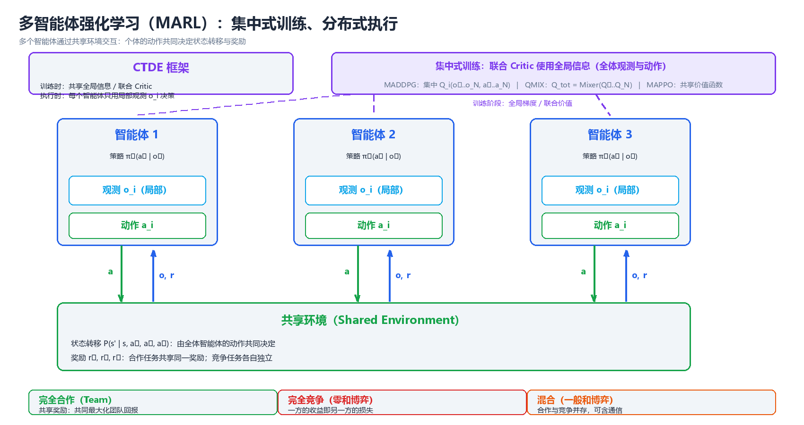
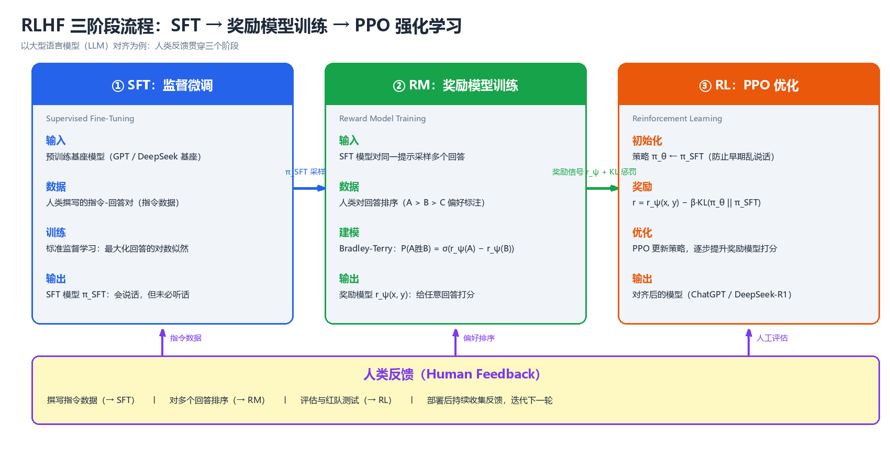

# 进阶专题（Advanced Topics）

> 前八章建立了一条完整的"标准 RL"主线：从 MDP 与动态规划，到时序差分与
> 值函数逼近，再到策略梯度与连续控制。这条主线有一个共同前提：**奖励函数
> 由环境给定**、**环境转移已知或可在线交互**、**只有一个智能体**。真实世界
> 的应用往往同时打破这三个前提——奖励需要从人类偏好中学习（RLHF）、环境
> 动力学昂贵或未知（model-based）、系统里有多个博弈方（多智能体）、数据
> 只能离线获取（offline RL）。本章作为全书的"前沿窗口"，介绍七个进阶方向：
> ① 模仿学习（从示范中学习，绕过奖励设计）；② model-based RL（学习环境
> 模型并用想象加速学习）；③ 多智能体强化学习（从博弈论到 CTDE）；④ RLHF
> 与 LLM 对齐（ChatGPT/DeepSeek 背后的技术）；⑤ 离线强化学习（不与环境
> 交互）；⑥ 探索机制（稀疏奖励下的内在动机）；⑦ 其他前沿（Decision
> Transformer、Meta-RL、安全 RL、层次化 RL）。最后给出从"表格"到"LLM
> Agent"的演化路线图与开放问题。与全书一致，正文代码为纯 Python 3 +
> NumPy 实现，可直接运行；标注"伪代码"的片段用于刻画难以脱离深度学习
> 框架的算法骨架。

---

## 一、模仿学习（Imitation Learning）

### 1.1 问题设定：当奖励函数不可得

标准 RL 的核心假设是奖励函数 $R(s, a)$ 已知或可查询。但在大量真实任务中，
奖励设计本身就是最困难的部分：让机器人叠衣服、让智能体按照人类驾驶风格
开车、让对话模型遵循人类偏好——这些任务的"好"难以用标量函数显式刻画，
却**容易示范**。模仿学习（imitation learning, IL）的思路是：放弃手工设计
奖励，直接从专家示范（expert demonstrations）中学习策略。

形式上，假设我们有一个专家策略 $\pi_E$（人类、已训练好的程序或传统控制器），
可以采集示范数据集：

$$D = \{ \tau_1, \tau_2, \dots, \tau_m \}, \quad \tau_i = (s_0, a_0, s_1, a_1, \dots, s_{T_i})$$

模仿学习的目标是学到一个策略 $\pi_\theta$，使其行为"尽可能接近"专家。
三个代表性方法家族的区别在于**利用示范的方式**：

| 方法 | 利用示范的方式 | 学到的东西 | 是否需要环境交互 |
|------|--------------|-----------|----------------|
| 行为克隆 BC | 把 $(s, a)$ 当独立样本做监督学习 | 策略 $\pi_\theta(a \mid s)$ | 否 |
| 逆强化学习 IRL | 从轨迹反推奖励函数 | 奖励 $R_\theta(s, a)$ + 策略 | 否（训练时） |
| GAIL | 判别器引导策略逼近专家占据度量 | 策略（隐式奖励） | 是（对抗训练） |

> **核心思想**：模仿学习把"定义目标"的问题转化为"展示行为"的问题。
> 示范数据是唯一的信息来源；三个家族的本质区别是"直接学策略"（BC）、
> "先学目标再学策略"（IRL）、"用判别器隐式定义目标"（GAIL）。

### 1.2 行为克隆（Behavioral Cloning, BC）

行为克隆是最直接的方法：把专家数据集里的 $(s, a)$ 对当作独立同分布样本，
用监督学习拟合策略：

$$\theta^* = \arg\max_\theta \sum_{(s, a) \in D} \log \pi_\theta(a \mid s)$$

对于连续动作，通常假设高斯策略 $\pi_\theta(a \mid s) = \mathcal{N}(a \mid \mu_\theta(s), \sigma^2)$，
对数似然最大化退化为回归问题（最小化 $\|a - \mu_\theta(s)\|^2$）。
BC 本质上就是**分类/回归**，工具链成熟、实现简单，这是它的最大优势。

以下代码用最小二乘克隆一个非线性专家（相当于单层线性策略的 BC），
验证 BC 在训练分布内确实能拟合得很好：

```python
# 行为克隆(BC): 用最小二乘(=高斯策略的最大似然)克隆非线性专家
import numpy as np

rng = np.random.default_rng(0)

def expert_policy(s):
    return -1.2 * s - 0.5 * np.tanh(3.0 * s)   # 非线性专家

# 采集专家数据集: 沿专家闭环轨迹采样 (s, a)
S, A = [], []
s = 1.0
for _ in range(2000):
    a = expert_policy(s) + rng.normal(0, 0.1)  # 专家动作带噪声
    S.append(s); A.append(a)
    s = 0.9 * s + a + rng.normal(0, 0.05)      # 系统动力学: s' = 0.9s + a + 噪声
S = np.array(S).reshape(-1, 1); A = np.array(A)

w = np.linalg.lstsq(S, A, rcond=None)[0]      # 闭式最小二乘 = 高斯似然最大化
print("克隆策略斜率 w =", round(float(w[0]), 4))
# 预期输出: 克隆策略斜率 w = -1.8799

# 在训练分布覆盖的状态范围内评估拟合质量
s_test = np.linspace(-0.5, 0.5, 200)
mse = np.mean((w[0] * s_test - expert_policy(s_test)) ** 2)
print("训练分布内均方误差 =", round(float(mse), 4))
# 预期输出: 训练分布内均方误差 = 0.0151
```

### 1.3 分布偏移与复合误差（Compounding Error）

BC 有一个致命的系统性缺陷：**训练与部署的状态分布不一致**。训练时，BC
看到的是专家访问过的状态（集中在专家轨迹附近）；部署时，克隆策略的任何
微小偏差都会把自己带到**专家从未访问过的状态**，而在这些状态上克隆策略
只能盲目外推（extrapolate），产生更大的错误，从而偏离得更远。这种
"误差自我放大"的恶性循环称为**复合误差**（compounding error），由
Ross & Bagnell（2010）给出正式刻画：

设克隆策略每步相对专家的期望误差上界为 $\epsilon$，则在长度为 $T$ 的
回合中，累积偏差以 $O(\epsilon T^2)$ 增长——**随回合长度二次爆炸**。
而专家自身的期望偏差是 $O(1)$。回合越长，BC 与专家的差距越大。

以下代码数值演示这一机制：每步新产生的误差 $\epsilon$ 在状态中持续累积
（环境对偏差没有恢复力），单步偏差线性增长、累计偏差二次增长：

```python
# 复合误差(compounding error)机制演示
# 模型: 每步克隆策略相对专家产生新误差 eps, 误差在状态中持续累积
import numpy as np

eps, T = 0.05, 40
dev, D = 0.0, []
for t in range(1, T + 1):
    dev += eps            # 每步新误差在状态中持续累积(无恢复力)
    D.append(dev)
cum = np.cumsum(D)
for t in [10, 20, 30, 40]:
    print(f"T={t:2d}: 单步偏差={D[t-1]:6.3f}  累计偏差={cum[t-1]:7.3f}")
# 预期输出:
# T=10: 单步偏差= 0.500  累计偏差=  2.750
# T=20: 单步偏差= 1.000  累计偏差= 10.500
# T=30: 单步偏差= 1.500  累计偏差= 23.250
# T=40: 单步偏差= 2.000  累计偏差= 41.000
print(f"理论: 单步偏差=εT, 累计偏差=εT(T+1)/2; T=40 时累计={eps*40*41/2:.2f}")
# 预期输出: 理论: 单步偏差=εT, 累计偏差=εT(T+1)/2; T=40 时累计=41.00
```

**DAgger（Dataset Aggregation, Ross et al. 2011）**是针对复合误差最直接的
修复：不再只收集专家轨迹，而是**迭代地让当前策略自己 rollout**，在它实际
访问到的状态上向专家查询动作，把新样本并入数据集再重新训练。这样训练分布
与部署分布逐步对齐，遗憾界从 $O(\epsilon T^2)$ 降到 $O(\epsilon T)$。
代价是需要一个**可交互的专家**（在线查询），这在很多场景（如人类驾驶）中
成本高昂。DAgger 的骨架：

```
伪代码: DAgger
输入: 专家 π*, 初始数据集 D₀
for i = 1, 2, ..., N:
    πᵢ ← 在 D 上监督训练            # BC 一步
    用 πᵢ  rollout 一条轨迹 τᵢ      # 在真实环境里跑
    在 τᵢ 的每个状态 s 上查询专家: a* = π*(s)
    D ← D ∪ {(s, a*) : s ∈ τᵢ}     # 聚合"被访问到的状态"上的专家标签
返回 最终策略 π_N
```

> **核心思想**：BC 失败的根源不是拟合精度，而是**训练分布与部署分布错位**
> （covariate shift）。DAgger 用"在访问到的状态上查询专家"把两个分布
> 拉齐；凡是没有专家可查询的场景（离线示范、人类标注昂贵），复合误差
> 就始终是 BC 系方法的天花板。

### 1.4 逆强化学习（Inverse Reinforcement Learning, IRL）

IRL 换了一个问法：**专家在优化什么？** 与其直接克隆动作，不如从专家轨迹
中反推出奖励函数 $R_\theta(s, a)$，再用标准 RL 以该奖励训练策略。核心动机
是**奖励的可迁移性**：策略 $\pi$ 绑定具体环境，而奖励 $R$ 刻画的是任务
本质，换一个环境（不同动力学）后奖励仍然有效。

经典方法：

- **学徒学习**（Apprenticeship Learning, Abbeel & Ng 2004）：假设奖励是
  特征线性组合 $R(s) = w^\top \phi(s)$，寻找权重 $w$ 使得专家策略在
  $\phi$ 上的期望特征 $\mathbb{E}_{\pi_E}[\phi]$ 优于（或接近）任何其他
  策略——即"专家是（近似）最优的"。
- **最大熵 IRL**（Maximum Entropy IRL, Ziebart et al. 2008）：在"奖励
  匹配专家特征"的约束下，选择熵最大的轨迹分布：

$$P_\theta(\tau) \propto \exp\big(R_\theta(\tau)\big), \qquad
\max_\theta \; \mathbb{E}_{\tau \sim \pi_E}\big[R_\theta(\tau)\big] - \log Z_\theta$$

其中 $Z_\theta = \sum_\tau \exp(R_\theta(\tau))$ 是配分函数。最大熵原则
避免了"多条轨迹都能匹配特征时奖励的任意性"。

IRL 的瓶颈在于内层要反复求解 RL（每次更新奖励都要重新训练一个策略），
计算量巨大；且奖励函数的**可辨识性**差——奖励加一个只依赖状态的常数、
或者做正仿射变换，最优策略不变，但学出来的奖励数值不可比。

### 1.5 GAIL：生成对抗模仿学习

GAIL（Generative Adversarial Imitation Learning, Ho & Ermon 2016）把
GAN 的思路搬进模仿学习：**生成器是策略 $\pi_\theta$，判别器 $D_\psi$ 负责
区分"状态-动作对来自专家还是来自当前策略"**。判别器给出的概率同时充当
策略的奖励信号：

$$\min_\theta \max_\psi \; \mathbb{E}_{\pi_\theta}\big[\log D_\psi(s, a)\big]
+ \mathbb{E}_{\pi_E}\big[\log(1 - D_\psi(s, a))\big] - \lambda H(\pi_\theta)$$

其中 $H(\pi_\theta)$ 是策略熵正则项。理论上，当判别器无法区分两个来源时，
$\pi_\theta$ 的**占据度量**（occupancy measure，即"策略在状态-动作空间上
的访问分布"）与专家一致——这比 BC 的逐点拟合更强：GAIL 匹配的是整个
访问分布，天然缓解复合误差。

与 IRL 的关系：GAIL 可以看作在"奖励函数空间"上做对偶优化，隐式地学到了
一个奖励（判别器的 logit），因此不需要显式地内层求解 RL，训练更直接。
代价是需要与真实环境交互（对抗训练要 rollout），且对判别器与策略的同步
训练比较敏感。

### 1.6 三大家族对比

| 维度 | 行为克隆 BC | 逆强化学习 IRL | GAIL |
|------|------------|---------------|------|
| 数据需求 | 仅离线示范 $(s,a)$ | 离线示范轨迹 + 环境动力学 | 离线示范 + 在线环境交互 |
| 训练方式 | 监督分类/回归，一步完成 | 交替：学奖励 → 解 RL → 再学奖励 | 判别器与策略交替对抗训练 |
| 学到什么 | 策略 $\pi_\theta$ | 奖励 $R_\theta$（+ 派生策略） | 策略 $\pi_\theta$（隐式奖励） |
| 优点 | 简单、快、稳定、无需交互 | 奖励可迁移、可解释任务目标 | 匹配访问分布、缓解复合误差 |
| 缺点 | 复合误差、需大量数据 | 内层 RL 昂贵、奖励不可辨识 | 需交互、训练不稳定 |
| 典型应用 | 简单行为克隆、机器人示教 | 自动驾驶奖励发现、行为建模 | 游戏、机器人、生成式行为 |

| 维度 | BC | DAgger | GAIL |
|------|----|--------|------|
| 是否需要专家在线查询 | 否 | 是 | 否（但需要环境交互） |
| 训练分布 | 固定专家分布 | 随策略迭代对齐 | 对抗中动态匹配 |
| 回合长度的遗憾界 | $O(\epsilon T^2)$ | $O(\epsilon T)$ | 匹配占据度量，无显式 $T$ 依赖 |

---

## 二、Model-based 强化学习

### 2.1 为什么要学习环境模型

前八章的算法（DQN、PPO、SAC）全部是 **model-free**：不显式建模环境，
只从真实交互中学习价值或策略。代价是**样本效率极低**——Atari 需要数千万
帧，机器人任务动辄百万步，因为每一步经验只被使用一次（或存入回放池反复
使用，但探索仍然昂贵）。model-based RL 的思路截然不同：**先学一个环境
模型（dynamics model），再用模型"想象"（imagine/plan）来加速学习**。

环境模型是对转移与奖励的近似：

$$s_{t+1} \approx f_\phi(s_t, a_t), \qquad r_t \approx r_\phi(s_t, a_t)$$

一旦有了 $f_\phi$，理论上可以用动态规划/搜索在"想象中"规划，或者在想象
数据上训练策略——相当于把真实经验的利用率放大了一个数量级。代价是模型
误差：**模型是错的**，在错误模型上规划会得到错误的策略（model bias），
且模型误差同样会随时间步复合。

| 特性 | Model-free RL | Model-based RL |
|------|--------------|----------------|
| 环境模型 | 不学 | 显式学习 $f_\phi, r_\phi$ |
| 样本效率 | 低（百万级步数） | 高（通常低 1~2 个数量级） |
| 泛化到新任务 | 差（策略绑定任务） | 较好（模型可复用） |
| 主要风险 | 探索低效 | **模型误差复合**（model bias） |
| 代表算法 | DQN、PPO、SAC、TD3 | Dyna-Q、PETS、World Models、Dreamer |
| 适用场景 | 模型难以学习（高维视觉、复杂物理） | 模型可学（机器人、控制、游戏） |

### 2.2 Dyna 架构：真实经验 + 想象经验

Dyna（Sutton 1990）是最早也最优雅的 model-based 框架：**学习一个查表式
模型，然后在每个真实时间步之后，额外从模型中采样若干条"想象经验"做
同样的学习更新**。真实经验修正模型，想象经验放大学习——两者共享同一个
学习器（如 Q-Learning）。

```
┌──────────────────── Dyna 架构 ────────────────────┐
│                                                    │
│   真实环境 ──(s,a)──► 真实经验 (s,a,r,s') ──┐       │
│      ▲                                        │       │
│      │ 动作                                    ▼       │
│   策略 ◄── Q-Learning 更新 ◄── 想象经验 ◄── 经验模型   │
│      ▲                                        │       │
│      └────────── n 次模型采样回放 ─────────────┘       │
│                                                    │
└────────────────────────────────────────────────────┘
```

Dyna-Q 的伪代码：

```
伪代码: Dyna-Q
初始化 Q(s,a), 模型 M(s,a) = None
循环(每个回合):
    s ← 初始状态
    循环(直到回合结束):
        a ← ε-贪心(Q, s)                    # 真实交互
        执行 a, 观测 (r, s')
        Q(s,a) ← Q(s,a) + α[r + γ max Q(s',·) - Q(s,a)]   # 真实更新
        M(s,a) ← (r, s')                     # 记录模型
        重复 n 次:                            # 想象更新
            (s̄, ā) ← 随机取一个已见过的状态-动作
            (r̄, s̄') ← M(s̄, ā)
            Q(s̄,ā) ← Q(s̄,ā) + α[r̄ + γ max Q(s̄',·) - Q(s̄,ā)]
        s ← s'
```

以下代码在 4×4 网格世界上对比"纯 Q-Learning"与不同想象步数的 Dyna-Q，
衡量指标为**首次到达目标所消耗的总步数**：

```python
# Dyna-Q: 真实经验 + 想象经验 的样本效率对比
import numpy as np

rng = np.random.default_rng(0)
N = 4
GOAL = (3, 3)
ACTIONS = [(0, 1), (0, -1), (1, 0), (-1, 0)]   # 右 左 下 上

def step(s, a):
    ns = (min(max(s[0] + a[0], 0), N - 1), min(max(s[1] + a[1], 0), N - 1))
    r = 1.0 if ns == GOAL else 0.0
    return ns, r

def run_dyna(n_plan=0, episodes=60):
    Q = np.zeros((N, N, 4))
    model = {}                       # 学习到的环境模型: (s,a) -> (s',r)
    total_steps = 0
    for ep in range(episodes):
        s = (0, 0)
        while s != GOAL:
            if rng.random() < 0.1:                    # ε-贪心
                a_idx = int(rng.integers(4))
            else:
                a_idx = int(np.argmax(Q[s[0], s[1]]))
            ns, r = step(s, ACTIONS[a_idx])
            # 真实经验更新
            Q[s[0], s[1], a_idx] += 0.5 * (r + 0.9 * np.max(Q[ns[0], ns[1]]) - Q[s[0], s[1], a_idx])
            model[(s, a_idx)] = (ns, r)
            # 想象回放: 从模型随机采样 n_plan 条经验
            items = list(model.items())
            for _ in range(n_plan):
                (ms, ma), (mns, mr) = items[int(rng.integers(len(items)))]
                Q[ms[0], ms[1], ma] += 0.5 * (mr + 0.9 * np.max(Q[mns[0], mns[1]]) - Q[ms[0], ms[1], ma])
            s = ns
            total_steps += 1
            if total_steps > 20000: break
        if total_steps > 20000: break
    return total_steps

print("无规划 Q-Learning 首次到达目标步数:", run_dyna(0))
# 预期输出: 无规划 Q-Learning 首次到达目标步数: 818
print("Dyna-Q n_plan=5  首次到达目标步数:", run_dyna(5))
# 预期输出: Dyna-Q n_plan=5  首次到达目标步数: 658
print("Dyna-Q n_plan=20 首次到达目标步数:", run_dyna(20))
# 预期输出: Dyna-Q n_plan=20 首次到达目标步数: 405
```

> **核心思想**：Dyna 揭示了 model-based 的本质收益——**想象经验是对真实
> 经验的"复制增强"**。同一份真实数据，模型让它被反复利用；想象步数
> $n$ 越大，学习越快，但前提是模型足够准确。当模型错误时，想象经验会
> 把错误也放大，这就是 model bias 的雏形。

### 2.3 世界模型（World Models）

Ha & Schmidhuber（2018）的 World Models 把 model-based 思想推向高维视觉
环境，由三个可分离的模块组成：

1. **视觉压缩器 V**（VAE）：把高维像素 $x$ 压缩成低维隐变量 $z$；
2. **记忆/动力学模型 M**（MDN-RNN，混合密度网络）：给定 $z$ 与动作 $a$，
   预测下一时刻的 $z$ 分布（混合高斯，捕捉多模态动力学）；
3. **控制器 C**：把 $z$ 与 RNN 隐状态 $h$ 映射到动作，**只在模型的"梦境"
   中训练**（用 C 的 rollout 数据优化，而不是真实环境数据）。

```
┌──────────── 世界模型 World Models (Ha & Schmidhuber 2018) ────────────┐
│                                                                       │
│   像素观测 x ──► VAE 编码器 ──► 隐变量 z ──► MDN-RNN ──► 预测 ẑ, ĥ      │
│                    (压缩视觉)         (记忆+动力学)  (多模态预测)       │
│                                              │                       │
│   动作 a ◄─────── 控制器 C(z, h) ◄────────────┘                       │
│            (在"梦境"中进化/训练, 不碰真实环境)                         │
│                                                                       │
└───────────────────────────────────────────────────────────────────────┘
```

关键思想是**抽象的两个层次**：VAE 把高维观测压缩成低维潜状态，RNN 在潜
空间中建模时间演化。控制器只面对"潜状态 + 记忆"，因此可以用进化策略或
极简单的策略优化在梦境中快速训练——真实环境只在采集训练数据时被访问。
在 CarRacing 等任务上，World Models 用远少于 model-free 的真实交互达到
同等水平。

### 2.4 Dreamer：潜空间想象

Dreamer（Hafner et al. 2020）把"世界模型 + 想象"推向通用算法：用
**RSSM**（Recurrent State-Space Model，循环状态空间模型）同时建模确定性
隐状态 $h_t$ 与随机隐状态 $z_t$，然后**在潜空间中用 actor-critic 做想象
rollout**：

$$s_t \sim q(s_t \mid s_{t-1}, a_{t-1}, o_t), \qquad
\hat{s}_{t+1}, \hat{r}_t = \text{RSSM}(\hat{s}_t, a_t)$$

训练分三步：① 用真实经验学习 RSSM（重建观测、预测奖励、预测隐状态）；
② 在潜空间想象 rollout，用 actor-critic 学习行为（价值与策略都只接触
潜状态，不接触像素）；③ 把学到的行为在真实环境执行，收集新数据。Dreamer
在 Atari 100k 基准（仅 10 万真实步）上大幅超越 model-free 方法，是
"用想象换样本效率"的标杆。其后续 DreamerV2/V3 将这一范式扩展到
离散潜变量与大规模视觉控制。

| 特性 | Dyna-Q | World Models | Dreamer |
|------|--------|--------------|---------|
| 模型形式 | 查表 $(s,a) \to (s',r)$ | VAE + MDN-RNN | RSSM（确定性+随机潜状态） |
| 想象用途 | 回放增强 Q-Learning | 进化/训练控制器 | 潜空间 actor-critic |
| 观测类型 | 表格状态 | 像素 | 像素/状态 |
| 真实交互需求 | 每个时间步 | 收集训练集即可 | 收集数据 + 周期部署 |
| 核心贡献 | 想象=复制增强 | 高维观测的压缩建模 | 端到端潜空间想象学习 |

---

## 三、多智能体强化学习（MARL）

### 3.1 博弈论基础：合作、竞争与混合博弈

多智能体强化学习（Multi-Agent RL, MARL）研究**多个同时学习、互相影响**
的智能体。与单智能体 RL 的本质区别：每个智能体的"环境"包含其他智能体的
策略，而其他智能体也在变化——这带来**非平稳性**（non-stationarity）。
根据智能体目标的关系，博弈分为三类：

| 博弈类型 | 目标关系 | 典型例子 | 解概念 |
|---------|---------|---------|--------|
| 完全合作 | 共享同一回报 | 双人协作搬运、SMAC 战斗 | 团队最优、值分解 |
| 完全竞争（零和） | 一方所得即另一方所失 | 围棋、扑克、匹配硬币 | 极小极大、纳什均衡 |
| 混合博弈 | 既有合作又有竞争 | 捉迷藏、足球、MOBA | 均衡 + 团队协作 |

**纳什均衡**（Nash equilibrium）是博弈论的核心解概念：一组策略
$(\pi_1^*, \dots, \pi_n^*)$，使得任何单个智能体单方面改变策略都无法
提高自己的收益：

$$V_i(\pi_i^*, \pi_{-i}^*) \ge V_i(\pi_i, \pi_{-i}^*), \quad \forall i, \forall \pi_i$$

其中 $\pi_{-i}$ 表示除 $i$ 外所有其他智能体的策略。注意纳什均衡描述的是
"没有单方偏离动机"的稳定点，**不一定是全局最优**（囚徒困境的纳什均衡
就是帕累托次优的）。并非所有博弈都有纯策略纳什均衡——**匹配硬币**
（Matching Pennies，两人同时出正/反面，相同则行玩家赢、不同则列玩家赢）
没有纯策略均衡，只有混合策略均衡 $(0.5, 0.5)$。

以下代码用**虚拟对局**（Fictitious Play）在匹配硬币上数值逼近混合纳什
均衡——每个玩家把对手的历史动作频率当作对手的混合策略，并对其做最佳应对：

```python
# 虚拟对局(Fictitious Play): 匹配硬币的混合纳什均衡
import numpy as np

rng = np.random.default_rng(0)
A = np.array([[1.0, -1.0], [-1.0, 1.0]])   # 匹配硬币: 行玩家收益(零和)
T = 5000
count_row = np.zeros(2)    # 行玩家对对手动作的历史计数
count_col = np.zeros(2)
a_row = int(rng.integers(2)); a_col = int(rng.integers(2))
row_mix = col_mix = None
for t in range(T):
    count_row[a_col] += 1
    count_col[a_row] += 1
    opp_mix = count_row / count_row.sum()
    a_row = int(np.argmax(A @ opp_mix))     # 行玩家对对手混合策略的最佳应对
    row_mix = count_col / count_col.sum()
    a_col = int(np.argmin(row_mix @ A))     # 列玩家最佳应对(零和: 最小化行收益)
    if t == T - 1:
        row_mix = count_col / count_col.sum()
        col_mix = opp_mix
print("行玩家混合策略:", np.round(row_mix, 3))
# 预期输出: 行玩家混合策略: [0.505 0.495]
print("列玩家混合策略:", np.round(col_mix, 3))
# 预期输出: 列玩家混合策略: [0.505 0.495]
print("理论混合纳什均衡: (0.5, 0.5)")
# 预期输出: 理论混合纳什均衡: (0.5, 0.5)
```

### 3.2 多智能体的两大困难：非平稳性与信用分配

**非平稳性**：对智能体 $i$ 而言，环境转移 $P(s' \mid s, a_i, a_{-i})$
依赖其他智能体的动作，而 $\pi_{-i}$ 在学习过程中不断变化。于是
$i$ 面对的"环境"随时间漂移，经验回放（replay buffer）里旧数据对应的
"环境"已经失效——单智能体的 DQN/PPO 直接搬过来会震荡甚至发散。

**信用分配**（credit assignment）：在完全合作的任务里，团队获得一个
联合回报 $R(s, \mathbf{a})$，但无法直接知道"这笔回报该归功于谁的哪个
动作"。这是合作 MARL 的分配难题，也是值分解方法（3.5 节）要解决的
问题。

### 3.3 CTDE：集中训练、分布执行

现代深度 MARL 的主流框架是 **CTDE**（Centralized Training with
Decentralized Execution）：**训练时**智能体可以共享全部信息（联合观测、
联合动作、甚至对方策略），**执行时**每个智能体只能依据自己的局部观测
$o_i$ 独立决策。CTDE 既绕开了"执行时通信"的工程约束，又让训练期能够
利用全局信息缓解非平稳性。

```
┌──────────── 训练期(集中式) ────────────┐      ┌───── 执行期(分布式) ─────┐
│                                        │      │                          │
│   Critic: V(s, a₁, …, aₙ)              │      │   智能体 i 只依据局部观测  │
│   ↑ 联合观测 + 联合动作                  │      │   oᵢ 决策:                │
│   Actorᵢ: πᵢ(aᵢ | oᵢ)  仅局部观测       │ ───► │   aᵢ = πᵢ(oᵢ)            │
│   (集中式 Critic 给 Actor 提供稳定梯度)   │      │   无通信、无全局信息        │
│                                        │      │                          │
└────────────────────────────────────────┘      └──────────────────────────┘
```

> **核心思想**：CTDE 的哲学是"**训练时开卷、执行时闭卷**"。集中式 Critic
> 看到所有智能体的观测与动作，把其他智能体的策略"固定"进价值函数，从而
> 消除非平稳性对梯度的影响；执行时每个 Actor 只用自己的观测，满足去中心化
> 部署的约束。

### 3.4 MADDPG：集中式 Critic 的连续动作方案

MADDPG（Lowe et al. 2017）把 DDPG 扩展到多智能体：每个智能体 $i$ 有
自己的 Actor $\mu_i(o_i)$（分布执行）与 Critic $Q_i(s, a_1, \dots, a_n)$
（集中训练，输入**所有**智能体的观测与动作）。Critic 的更新：

$$y_i = r_i + \gamma \, Q_i^{\bar{\mu}}(s', \mu_1^{\bar{}}(o_1'), \dots, \mu_n^{\bar{}}(o_n'))$$

Actor 用**确定性策略梯度**更新，梯度里 Critic 对 $a_i$ 求导时把其他
智能体的动作当作常数。MADDPG 的贡献在于：① 用集中式 Critic 缓解非平稳性；
② 支持**混合博弈**——每个智能体维护自己的 Critic，无需共享回报假设；
③ 训练时可以选择性地利用其他智能体的策略（policy ensemble）。经典
演示环境是"追捕-逃跑"（predator-prey）与"物理协作通信"。

### 3.5 QMIX：合作场景的值分解

QMIX（Rashid et al. 2018）面向**完全合作**的设定（dec-POMDP），目标是
学习联合动作价值 $Q_{tot}(\tau, \mathbf{u})$，同时保持**可分解性**：
$Q_{tot}$ 由各智能体的 $Q_i(\tau_i, u_i)$ 通过一个**单调混合网络**
（mixing network）合成：

$$Q_{tot}(\tau, \mathbf{u}) = \text{Mixer}\big(Q_1(\tau_1, u_1), \dots, Q_n(\tau_n, u_n)\big),
\qquad \frac{\partial Q_{tot}}{\partial Q_i} \ge 0, \ \forall i$$

单调性约束（混合网络的权重强制非负）保证 **IGM 原理**成立：
对 $Q_{tot}$ 取 argmax 等价于对各 $Q_i$ 分别取 argmax。于是训练时可以用
全局的 $Q_{tot}$ 做标准的 DQN 更新（联合回报 $r_{tot}$），执行时每个
智能体只需贪心自己的 $Q_i$——"全局最优 = 局部最优之和"，这正是把
团队信用分配问题"溶解"进单调混合结构的方式。QMIX 在星际争霸多智能体
挑战赛（SMAC）等合作任务上表现优异，是值分解家族（VDN → QMIX →
QTRAN/QPLEX）的枢纽。

### 3.6 MAPPO：简单但强大的基线

MAPPO（Yu et al. 2022）的思路出奇地简单：**把单智能体 PPO 直接搬到
多智能体，加上两个工程选择**——① 所有智能体**共享同一套策略网络参数**
（parameter sharing，输入附带智能体 ID 以区分身份）；② 使用**集中式
价值函数** $V(s)$（输入全局状态）。不做任何专门的博弈论设计，MAPPO 在
SMAC、Google Research Football、MuJoCo 多智能体等基准上达到了当时
SOTA 或接近 SOTA 的水平，远超许多"花哨"的 MARL 算法。

这给社区的重要启示是：**多智能体算法的大量复杂设计，可能只是掩盖了
单智能体基线（PPO）本身调参不充分的问题**。MAPPO 的工程细节（价值
归一化、advantage 计算、梯度裁剪）与 PPO 完全一致，因此成为今天 MARL
实验的事实基线。

### 3.7 MARL 算法对比



*图：多智能体系统中的交互结构——多个智能体共享环境，各自的策略通过
环境与其他智能体的行为相互影响（集中训练与分布执行的 CTDE 结构见 3.3 节）。*

| 维度 | MADDPG | QMIX | MAPPO |
|------|--------|------|-------|
| 适用博弈 | 混合（合作+竞争） | 完全合作 | 合作为主（亦可竞争） |
| 动作空间 | 连续 | 离散 | 连续/离散 |
| 策略类型 | 确定性（DDPG 式） | 值函数（DQN 式） | 随机（PPO 式） |
| 信用分配 | 各智能体独立 Critic | 单调混合 $Q_{tot}$ | 共享价值函数 |
| 集中式信息 | 全部观测+动作进 Critic | 全局状态进 Mixer | 全局状态进 Critic |
| 参数共享 | 否（各智能体独立） | 否 | 是（+ID 区分） |
| 代表基准 | Predator-Prey、MPE | SMAC、MA Gridworld | SMAC、GRF、MAMuJoCo |
| 主要弱点 | Critic 输入维度爆炸 | 单调性限制表达能力 | 大规模下信用分配仍模糊 |

---

## 四、RLHF 与 LLM 对齐

### 4.1 背景：从"会说话"到"说人话"

大语言模型（LLM）的预训练目标是**下一个词预测**，这让模型"会说话"
（语言流畅、知识丰富），但未必"说人话"：可能输出有害内容、编造事实、
不遵循用户指令。**对齐**（alignment）的目标是让模型行为符合人类意图与
价值观。RLHF（Reinforcement Learning from Human Feedback，基于人类
反馈的强化学习）是当前最主流的对齐技术路线，由 OpenAI 的 InstructGPT
（2022）系统化，并成为 ChatGPT 的核心训练组件；DeepSeek-R1 等模型则
在其上演进出了 GRPO 等变体。

RLHF 的底层洞察是：**"什么回答好"难以用规则写死，但人类很容易比较两个
回答哪个更好**。于是用成对偏好数据训练一个奖励模型，再用强化学习优化
策略——奖励函数本身是从人类反馈中学出来的，这正是第 1 章 IRL 思想的
大规模工业实践。

### 4.2 三阶段流程

标准 RLHF 包含三个递进阶段：**监督微调（SFT）→ 奖励建模（RM）→
强化学习优化（PPO）**。

```
┌────────────────── RLHF 三阶段流程 ──────────────────┐
│                                                     │
│  ① 监督微调 SFT                                     │
│     预训练模型 ──人类示范数据──► π_SFT(指令跟随基线)   │
│                                                     │
│  ② 奖励建模 RM                                      │
│     π_SFT 采样回答 ──人类成对标注──► 奖励模型 r_φ      │
│     (对同一 prompt 的两个回答打分/排序)               │
│                                                     │
│  ③ 策略优化 RL (PPO)                                │
│     π_θ 采样 ──► r_φ 打分 ──► PPO 更新 π_θ           │
│         └── KL(π_θ ‖ π_SFT) 惩罚, 防止奖励黑客 ──┘   │
│                                                     │
└─────────────────────────────────────────────────────┘
```



*图：RLHF 三阶段总览——SFT 建立指令跟随基线，RM 把人类偏好编码为奖励
信号，PPO 用该奖励优化策略并辅以 KL 约束。*

| 阶段 | 输入 | 输出 | 学习方式 |
|------|------|------|---------|
| SFT | 人工撰写的高质量 (指令, 回答) 对 | $\pi_{SFT}$ | 监督学习（交叉熵） |
| RM | $\pi_{SFT}$ 采样 + 人类成对偏好 | $r_\phi(x, y)$ | 成对排序学习（Bradley-Terry） |
| PPO | $\pi_{SFT}$ 初始化 + $r_\phi$ | $\pi_\theta$（对齐后策略） | 强化学习（带 KL 惩罚） |

### 4.3 奖励模型训练：Bradley-Terry 模型

奖励模型 $r_\phi(x, y)$ 输入 prompt $x$ 与回答 $y$，输出一个标量分数。
训练数据是人类对同一 prompt 下**两个回答的偏好**：$(x, y_w, y_l)$ 表示
$y_w$ 比 $y_l$ 更受欢迎。Bradley-Terry 模型假设偏好概率服从成对 logistic：

$$P(y_w \succ y_l \mid x) = \sigma\big(r_\phi(x, y_w) - r_\phi(x, y_l)\big)$$

训练目标是最小化偏好预测的负对数似然：

$$\mathcal{L}_{RM}(\phi) = -\mathbb{E}_{(x, y_w, y_l) \sim D}
\Big[\log \sigma\big(r_\phi(x, y_w) - r_\phi(x, y_l)\big)\Big]$$

注意奖励模型的**绝对数值无意义**，只有**差值**有意义——这正是 Bradley-
Terry 只建模相对偏好的体现。以下代码用 NumPy 从成对偏好中训练一个线性
奖励模型（真实权重 $w^*$ 隐藏，仅通过成对比较可观测），验证学到的奖励
方向与真实奖励一致：

```python
# 奖励模型训练: Bradley-Terry 从成对偏好中学习线性奖励
import numpy as np

rng = np.random.default_rng(42)
d = 4
w_star = rng.normal(size=d)          # 隐藏的真实奖励权重(不可直接观测)
N = 1000
X = rng.normal(size=(N, d))          # N 个"回答"的特征向量

# 生成成对偏好: 按 Bradley-Terry 概率采样谁更优
pairs = []
while len(pairs) < N:
    i, j = int(rng.integers(N)), int(rng.integers(N))
    if i == j: continue
    p_win = 1.0 / (1.0 + np.exp(-(X[i] @ w_star - X[j] @ w_star)))
    pairs.append((i, j) if rng.random() < p_win else (j, i))

# 用梯度下降最大化偏好似然(最小化 -log σ(r_w - r_l))
w = np.zeros(d)
lr = 1.0
for epoch in range(50):
    g = np.zeros(d)
    for i, j in pairs:
        p = 1.0 / (1.0 + np.exp(-(X[i] @ w - X[j] @ w)))
        g += (p - 1.0) * (X[i] - X[j])       # -log σ 对 w 的梯度
    w -= lr * g / len(pairs)

print("学到的奖励权重:", np.round(w, 3))
# 预期输出: 学到的奖励权重: [ 0.354 -1.029  0.831  1.07 ]
print("真实奖励权重  :", np.round(w_star, 3))
# 预期输出: 真实奖励权重  : [ 0.305 -1.04   0.75   0.941]
cos = float(w @ w_star / (np.linalg.norm(w) * np.linalg.norm(w_star)))
print("方向余弦相似度:", round(cos, 4))
# 预期输出: 方向余弦相似度: 0.9979
```

> **核心思想**：Bradley-Terry 揭示了奖励学习的本质——**只需要相对偏好，
> 不需要绝对分数**。人类标注员可以稳定地说"A 比 B 好"，却很难给出
> "A 值 7.3 分"这样的绝对评分；奖励模型把排序信号转化为可优化的标量场，
> 且尺度不可辨识（乘任意正常数不改变偏好），因此 PPO 阶段只需关心
> 奖励的排序而非数值。

### 4.4 RLHF-PPO：带 KL 惩罚的策略优化

得到奖励模型后，把 $\pi_{SFT}$ 作为初始策略，用 PPO 最大化期望奖励，
同时**惩罚与参考策略的 KL 散度**：

$$\max_\theta \; \mathbb{E}_{x \sim D, y \sim \pi_\theta(\cdot \mid x)}
\Big[ r_\phi(x, y) - \beta \, \mathrm{KL}\big(\pi_\theta(\cdot \mid x) \,\|\, \pi_{SFT}(\cdot \mid x)\big) \Big]$$

KL 惩罚项（系数 $\beta$）的作用是双重的：① 防止**奖励黑客**（reward
hacking）——奖励模型是近似物，策略可能找到"高分但人类不喜欢"的对抗样本
（如堆砌华丽辞藻、谄媚、无意义冗长）；② 保持模型的通用能力，避免
"过度优化单点奖励导致能力遗忘"（alignment tax）。实际实现中，PPO 的
优势函数基于奖励模型的打分（加上 KL 惩罚作为即时奖励），并使用与
$\pi_{SFT}$ 的 KL 作为每步约束；为节省内存，常用 PPO-ptx 混合目标
（在 RL 损失上叠加一小部分预训练/SFT 的交叉熵损失）。

### 4.5 DPO：直接偏好优化

DPO（Direct Preference Optimization, Rafailov et al. 2023）观察到：
RLHF 的目标函数有**闭式解**——最优策略可以解析地写成

$$\pi^*(y \mid x) = \frac{1}{Z(x)} \pi_{ref}(y \mid x) \exp\Big(\frac{1}{\beta} r(x, y)\Big)$$

反解出奖励 $r(x, y) = \beta \log \frac{\pi^*(y \mid x)}{\pi_{ref}(y \mid x)} + Z(x)$，
把它代回 Bradley-Terry 偏好损失，就得到**只依赖策略、不依赖奖励模型**的
DPO 损失：

$$\mathcal{L}_{DPO}(\theta) = -\mathbb{E}_{(x, y_w, y_l)}
\Big[ \log \sigma\Big( \beta \log \frac{\pi_\theta(y_w \mid x)}{\pi_{ref}(y_w \mid x)}
- \beta \log \frac{\pi_\theta(y_l \mid x)}{\pi_{ref}(y_l \mid x)} \Big) \Big]$$

DPO 的意义是**把"学奖励 + 强化学习"两步合并成一步监督式优化**：
不再需要训练奖励模型，不再需要在线采样与 PPO 的复杂工程（重要性采样、
GAE、KL 动态调节），偏好数据直接作用于策略。代价是：策略只在偏好数据
覆盖的分布上被优化，缺乏 PPO 在线探索带来的分布外改进；且隐式奖励
假设了 Bradley-Terry 偏好模型，偏好结构更复杂时（如多轮对话、群体
偏好）表现受限。

### 4.6 RLHF(PPO) vs DPO 对比

| 维度 | RLHF-PPO | DPO |
|------|----------|-----|
| 训练流程 | SFT → 训练 RM → PPO 在线优化 | SFT → 直接偏好优化（一步） |
| 奖励模型 | 需要显式训练 $r_\phi$ | 不需要（隐式奖励） |
| 在线采样 | 需要（策略 rollout 打分） | 不需要（纯离线） |
| 计算成本 | 高（RM + 多轮 PPO） | 低（单轮监督式） |
| 稳定性 | 对 $\beta$、KL 调度敏感 | 对 $\beta$ 与参考策略敏感 |
| 分布外探索 | 有（在线采样） | 无（限于数据分布） |
| 隐式假设 | 奖励模型可学 | Bradley-Terry 偏好 + 闭式解 |
| 代表工作 | InstructGPT、ChatGPT | DPO、Zephyr、DeepSeek-R1(GRPO 变体) |

### 4.7 与 ChatGPT / DeepSeek 的联系

- **ChatGPT**（OpenAI, 2022）：基于 InstructGPT 的 RLHF 管线——GPT-3.5
  先 SFT，再训练奖励模型（人类对多个回答排序），最后用 PPO 优化，辅以
  KL 约束与 PPO-ptx 混合目标。ChatGPT 的"对话感"主要来自第三阶段。
- **DeepSeek-R1**（2025）：在 RLHF 路线上做了两项关键改动——① 用
  **GRPO**（Group Relative Policy Optimization）替代 PPO：同一 prompt
  采样一组回答，用组内相对优势估计（不需要 Critic 网络），大幅降低显存
  与训练复杂度；② 用**规则型奖励**（格式正确性、数学/代码的客观正确性）
  替代（或补充）学习型奖励模型，使"推理能力"可以通过纯 RL 涌现——
  R1-Zero 甚至跳过了 SFT 冷启动，直接从头 RL 就涌现出长思维链与自我
  反思行为。这展示了 RL 在对齐与能力增强上的双重威力：**奖励可以是学
  出来的（RLHF），也可以是规则定义的（R1 的推理奖励）**。

---

## 五、离线强化学习（Offline RL）

### 5.1 问题设定：从固定数据集学习，不与环境交互

标准 RL 通过在线交互收集数据；但在许多高风险场景（自动驾驶、医疗、真实
机器人），**在线试错代价不可接受**，而历史数据却大量存在（人类驾驶日志、
专家操作记录、过去策略的 rollout）。离线强化学习（Offline RL，又称
batch RL）研究：**仅从固定数据集 $D = \{(s, a, r, s')\}$ 学习策略，
训练期间完全不与环境交互**。这看起来只是"用回放池训练"，但隐藏着
本质困难。

| 维度 | 在线 RL | 离线 RL |
|------|--------|---------|
| 数据来源 | 当前策略实时交互 | 固定历史数据集（任意策略产生） |
| 数据分布 | 随策略演化 | 固定（无法补充缺失区域） |
| 探索 | 主动（策略决定去向） | 无（数据里没有的状态永远到不了） |
| 安全性 | 试错有代价 | 高（不碰真实环境） |
| 核心挑战 | 探索-利用权衡 | **分布偏移 + 外推误差** |
| 代表算法 | DQN、PPO、SAC | CQL、IQL、TD3+BC、Decision Transformer |

### 5.2 分布偏移与外推误差

离线 RL 的失败模式可以用一句话概括：**策略会"钻数据集的空子"**。训练
中，Q 函数会对**数据集中没出现过的动作**（OOD 动作）给出外推估计——
神经网络在未见输入上可能给出任意大的 Q 值；而策略优化（$\max_a Q$）恰好
偏爱 Q 值最大的动作，于是策略被推向数据分布之外，在那里 Q 的估计完全
不可靠。Fujimoto et al.（2019）称之为**外推误差**（extrapolation error），
并证明它来自三个来源：① OOD 动作的 Q 值缺失监督；② 贝尔曼更新把误差
向后传播；③ 策略被误差"吸引"到 OOD 区域。其后果是：**直接拿 SAC/DDPG
在固定数据集上训练，学到的策略往往比数据集里的行为策略还差**。

> **核心思想**：在线 RL 中"数据跟随策略"是自洽的——策略去哪里，数据就
> 补到哪里；离线 RL 打破了这种自洽。一切离线算法的本质，都是在
> "利用数据"与"约束在数据分布内"之间做权衡：要么约束策略（行为克隆化），
> 要么惩罚 OOD 动作的价值（保守估计）。

### 5.3 CQL：保守 Q 学习

CQL（Conservative Q-Learning, Kumar et al. 2020）从**价值函数**入手：
在标准贝尔曼误差之外，显式地压低 OOD 动作的 Q 值、抬高数据内动作的
Q 值：

$$\mathcal{L}_{CQL}(\theta) = \underbrace{\alpha \, \mathbb{E}_{s \sim D, a \sim \mu(a \mid s)}\big[Q_\theta(s, a)\big]}_{\text{压低任意策略 } \mu \text{ 下(含 OOD)的 Q}}
- \underbrace{\alpha \, \mathbb{E}_{s \sim D, a \sim \pi_\beta}\big[Q_\theta(s, a)\big]}_{\text{抬高数据内动作的 Q}}
+ \underbrace{\text{Bellman 误差}}_{\text{标准 TD 项}}$$

第一项对**所有**动作（特别是策略 $\mu$ 倾向选择的 OOD 动作）的 Q 值
施加下压，第二项对数据集内动作的 Q 值上抬，二者共同保证：学到的 Q 是
数据分布内的**保守下界**，策略优化 $\max_a Q$ 不再被外推误差欺骗。
CQL 在 D4RL 基准上表现强劲，是离线 RL 的代表作之一。

### 5.4 IQL：隐式 Q 学习

IQL（Implicit Q-Learning, Kostrikov et al. 2022）走了一条不同路线：
**不约束策略、也不惩罚 OOD 动作，而是只利用数据内动作的价值信息**。
关键工具是 **expectile 回归**：用不对称损失拟合价值，

$$\min_\theta \; \mathbb{E}_{(s,a,s') \sim D}\Big[ L_2^\tau\big( r + \gamma \max_{a' \sim \hat{\pi}_\beta} Q_{\bar\theta}(s', a') - Q_\theta(s, a) \big) \Big]$$

其中 $L_2^\tau(u) = |\tau - \mathbb{1}\{u < 0\}| \cdot u^2$：$\tau > 0.5$
时，损失更重视"正的 TD 误差"，即学习目标偏向上分位（乐观地估计数据内
最好动作的价值），而**从不查询 OOD 动作的价值**（max 只在数据集内动作
上取）。策略则用 advantage 加权的行为克隆提取。IQL 不需要额外的策略
约束项或 Q 惩罚项，实现简单、对超参不敏感，且能自然地扩展到**从离线
数据 + 在线微调**的场景。

### 5.5 离线算法对比与选择

| 维度 | CQL | IQL | TD3+BC |
|------|-----|-----|--------|
| 约束机制 | 惩罚 OOD 动作的 Q | 只利用数据内价值（expectile） | 行为克隆正则 + TD3 |
| 策略类型 | 隐式（由 Q 导出） | 显式（AW-BC 提取） | 显式确定性策略 |
| 是否需要策略约束 | 否（Q 保守即可） | 否 | 是（BC 项） |
| 实现复杂度 | 中 | 低 | 低 |
| 数据质量敏感性 | 中 | 低 | 中 |
| 在线微调扩展 | 一般 | 好 | 一般 |

### 5.6 Offline RL 与 RLHF 的关系

两者看似无关，实则共享同一数学骨架：

- **DPO 就是一次"离线策略优化"**：偏好数据集是固定的，DPO 直接在其中
  优化策略，不与环境（或 LLM 采样器）交互——它是 Offline RL 思想在
  语言模型上的直接应用。
- **RLHF-PPO 阶段是在线 RL**：策略 rollout 后由奖励模型打分，新数据
  反馈进训练，这正是在线 RL 的循环；而奖励模型训练本身是离线的
  （固定偏好数据集）。
- **共同敌人是分布偏移**：离线 RL 怕策略钻数据空子；RLHF 怕策略钻奖励
  模型空子（奖励黑客）——所以 PPO 阶段要加 KL 惩罚，本质上就是给策略
  "留在参考分布附近"的约束，与 CQL/TD3+BC 的"留在数据分布内"异曲同工。

| 概念 | Offline RL | RLHF |
|------|-----------|------|
| 数据 | $(s, a, r, s')$ 转移 | (prompt, 回答, 偏好) 元组 |
| 奖励来源 | 数据集标注 | 人类偏好 / 奖励模型 |
| 分布偏移风险 | OOD 动作被高估 | 奖励黑客、能力遗忘 |
| 约束手段 | 保守 Q / BC 正则 | KL 惩罚 / 参考策略 |
| 代表算法 | CQL、IQL、TD3+BC | PPO-KL、DPO、GRPO |

---

## 六、探索机制专题

### 6.1 稀疏奖励问题

前面所有算法都隐含假设"奖励信息足够引导学习"。但大量真实任务只有
**稀疏奖励**（sparse reward）：迷宫只有一个出口奖励、游戏只在通关时
给分、机器人只在任务完成时 +1。此时随机探索（$\epsilon$-greedy、高斯
噪声）找到奖励的概率随状态空间维度**指数下降**——这就是为什么 DQN 在
Montezuma's Revenge 上几十年无法通关。稀疏奖励下，**探索本身成了
主要矛盾**：算法必须"主动去找"可能带来奖励的状态，而不是被动等奖励
信号。

### 6.2 内在奖励：把"新奇"变成奖励

内在动机（intrinsic motivation）的核心思想：给智能体一个**与外部任务
无关的额外奖励**，鼓励它探索未知：

$$r_{total}(s, a) = r_{ext}(s, a) + \beta \, r_{int}(s, a)$$

$r_{ext}$ 是任务奖励，$r_{int}$ 是内在奖励——衡量"这个状态/动作有多
新奇"。"新奇"的定义方式决定了不同算法。最早的一族是**计数法**：
$r_{int}(s) = 1/\sqrt{N(s)}$（$N(s)$ 为状态访问次数），访问越少越新
奇。以下代码在 5×5 网格"全覆盖"任务上对比随机游走与贪心最大化
$1/\sqrt{N}$ 的探索效率——内在奖励驱动的探索是**系统性的**，而非碰运气：

```python
# 内在奖励机制演示: 5x5 网格"访问全部 25 格"的探索任务
import numpy as np

N = 5
ACTIONS = [(0, 1), (0, -1), (1, 0), (-1, 0)]   # 右 左 下 上

def novelty_walk(rng, max_steps=2000):
    """贪心最大化内在奖励 r_int = 1/sqrt(N(s')) 的系统探索"""
    counts = np.zeros((N, N))
    visited = set()
    r_, c_ = 0, 0
    for t in range(max_steps):
        visited.add((r_, c_))
        if len(visited) == N * N:
            return t + 1                        # 全部覆盖, 返回步数
        cand = []
        for dr, dc in ACTIONS:
            nr, nc = min(max(r_ + dr, 0), N - 1), min(max(c_ + dc, 0), N - 1)
            cand.append((counts[nr, nc], nr, nc))
        m = min(x[0] for x in cand)             # 找访问次数最少的邻居
        best = [(nr, nc) for k, nr, nc in cand if k == m]
        r_, c_ = best[rng.integers(len(best))]  # 平局随机
        counts[r_, c_] += 1
    return max_steps

def random_walk(rng, max_steps=2000):
    """无内在奖励: 均匀随机游走"""
    visited = set()
    r_, c_ = 0, 0
    for t in range(max_steps):
        visited.add((r_, c_))
        if len(visited) == N * N:
            return t + 1
        dr, dc = ACTIONS[rng.integers(4)]
        r_, c_ = min(max(r_ + dr, 0), N - 1), min(max(c_ + dc, 0), N - 1)
    return max_steps

for seed in range(3):
    r1 = random_walk(np.random.default_rng(seed))
    r2 = novelty_walk(np.random.default_rng(seed))
    print(f"seed={seed}: 随机游走={r1}步, 内在奖励贪心={r2}步")
# 预期输出(随机性体现在具体数值, 量级稳定):
# seed=0: 随机游走=121步, 内在奖励贪心=62步
# seed=1: 随机游走=448步, 内在奖励贪心=39步
# seed=2: 随机游走=179步, 内在奖励贪心=27步
avg_r = np.mean([random_walk(np.random.default_rng(s)) for s in range(50)])
avg_n = np.mean([novelty_walk(np.random.default_rng(s)) for s in range(50)])
print(f"50 次平均: 随机游走={avg_r:.1f}步, 内在奖励贪心={avg_n:.1f}步")
# 预期输出: 50 次平均: 随机游走=227.6步, 内在奖励贪心=37.3步
```

### 6.3 ICM：预测下一状态的误差

ICM（Intrinsic Curiosity Module, Pathak et al. 2017）把"新奇"定义为
**动力学预测误差**：如果智能体对"动作之后世界会变成什么样"预测不准，
说明它正处于不熟悉的状态，应该被奖励。为在高维像素下工作，ICM 先学
一个特征映射 $\phi$，再在前向动力学中预测 $\phi(s')$：

$$r_{int}(s, a, s') = \big\| \phi(s') - \hat{\phi}(s, a) \big\|_2^2$$

关键设计是**特征映射由逆动力学训练**：$\phi$ 的优化目标是"从
$\phi(s), \phi(s')$ 反推动作 $a$"。这保证了 $\phi$ 只保留**与动作相关**
的信息，丢弃与决策无关的噪声（树叶晃动、云彩飘动）——否则"随机噪声
预测不准"会给出恒定的伪新奇奖励（noisy-TV 问题）。ICM 在 Montezuma's
Revenge 等稀疏奖励游戏中首次实现了显著的探索收益。

### 6.4 RND：随机网络蒸馏

RND（Random Network Distillation, Burda et al. 2018）换了一个更简单
稳健的"新奇"定义：**固定一个随机初始化的目标网络 $f: \mathcal{S} \to
\mathbb{R}^k$（永不再训练），训练一个预测器 $\hat{f}$ 去拟合它**。
内在奖励是预测误差：

$$r_{int}(s') = \big\| f(s') - \hat{f}(s') \big\|_2^2$$

直觉：目标网络是固定的"随机哈希函数"，预测器只能对**见过的状态**拟合
得好；没见过的状态预测误差大 → 新奇。RND 相比 ICM 的优势：① 不需要
环境模型（不预测转移，只做"输入→随机输出"的蒸馏）；② 没有特征坍塌
风险（目标固定，预测器被迫学习真实输入结构）；③ 实现极其简单。RND
是 OpenAI 在 Montezuma's Revenge 上取得突破的核心组件。

| 维度 | ICM | RND |
|------|-----|-----|
| 新奇的定义 | 前向动力学预测误差 | 随机目标网络的蒸馏误差 |
| 是否学环境模型 | 是（$\phi(s')$ 预测） | 否（纯蒸馏） |
| 特征表示 | 逆动力学训练（动作相关） | 预测器隐层（自动学习） |
| 噪声鲁棒性 | 需逆动力学过滤噪声 | 好（随机目标与输入无关） |
| 实现复杂度 | 中（三个网络） | 低（两个网络） |
| 典型应用 | 稀疏奖励游戏、机器人探索 | Montezuma、稀疏奖励基准 |

> **核心思想**：ICM 与 RND 回答同一个问题——"如何用可学习的方式定义
> 新奇"。ICM 说"新奇 = 我还不懂这里的动力学"，RND 说"新奇 = 我还没
> 见过这个输入"。前者需要一个(特征空间的)环境模型，后者只需要一个
> 固定的随机函数；在噪声环境中 RND 更稳健，在需要动作因果信息的场景
> ICM 更本质。它们的共同风险是**内在奖励掩盖外部奖励**（智能体沉迷
> 探索而忘记任务），实践中靠 $\beta$ 系数与课程调度平衡。

---

## 七、其他前沿方向

### 7.1 Decision Transformer：把 RL 当成序列建模

Decision Transformer（DT, Chen et al. 2021）提出了一个颠覆性的视角：
**RL 可以不做价值迭代、不做策略梯度，而是当成条件序列生成**。把一段
轨迹改写成三元组序列，并引入**回报到go**（returns-to-go）$\hat{R}_t =
\sum_{t' \ge t} \gamma^{t'-t} r_{t'}$：

$$\tau = \big( \hat{R}_1, s_1, a_1, \hat{R}_2, s_2, a_2, \dots \big)$$

用一个 GPT 式的因果 Transformer 训练"给定 $\hat{R}_t, s_t$ 预测 $a_t$"
的自回归目标。**推理时**，设定一个期望回报（如最高分），模型生成达到
该回报的动作序列。DT 的优势：复用语言模型的成熟基础设施（并行训练、
长上下文）、天然处理多模态状态、训练完全离线；劣势：对数据质量敏感、
外推能力弱（只能生成数据里出现过的"高回报模式"）。DT 与后续的
Trajectory Transformer、Q-learning Transformer 共同开创了**序列决策**
（sequence decision making）方向。

### 7.2 Meta-RL：学会学习

Meta-RL（元强化学习）研究**跨任务的快速适应**：给定任务分布
$p(\mathcal{T})$（如"任意随机迷宫"、"任意新机械臂"），希望智能体在与
新任务交互少量样本后就能快速上手——"学会如何学习"。三条主要路线：

| 路线 | 代表工作 | 机制 | 适应方式 |
|------|---------|------|---------|
| 记忆型 | RL²（Duan et al. 2016） | RNN 把历史 $(r, s, a)$ 编码进隐状态 | 隐状态隐式编码任务后验 |
| 梯度型 | MAML（Finn et al. 2017） | 学一个"容易微调"的初始化参数 | 新任务上几步梯度下降 |
| 上下文型 | PEARL（Rakelly et al. 2019） | 推理出任务表征 $z$，条件化策略 | 显式后验推断 + 策略条件化 |

Meta-RL 的核心张力是**元训练分布**：如果测试任务与元训练任务差异过大，
适应能力随之失效——"学会学习"的前提是"见过类似的学习问题"。

### 7.3 安全强化学习：带约束的 MDP

安全 RL 在优化回报的同时必须满足**安全约束**（不碰撞、不越界、不伤害）。
标准形式是**约束马尔可夫决策过程**（Constrained MDP, CMDP）：
在 MDP 上增加代价函数 $c(s, a)$ 与约束阈值 $d$：

$$\max_\pi \; \mathbb{E}\Big[\sum_t \gamma^t r_t\Big]
\qquad \text{s.t.} \quad
\mathbb{E}\Big[\sum_t \gamma^t c_t\Big] \le d$$

求解思路主要有：**拉格朗日法**（把约束松弛进目标，$\min_\lambda \max_\pi
\mathcal{L}(\pi, \lambda)$，对偶上升调节 $\lambda$，如 PPO-Lagrangian）、
**约束策略优化**（CPO：在策略更新时用二阶近似保证约束单调改善）、以及
**安全层**（在动作执行前用优化器把动作投影回安全集，如盾牌机制）。安全
RL 的工程挑战在于：训练期的"不安全行为"本身可能已造成代价，因此常与
离线 RL、模型预测控制、人工监督结合使用。

### 7.4 层次化强化学习：options 与时间抽象

层次化 RL（Hierarchical RL, HRL）让智能体在**多个时间尺度**上决策：
高层策略选择子目标/技能，低层策略负责具体执行，从而把长程任务分解为
可学习的子任务。最经典的框架是 **options**（Sutton et al. 1999）：

$$\omega = (I_\omega, \pi_\omega, \beta_\omega)$$

其中 $I_\omega$ 是 option 的入口条件（何时可用），$\pi_\omega$ 是 option
的内部策略（intra-option policy），$\beta_\omega$ 是终止条件（何时结束）。
option 的加入使 MDP 变成**半马尔可夫决策过程**（SMDP），值函数与策略
梯度定理相应推广（intra-option learning）。现代 HRL 的焦点是**技能发现**
（skill discovery）：如何让低层技能**自动涌现**而非手工设计——代表工作
包括 DIAYN（以互信息为内在奖励）、feudal networks（经理-工人结构）、
以及 LLM 时代的"任务规划 + 技能库"Agent 架构。

### 7.5 前沿方向总结

| 方向 | 一句话定义 | 代表工作 | 关键挑战 |
|------|-----------|---------|---------|
| Decision Transformer | RL = 条件序列生成 | DT（2021） | 数据质量依赖、外推弱 |
| Meta-RL | 跨任务快速适应 | RL²、MAML、PEARL | 元训练分布覆盖 |
| 安全 RL | 带约束的优化 | CMDP、CPO、PPO-Lag | 约束满足与性能的平衡 |
| 层次化 RL | 多时间尺度决策 | options、DIAYN、feudal | 技能自动发现与复用 |

---

## 八、前沿展望

### 8.1 从表格到 LLM Agent：决策范式的演化

把全书内容串起来，可以看到 RL 决策范式的一条清晰演化主线——**状态表示
越来越抽象、决策方式越来越"认知化"**：

```
┌───────────────── RL 决策范式演化路线图 ─────────────────┐
│                                                         │
│  查表时代        深度时代          规模化时代        LLM 时代      │
│  Q-Table ───► DQN 家族 ───► PPO / SAC ───► World Models ──► LLM Agent │
│  精确值迭代     函数逼近+回放    策略优化+熵      想象+规划      语言+工具   │
│  第2~3章        第4~5章         第6~7章          本章2节        本章4/7节  │
│                                                         │
└─────────────────────────────────────────────────────────┘
```

| 时代 | 代表系统 | 状态表示 | 决策方式 | 数据来源 |
|------|---------|---------|---------|---------|
| 查表时代 | Q-Learning、SARSA | 离散表格 | 值迭代 + 贪心 | 在线 |
| 深度时代 | DQN、Double DQN、Rainbow | 像素/特征向量 | 值函数逼近 | 在线 + 回放 |
| 规模化时代 | PPO、SAC、MAPPO | 高维观测 | 策略梯度/最大熵 | 在线并行 |
| 模型时代 | World Models、Dreamer | 潜状态 | 想象 + 规划 | 少量真实 + 大量想象 |
| 对齐时代 | InstructGPT、DeepSeek-R1 | 语言 token | 偏好优化 + RL | 人类反馈 + 规则奖励 |
| Agent 时代 | LLM Agent、Voyager 等 | 自然语言 + 工具 | 推理规划 + 技能调用 | 世界知识 + 环境反馈 |

### 8.2 开放问题

1. **样本效率**：从百万级步数到"几十次试错学会新技能"，仍需数量级提升；
   世界模型、离线数据、先验知识（LLM 常识）是三条可能的路径。
2. **泛化与鲁棒性**：策略对分布外状态（sim2real 差异、环境扰动）的泛化
   依然脆弱；"一个策略应对一类任务"（而非一个实例）仍是未解难题。
3. **安全与对齐**：奖励黑客、约束违反、能力遗忘；如何保证 RL 优化的
   目标与人类真实意图一致（scalable oversight）是 AGI 安全的核心议题。
4. **离线到在线**：离线策略如何安全地在线微调（避免微调初期性能塌陷），
   是机器人、推荐等工业场景的刚需。
5. **多智能体规模化**：非平稳性、信用分配在数十万智能体（如市场模拟、
   交通）下的扩展；均衡求解与团队协作的统一理论。
6. **奖励设计自动化**：IRL/RLHF 让"奖励从数据中来"，但偏好数据本身
   昂贵且有偏差；规则奖励（如 R1）与学习奖励的互补仍待探索。

### 8.3 里程碑论文清单

| 年份 | 论文/系统 | 贡献 |
|------|----------|------|
| 1990 | Dyna（Sutton） | model-based 框架：真实+想象经验 |
| 1999 | Options（Sutton et al.） | 层次化 RL 的时间抽象 |
| 2004 | Apprenticeship Learning（Abbeel & Ng） | 从示范学奖励 |
| 2010 | 复合误差分析（Ross & Bagnell） | 刻画 BC 的 $O(T^2)$ 遗憾 |
| 2011 | DAgger（Ross et al.） | 在线聚合数据集修复复合误差 |
| 2011 | MaxEnt IRL（Ziebart et al.） | 最大熵逆强化学习 |
| 2013/15 | DQN（Mnih et al.） | 深度 RL 开端 |
| 2016 | A3C / RL² | 异步训练 / 元 RL 记忆路线 |
| 2017 | MAML（Finn et al.） | 元学习的梯度路线 |
| 2017 | MADDPG（Lowe et al.） | 多智能体集中式 Critic |
| 2017 | ICM（Pathak et al.） | 好奇心驱动的内在奖励 |
| 2017 | GAIL（Ho & Ermon） | 生成对抗模仿学习 |
| 2018 | RND（Burda et al.） | 随机网络蒸馏探索 |
| 2018 | QMIX（Rashid et al.） | 单调值分解 |
| 2018 | World Models（Ha & Schmidhuber） | 世界模型三模块架构 |
| 2019 | 外推误差分析（Fujimoto et al.） | 离线 RL 失败机制 |
| 2020 | Dreamer（Hafner et al.） | 潜空间想象学习 |
| 2020 | CQL（Kumar et al.） | 保守 Q 学习 |
| 2021 | Decision Transformer（Chen et al.） | RL 即序列建模 |
| 2021 | IQL（Kostrikov et al.） | 隐式 Q 学习 |
| 2022 | InstructGPT（Ouyang et al.） | RLHF 系统化（ChatGPT 基础） |
| 2022 | MAPPO（Yu et al.） | 多智能体强基线 |
| 2023 | DPO（Rafailov et al.） | 直接偏好优化 |
| 2025 | DeepSeek-R1 | GRPO + 规则奖励的推理涌现 |

---

## 附：本章速查表

| 概念 | 一句话定义 | 关键信息 |
|------|-----------|---------|
| 行为克隆 BC | 把示范当监督数据学策略 | 简单但有复合误差 $O(\epsilon T^2)$ |
| 复合误差 | 分布偏移导致的误差自我放大 | DAgger 用在线专家查询修复 |
| IRL | 从轨迹反推奖励函数 | 奖励可迁移但不可辨识、内层 RL 昂贵 |
| GAIL | GAN 式匹配占据度量 | 隐式奖励、需在线交互 |
| Dyna | 真实+想象经验混合训练 | 想象=复制增强，模型误差会放大 |
| World Models | VAE + MDN-RNN + 控制器 | 在"梦境"中训练控制器 |
| Dreamer | RSSM 潜空间想象 | Atari 100k 样本效率标杆 |
| 纳什均衡 | 无单方偏离动机的策略组合 | 不一定是全局最优 |
| CTDE | 集中训练、分布执行 | 缓解非平稳性的主流框架 |
| MADDPG | 每个智能体一个集中式 Critic | 支持混合博弈、连续动作 |
| QMIX | 单调混合 $Q_{tot}$ | IGM：全局 argmax = 局部 argmax |
| MAPPO | 参数共享 PPO + 集中价值 | 简单但强大的事实基线 |
| RLHF | 人类偏好 → 奖励模型 → RL | 三阶段：SFT → RM → PPO |
| Bradley-Terry | 成对偏好 $\sigma(r_w - r_l)$ | 只需相对偏好，尺度不可辨识 |
| DPO | 奖励闭式解代入偏好损失 | 免奖励模型、免在线 RL |
| GRPO | 组内相对优势（无 Critic） | DeepSeek-R1 的核心 |
| 离线 RL | 固定数据集学习、不交互 | 核心困难是 OOD 外推误差 |
| CQL | 压低 OOD 动作的 Q 值 | 保守下界估计 |
| IQL | expectile 回归只用数据内价值 | 简单稳健、易在线微调 |
| 内在奖励 | $r_{total} = r_{ext} + \beta r_{int}$ | 用"新奇"驱动探索 |
| ICM | 前向预测误差做奖励 | 逆动力学特征防噪声 |
| RND | 随机网络蒸馏误差做奖励 | 无模型、稳健、实现简单 |
| Decision Transformer | RL 当序列建模 | returns-to-go 条件生成 |
| Meta-RL | 跨任务快速适应 | RL² / MAML / PEARL |
| CMDP | 带约束的 MDP | 拉格朗日 / CPO / 安全层 |
| Options | $(I, \pi, \beta)$ 时间抽象 | SMDP 上的层次化决策 |

---

> **下一步**：本章走完了 RL 的"前沿全景"——模仿学习、世界模型、多智能体、
> RLHF、离线学习、内在探索与各类新兴范式。但无论是经典算法还是前沿
> 方向，要真正落地为可复现、可维护、可扩展的系统，都离不开工程化的
> 支撑。下一章 [工程实践](./10-engineering-practice.md) 将回到工程视角：
> 实验管理、分布式训练、评估协议、部署与监控，以及把本章这些前沿算法
> 接上生产工具链的具体方法——理论前沿与工程实践，至此合流。
