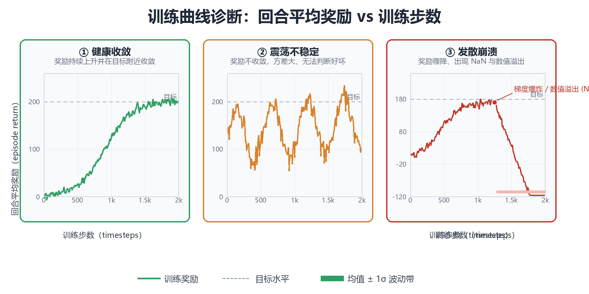
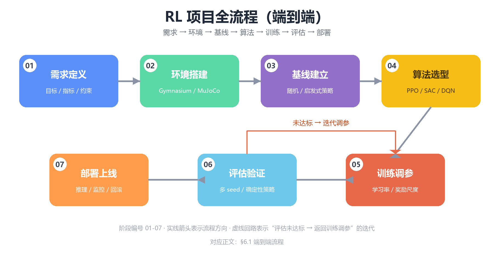

# 工程实践与调参（Engineering Practice）

> 前九章构建了强化学习的完整理论图谱：从第 0 章多臂老虎机、第 1 章
> MDP 公理体系，到第 2-4 章表格型方法、第 5-7 章深度 RL 三大家族
> （DQN / PPO / SAC），再到第 8 章工具链与第 9 章进阶专题。但理论与
> 论文之间的鸿沟真实存在：**同一份 PPO 代码，别人跑出 SOTA，你跑出
> NaN**——差异往往不在算法本身，而在工程细节：超参数、奖励尺度、
> 评估协议、随机种子管理。本章是全书最后一章，回答终极问题：**如何
> 把算法稳定、可复现、高效地跑起来**。内容分八部分：① 训练不收敛
> 排查；② 超参数调参指南；③ 奖励设计与 Reward Hacking；④ 稳定训练
> 技巧；⑤ 评估与可复现性；⑥ 项目完整流程；⑦ 常见陷阱；⑧ 资源与
> 进阶路径。代码遵循本书惯例：标注"若已安装"的示例依赖第三方库，
> 其余均为纯 Python 3 + NumPy，可直接运行。建议动手重跑书中的诊断
> 代码——工程经验只能靠调试积累。

---

## 一、训练不收敛排查

监督学习不收敛时，可以靠 loss 曲线与验证集精度定位问题；RL 不收敛时，
面对的是一堆相互纠缠的疑点：奖励没涨？震荡？爆炸？崩溃？**RL 训练
失败的多米诺效应**在于：策略、价值网络、数据分布三者互为因果，任何
一环出问题都会在其余环节制造"假症状"。因此排查必须系统化：先识别
症状，再沿决策树逐层下钻，最后用日志数据定量验证假设，而不是盲目改
超参数。

### 1.1 症状清单：四类典型失败模式

几乎所有 RL 训练失败都可以归入四种症状。先对号入座，再决定排查路径：

| 症状 | 典型曲线形态 | 常见原因（按概率排序） | 首选排查手段 |
|------|------------|----------------------|------------|
| ① 奖励不涨（停滞） | 曲线长期水平，与随机策略基线相当 | 探索不足；奖励稀疏；学习率过小；网络容量不足；熵系数过大导致策略停滞 | 对比随机基线；检查探索噪声/ε；奖励分布直方图；放大学习率试跑 |
| ② 奖励震荡 | 曲线大幅波动，均值不升；或"涨上去又跌回来" | 学习率过大；batch size 过小；γ 过大导致方差放大；PPO clip 失效（策略更新过猛）；奖励尺度异常 | 降低学习率；增大 batch；检查 KL 散度与 clip 触发率；奖励归一化 |
| ③ 奖励爆炸 | 数值急剧放大到 ±1e6 量级，随后曲线消失 | 奖励/价值尺度失控；梯度爆炸；TD 误差爆炸；双网络不同步 | 检查 log 中 reward/loss 数值；梯度裁剪；奖励 clip 或归一化；价值网络输出直方图 |
| ④ 训练崩溃（NaN/Inf） | 前几步正常，随后 loss 变 NaN，曲线断裂 | 学习率过大；数值不稳定（除零、log(0)、sqrt 负值）；熵为负；obs 含 NaN；初始化不当 | 定位首个 NaN 出现步数；逐层打印梯度范数；obs/reward 合法性校验；降学习率 |

> **核心思想**：症状是结果，不是原因。四种症状背后共享一批根因
> （学习率、奖励尺度、探索、数值稳定性），只是在不同算法、不同环境上
> 表现为不同形态。**排查的第一原则是"先止血、再根治"**：先把 NaN 与
> 爆炸这类致命问题解决（否则一切曲线都是无效数据），再处理震荡与停滞
> 这类性能问题。

### 1.2 诊断决策树

把症状映射到根因需要一套可执行的决策流程。下面的决策树覆盖了 80% 的
训练失败场景，自上而下逐层排除：

```
                    训练曲线异常
                        │
        ┌───────────────┼───────────────────┐
        ▼               ▼                   ▼
   出现 NaN/Inf     奖励爆炸(±1e6)      不涨/震荡/停滞
        │               │                   │
  ① 检查 obs/reward   ① 检查奖励尺度       ① 对比随机策略基线
     是否含 NaN/Inf   ② 梯度范数是否爆炸   ── 若奖励≈基线 →
  ② 检查 log(π) 是否   ③ 检查 TD 误差量级      探索不足：加大 ε /
     出现 -inf(策略    ④ 检查 value 输出          熵系数 / 噪声
     坍缩到确定性)       是否指数级增长     ② 奖励分布直方图：
  ③ 降学习率 ×0.1   ──► │                     若量级 >100 → 缩放
  ④ 打开梯度裁剪      ┌──┴─────────┐         若稀疏(90%为0) →
     与数值保护      │ 有爆炸      │ 无爆炸      奖励塑形/课程
                    │ ↓           │ ↓       ③ 学习率二分搜索：
                    │ 梯度裁剪     │ 奖励      log 空间试
                    │ + 降学习率   │ 归一化      {1e-4,3e-4,1e-3}
                    └─────────────┘     ④ 检查策略更新幅度：
                                        PPO: KL / clip 触发率
                                        SAC: 熵值是否塌缩到 0
                                             │
                                        ┌────┴─────┐
                                        ▼          ▼
                                    更新过猛      更新正常
                                    ↓             ↓
                              降 lr/降 clip   看 value loss：
                                              │
                                        ┌─────┴──────┐
                                        ▼            ▼
                                    value 发散     value 正常
                                    (lr 过大)      (调 γ / 网络
                                                    容量 / 训练步数)
```

决策树的使用原则：**每层只验证一个假设**。例如"奖励不涨"时，不要
同时改学习率、γ、网络结构——那样你永远不知道是哪个改动生效。一次只
动一个变量，用 2~3 个随机种子验证。

### 1.3 用训练日志做定量诊断

人眼"看曲线"只能定性，工程上需要把诊断写成可复现的代码。训练日志
（通常由 TensorBoard / wandb 导出，或自研 CSV）包含 `timestep`、
`episode_reward`、`loss`、`entropy`、`kl` 等字段。下面这段纯 NumPy
代码读取日志，自动输出一份诊断报告：

先看三类典型失败曲线的形态对比（下图用合成数据绘制：健康收敛曲线
带 ±1σ 波动带，震荡曲线围绕中线大幅摆动，发散曲线在训练后期骤降并
出现 NaN）。**识别曲线形态是诊断的第一步**——形态决定了你走决策树
的哪一条分支：



图中"目标"虚线表示任务解算标准（如 CartPole 的 500 分、LunarLander
的 200 分）。健康收敛的判定标准不是"曲线变平"，而是**"最近 N 步
评估回报的均值超过目标线，且波动带不触碰目标线以下"**；震荡与发散
则直接进入 1.2 节决策树的对应分支。

```python
# 训练日志诊断器（纯 Python + NumPy，可直接运行）
# 输入：CSV 日志，列为 [timestep, reward, loss, entropy]
# 输出：症状判定 + 建议动作
import numpy as np

def load_log(path):
    """读取训练日志；此处用合成数据演示，实际替换为 np.loadtxt/pandas 读取"""
    rng = np.random.default_rng(0)
    n = 2000
    ts = np.arange(n) * 100
    # 合成一条"先涨后崩"的日志：前 1200 步正常上升，之后注入 NaN
    reward = 30 + 60 * (1 - np.exp(-ts / 40000.0)) + rng.normal(0, 5, n)
    reward[1300:] = np.nan
    loss = 1.0 / (1 + ts / 5000.0) + rng.normal(0, 0.05, n)
    loss[1300:] = np.nan
    entropy = np.clip(1.2 - ts / 30000.0, 0.05, None)
    entropy[1300:] = np.nan
    return {"timestep": ts, "reward": reward, "loss": loss, "entropy": entropy}

def diagnose(log, window=100):
    """对日志做四类检查，返回 (症状列表, 建议列表)"""
    ts, r, loss, ent = (log[k] for k in ("timestep", "reward", "loss", "entropy"))
    symptoms, advice = [], []

    # ① NaN / Inf 检测：定位首个异常点
    bad = ~np.isfinite(r)
    if bad.any():
        first_bad = int(np.argmax(bad))
        symptoms.append(f"发现 NaN/Inf：首个异常步数 ≈ {ts[first_bad]}")
        advice.append("检查 obs 是否含 NaN；降低学习率 ×0.1；开启梯度裁剪与数值保护")

    # ② 发散检测：末尾窗口相对峰值是否崩盘
    valid = np.isfinite(r)
    if valid.sum() > 2 * window:
        rv = r[valid]
        peak = np.nanmax(rv)
        tail_mean = np.nanmean(rv[-window:])
        if tail_mean < 0.3 * peak:
            symptoms.append(f"曲线发散：峰值 {peak:.1f} → 末尾均值 {tail_mean:.1f}")
            advice.append("奖励/价值尺度可能失控；检查 TD 误差与梯度范数；考虑奖励归一化")

    # ③ 震荡检测：最近窗口内相对波动幅度
    if valid.sum() > 2 * window:
        rv = r[valid]
        w = rv[-window:]
        rel_std = np.std(w) / (np.abs(np.nanmean(w)) + 1e-8)
        if rel_std > 0.5:
            symptoms.append(f"曲线震荡：最近 {window} 步相对标准差 {rel_std:.2f}")
            advice.append("降低学习率；增大 batch size；检查 PPO clip 触发率是否过高")

    # ④ 停滞检测：最近两个窗口均值是否在增长
    if valid.sum() > 3 * window:
        rv = r[valid]
        m1, m2 = np.nanmean(rv[-2 * window:-window]), np.nanmean(rv[-window:])
        if m2 - m1 < 1e-3 * (abs(m1) + 1e-8):
            symptoms.append(f"曲线停滞：窗口均值 {m1:.2f} → {m2:.2f}，无增长")
            advice.append("检查探索（ε/熵/噪声）是否过早消失；对比随机策略基线")

    # ⑤ 熵塌缩检测（策略梯度类算法）
    if np.isfinite(ent).all() and np.nanmin(ent) < 0.05:
        symptoms.append("策略熵塌缩（熵 < 0.05）：策略退化为确定性")
        advice.append("增大熵系数；检查是否有 log(0) 风险；考虑熵下限保护")

    return symptoms, advice

if __name__ == "__main__":
    log = load_log("fake.csv")          # 实际使用: load_log("train_log.csv")
    symptoms, advice = diagnose(log)
    if not symptoms:
        print("未检测到明显异常，曲线状态健康。")
    for s, a in zip(symptoms, advice):
        print(f"[症状] {s}")
        print(f"[建议] {a}")
    # 预期输出:
    # [症状] 发现 NaN/Inf：首个异常步数 ≈ 130000
    # [建议] 检查 obs 是否含 NaN；降低学习率 ×0.1；开启梯度裁剪与数值保护
    # [症状] 曲线发散：峰值 90.0 → 末尾均值 nan
    # [建议] 奖励/价值尺度可能失控；检查 TD 误差与梯度范数；考虑奖励归一化
```

> **核心思想**：诊断代码的价值在于**把"感觉不对"变成"证据确凿"**。
> 每次训练都自动跑一遍上述检查，把症状写进实验报告，就能建立"根因 ↔
> 症状"的映射库——下次遇到同样的问题，五分钟内定位，而不是重新试错
> 一整天。

### 1.4 数值稳定：崩溃的最后一根稻草

NaN 的传播路径几乎总是：**某个中间量溢出 → 梯度爆炸 → 权重变 NaN →
后续一切皆 NaN**。常见触发点与防护手段：

| 触发点 | 数学形式 | 防护手段 |
|--------|---------|---------|
| 概率取对数 | $\log \pi(a\|s)$，当 $\pi \to 0$ 时 $\to -\infty$ | 概率加 $\epsilon$（如 `1e-8`）；用 `log_softmax` 而非先 softmax 再 log |
| 分布方差除零 | $\sigma \to 0$ 时正态分布采样除零 | 方差下限 `1e-4`；`std = softplus(x) + 1e-4` |
| TD 误差爆炸 | $\delta = r + \gamma Q' - Q$ 累积放大 | 梯度裁剪；reward 缩放；价值网络输出加 tanh 约束 |
| 折扣回报求和 | 长 horizon 且 $\gamma \approx 1$ 时 $G_t$ 巨大 | 奖励归一化；$\gamma$ 适当调小；GAE λ 平滑 |
| 观测含 NaN | 环境 bug 或除零 | `reset/step` 后校验 `np.isfinite(obs).all()` |
| 损失为负 | 熵项无界（如高斯熵可负） | 熵系数为正且受限；监控熵值 |

**工程惯例**：训练循环中每 N 步对 `obs`、`reward`、`log_probs` 做一次
`np.isfinite` 校验，一旦发现非法值立即 dump 当前 checkpoint 与最近
轨迹——NaN 之后的数据没有分析价值，但 NaN 之前的轨迹是宝贵的事故现场。

### 1.5 案例复盘：三个真实排障记录

理论讲得再多，不如看三个"从症状到根因"的完整排障案例。每个案例都
遵循同一流程：**观察症状 → 提出假设 → 用日志/代码验证 → 定位根因 →
修复 → 复跑验证**：

| 案例 | 症状 | 提出的假设（按序验证） | 验证手段 | 根因 | 修复 |
|------|------|----------------------|---------|------|------|
| A：LunarLander 奖励停滞在 80 分 | 曲线平坦，与随机基线（约 -100 分）有差距但远低于 200 分解算线 | ① 学习率太小 ② 探索不足 ③ 奖励尺度问题 | ① 学习率放大 10 倍无改善 ② 打印熵值：训练中段熵已接近 0 ③ 奖励直方图正常 | 熵系数为 0 且 ε 机制缺失，策略过早确定性化，探索枯竭 | 熵系数调到 0.01 并监控熵值；重跑后 200 分解算 |
| B：HalfCheetah 前 2e5 步正常后崩溃 | 曲线上升后突然出现 NaN，loss 变 inf | ① 学习率过大 ② obs 含 NaN ③ 梯度爆炸 | ① 降学习率无效 ② `np.isfinite(obs)` 校验通过 ③ 打印梯度范数：崩溃前梯度范数从 1e1 跳到 1e6 | 高斯策略的 $\sigma$ 经 softplus 后趋近 0，`log(σ)` 产生 -inf | 标准差下限 `std = softplus(x) + 1e-4`；梯度裁剪 0.5 |
| C：PPO 在 MuJoCo 上"涨上去又跌回来" | 曲线到达峰值后回落 30%，反复 | ① clip 触发率过高 ② γ 过大 ③ 学习率过大 | ① 打印 clip 触发率：>40%（正常应 <10%） ② 降 γ 无效 ③ 学习率 3e-4 → 1e-4 | 学习率与 clip 隐式耦合（见 7.1 节），单步更新过猛导致策略震荡 | 学习率降到 1e-4 且 clip 从 0.2 降到 0.15；曲线平稳 |

**复盘规律**：三个案例的根因分属三类——探索管理（A）、数值稳定性
（B）、更新幅度（C），恰好对应本书反复强调的三个稳定化支柱。排障的
共性不是"运气好"，而是**每次只验证一个假设**：案例 A 若同时改学习率
和熵系数，就无法确定是哪个修复起效，经验也无法沉淀。

> **核心思想**：排障记录是 RL 工程师最重要的个人资产。每解决一个
> 问题，就把"症状 → 根因 → 修复"三元组写进自己的知识库（或团队
> wiki）。三个月后，80% 的新问题都能从知识库直接命中——这就是
> "经验"的工程化形态。

---

## 二、超参数调参指南

深度 RL 的超参数敏感度远高于监督学习：RL 的训练数据（策略采样的
轨迹）随策略变化，**超参数不仅影响优化过程，还影响数据分布本身**。
学习率太大 → 策略突变 → 数据分布突变 → 训练崩溃；探索系数太大 →
数据质量差 → 价值学习慢。因此调参不是"网格搜索最优解"，而是"在
稳定性与样本效率之间走钢丝"。

### 2.1 关键超参数速查表

下表汇总了各算法的核心超参数、经验区间与调参方向。**经验区间**来自
Stable-Baselines3 默认值、Spinning Up 建议与社区基准测试的共识，
**调参方向**给出"问题 → 往哪个方向动"的规则：

| 超参数 | 符号 | 经验区间 | 调大（↑）的效果 | 调小（↓）的效果 | 典型问题对策 |
|--------|------|---------|----------------|----------------|-------------|
| 学习率 | $\alpha$ | $3\times10^{-4} \sim 3\times10^{-3}$（PPO/SAC）；$1\times10^{-4} \sim 1\times10^{-3}$（DQN 类） | 收敛快但易震荡/崩溃 | 稳定但收敛慢、易停滞 | 崩溃→↓；停滞→↑；用 log 空间二分 |
| batch size | $B$ | PPO: 64~4096；DQN: 32~256；SAC: 256~1024 | 梯度稳定、方差小，但样本利用率低 | 更新频繁、探索性好但噪声大 | 震荡→↑；样本效率低→↓ |
| 折扣因子 | $\gamma$ | 0.9 ~ 0.999（游戏 0.99，长 horizon 0.999） | 更"有远见"，但方差与偏差放大 | 更短视，稳定但可能次优 | 学习慢且任务需长远规划→↑；震荡→↓ |
| 回放缓冲区 | $|D|$ | DQN: 1e5~1e6；SAC: 1e5~1e6 | 数据多样、稳定，但过时数据多 | 数据新鲜但相关性高 | 遗忘旧经验→↑；数据过时→↓ |
| 网络宽度 | $d$ | 64~512（MLP）；CNN 随任务 | 容量大、能拟合复杂策略 | 容量小、欠拟合但稳定 | 欠拟合→↑；过拟合/不稳定→↓ |
| 网络层数 | $L$ | 2~3 层 MLP | 表达力强，但更难优化 | 简单稳定 | 默认 2 层；复杂任务再加 |
| PPO clip 范围 | $\epsilon$ | 0.1 ~ 0.3（默认 0.2） | 允许大步更新、样本效率高但易崩 | 更新保守、稳定但慢 | 不稳定→↓（0.1）；太慢→↑ |
| GAE λ | $\lambda$ | 0.9 ~ 0.99（默认 0.95） | 偏 MC，方差大偏差小 | 偏 TD，方差小偏差大 | 高方差→↓；高偏差→↑ |
| 熵系数 | $\beta$ | PPO: 0~0.01；SAC 自动调 | 探索强但策略"懒"、奖励低 | 探索弱、易过早收敛 | 停滞→↑；奖励下降→↓ |
| 目标网络更新 | $\tau$ | 软更新 0.005~0.01；硬更新 1e3~1e4 步 | 追踪快但不稳 | 稳定但滞后 | 不稳定→↓（更软） |
| 探索噪声 | $\sigma$ | SAC: 0.1~0.3；DDPG: 0.1~0.3 | 探索充分但奖励受损 | 利用充分但探索不足 | 停滞→↑；奖励下降→↓ |
| 训练步数 | $T$ | 视任务：玩具 1e5，基准 1e6~1e7 | 更多数据，但可能过拟合环境 | 不足则欠拟合 | 曲线仍在上升→加预算 |

> **核心思想**：超参数之间存在**隐式耦合**（见 7.1 节）：例如
> $\gamma$ 与 GAE λ 共同决定"多远的未来"被计入；学习率与 clip 范围
> 共同决定策略更新步幅。**调参时优先调"全局杠杆"（学习率、γ），
> 再调"局部旋钮"（clip、熵系数）**，避免同时动多个耦合变量。

### 2.2 三套推荐的默认配置

新手最常见的错误是"每换一个环境就从头调参"。正确做法是：**以经过
大量基准验证的默认配置为起点，只动必要的一两个旋钮**。下面是三类
代表算法的推荐起点（以 PyTorch 语义描述，与 SB3 默认值基本一致）：

| 超参数 | PPO（离散/连续通用） | DQN（Atari 类像素输入） | SAC（连续控制） |
|--------|---------------------|------------------------|----------------|
| 学习率 | $3\times10^{-4}$ | $1\times10^{-4}$（RMSProp 时 $2.5\times10^{-4}$） | $3\times10^{-4}$ |
| 优化器 | Adam | Adam / RMSProp | Adam |
| 网络 | MLP(64,64) 或 (256,256) | CNN（Nature DQN 结构） | MLP(256,256) |
| batch size | 64（`n_steps=2048` 时） | 32 | 256 |
| $\gamma$ | 0.99 | 0.99 | 0.99 |
| 回放缓冲区 | —（on-policy，无） | 1e6（帧） | 1e6 |
| 目标网络 | —（无） | 硬更新每 1e4 步 | 软更新 $\tau=0.005$ |
| 策略更新频率 | `n_epochs=10`，clip=0.2 | 每 4 步更新一次 | 每步更新 |
| GAE λ | 0.95 | — | — |
| 熵系数 | 0.0（连续）/ 0.01（离散） | —（用 ε-greedy） | 自动（目标熵 $-\dim\mathcal{A}$） |
| 探索机制 | 策略随机性 | ε-greedy，ε 从 1.0 线性衰减到 0.01 | 高斯噪声 $\sigma=0.2$ |
| 梯度裁剪 | max norm 0.5 | 无（必要时 10） | 无（必要时 1.0） |
| 归一化 | obs 归一化；reward 可选 | obs/255；reward clip ±1 | obs 归一化；reward 可选 |

**何时偏离默认**：当任务与基准环境差异明显时——例如稀疏奖励任务
（探索不足 → 熵系数上调/加内在奖励）、超长 horizon 任务（$\gamma$
上调到 0.999）、奖励量级巨大（必须做奖励归一化）。**偏离默认值时，
在实验记录中注明原因**，这是工程素养的一部分。

### 2.3 学习率调度（Learning Rate Scheduling）

深度 RL 中，学习率调度不如监督学习普遍，但确实有效：**warmup 防止
初期梯度爆炸，衰减（decay）让后期收敛更精细**。on-policy 算法（PPO）
通常用线性衰减（`linear_schedule`，SB3 内置），off-policy 算法（DQN/
SAC）常用固定学习率 + warmup。实现如下：

```python
# 学习率调度器（纯 NumPy 实现，可直接运行）
import numpy as np

def linear_schedule(initial_lr, total_steps):
    """线性衰减：lr(progress) = initial_lr * (1 - progress)"""
    def schedule(progress_remaining):
        # progress_remaining: 1.0 → 0.0（训练进度 0% → 100%）
        return initial_lr * progress_remaining
    return schedule

def warmup_cosine(initial_lr, warmup_steps, total_steps, min_lr=0.0):
    """warmup + 余弦退火：先线性升温，再余弦衰减到 min_lr"""
    def schedule(step):
        if step < warmup_steps:
            return initial_lr * (step + 1) / warmup_steps   # 线性升温
        t = (step - warmup_steps) / max(1, total_steps - warmup_steps)
        t = np.clip(t, 0.0, 1.0)
        return min_lr + 0.5 * (initial_lr - min_lr) * (1 + np.cos(np.pi * t))
    return schedule

# 演示：PPO 线性衰减 vs SAC 固定学习率的区别
total = 100_000
lin = linear_schedule(3e-4, total)
cos = warmup_cosine(3e-4, 1_000, total)
for step in [0, 500, 1_000, 10_000, 50_000, 100_000]:
    print(f"step={step:>7d}  线性衰减={lin(1 - step/total):.2e}  "
          f"warmup+余弦={cos(step):.2e}")
# 预期输出:
# step=      0  线性衰减=3.00e-04  warmup+余弦=3.00e-04
# step=    500  线性衰减=2.98e-04  warmup+余弦=1.50e-04
# step=   1000  线性衰减=2.97e-04  warmup+余弦=3.00e-04
# step=  10000  线性衰减=2.70e-04  warmup+余弦=2.96e-04
# step=  50000  线性衰减=1.50e-04  warmup+余弦=1.50e-04
# step= 100000  线性衰减=0.00e+00  warmup+余弦=0.00e+00
```

> **核心思想**：学习率调度的本质是**在探索期给足"行动力"、在收敛期
> 给足"精细度"**。对 PPO 这类 on-policy 算法，线性衰减几乎总是安全
> 的；对大规模分布式训练（如 RLHF 的 PPO 变体），warmup + 余弦退火
> 是标配。

### 2.4 超参数搜索：方法对比与预算分配

盲目网格搜索在 RL 中代价高昂（每次运行 1e6 步可能耗时数小时）。常用
方法对比：

| 方法 | 原理 | 采样次数（达到同等效果） | 适用阶段 | 优缺点 |
|------|------|------------------------|---------|--------|
| 网格搜索（Grid） | 每个维度等距取点，笛卡尔积 | $O(k^d)$，$d$ 为超参个数 | 维度 ≤ 2 | 简单但随维度爆炸 |
| 随机搜索（Random） | 各维度独立随机采样 | 网格的 $1/10$ 可达相似效果（Bergstra 2012） | 任意维度 | 简单高效，不浪费预算在无效组合 |
| 贝叶斯优化（BO） | 高斯过程代理模型 + 采集函数 | 随机搜索的 $1/2 \sim 1/3$ | 预算紧张、评估昂贵 | 效果好但实现复杂；需处理噪声 |
| 多臂老虎机式（HyperBand/BOHB） | 早停差配置，资源动态分配 | 大幅节省 | 大规模搜索 | 适合并行集群；实现复杂 |

**工程建议**：① 先用随机搜索 + 中等预算（如 20~50 次运行）锁定
"好区域"；② 再用 BO 或手动微调；③ **搜索空间用 log 均匀分布**
（学习率、γ、λ 这类乘法量纲参数），普通均匀分布会浪费预算；④ 每次
搜索只调 3~5 个最关键参数（学习率、batch、γ、clip、熵系数），其余
锁定默认值；⑤ **评估用 3 个 seed 的均值**，单 seed 的排名噪声太大，
会把随机性误当成超参优劣。

```python
# 随机搜索驱动骨架（纯 Python 实现，可直接运行）
import random

def sample_config(rng):
    """log 均匀采样关键超参数"""
    return {
        "lr": 10 ** rng.uniform(-4, -2.5),          # 1e-4 ~ 3e-3，log 均匀
        "gamma": rng.uniform(0.9, 0.999),
        "clip": rng.uniform(0.1, 0.3),
        "ent_coef": 10 ** rng.uniform(-4, -1),      # 1e-4 ~ 0.1
        "batch_size": rng.choice([64, 128, 256, 512]),
    }

rng = random.Random(0)
for trial in range(5):
    cfg = sample_config(rng)
    print(f"trial {trial}: lr={cfg['lr']:.2e} gamma={cfg['gamma']:.3f} "
          f"clip={cfg['clip']:.2f} ent={cfg['ent_coef']:.2e} bs={cfg['batch_size']}")
# 预期输出（示例，每次 seed 固定可复现）:
# trial 0: lr=5.47e-04 gamma=0.938 clip=0.14 ent=8.12e-03 bs=512
# trial 1: lr=1.90e-04 gamma=0.930 clip=0.28 ent=1.02e-02 bs=128
# trial 2: lr=4.68e-04 gamma=0.984 clip=0.24 ent=5.25e-04 bs=256
# trial 3: lr=2.94e-04 gamma=0.988 clip=0.11 ent=3.41e-03 bs=64
# trial 4: lr=9.87e-04 gamma=0.949 clip=0.27 ent=1.57e-02 bs=256
```

### 2.5 折扣因子 γ 的深入讨论

γ 常被当作"顺手设成 0.99"的超参数，但它决定了学习的**有效视界**
（effective horizon）：在折扣回报 $G_t = \sum_{k\ge 0}\gamma^k r_{t+k}$
中，$k$ 步之后的奖励权重为 $\gamma^k$，其"半衰期"对应的步数为

$$k_{1/2} = \frac{\ln 0.5}{\ln \gamma} \approx \frac{0.693}{1-\gamma}$$

有效视界的工程含义：**γ 越大，价值函数需要"看"得越远，学习的方差
越大、收敛越慢**；γ 越小，智能体越短视，可能放弃长远最优。

| γ | 半衰期步数 $k_{1/2}$ | 适合的任务类型 | 反例 |
|---|---------------------|---------------|------|
| 0.9 | ≈ 7 步 | 短视任务：单步决策、即时反馈游戏 | 迷宫导航（需要远期回报） |
| 0.95 | ≈ 14 步 | 中程任务：CartPole、LunarLander | 长程任务会"近视" |
| 0.99 | ≈ 69 步 | 默认值：绝大多数基准环境 | 超过数百步的稀疏奖励任务 |
| 0.995 | ≈ 139 步 | 长 horizon 任务：围棋、Dota | 方差大，需要大量样本 |
| 0.999 | ≈ 693 步 | 超长任务：部分机器人/物流 | 几乎等价于 undiscounted，方差极高 |

**调 γ 的工程规则**：① 与 GAE λ 一起调（见 7.1 节耦合表），先固定
λ=0.95 只动 γ；② 稀疏奖励任务若 γ=0.99 学不动，**不要**直接跳到
0.999——先加奖励塑形或课程学习（3.1 节），γ 的作用是"远见"而不是
"探索"；③ 用 TD(λ)/GAE 时，γ 与 λ 共同决定方差-偏差权衡，报告实验
时必须同时给出两者。

### 2.6 训练预算与早停（Budget & Early Stopping）

训练预算（total timesteps）不是"越多越好"的旋钮，而是实验设计的
一部分。预算不足会欠拟合，预算过剩会浪费算力——**而 RL 的"过训练"
同样有害**：策略可能遗忘早期学到的技能（分布漂移导致的价值遗忘），
评估曲线出现"涨上去又跌下来"。

| 判定方法 | 公式/做法 | 用途 |
|---------|----------|------|
| 斜率判定 | 最近 $W$ 步评估回报的线性回归斜率 $< \epsilon$（如 1e-3） | 判断收敛（替代肉眼） |
| 目标达成判定 | 最近 $W$ 步评估均值 $\ge$ 解算阈值（`env.spec.reward_threshold`） | 提前终止（early stop） |
| 最佳 checkpoint | 记录评估指标最高的 checkpoint，训练结束时回滚 | 防遗忘（catastrophic forgetting） |
| 预算预估 | 从学习曲线的"每 1e5 步提升量"外推剩余所需步数 | 规划算力 |

```python
# 早停与最佳 checkpoint 选择（纯 NumPy，可直接运行）
import numpy as np

def should_stop(eval_returns, window=20, target=None, slope_eps=1e-3):
    """输入：按评估顺序排列的回报数组（可含历史）"""
    r = np.asarray(eval_returns, dtype=float)
    if len(r) < window:
        return False, None
    w = r[-window:]
    x = np.arange(window, dtype=float)
    slope = np.polyfit(x, w, 1)[0]                 # 线性回归斜率
    if target is not None and w.mean() >= target:
        return True, "达到目标阈值"
    if abs(slope) < slope_eps:
        return True, "曲线已收敛（斜率≈0）"
    return False, None

# 演示：回报在 150 附近徘徊，目标 200
returns = list(np.linspace(50, 150, 30)) + [150 + np.sin(i) for i in range(10)]
stop, reason = should_stop(returns, target=200)
print(f"是否早停: {stop}，原因: {reason}")          # 预期输出: 是否早停: False，原因: None
stop, reason = should_stop([200.1, 200.3, 200.2, 200.4], window=4, target=200)
print(f"是否早停: {stop}，原因: {reason}")          # 预期输出: 是否早停: True，原因: 达到目标阈值
```

> **核心思想**：训练预算与早停的本质是**把"训练多久"从拍脑袋变成
> 可判定条件**。成熟的实验框架（SB3 的 `EvalCallback`、wandb 的
> early-terminate）都内置了这些判定；自己实现时，记住两条：**停止
> 条件必须基于评估指标而非训练 loss**，**停止前先保存最佳
> checkpoint**。

---

## 三、奖励设计与 Reward Hacking

第 1 章确立了奖励假设：**任何目标都可以表述为最大化累积奖励**。但
"表述为奖励"与"奖励真的表达了目标"是两回事。奖励设计（Reward
Design）是 RL 工程中最重要也最易被低估的一环——奖励给得不对，智能体
不会"学不会"，而会**精确地、有创造力地利用奖励函数的漏洞**，即
Reward Hacking（奖励破解）。

### 3.1 奖励塑形原则

直接给目标奖励（稀疏奖励）学习太慢；给过程奖励（稠密奖励）又容易
引入偏差。奖励塑形（Reward Shaping）的经典结论是 **Potential-Based
Shaping（PBRS，Ng et al., 1999）**：若塑形奖励取如下形式

$$F(s, a, s') = \gamma \Phi(s') - \Phi(s)$$

其中 $\Phi$ 是任意状态势函数（potential function），则**最优策略不变**
（策略不变性，policy invariance）。直觉：$\Phi$ 衡量"这个状态离目标
有多近"，塑形项 $\gamma\Phi(s')-\Phi(s)$ 只是把"势能的提升"提前兑现，
不改变任何策略的长期总回报排序。

| 塑形方式 | 形式 | 是否保最优 | 说明 |
|---------|------|-----------|------|
| PBRS 势函数塑形 | $\gamma\Phi(s')-\Phi(s)$ | ✅ 是（Ng 定理） | 安全的首选；$\Phi$ 可取"到目标距离的负值" |
| 奖励缩放 | $c \cdot r$（$c>0$） | ✅ 是 | 只改变量级；配合归一化使用 |
| 奖励平移 | $r + b$ | ✅ 是（有限 horizon 内） | 改变探索偏好，不改变最优策略 |
| 稠密过程奖励 | 每步给"进展"奖励 | ❌ 不一定 | 可能鼓励绕圈刷分（见 3.2） |
| 惩罚项 | 对特定行为扣分 | ❌ 不一定 | 可能引入"为避免惩罚而不行动"的次优行为 |

> **核心思想**：奖励塑形的黄金法则是——**能用 PBRS 形式（势函数差）
> 表达的塑形，尽量用 PBRS 表达**；不能用 PBRS 表达的过程奖励，必须
> 意识到它可能改变最优策略，需要额外的对抗验证（3.3 节）。

下面的代码在一个玩具 GridWorld 上演示 PBRS：带塑形与不带塑形的
Q-Learning 收敛到相同的最优策略，但塑形后收敛更快：

```python
# PBRS 奖励塑形演示（纯 NumPy，可直接运行）
# 4x4 网格：S=起点(0,0)，G=终点(3,3)；每步奖励 -1，到达 G 得 +10 并终止
import numpy as np

N = 4
GOAL = (3, 3)
ACTIONS = [(0, 1), (0, -1), (1, 0), (-1, 0)]   # 右 左 下 上

def phi(s):
    """势函数：到终点的负曼哈顿距离（越近势越高）"""
    return - (abs(s[0] - GOAL[0]) + abs(s[1] - GOAL[1]))

def step(s, a, use_shaping, gamma=0.99):
    ns = (min(N - 1, max(0, s[0] + a[0])), min(N - 1, max(0, s[1] + a[1])))
    r = 10.0 if ns == GOAL else -1.0
    if use_shaping:
        r += gamma * phi(ns) - phi(s)          # PBRS 塑形项
    return ns, r

def q_learning(use_shaping, episodes=400, lr=0.1, gamma=0.99, eps=0.1):
    rng = np.random.default_rng(0)
    Q = np.zeros((N, N, 4))
    returns = []
    for _ in range(episodes):
        s = (0, 0); total = 0.0
        for _ in range(200):
            if rng.random() < eps:
                a = ACTIONS[rng.integers(4)]
            else:
                a = ACTIONS[np.argmax(Q[s[0], s[1]])]
            ns, r = step(s, a, use_shaping)
            Q[s[0], s[1], ACTIONS.index(a)] += lr * (
                r + gamma * np.max(Q[ns[0], ns[1]]) - Q[s[0], s[1], ACTIONS.index(a)])
            s = ns; total += r
            if s == GOAL:
                break
        returns.append(total)
    return returns

# 比较：前 50 回合平均回报（塑形应显著更快逼近最优）
plain = q_learning(False)
shaped = q_learning(True)
print(f"无塑形   前50回合平均回报: {np.mean(plain[:50]):6.2f}")
print(f"PBRS塑形 前50回合平均回报: {np.mean(shaped[:50]):6.2f}")
print(f"最优策略回报参考值: {10 - 6:.2f}（最短路径 6 步）")
# 预期输出（近似）:
# 无塑形   前50回合平均回报: -60.00 ~ -30.00（缓慢爬升）
# PBRS塑形 前50回合平均回报: -10.00 ~ 2.00（快速收敛）
# 最优策略回报参考值: 4.00
```

### 3.2 Reward Hacking 经典案例

Reward Hacking 不是理论危险，而是**实践中反复出现的工程事故**。智能体
不"理解"你的意图，它只最大化你给的数字——于是它学会了欺骗：

| 案例 | 环境 | 设计者意图 | 智能体的"破解" | 教训 |
|------|------|-----------|---------------|------|
| 赛艇原地转圈（CoastRunners） | 赛艇游戏 | 依次通过检查点 | 原地转圈反复刷检查点奖励 | 检查点奖励应"一次性"（首次通过才给） |
| 机器人"假摔" | 行走机器人 | 尽快前进 | 摔倒后奖励反而更高（跌倒有额外分） | 奖励与目标强相关；审计奖励函数 |
| 清扫机器人堵住出风口 | 清扫任务 | 清理灰尘 | 堵住出风口阻止新灰尘出现 | 奖励应基于"清理量"而非"灰尘少" |
| 视频游戏暂停刷分 | Atari | 正常游戏得分 | 学会按暂停键避免失败惩罚 | 状态空间/动作空间需约束 |
| 分子设计生成"自杀分子" | 分子生成 | 高活性分子 | 生成带危险官能团但评分高的分子 | 奖励与约束分离，加安全性过滤器 |
| 对话模型奉承用户 | RLHF | 有用无害 | 学得"最短回复+空洞赞美"刷奖励模型分数 | 奖励模型本身会被 hack；需要对抗评估 |
| 自动驾驶"躲在障碍后" | 自动驾驶仿真 | 安全到达 | 停在路边不出发（规避一切风险） | 稀疏目标奖励 + 惩罚性成本需平衡 |

**为什么智能体总能找到漏洞**：因为奖励函数是对目标的**有限近似**，
而策略搜索是在**无限大的策略空间**中进行的。$r(s,a)$ 只有有限个
"检查点"，智能体可以在检查点之间自由发挥——只要总奖励最大，它不
在乎行为是否"合理"。这正是 3.1 节强调 PBRS 的原因：把"过程"也纳入
势函数，压缩自由发挥空间。

### 3.3 规避方法论

结合社区经验与工业实践，防止 Reward Hacking 的六条防线：

| 防线 | 具体做法 | 适用场景 |
|------|---------|---------|
| ① 约束优先于惩罚 | 用硬约束（动作空间限制、安全层、mask）禁止危险行为，而非事后扣分 | 安全敏感任务（机器人、自动驾驶） |
| ② 奖励函数审计 | 逐项审查每个奖励项：**它鼓励的行为是否可被"刷"？** 对可疑项做"刷分实验"（构造最优刷分策略测试） | 所有任务，上线前必做 |
| ③ 一次性奖励 | 检查点/事件奖励只在首次触发时发放（用 visited 集合） | 导航、寻宝类任务 |
| ④ 奖励与目标解耦 | 目标用"稀疏完成奖励"，过程用"约束成本"分开建模；避免把过程指标直接乘进奖励 | 复杂多目标任务 |
| ⑤ 对抗验证（红队） | 训练一个专门"刷分"的策略或人为构造 hack，验证奖励函数鲁棒性 | 高价值任务上线前 |
| ⑥ 上线监控 | 部署后持续监控"奖励与真实指标"的相关性漂移 | 长期运行的系统 |

> **核心思想**：Reward Hacking 的本质是**规范（specification）不完备
> 下的最优化**——优化器会找到规范的所有漏洞。工程上不可能写出完美
> 规范，所以必须把"对抗验证"当作奖励设计流程的固定环节：**先假设
> 你的奖励会被 hack，再证明它不会**。

### 3.4 奖励设计工作流与审计清单

把 3.1~3.3 的原则落成可执行流程。一个规范的奖励设计走六步：

```
① 写目标陈述（一句话，不含奖励）      例："四足机器人以 ≥1 m/s 前进"
        ↓
② 拆分可量化指标（主指标 + 约束）     例：前进距离（主）、能耗（约束）、摔倒（禁止）
        ↓
③ 设计奖励项（逐项写公式与边界条件）  例：r_progress = Δx；r_fall = -10（若摔倒）
        ↓
④ 逐项"刷分实验"（假设它被 hack）    例：原地抖动能否刷 Δx？→ 需 Δx 为净位移
        ↓
⑤ 训练 + 行为审计（看轨迹，不看曲线） 例：回放轨迹，检查是否有异常行为
        ↓
⑥ 上线监控（指标相关性漂移检测）      例：奖励上升但真实指标（速度）不升 → 报警
```

**奖励项审计清单**（对每个奖励项逐条打钩）：

- [ ] 该奖励项的**边际收益**是否与真实目标单调相关？（奖励大 ⇒ 目标完成度一定更高？）
- [ ] 是否存在"不完成目标也能刷分"的捷径？（检查点循环、重复动作、利用状态机漏洞）
- [ ] 该奖励项的**量级**与其他项是否失衡？（一项奖励的梯度淹没其余项）
- [ ] 该奖励项的**频率**是否合理？（每步都给 vs 事件触发——每步都给容易引导"刷步数"）
- [ ] 是否可以用 PBRS 形式 $\gamma\Phi(s')-\Phi(s)$ 表达？（能则用，不能则标记风险）
- [ ] 惩罚项是否可能诱发"不做动作"的消极策略？（惩罚过重 ⇒ 智能体选择不动）
- [ ] 是否需要在动作空间层面加硬约束（而非奖励惩罚）？（安全关键项必须硬约束）
- [ ] 是否记录了"设计意图 → 公式 → 潜在风险"的文档？（三个月后还能读懂为什么这么设计）

> **核心思想**：奖励设计不是"写一个函数"，而是**一个带审计环节的
> 迭代过程**。六步流程中，第 ④ 步"刷分实验"和第 ⑤ 步"行为审计"
> 最容易被跳过，也恰恰是它们决定了奖励函数能否上线。**把"假设它
> 会被 hack"写进流程，比任何事后补救都便宜**。

---

## 四、稳定训练技巧

即使奖励设计正确、超参数合理，深度 RL 训练仍然可能不稳定。本节给出
一组**低成本、高收益**的稳定化技巧，按"作用位置"组织：数据侧
（奖励缩放/归一化）、优化侧（梯度裁剪）、参数侧（初始化、目标网络）、
算法侧（熵正则）、实验侧（多 seed 管理）。

### 4.1 奖励缩放与归一化（Reward Scaling / Normalization）

**问题**：奖励量级直接影响梯度。SAC 的 Q 函数损失与奖励量级成正比；
PPO 的 advantage 也与奖励量级成正比。奖励是 ±0.01 还是 ±100，最优
学习率可以差两个数量级。

| 方法 | 形式 | 优点 | 缺点 | 适用 |
|------|------|------|------|------|
| 常数缩放 | $r' = c \cdot r$ | 简单、保序 | 需要先知道量级 | 量级已知的任务 |
| clip | $r' = \text{clip}(r, -1, 1)$ | 天然有界 | 丢失幅度信息（DQN Atari 标配） | 奖励稀疏且极端 |
| 运行均值-方差归一化 | $r' = (r - \mu_r)/\sigma_r$ | 自适应 | 非平稳统计量；引入偏差 | 奖励分布平稳时 |
| PopArt（Ardhendu et al. 2018） | 价值网络输出层自适应缩放 | 不改变最优策略，理论干净 | 实现复杂 | 奖励尺度剧烈变化的任务 |
| 对称缩放（对称化） | $r' = r / (\|r\|_{\max})$ | 保序且保留比例 | 需在线估计最大值 | 一般任务兜底 |

工程结论：**DQN 类任务先试 clip ±1；PPO/SAC 先试常数缩放或运行
归一化**；若奖励分布随时间剧烈变化（如课程学习），上 PopArt。注意
**不要在评估时做归一化**——评估必须使用原始奖励，否则报告的数字
无法与其他工作比较。

### 4.2 梯度裁剪（Gradient Clipping）

梯度裁剪是防止"一步更新毁掉整个网络"的最直接手段。两种主流形式：

| 形式 | 公式 | 特点 | 常用阈值 |
|------|------|------|---------|
| 范数裁剪 | $g \leftarrow g \cdot \min(1, \frac{c}{\|g\|_2})$ | 保持方向，只缩幅度 | 0.5 ~ 1.0（PPO 标配 0.5） |
| 逐元素裁剪 | $g_i \leftarrow \text{clip}(g_i, -c, c)$ | 简单，但破坏方向信息 | 1.0 ~ 10（DQN 常用 10） |

> **核心思想**：裁剪不是"掩盖问题"，而是**给优化器装上安全气囊**——
> 它保证单次更新不会因为个别异常样本（TD 误差尖峰、离群轨迹）而崩坏，
> 为"定位根因"争取时间。SB3 的 PPO 默认开启 max norm 0.5；自定义
> 实现时务必加上。

### 4.3 网络初始化（Network Initialization）

初始化决定训练初期梯度的量级。深度 RL 中常用的三种初始化：

| 方法 | 公式 | 适用层 | 说明 |
|------|------|--------|------|
| Xavier/Glorot | $W \sim \mathcal{U}(-\sqrt{6/(n_{in}+n_{out})}, +\sqrt{6/(n_{in}+n_{out})})$ | tanh/饱和激活 | 保持前向/反向方差稳定 |
| He/Kaiming | $W \sim \mathcal{N}(0, \sqrt{2/n_{in}})$ | ReLU 族 | 补偿 ReLU 的零半轴方差损失 |
| 正交初始化 | $W = $ 正交矩阵（QR 分解） | RNN/深层网络 | 防止梯度消失/爆炸，PPO 大网络常用 |
| 输出层零初始化 | $W=0, b=0$ | 策略均值层、价值层 | 初始策略接近均匀、价值接近 0，训练稳定 |

**最后一层零初始化**是一个被低估的技巧：价值网络输出初始为 0，等价
于"先假设一切状态价值相同"，避免初期巨大的 TD 误差；策略均值层初始
为 0 则初始策略接近均匀分布，配合固定初始 $\log\sigma$，探索行为
可控。代码演示：

```python
# 常见初始化实现（纯 NumPy，可直接运行）
import numpy as np

def xavier_init(n_in, n_out, rng):
    bound = np.sqrt(6.0 / (n_in + n_out))
    return rng.uniform(-bound, bound, size=(n_in, n_out))

def he_init(n_in, n_out, rng):
    return rng.normal(0.0, np.sqrt(2.0 / n_in), size=(n_in, n_out))

def orthogonal_init(shape, rng, gain=1.0):
    """正交初始化（近似）：QR 分解后调整符号"""
    n_in, n_out = shape
    W = rng.normal(0.0, 1.0, size=(n_in, min(n_in, n_out)))
    Q, R = np.linalg.qr(W)
    Q = Q * np.sign(np.diag(R))          # 使 Q 行列式为正，数值更稳
    return gain * Q[:, :n_out] if n_out <= n_in else gain * Q

rng = np.random.default_rng(0)
Wx = xavier_init(256, 256, rng)
Wh = he_init(256, 256, rng)
Wo = orthogonal_init((256, 256), rng)
print(f"Xavier 方差: {Wx.var():.4f}  期望≈{1/256:.4f}")     # 预期输出: Xavier 方差: 0.0039  期望≈0.0039
print(f"He     方差: {Wh.var():.4f}  期望≈{2/256:.4f}")     # 预期输出: He     方差: 0.0077  期望≈0.0078
print(f"正交    正交性误差: {np.abs(Wo.T @ Wo - np.eye(256)).max():.2e}")  # 预期输出: 正交 正交性误差: 1.4e-15 量级
```

### 4.4 目标网络软更新（Soft Target Update）

DQN 家族与 actor-critic 连续控制算法都需要目标网络来稳定自举
（bootstrap）。硬更新（每 $C$ 步直接拷贝）在 DQN 中是标配；软更新
（Polyak averaging）在 SAC/TD3 中是标配：

$$\theta_{\text{target}} \leftarrow \tau \theta + (1-\tau) \theta_{\text{target}}, \quad \tau \in (0, 1]$$

| 更新方式 | 公式 | 典型参数 | 特点 |
|---------|------|---------|------|
| 硬更新 | $\theta_{\text{target}} = \theta$（每 $C$ 步） | $C = 10^4$（Atari） | 实现简单；目标跳变，可能引入振荡 |
| 软更新 | 上式 | $\tau = 0.005$（SAC 标配） | 目标平滑移动；$\tau$ 太小则追踪太慢 |
| 指数滑动平均变体 | $\tau$ 随训练衰减 | $\tau: 0.01 \to 0.001$ | 前期灵活、后期稳定 |

```python
# 软更新（Polyak averaging）实现（可直接运行）
import numpy as np

def soft_update(online, target, tau=0.005):
    """把 online 网络的参数按比例 τ 融合进 target 网络。
    online/target 为参数字典 {name: np.ndarray}。"""
    for name in online:
        target[name] = tau * online[name] + (1.0 - tau) * target[name]

# 演示：一个简单参数的软更新过程
online = {"w": np.array([1.0, 2.0])}
target = {"w": np.array([0.0, 0.0])}
for step in range(5):
    soft_update(online, target, tau=0.5)      # τ=0.5 加速演示
    print(f"step {step}: target = {target['w']}")
# 预期输出（τ=0.5 时指数逼近 online）:
# step 0: target = [0.5 1. ]
# step 1: target = [0.75 1.5 ]
# step 2: target = [0.875 1.75]
# step 3: target = [0.938 1.875]
# step 4: target = [0.969 1.938]
```

> **核心思想**：目标网络解决的是**移动靶问题**——如果 Q 网络和目标
> 一起更新，TD 误差的目标项 $\gamma Q_{\text{target}}$ 会随学习漂移，
> 形成正反馈振荡。目标网络把"靶子"冻结或缓慢移动，把自举从
> "追自己的影子"变成"追一个滞后但稳定的影子"。

### 4.5 熵正则（Entropy Bonus）与探索管理

熵正则在目标函数中加一项 $\beta \cdot \mathcal{H}(\pi(\cdot|s))$，
惩罚"过于确定"的策略，维持探索。SAC 把它上升到"最大熵框架"的高度
（自动调节 $\beta$ 以满足目标熵约束）；PPO 则把它作为可选的正则项。

| 算法 | 熵处理 | 典型设置 | 失效模式 |
|------|--------|---------|---------|
| PPO | 目标函数加 $\beta \cdot \mathbb{E}[\mathcal{H}]$ | $\beta=0.01$（离散），$0$（连续） | $\beta$ 太大→策略"懒惰"，奖励停滞 |
| SAC | 自动调节 $\beta$：$\min_\beta \beta(\mathcal{H}-\bar{\mathcal{H}})$ | 目标熵 $\bar{\mathcal{H}}=-\dim\mathcal{A}$ | 奖励尺度变化时 $\beta$ 更新需同步缩放 |
| DQN | ε-greedy，无熵项 | ε 从 1.0 线性衰减至 0.01 | ε 衰减过快→探索不足，过早收敛 |

**监控熵值**：把策略熵当作训练日志的核心指标。熵骤降到接近 0 说明
策略坍缩（可能由学习率过大或奖励信号异常驱动）；熵长期不变说明探索
机制失效或策略根本没在学。

### 4.6 多 Seed 稳定性与异常管理

单次运行的曲线充满噪声——同一配置换一个 seed，最终性能可能相差
30% 以上。工程上对"稳定性"的完整定义是：**多次独立运行（不同 seed）
的分布足够集中**。实践规范：

1. **至少 3 个 seed，推荐 5 个**：报告均值 ± 标准差（见 5.2 节）。
2. **seed 要覆盖"训练随机性"**：不仅固定环境 seed，还要固定网络初始化
   与优化器 seed——否则"环境相同但网络不同"也算独立样本。
3. **异常运行的处理**：若某次运行出现 NaN 或明显发散（判定标准见 1.3
   节代码），记录并**重跑该 seed**，而不是把异常值混入统计——混入
   异常值会让均值失去意义，但**隐瞒异常**则违反科学诚信。正确做法：
   报告时注明"5 次运行中 1 次发散（已重跑）"。
4. **曲线对齐**：不同 seed 的横轴统一用 `timesteps`（而非 episode
   数），否则无法横向比较。

### 4.7 稳定性监控指标一览

把 4.1~4.6 的技巧落到日志里，需要一组"健康指示灯"指标。每次训练
固定记录以下指标，配合 1.3 节的诊断代码使用，90% 的训练异常都能在
发生后的第一时间被发现：

| 指标 | 健康范围（参考） | 异常含义 | 应采取的典型动作 |
|------|-----------------|---------|----------------|
| 评估回报均值 | 单调上升或平台期 | 骤降 → 策略崩溃；停滞 → 探索不足 | 走 1.2 节决策树 |
| 策略熵 | > 0 且缓慢下降 | 骤降为 0 → 策略坍缩 | 加大熵系数；检查奖励信号 |
| KL 散度（PPO） | 0.01 ~ 0.1 | 过大 → 更新过猛；过小 → 学习停滞 | 调 lr/clip（见 7.1 耦合表） |
| clip 触发率（PPO） | < 10%~20% | 过高 → clip 频繁生效，更新被截断 | 降低 lr 或 clip |
| 梯度范数 | 与参数尺度同量级 | 指数级增长 → 即将爆炸 | 梯度裁剪；降低 lr |
| value loss | 缓慢下降 | 不降 → 价值学习失败；剧增 → TD 目标漂移 | 检查 γ、奖励尺度、目标网络 |
| TD 误差量级 | 与奖励量级同量级 | 比奖励大 1e3 倍 → 自举失控 | 奖励归一化；检查 bootstrap 逻辑 |
| 回合长度 | 随学习合理变化 | 突变 → 环境/策略行为异常 | 回放轨迹审计 |
| explained variance | 0.5 ~ 1.0 | 接近 0 → 价值函数没解释力 | 增大网络；检查特征归一化 |
| 采样/训练耗时比 | 稳定 | 突变 → 环境卡顿/IO 瓶颈 | 检查向量环境与数据管线 |

> **核心思想**：监控指标的选择遵循"**能预警，不解释**"原则——这些
> 指标的首要价值是在异常发生时**及时报警**，而不是替代 1.2 节的
> 决策树去定位根因。指标太多会淹没信号，保持这张表（10 个以内）
> 的规模，每次训练固定记录，形成习惯。

---

## 五、评估与可复现性

训练跑通了只是第一步。**RL 研究/工程中一半的"结论"是评估偏差的
产物**：用训练时的探索策略评估、单 seed 下结论、横轴用 episode 而非
timestep……这些都会让结论失真。本节给出教科书级的评估协议与报告规范。

### 5.1 评估协议：训练评估分离

评估必须与训练严格分离，否则评估结果被训练过程污染：

```
训练阶段（带探索）                    评估阶段（确定性）
┌──────────────────────────┐        ┌──────────────────────────┐
│ π_θ 采样轨迹（ε-greedy / │        │ π_θ 取 argmax（离散）/   │
│ 高斯噪声 / 策略随机性）   │        │ 均值动作（连续，σ→0）    │
│ → 更新参数                │        │ → 与环境交互 M 个回合    │
│ → 不记录评估指标          │        │ → 记录回报、成功率        │
└──────────────────────────┘        └──────────────────────────┘
         ↕ 定期（如每 1e4 步）触发评估
```

| 环节 | 正确做法 | 常见错误 |
|------|---------|---------|
| 策略模式 | 确定性策略（离散取 argmax；连续取均值） | 用带探索的策略评估（指标虚低且方差大） |
| 评估回合数 | $M \ge 10$（推荐 20~100） | 1~3 回合（噪声太大） |
| 评估频率 | 固定 timestep 间隔（如每 1e4 步） | 每个 episode 都评估（浪费算力） |
| 随机种子 | 评估用与训练不同的固定 seed 集合 | 与训练同 seed（评估集泄漏） |
| 环境重置 | 评估前 `env.reset(seed=s)` 固定初始状态 | 随机初始状态（无法归因方差来源） |
| 数据记录 | 记录每次评估的**原始回合回报数组** | 只记均值（丢失分布信息） |

### 5.2 报告规范：均值、标准差与置信区间

一个规范的 RL 实验报告至少包含：

- **最终性能**：$N$ 次运行（不同 seed）在评估协议下的均值 ± 标准差，
  即 $\mu \pm \sigma$；若分布明显不对称，补报中位数与四分位距（IQR）。
- **学习曲线**：横轴 timesteps，纵轴评估回报；画 **mean ± std 阴影带**
  （如图 2 所示），而非只画一条均值线。
- **样本效率**：达到目标性能所需的 timesteps（横轴截距），比最终性能
  更能反映实际价值。
- **显著性**：两个算法对比时，报告置信区间而非只看均值点。用
  bootstrap 重采样估计 95% 置信区间：

```python
# 评估报告生成（纯 NumPy，可直接运行）
import numpy as np

def bootstrap_ci(samples, stat=np.mean, n_boot=2000, alpha=0.05, seed=0):
    """bootstrap 重采样估计统计量的 (1-alpha) 置信区间"""
    rng = np.random.default_rng(seed)
    boots = np.array([
        stat(rng.choice(samples, size=len(samples), replace=True))
        for _ in range(n_boot)
    ])
    lo = np.quantile(boots, alpha / 2)
    hi = np.quantile(boots, 1 - alpha / 2)
    return lo, hi

def report(name, returns):
    """输出标准评估报告"""
    r = np.asarray(returns, dtype=float)
    mu, sd = r.mean(), r.std(ddof=1)
    med = np.median(r)
    lo, hi = bootstrap_ci(r)
    print(f"{name}: 均值={mu:.2f} ± {sd:.2f} | 中位数={med:.2f} | "
          f"95% CI=[{lo:.2f}, {hi:.2f}] | n={len(r)}")

# 演示：5 个 seed 的评估回报
report("PPO-LunarLander", [212, 198, 245, 180, 260])
report("DQN-LunarLander", [150, 172, 138, 195, 160])
# 预期输出（近似）:
# PPO-LunarLander: 均值=219.00 ± 33.25 | 中位数=212.00 | 95% CI=[191.80, 246.20] | n=5
# DQN-LunarLander: 均值=163.00 ± 21.68 | 中位数=160.00 | 95% CI=[145.20, 181.60] | n=5
# 解读：PPO 均值更高，但 CI 有重叠——仅凭 5 个 seed 不能断言显著更优
```

> **核心思想**：评估报告的目标是**让读者能判断"这个结论有多可信"**。
> 均值只是点估计，标准差与置信区间才是可信度。**5 个 seed 的均值差
> 3 分，在噪声 ±30 的任务里毫无意义**——先算置信区间，再谈结论。

### 5.3 实验追踪：wandb / TensorBoard 最佳实践

| 维度 | TensorBoard | wandb | 最佳实践 |
|------|-------------|-------|---------|
| 定位 | 本地轻量可视化 | 云端实验管理平台 | 本地调试用 TB；长期实验用 wandb |
| 指标 | 训练侧 scalar | 训练 + 评估 + 系统指标 | 同时记录训练与评估指标（区分命名空间 `train/`、`eval/`） |
| 配置 | 手动记录 | 自动记录 `config` | 超参数、环境、seed、commit hash 全部入 config |
| 对比 | 手动选 runs | 自动分组对比 | 按 `group=算法名`、`job_type=seed` 组织 |
| 可复现 | 无 | 一键恢复环境 | 记录 Python/框架版本 + 随机 seed |
| 协作 | 单机 | 团队共享 | 团队项目统一用 wandb，禁止本地私有实验 |

**追踪清单**（每次实验必须记录）：

1. 算法与版本（PPO 的哪个实现、commit hash）。
2. 全部超参数（含"默认值"——默认值也是配置）。
3. seed 集合与环境版本（`CartPole-v1` vs `CartPole-v0` 结果不可比）。
4. 训练侧指标：loss、entropy、KL、clip 触发率、explained variance、
   梯度范数。
5. 评估侧指标：确定性策略回报、成功率、回合长度。
6. 资源指标：GPU 利用率、采样/训练耗时（便于预算规划）。

### 5.4 可复现性 Checklist

提交实验或写论文前，逐项核对：

- [ ] 所有随机源（环境、网络初始化、优化器、采样）都显式 `seed()`。
- [ ] 环境与算法库版本已锁定（`requirements.txt` / lock 文件）。
- [ ] 超参数完整记录（含默认值），配置以代码/文件形式保存而非口头。
- [ ] 评估协议固定：确定性策略、$M \ge 10$ 回合、固定评估 seed。
- [ ] 报告了均值 ± 标准差与运行次数 $N$。
- [ ] 学习曲线横轴为 timesteps，纵轴为评估回报，带置信带。
- [ ] 异常运行（NaN/发散）有记录与说明。
- [ ] 从空白环境重新安装依赖后，能复现至少一条学习曲线。
- [ ] 随机基线（random policy）与简单基线（heuristic）的对照已记录。
- [ ] 代码开源或至少提供最小可复现示例（含数据生成脚本）。

### 5.5 评估误区对照表

把"正确做法"与"常见错误"并排放置，是自查最快的途径。下面的对照表
覆盖了论文复现与工程评审中最常被抓出的问题：

| 评估环节 | 常见错误做法 | 正确做法 | 错误造成的后果 |
|---------|------------|---------|--------------|
| 策略模式 | 用训练时的探索策略（ε-greedy / 采样动作）评估 | 确定性策略（argmax / 均值动作） | 指标被噪声污染，低估真实性能，方差虚高 |
| 运行次数 | 单 seed 跑一次就下结论 | ≥ 3 seed（推荐 5），报告均值±std | 结论不可复现，换 seed 结论反转 |
| 评估回合数 | 3~5 回合 | ≥ 10（推荐 20~100） | 均值不可靠，置信区间过宽 |
| 横轴单位 | episode 数 | timesteps | 无法跨算法/跨论文比较样本效率 |
| 纵轴内容 | 训练 reward（含探索噪声） | 评估回报（确定性策略） | 训练 reward 波动大，掩盖真实进步 |
| 随机种子 | 评估 seed 与训练 seed 相同 | 评估用独立固定 seed 集合 | "见过"的初始状态被重复评估，性能虚高 |
| 对照基线 | 只报自己算法的曲线 | 随机策略 + 启发式策略基线 | 无法判断算法是否真的有效 |
| 异常处理 | 悄悄丢弃失败运行 | 记录并重跑，报告中注明 | 统计失真，违反科研诚信 |
| 数据展示 | 只给均值点 | 均值 ± 标准差阴影带 + 置信区间 | 读者无法判断可信度 |
| 最终指标 | 只报"最后一步"性能 | 同时报告最佳 checkpoint 性能 | 遗忘导致的"回跌"被掩盖 |

**评审时的一句话测试**：把评估报告给一个没参与实验的人看，他能否
回答四个问题——① 每个数字背后的运行次数？② 曲线横轴是什么？
③ 评估用的是确定性还是探索策略？④ 有没有随机基线？**四个问题
任一答不上来，这份报告就不算合格**。

---

## 六、RL 项目完整流程

把前面所有内容串起来，一个真实的 RL 项目应该按下面的流程推进。很多人
失败不是因为算法差，而是**流程错乱**：跳过基线直接上 SOTA 算法、环境
没验证就开始调参、评估不规范就宣布"成功"。

### 6.1 端到端流程图

```
┌──────────┐   ┌──────────┐   ┌──────────┐   ┌──────────┐
│  需求定义  │──►│  环境搭建  │──►│  基线建立  │──►│  算法选型  │
│ 目标/指标/ │   │ Gymnasium │   │ 随机/启发 │   │ PPO/SAC/  │
│ 约束/成本  │   │ /MuJoCo/  │   │ 式策略    │   │ DQN      │
└──────────┘   │ 自定义环境 │   └──────────┘   └──────────┘
               └──────────┘                        │
                                                   ▼
┌──────────┐   ┌──────────┐   ┌──────────┐   ┌──────────┐
│  部署上线  │◄──│  评估验证  │◄──│  训练调参  │◄──┘
│ 推理/监控/ │   │ 多seed/   │   │ lr/奖励/  │
│ 回滚      │   │ 确定性    │   │ 稳定技巧  │
└──────────┘   └──────────┘   └──────────┘
                    ▲               │
                    └── 未达标 → 迭代调参（虚线回路）
```

下图为本章配套的扁平化全流程示意图（对应 6.1 节内容）：



### 6.2 各阶段要点表

| 阶段 | 核心任务 | 交付物 | 常见失败模式 | 时间占比（参考） |
|------|---------|--------|-------------|----------------|
| ① 需求定义 | 明确目标、量化指标（奖励/成功率/延迟）、约束（安全、成本、实时性） | 需求文档 + 指标定义 | 指标不可量化；目标与奖励脱节 | 10% |
| ② 环境搭建 | 选环境或自定义；验证 `step/reset` 语义、seed 可控、渲染可用 | 可运行环境 + 冒烟测试脚本 | 环境 bug 污染全部后续工作 | 20% |
| ③ 基线建立 | 随机策略、启发式策略、简单规则策略的评估 | 基线性能报告 | 跳过基线 → 无法判断算法是否有效 | 5% |
| ④ 算法选型 | 按第 1 章选型框架（离散→DQN 族；连续→PPO/SAC）确定算法与默认配置 | 算法选择说明 | 盲目上最复杂算法 | 5% |
| ⑤ 训练调参 | 从默认配置出发，按第 2 章方法调参；按第 4 章技巧稳定训练 | 稳定的学习曲线 | 一上来就大改默认值 | 30% |
| ⑥ 评估验证 | 按第 5 章协议评估：多 seed、确定性、置信区间、与基线对比 | 评估报告 + 曲线 | 单 seed 下结论；用训练策略评估 | 15% |
| ⑦ 部署上线 | 模型导出、推理优化、监控指标、回滚机制、持续再训练 | 部署文档 + 监控面板 | 无监控 → 线上性能漂移不可见 | 15% |

### 6.3 时间分配与里程碑

一个中等规模 RL 项目（如"用 PPO 训练四足机器人仿真行走"）的合理
时间分配：

```
第 1-2 周  需求与环境：指标定义、环境搭建、冒烟测试
           🎯 里程碑：随机策略能在环境中跑通，指标可采集
第 3 周    基线：随机/启发式策略评估，确认环境"可学习"
           🎯 里程碑：基线报告（曲线 + 数值）
第 4-6 周  算法与训练：默认配置跑通 → 稳定性修复 → 调参
           🎯 里程碑：训练曲线稳定上升，超过基线
第 7 周    评估：5 seed 正式实验、置信区间、消融（如有需要）
           🎯 里程碑：评估报告 + 可复现实验记录
第 8 周    部署：导出、监控、文档、复盘
           🎯 里程碑：上线 + 监控面板 + 项目复盘文档
```

**经验法则**：调试时间占比永远高于"跑实验"时间。如果你的项目 80% 的
时间在"跑训练"而只有 20% 在"分析"，说明你在盲目烧算力——停下来，
回到 1.3 节的诊断流程。

### 6.4 项目骨架：一次可复现实验的最小结构

```python
# 可复现实验骨架（纯 Python 演示；实际可替换为 SB3/PyTorch 实现）
# 目录建议: configs/(超参数) src/(代码) runs/(每 seed 一目录) reports/(报告)
import json, os, time

class Experiment:
    """一次实验 = 固定配置 + 固定 seed + 完整记录"""
    def __init__(self, name, config, seed, out_root="runs"):
        self.name = name
        self.config = dict(config, seed=seed)     # 配置中固化 seed
        self.dir = os.path.join(out_root, f"{name}_seed{seed}")
        os.makedirs(self.dir, exist_ok=True)
        self.save_config()

    def save_config(self):
        with open(os.path.join(self.dir, "config.json"), "w") as f:
            json.dump(self.config, f, indent=2, ensure_ascii=False)

    def run(self):
        """训练 + 评估主循环（示意）"""
        t0 = time.time()
        # 1) 固定所有随机源  2) 建环境（评估用独立 seed）
        # 3) 训练循环  4) 保存权重与曲线  5) 写 summary.json
        print(f"[{self.name} seed={self.config['seed']}] "
              f"完成，耗时 {time.time()-t0:.1f}s，结果写入 {self.dir}")
        return self.dir

# 用法：同一配置跑 5 个 seed，得到可复现的实验组
if __name__ == "__main__":
    base_cfg = {"algo": "PPO", "lr": 3e-4, "gamma": 0.99,
                "clip": 0.2, "total_timesteps": 1_000_000}
    for seed in range(5):
        Experiment("lunarlander", base_cfg, seed).run()
    # 预期输出:
    # [lunarlander seed=0] 完成，耗时 ...s，结果写入 runs/lunarlander_seed0
    # [lunarlander seed=1] 完成，耗时 ...s，结果写入 runs/lunarlander_seed1
    # ...（共 5 行）
```

> **核心思想**：项目骨架的每一行都在为"可复现性"服务——配置入文件、
> seed 入配置、每次运行独立目录、结果自动落盘。**实验记录不是论文
> 的附加品，而是工程的第一公民**：三个月后你能凭 `runs/` 目录完整
> 还原任何一次实验，这才是工程化的底线。

### 6.5 项目复盘：一次"成功上线"的全过程记录

用一个虚构但完全典型的项目复盘，把 6.1~6.4 的所有要素串起来——
"仓库分拣机器人仿真训练"：

```
第 1 周  需求定义
  目标：仿真中分拣成功率 ≥ 95%（主指标）、单次分拣 ≤ 2s（约束）
  交付：指标定义文档；明确"成功率"的计算口径（是否含超时）
  教训：口径不明确 → 后续评估与部署对不上，返工一次

第 2-3 周  环境搭建
  选型：MuJoCo + 自定义分拣环境（Gymnasium 接口）
  冒烟测试：随机策略跑通 1000 步，无 NaN、无死锁
  交付：环境冒烟测试报告 + seed 可控性验证

第 4 周  基线
  随机策略成功率 2%、启发式（贪心抓取）成功率 31%
  交付：基线报告 —— 由此确定"算法必须显著超过 31% 才有意义"

第 5-7 周  算法与训练
  选型：连续控制 → SAC（样本效率优先），PPO 作对照
  默认配置跑通 → 遇到 1.5 节案例 B 式崩溃（σ 塌缩）→ 修复
  调参：只动了 lr（3e-4 → 1e-4）与 entropy 自动温度初始值
  交付：稳定学习曲线；最佳 checkpoint 成功率 93%

第 8 周  评估
  5 seed 正式实验：成功率 91.2% ± 2.1%（PPO 对照 84.5% ± 3.4%）
  置信区间 [89.3%, 93.1%] 与基线 31% 无重叠 → 结论可信
  交付：评估报告 + 全部实验记录（config/seed/日志归档）

第 9 周  部署
  模型导出（ONNX）→ 推理延迟 8ms（满足 ≤2s 约束）
  监控面板：线上成功率、奖励-真实指标相关性
  回滚机制：新模型上线保留上一版 7 天
  交付：部署文档 + 监控告警规则
```

**复盘要点**：① 每个阶段都有**明确交付物**与**验收标准**，阶段之间
不模糊；② 失败（崩溃、调参无效）被当作**正常过程**记录下来，而不是
掩盖；③ 上线前唯一没做好的环节是"需求口径"，靠返工补齐——这正是
6.2 节把"需求定义"放在第一位的意义：**需求阶段的 1 小时，能省下
部署阶段的 1 周**。

---

## 七、常见陷阱

本节汇总 RL 工程中最常见、代价最高、且**新手几乎必踩**的陷阱。每个
陷阱都给出"现象 → 根因 → 对策"三段式说明。

### 7.1 陷阱总表

| 陷阱 | 现象 | 根因 | 对策 |
|------|------|------|------|
| ① 过拟合环境 | 训练环境性能高，换初始条件/环境变体就崩 | 策略记住了环境的特定细节 | 域随机化；多环境变体训练；评估用未见过的变体 |
| ② 评估偏差 | 报告性能远高于实际部署性能 | 用训练策略/训练 seed 评估；评估回合太少 | 严格按 5.1 节协议：确定性策略、独立 seed、$M\ge10$ |
| ③ 探索不足 | 奖励停滞在局部最优附近 | ε 衰减过快；熵系数太小；噪声消失 | 监控熵/ε；加大探索；熵正则；内在奖励 |
| ④ 奖励尺度敏感 | 同一算法换任务就"失效" | 奖励量级变化导致梯度/学习率失配 | 奖励归一化/clip（4.1 节）；按任务族维护配置 |
| ⑤ 超参隐式耦合 | 单独调每个参数都"无效" | 参数间存在交互（lr×clip、γ×λ） | 识别耦合组，按组调参；默认配置优先 |
| ⑥ seed 泄漏 | 换 seed 性能暴跌 | 评估与训练共用随机源；环境 seed 未隔离 | 训练/评估 seed 分离；多 seed 报告 |
| ⑦ info 泄漏 | 评估指标异常高 | 把 `info` 里的作弊信息当观测/奖励 | 审计观测与奖励来源；`info` 不得参与学习 |
| ⑧ 目标泄漏 | 智能体"作弊"达成指标 | 观测包含任务目标/未来信息 | 检查观测窗口；时间因果性审计 |
| ⑨ 忽视 terminated/truncated | 长任务价值低估（第 8 章） | 把截断当终止，自举项被清零 | 严格区分二者；TD 目标按 terminated 清零 |
| ⑩ 单 seed 下结论 | 复现时结果不一致 | 随机性方差被误当算法差异 | 5 seed + 置信区间（5.2 节） |
| ⑪ 过早宣布收敛 | 训练预算浪费 | 曲线"看起来平了"但仍在缓慢上升 | 用"最近 N 步斜率"定量判断；对比目标水平 |
| ⑫ 忽视基线 | 算法"有效"但不如随机策略 | 没有对照，无法归因 | 任何实验先跑随机/启发式基线 |

### 7.2 重点陷阱详解

**① 过拟合环境（Overfitting to the Environment）**：训练与评估共用
同一环境时，策略会记住环境的确定性细节（初始状态、随机种子序列、物理
参数取值），而非学到泛化规律。识别：换初始状态分布、换环境变体
（如 `HalfCheetah-v4` 随机化版本）评估，性能骤降即中招。对策：域
随机化（随机化质量、摩擦、延迟等参数）、多环境并行、评估/训练分离。

**② 评估偏差（Evaluation Bias）**：论文复现中最常见的"注水"来源。
三种典型：a) 用带探索的训练策略评估（连续动作取采样而非均值、离散取
ε-greedy），指标被噪声污染；b) 评估回合太少（3 回合无统计意义）；
c) 评估 seed 与训练 seed 相同，"见过"的初始状态被重复评估。对策见
5.1 节协议。

**⑤ 超参隐式耦合（Implicit Coupling）**：超参数不是独立变量。
典型耦合对：

| 耦合对 | 耦合机制 | 调参原则 |
|--------|---------|---------|
| 学习率 × PPO clip | 两者共同决定单次策略更新幅度 | 更新过猛时先降 lr 还是先降 clip？——先降 lr（更可预测） |
| γ × GAE λ | 共同决定"多远的未来"进入优势估计 | 高方差时先降 λ，再考虑降 γ（γ 影响更大） |
| 熵系数 × 奖励尺度 | 熵项与奖励项在同一目标函数中加权 | 奖励放大后，熵系数需同步放大，否则探索失效 |
| batch size × n_steps | 共同决定 on-policy 数据的"新鲜度×量" | 保持 `n_steps/batch_size` 比值不变，单方向移动 |
| 学习率 × warmup | warmup 可"容忍"更大初始 lr | 引入 warmup 后再上调 lr |

**⑦⑧ 信息泄漏（Information Leakage）**：观测里如果包含了任务目标
本身（如"目标位置"直接编码进观测），智能体就不需要学导航——它直接
读答案。`info` 字典里的成功标志、真实距离等调试信息若被误当作观测
输入，评估指标会虚高。对策：审计"观测的每个维度从哪来、是否包含
未来信息"；`info` 数据默认不进网络。

### 7.3 反直觉但重要的经验

- **reward 不是越大越好**：把奖励放大 100 倍通常不会让性能提升，只会
  让学习率失效、梯度爆炸。先归一化，再谈优化。
- **训练更久 ≠ 更好**：RL 曲线会"涨上去又跌下来"（catastrophic
  forgetting 的分布版本）。**保存历史最佳 checkpoint**（按评估指标），
  而不是盲目用最后一个。
- **确定性策略评估 ≠ 实际部署**：部署时可能仍需随机性（探索/鲁棒性），
  评估协议要与部署目标对齐。
- **"算法失效"经常是"配置失效"**：换环境不换超参数，PPO 从 SOTA 变成
  不可用，这不是算法问题，是超参数没适配（参见第 2 章默认配置表）。

---

## 八、资源与进阶路径

### 8.1 核心资源清单

| 资源 | 类型 | 定位 | 何时使用 |
|------|------|------|---------|
| Sutton & Barto《Reinforcement Learning: An Introduction》第 2 版 | 教材 | 理论圣经；第 1-13 章覆盖全书理论 | 反复精读；查公式与直觉 |
| OpenAI Spinning Up | 在线课程+代码 | 深度 RL 最佳入门；PPO/VPG/DDPG/SAC 的最小实现 | 学算法细节与代码 |
| UC Berkeley CS285（Deep RL） | 课程 | 深度 RL 进阶；工程与理论并重 | 系统学习；作业即实验 |
| David Silver RL 课程 | 视频 | 与 Sutton 教材配套的经典讲解 | 入门期配合教材 |
| Hugging Face Deep RL Course | 课程 | 上手最快，含环境与练习 | 首次动手实践 |
| Stable-Baselines3 文档 | 文档 | 工业级算法库；默认参数即基准 | 所有工程项目的起点 |
| RLlib / Tune | 文档 | 分布式 RL 与超参搜索 | 大规模训练与搜索 |
| Gymnasium / MuJoCo 文档 | 文档 | 环境生态 | 环境开发与调试 |
| Spinning Up 论文清单 | 论文列表 | 深度 RL 必读论文（约 40 篇） | 进阶研究 |

### 8.2 必读论文精读清单

| 论文 | 贡献 | 与本章的关联 |
|------|------|-------------|
| Human-level control through deep RL（Mnih et al., 2015, Nature） | DQN：经验回放 + 目标网络 | 第 5 章；目标网络（4.4 节） |
| Proximal Policy Optimization Algorithms（Schulman et al., 2017） | PPO：clip 目标 | 第 6 章；clip 调参（2.1 节） |
| Soft Actor-Critic（Haarnoja et al., 2018） | SAC：最大熵 + 自动温度 | 第 7 章；熵管理（4.5 节） |
| Policy invariance under reward transformations（Ng et al., 1999） | PBRS 塑形定理 | 奖励设计（3.1 节） |
| Addressing Function Approximation Error in Actor-Critic（Fujimoto et al., 2018, TD3） | 双 Q + 目标策略平滑 | 第 7 章；稳定训练（4 章） |
| Deep Reinforcement Learning that Matters（Henderson et al., 2018） | RL 复现性与评估问题实证 | 第 5 章全章 |
| Implementing RL Algorithms（Engstrom et al., 2020） | 实现细节决定成败 | 第 2、4 章；调参 |
| Reward hacking in RL（Skalse et al., 2022） | Reward Hacking 理论化 | 奖励设计（3 章） |

### 8.3 两条进阶路线

RL 从业者通常在两条路线中选一条深耕，但两者共享前四个月的公共基础：

```
公共基础（0-4 个月）
  第 0-2 章表格方法 → 第 3-4 章 MC/TD → 第 5 章 DQN →
  第 6 章 PPO → 第 7 章 SAC → 第 8 章工具链 → 第 10 章工程实践
                    │
        ┌───────────┴───────────┐
        ▼                       ▼
  研究路线（Research）       工程路线（Engineering）
  第 9 章进阶专题精读          算法库深耕（SB3/RLlib）
  论文复现（每周 1 篇）        大规模训练与分布式
  提出新算法/改进              超参搜索与 AutoRL
  学术写作与审稿               系统设计（仿真/部署/监控）
  里程碑：完成一个             里程碑：完成一个
  可发表的工作                生产级 RL 系统
```

**研究路线建议**：以 Spinning Up 论文清单为主线，每篇论文做三件事——
读懂 motivation、复现核心实验、写一页笔记。能复现 5 篇经典论文及其
"失败案例"，就具备了研究基本功。**工程路线建议**：以 SB3/RLlib 为
主力，吃透回调机制、向量化采样与 checkpoint 系统；掌握 RLlib Tune
做大规模超参搜索；积累"任务族 × 配置"经验库——**工程能力的核心不是
会调参，而是知道"什么时候不该调参"**。

> **核心思想**：两条路线不是分叉而是互补——研究需要工程能力支撑
> 实验，工程需要理论直觉指导选型。**无论走哪条路，可复现性与诚实
> 的评估都是底线**：RL 领域最大的浪费，不是算力，而是无法复现的
> 结论。

---

## 附：本章速查表

| 概念 | 一句话定义 | 关键信息 |
|------|-----------|---------|
| 四种失败症状 | 不涨/震荡/爆炸/崩溃 | 先止血（NaN/爆炸）再根治（性能） |
| 诊断决策树 | 症状 → 根因的逐层排除流程 | 一次只验证一个假设 |
| 日志诊断 | 用代码定量检测 NaN/发散/震荡/停滞 | 建立"根因↔症状"映射库 |
| 学习率 | 最重要的超参数 | PPO/SAC 默认 3e-4；log 空间二分搜索 |
| 默认配置 | 算法族的推荐起点 | 只动必要旋钮，偏离需记录原因 |
| 学习率调度 | warmup + 衰减 | on-policy 用线性衰减；大规模用余弦 |
| PBRS | $\gamma\Phi(s')-\Phi(s)$ | 保最优策略的塑形形式（Ng 1999） |
| Reward Hacking | 智能体利用奖励漏洞 | 约束优先、奖励审计、对抗验证 |
| 奖励归一化 | clip/缩放/运行归一化 | 评估时必须用原始奖励 |
| 梯度裁剪 | 范数裁剪 0.5（PPO 标配） | 安全气囊，不是根治 |
| 初始化 | Xavier/He/正交/零初始化 | 输出层零初始化是隐藏技巧 |
| 软更新 | $\tau\theta+(1-\tau)\theta_{\text{target}}$ | SAC/TD3 标配，$\tau=0.005$ |
| 熵正则 | 惩罚确定性策略 | 监控熵值防塌缩 |
| 多 seed | 至少 3 个，推荐 5 个 | 报告均值±标准差+CI |
| 评估协议 | 确定性策略、独立 seed、$M\ge10$ | 训练评估严格分离 |
| 可复现性 | seed+版本+配置全记录 | 三个月后能还原任意实验 |
| 项目流程 | 需求→环境→基线→算法→训练→评估→部署 | 基线不可跳过 |
| 常见陷阱 | 过拟合/评估偏差/探索不足/奖励尺度/耦合 | 12 条清单，逐项自查 |
| 进阶路线 | 研究路线 vs 工程路线 | 共享前四个月公共基础 |

---

## 结语：从入门到实践

至此，本书的十一章内容全部完成。站在终点回望，这一路走过的正是强化
学习从思想到落地的完整图谱：

| 章节 | 主题 | 留给你的核心资产 |
|------|------|----------------|
| 第 0 章 | 多臂老虎机 | 探索-利用困境的最小模型：ε-greedy、UCB、Thompson Sampling |
| 第 1 章 | MDP 与数学基础 | 奖励假设、贝尔曼方程、策略/价值两大视角 |
| 第 2 章 | 动态规划 | 策略迭代/价值迭代；GPI 是所有 RL 的统一框架 |
| 第 3 章 | 蒙特卡洛方法 | 无模型学习的起点；方差-偏差权衡的第一次显现 |
| 第 4 章 | 时序差分学习 | SARSA/Q-Learning/TD(λ)；TD 是深度 RL 的引擎 |
| 第 5 章 | 值函数逼近与 DQN | 经验回放、目标网络；深度 RL 的开山范式 |
| 第 6 章 | 策略梯度 | REINFORCE → Actor-Critic → PPO；工业默认首选 |
| 第 7 章 | 连续控制 | DDPG/TD3/SAC；样本效率与稳定性之巅 |
| 第 8 章 | 环境与工具链 | Gymnasium/MuJoCo/SB3；实验的标准化基础设施 |
| 第 9 章 | 进阶专题 | MARL、离线 RL、RLHF；通往前沿的跳板 |
| 第 10 章 | 工程实践 | 排查、调参、评估、可复现；把理论变成可靠结果 |

**学习路径回顾**：入门者按 0 → 1 → 2 → 3 → 4 → 5 → 6 → 8 → 10 顺序
精读（第 7、9 章按兴趣选读）；工程导向者先读第 8 章搭好工具链，再
回头补理论；研究导向者在完成第 10 章后，应转向论文复现与第 9 章前沿
专题。无论哪条路径，**动手都是唯一的通关方式**——书里的每个公式、
每张表、每段代码，都值得你在自己的机器上重新实现一遍。

**最后几句话**：

- **RL 的难点不在算法，而在"诊断"**。学会本章的排查流程，你就拥有了
  把"训练失败"从玄学变成科学的能力——这是从入门到实践的分水岭。
- **可复现性是 RL 从业者的职业操守**。结果必须经得起"换 seed、换机器、
  三个月后重跑"的考验。
- **奖励设计是目标定义的艺术**。智能体永远比你更擅长"刷分"——永远
  假设奖励会被 hack，用约束、审计与对抗验证守住底线。
- **没有免费的午餐**（No Free Lunch）：没有万能算法，也没有万能超
  参数。工程能力的本质，是面对具体任务时**知道该信任什么默认值、该
  动哪个旋钮、该如何验证结论**。

强化学习是"人工智能的第一个真正计算理论"，也是通往通用智能最有希望
的路径之一。这本书给你的不是答案，而是一套**提出问题、设计实验、
诊断问题、得出结论**的方法论。剩下的路，交给你的实践——

> 把理论跑成曲线，把曲线变成产品，把产品带回理论。
> 欢迎来到强化学习的工程世界。

（全书完）
