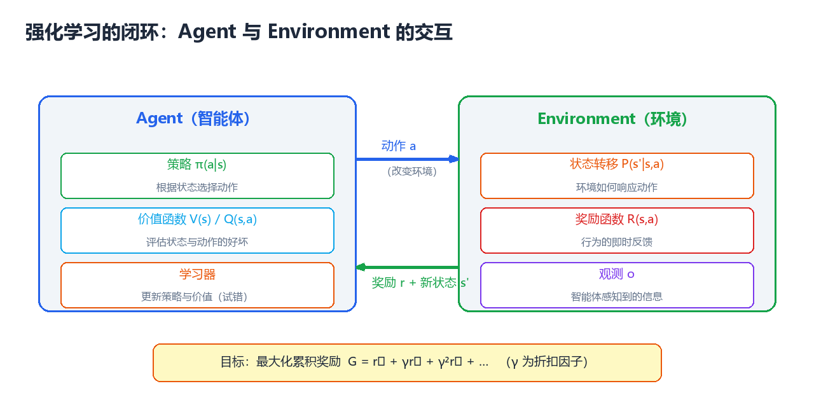
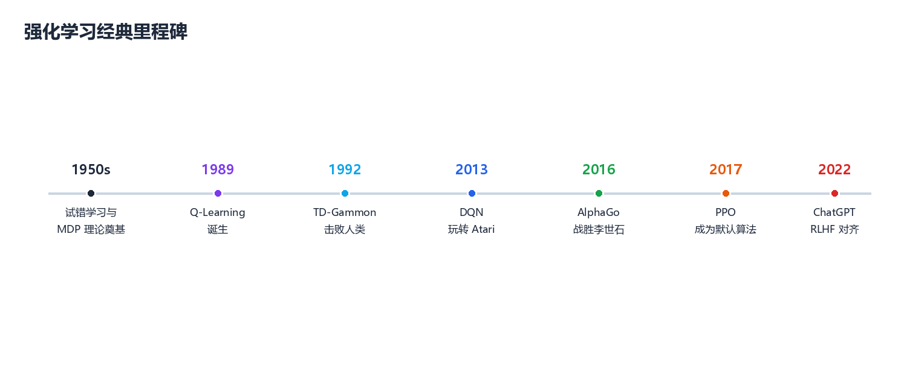
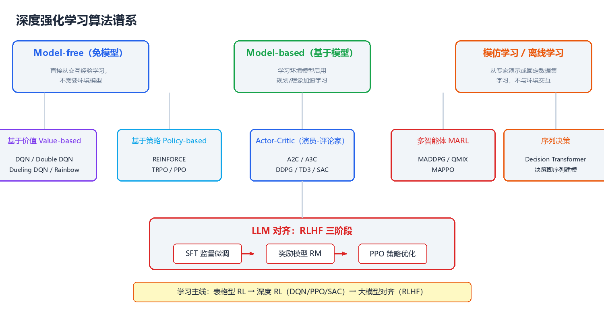

# 强化学习概览

> 本文是 CodeNebula 强化学习知识体系的纲领。从**设计哲学**出发，到**核心概念**、**技术全景**、**算法谱系**，再到**学习路径**，为你建立完整的强化学习世界观。全文假设读者具备基础 Python 与概率论知识，零机器学习基础亦可阅读。



---

## 一、强化学习的设计哲学

在深入任何算法之前，先理解强化学习区别于其他机器学习范式的核心思想——这些思想贯穿所有 RL 算法，是理解一切细节的钥匙。

### 1.1 奖励假设（Reward Hypothesis）

> **核心思想**：任何目标都可以被表述为"最大化累积奖励的期望"。

这是强化学习的**第一性原理**。下围棋的"赢棋"→ 转化为终局 +1/-1；训练机器人行走 → 前进距离转化为即时奖励；训练对话模型 → 人类偏好转化为奖励信号。Sutton 在《Reinforcement Learning: An Introduction》中将其表述为：

> *"That all of what we mean by goals and purposes can be well thought of as the maximization of the expected value of the cumulative sum of a received scalar signal (called reward)."*

奖励设计（Reward Design）因此成为 RL 工程中最重要也最棘手的问题——奖励给得不对，智能体就会学到你**不想要**的行为（即 Reward Hacking，见第 10 章）。

### 1.2 试错学习：三种学习范式的对比

| 维度 | 监督学习（SL） | 无监督学习（UL） | 强化学习（RL） |
|------|--------------|----------------|--------------|
| **目标** | 拟合输入→输出映射 | 发现数据内在结构 | 最大化累积奖励 |
| **数据来源** | 带标签的静态数据集 | 无标签静态数据集 | 与环境交互产生的轨迹 |
| **反馈形式** | 每个样本有正确标签 | 无反馈 | 稀疏的标量奖励（有延迟） |
| **错误纠正** | 直接对比标签 | 无 | 只能靠"试"和"事后归因" |
| **时间结构** | 样本独立同分布 | 样本独立同分布 | 序列决策，动作影响未来 |
| **典型任务** | 图像分类、机器翻译 | 聚类、降维 | 下棋、机器人控制、推荐 |
| **代表算法** | CNN、Transformer | K-Means、PCA | DQN、PPO、SAC |

**关键区别**：监督学习是"教"（告诉它对错），强化学习是"试"（做错了没人告诉你错在哪，只有事后算总账）。这引出了 RL 独有的两大难题——**信用分配**与**探索-利用困境**。

### 1.3 探索与利用困境（Exploration-Exploitation Dilemma）

> RL 最根本的矛盾：**利用**（Exploitation）——执行当前认为最优的动作，获得即时报偿；**探索**（Exploration）——尝试未知动作，获取信息以改进未来决策。

- **类比**：去一家新城市吃饭。每次都去评分最高的店（利用）→ 可能错过隐藏神店；每次都试新店（探索）→ 可能连续踩雷。最优策略是两者平衡。
- **数学表述**：这是一个经典的 regret 最小化问题——多臂老虎机（Multi-Armed Bandit）是它的最小模型，也是我们第 0 章的内容。
- **深度 RL 中的体现**：ε-greedy 随机探索、熵正则（SAC）、内在奖励（ICM/RND）、参数空间噪声。

### 1.4 信用分配问题（Credit Assignment Problem）

当智能体走完一整局棋才获得最终胜负奖励时，**哪一步棋"值得"这个奖励？** 这是 RL 独有的归因难题：

```
回合：s₀ →a₀→ s₁ →a₁→ s₂ →a₂→ s₃ →a₃→ s₄ ... → 终局奖励 R = +1
问题：这 +1 归功于哪几个动作？每一步对最终结果贡献多少？
```

- **蒙特卡洛方法**：整局结束，把总回报均摊给所有步骤（高方差、无偏）
- **时序差分方法**：每步用"当前奖励 + 下一步估计"更新（低方差、有偏）
- **策略梯度**：用累积回报加权动作概率，配合基线（Baseline）降低方差

### 1.5 经典格言背后的思想

| 格言 / 论断 | 出处 | 解读 |
|------------|------|------|
| **"强化学习是人工智能的第一个真正计算理论。"** | Sutton | RL 给出了智能体在不确定环境中学习的最一般框架 |
| **"所有智能都可以理解为最大化期望奖励。"** | 奖励假设 | 目标设计的统一视角 |
| **"RL 的痛苦在于：你永远在和自己的过去赛跑。"** | 社区共识 | 策略更新后，旧数据分布失效（非平稳性） |
| **"没有免费的午餐（No Free Lunch）。"** | Wolpert | 没有算法在所有任务上最优，选型取决于任务特性 |
| **"The bitter lesson."** | Rich Sutton（2019） | 通用方法（搜索 + 学习）长期胜过人工设计的特征与结构 |

---

## 二、核心概念：五要素

所有 RL 算法都围绕五个基本要素展开。理解它们的定义与关系，是阅读后续所有章节的前提。

| 要素 | 符号 | 定义 | 类比（下围棋） |
|------|------|------|--------------|
| **状态 State** | $s \in S$ | 智能体观察到的环境情况 | 当前棋盘局面 |
| **动作 Action** | $a \in A$ | 智能体可执行的选择 | 落子在某个交叉点 |
| **策略 Policy** | $\pi(a\|s)$ | 状态→动作的映射（RL 要学的对象） | 棋手的落子风格 |
| **奖励 Reward** | $r \in R$ | 环境对动作的即时反馈 | 提子得利 / 终局胜负 |
| **价值函数 Value** | $V(s), Q(s,a)$ | 对"未来累积奖励"的预期 | 局面优劣判断 |

**策略与价值的区别**（RL 最重要的两个概念）：

```
策略 π：我应该怎么做？        （行为准则）
价值 V：现在这局面有多好？    （状态评估）
```

- **策略搜索派**：直接优化策略（策略梯度、PPO）
- **价值评估派**：先学价值函数，再由价值导出策略（Q-Learning、DQN）
- **演员-评论家（Actor-Critic）**：两者结合，策略（演员）+ 价值（评论家）

### 2.1 马尔可夫决策过程（MDP）

绝大多数 RL 问题的数学框架：

```
MDP = (S, A, P, R, γ)
```

| 组成 | 含义 |
|------|------|
| $S$ | 状态集合（有限或无限） |
| $A$ | 动作集合 |
| $P(s'\|s,a)$ | 状态转移概率：在 s 执行 a 后到达 s' 的概率 |
| $R(s,a,s')$ | 奖励函数 |
| $\gamma \in [0,1]$ | 折扣因子：未来奖励的折现率 |

**马尔可夫性质**：下一状态只依赖于当前状态与动作，与更早的历史无关（$P(s_{t+1}|s_t,a_t) = P(s_{t+1}|s_t,a_t,s_{t-1},a_{t-1},...)$）。

**智能体的终极目标**：找到最优策略 $\pi^*$，最大化期望累积折扣回报：

$$G_t = \sum_{k=0}^{\infty} \gamma^k r_{t+k+1} = r_{t+1} + \gamma r_{t+2} + \gamma^2 r_{t+3} + \cdots$$

> **为什么需要折扣因子 γ？** ① 数学上保证无穷级数收敛；② 经济直觉——未来的收益不如当下的确定；③ 控制"远见"程度：γ→0 是短视（只看当下），γ→1 是远视（看重长远）。

---

## 三、技术全景：从表格到深度到对齐



强化学习的发展可以概括为**三次跃迁**：

```
1950s-1990s               2013-2016                2017-至今
┌──────────────┐        ┌──────────────┐        ┌──────────────┐
│  表格型 RL    │  ────► │   深度 RL     │  ────► │  RL 与 LLM   │
│ MDP 理论奠基  │        │ DQN 玩 Atari │        │ RLHF 对齐    │
│ Q-Learning   │        │ AlphaGo 屠龙 │        │ Agent 决策   │
│ TD-Gammon    │        │ 连续控制 DDPG │        │ 离线/多智能体 │
└──────────────┘        └──────────────┘        └──────────────┘
  状态表/查表             神经网络逼近价值/策略      大模型+RL 融合
```

- **表格型时代**：状态-动作空间小，用表格精确存储价值。代表：Q-Learning、SARSA、TD-Gammon。
- **深度时代**：深度神经网络作为函数逼近器，处理高维状态（像素、传感器）。代表：DQN、PPO、SAC、AlphaGo。
- **大模型时代**：RL 用于对齐 LLM（RLHF）、让 Agent 学会工具使用与多步推理。代表：ChatGPT、DeepSeek-R1。

### 3.1 算法谱系全景



**两大主干**（见第 5-7 章）：

| 分支 | 学习对象 | 代表算法 | 特点 | 适用场景 |
|------|---------|---------|------|---------|
| **基于价值** | 价值函数 Q(s,a) | DQN、Double DQN、Rainbow | 间接导出策略，样本效率较高 | 离散动作、Atari 游戏 |
| **基于策略** | 策略 π(a\|s) 直接 | REINFORCE、PPO | 直接优化目标，稳定 | 连续动作、机器人控制 |
| **Actor-Critic** | 两者结合 | A2C、DDPG、TD3、SAC | 综合二者优势，SOTA | 复杂连续控制、真实系统 |

---

## 四、技术选型框架

> **选型关键准则**：没有最好的算法，只有最适合任务的算法。下面按任务特性给出决策路径。

```
开始
 │
 ├─ 环境模型已知？ ──是──► 动态规划（第2章） / 基于模型的规划（第9章）
 │
 ├─ 动作空间是离散的？
 │    ├─ 是，状态低维 ─────► Q-Learning / SARSA（第4章）
 │    ├─ 是，状态高维 ─────► DQN 家族（第5章）
 │    └─ 否（连续动作）────► PPO / SAC（第6、7章）
 │
 ├─ 有专家演示数据？
 │    └─ 是，且不想要交互 ──► 模仿学习 / 离线 RL（第9章）
 │
 ├─ 多智能体博弈？ ─────────► MADDPG / MAPPO / QMIX（第9章）
 │
 └─ 目标是语言模型对齐？ ────► RLHF / DPO（第9章）
```

### 4.1 常用算法快速对照表

| 算法 | 类型 | 动作空间 | 样本效率 | 稳定性 | 一句话定位 |
|------|------|---------|---------|--------|-----------|
| Q-Learning | 价值 | 离散 | 低 | 中 | 表格型 RL 入门必修 |
| DQN | 价值 | 离散 | 中 | 中 | 深度 RL 的开山之作 |
| REINFORCE | 策略 | 任意 | 低 | 低 | 策略梯度最简单的形态 |
| A2C/A3C | AC | 任意 | 中 | 中 | 并行加速的 AC 经典 |
| PPO | AC | 任意 | 高 | **高** | **工业界默认首选** |
| DDPG | AC | 连续 | 高 | 低 | 连续控制先驱，调参难 |
| TD3 | AC | 连续 | 高 | 中 | DDPG 的稳健改进版 |
| SAC | AC | 连续 | **最高** | 高 | **连续控制 SOTA 首选** |

> **默认建议**：新任务不知道选什么 → 离散动作用 **DQN（入门）→ Rainbow（进阶）**，连续动作直接 **SAC 或 PPO**。PPO 是鲁棒性之王，SAC 是样本效率之王。

---

## 五、学习路径

> 按"每月一个里程碑"设计，假设每天投入 1-2 小时，有 Python 基础。

```
第 1 月  基础与表格型 RL
         ├─ 概率论回顾、MDP、贝尔曼方程（第1章）
         ├─ 动态规划：策略迭代 / 价值迭代（第2章）
         ├─ 多臂老虎机：ε-greedy / UCB / Thompson Sampling（第0章）
         └─ 🎯 里程碑：手写代码跑通 GridWorld 策略迭代
                    ↓
第 2 月  免模型经典算法
         ├─ 蒙特卡洛 + 时序差分（第3、4章）
         ├─ SARSA / Q-Learning / n-step TD
         └─ 🎯 里程碑：在 Cliff Walking 上对比 Q-Learning 与 SARSA 的收敛曲线
                    ↓
第 3 月  深度强化学习
         ├─ 函数逼近、DQN 与改进家族（第5章）
         ├─ 策略梯度、Actor-Critic、PPO（第6章）
         ├─ 熟悉 Gymnasium + Stable-Baselines3（第8章）
         └─ 🎯 里程碑：用 PPO 训练 CartPole / LunarLander 达到满分局
                    ↓
第 4 月  连续控制与进阶
         ├─ DDPG / TD3 / SAC（第7章）
         ├─ 多智能体、模仿学习、Model-based（第9章）
         └─ 🎯 里程碑：SAC 在 MuJoCo HalfCheetah 上跑出学习曲线
                    ↓
第 5-6 月 工程化与前沿
         ├─ 调参、评估、可复现性（第10章）
         ├─ 阅读经典论文（Spinning Up 论文清单）
         └─ 🎯 里程碑：完成一个端到端 RL 项目（训练→评估→部署）
```

**配套学习资源**：

| 资源 | 类型 | 定位 |
|------|------|------|
| Sutton & Barto《强化学习》(第 2 版) | 教材 | 理论圣经，前 6 章必读 |
| OpenAI Spinning Up | 在线课程 | 深度 RL 最佳入门，含代码 |
| David Silver 强化学习课程 | 视频 | 与 Sutton 教材配套的经典讲解 |
| UC Berkeley CS285 (Deep RL) | 课程 | 深度 RL 进阶，工程视角 |
| huggingface deep-rl-class | 课程 | 上手最快，带环境与代码练习 |
| Stable-Baselines3 文档 | 文档 | 工业级算法库参考 |

---

## 六、章节导航

| 章节 | 内容 | 难度 | 前置 |
|------|------|------|------|
| [第 0 章：多臂老虎机](./00-bandit.md) | 探索与利用的最小模型 | ⭐ | 概率基础 |
| [第 1 章：MDP 与数学基础](./01-mdp-foundations.md) | 状态/动作/奖励/贝尔曼方程 | ⭐⭐ | 第 0 章 |
| [第 2 章：动态规划](./02-dynamic-programming.md) | 策略迭代、价值迭代、GPI | ⭐⭐ | 第 1 章 |
| [第 3 章：蒙特卡洛方法](./03-monte-carlo-methods.md) | MC 预测/控制、MCTS | ⭐⭐ | 第 1 章 |
| [第 4 章：时序差分学习](./04-temporal-difference.md) | SARSA、Q-Learning、TD(λ) | ⭐⭐⭐ | 第 2、3 章 |
| [第 5 章：值函数逼近与 DQN](./05-value-approximation.md) | 经验回放、DQN 家族 | ⭐⭐⭐ | 第 4 章 |
| [第 6 章：策略梯度](./06-policy-gradient.md) | REINFORCE、AC、PPO | ⭐⭐⭐ | 第 4、5 章 |
| [第 7 章：连续控制](./07-continuous-control.md) | DDPG、TD3、SAC | ⭐⭐⭐⭐ | 第 6 章 |
| [第 8 章：环境与工具链](./08-tools-environments.md) | Gymnasium、MuJoCo、SB3 | ⭐⭐ | 任意章节 |
| [第 9 章：进阶专题](./09-advanced-topics.md) | MARL、RLHF、离线 RL | ⭐⭐⭐⭐ | 第 6、7 章 |
| [第 10 章：工程实践](./10-engineering-practice.md) | 调参、评估、避坑 | ⭐⭐⭐ | 全书 |

> **建议路线**：新手按 0→1→2→3→4→5→6→8→10 顺序精读；有监督学习基础的读者可从第 0 章快速跳到第 5 章；工程导向的读者可先读第 8 章搭建环境再回头补理论。

---

> **下一步**：从 [第 0 章：多臂老虎机](./00-bandit.md) 开始，用最小的模型理解"探索与利用"这一 RL 第一难题。
