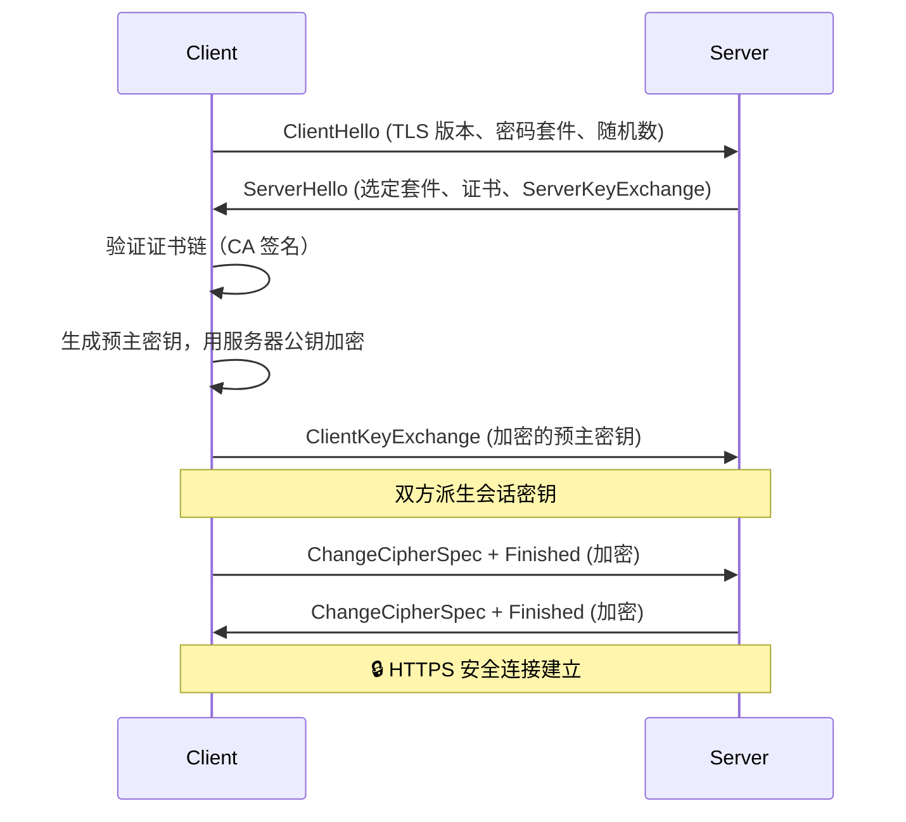

# 安全基础

> 安全不是功能，而是贯穿整个软件开发生命周期的思维模式。本文从密码学基础出发，系统覆盖认证授权、Web 安全、API 安全、基础设施安全、SSDLC 及合规隐私等核心领域，帮助开发者构建纵深防御体系。

---

## 一、密码学基础

### 1.1 对称加密

对称加密使用**同一个密钥**进行加密和解密。最广泛使用的标准是 **AES（Advanced Encryption Standard）**，支持 128、192 和 256 位密钥。

```python
from cryptography.hazmat.primitives.ciphers import Cipher, algorithms, modes
from cryptography.hazmat.primitives import padding
import os

def aes_encrypt(plaintext: bytes, key: bytes) -> tuple[bytes, bytes, bytes]:
    iv = os.urandom(16)  # 初始化向量（IV），必须随机
    cipher = Cipher(algorithms.AES(key), modes.GCM(iv))
    encryptor = cipher.encryptor()
    ciphertext = encryptor.update(plaintext) + encryptor.finalize()
    return ciphertext, iv, encryptor.tag  # GCM 模式自带认证标签
```

**AES 工作模式对比：**

| 模式 | 是否需要 IV | 并行解密 | 认证 | 推荐场景 |
|------|-----------|---------|------|---------|
| ECB | ❌ | ✅ | ❌ | **永不使用** — 相同明文块产生相同密文 |
| CBC | ✅ | ❌ | ❌ | 遗留兼容，需配合 HMAC |
| GCM | ✅ (nonce) | ✅ | ✅ (AEAD) | **强烈推荐** — 同时提供机密性+完整性 |
| CTR | ✅ (nonce) | ✅ | ❌ | 流加密场景，需额外认证 |

> **关键选择：** 始终选择 GCM 模式。它提供认证加密（AEAD），在同一操作中同时保证机密性和完整性，避免 CBC + HMAC 组合中容易出现的误用。

**密钥长度建议：** AES-128 安全强度足够（128 位密钥对抗暴力破解已远超可行范围），但行业标准已向 AES-256 迁移以应对未来量子计算威胁和合规要求。

### 1.2 非对称加密

非对称加密使用 **密钥对（Key Pair）**：公钥加密、私钥解密。

```python
from cryptography.hazmat.primitives.asymmetric import rsa, padding as asym_padding
from cryptography.hazmat.primitives import hashes

# 生成 RSA 密钥对
private_key = rsa.generate_private_key(public_exponent=65537, key_size=2048)
public_key = private_key.public_key()

# 使用公钥加密对称密钥（混合加密常见模式）
ciphertext = public_key.encrypt(
    session_key,
    asym_padding.OAEP(mgf=asym_padding.MGF1(algorithm=hashes.SHA256()),
                      algorithm=hashes.SHA256(), label=None)
)
```

**非对称算法对比：**

| 算法 | 密钥长度 | 性能 | 安全性 | 推荐用途 |
|------|---------|------|--------|---------|
| RSA | 2048/4096 bit | 慢 | 成熟 | 数字签名、密钥封装 |
| ECC | 256 bit (≈ RSA 3072) | 快 | 相同强度下密钥更短 | 签名（ECDSA）、密钥交换（ECDH） |
| Ed25519 | 32 byte | 极快 | 高（侧信道抗性强） | **推荐**：当前最佳签名算法 |

**数字签名流程：**

```go
// Go — Ed25519 签名与验证
import "crypto/ed25519"

func signMessage(privateKey ed25519.PrivateKey, msg []byte) []byte {
    return ed25519.Sign(privateKey, msg)  // 返回 64 字节签名
}

func verifySignature(publicKey ed25519.PublicKey, msg, sig []byte) bool {
    return ed25519.Verify(publicKey, msg, sig)
}
```

### 1.3 哈希函数

哈希函数将任意长度输入映射为固定长度的"指纹"。**好的哈希函数必须满足**：抗原像性（单向）、抗第二原像性（给定输入难找相同哈希的另一输入）、抗碰撞性（难找任意两个相同哈希的输入）。

```python
import hashlib

# SHA-256 基础用法
digest = hashlib.sha256(b"hello").hexdigest()
# 输出: 2cf24dba5fb0a30e26e83b2ac5b9e29e1b161e5c1fa7425e73043362938b9824
```

**常见哈希算法安全状态：**

| 算法 | 输出长度 | 碰撞安全 | 状态 |
|------|---------|---------|------|
| MD5 | 128 bit | ❌ 可被快速碰撞 | **禁止使用** |
| SHA-1 | 160 bit | ❌ SHAttered 攻击 | **禁止使用** |
| SHA-256 | 256 bit | ✅ | 推荐 |
| SHA-3-256 | 256 bit | ✅ | 推荐（新一代标准） |
| BLAKE2b | 可变 | ✅ | 性能优于 SHA-3 |

> **⚠️ 通行证哈希 ≠ 通用哈希：** 不要用 SHA-256 直接哈希密码！必须使用专门的密码哈希函数（见第 2.1 节）。

**彩虹表与盐值：** 攻击者可以预先计算海量常见密码的哈希值（彩虹表），快速逆向查找。加盐（Salting）使每个用户即使相同密码也产生不同哈希。

### 1.4 密钥交换与 TLS

**Diffie-Hellman 密钥交换** 允许双方在不安全的信道上协商共享密钥。**ECDH（椭圆曲线 Diffie-Hellman）** 是其椭圆曲线版本，更高效。



**TLS 1.3 相比 1.2 的关键改进：**
- 握手从 2-RTT 降至 **1-RTT**（复用连接 0-RTT）
- 移除了不安全的密码套件（RC4、CBC 模式、RSA 密钥交换）
- 强制使用 **前向保密（Perfect Forward Secrecy）** — 即使私钥泄露，过去的会话也无法被解密

**证书链验证路径：**
```
根 CA（自签名，预置于操作系统/浏览器）
  └── 中间 CA（由根 CA 签名）
       └── 服务器证书（由中间 CA 签名）
            └── subjectAltName = *.example.com
```

---

## 二、认证与授权

### 2.1 密码存储

**绝对禁止：** 明文存储、MD5/SHA-1/SHA-256 直接哈希、Base64 编码、自加密。

**正确做法：** 使用专为密码设计的慢速哈希函数。

```python
import bcrypt

# 注册：生成哈希
password = b"SecureP@ss123!"
salt = bcrypt.gensalt(rounds=12)   # rounds=12 ≈ 250ms
hashed = bcrypt.hashpw(password, salt)

# 登录：验证
if bcrypt.checkpw(input_password, stored_hash):
    print("认证通过")
```

**密码哈希算法对比：**

| 算法 | 设计 | 抗 GPU/ASIC | 可调参数 | 推荐度 |
|------|------|-------------|---------|-------|
| bcrypt | 1999 | ⭐⭐⭐ | cost factor | ★★★★ 广泛使用 |
| argon2id | 2015 (PHC 胜出) | ⭐⭐⭐⭐⭐ | time/mem/parallel | ★★★★★ **首选** |
| scrypt | 2009 | ⭐⭐⭐⭐ | N/r/p | ★★★★ 内存硬 |
| PBKDF2 | 2000 | ⭐ | iterations | ★★ CPU 易并行 |

```python
from argon2 import PasswordHasher, Type

ph = PasswordHasher(
    time_cost=3,          # 迭代次数
    memory_cost=65536,    # 64MB 内存消耗
    parallelism=4,        # 并行线程
    hash_len=32,          # 输出哈希长度
    type=Type.ID          # argon2id — 同时抗侧信道和 GPU 攻击
)
hash_str = ph.hash("my_password")
ph.verify(hash_str, "my_password")  # 自动解析参数并验证
```

**Pepper（密钥胡椒）：** 在哈希前追加一个应用级秘密（存储在 HSM 或外部密钥服务中），即使数据库泄露，攻击者也无法离线破解。

**密码策略（NIST SP 800-63B 最新指南）：**
- 最小长度 **8 字符**（推荐 12+）
- 重点检查**常见密码黑名单**（top 10000 密码库）
- 不再强制要求大小写+数字+符号组合
- 支持所有 ASCII + Unicode 字符
- 允许粘贴密码
- 不强制周期性轮换（除非怀疑泄露）

### 2.2 多因素认证（MFA）

| 因素类型 | 示例 | 安全强度 |
|---------|------|---------|
| 知识因素（你知道） | 密码、PIN | ⭐ |
| 持有因素（你有） | TOTP、硬件密钥 | ⭐⭐⭐ |
| 固有因素（你是谁） | 指纹、面部识别 | ⭐⭐ |

**TOTP（基于时间的一次性密码）实现原理：**

```python
import hmac, struct, time, base64

def generate_totp(secret: str, interval: int = 30) -> str:
    key = base64.b32decode(secret.upper())
    counter = struct.pack(">Q", int(time.time() // interval))
    h = hmac.new(key, counter, "sha1").digest()
    offset = h[-1] & 0x0F
    code = struct.unpack(">I", h[offset:offset+4])[0] & 0x7FFFFFFF
    return f"{code % 1000000:06d}"
```

> **推荐排序：** WebAuthn/FIDO2 硬件密钥 > TOTP 应用 > SMS（SMS 易受 SIM Swap 攻击，尽可能避免）。

### 2.3 会话管理

```python
# 安全的会话配置示例（Python Flask）
app.config.update(
    SECRET_KEY=os.environ["FLASK_SECRET"],  # 从环境变量读取，绝不硬编码
    SESSION_COOKIE_HTTPONLY=True,           # 禁止 JavaScript 访问
    SESSION_COOKIE_SECURE=True,             # 仅 HTTPS
    SESSION_COOKIE_SAMESITE='Lax',          # 防 CSRF
    PERMANENT_SESSION_LIFETIME=timedelta(hours=1),
    SESSION_REFRESH_EACH_REQUEST=True       # 滑动过期
)
```

**会话安全黄金法则：**
1. **会话 ID 不可预测** — 使用 `os.urandom(32)` 或系统 CSPRNG 生成，长度 ≥ 128 位
2. **登录后旋转会话 ID** — 防止会话固定攻击（Session Fixation）
3. **登出时销毁会话** — 清除服务器端和客户端会话数据
4. **设置合理超时** — 无操作 15-30 分钟后过期，敏感操作（银行）更短
5. **Cookie 属性** — 始终设置 `HttpOnly`、`Secure`、`SameSite`

### 2.4 JWT 深入剖析

JWT（JSON Web Token）由三部分组成：`header.payload.signature`。

```
eyJhbGciOiJSUzI1NiIsInR5cCI6IkpXVCJ9.
eyJzdWIiOiIxMjM0NTY3ODkwIiwibmFtZSI6IkpvaG4gRG9lIiwiaWF0IjoxNTE2MjM5MDIyfQ.
SflKxwRJSMeKKF2QT4fwpMeJf36POk6yJV_adQssw5c
```

**关键字段：**
```json
{
  "alg": "RS256",
  "typ": "JWT",
  "kid": "key-id-1"
}
.
{
  "sub": "user_12345",
  "iat": 1700000000,
  "exp": 1700003600,
  "iss": "https://auth.example.com",
  "aud": "api.example.com",
  "jti": "unique-token-id"
}
```

**RS256 vs HS256：**

| 特性 | HS256 (HMAC + SHA-256) | RS256 (RSA + SHA-256) |
|------|------------------------|----------------------|
| 密钥类型 | 对称（单一密钥） | 非对称（公/私钥对） |
| 签名/验证 | 同一密钥 | 私钥签名，公钥验证 |
| 密钥分发 | 必须安全共享 | 公钥可公开 |
| 风险 | 服务端可伪造 Token | 仅认证服务器可签发 |
| 推荐 | ❌ 不推荐用于微服务 | ✅ 标准选择 |

> **⚠️ 「alg: none」漏洞：** 老旧的 JWT 库可能接受 `alg: none` 的令牌（无签名验证）。务必配置库时指定允许的算法白名单。

**JWT 常见漏洞：**
1. **算法混淆攻击** — 服务器预期 RS256，攻击者将 alg 改为 HS256，用泄露的公钥作为 HMAC 密钥签名
2. **过期令牌未正确验证** — 忽略 `exp`、`nbf` 声明
3. **敏感数据泄露** — payload 仅 Base64 编码（非加密），JWT 永不应存放密码/信用卡等敏感信息
4. **无绑定到会话** — JWT 无退出机制（除非使用黑名单或短有效期）

### 2.5 OAuth 2.0 与 OpenID Connect

**授权码流程（Authorization Code + PKCE）——当前推荐方案：**

```
┌─────────┐          ┌───────────┐          ┌──────────┐
│  前端    │          │  后端服务  │          │ 授权服务器│
│ (SPA)   │          │  (API)    │          │ (Auth0)  │
└────┬────┘          └─────┬─────┘          └─────┬────┘
     │                     │                      │
     │  1. 登录请求         │                      │
     │─────────────────────┼─────────────────────>│
     │  2. 授权码（code）    │                      │
     │<────────────────────┼──────────────────────│
     │                     │                      │
     │  3. code + code_verifier 交换令牌            │
     │─────────────────────>                      │
     │                     │   4. 返回 access_token│
     │<────────────────────│──────────────────────│
     │                     │                      │
     │  5. API 请求 + Bearer Token                │
     │─────────────────────>                      │
     │                     │  6. 验证 Token        │
     │                     │<─────────────────────│
     │                     │  7. 返回资源          │
     │<────────────────────│                      │
```

**为什么需要 PKCE：** 传统授权码流程依赖客户端密钥（client_secret），但 SPA/移动端无法安全存储密钥。PKCE 使用动态生成的 `code_verifier` 和 `code_challenge`，即使是公开客户端也能安全使用。

**OAuth 2.0 与 OpenID Connect 的关系：**
- **OAuth 2.0**：授权框架，关注"能不能访问资源"
- **OpenID Connect (OIDC)**：在 OAuth 2.0 之上添加认证层，关注"你是谁"
- OIDC 额外返回 `id_token`（JWT 格式），包含用户身份信息

### 2.6 RBAC vs ABAC vs ReBAC

| 模型 | 全称 | 核心概念 | 粒度 | 适用场景 |
|------|------|---------|------|---------|
| **RBAC** | Role-Based Access Control | 角色 → 权限 | 粗 | 企业管理系统、CMS |
| **ABAC** | Attribute-Based Access Control | 属性规则（用户/资源/环境） | 细 | 金融、医疗、多云 |
| **ReBAC** | Relationship-Based Access Control | 资源间关系图 | 动态 | Google Drive、GitHub |

```python
# ABAC 策略示例（使用 Casbin/OPA 风格）
policy = """
允许操作当且仅当：
  user.department == resource.owner_department AND
  user.clearance_level >= resource.required_clearance AND
  time.now() BETWEEN resource.access_window.start AND resource.access_window.end
"""
```

---

## 三、Web 安全（OWASP Top 10）

### 3.1 SQL 注入

**攻击类型：**
- **In-Band（同信道）** — 攻击和结果在同一通道返回
- **Blind（盲注）** — 通过 `true/false` 响应推断数据
- **Out-of-Band（带外）** — 通过 DNS/HTTP 请求外传数据

**预防措施：**

```python
# ❌ 错误：字符串拼接
query = f"SELECT * FROM users WHERE username = '{username}' AND password = '{password}'"

# ✅ 正确：参数化查询
import sqlite3
cursor.execute("SELECT * FROM users WHERE username = ? AND password = ?",
               (username, password))

# ORM 方式（SQLAlchemy）
users = session.query(User).filter(User.username == username, User.password == password).all()
```

**防御层次（纵深防御）：**
1. **第一道防线：参数化查询 / ORM** — 杜绝拼接
2. **第二道防线：输入验证** — 白名单允许的字符
3. **第三道防线：WAF** — 检测已知攻击模式
4. **第四道防线：最小权限原则** — 数据库账户仅具有必要权限

### 3.2 XSS（跨站脚本攻击）

| 类型 | 触发方式 | 持久性 | 危害 |
|------|---------|--------|------|
| Stored XSS | 存储在数据库，用户访问页面时触发 | ✅ 永久 | 高危 — 所有访问者受影响 |
| Reflected XSS | URL/请求参数中注入，即时反射 | ❌ 一次性 | 需诱导用户点击 |
| DOM-based XSS | 客户端 JavaScript 动态处理不可信输入 | ❌ | 绕过服务端过滤 |

**预防策略：**

```html
<!-- CSP（Content Security Policy）HTTP 响应头 -->
Content-Security-Policy: default-src 'self'; 
                       script-src 'self' https://cdn.example.com;
                       style-src 'self' 'unsafe-inline';
                       img-src 'self' data:;
                       object-src 'none';
                       base-uri 'none';

<!-- 输出编码 — 根据上下文使用不同编码策略 -->
<div>${escapeHtml(userInput)}</div>         <!-- HTML 实体编码 -->
<a href="${escapeUrl(userInput)}">...</a>   <!-- URL 编码 -->
<script>var x = ${escapeJs(userInput)}</script> <!-- JavaScript 编码 -->
```

> **不要依赖 `X-XSS-Protection`** — 该标头已被浏览器废弃（Chrome 和 Edge 已移除），CSP 是正确方案。

### 3.3 CSRF（跨站请求伪造）

**工作原理：** 用户登录 A 站后，在未登出的情况下访问恶意 B 站，B 站构造请求冒用 A 站的用户身份。

**三重防御机制：**

```python
# 1. CSRF Token（服务端验证）
from flask_wtf.csrf import CSRFProtect
csrf = CSRFProtect(app)  # 为每个表单生成 Token，在服务器验证

# 2. SameSite Cookie（浏览器原生防御）
Set-Cookie: session=abc123; SameSite=Strict; HttpOnly; Secure
# Strict — 完全禁止跨站请求携带 Cookie
# Lax — 允许顶级导航（GET 请求）— 推荐默认值
# None — 允许所有跨站请求（需同时设置 Secure）

# 3. Double Submit Cookie — 将 Token 同时放在 Cookie 和请求头中，
# 服务器验证两者是否一致（适用于无状态架构）
```

### 3.4 SSRF（服务端请求伪造）

攻击者控制服务端发起请求，访问内部网络资源。

**预防措施：**

```python
import ipaddress
from urllib.parse import urlparse

def validate_url(url: str) -> bool:
    parsed = urlparse(url)
    try:
        # 1. 解析 IP，禁止内网地址
        ip = ipaddress.ip_address(socket.gethostbyname(parsed.hostname))
        if ip.is_private or ip.is_loopback or ip.is_link_local:
            return False
        # 2. 白名单协议
        if parsed.scheme not in ("https",):
            return False
        # 3. DNS rebinding 防护：解析后再次验证
        return True
    except Exception:
        return False
```

### 3.5 其他 OWASP Top 10 关键项

**Insecure Deserialization（不安全的反序列化）：**

```python
# ❌ 危险：pickle 反序列化可执行任意代码
data = base64.b64decode(request.cookies.get("session"))
obj = pickle.loads(data)  # 攻击者可构造恶意 payload

# ✅ 安全：使用 JSON/YAML 等结构化格式（或验证签名后反序列化）
obj = json.loads(request.cookies.get("session"))
```

**组件漏洞治理：** 维护 SBOM（Software Bill of Materials）、配置 Dependabot/Renovate 自动更新、CI/CD 中集成 Trivy/Snyk 扫描。

---

## 四、API 安全

### 4.1 速率限制

```python
# Token Bucket 算法实现
import time
from collections import defaultdict

class TokenBucket:
    def __init__(self, rate: float, capacity: int):
        self.rate = rate          # 令牌填充速率（/秒）
        self.capacity = capacity  # 桶容量（最大突发）
        self.tokens = defaultdict(lambda: capacity)
        self.last_refill = defaultdict(time.time)

    def allow(self, key: str) -> bool:
        now = time.time()
        elapsed = now - self.last_refill[key]
        self.tokens[key] = min(self.capacity,
                               self.tokens[key] + elapsed * self.rate)
        self.last_refill[key] = now
        if self.tokens[key] >= 1:
            self.tokens[key] -= 1
            return True
        return False

# 使用 Redis 的滑动窗口（生产环境推荐）
# 返回 `X-RateLimit-Remaining` / `Retry-After` 头
```

**限制策略对比：**

| 策略 | 粒度 | 实现复杂度 | 公平性 |
|------|------|-----------|--------|
| 每 IP 限流 | 粗 | 低 | API 公共端点 |
| 每用户限流 | 细 | 中 | 经过认证的 API |
| 每 IP+用户 组合 | 最细 | 高 | 高安全场景 |

### 4.2 输入验证

```python
from pydantic import BaseModel, Field, EmailStr, validator

class CreateUserRequest(BaseModel):
    username: str = Field(..., min_length=3, max_length=32, pattern=r"^[a-zA-Z0-9_]+$")
    email: EmailStr
    age: int = Field(..., ge=0, le=150)

    @validator("username")
    def no_reserved_names(cls, v):
        if v.lower() in ("admin", "root", "system"):
            raise ValueError("reserved username")
        return v
```

**白名单 vs 黑名单：** 始终优先使用白名单（allowlist）——定义什么是允许的，拒绝所有其他输入。黑名单（denylist）容易被绕过（如 SQL 注入过滤 `'` 但忽略 `\`）。

### 4.3 CORS 最小权限配置

```nginx
# Nginx 配置：仅允许特定来源
add_header Access-Control-Allow-Origin "https://app.example.com" always;
add_header Access-Control-Allow-Methods "GET, POST" always;
add_header Access-Control-Allow-Credentials "true" always;
add_header Access-Control-Max-Age 86400 always;
# 绝不能设置为 Access-Control-Allow-Origin: *
```

### 4.4 gRPC 安全

```go
// gRPC 服务端 TLS + 认证拦截器
func main() {
    creds, _ := credentials.NewServerTLSFromFile("server.crt", "server.key")
    interceptor := func(ctx context.Context, req interface{}, info *grpc.UnaryServerInfo, handler grpc.UnaryHandler) (interface{}, error) {
        token, err := ExtractBearerToken(ctx)
        if err != nil || !validateToken(token) {
            return nil, status.Errorf(codes.Unauthenticated, "invalid token")
        }
        return handler(ctx, req)
    }
    srv := grpc.NewServer(
        grpc.Creds(creds),
        grpc.UnaryInterceptor(interceptor),
    )
}
```

### 4.5 GraphQL 安全

```graphql
# 查询深度限制（防止嵌套过深导致性能问题）
# depth: 3
query {
  user(id: "1") {       # depth 1
    posts {              # depth 2
      comments {         # depth 3 （达到限制）
        author {         # ❌ 被拒绝
          name
        }
      }
    }
  }
}
```

```python
# 费用分析 — 为每个字段分配复杂度
type Query {
  users: [User!]!        @cost(complexity: 10)
  searchUsers(q: String!): [User!]! @cost(complexity: 50, multipliers: ["q"])
}
```

---

## 五、基础设施安全

### 5.1 网络安全

| 概念 | 传统架构 | 零信任架构 |
|------|---------|-----------|
| 网络位置 | 内网 = 信任，外网 = 不信任 | **永不信任，始终验证** |
| 访问策略 | 基于 IP | 基于身份 + 设备 + 上下文 |
| 微分段 | ❌ 扁平网络 | ✅ 每服务独立安全组 |
| 默认行为 | 允许内部流量 | 所有流量显式白名单 |

**AWS 安全组示例（最小权限）：**
```
入站规则：
  HTTP    0.0.0.0/0       tcp:80        # ALB
  HTTPS   0.0.0.0/0       tcp:443       # ALB
  MySQL   sg-app-tier     tcp:3306      # 仅应用层可访问

出站规则：
  全部     0.0.0.0/0       ALL           # 出站按需限制
```

### 5.2 容器安全

```dockerfile
# 最小基础镜像 — 使用 distroless 替代完整操作系统
FROM gcr.io/distroless/base-debian12:latest

# 以非 root 用户运行
USER 65532:65532

# 只读根文件系统
# docker run --read-only --tmpfs /tmp ...
```

```yaml
# Kubernetes Pod 安全上下文
apiVersion: v1
kind: Pod
metadata:
  name: secure-pod
spec:
  securityContext:
    runAsNonRoot: true
    seccompProfile:
      type: RuntimeDefault
  containers:
  - name: app
    image: myapp:1.0
    securityContext:
      allowPrivilegeEscalation: false
      capabilities:
        drop: ["ALL"]
      readOnlyRootFilesystem: true
```

### 5.3 Kubernetes 安全

**RBAC 最小权限：**
```yaml
apiVersion: rbac.authorization.k8s.io/v1
kind: Role
metadata:
  namespace: default
  name: pod-reader
rules:
- apiGroups: [""]
  resources: ["pods", "pods/log"]
  verbs: ["get", "list", "watch"]
---
# 绝不在集群级别绑定——使用 RoleBinding 限制到 namespace
```

**NetworkPolicy — 默认拒绝入站：**
```yaml
apiVersion: networking.k8s.io/v1
kind: NetworkPolicy
metadata:
  name: default-deny-ingress
spec:
  podSelector: {}
  policyTypes:
  - Ingress
```

**Secrets 加密：** 默认情况下 Kubernetes Secrets 仅 Base64 编码存储在 etcd 中。务必开启 etcd 加密或使用外部密钥管理：

```yaml
# EncryptionConfiguration
apiVersion: apiserver.config.k8s.io/v1
kind: EncryptionConfiguration
resources:
- resources: ["secrets"]
  providers:
  - kms:
      name: myKMSProvider
      endpoint: unix:///var/run/kms-provider.sock
  - aesgcm:
      keys:
      - name: key1
        secret: c2VjcmV0IGlzIHNlY3VyZQ==
  - identity: {}
```

### 5.4 密钥管理

| 方案 | 适用场景 | 安全等级 |
|------|---------|---------|
| 环境变量 | 开发环境、CI/CD 非敏感 | ⭐ |
| Vault (HashiCorp) | 企业级动态密钥 | ⭐⭐⭐⭐⭐ |
| AWS Secrets Manager | AWS 原生、自动轮换 | ⭐⭐⭐⭐ |
| Kubernetes External Secrets | K8s 集成外部密钥服务 | ⭐⭐⭐⭐ |
| HSM (硬件安全模块) | 最高安全需求 | ⭐⭐⭐⭐⭐ |

```hcl
# Vault 动态密钥示例（每次请求获取临时数据库凭据）
path "database/creds/my-role" {
  capabilities = ["read"]
}
# 返回：租期 1 小时的临时用户名/密码
```

---

## 六、安全开发生命周期（SSDLC）

### 6.1 威胁建模（STRIDE）

| 类别 | 威胁 | 示例 | 缓解 |
|------|------|------|------|
| **S**poofing | 身份假冒 | 伪造 JWT | 强认证、签名验证 |
| **T**ampering | 数据篡改 | SQL 注入 | 输入验证、HMAC |
| **R**epudiation | 抵赖 | 删除日志 | 审计日志、数字签名 |
| **I**nformation Disclosure | 信息泄露 | 堆栈跟踪暴露 | 错误处理、加密 |
| **D**enial of Service | 拒绝服务 | 穷举请求 | 限流、自动缩放 |
| **E**levation of Privilege | 权限提升 | IDOR | RBAC、最小权限 |

**DREAD 风险评估模型：**
- **D**amage（损害程度）
- **R**eproducibility（可重现性）
- **E**xploitability（可利用性）
- **A**ffected Users（受影响用户）
- **D**iscoverability（可发现性）

评分范围 1-10，总分 ≥ 12 为高风险，需优先修复。

### 6.2 安全工具链

| 阶段 | 工具类型 | 工具示例 | 集成方式 |
|------|---------|---------|---------|
| 编码 | SAST（静态分析） | SonarQube, Semgrep, CodeQL | IDE 插件 + pre-commit |
| 构建 | SCA（组件分析） | Snyk, Dependabot, Trivy | CI/CD pipeline |
| 测试 | DAST（动态分析） | OWASP ZAP, Burp Suite | 集成测试阶段 |
| 预发布 | 容器扫描 | Trivy, Clair, Anchore | 镜像构建后 |
| 生产 | RASP（运行时防护） | Contrast, Hdiv | 应用内代理 |

```yaml
# GitHub Actions — 安全扫描流水线
name: Security Scan
on: [push, pull_request]
jobs:
  security:
    runs-on: ubuntu-latest
    steps:
      - uses: actions/checkout@v4
      - name: SAST (Semgrep)
        uses: semgrep/semgrep-action@v1
        with:
          config: p/owasp-top-ten
      - name: Dependency Scan
        uses: snyk/actions/python@master
        env:
          SNYK_TOKEN: ${{ secrets.SNYK_TOKEN }}
      - name: Docker Scan
        uses: aquasecurity/trivy-action@master
        with:
          image-ref: myapp:${{ github.sha }}
          exit-code: 1              # 发现漏洞则构建失败
          severity: HIGH,CRITICAL   # 仅阻止高危漏洞
```

### 6.3 安全门禁策略

```
代码提交 → SAST 扫描 → 依赖扫描 → 构建 → 容器扫描 → 集成测试(DAST) → 部署
  │           │          │          │        │           │
  ▼           ▼          ▼          ▼        ▼           ▼
失败阻塞    >1高危阻塞   >1高危阻塞  失败阻塞  >1严重阻塞   >1高危阻塞
```

> **策略原则：** 在 CI/CD 中设置清晰的阈值。例如：任何 CRITICAL 漏洞阻止合并，HIGH 漏洞 7 天内须修复，MEDIUM 漏洞在发布前修复。允许例外需安全团队审批。

### 6.4 事件响应计划

**NIST 事件响应框架：**

1. **准备（Preparation）** — 建立响应团队（CSIRT）、制定手册、培训
2. **检测与分析（Detection & Analysis）** — SIEM 告警、异常检测、日志聚合
3. **遏制、清除与恢复（Containment, Eradication & Recovery）** — 隔离受影响系统、清除后门、从备份恢复
4. **事后分析（Post-Incident）** — 根本原因分析、改进措施、报告

---

## 七、合规与隐私

### 7.1 GDPR 要点

| 要求 | 说明 | 技术实现 |
|------|------|---------|
| 数据主体权利 | 访问、更正、删除、可移植性 | 用户数据导出 API、账户删除 |
| 明确同意 | 选择加入（opt-in），不可默认勾选 | 同意记录、分层 Cookie 横幅 |
| 泄露通知 | 72 小时内通知监管机构 | 自动化告警+通知流程 |
| 数据保护官 | 大规模数据处理必须任命 DPO | 组织架构要求 |
| 数据保护影响评估 | 高风险处理前进行 DPIA | 合规文档流程 |
| 跨境传输 | 充分性决定/SCCs/BCR | 数据驻留管控 |

### 7.2 数据分类

```yaml
# 数据分类标签示例
data_classification:
  public:
    description: 公开信息，无需保护
    examples: ["产品名称", "公开文档"]
    controls: ["基本安全"]
  
  internal:
    description: 内部信息，泄露有轻微影响
    examples: ["内部 Wiki", "组织架构"]
    controls: ["访问控制", "培训"]
  
  confidential:
    description: 敏感信息，泄露有重大影响
    examples: ["客户数据", "财务报告"]
    controls: ["加密存储", "传输加密", "审计日志"]
  
  restricted:
    description: 最高敏感度，泄露有极端影响
    examples: ["密码", "PII", "支付卡信息"]
    controls: ["加密+HSM", "最小权限+审批", "实时监控"]
```

### 7.3 匿名化 vs 假名化

| 特性 | 匿名化（Anonymization） | 假名化（Pseudonymization） |
|------|------------------------|--------------------------|
| 定义 | 永久移除个人身份标识 | 用假名替代直接标识符 |
| 是否 GDPR 适用数据 | ❌ 不再属于个人数据 | ✅ 仍属于个人数据 |
| 可逆性 | ❌ 不可逆 | ✅ 可通过映射恢复 |
| 常见技术 | 泛化、扰动、k-匿名、差分隐私 | 哈希、Tokenization、加密 |

> **工程建议：** 生产环境存储的数据应始终假名化处理——用不可逆哈希替代用户 ID 用于分析，保留单独的安全映射表用于必要时的身份恢复。日志中永远不要记录原始 PII。

### 7.4 审计日志

```python
# 结构化的审计日志（不可否认性）
import structlog
import json

audit_logger = structlog.get_logger("audit")

def log_audit_event(user_id: str, action: str, resource: str, result: str):
    audit_logger.info("audit_event",
        event_id=os.urandom(8).hex(),      # 唯一事件 ID
        timestamp=datetime.utcnow().isoformat(),
        user_id=user_id,
        action=action,                      # user.delete, role.assign, config.change
        resource=resource,
        result=result,                      # success / denied / failure
        source_ip=request.remote_addr,
        user_agent=request.user_agent.string,
    )
```

**审计日志最佳实践：**
- **不可篡改** — 写入专门的日志服务（如 AWS CloudTrail），使用 append-only 存储
- **时间同步** — 所有节点使用 NTP，时间戳精确到毫秒
- **可搜索** — 结构化 JSON 格式，索引关键字段
- **保留策略** — 根据合规要求保留（GDPR 要求最长 3 年，PCI-DSS 要求 1 年）
- **监控告警** — 对异常模式（多次登录失败、权限提升）实时告警

---

## 安全核对清单

### 开发阶段
- [ ] 使用参数化查询，杜绝 SQL 注入
- [ ] 所有密码使用 argon2id/bcrypt 哈希
- [ ] 输入验证使用白名单 + schema 验证
- [ ] 输出编码根据上下文（HTML/JS/URL/CSS）
- [ ] JWT 使用 RS256/Ed25519，验证 `exp`/`nbf`/`aud`
- [ ] TLS 1.3，禁用不安全的密码套件
- [ ] 最小权限原则（数据库、API、IAM）

### CI/CD 阶段
- [ ] SAST 扫描（Semgrep/CodeQL）集成到 PR 流程
- [ ] 依赖扫描（Snyk/Trivy），CRITICAL 漏洞阻断
- [ ] 容器镜像扫描 + 最小基础镜像
- [ ] Secret 扫描（防止密钥硬编码）

### 运维阶段
- [ ] 启用审计日志并配置告警
- [ ] 定期轮换密钥和证书
- [ ] 定期渗透测试 + 漏洞扫描
- [ ] 事件响应演练

---

> **参考资源：**
> - OWASP Top 10 (2021) — https://owasp.org/Top10/
> - NIST SP 800-63B — 数字身份指南
> - NIST CSF — 网络安全框架
> - GDPR 全文 — https://gdpr.eu/
> - Mozilla Observatory — TLS/Web 安全评分
